# Arabica 2026 - Архитектура приложения

> **ПРАВИЛО:** Этот файл заполняется и редактируется ТОЛЬКО по явной просьбе пользователя. Не добавлять и не изменять разделы самостоятельно.

---

## 1. Управление данными - МАГАЗИНЫ

### 1.1 Обзор модуля

**Назначение:** Центральный модуль для управления магазинами сети кофеен. Предоставляет данные о магазинах всем остальным модулям приложения.

**Файлы модуля:**
```
lib/features/shops/
├── models/
│   ├── shop_model.dart           # Модель магазина
│   └── shop_settings_model.dart  # Настройки магазина (РКО, смены)
├── pages/
│   ├── shops_management_page.dart  # Управление магазинами
│   └── shops_on_map_page.dart      # Магазины на карте
└── services/
    └── shop_service.dart           # API сервис
```

---

### 1.2 Модели данных

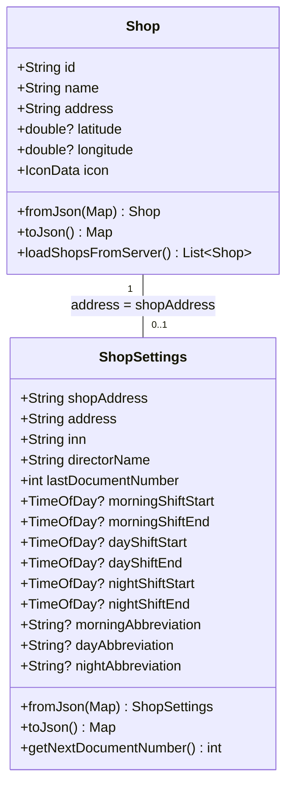
```mermaid
classDiagram
    class Shop {
        +String id
        +String name
        +String address
        +double? latitude
        +double? longitude
        +IconData icon
        +fromJson(Map) Shop
        +toJson() Map
        +loadShopsFromServer() List~Shop~
    }

    class ShopSettings {
        +String shopAddress
        +String address
        +String inn
        +String directorName
        +int lastDocumentNumber
        +TimeOfDay? morningShiftStart
        +TimeOfDay? morningShiftEnd
        +TimeOfDay? dayShiftStart
        +TimeOfDay? dayShiftEnd
        +TimeOfDay? nightShiftStart
        +TimeOfDay? nightShiftEnd
        +String? morningAbbreviation
        +String? dayAbbreviation
        +String? nightAbbreviation
        +fromJson(Map) ShopSettings
        +toJson() Map
        +getNextDocumentNumber() int
    }

    Shop "1" -- "0..1" ShopSettings : address = shopAddress
```

---

### 1.3 Связи с другими модулями

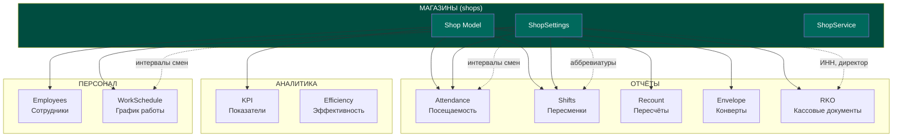
```mermaid
flowchart TB
    subgraph SHOPS["МАГАЗИНЫ (shops)"]
        SM[Shop Model]
        SS[ShopSettings]
        SVC[ShopService]
    end

    subgraph REPORTS["ОТЧЁТЫ"]
        ATT[Attendance<br/>Посещаемость]
        SH[Shifts<br/>Пересменки]
        RC[Recount<br/>Пересчёты]
        ENV[Envelope<br/>Конверты]
        RKO[RKO<br/>Кассовые документы]
    end

    subgraph ANALYTICS["АНАЛИТИКА"]
        KPI[KPI<br/>Показатели]
        EFF[Efficiency<br/>Эффективность]
    end

    subgraph STAFF["ПЕРСОНАЛ"]
        EMP[Employees<br/>Сотрудники]
        WS[WorkSchedule<br/>График работы]
    end

    SM --> ATT
    SM --> SH
    SM --> RC
    SM --> ENV
    SM --> KPI
    SM --> EMP

    SS --> ATT
    SS --> SH
    SS --> RKO
    SS --> WS

    SS -.->|ИНН, директор| RKO
    SS -.->|интервалы смен| ATT
    SS -.->|интервалы смен| WS
    SS -.->|аббревиатуры| SH

    style SHOPS fill:#004D40,color:#fff
    style SM fill:#00695C,color:#fff
    style SS fill:#00695C,color:#fff
    style SVC fill:#00695C,color:#fff
```

---

### 1.4 Детальные связи

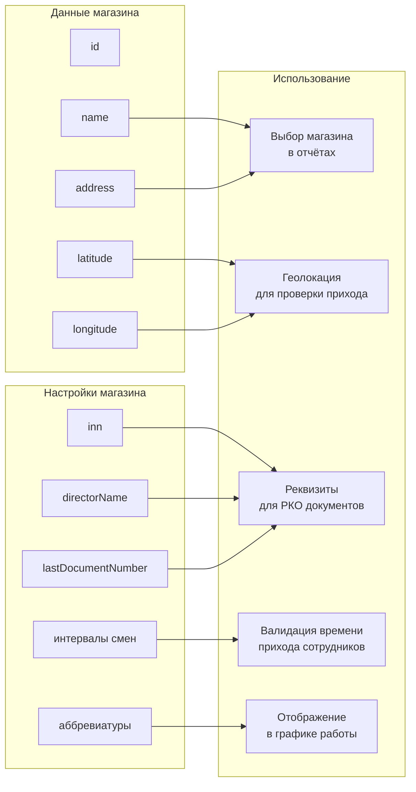
```mermaid
flowchart LR
    subgraph Shop_Data["Данные магазина"]
        ID[id]
        NAME[name]
        ADDR[address]
        LAT[latitude]
        LON[longitude]
    end

    subgraph Settings_Data["Настройки магазина"]
        INN[inn]
        DIR[directorName]
        DOC[lastDocumentNumber]
        SHIFTS[интервалы смен]
        ABBR[аббревиатуры]
    end

    subgraph Usage["Использование"]
        U1[Выбор магазина<br/>в отчётах]
        U2[Геолокация<br/>для проверки прихода]
        U3[Реквизиты<br/>для РКО документов]
        U4[Валидация времени<br/>прихода сотрудников]
        U5[Отображение<br/>в графике работы]
    end

    NAME --> U1
    ADDR --> U1
    LAT --> U2
    LON --> U2
    INN --> U3
    DIR --> U3
    DOC --> U3
    SHIFTS --> U4
    ABBR --> U5
```

---

### 1.5 API Endpoints

| Метод | Endpoint | Описание |
|-------|----------|----------|
| GET | `/api/shops` | Получить все магазины |
| GET | `/api/shops/:id` | Получить магазин по ID |
| POST | `/api/shops` | Создать магазин (name, address, latitude?, longitude?) |
| PUT | `/api/shops/:id` | Обновить магазин |
| DELETE | `/api/shops/:id` | Удалить магазин |
| GET | `/api/shop-settings/:shopAddress` | Получить настройки |
| POST | `/api/shop-settings` | Сохранить настройки |

---

### 1.6 Поток данных: Создание магазина

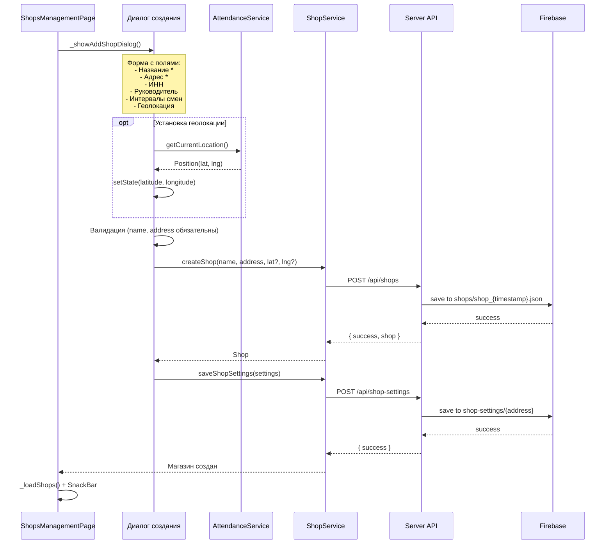
```mermaid
sequenceDiagram
    participant UI as ShopsManagementPage
    participant DLG as Диалог создания
    participant GPS as AttendanceService
    participant SVC as ShopService
    participant API as Server API
    participant DB as Firebase

    UI->>DLG: _showAddShopDialog()
    Note over DLG: Форма с полями:<br/>- Название *<br/>- Адрес *<br/>- ИНН<br/>- Руководитель<br/>- Интервалы смен<br/>- Геолокация

    opt Установка геолокации
        DLG->>GPS: getCurrentLocation()
        GPS-->>DLG: Position(lat, lng)
        DLG->>DLG: setState(latitude, longitude)
    end

    DLG->>DLG: Валидация (name, address обязательны)
    DLG->>SVC: createShop(name, address, lat?, lng?)
    SVC->>API: POST /api/shops
    API->>DB: save to shops/shop_{timestamp}.json
    DB-->>API: success
    API-->>SVC: { success, shop }
    SVC-->>DLG: Shop

    DLG->>SVC: saveShopSettings(settings)
    SVC->>API: POST /api/shop-settings
    API->>DB: save to shop-settings/{address}
    DB-->>API: success
    API-->>SVC: { success }

    SVC-->>UI: Магазин создан
    UI->>UI: _loadShops() + SnackBar
```

---

### 1.7 Поток данных: Загрузка магазинов

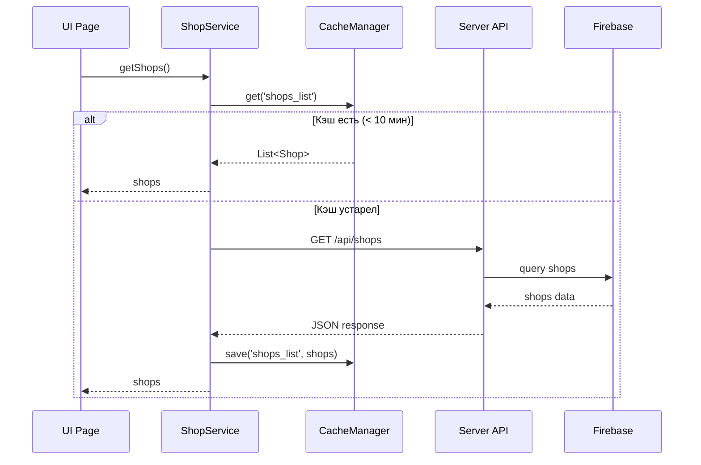
```mermaid
sequenceDiagram
    participant UI as UI Page
    participant SVC as ShopService
    participant CACHE as CacheManager
    participant API as Server API
    participant DB as Firebase

    UI->>SVC: getShops()
    SVC->>CACHE: get('shops_list')

    alt Кэш есть (< 10 мин)
        CACHE-->>SVC: List<Shop>
        SVC-->>UI: shops
    else Кэш устарел
        SVC->>API: GET /api/shops
        API->>DB: query shops
        DB-->>API: shops data
        API-->>SVC: JSON response
        SVC->>CACHE: save('shops_list', shops)
        SVC-->>UI: shops
    end
```

---

### 1.8 Поток данных: Сохранение настроек магазина

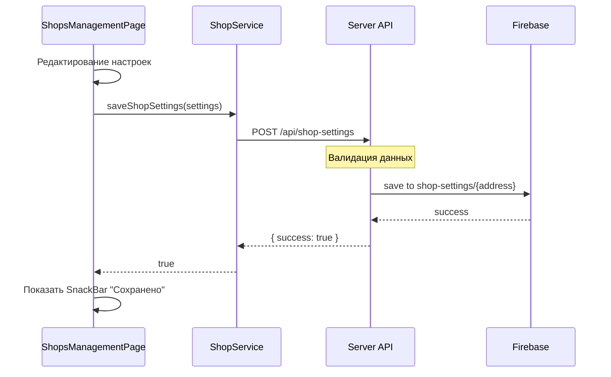
```mermaid
sequenceDiagram
    participant UI as ShopsManagementPage
    participant SVC as ShopService
    participant API as Server API
    participant DB as Firebase

    UI->>UI: Редактирование настроек
    UI->>SVC: saveShopSettings(settings)
    SVC->>API: POST /api/shop-settings

    Note over API: Валидация данных

    API->>DB: save to shop-settings/{address}
    DB-->>API: success
    API-->>SVC: { success: true }
    SVC-->>UI: true
    UI->>UI: Показать SnackBar "Сохранено"
```

---

### 1.9 Использование ShopSettings в Attendance

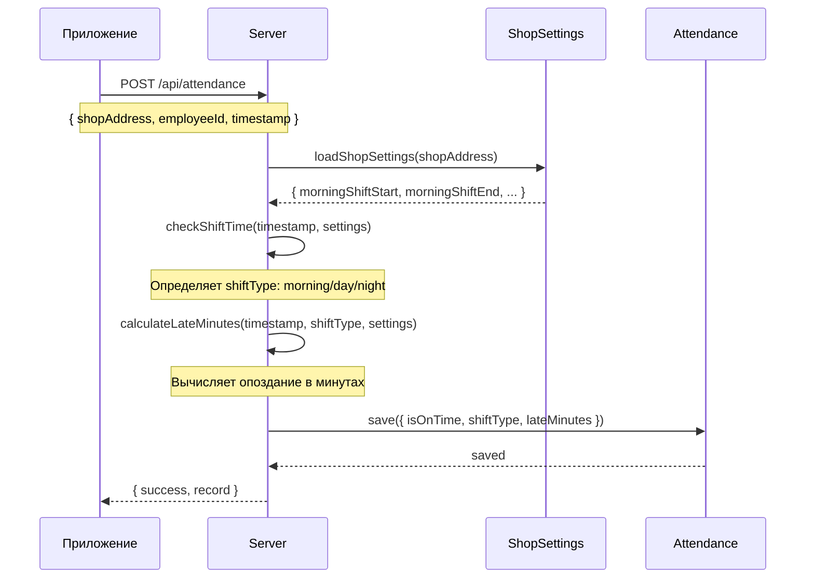
```mermaid
sequenceDiagram
    participant APP as Приложение
    participant API as Server
    participant SS as ShopSettings
    participant ATT as Attendance

    APP->>API: POST /api/attendance
    Note over APP,API: { shopAddress, employeeId, timestamp }

    API->>SS: loadShopSettings(shopAddress)
    SS-->>API: { morningShiftStart, morningShiftEnd, ... }

    API->>API: checkShiftTime(timestamp, settings)
    Note over API: Определяет shiftType: morning/day/night

    API->>API: calculateLateMinutes(timestamp, shiftType, settings)
    Note over API: Вычисляет опоздание в минутах

    API->>ATT: save({ isOnTime, shiftType, lateMinutes })
    ATT-->>API: saved
    API-->>APP: { success, record }
```

---

### 1.10 Таблица зависимостей

| Модуль | Использует Shop | Использует ShopSettings | Что берёт |
|--------|-----------------|------------------------|-----------|
| **Attendance** | ✅ | ✅ | address, интервалы смен |
| **Shifts** | ✅ | ✅ | address, аббревиатуры |
| **RKO** | ✅ | ✅ | address, ИНН, директор, номер документа |
| **KPI** | ✅ | ❌ | address для фильтрации |
| **WorkSchedule** | ✅ | ✅ | address, интервалы смен |
| **Recount** | ✅ | ❌ | address для выбора |
| **Envelope** | ✅ | ❌ | address для выбора |
| **Employees** | ✅ | ❌ | address для привязки |

---

### 1.11 Кэширование

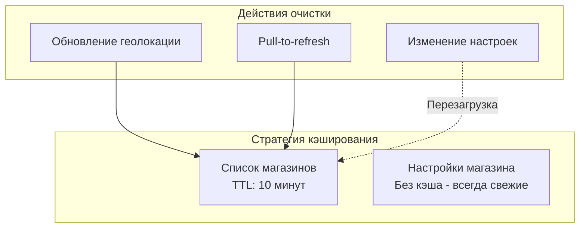
```mermaid
flowchart TB
    subgraph Cache["Стратегия кэширования"]
        C1[Список магазинов<br/>TTL: 10 минут]
        C2[Настройки магазина<br/>Без кэша - всегда свежие]
    end

    subgraph Actions["Действия очистки"]
        A1[Обновление геолокации]
        A2[Pull-to-refresh]
        A3[Изменение настроек]
    end

    A1 --> C1
    A2 --> C1
    A3 -.->|Перезагрузка| C1
```

---

## 2. Управление данными - СОТРУДНИКИ

### 2.1 Обзор модуля

**Назначение:** Центральный модуль для управления сотрудниками сети кофеен. Обеспечивает регистрацию, верификацию, определение ролей и настройку предпочтений сотрудников.

**Файлы модуля:**
```
lib/features/employees/
├── models/
│   ├── user_role_model.dart              # Модель роли пользователя
│   └── employee_registration_model.dart  # Модель регистрации (паспорт)
├── pages/
│   ├── employees_page.dart               # Главная страница + модель Employee
│   ├── employee_panel_page.dart          # Панель сотрудника
│   ├── employee_preferences_dialog.dart  # Диалог предпочтений
│   ├── employee_registration_page.dart   # Форма регистрации
│   ├── employee_registration_view_page.dart     # Просмотр регистрации
│   ├── employee_registration_select_employee_page.dart  # Выбор сотрудника
│   ├── employee_schedule_page.dart       # Расписание сотрудника
│   └── unverified_employees_page.dart    # Не верифицированные
└── services/
    ├── employee_service.dart             # CRUD операции
    ├── employee_registration_service.dart # Регистрация и верификация
    └── user_role_service.dart            # Определение ролей
```

---

### 2.2 Модели данных

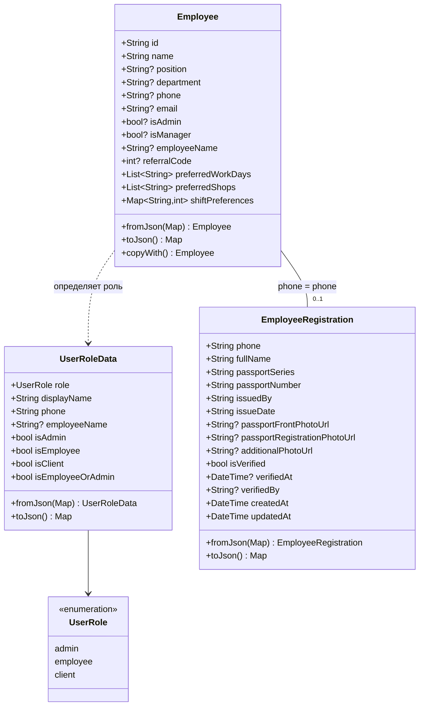
```mermaid
classDiagram
    class Employee {
        +String id
        +String name
        +String? position
        +String? department
        +String? phone
        +String? email
        +bool? isAdmin
        +bool? isManager
        +String? employeeName
        +int? referralCode
        +List~String~ preferredWorkDays
        +List~String~ preferredShops
        +Map~String,int~ shiftPreferences
        +fromJson(Map) Employee
        +toJson() Map
        +copyWith() Employee
    }

    class UserRoleData {
        +UserRole role
        +String displayName
        +String phone
        +String? employeeName
        +bool isAdmin
        +bool isEmployee
        +bool isClient
        +bool isEmployeeOrAdmin
        +fromJson(Map) UserRoleData
        +toJson() Map
    }

    class EmployeeRegistration {
        +String phone
        +String fullName
        +String passportSeries
        +String passportNumber
        +String issuedBy
        +String issueDate
        +String? passportFrontPhotoUrl
        +String? passportRegistrationPhotoUrl
        +String? additionalPhotoUrl
        +bool isVerified
        +DateTime? verifiedAt
        +String? verifiedBy
        +DateTime createdAt
        +DateTime updatedAt
        +fromJson(Map) EmployeeRegistration
        +toJson() Map
    }

    class UserRole {
        <<enumeration>>
        admin
        employee
        client
    }

    Employee "1" -- "0..1" EmployeeRegistration : phone = phone
    UserRoleData --> UserRole
    Employee ..> UserRoleData : определяет роль
```

---

### 2.3 Связи с другими модулями

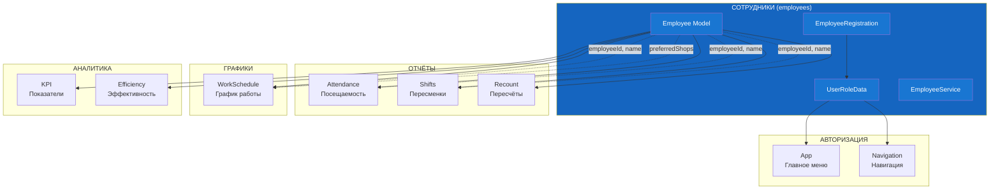
```mermaid
flowchart TB
    subgraph EMPLOYEES["СОТРУДНИКИ (employees)"]
        EMP[Employee Model]
        REG[EmployeeRegistration]
        ROLE[UserRoleData]
        SVC[EmployeeService]
    end

    subgraph REPORTS["ОТЧЁТЫ"]
        ATT[Attendance<br/>Посещаемость]
        SH[Shifts<br/>Пересменки]
        RC[Recount<br/>Пересчёты]
    end

    subgraph SCHEDULE["ГРАФИКИ"]
        WS[WorkSchedule<br/>График работы]
    end

    subgraph ANALYTICS["АНАЛИТИКА"]
        KPI[KPI<br/>Показатели]
        EFF[Efficiency<br/>Эффективность]
    end

    subgraph AUTH["АВТОРИЗАЦИЯ"]
        APP[App<br/>Главное меню]
        NAV[Navigation<br/>Навигация]
    end

    EMP --> ATT
    EMP --> SH
    EMP --> RC
    EMP --> WS
    EMP --> KPI
    EMP --> EFF

    ROLE --> APP
    ROLE --> NAV
    REG --> ROLE

    EMP -.->|employeeId, name| ATT
    EMP -.->|employeeId, name| SH
    EMP -.->|employeeId, name| WS
    EMP -.->|preferredShops| WS

    style EMPLOYEES fill:#1565C0,color:#fff
    style EMP fill:#1976D2,color:#fff
    style REG fill:#1976D2,color:#fff
    style ROLE fill:#1976D2,color:#fff
    style SVC fill:#1976D2,color:#fff
```

---

### 2.4 Детальные связи

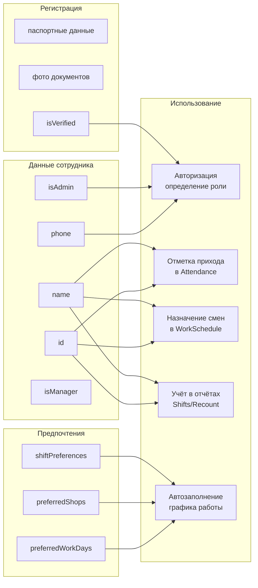
```mermaid
flowchart LR
    subgraph Employee_Data["Данные сотрудника"]
        ID[id]
        NAME[name]
        PHONE[phone]
        ADMIN[isAdmin]
        MANAGER[isManager]
    end

    subgraph Preferences["Предпочтения"]
        DAYS[preferredWorkDays]
        SHOPS[preferredShops]
        SHIFTS[shiftPreferences]
    end

    subgraph Registration["Регистрация"]
        PASSPORT[паспортные данные]
        PHOTOS[фото документов]
        VERIFIED[isVerified]
    end

    subgraph Usage["Использование"]
        U1[Авторизация<br/>определение роли]
        U2[Отметка прихода<br/>в Attendance]
        U3[Назначение смен<br/>в WorkSchedule]
        U4[Учёт в отчётах<br/>Shifts/Recount]
        U5[Автозаполнение<br/>графика работы]
    end

    PHONE --> U1
    ADMIN --> U1
    VERIFIED --> U1
    ID --> U2
    NAME --> U2
    ID --> U3
    NAME --> U3
    DAYS --> U5
    SHOPS --> U5
    SHIFTS --> U5
    ID --> U4
    NAME --> U4
```

---

### 2.5 API Endpoints

| Метод | Endpoint | Описание |
|-------|----------|----------|
| GET | `/api/employees` | Получить всех сотрудников |
| GET | `/api/employees/:id` | Получить сотрудника по ID |
| POST | `/api/employees` | Создать сотрудника |
| PUT | `/api/employees/:id` | Обновить сотрудника |
| DELETE | `/api/employees/:id` | Удалить сотрудника |
| GET | `/api/employee-registration/:phone` | Получить регистрацию по телефону |
| POST | `/api/employee-registration` | Сохранить регистрацию |
| POST | `/api/employee-registration/:phone/verify` | Верифицировать сотрудника |
| GET | `/api/employee-registrations` | Получить все регистрации (для админа) |
| POST | `/upload-employee-photo` | Загрузить фото документа |

---

### 2.6 Поток данных: Регистрация сотрудника

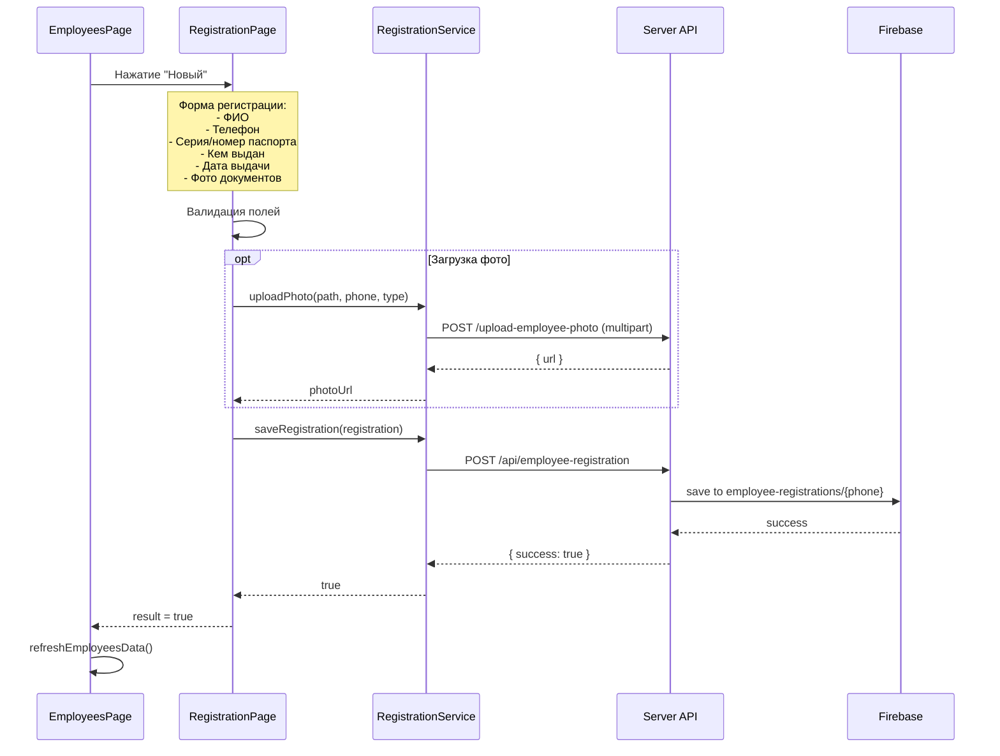
```mermaid
sequenceDiagram
    participant UI as EmployeesPage
    participant REG as RegistrationPage
    participant SVC as RegistrationService
    participant API as Server API
    participant DB as Firebase

    UI->>REG: Нажатие "Новый"
    Note over REG: Форма регистрации:<br/>- ФИО<br/>- Телефон<br/>- Серия/номер паспорта<br/>- Кем выдан<br/>- Дата выдачи<br/>- Фото документов

    REG->>REG: Валидация полей

    opt Загрузка фото
        REG->>SVC: uploadPhoto(path, phone, type)
        SVC->>API: POST /upload-employee-photo (multipart)
        API-->>SVC: { url }
        SVC-->>REG: photoUrl
    end

    REG->>SVC: saveRegistration(registration)
    SVC->>API: POST /api/employee-registration
    API->>DB: save to employee-registrations/{phone}
    DB-->>API: success
    API-->>SVC: { success: true }
    SVC-->>REG: true

    REG-->>UI: result = true
    UI->>UI: refreshEmployeesData()
```

---

### 2.7 Поток данных: Верификация сотрудника

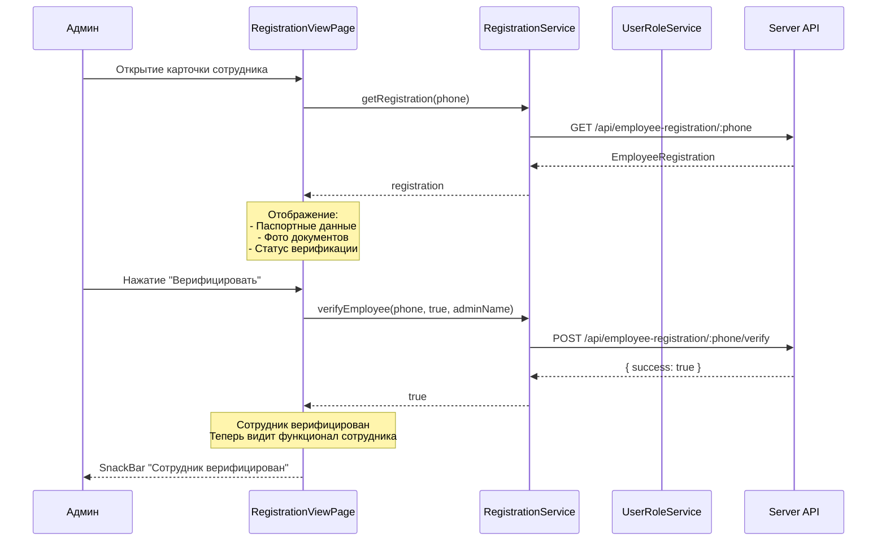
```mermaid
sequenceDiagram
    participant ADMIN as Админ
    participant UI as RegistrationViewPage
    participant SVC as RegistrationService
    participant ROLE as UserRoleService
    participant API as Server API

    ADMIN->>UI: Открытие карточки сотрудника
    UI->>SVC: getRegistration(phone)
    SVC->>API: GET /api/employee-registration/:phone
    API-->>SVC: EmployeeRegistration
    SVC-->>UI: registration

    Note over UI: Отображение:<br/>- Паспортные данные<br/>- Фото документов<br/>- Статус верификации

    ADMIN->>UI: Нажатие "Верифицировать"
    UI->>SVC: verifyEmployee(phone, true, adminName)
    SVC->>API: POST /api/employee-registration/:phone/verify
    API-->>SVC: { success: true }
    SVC-->>UI: true

    Note over UI: Сотрудник верифицирован<br/>Теперь видит функционал сотрудника

    UI-->>ADMIN: SnackBar "Сотрудник верифицирован"
```

---

### 2.8 Поток данных: Определение роли пользователя

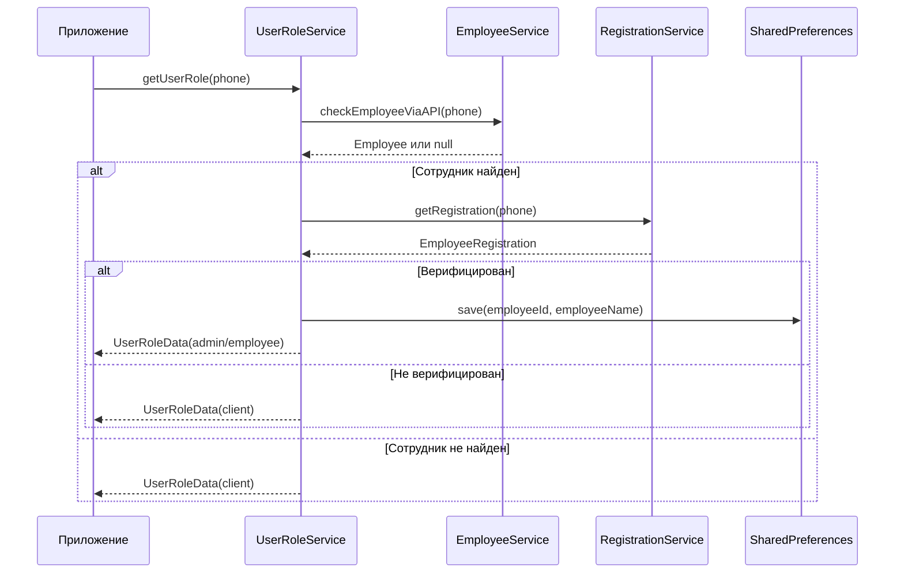
```mermaid
sequenceDiagram
    participant APP as Приложение
    participant ROLE as UserRoleService
    participant EMP as EmployeeService
    participant REG as RegistrationService
    participant CACHE as SharedPreferences

    APP->>ROLE: getUserRole(phone)

    ROLE->>EMP: checkEmployeeViaAPI(phone)
    EMP-->>ROLE: Employee или null

    alt Сотрудник найден
        ROLE->>REG: getRegistration(phone)
        REG-->>ROLE: EmployeeRegistration

        alt Верифицирован
            ROLE->>CACHE: save(employeeId, employeeName)
            ROLE-->>APP: UserRoleData(admin/employee)
        else Не верифицирован
            ROLE-->>APP: UserRoleData(client)
        end
    else Сотрудник не найден
        ROLE-->>APP: UserRoleData(client)
    end
```

---

### 2.9 Таблица зависимостей

| Модуль | Использует Employee | Использует Registration | Что берёт |
|--------|---------------------|------------------------|-----------|
| **Attendance** | ✅ | ❌ | employeeId, name для отметки |
| **Shifts** | ✅ | ❌ | employeeId, name для пересменок |
| **Recount** | ✅ | ❌ | employeeId, name для пересчётов |
| **WorkSchedule** | ✅ | ❌ | employeeId, name, preferences |
| **KPI** | ✅ | ❌ | employeeId для статистики |
| **Efficiency** | ✅ | ❌ | employeeId для баллов |
| **App/Navigation** | ❌ | ✅ | isVerified для определения роли |

---

### 2.10 Предпочтения сотрудника

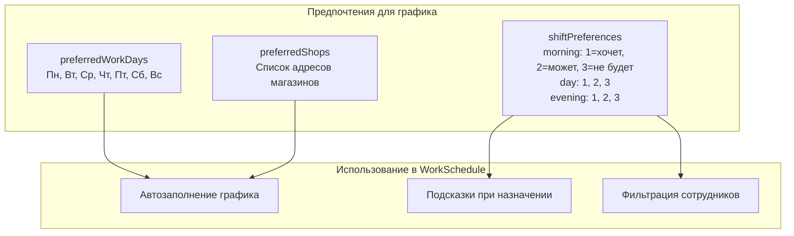
```mermaid
flowchart TB
    subgraph Preferences["Предпочтения для графика"]
        DAYS[preferredWorkDays<br/>Пн, Вт, Ср, Чт, Пт, Сб, Вс]
        SHOPS[preferredShops<br/>Список адресов магазинов]
        SHIFTS[shiftPreferences<br/>morning: 1=хочет, 2=может, 3=не будет<br/>day: 1, 2, 3<br/>evening: 1, 2, 3]
    end

    subgraph Usage["Использование в WorkSchedule"]
        AUTO[Автозаполнение графика]
        SUGGEST[Подсказки при назначении]
        FILTER[Фильтрация сотрудников]
    end

    DAYS --> AUTO
    SHOPS --> AUTO
    SHIFTS --> SUGGEST
    SHIFTS --> FILTER
```

---

### 2.11 Роли пользователей

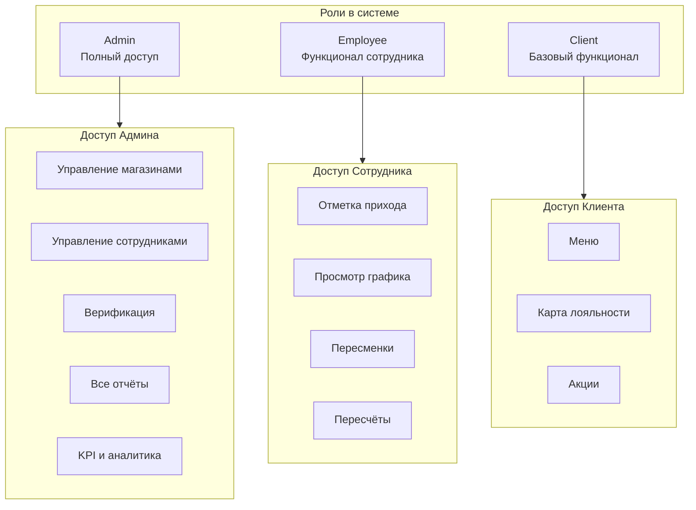
```mermaid
flowchart TB
    subgraph Roles["Роли в системе"]
        ADMIN[Admin<br/>Полный доступ]
        EMP[Employee<br/>Функционал сотрудника]
        CLIENT[Client<br/>Базовый функционал]
    end

    subgraph AdminAccess["Доступ Админа"]
        A1[Управление магазинами]
        A2[Управление сотрудниками]
        A3[Верификация]
        A4[Все отчёты]
        A5[KPI и аналитика]
    end

    subgraph EmployeeAccess["Доступ Сотрудника"]
        E1[Отметка прихода]
        E2[Просмотр графика]
        E3[Пересменки]
        E4[Пересчёты]
    end

    subgraph ClientAccess["Доступ Клиента"]
        C1[Меню]
        C2[Карта лояльности]
        C3[Акции]
    end

    ADMIN --> AdminAccess
    EMP --> EmployeeAccess
    CLIENT --> ClientAccess
```

---

### 2.12 Кэширование

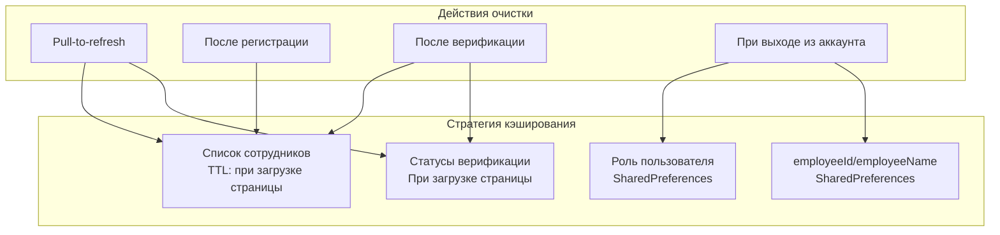
```mermaid
flowchart TB
    subgraph Cache["Стратегия кэширования"]
        C1[Список сотрудников<br/>TTL: при загрузке страницы]
        C2[Роль пользователя<br/>SharedPreferences]
        C3[employeeId/employeeName<br/>SharedPreferences]
        C4[Статусы верификации<br/>При загрузке страницы]
    end

    subgraph Actions["Действия очистки"]
        A1[Pull-to-refresh]
        A2[После регистрации]
        A3[После верификации]
        A4[При выходе из аккаунта]
    end

    A1 --> C1
    A1 --> C4
    A2 --> C1
    A3 --> C1
    A3 --> C4
    A4 --> C2
    A4 --> C3
```

---

## 3. Управление данными - ГРАФИК РАБОТЫ

### 3.1 Обзор модуля

**Назначение:** Модуль для составления и управления графиком работы сотрудников. Включает автозаполнение, валидацию конфликтов, передачу смен между сотрудниками и экспорт в PDF.

**Файлы модуля:**
```
lib/features/work_schedule/
├── models/
│   ├── work_schedule_model.dart       # Модели: WorkSchedule, WorkScheduleEntry, ShiftType, ScheduleTemplate
│   └── shift_transfer_model.dart      # Модель запроса на передачу смены
├── pages/
│   ├── work_schedule_page.dart        # Главная страница (3 вкладки)
│   ├── employee_bulk_schedule_dialog.dart  # Массовое редактирование
│   ├── my_schedule_page.dart          # "Мой график" для сотрудника
│   └── shift_transfer_requests_page.dart   # Запросы на передачу смен
├── services/
│   ├── work_schedule_service.dart     # CRUD операции с графиком
│   ├── auto_fill_schedule_service.dart # Алгоритм автозаполнения
│   ├── schedule_pdf_service.dart      # Генерация PDF
│   └── shift_transfer_service.dart    # Передача смен
└── work_schedule_validator.dart       # Валидация графика
```

---

### 3.2 Модели данных

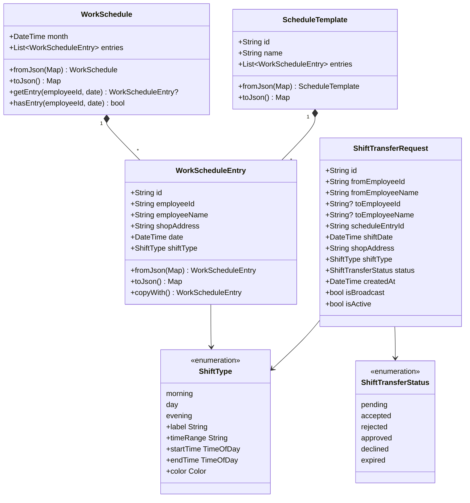
```mermaid
classDiagram
    class WorkSchedule {
        +DateTime month
        +List~WorkScheduleEntry~ entries
        +fromJson(Map) WorkSchedule
        +toJson() Map
        +getEntry(employeeId, date) WorkScheduleEntry?
        +hasEntry(employeeId, date) bool
    }

    class WorkScheduleEntry {
        +String id
        +String employeeId
        +String employeeName
        +String shopAddress
        +DateTime date
        +ShiftType shiftType
        +fromJson(Map) WorkScheduleEntry
        +toJson() Map
        +copyWith() WorkScheduleEntry
    }

    class ShiftType {
        <<enumeration>>
        morning
        day
        evening
        +label String
        +timeRange String
        +startTime TimeOfDay
        +endTime TimeOfDay
        +color Color
    }

    class ScheduleTemplate {
        +String id
        +String name
        +List~WorkScheduleEntry~ entries
        +fromJson(Map) ScheduleTemplate
        +toJson() Map
    }

    class ShiftTransferRequest {
        +String id
        +String fromEmployeeId
        +String fromEmployeeName
        +String? toEmployeeId
        +String? toEmployeeName
        +String scheduleEntryId
        +DateTime shiftDate
        +String shopAddress
        +ShiftType shiftType
        +ShiftTransferStatus status
        +DateTime createdAt
        +bool isBroadcast
        +bool isActive
    }

    class ShiftTransferStatus {
        <<enumeration>>
        pending
        accepted
        rejected
        approved
        declined
        expired
    }

    WorkSchedule "1" *-- "*" WorkScheduleEntry
    WorkScheduleEntry --> ShiftType
    ScheduleTemplate "1" *-- "*" WorkScheduleEntry
    ShiftTransferRequest --> ShiftType
    ShiftTransferRequest --> ShiftTransferStatus
```

---

### 3.3 Связи с другими модулями

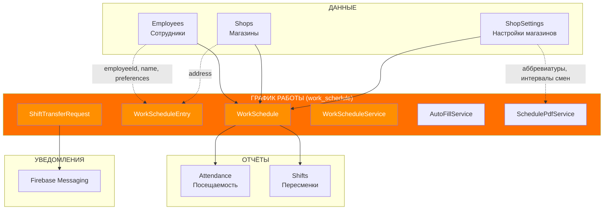
```mermaid
flowchart TB
    subgraph SCHEDULE["ГРАФИК РАБОТЫ (work_schedule)"]
        WS[WorkSchedule]
        WSE[WorkScheduleEntry]
        STR[ShiftTransferRequest]
        SVC[WorkScheduleService]
        AUTO[AutoFillService]
        PDF[SchedulePdfService]
    end

    subgraph DATA["ДАННЫЕ"]
        EMP[Employees<br/>Сотрудники]
        SHOP[Shops<br/>Магазины]
        SS[ShopSettings<br/>Настройки магазинов]
    end

    subgraph REPORTS["ОТЧЁТЫ"]
        ATT[Attendance<br/>Посещаемость]
        SH[Shifts<br/>Пересменки]
    end

    subgraph NOTIFICATIONS["УВЕДОМЛЕНИЯ"]
        FCM[Firebase Messaging]
    end

    EMP --> WS
    SHOP --> WS
    SS --> WS

    EMP -.->|employeeId, name, preferences| WSE
    SHOP -.->|address| WSE
    SS -.->|аббревиатуры, интервалы смен| PDF

    WS --> ATT
    WS --> SH

    STR --> FCM

    style SCHEDULE fill:#FF6F00,color:#fff
    style WS fill:#FF8F00,color:#fff
    style WSE fill:#FF8F00,color:#fff
    style STR fill:#FF8F00,color:#fff
    style SVC fill:#FF8F00,color:#fff
```

---

### 3.4 Типы смен (ShiftType)

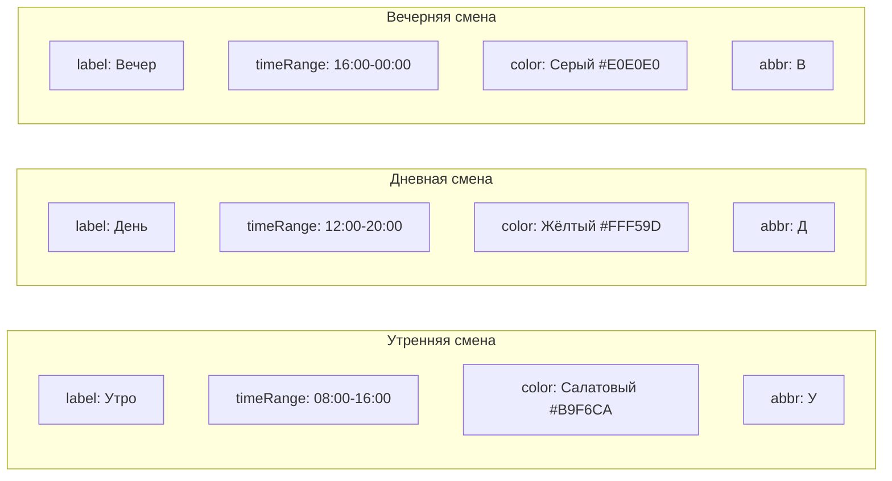
```mermaid
flowchart LR
    subgraph Morning["Утренняя смена"]
        M1[label: Утро]
        M2[timeRange: 08:00-16:00]
        M3[color: Салатовый #B9F6CA]
        M4[abbr: У]
    end

    subgraph Day["Дневная смена"]
        D1[label: День]
        D2[timeRange: 12:00-20:00]
        D3[color: Жёлтый #FFF59D]
        D4[abbr: Д]
    end

    subgraph Evening["Вечерняя смена"]
        E1[label: Вечер]
        E2[timeRange: 16:00-00:00]
        E3[color: Серый #E0E0E0]
        E4[abbr: В]
    end
```

---

### 3.5 API Endpoints

| Метод | Endpoint | Описание |
|-------|----------|----------|
| GET | `/api/work-schedule?month=YYYY-MM` | Получить график на месяц |
| GET | `/api/work-schedule/employee/:id?month=YYYY-MM` | График сотрудника |
| POST | `/api/work-schedule` | Создать/обновить смену |
| DELETE | `/api/work-schedule/:id?month=YYYY-MM` | Удалить смену |
| DELETE | `/api/work-schedule/clear?month=YYYY-MM` | Очистить месяц |
| POST | `/api/work-schedule/bulk` | Массовое создание смен |
| GET | `/api/work-schedule/template` | Получить шаблоны |
| POST | `/api/work-schedule/template` | Сохранить шаблон |
| POST | `/api/shift-transfers` | Создать запрос на передачу |
| GET | `/api/shift-transfers/employee/:id` | Запросы для сотрудника |
| GET | `/api/shift-transfers/admin` | Запросы для админа |
| PUT | `/api/shift-transfers/:id/accept` | Принять запрос |
| PUT | `/api/shift-transfers/:id/reject` | Отклонить запрос |
| PUT | `/api/shift-transfers/:id/approve` | Одобрить (админ) |
| PUT | `/api/shift-transfers/:id/decline` | Отказать (админ) |

---

### 3.6 Поток данных: Создание смены

```mermaid
sequenceDiagram
    participant UI as WorkSchedulePage
    participant DLG as Диалог редактирования
    participant SVC as WorkScheduleService
    participant API as Server API
    participant DB as Firebase

    UI->>DLG: Клик на ячейку (сотрудник × дата)
    Note over DLG: Выбор:<br/>- Магазин<br/>- Тип смены (У/Д/В)

    DLG->>SVC: saveShift(entry)
    SVC->>API: POST /api/work-schedule
    Note over API: { employeeId, employeeName,<br/>shopAddress, date, shiftType, month }

    API->>DB: save to work-schedule/{month}/{entryId}
    DB-->>API: success
    API-->>SVC: { success: true }
    SVC-->>DLG: true

    DLG-->>UI: Закрытие диалога
    UI->>UI: _loadSchedule() обновить
```

---

### 3.7 Поток данных: Автозаполнение

```mermaid
sequenceDiagram
    participant UI as WorkSchedulePage
    participant AUTO as AutoFillScheduleService
    participant SVC as WorkScheduleService
    participant VALID as Validator

    UI->>UI: Выбор периода (startDate, endDate)
    UI->>AUTO: autoFill(...)
    Note over AUTO: Параметры:<br/>- employees<br/>- shops<br/>- shopSettings<br/>- existingSchedule<br/>- replaceExisting

    loop Для каждого дня
        loop Для каждого магазина
            AUTO->>AUTO: Определить нужные смены (У, В)
            AUTO->>AUTO: _selectBestEmployee()
            Note over AUTO: Приоритеты:<br/>1. preferredShops<br/>2. preferredWorkDays<br/>3. shiftPreferences<br/>4. Балансировка нагрузки<br/>5. Отсутствие конфликтов
        end
    end

    AUTO->>VALID: _validateSchedule()
    VALID-->>AUTO: warnings[]

    AUTO-->>UI: newEntries[]

    UI->>SVC: bulkCreateShifts(entries)
    SVC-->>UI: success

    UI->>UI: Показать результат
```

---

### 3.8 Алгоритм автозаполнения

```mermaid
flowchart TB
    subgraph Selection["Выбор сотрудника (_selectBestEmployee)"]
        S1[Проверить preferredShops<br/>+10 баллов]
        S2[Проверить preferredWorkDays<br/>+5 баллов]
        S3[Проверить shiftPreferences<br/>1=хочет: +3<br/>2=может: +1<br/>3=не будет: -100]
        S4[Нет конфликтов 24ч<br/>+2 балла]
        S5[Балансировка нагрузки<br/>+100 если 0 смен<br/>+30-assigned иначе]
    end

    subgraph Priority["4 уровня приоритета"]
        P0[Level 0: все предпочтения]
        P1[Level 1: игнор дни]
        P2[Level 2: игнор дни + магазины]
        P3[Level 3: игнор всё]
    end

    subgraph Conflicts["Проверка конфликтов"]
        C1[Утро после вечера вчера ❌]
        C2[Вечер после утра сегодня ❌]
        C3[День после вечера вчера ❌]
        C4[Уже есть смена сегодня ❌]
    end

    S1 --> S2 --> S3 --> S4 --> S5
    P0 --> P1 --> P2 --> P3
    Selection --> Conflicts
```

---

### 3.9 Поток данных: Передача смены

```mermaid
sequenceDiagram
    participant EMP1 as Сотрудник 1
    participant UI as MySchedulePage
    participant SVC as ShiftTransferService
    participant FCM as Уведомления
    participant EMP2 as Сотрудник 2
    participant ADMIN as Админ

    EMP1->>UI: "Передать смену"
    UI->>SVC: createRequest(request)
    Note over SVC: toEmployeeId=null<br/>(broadcast всем)

    SVC->>FCM: Отправить уведомление
    FCM-->>EMP2: "Запрос на смену"

    EMP2->>SVC: acceptRequest(requestId)
    Note over SVC: status: accepted<br/>acceptedByEmployeeId

    SVC->>FCM: Уведомить админа
    FCM-->>ADMIN: "Ожидает одобрения"

    ADMIN->>SVC: approveRequest(requestId)
    Note over SVC: status: approved<br/>График обновлён

    SVC->>FCM: Уведомить всех
    FCM-->>EMP1: "Смена передана"
    FCM-->>EMP2: "Смена принята"
```

---

### 3.10 Статусы передачи смены

```mermaid
stateDiagram-v2
    [*] --> pending: createRequest()

    pending --> accepted: Сотрудник принял
    pending --> rejected: Сотрудник отклонил
    pending --> expired: 30 дней

    accepted --> approved: Админ одобрил
    accepted --> declined: Админ отклонил

    rejected --> [*]
    expired --> [*]
    approved --> [*]
    declined --> [*]
```

---

### 3.11 Валидация графика

```mermaid
flowchart TB
    subgraph Critical["Критичные ошибки"]
        E1[missingMorning<br/>Нет утренней смены]
        E2[missingEvening<br/>Нет вечерней смены]
        E3[duplicateMorning<br/>Дубликат утра]
        E4[duplicateEvening<br/>Дубликат вечера]
    end

    subgraph Warnings["Предупреждения"]
        W1[morningAfterEvening<br/>Утро после вечера]
        W2[eveningAfterMorning<br/>Вечер после утра]
        W3[dayAfterEvening<br/>День после вечера]
    end

    subgraph Result["ScheduleValidationResult"]
        R1[criticalErrors: List]
        R2[warnings: List]
        R3[hasCritical: bool]
        R4[totalCount: int]
    end

    Critical --> Result
    Warnings --> Result
```

---

### 3.12 Таблица зависимостей

| Модуль | Использует | Что берёт |
|--------|-----------|-----------|
| **Employee** | ✅ | id, name, preferences для автозаполнения |
| **Shop** | ✅ | address для привязки смен |
| **ShopSettings** | ✅ | аббревиатуры (У/Д/В), интервалы смен |
| **Attendance** | ← | График для сверки прихода |
| **Shifts** | ← | График для пересменок |
| **Firebase** | ✅ | Уведомления о передаче смен |

---

### 3.13 Генерация PDF

```mermaid
flowchart TB
    subgraph Input["Входные данные"]
        I1[WorkSchedule schedule]
        I2[List employeeNames]
        I3[DateTime month]
        I4[int startDay, endDay]
        I5[Map abbreviations]
    end

    subgraph Process["SchedulePdfService"]
        P1[Загрузка шрифтов NotoSans]
        P2[Создание горизонтального A4]
        P3[Заголовок с периодом]
        P4[Таблица: сотрудники × дни]
        P5[Цветные ячейки смен]
        P6[Легенда: У Д В]
    end

    subgraph Output["PDF файл"]
        O1[app-debug.pdf]
    end

    Input --> Process --> Output
```

---

### 3.14 Структура страницы (3 вкладки)

```mermaid
flowchart TB
    subgraph Tabs["WorkSchedulePage"]
        T1[Вкладка 1: График<br/>Основная таблица]
        T2[Вкладка 2: Сотрудники<br/>Список для назначения]
        T3[Вкладка 3: Магазины<br/>Фильтрация по магазинам]
    end

    subgraph Features["Функционал"]
        F1[Выбор периода startDay-endDay]
        F2[Переключение месяцев]
        F3[Автозаполнение]
        F4[Очистка месяца]
        F5[Экспорт в PDF]
        F6[Массовое редактирование]
    end

    Tabs --> Features
```

---

### 3.15 Кэширование

```mermaid
flowchart TB
    subgraph Cache["Стратегия кэширования"]
        C1[График на месяц<br/>Загружается при открытии]
        C2[Список сотрудников<br/>Загружается при открытии]
        C3[Настройки магазинов<br/>Кэш в shopSettingsCache]
        C4[Шаблоны<br/>Загружаются при необходимости]
    end

    subgraph Actions["Действия обновления"]
        A1[Изменение смены]
        A2[Автозаполнение]
        A3[Очистка месяца]
        A4[Смена месяца]
    end

    A1 --> C1
    A2 --> C1
    A3 --> C1
    A4 --> C1
```

---

## 4. Система отчётности - ПЕРЕСМЕНКИ

### 4.1 Обзор модуля

**Назначение:** Модуль для управления пересменками — процессом передачи смены между сотрудниками с заполнением отчёта по вопросам и фотофиксацией состояния магазина.

**Основные компоненты:**
1. **Вопросы пересменки** — управление списком вопросов для заполнения
2. **Отчёты пересменки** — отчёты сотрудников с ответами и фото
3. **Настройки баллов** — система начисления/штрафов за пересменки
4. **Панель работника** — интерфейс для прохождения пересменки

**Файлы модуля:**
```
lib/features/shifts/
├── models/
│   ├── shift_report_model.dart           # Модель отчёта + ShiftAnswer
│   ├── shift_question_model.dart         # Модель вопроса
│   └── pending_shift_report_model.dart   # Модель ожидающей пересменки
├── pages/
│   ├── shift_reports_list_page.dart      # Список отчётов (6 вкладок)
│   ├── shift_report_view_page.dart       # Просмотр отчёта
│   ├── shift_questions_page.dart         # Прохождение пересменки (сотрудник)
│   ├── shift_questions_management_page.dart  # Управление вопросами (админ)
│   ├── shift_shop_selection_page.dart    # Выбор магазина
│   ├── shift_summary_report_page.dart    # Сводный отчёт
│   ├── shift_photo_gallery_page.dart     # Галерея фото
│   └── shift_edit_dialog.dart            # Редактирование отчёта
└── services/
    ├── shift_report_service.dart         # CRUD отчётов
    ├── shift_question_service.dart       # CRUD вопросов
    ├── pending_shift_service.dart        # Ожидающие пересменки
    └── shift_sync_service.dart           # Синхронизация
```

**Связанные модули (efficiency):**
```
lib/features/efficiency/
├── models/
│   └── points_settings_model.dart        # ShiftPointsSettings
├── pages/settings_tabs/
│   ├── shift_points_settings_page.dart   # Настройки баллов пересменки
│   └── shift_points_settings_page_v2.dart
└── services/
    └── points_settings_service.dart      # API настроек баллов
```

---

### 4.2 Модели данных

```mermaid
classDiagram
    class ShiftReport {
        +String id
        +String employeeName
        +String? employeeId
        +String shopAddress
        +String? shopName
        +DateTime createdAt
        +List~ShiftAnswer~ answers
        +bool isSynced
        +DateTime? confirmedAt
        +int? rating
        +String? confirmedByAdmin
        +String? status
        +String? shiftType
        +DateTime? submittedAt
        +DateTime? reviewDeadline
        +DateTime? failedAt
        +DateTime? rejectedAt
        +fromJson(Map) ShiftReport
        +toJson() Map
        +statusEnum ShiftReportStatus
    }

    class ShiftAnswer {
        +String question
        +String? textAnswer
        +double? numberAnswer
        +String? photoPath
        +String? photoDriveId
        +String? referencePhotoUrl
        +fromJson(Map) ShiftAnswer
        +toJson() Map
    }

    class ShiftQuestion {
        +String id
        +String question
        +String? answerFormatB
        +String? answerFormatC
        +List~String~? shops
        +Map~String,String~? referencePhotos
        +isNumberOnly bool
        +isPhotoOnly bool
        +isYesNo bool
        +isTextOnly bool
        +fromJson(Map) ShiftQuestion
        +toJson() Map
    }

    class PendingShiftReport {
        +String id
        +String shopAddress
        +String shiftType
        +String shiftLabel
        +String date
        +String deadline
        +String status
        +String? completedBy
        +DateTime createdAt
        +DateTime? completedAt
        +isOverdue bool
        +fromJson(Map) PendingShiftReport
        +toJson() Map
    }

    class ShiftReportStatus {
        <<enumeration>>
        pending
        review
        confirmed
        failed
        rejected
        expired
    }

    class ShiftPointsSettings {
        +String id
        +String category
        +double minPoints
        +int zeroThreshold
        +double maxPoints
        +String morningStartTime
        +String morningEndTime
        +String eveningStartTime
        +String eveningEndTime
        +double missedPenalty
        +int adminReviewTimeout
        +calculatePoints(rating) double
    }

    ShiftReport "1" *-- "*" ShiftAnswer
    ShiftReport --> ShiftReportStatus
    ShiftReport ..> ShiftPointsSettings : uses for scoring
    ShiftQuestion --> ShiftReport : questions for
    PendingShiftReport --> ShiftReport : becomes
```

---

### 4.3 Статусы отчёта пересменки

```mermaid
stateDiagram-v2
    [*] --> pending: Scheduler создаёт

    pending --> review: Сотрудник отправил
    pending --> failed: Дедлайн истёк

    review --> confirmed: Админ оценил
    review --> rejected: Админ не успел (таймаут)

    failed --> [*]: Штраф начислен
    rejected --> [*]: Штраф начислен
    confirmed --> [*]: Баллы начислены

    note right of pending: Ожидает прохождения
    note right of review: На проверке у админа
    note right of confirmed: Оценка 1-10 выставлена
    note right of failed: Сотрудник не успел
    note right of rejected: Админ не проверил вовремя
```

---

### 4.4 Связи с другими модулями

```mermaid
flowchart TB
    subgraph SHIFTS["ПЕРЕСМЕНКИ (shifts)"]
        SR[ShiftReport]
        SQ[ShiftQuestion]
        PSR[PendingShiftReport]
        SRS[ShiftReportService]
        SQS[ShiftQuestionService]
    end

    subgraph DATA["ДАННЫЕ"]
        SHOP[Shops<br/>Магазины]
        EMP[Employees<br/>Сотрудники]
    end

    subgraph POINTS["БАЛЛЫ (efficiency)"]
        SPS[ShiftPointsSettings]
        PSS[PointsSettingsService]
        ECS[EfficiencyCalculationService]
    end

    subgraph SCHEDULE["ГРАФИК"]
        WS[WorkSchedule<br/>График работы]
    end

    subgraph SERVER["СЕРВЕР"]
        SCHED[Scheduler<br/>shift_automation_scheduler.js]
        FCM[Firebase Messaging]
    end

    SHOP --> SR
    EMP --> SR
    SPS --> SR
    WS --> PSR

    SR --> ECS
    SPS --> ECS

    SCHED --> PSR
    SCHED --> FCM
    SR --> FCM

    EMP -.->|employeeName, employeeId| SR
    SHOP -.->|shopAddress, shopName| SR
    SPS -.->|timeWindows, rating calculation| SR
    WS -.->|кто работает сегодня| SCHED

    style SHIFTS fill:#E65100,color:#fff
    style SR fill:#F57C00,color:#fff
    style SQ fill:#F57C00,color:#fff
    style PSR fill:#F57C00,color:#fff
```

---

### 4.5 Типы ответов на вопросы

```mermaid
flowchart LR
    subgraph Question["ShiftQuestion"]
        Q[question]
        B[answerFormatB]
        C[answerFormatC]
    end

    subgraph Types["Типы ответов"]
        T1[Да/Нет<br/>B=null, C=null]
        T2[Число<br/>C='число']
        T3[Фото<br/>B='free' или 'photo']
        T4[Текст<br/>остальные случаи]
    end

    subgraph Answer["ShiftAnswer"]
        A1[textAnswer: 'Да'/'Нет']
        A2[numberAnswer: double]
        A3[photoPath + photoDriveId]
        A4[textAnswer: String]
    end

    Q --> T1 --> A1
    B --> T3 --> A3
    C --> T2 --> A2
    Question --> T4 --> A4
```

---

### 4.6 API Endpoints

#### Отчёты пересменки

| Метод | Endpoint | Описание |
|-------|----------|----------|
| GET | `/api/shift-reports` | Получить отчёты (фильтры: employeeName, shopAddress, date, status) |
| GET | `/api/shift-reports/expired` | Получить просроченные отчёты |
| POST | `/api/shift-reports` | Создать/отправить отчёт |
| PUT | `/api/shift-reports/:id` | Обновить отчёт (оценка админом) |

#### Вопросы пересменки

| Метод | Endpoint | Описание |
|-------|----------|----------|
| GET | `/api/shift-questions` | Получить вопросы (фильтр: shopAddress) |
| GET | `/api/shift-questions/:id` | Получить вопрос по ID |
| POST | `/api/shift-questions` | Создать вопрос |
| PUT | `/api/shift-questions/:id` | Обновить вопрос |
| DELETE | `/api/shift-questions/:id` | Удалить вопрос |
| POST | `/api/shift-questions/:id/reference-photo` | Загрузить эталонное фото |

#### Ожидающие пересменки

| Метод | Endpoint | Описание |
|-------|----------|----------|
| GET | `/api/pending-shift-reports` | Получить ожидающие пересменки за сегодня |
| POST | `/api/pending-shift-reports/generate` | Сгенерировать пересменки (ручной вызов) |

#### Настройки баллов

| Метод | Endpoint | Описание |
|-------|----------|----------|
| GET | `/api/points-settings/shift` | Получить настройки баллов пересменки |
| POST | `/api/points-settings/shift` | Сохранить настройки баллов |

---

### 4.7 Поток данных: Автоматическое создание пересменок

```mermaid
sequenceDiagram
    participant SCHED as Scheduler
    participant WS as WorkSchedule
    participant SHOP as Shops
    participant DB as Firebase
    participant FCM as Push

    Note over SCHED: morningStartTime (07:00)

    SCHED->>WS: Получить график на сегодня
    WS-->>SCHED: Список сотрудников по магазинам

    SCHED->>SHOP: Получить все магазины
    SHOP-->>SCHED: List<Shop>

    loop Для каждого магазина
        SCHED->>DB: Создать PendingShiftReport
        Note over DB: status: 'pending'<br/>shiftType: 'morning'<br/>deadline: morningEndTime
    end

    Note over SCHED: eveningStartTime (14:00)

    loop Для каждого магазина
        SCHED->>DB: Создать PendingShiftReport
        Note over DB: status: 'pending'<br/>shiftType: 'evening'<br/>deadline: eveningEndTime
    end
```

---

### 4.8 Поток данных: Прохождение пересменки (сотрудник)

```mermaid
sequenceDiagram
    participant EMP as Сотрудник
    participant APP as Flutter App
    participant SQS as ShiftQuestionService
    participant SRS as ShiftReportService
    participant UPLOAD as PhotoUploadService
    participant API as Server

    EMP->>APP: Открыть "Пересменка"
    APP->>APP: ShiftShopSelectionPage
    EMP->>APP: Выбрать магазин

    APP->>SQS: getQuestions(shopAddress)
    SQS->>API: GET /api/shift-questions?shopAddress=...
    API-->>SQS: List<ShiftQuestion>
    SQS-->>APP: questions

    APP->>APP: ShiftQuestionsPage

    loop Для каждого вопроса
        Note over APP: Показать вопрос<br/>+ эталонное фото (если есть)

        alt Тип: Да/Нет
            EMP->>APP: Выбор "Да" или "Нет"
        else Тип: Число
            EMP->>APP: Ввод числа
        else Тип: Фото
            EMP->>APP: Сделать фото
            APP->>UPLOAD: uploadPhoto(file)
            UPLOAD-->>APP: photoUrl
        else Тип: Текст
            EMP->>APP: Ввод текста
        end

        APP->>APP: Сохранить ShiftAnswer
        EMP->>APP: "Далее"
    end

    EMP->>APP: "Отправить"
    APP->>SRS: submitReport(report)
    SRS->>API: POST /api/shift-reports

    alt Время в пределах интервала
        API-->>SRS: { success: true, report }
        SRS-->>APP: ShiftSubmitResult(success)
        APP->>APP: Показать "Отправлено"
    else Время истекло
        API-->>SRS: { success: false, error: 'TIME_EXPIRED' }
        SRS-->>APP: ShiftSubmitResult(isTimeExpired)
        APP->>APP: Показать "Вы не успели"
    end
```

---

### 4.9 Поток данных: Оценка отчёта (админ)

```mermaid
sequenceDiagram
    participant ADMIN as Админ
    participant UI as ShiftReportsListPage
    participant VIEW as ShiftReportViewPage
    participant SRS as ShiftReportService
    participant API as Server
    participant ECS as EfficiencyService
    participant DB as efficiency-penalties
    participant FCM as Push
    participant EMP as Сотрудник

    ADMIN->>UI: Открыть "Отчёты пересменок"
    UI->>SRS: getReports(status: 'review')
    SRS->>API: GET /api/shift-reports?status=review
    API-->>SRS: List<ShiftReport>
    SRS-->>UI: reports

    ADMIN->>UI: Выбрать отчёт
    UI->>VIEW: Открыть ShiftReportViewPage

    Note over VIEW: Показать:<br/>- Ответы на вопросы<br/>- Фото сотрудника<br/>- Эталонные фото

    ADMIN->>VIEW: Выставить оценку (1-10)
    ADMIN->>VIEW: "Подтвердить"

    VIEW->>SRS: updateReport(report.copyWith(rating, confirmedByAdmin))
    SRS->>API: PUT /api/shift-reports/:id
    Note over API: status: 'confirmed'<br/>confirmedAt: now<br/>rating: 1-10

    API->>ECS: calculateShiftPoints(rating)
    Note over ECS: Линейная интерполяция<br/>minPoints → 0 → maxPoints

    API->>DB: Сохранить баллы в efficiency-penalties/{YYYY-MM}.json
    Note over DB: { phone, date, points,<br/>reason: 'Пересменка: оценка X' }

    API->>FCM: sendPushToPhone(employeePhone)
    FCM-->>EMP: "Пересменка - Ваша Оценка: X"

    API-->>SRS: { success: true }
    SRS-->>VIEW: true

    VIEW-->>ADMIN: SnackBar "Оценка сохранена"
```

**Важно:** При оценке отчёта пересменки происходит:
1. Обновление статуса отчёта на `confirmed`
2. Расчёт баллов эффективности через `calculateShiftPoints(rating)`
3. Сохранение баллов в файл `/var/www/efficiency-penalties/{YYYY-MM}.json`
4. Отправка push-уведомления сотруднику с информацией об оценке

---

### 4.10 Расчёт баллов за пересменку

```mermaid
flowchart TB
    subgraph Settings["ShiftPointsSettings"]
        MIN[minPoints: -3<br/>оценка 1]
        ZERO[zeroThreshold: 7<br/>оценка = 0 баллов]
        MAX[maxPoints: +2<br/>оценка 10]
        PENALTY[missedPenalty: -3<br/>не прошёл]
    end

    subgraph Calculation["calculatePoints(rating)"]
        R1[rating ≤ 1] --> P1[minPoints]
        R2[1 < rating ≤ zeroThreshold] --> P2[Интерполяция<br/>minPoints → 0]
        R3[zeroThreshold < rating < 10] --> P3[Интерполяция<br/>0 → maxPoints]
        R4[rating ≥ 10] --> P4[maxPoints]
    end

    subgraph Examples["Примеры"]
        E1[Оценка 1 → -3 балла]
        E2[Оценка 4 → -1.5 балла]
        E3[Оценка 7 → 0 баллов]
        E4[Оценка 8.5 → +1 балл]
        E5[Оценка 10 → +2 балла]
        E6[Не прошёл → -3 балла]
    end

    Settings --> Calculation --> Examples
```

**Хранение баллов:**

Баллы эффективности сохраняются в файл `/var/www/efficiency-penalties/{YYYY-MM}.json` с форматом:
```json
{
  "penalties": [
    {
      "date": "2025-01-24",
      "phone": "79001234567",
      "reason": "Пересменка: оценка 8",
      "points": 0.67,
      "category": "shift"
    }
  ]
}
```

**Функция расчёта:** `calculateShiftPoints(rating)` в `loyalty-proxy/api/points_settings_api.js`

---

### 4.11 Временные окна пересменок

```mermaid
timeline
    title Временные интервалы пересменок

    section Утро
        07:00 : morningStartTime
              : Создаются pending для всех магазинов
        07:00-13:00 : Сотрудники проходят пересменку
        13:00 : morningEndTime
              : pending → failed (штраф)
              : review → rejected (если не проверен)

    section Вечер
        14:00 : eveningStartTime
              : Создаются pending для всех магазинов
        14:00-23:00 : Сотрудники проходят пересменку
        23:00 : eveningEndTime
              : pending → failed (штраф)
              : review → rejected (если не проверен)
```

---

### 4.12 Структура страницы (6 вкладок)

```mermaid
flowchart TB
    subgraph Tabs["ShiftReportsListPage - 6 вкладок"]
        T1[1. Ожидают<br/>pending]
        T2[2. Не прошли<br/>failed + badge]
        T3[3. На проверке<br/>review]
        T4[4. Проверено<br/>confirmed]
        T5[5. Сводка<br/>30 дней]
        T6[6. Просроченные<br/>expired]
    end

    subgraph Features["Функционал"]
        F1[Фильтры: магазин, сотрудник, дата]
        F2[Pull-to-refresh]
        F3[Иерархическая группировка по датам]
        F4[Badges для новых отчётов]
        F5[Сводный отчёт по сменам]
    end

    Tabs --> Features
```

---

### 4.13 Управление вопросами (админ)

```mermaid
flowchart TB
    subgraph Page["ShiftQuestionsManagementPage"]
        LIST[Список вопросов]
        ADD[+ Добавить вопрос]
        EDIT[Редактировать]
        DEL[Удалить]
    end

    subgraph Question["Форма вопроса"]
        Q1[Текст вопроса *]
        Q2[Формат B: free/photo/...]
        Q3[Формат C: число/...]
        Q4[Магазины: выбор или все]
        Q5[Эталонные фото по магазинам]
    end

    subgraph RefPhoto["Эталонное фото"]
        RP1[Выбрать магазин]
        RP2[Загрузить фото]
        RP3[URL сохраняется в referencePhotos]
    end

    ADD --> Question
    EDIT --> Question
    Question --> RefPhoto
```

---

### 4.14 Эталонные фото

```mermaid
flowchart LR
    subgraph Storage["Хранение"]
        S1["/var/www/shift-reference-photos/"]
        S2["filename: shift_ref_{questionId}_{timestamp}.jpg"]
    end

    subgraph Question["ShiftQuestion.referencePhotos"]
        Q1["{ 'ТЦ Весна': 'https://...', 'ТЦ Аура': 'https://...' }"]
    end

    subgraph Display["Отображение"]
        D1[При прохождении пересменки<br/>показывается эталонное фото<br/>для текущего магазина]
        D2[При оценке админом<br/>сравнение с фото сотрудника]
    end

    Storage --> Question --> Display
```

---

### 4.15 Таблица зависимостей

| Модуль | Использует | Что берёт |
|--------|-----------|-----------|
| **Shops** | ✅ | shopAddress для привязки отчёта |
| **Employees** | ✅ | employeeName, employeeId |
| **WorkSchedule** | ✅ | Кто работает в эту смену (для Scheduler) |
| **Efficiency** | ← | Баллы за пересменку идут в рейтинг |
| **ShiftPointsSettings** | ✅ | Временные окна, коэффициенты баллов |
| **Firebase (FCM)** | ✅ | Push-уведомления о статусах |

---

### 4.16 Кэширование

```mermaid
flowchart TB
    subgraph Cache["Стратегия кэширования"]
        C1[Вопросы пересменки<br/>При открытии страницы]
        C2[Отчёты<br/>При открытии + Pull-to-refresh]
        C3[Настройки баллов<br/>При загрузке страницы]
        C4[Локальные черновики<br/>SharedPreferences]
    end

    subgraph Actions["Действия обновления"]
        A1[Pull-to-refresh]
        A2[После отправки отчёта]
        A3[После оценки админом]
        A4[Смена вкладки]
    end

    A1 --> C1
    A1 --> C2
    A2 --> C2
    A3 --> C2
    A4 --> C2
```

---

### 4.17 Серверная автоматизация

**Файл:** `loyalty-proxy/api/shift_automation_scheduler.js`

```mermaid
flowchart TB
    subgraph Scheduler["Scheduler (cron)"]
        S1[Проверка каждую минуту]
        S2[morningStartTime → создать pending]
        S3[eveningStartTime → создать pending]
        S4[Проверка дедлайнов]
    end

    subgraph Actions["Действия по дедлайну"]
        A1[pending + deadline истёк → failed]
        A2[review + adminTimeout истёк → rejected]
        A3[Начислить штраф из графика]
        A4[Push админу: X магазинов не прошли]
    end

    Scheduler --> Actions
```

---

## 5. Система отчётности - ПЕРЕСЧЁТЫ

### 5.1 Обзор модуля

**Назначение:** Модуль для управления пересчётами товаров — процессом контроля остатков товаров в магазинах. Включает автоматическое создание задач по расписанию, проверку расхождений, ИИ-верификацию фото и сводные отчёты.

**Основные компоненты:**
1. **Вопросы пересчёта** — генерация на основе данных DBF (остатки из 1С)
2. **Отчёты пересчёта** — ответы сотрудников с фото товаров
3. **Планировщик (Scheduler)** — автоматическое создание pending задач
4. **ИИ-верификация** — автоматический подсчёт товаров на фото
5. **Pivot-таблица** — сводная таблица расхождений (товары × магазины)

**Файлы модуля:**
```
lib/features/recount/
├── models/
│   ├── recount_report_model.dart        # Модель отчёта + статусы
│   ├── recount_answer_model.dart        # Модель ответа (moreBy/lessBy)
│   ├── recount_question_model.dart      # Модель вопроса (из DBF)
│   ├── pending_recount_report_model.dart # Модель ожидающего пересчёта
│   └── recount_pivot_model.dart         # Модель pivot-таблицы
├── pages/
│   ├── recount_reports_list_page.dart   # Список отчётов (6 вкладок + иерархия)
│   ├── recount_report_view_page.dart    # Просмотр отчёта
│   ├── recount_questions_page.dart      # Прохождение пересчёта (сотрудник)
│   ├── recount_shop_selection_page.dart # Выбор магазина + pending индикатор
│   └── recount_summary_report_page.dart # Детальная pivot-таблица (товары×магазины)
└── services/
    ├── recount_service.dart             # CRUD отчётов + pivot
    ├── recount_question_service.dart    # Генерация вопросов из DBF
    └── pending_recount_service.dart     # API pending пересчётов
```

**Связанные модули:**
```
lib/features/efficiency/
├── models/
│   └── points_settings_model.dart       # RecountPointsSettings
└── services/
    └── points_settings_service.dart     # API настроек баллов

lib/features/shops/
└── services/
    └── shop_products_service.dart       # API shop_products (DBF)

lib/features/ai_training/
└── services/
    └── cigarette_vision_service.dart    # ИИ распознавание
```

**Серверные компоненты:**
```
loyalty-proxy/
├── api/
│   ├── recount_automation_scheduler.js  # Планировщик (cron)
│   ├── recount_api.js                   # API пересчётов
│   └── pending_recount_api.js           # API pending
└── modules/
    └── dbf-sync/                        # Синхронизация DBF
```

---

### 5.2 Модели данных

```mermaid
classDiagram
    class RecountReport {
        +String id
        +String employeeName
        +String shopAddress
        +String? employeePhone
        +DateTime startedAt
        +DateTime completedAt
        +Duration duration
        +List~RecountAnswer~ answers
        +int? adminRating
        +String? adminName
        +DateTime? ratedAt
        +String? status
        +String? shiftType
        +DateTime? submittedAt
        +DateTime? reviewDeadline
        +DateTime? failedAt
        +DateTime? rejectedAt
        +fromJson(Map) RecountReport
        +toJson() Map
        +statusEnum RecountReportStatus
        +formattedDuration String
    }

    class RecountAnswer {
        +String question
        +int grade
        +String answer
        +int? quantity
        +int? programBalance
        +int? actualBalance
        +int? difference
        +int? moreBy
        +int? lessBy
        +String? photoPath
        +String? photoUrl
        +bool photoRequired
        +bool? aiVerified
        +int? aiQuantity
        +double? aiConfidence
        +bool? aiMismatch
        +String? aiAnnotatedImageUrl
        +isMatching bool
        +isNotMatching bool
        +matching(question, grade, stockFromDbf) RecountAnswer
        +notMatching(question, grade, stockFromDbf, moreBy, lessBy) RecountAnswer
    }

    class RecountQuestion {
        +String barcode
        +String productName
        +String? group
        +int grade
        +int stock
        +bool photoRequired
        +bool isAiActive
        +fromJson(Map) RecountQuestion
        +toJson() Map
    }

    class PendingRecountReport {
        +String id
        +String shopAddress
        +String shiftType
        +String shiftLabel
        +String date
        +String deadline
        +String status
        +String? completedBy
        +DateTime createdAt
        +DateTime? completedAt
        +isOverdue bool
        +fromJson(Map) PendingRecountReport
        +toJson() Map
    }

    class RecountReportStatus {
        <<enumeration>>
        pending
        review
        confirmed
        failed
        rejected
        expired
    }

    class RecountPivotTable {
        +DateTime date
        +List~RecountPivotShop~ shops
        +List~RecountPivotRow~ rows
        +empty(date) RecountPivotTable
    }

    class RecountPivotRow {
        +String productName
        +String productBarcode
        +Map~String,int?~ shopDifferences
    }

    class RecountPivotShop {
        +String shopId
        +String shopName
        +String shopAddress
    }

    class RecountSummaryItem {
        +DateTime date
        +String shiftType
        +String shiftName
        +int passedCount
        +int totalCount
        +List~RecountReport~ reports
        +displayTitle String
    }

    class RecountPointsSettings {
        +String id
        +String category
        +double minPoints
        +int zeroThreshold
        +double maxPoints
        +String morningStartTime
        +String morningEndTime
        +String eveningStartTime
        +String eveningEndTime
        +double missedPenalty
        +int adminReviewTimeout
        +calculatePoints(rating) double
    }

    RecountReport "1" *-- "*" RecountAnswer
    RecountReport --> RecountReportStatus
    RecountReport ..> RecountPointsSettings : uses for scoring
    RecountQuestion --> RecountReport : generates questions for
    PendingRecountReport --> RecountReport : becomes
    RecountPivotTable "1" *-- "*" RecountPivotShop
    RecountPivotTable "1" *-- "*" RecountPivotRow
    RecountSummaryItem "1" *-- "*" RecountReport : contains
    RecountAnswer ..> RecountQuestion : answers to
```

---

### 5.3 Статусы отчёта пересчёта

```mermaid
stateDiagram-v2
    [*] --> pending: Scheduler создаёт

    pending --> review: Сотрудник отправил
    pending --> failed: Дедлайн истёк

    review --> confirmed: Админ оценил
    review --> rejected: Админ не успел (таймаут)

    failed --> [*]: Штраф начислен
    rejected --> [*]: Штраф начислен
    confirmed --> [*]: Баллы начислены

    note right of pending: Ожидает прохождения
    note right of review: На проверке у админа
    note right of confirmed: Оценка 1-10 выставлена
    note right of failed: Сотрудник не успел
    note right of rejected: Админ не проверил вовремя
```

---

### 5.4 Связи с другими модулями

```mermaid
flowchart TB
    subgraph RECOUNT["ПЕРЕСЧЁТЫ (recount)"]
        RR[RecountReport]
        RA[RecountAnswer]
        RQ[RecountQuestion]
        PRR[PendingRecountReport]
        RPT[RecountPivotTable]
        RSI[RecountSummaryItem]
        RS[RecountService]
    end

    subgraph DATA["ДАННЫЕ"]
        SHOP[Shops<br/>Магазины]
        EMP[Employees<br/>Сотрудники]
        DBF[ShopProducts<br/>DBF остатки]
        MC[MasterCatalog<br/>Мастер-каталог]
    end

    subgraph AI["ИИ РАСПОЗНАВАНИЕ"]
        CVS[CigaretteVisionService]
        AIACT[isAiActive flag]
    end

    subgraph POINTS["БАЛЛЫ (efficiency)"]
        RPS[RecountPointsSettings]
        PSS[PointsSettingsService]
        ECS[EfficiencyCalculationService]
    end

    subgraph SERVER["СЕРВЕР"]
        SCHED[Scheduler<br/>recount_automation_scheduler.js]
        FCM[Firebase Messaging]
        DBFA[DBF Agent<br/>Python sync]
    end

    SHOP --> RR
    EMP --> RR
    DBF --> RQ
    MC --> RQ
    RPS --> RR

    AIACT --> RQ
    CVS --> RA
    RQ --> RA

    RR --> ECS
    RPS --> ECS

    SCHED --> PRR
    SCHED --> FCM
    DBFA --> DBF

    EMP -.->|employeeName, phone| RR
    SHOP -.->|shopAddress| RR
    DBF -.->|barcode, stock| RQ
    MC -.->|productName, group, isAiActive| RQ
    RPS -.->|timeWindows, rating calculation| RR

    style RECOUNT fill:#7B1FA2,color:#fff
    style RR fill:#8E24AA,color:#fff
    style RA fill:#8E24AA,color:#fff
    style RQ fill:#8E24AA,color:#fff
    style PRR fill:#8E24AA,color:#fff
    style RPT fill:#8E24AA,color:#fff
```

---

### 5.5 Источники данных вопросов пересчёта

```mermaid
flowchart TB
    subgraph DBF["DBF Agent (Python)"]
        D1[Чтение DBF из 1С]
        D2[Парсинг товаров]
        D3[POST /api/shop-products]
    end

    subgraph ShopProducts["shop_products (сервер)"]
        SP1[barcode/kod]
        SP2[stock - остаток]
        SP3[price]
        SP4[shopId]
    end

    subgraph MasterCatalog["master-catalog (сервер)"]
        MC1[name - название]
        MC2[group - группа]
        MC3[isAiActive - флаг ИИ]
    end

    subgraph RecountQuestion["RecountQuestion"]
        RQ1[barcode ← SP1]
        RQ2[productName ← MC1]
        RQ3[group ← MC2]
        RQ4[stock ← SP2]
        RQ5[isAiActive ← MC3]
        RQ6[grade = 1, 2, 3]
        RQ7[photoRequired]
    end

    DBF --> ShopProducts
    ShopProducts --> RecountQuestion
    MasterCatalog --> RecountQuestion
```

**Грейды товаров:**
- **Грейд 1** — критичные товары (дорогие/ходовые)
- **Грейд 2** — средние товары
- **Грейд 3** — некритичные товары

---

### 5.6 API Endpoints

#### Отчёты пересчёта

| Метод | Endpoint | Описание |
|-------|----------|----------|
| GET | `/api/recount-reports` | Получить отчёты (фильтры: date, shopAddress, status) |
| GET | `/api/recount-reports/expired` | Получить просроченные отчёты |
| POST | `/api/recount-reports` | Создать/отправить отчёт |
| PUT | `/api/recount-reports/:id` | Обновить отчёт (оценка админом) |

#### Ожидающие пересчёты

| Метод | Endpoint | Описание |
|-------|----------|----------|
| GET | `/api/pending-recount-reports` | Получить ожидающие пересчёты за сегодня |
| POST | `/api/pending-recount-reports/generate` | Сгенерировать пересчёты (ручной вызов) |

#### Данные товаров (DBF)

| Метод | Endpoint | Описание |
|-------|----------|----------|
| GET | `/api/shop-products/:shopId` | Получить товары магазина |
| POST | `/api/shop-products` | Загрузить товары из DBF |
| GET | `/api/shop-products/synced-shops` | Магазины с синхронизированными товарами |

#### Мастер-каталог

| Метод | Endpoint | Описание |
|-------|----------|----------|
| GET | `/api/master-catalog` | Получить все товары каталога |
| GET | `/api/master-catalog/:barcode` | Получить товар по штрих-коду |
| PATCH | `/api/master-catalog/:id/ai-status` | Переключить isAiActive |

#### Настройки баллов

| Метод | Endpoint | Описание |
|-------|----------|----------|
| GET | `/api/points-settings/recount` | Получить настройки баллов пересчёта |
| POST | `/api/points-settings/recount` | Сохранить настройки баллов |

---

### 5.7 Поток данных: Синхронизация товаров из DBF

```mermaid
sequenceDiagram
    participant AGENT as DBF Agent (Python)
    participant DBF as 1С DBF файлы
    participant API as Server API
    participant DB as shop_products.json
    participant MC as master-catalog.json

    Note over AGENT: Запуск по расписанию<br/>или вручную

    AGENT->>DBF: Чтение файлов DBF
    DBF-->>AGENT: Товары с остатками

    loop Для каждого магазина
        AGENT->>API: POST /api/shop-products
        Note over API: { shopId, products: [{ kod, stock, price }] }
        API->>DB: Сохранить/обновить
        DB-->>API: success
    end

    AGENT->>API: POST /api/master-catalog/bulk
    Note over API: Уникальные товары<br/>{ barcode, name, group }
    API->>MC: Добавить новые товары
    Note over MC: isAiActive = false<br/>(по умолчанию)
    MC-->>API: success

    API-->>AGENT: Синхронизация завершена
```

---

### 5.8 Поток данных: Автоматическое создание пересчётов

```mermaid
sequenceDiagram
    participant SCHED as Scheduler
    participant SHOP as Shops
    participant SYNC as SyncedShops
    participant SETTINGS as RecountSettings
    participant DB as Firebase
    participant FCM as Push

    Note over SCHED: Каждые 5 минут

    SCHED->>SETTINGS: getRecountSettings()
    SETTINGS-->>SCHED: { morningStartTime, eveningStartTime, ... }

    SCHED->>SCHED: isWithinTimeWindow(morningStart, morningEnd)?

    alt Внутри утреннего окна
        SCHED->>SYNC: Получить магазины с DBF
        SYNC-->>SCHED: List<ShopId>

        SCHED->>SHOP: Получить все магазины
        SHOP-->>SCHED: List<Shop>

        loop Для каждого магазина с DBF
            alt Нет pending для этого магазина
                SCHED->>DB: Создать PendingRecountReport
                Note over DB: status: 'pending'<br/>shiftType: 'morning'<br/>deadline: morningEndTime
            end
        end
    end

    Note over SCHED: Проверка дедлайнов

    loop Для каждого pending
        alt deadline истёк
            SCHED->>DB: status: 'failed', failedAt: now
            SCHED->>FCM: Push админу: "Магазин X не прошёл пересчёт"
        end
    end

    loop Для каждого review
        alt adminTimeout истёк
            SCHED->>DB: status: 'rejected', rejectedAt: now
        end
    end
```

---

### 5.9 Поток данных: Прохождение пересчёта (сотрудник)

```mermaid
sequenceDiagram
    participant EMP as Сотрудник
    participant APP as Flutter App
    participant SHOP_SEL as ShopSelectionPage
    participant PENDING as PendingRecountService
    participant RQS as RecountQuestionService
    participant AI as CigaretteVisionService
    participant RS as RecountService
    participant API as Server

    EMP->>APP: Открыть "Пересчёт"
    APP->>SHOP_SEL: RecountShopSelectionPage

    SHOP_SEL->>PENDING: getPendingReports()
    PENDING->>API: GET /api/pending-recount-reports
    API-->>PENDING: List<PendingRecountReport>
    PENDING-->>SHOP_SEL: pending

    Note over SHOP_SEL: Показать индикатор<br/>"Ожидает пересчёт"<br/>на магазинах с pending

    EMP->>SHOP_SEL: Выбрать магазин

    alt Нет pending для магазина
        SHOP_SEL->>SHOP_SEL: _showNoActiveRecountsDialog()
        Note over SHOP_SEL: "Нет активных пересчётов"<br/>"Следующий в 14:00"
    else Есть pending
        SHOP_SEL->>RQS: generateQuestions(shopId)
        RQS->>API: GET /api/shop-products/:shopId
        API-->>RQS: products с stock
        RQS->>API: GET /api/master-catalog
        API-->>RQS: catalog с names, isAiActive
        RQS-->>SHOP_SEL: List<RecountQuestion>

        APP->>APP: RecountQuestionsPage

        loop Для каждого вопроса
            Note over APP: Показать:<br/>- Название товара<br/>- "По программе: X шт"<br/>- Кнопки "Сходится" / "Не сходится"

            alt Сходится
                EMP->>APP: Нажать "Сходится"
                APP->>APP: RecountAnswer.matching(stock)
            else Не сходится
                EMP->>APP: Нажать "Не сходится"
                EMP->>APP: Ввести "Больше на: X" или "Меньше на: Y"
                APP->>APP: RecountAnswer.notMatching(stock, moreBy, lessBy)
            end

            opt Требуется фото
                EMP->>APP: Сделать фото
            end

            opt isAiActive == true && есть фото
                APP->>AI: detectAndCount(photo, productId)
                AI-->>APP: { count, confidence, annotatedUrl }
                APP->>APP: answer.copyWith(aiVerified, aiQuantity, aiMismatch)

                alt aiMismatch
                    APP->>APP: _showAIMismatchDialog()
                    Note over APP: "Расхождение с ИИ!<br/>Ваш подсчёт: X<br/>ИИ насчитал: Y"
                end
            end

            EMP->>APP: "Далее"
        end

        EMP->>APP: "Отправить"
        APP->>RS: submitReport(report)
        RS->>API: POST /api/recount-reports
        Note over API: status: 'review'<br/>submittedAt: now

        API-->>RS: { success: true, report }
        RS-->>APP: RecountSubmitResult(success)
        APP->>APP: Показать "Отправлено"
    end
```

---

### 5.10 UI ответа на вопрос пересчёта

```mermaid
flowchart TB
    subgraph Question["Экран вопроса"]
        Q1[Название товара]
        Q2["По программе: X шт"]
        Q3[Кнопки ответа]
    end

    subgraph Matching["Сходится (зелёная)"]
        M1[quantity = stock]
        M2[actualBalance = stock]
        M3[difference = 0]
    end

    subgraph NotMatching["Не сходится (красная)"]
        NM1[Поле: Больше на ____]
        NM2[Поле: Меньше на ____]
        NM3[Заполняется ОДНО из полей]
    end

    subgraph Calculation["Расчёт"]
        C1["Если moreBy > 0:<br/>actualBalance = stock + moreBy<br/>difference = -moreBy"]
        C2["Если lessBy > 0:<br/>actualBalance = stock - lessBy<br/>difference = +lessBy"]
    end

    Q3 --> Matching
    Q3 --> NotMatching
    NotMatching --> Calculation
```

---

### 5.11 Поток данных: Оценка отчёта (админ)

```mermaid
sequenceDiagram
    participant ADMIN as Админ
    participant UI as RecountReportsListPage
    participant VIEW as RecountReportViewPage
    participant RS as RecountService
    participant API as Server
    participant ECS as EfficiencyService
    participant DB as efficiency-penalties
    participant FCM as Push
    participant EMP as Сотрудник

    ADMIN->>UI: Открыть "Отчёты пересчётов"
    UI->>RS: getReports(status: 'review')
    RS->>API: GET /api/recount-reports?status=review
    API-->>RS: List<RecountReport>
    RS-->>UI: reports

    ADMIN->>UI: Выбрать отчёт
    UI->>VIEW: Открыть RecountReportViewPage

    Note over VIEW: Показать:<br/>- Ответы с расхождениями<br/>- Фото товаров<br/>- ИИ результаты (если есть)

    ADMIN->>VIEW: Выставить оценку (1-10)
    ADMIN->>VIEW: "Подтвердить"

    VIEW->>RS: updateReport(report.copyWith(adminRating, adminName))
    RS->>API: PUT /api/recount-reports/:id
    Note over API: status: 'confirmed'<br/>ratedAt: now<br/>adminRating: 1-10

    API->>ECS: calculateRecountPoints(rating)
    Note over ECS: Линейная интерполяция<br/>minPoints → 0 → maxPoints

    API->>DB: Сохранить баллы в efficiency-penalties/{YYYY-MM}.json
    Note over DB: { phone, date, points,<br/>reason: 'Пересчёт: оценка X' }

    API->>FCM: sendPushToPhone(employeePhone)
    FCM-->>EMP: "Пересчёт - Ваша Оценка: X"

    API-->>RS: { success: true }
    RS-->>VIEW: true

    VIEW-->>ADMIN: SnackBar "Оценка сохранена"
```

---

### 5.12 ИИ-верификация при пересчёте

```mermaid
flowchart TB
    subgraph MasterCatalog["Мастер-каталог"]
        MC1[isAiActive: true/false]
        MC2[Переключатель в AI Training]
    end

    subgraph RecountQuestion["Вопрос пересчёта"]
        RQ1[isAiActive из каталога]
        RQ2[photoRequired]
    end

    subgraph AICheck["Проверка при сохранении ответа"]
        AI1{isAiActive && есть фото?}
        AI2[CigaretteVisionService.detectAndCount]
        AI3["aiQuantity, aiConfidence"]
        AI4{|humanCount - aiCount| > 2?}
        AI5[aiMismatch = true]
        AI6[Показать предупреждение]
    end

    subgraph Report["В отчёте"]
        R1["✓ Проверено ИИ"]
        R2["ИИ насчитал: X шт"]
        R3["⚠️ Расхождение!" оранжевый бордер]
    end

    MasterCatalog --> RecountQuestion
    RecountQuestion --> AI1
    AI1 -->|Да| AI2
    AI2 --> AI3
    AI3 --> AI4
    AI4 -->|Да| AI5
    AI5 --> AI6
    AI5 --> R3
    AI1 -->|Нет| Report
```

**Пример сценария ИИ-проверки:**

1. Админ включает isAiActive для "CAMEL BLUE" в AI Training
2. Сотрудник проходит пересчёт, попадается "CAMEL BLUE"
3. Отвечает "Сходится" (stock = 10) и делает фото
4. Приложение вызывает `CigaretteVisionService.detectAndCount(photo)`
5. ИИ насчитал 8 пачек
6. aiMismatch = true (|10 - 8| > 2)
7. Показывается предупреждение: "Расхождение с ИИ!"
8. В отчёте админ видит: "✓ Проверено ИИ: 8 шт" с оранжевой пометкой

---

### 5.13 Pivot-таблица расхождений

**UI-структура вкладки "Отчёт":**

```mermaid
flowchart TB
    subgraph Tab["Вкладка Отчёт (RecountReportsListPage)"]
        T1[Иерархический список<br/>RecountSummaryItem]
        T2[Группировка: Сегодня, Вчера, Неделя, Месяц]
        T3[Badge: непросмотренные<br/>сегодняшние с проблемами]
    end

    subgraph Card["Карточка смены"]
        C1[Утренняя / Вечерняя]
        C2[Прошли: X/Y]
        C3[Цвет: зелёный/красный/обычный]
    end

    subgraph Detail["RecountSummaryReportPage"]
        D1[AppBar: Смена + Дата]
        D2[Легенда цветов]
        D3[Pivot-таблица]
    end

    Tab --> Card
    Card -->|"onTap"| Detail
```

**Pivot-таблица (RecountSummaryReportPage):**

```mermaid
flowchart TB
    subgraph Input["Входные данные"]
        I1[Дата + Смена]
        I2[List~RecountReport~ reports]
        I3[List~Shop~ allShops]
    end

    subgraph Process["_loadData()"]
        P1[Собрать уникальные товары]
        P2[Построить Map productName → shopAddress → difference]
        P3[Синхронизировать ScrollController]
    end

    subgraph Output["Pivot-таблица"]
        direction LR
        O1["| Товар        | М1 | М2 | М3 |"]
        O2["|--------------|----|----|----"]
        O3["| CAMEL BLUE   | -3 |  0 | +2 |"]
        O4["| MARLBORO RED | +1 | -5 |  — |"]
    end

    subgraph Layout["Компактный layout"]
        L1["Ширина столбца: 36px"]
        L2["Высота строки: 32px"]
        L3["Названия магазинов: вертикально"]
        L4["Шрифт цифр: 9px"]
    end

    subgraph Legend["Легенда"]
        LG1["0 = сходится (зелёный)"]
        LG2["+X = больше на X (синий)"]
        LG3["-X = меньше на X (красный)"]
        LG4["— = нет данных (серый)"]
    end

    Input --> Process --> Output
    Output --> Layout
    Output --> Legend
```

---

### 5.14 Временные окна пересчётов

```mermaid
timeline
    title Временные интервалы пересчётов

    section Утро
        07:00 : morningStartTime
              : Создаются pending для всех магазинов с DBF
        07:00-19:58 : Сотрудники проходят пересчёт
        19:58 : morningEndTime
              : pending → failed (штраф)
              : review → rejected (если не проверен)

    section Вечер
        20:00 : eveningStartTime
              : Создаются pending для всех магазинов
        20:00-06:58 : Сотрудники проходят пересчёт (ночной интервал)
        06:58 : eveningEndTime (следующий день)
              : pending → failed (штраф)
              : review → rejected (если не проверен)
```

**Важно:** Поддержка ночных интервалов

Когда `endTime < startTime` (например 20:00-06:58), интервал считается "ночным":
```dart
// Flutter: recount_reports_list_page.dart
bool _isWithinTimeWindow(int currentMinutes, int startMinutes, int endMinutes) {
  if (endMinutes < startMinutes) {
    // Ночной интервал
    return currentMinutes >= startMinutes || currentMinutes < endMinutes;
  }
  // Дневной интервал
  return currentMinutes >= startMinutes && currentMinutes < endMinutes;
}
```

```javascript
// Server: recount_automation_scheduler.js
function isWithinTimeWindow(startTimeStr, endTimeStr) {
  if (endMinutes < startMinutes) {
    return currentMinutes >= startMinutes || currentMinutes < endMinutes;
  }
  return currentMinutes >= startMinutes && currentMinutes < endMinutes;
}
```

---

### 5.15 Структура страницы (6 вкладок)

```mermaid
flowchart TB
    subgraph Tabs["RecountReportsListPage - 6 вкладок"]
        T1[1. Ожидают<br/>pending]
        T2[2. Не прошли<br/>failed + badge]
        T3[3. Проверка<br/>review]
        T4[4. Проверено<br/>confirmed + иерархия]
        T5[5. Отклонённые<br/>rejected + иерархия]
        T6[6. Отчёт<br/>Иерархия + badge]
    end

    subgraph Features["Функционал"]
        F1[Фильтры: магазин, сотрудник, дата]
        F2[Pull-to-refresh]
        F3[Иерархическая группировка по датам<br/>Сегодня, Вчера, Неделя, Месяц]
        F4[Badges для непросмотренных<br/>Не прошли + Отчёт]
        F5[Клик → детальная страница<br/>RecountSummaryReportPage]
    end

    subgraph SummaryPage["RecountSummaryReportPage"]
        SP1[Pivot-таблица<br/>Товары × Магазины]
        SP2[Вертикальные названия магазинов]
        SP3[Компактные ячейки 36×32px]
        SP4[Синхронизированный скролл]
        SP5[Легенда: 0/+N/-N/—]
    end

    Tabs --> Features
    T6 --> SummaryPage
```

---

### 5.16 Расчёт баллов за пересчёт

```mermaid
flowchart TB
    subgraph Settings["RecountPointsSettings"]
        MIN[minPoints: -3<br/>оценка 1]
        ZERO[zeroThreshold: 7<br/>оценка = 0 баллов]
        MAX[maxPoints: +2<br/>оценка 10]
        PENALTY[missedPenalty: -3<br/>не прошёл]
    end

    subgraph Calculation["calculatePoints(rating)"]
        R1[rating ≤ 1] --> P1[minPoints]
        R2[1 < rating ≤ zeroThreshold] --> P2[Интерполяция<br/>minPoints → 0]
        R3[zeroThreshold < rating < 10] --> P3[Интерполяция<br/>0 → maxPoints]
        R4[rating ≥ 10] --> P4[maxPoints]
    end

    subgraph Examples["Примеры"]
        E1[Оценка 1 → -3 балла]
        E2[Оценка 4 → -1.5 балла]
        E3[Оценка 7 → 0 баллов]
        E4[Оценка 8.5 → +1 балл]
        E5[Оценка 10 → +2 балла]
        E6[Не прошёл → -3 балла]
    end

    Settings --> Calculation --> Examples
```

---

### 5.17 Таблица зависимостей

| Модуль | Использует | Что берёт |
|--------|-----------|-----------|
| **Shops** | ✅ | shopAddress для привязки отчёта |
| **Employees** | ✅ | employeeName, employeePhone |
| **ShopProducts (DBF)** | ✅ | barcode, stock для генерации вопросов |
| **MasterCatalog** | ✅ | productName, group, isAiActive |
| **CigaretteVisionService** | ✅ | ИИ-подсчёт товаров на фото |
| **Efficiency** | ← | Баллы за пересчёт идут в рейтинг |
| **RecountPointsSettings** | ✅ | Временные окна, коэффициенты баллов |
| **Firebase (FCM)** | ✅ | Push-уведомления о статусах |

---

### 5.18 Кэширование

```mermaid
flowchart TB
    subgraph Cache["Стратегия кэширования"]
        C1[Товары магазина<br/>При открытии страницы]
        C2[Отчёты<br/>При открытии + Pull-to-refresh]
        C3[Pending пересчёты<br/>При открытии ShopSelection]
        C4[Настройки баллов<br/>При загрузке страницы]
        C5[Мастер-каталог<br/>При генерации вопросов]
    end

    subgraph Actions["Действия обновления"]
        A1[Pull-to-refresh]
        A2[После отправки отчёта]
        A3[После оценки админом]
        A4[Смена вкладки]
        A5[Обновление DBF Agent]
    end

    A1 --> C2
    A1 --> C3
    A2 --> C2
    A2 --> C3
    A3 --> C2
    A4 --> C2
    A5 --> C1
```

---

### 5.19 Серверная автоматизация

**Файл:** `loyalty-proxy/api/recount_automation_scheduler.js`

```mermaid
flowchart TB
    subgraph Scheduler["Scheduler (cron каждые 5 минут)"]
        S1[Получить настройки интервалов]
        S2[isWithinTimeWindow для утра?]
        S3[isWithinTimeWindow для вечера?]
        S4[Проверка дедлайнов]
    end

    subgraph Morning["Утренний интервал"]
        M1[Получить магазины с DBF]
        M2[Создать pending для каждого]
        M3[deadline = morningEndTime]
    end

    subgraph Evening["Вечерний интервал"]
        E1[Получить магазины с DBF]
        E2[Создать pending для каждого]
        E3[deadline = eveningEndTime<br/>(если ночной - завтра)]
    end

    subgraph Deadlines["Проверка дедлайнов"]
        D1[pending + deadline истёк → failed]
        D2[review + adminTimeout истёк → rejected]
        D3[Начислить штраф missedPenalty]
        D4[Push админу: X магазинов failed]
    end

    Scheduler --> S2
    S2 -->|Да| Morning
    Scheduler --> S3
    S3 -->|Да| Evening
    Scheduler --> S4
    S4 --> Deadlines
```

---

## 6. ИИ-интеллект - РАСПОЗНАВАНИЕ ТОВАРОВ

### 6.1 Обзор модуля

**Назначение:** Модуль машинного обучения для распознавания и подсчёта товаров на фотографиях. Используется для автоматической верификации ответов при пересчёте, обучения моделей на новых товарах и анализа Z-отчётов.

**Основные компоненты:**
1. **Детекция и подсчёт** — обнаружение товаров на фото и подсчёт количества
2. **Обучение модели** — загрузка обучающих изображений с разметкой
3. **Мастер-каталог** — управление товарами и флагом isAiActive
4. **Z-отчёты** — распознавание текста из кассовых отчётов (OCR)

**Файлы модуля:**
```
lib/features/ai_training/
├── models/
│   ├── cigarette_training_model.dart    # CigaretteProduct, TrainingImage
│   └── z_report_model.dart              # Модель Z-отчёта (OCR)
├── pages/
│   ├── ai_training_page.dart            # Главная страница (табы)
│   ├── cigarette_training_page.dart     # Обучение + каталог товаров
│   ├── z_report_training_page.dart      # Обучение Z-отчётов
│   └── z_report_view_page.dart          # Просмотр результатов OCR
└── services/
    ├── cigarette_vision_service.dart    # API машинного зрения
    └── z_report_service.dart            # API Z-отчётов
```

**Серверные компоненты:**
```
loyalty-proxy/
├── api/
│   └── master_catalog_api.js            # API мастер-каталога + isAiActive
└── modules/
    └── z-report-vision.js               # OCR Z-отчётов
```

**Внешние сервисы:**
- Roboflow API — детекция объектов и обучение моделей
- OpenAI Vision / Claude Vision — OCR Z-отчётов

---

### 6.2 Модели данных

```mermaid
classDiagram
    class CigaretteProduct {
        +String id
        +String barcode
        +String name
        +String? group
        +bool isAiActive
        +List~TrainingImage~? trainingImages
        +int? trainingCount
        +fromJson(Map) CigaretteProduct
        +toJson() Map
    }

    class TrainingImage {
        +String id
        +String imageUrl
        +String productId
        +int? objectCount
        +List~BoundingBox~? annotations
        +DateTime uploadedAt
        +fromJson(Map) TrainingImage
        +toJson() Map
    }

    class BoundingBox {
        +double x
        +double y
        +double width
        +double height
        +String label
    }

    class DetectionResult {
        +bool success
        +int count
        +double confidence
        +String? annotatedImageUrl
        +String? error
    }

    class ZReportData {
        +String id
        +String shopAddress
        +DateTime date
        +String? imageUrl
        +Map~String,dynamic~ extractedData
        +bool isProcessed
        +fromJson(Map) ZReportData
        +toJson() Map
    }

    CigaretteProduct "1" *-- "*" TrainingImage
    TrainingImage "1" *-- "*" BoundingBox
    CigaretteProduct ..> DetectionResult : detectAndCount()
```

---

### 6.3 Связи с другими модулями

```mermaid
flowchart TB
    subgraph AI_TRAINING["ИИ-ИНТЕЛЛЕКТ (ai_training)"]
        CVS[CigaretteVisionService]
        CP[CigaretteProduct]
        TI[TrainingImage]
        ZR[ZReportService]
    end

    subgraph RECOUNT["ПЕРЕСЧЁТЫ"]
        RQ[RecountQuestion]
        RA[RecountAnswer]
        RQP[RecountQuestionsPage]
    end

    subgraph CATALOG["МАСТЕР-КАТАЛОГ"]
        MC[MasterCatalog]
        IAA[isAiActive flag]
    end

    subgraph EXTERNAL["ВНЕШНИЕ СЕРВИСЫ"]
        RF[Roboflow API]
        OAI[OpenAI Vision]
    end

    subgraph SERVER["СЕРВЕР"]
        MCA[master_catalog_api.js]
        ZRV[z-report-vision.js]
    end

    MC --> CP
    IAA --> RQ
    CVS --> RF
    ZR --> OAI
    ZR --> ZRV

    RQP --> CVS
    CVS --> RA

    CVS -.->|detectAndCount(photo)| RF
    ZR -.->|extractText(photo)| OAI

    style AI_TRAINING fill:#00695C,color:#fff
    style CVS fill:#00897B,color:#fff
    style CP fill:#00897B,color:#fff
```

---

### 6.4 Флаг isAiActive в мастер-каталоге

```mermaid
flowchart TB
    subgraph MasterCatalog["Мастер-каталог"]
        MC1["{ barcode, name, group, isAiActive }"]
        MC2[isAiActive = false по умолчанию]
    end

    subgraph AITrainingPage["AI Training - вкладка Товары"]
        AT1[Список товаров каталога]
        AT2[Toggle на каждой карточке]
        AT3[PATCH /master-catalog/:id/ai-status]
    end

    subgraph RecountFlow["Поток пересчёта"]
        RF1[Генерация RecountQuestion]
        RF2[isAiActive передаётся в вопрос]
        RF3[При сохранении ответа проверить флаг]
        RF4{isAiActive && есть фото?}
        RF5[Вызвать ИИ]
        RF6[Сохранить aiQuantity, aiMismatch]
    end

    MasterCatalog --> AITrainingPage
    AITrainingPage --> MasterCatalog
    MasterCatalog --> RecountFlow
    RF4 -->|Да| RF5
    RF5 --> RF6
```

---

### 6.5 API Endpoints

#### Мастер-каталог

| Метод | Endpoint | Описание |
|-------|----------|----------|
| GET | `/api/master-catalog` | Получить все товары каталога |
| GET | `/api/master-catalog/:barcode` | Получить товар по штрих-коду |
| POST | `/api/master-catalog` | Добавить товар |
| POST | `/api/master-catalog/bulk` | Массовое добавление товаров |
| PATCH | `/api/master-catalog/:id/ai-status` | Переключить isAiActive |

#### Обучение модели (Roboflow)

| Метод | Endpoint | Описание |
|-------|----------|----------|
| POST | `roboflow.detect()` | Детекция объектов на фото |
| POST | `roboflow.upload()` | Загрузить обучающее изображение |
| GET | `roboflow.getModel()` | Получить информацию о модели |

#### Z-отчёты

| Метод | Endpoint | Описание |
|-------|----------|----------|
| GET | `/api/z-reports` | Получить Z-отчёты |
| POST | `/api/z-reports/extract` | Извлечь данные из фото отчёта |
| PUT | `/api/z-reports/:id` | Обновить данные отчёта |

---

### 6.6 Поток данных: Детекция и подсчёт товаров

```mermaid
sequenceDiagram
    participant APP as Flutter App
    participant CVS as CigaretteVisionService
    participant RF as Roboflow API
    participant CLOUD as Cloud Storage

    APP->>CVS: detectAndCount(imageBytes, productId)

    CVS->>CLOUD: Загрузить изображение
    CLOUD-->>CVS: imageUrl

    CVS->>RF: detect(imageUrl, model, confidence)
    Note over RF: Inference API<br/>YOLOv8 модель

    RF-->>CVS: { predictions: [{ x, y, width, height, class, confidence }] }

    CVS->>CVS: Подсчитать объекты по классу
    CVS->>CVS: Сформировать annotatedImageUrl

    CVS-->>APP: DetectionResult(success, count, confidence, annotatedUrl)

    Note over APP: Сравнить count с ответом сотрудника
```

---

### 6.7 Поток данных: Обучение модели

```mermaid
sequenceDiagram
    participant ADMIN as Админ
    participant UI as CigaretteTrainingPage
    participant CVS as CigaretteVisionService
    participant RF as Roboflow API
    participant DB as Firebase

    ADMIN->>UI: Выбрать товар
    ADMIN->>UI: Загрузить фото с товарами
    ADMIN->>UI: Разметить bounding boxes

    UI->>CVS: uploadTrainingImage(photo, annotations)
    CVS->>RF: upload(imageUrl, annotations)
    Note over RF: Добавить в dataset

    RF-->>CVS: { success: true, imageId }

    CVS->>DB: Сохранить TrainingImage
    DB-->>CVS: success

    CVS-->>UI: TrainingImage

    Note over UI: Показать счётчик<br/>"Обучающих изображений: X"

    opt Запуск обучения
        ADMIN->>UI: "Обучить модель"
        UI->>CVS: trainModel()
        CVS->>RF: train(version)
        RF-->>CVS: { training_status: 'started' }
        CVS-->>UI: "Обучение запущено"
    end
```

---

### 6.8 Поток данных: OCR Z-отчётов

```mermaid
sequenceDiagram
    participant ADMIN as Админ
    participant UI as ZReportTrainingPage
    participant ZRS as ZReportService
    participant API as Server
    participant OAI as OpenAI Vision

    ADMIN->>UI: Загрузить фото Z-отчёта
    UI->>ZRS: extractFromImage(photo)
    ZRS->>API: POST /api/z-reports/extract

    API->>OAI: vision.create(image, prompt)
    Note over OAI: Извлечь:<br/>- Дату<br/>- Номер смены<br/>- Выручку<br/>- Возвраты<br/>- и т.д.

    OAI-->>API: { extractedData }

    API-->>ZRS: ZReportData
    ZRS-->>UI: extractedData

    Note over UI: Показать извлечённые данные<br/>для проверки админом

    opt Ручная корректировка
        ADMIN->>UI: Исправить поля
        UI->>ZRS: updateReport(correctedData)
        ZRS->>API: PUT /api/z-reports/:id
    end
```

---

### 6.9 Архитектура распознавания

```mermaid
flowchart TB
    subgraph Input["Входные данные"]
        I1[Фото товара<br/>от сотрудника]
        I2[Обучающие фото<br/>от админа]
        I3[Фото Z-отчёта]
    end

    subgraph Processing["Обработка"]
        P1[Загрузка в облако]
        P2[Roboflow Inference]
        P3[OpenAI Vision OCR]
    end

    subgraph Models["Модели"]
        M1[YOLOv8 - детекция пачек]
        M2[GPT-4 Vision - текст]
    end

    subgraph Output["Результат"]
        O1[count, confidence]
        O2[annotatedImageUrl]
        O3[extractedData JSON]
    end

    I1 --> P1 --> P2 --> M1 --> O1
    P2 --> O2
    I2 --> P1 --> M1
    I3 --> P1 --> P3 --> M2 --> O3
```

---

### 6.10 UI страницы AI Training

```mermaid
flowchart TB
    subgraph Tabs["AITrainingPage - вкладки"]
        T1[1. Товары<br/>Каталог + isAiActive]
        T2[2. Обучение<br/>Загрузка фото + разметка]
        T3[3. Z-отчёты<br/>OCR кассовых отчётов]
    end

    subgraph ProductsTab["Вкладка Товары"]
        PT1[Список CigaretteProduct]
        PT2[Toggle isAiActive]
        PT3[Счётчик обучающих фото]
        PT4[Фильтр по группам]
    end

    subgraph TrainingTab["Вкладка Обучение"]
        TT1[Выбор товара]
        TT2[Загрузка фото]
        TT3[Разметка bounding boxes]
        TT4[Кнопка "Обучить модель"]
        TT5[Статус обучения]
    end

    subgraph ZReportsTab["Вкладка Z-отчёты"]
        ZT1[Загрузка фото отчёта]
        ZT2[Результат OCR]
        ZT3[Ручная корректировка]
        ZT4[История отчётов]
    end

    Tabs --> ProductsTab
    Tabs --> TrainingTab
    Tabs --> ZReportsTab
```

---

### 6.11 Интеграция с пересчётом

```mermaid
sequenceDiagram
    participant RQP as RecountQuestionsPage
    participant RA as RecountAnswer
    participant CVS as CigaretteVisionService
    participant RF as Roboflow

    Note over RQP: Сотрудник отвечает на вопрос

    RQP->>RQP: _saveAnswer(questionIndex)

    alt question.isAiActive && photoPath != null
        RQP->>CVS: detectAndCount(photoBytes, barcode)
        CVS->>RF: detect(imageUrl)
        RF-->>CVS: predictions

        CVS-->>RQP: DetectionResult(count, confidence)

        RQP->>RA: answer.copyWith(aiVerified, aiQuantity, aiConfidence)

        alt |humanCount - aiCount| > threshold
            RQP->>RQP: answer.copyWith(aiMismatch: true)
            RQP->>RQP: _showAIMismatchDialog(humanCount, aiCount)
        end
    end

    RQP->>RQP: Сохранить answer в список
```

---

### 6.12 Структура RecountAnswer с ИИ-полями

```mermaid
classDiagram
    class RecountAnswer {
        +String question
        +int grade
        +String answer
        +int? quantity
        +int? programBalance
        +int? actualBalance
        +int? difference
        +int? moreBy
        +int? lessBy
        +String? photoPath
        +String? photoUrl
        +bool photoRequired

        -- ИИ поля --
        +bool? aiVerified
        +int? aiQuantity
        +double? aiConfidence
        +bool? aiMismatch
        +String? aiAnnotatedImageUrl
    }
```

| Поле | Описание |
|------|----------|
| `aiVerified` | Было ли выполнено ИИ-распознавание |
| `aiQuantity` | Количество товаров по данным ИИ |
| `aiConfidence` | Уверенность ИИ (0.0 - 1.0) |
| `aiMismatch` | Есть расхождение между сотрудником и ИИ |
| `aiAnnotatedImageUrl` | URL фото с разметкой обнаруженных объектов |

---

### 6.13 Отображение результатов ИИ в отчёте

```mermaid
flowchart TB
    subgraph Report["RecountReportViewPage"]
        R1[Ответы сотрудника]
        R2[Фото товаров]
    end

    subgraph AIBlock["Блок ИИ-проверки"]
        A1{aiVerified?}
        A2["✓ Проверено ИИ"]
        A3["ИИ насчитал: X шт"]
        A4{aiMismatch?}
        A5["⚠️ Расхождение!" оранжевый]
        A6["Уверенность: XX%"]
        A7[Аннотированное фото]
    end

    R1 --> A1
    A1 -->|Да| A2
    A2 --> A3
    A3 --> A4
    A4 -->|Да| A5
    A4 -->|Нет| A6
    A6 --> A7
```

---

### 6.14 Таблица зависимостей

| Модуль | Использует | Что берёт |
|--------|-----------|-----------|
| **MasterCatalog** | ✅ | barcode, name, isAiActive |
| **Recount** | ← | ИИ-проверка при пересчёте |
| **RecountAnswer** | ← | aiVerified, aiQuantity, aiMismatch |
| **Roboflow API** | ✅ | Детекция и обучение моделей |
| **OpenAI Vision** | ✅ | OCR Z-отчётов |
| **Cloud Storage** | ✅ | Хранение изображений |

---

### 6.15 Конфигурация Roboflow

```mermaid
flowchart TB
    subgraph Config["Конфигурация"]
        C1[API_KEY: xxx]
        C2[PROJECT_ID: arabica-cigarettes]
        C3[MODEL_VERSION: 3]
        C4[CONFIDENCE_THRESHOLD: 0.4]
    end

    subgraph Endpoints["Roboflow Endpoints"]
        E1[detect.roboflow.com]
        E2[api.roboflow.com]
    end

    subgraph Usage["Использование"]
        U1["detectAndCount() → E1"]
        U2["uploadTrainingImage() → E2"]
        U3["trainModel() → E2"]
    end

    Config --> Endpoints
    Endpoints --> Usage
```

---

### 6.16 Статусы и состояния

```mermaid
stateDiagram-v2
    [*] --> noModel: Модель не обучена

    noModel --> training: uploadTrainingImage() × N
    training --> trained: trainModel()
    trained --> [*]: Готово к использованию

    note right of noModel: isAiActive = false
    note right of training: Сбор обучающих данных
    note right of trained: isAiActive может быть true
```

---

### 6.17 Кэширование

```mermaid
flowchart TB
    subgraph Cache["Стратегия кэширования"]
        C1[Мастер-каталог<br/>При открытии AI Training]
        C2[Результаты детекции<br/>Не кэшируются]
        C3[Обучающие изображения<br/>Lazy loading]
    end

    subgraph Actions["Действия обновления"]
        A1[Переключение isAiActive]
        A2[Загрузка нового фото]
        A3[Обучение модели]
    end

    A1 --> C1
    A2 --> C3
    A3 --> C2
```

---

## 7. Система отчётности - РКО

### 7.1 Обзор модуля

**Назначение:** Модуль управления расходными кассовыми ордерами (РКО). Обеспечивает создание, загрузку и контроль сдачи РКО сотрудниками после смены. Включает автоматизацию создания pending-отчётов, контроль дедлайнов и начисление штрафов.

**Файлы модуля:**
```
lib/features/rko/
├── models/
│   └── rko_report_model.dart         # Модель метаданных РКО
├── pages/
│   ├── rko_reports_page.dart         # Главная страница (4 вкладки)
│   ├── rko_type_selection_page.dart  # Выбор типа РКО
│   ├── rko_amount_input_page.dart    # Ввод суммы и генерация
│   ├── rko_employee_reports_page.dart # Отчёты сотрудника
│   ├── rko_shop_reports_page.dart    # Отчёты магазина
│   └── rko_pdf_viewer_page.dart      # Просмотр PDF
└── services/
    ├── rko_service.dart              # Бизнес-логика (настройки, пересменки)
    ├── rko_reports_service.dart      # API для работы с отчётами
    └── rko_pdf_service.dart          # Генерация DOCX/PDF

Серверная часть:
loyalty-proxy/
├── api/
│   └── rko_automation_scheduler.js   # Scheduler для автоматизации
└── index.js                          # API endpoints для РКО
```

---

### 7.2 Модели данных

```mermaid
classDiagram
    class RKOMetadata {
        +String fileName
        +String employeeName
        +String shopAddress
        +DateTime date
        +double amount
        +String rkoType
        +DateTime createdAt
        +String monthKey
        +String yearMonth
        +fromJson(Map) RKOMetadata
        +toJson() Map
    }

    class RKOMetadataList {
        +List~RKOMetadata~ items
        +getLatestForEmployee(name, count) List
        +getForEmployeeByMonth(name, month) List
        +getForShopByMonth(address, month) List
        +getMonthsForEmployee(name) List
        +getMonthsForShop(address) List
        +getUniqueEmployees() List
        +getUniqueShops() List
    }

    class PendingRKO {
        +String id
        +String shopAddress
        +String shopName
        +String shiftType
        +String status
        +String rkoType
        +DateTime createdAt
        +DateTime deadline
        +String? employeeName
        +String? employeePhone
        +double? amount
        +DateTime? submittedAt
        +DateTime? failedAt
    }

    class RkoPointsSettings {
        +double hasRkoPoints
        +double noRkoPoints
        +String morningStartTime
        +String morningEndTime
        +String eveningStartTime
        +String eveningEndTime
        +double missedPenalty
    }

    RKOMetadataList "1" o-- "*" RKOMetadata
    PendingRKO ..> RkoPointsSettings : использует настройки
```

---

### 7.3 Связи с другими модулями

```mermaid
flowchart TB
    subgraph RKO["РКО (rko)"]
        META[RKOMetadata]
        PEND[PendingRKO]
        PDF[PDF Service]
        SCHED[RKO Scheduler]
    end

    subgraph SHOPS["МАГАЗИНЫ"]
        SM[Shop Model]
        SS[ShopSettings]
    end

    subgraph EMPLOYEES["СОТРУДНИКИ"]
        EMP[Employee]
        REG[EmployeeRegistration]
    end

    subgraph SHIFTS["ПЕРЕСМЕНКИ"]
        SR[ShiftReport]
    end

    subgraph SCHEDULE["ГРАФИК РАБОТЫ"]
        WS[WorkSchedule]
    end

    subgraph EFFICIENCY["ЭФФЕКТИВНОСТЬ"]
        PTS[PointsSettings]
        PEN[Penalties]
    end

    SM --> META
    SS --> PDF
    EMP --> META
    REG --> PDF
    SR --> RKO
    WS --> SCHED
    PTS --> SCHED
    SCHED --> PEN

    SS -.->|ИНН, директор, номер документа| PDF
    SR -.->|последняя пересменка → адрес| RKO
    WS -.->|кто работает → штраф| SCHED
    PTS -.->|временные окна, штрафы| SCHED

    style RKO fill:#6A1B9A,color:#fff
    style META fill:#7B1FA2,color:#fff
    style PEND fill:#7B1FA2,color:#fff
    style PDF fill:#7B1FA2,color:#fff
    style SCHED fill:#7B1FA2,color:#fff
```

---

### 7.4 Детальные связи

```mermaid
flowchart LR
    subgraph RKO_Input["Входные данные РКО"]
        LAST_SHIFT[Последняя пересменка]
        EMP_DATA[Данные сотрудника]
        SHOP_SET[Настройки магазина]
    end

    subgraph RKO_Generate["Генерация документа"]
        TYPE[Тип РКО]
        AMOUNT[Сумма]
        DOCX[DOCX документ]
    end

    subgraph RKO_Control["Контроль сдачи"]
        PENDING[Pending отчёты]
        DEADLINE[Дедлайн]
        FAILED[Failed отчёты]
        PENALTY[Штрафы]
    end

    LAST_SHIFT -->|shopAddress| TYPE
    LAST_SHIFT -->|shiftCash| AMOUNT
    EMP_DATA -->|ФИО, паспорт| DOCX
    SHOP_SET -->|ИНН, директор| DOCX
    SHOP_SET -->|lastDocNumber| DOCX

    TYPE --> AMOUNT
    AMOUNT --> DOCX

    PENDING -->|deadline passed| FAILED
    FAILED --> PENALTY
```

---

### 7.5 API Endpoints

| Метод | Endpoint | Описание |
|-------|----------|----------|
| POST | `/api/rko/upload` | Загрузить РКО (multipart: docx + metadata) |
| GET | `/api/rko/list/employee/:name` | Получить РКО сотрудника |
| GET | `/api/rko/list/shop/:address` | Получить РКО магазина |
| GET | `/api/rko/file/:fileName` | Скачать файл РКО |
| GET | `/api/rko/pending` | Получить pending РКО |
| GET | `/api/rko/failed` | Получить failed РКО |

**Настройки баллов:**
| Метод | Endpoint | Описание |
|-------|----------|----------|
| GET | `/api/points-settings/rko` | Получить настройки РКО |
| POST | `/api/points-settings/rko` | Сохранить настройки РКО |

---

### 7.6 Поток данных: Создание РКО

```mermaid
sequenceDiagram
    participant EMP as Сотрудник
    participant TYPE as RkoTypeSelectionPage
    participant INPUT as RkoAmountInputPage
    participant SVC as RkoService
    participant PDF as RkoPdfService
    participant API as Server API
    participant DB as /var/www/rko-reports

    EMP->>TYPE: Открывает РКО
    TYPE->>TYPE: Выбор типа:<br/>"ЗП после смены" / "ЗП за месяц"

    TYPE->>INPUT: Переход к вводу
    INPUT->>SVC: getLastShift(employeeName)
    SVC-->>INPUT: ShiftReport (shopAddress, shiftCash)

    Input->>SVC: getShopSettings(shopAddress)
    SVC-->>INPUT: ShopSettings (ИНН, директор, docNumber)

    INPUT->>INPUT: Ввод суммы (autofill = shiftCash)
    INPUT->>PDF: generateRKO(params)

    Note over PDF: Генерация DOCX:<br/>- Реквизиты магазина<br/>- Паспорт сотрудника<br/>- Сумма прописью<br/>- Номер документа

    PDF-->>INPUT: File (docx)

    INPUT->>API: POST /api/rko/upload (docx + metadata)
    API->>DB: save to rko-reports/
    API->>DB: update rko_metadata.json
    DB-->>API: success
    API-->>INPUT: { success: true }

    INPUT->>SVC: updateDocumentNumber(shopAddress, docNumber + 1)
    INPUT->>EMP: Успех + предпросмотр
```

---

### 7.7 Поток данных: Жизненный цикл Pending РКО

```mermaid
sequenceDiagram
    participant SCHED as RKO Scheduler
    participant SETTINGS as rko_points_settings.json
    participant SHOPS as shops.json
    participant PEND as /var/www/rko-pending
    participant META as rko_metadata.json
    participant WS as work-schedules/
    participant EFF as efficiency-penalties/
    participant PUSH as Push Notifications

    Note over SCHED: Проверка каждые 5 минут

    SCHED->>SETTINGS: getRkoSettings()
    SETTINGS-->>SCHED: { morningStartTime, morningEndTime, ... }

    alt Начало временного окна
        SCHED->>SHOPS: getAllShops()
        SHOPS-->>SCHED: [shops...]

        loop Для каждого магазина
            SCHED->>META: checkIfRkoSubmitted(shopAddress)
            META-->>SCHED: false (не сдан)
            SCHED->>PEND: createPendingReport(shop, shiftType, deadline)
        end

        Note over PEND: Создаётся pending_rko_*.json<br/>status: "pending"
    end

    alt Дедлайн прошёл
        SCHED->>PEND: loadTodayPendingReports()
        PEND-->>SCHED: [pending reports...]

        loop Для каждого pending
            SCHED->>META: checkIfRkoSubmitted(shopAddress)
            alt РКО сдан
                SCHED->>PEND: Удалить pending файл
            else РКО НЕ сдан
                SCHED->>PEND: status = "failed"

                SCHED->>WS: Найти сотрудника по графику
                WS-->>SCHED: { employeeId, employeeName }

                SCHED->>EFF: createPenalty(employee, missedPenalty)
            end
        end

        SCHED->>PUSH: sendAdminFailedNotification(count)
    end

    alt 23:59 - Очистка
        SCHED->>PEND: cleanupFailedReports()
        Note over PEND: Удаление ВСЕХ файлов<br/>Сброс state
    end
```

---

### 7.8 Структура страницы RKOReportsPage

```mermaid
flowchart TB
    subgraph RKOReportsPage["RKOReportsPage (4 вкладки)"]
        TAB1["👥 Сотрудники"]
        TAB2["🏪 Магазины"]
        TAB3["⏳ Ожидают"]
        TAB4["❌ Не прошли"]
    end

    subgraph Tab1_Content["Вкладка Сотрудники"]
        EMP_LIST[Список сотрудников]
        EMP_SEARCH[Поиск]
        EMP_CLICK[Клик → RkoEmployeeReportsPage]
    end

    subgraph Tab2_Content["Вкладка Магазины"]
        SHOP_LIST[Список магазинов]
        SHOP_SEARCH[Поиск]
        SHOP_CLICK[Клик → RkoShopReportsPage]
    end

    subgraph Tab3_Content["Вкладка Ожидают"]
        PEND_LIST[Pending РКО]
        PEND_CARD[Карточка:<br/>Магазин, Смена, Дедлайн]
        PEND_TIMER[Обратный отсчёт]
    end

    subgraph Tab4_Content["Вкладка Не прошли"]
        FAIL_LIST[Failed РКО]
        FAIL_CARD[Карточка:<br/>Магазин, Штраф]
    end

    TAB1 --> Tab1_Content
    TAB2 --> Tab2_Content
    TAB3 --> Tab3_Content
    TAB4 --> Tab4_Content
```

---

### 7.9 Статусы и состояния PendingRKO

```mermaid
stateDiagram-v2
    [*] --> pending: Начало временного окна

    pending --> submitted: РКО загружен<br/>(удаляется из pending)
    pending --> failed: Дедлайн прошёл

    submitted --> [*]: Файл сохранён

    failed --> penalty: Штраф назначен
    penalty --> cleanup: 23:59

    cleanup --> [*]: Файлы удалены

    note right of pending: status: "pending"<br/>Ожидает сдачи
    note right of failed: status: "failed"<br/>failedAt: timestamp
    note right of penalty: В efficiency-penalties/<br/>category: rko_missed_penalty
```

---

### 7.10 Временные окна

```mermaid
gantt
    title Временные окна РКО (пример настроек)
    dateFormat HH:mm
    axisFormat %H:%M

    section Утренняя смена
    Окно сдачи (07:00-14:00)    :active, morning, 07:00, 14:00
    Генерация pending           :milestone, m1, 07:00, 0m
    Дедлайн + штрафы           :milestone, m2, 14:00, 0m

    section Вечерняя смена
    Окно сдачи (14:00-23:00)    :active, evening, 14:00, 23:00
    Генерация pending           :milestone, m3, 14:00, 0m
    Дедлайн + штрафы           :milestone, m4, 23:00, 0m

    section Очистка
    Cleanup (23:59)             :milestone, cleanup, 23:59, 0m
```

**Настройки в `/var/www/points-settings/rko_points_settings.json`:**
```json
{
  "hasRkoPoints": 1,
  "noRkoPoints": -3,
  "morningStartTime": "07:00",
  "morningEndTime": "14:00",
  "eveningStartTime": "14:00",
  "eveningEndTime": "23:00",
  "missedPenalty": -3
}
```

---

### 7.11 Начисление баллов

```mermaid
flowchart TB
    subgraph Points["Баллы за РКО"]
        HAS["+1 балл<br/>РКО сдан вовремя"]
        NO["-3 балла<br/>РКО не сдан"]
    end

    subgraph Penalty_Flow["Процесс начисления штрафа"]
        P1[Дедлайн прошёл]
        P2[Найти в графике<br/>кто работал]
        P3[Создать penalty<br/>в efficiency-penalties]
        P4[Push уведомление<br/>админу]
    end

    NO --> P1
    P1 --> P2
    P2 --> P3
    P3 --> P4

    style HAS fill:#4CAF50,color:#fff
    style NO fill:#F44336,color:#fff
```

**Структура штрафа (в efficiency-penalties/YYYY-MM.json):**
```json
{
  "id": "penalty_rko_1706187600000_abc123",
  "type": "employee",
  "entityId": "emp_123",
  "entityName": "Иванов Иван",
  "shopAddress": "ул. Ленина, 5",
  "category": "rko_missed_penalty",
  "categoryName": "Пропущенный РКО",
  "date": "2026-01-25",
  "points": -3,
  "reason": "Не сдан утренний РКО",
  "sourceId": "pending_rko_morning_...",
  "sourceType": "rko_report",
  "createdAt": "2026-01-25T14:00:00.000Z"
}
```

---

### 7.12 Таблица зависимостей

| Модуль | Использует RKO | RKO Использует | Что берёт |
|--------|----------------|----------------|-----------|
| **Shops** | ❌ | ✅ | address, name для выбора |
| **ShopSettings** | ❌ | ✅ | ИНН, директор, номер документа |
| **Employees** | ❌ | ✅ | name для фильтрации |
| **EmployeeRegistration** | ❌ | ✅ | ФИО, паспорт для DOCX |
| **Shifts** | ❌ | ✅ | Последняя пересменка → адрес, сумма |
| **WorkSchedule** | ❌ | ✅ | Кто работал → штраф |
| **PointsSettings** | ❌ | ✅ | Временные окна, баллы |
| **Efficiency** | ✅ | ❌ | Штрафы rko_missed_penalty |

---

### 7.13 Кэширование

```mermaid
flowchart TB
    subgraph Cache["Стратегия кэширования"]
        C1[ShopSettings<br/>TTL: AppConstants.cacheDuration]
        C2[Pending/Failed РКО<br/>Без кэша - всегда свежие]
        C3[Список магазинов/сотрудников<br/>TTL: 10 минут]
    end

    subgraph Actions["Действия очистки"]
        A1[Pull-to-refresh]
        A2[После загрузки РКО]
        A3[Смена вкладки]
    end

    A1 --> C2
    A2 --> C2
    A3 --> C2
```

---

### 7.14 Серверная автоматизация (RKO Scheduler)

```mermaid
flowchart TB
    subgraph Scheduler["RKO Automation Scheduler"]
        INIT[Инициализация<br/>CHECK_INTERVAL = 5 мин]
        CHECK[runSchedulerCheck()]
    end

    subgraph Actions["Действия"]
        A1[generatePendingReports<br/>Создание pending в начале окна]
        A2[checkPendingDeadlines<br/>Проверка дедлайнов]
        A3[cleanupFailedReports<br/>Очистка в 23:59]
    end

    subgraph State["Состояние (/var/www/rko-automation-state/)"]
        S1[lastMorningGeneration]
        S2[lastEveningGeneration]
        S3[lastCleanup]
        S4[lastCheck]
    end

    INIT --> CHECK
    CHECK --> A1
    CHECK --> A2
    CHECK --> A3

    A1 --> S1
    A1 --> S2
    A2 --> S4
    A3 --> S3
```

**Алгоритм работы:**
1. **Каждые 5 минут** проверяется текущее время (московское UTC+3)
2. **В начале временного окна:**
   - Загружается список всех магазинов
   - Для каждого магазина без сданного РКО создаётся pending отчёт
   - Записывается дедлайн (конец окна)
3. **При прохождении дедлайна:**
   - Pending с истёкшим дедлайном → status: "failed"
   - По графику работы определяется сотрудник
   - Создаётся штраф в efficiency-penalties
   - Push уведомление админу
4. **В 23:59:**
   - Удаляются ВСЕ файлы из /var/www/rko-pending/
   - Сбрасывается state для нового дня

---

### 7.15 Типы РКО

```mermaid
flowchart LR
    subgraph RKO_Types["Типы РКО"]
        T1["ЗП после смены"]
        T2["ЗП за месяц"]
    end

    subgraph Automation["Автоматизация"]
        AUTO_YES["✅ Scheduler<br/>Pending/Failed<br/>Штрафы"]
        AUTO_NO["❌ Без контроля<br/>Ручная сдача"]
    end

    T1 --> AUTO_YES
    T2 --> AUTO_NO

    style T1 fill:#4CAF50,color:#fff
    style T2 fill:#9E9E9E,color:#fff
```

**"ЗП после смены":**
- Сдаётся каждую смену
- Сумма = выручка из пересменки (shiftCash)
- Контролируется scheduler-ом
- Штрафы за несдачу

**"ЗП за месяц":**
- Сдаётся раз в месяц
- Сумма вводится вручную
- Без автоматического контроля

---

### 7.16 Хранение файлов на сервере

```
/var/www/
├── rko-reports/
│   ├── rko_metadata.json          # Метаданные всех РКО
│   └── RKO_*.docx                 # Файлы документов
├── rko-pending/
│   └── pending_rko_*.json         # Pending/Failed отчёты
├── rko-automation-state/
│   └── state.json                 # Состояние scheduler-а
└── points-settings/
    └── rko_points_settings.json   # Настройки временных окон
```

---

## 8. Система отчётности - СДАТЬ СМЕНУ (Shift Handover)

### 8.1 Обзор модуля

**Назначение:** Модуль для сдачи смены — процесс в конце рабочей смены, включающий ответы на контрольные вопросы и формирование конверта с выручкой. Работает параллельно с модулем пересменок (shifts), но имеет отдельную логику и вопросы.

**Ключевые отличия от пересменок:**
- **Пересменки (shifts)** — передача смены **между сотрудниками**, фокус на состоянии магазина
- **Сдать смену (shift_handover)** — **завершение смены**, фокус на отчётности и формировании конверта с выручкой

**Основные компоненты:**
1. **Выбор роли** — сотрудник или заведующая (разные вопросы)
2. **Вопросы сдачи смены** — контрольные вопросы по роли
3. **Формирование конверта** — учёт выручки, расходов, итога
4. **Отчёты** — история сдачи смен с оценками
5. **Настройки баллов** — система начисления/штрафов

**Файлы модуля:**
```
lib/features/shift_handover/
├── models/
│   ├── shift_handover_report_model.dart    # Модель отчёта + ShiftHandoverAnswer
│   ├── shift_handover_question_model.dart  # Модель вопроса
│   ├── pending_shift_handover_model.dart   # Краткая модель pending
│   └── pending_shift_handover_report_model.dart  # Полная модель pending
├── pages/
│   ├── shift_handover_role_selection_page.dart     # Выбор типа: Конверт / Сотрудник / Заведующая
│   ├── shift_handover_shop_selection_page.dart     # Выбор магазина
│   ├── shift_handover_questions_page.dart          # Прохождение вопросов
│   ├── shift_handover_questions_management_page.dart  # Управление вопросами (админ)
│   ├── shift_handover_reports_list_page.dart       # Список отчётов (вкладки)
│   └── shift_handover_report_view_page.dart        # Просмотр отчёта
└── services/
    ├── shift_handover_report_service.dart    # CRUD отчётов
    ├── shift_handover_question_service.dart  # CRUD вопросов
    └── pending_shift_handover_service.dart   # Pending/Failed отчёты

lib/features/envelope/
├── models/
│   ├── envelope_report_model.dart      # Модель конверта
│   └── envelope_question_model.dart    # Вопросы конверта (необязательные)
├── pages/
│   ├── envelope_form_page.dart         # Форма ввода конверта
│   ├── envelope_reports_list_page.dart # Список конвертов
│   ├── envelope_report_view_page.dart  # Просмотр конверта
│   └── envelope_questions_management_page.dart  # Управление вопросами
├── services/
│   ├── envelope_report_service.dart    # CRUD конвертов
│   └── envelope_question_service.dart  # CRUD вопросов
└── widgets/
    └── add_expense_dialog.dart         # Диалог добавления расхода
```

**Связанные модули (efficiency):**
```
lib/features/efficiency/
├── models/
│   └── points_settings_model.dart              # ShiftHandoverPointsSettings
├── pages/settings_tabs/
│   └── shift_handover_points_settings_page.dart  # Настройки баллов
└── services/
    └── points_settings_service.dart            # API настроек
```

**Серверные модули:**
```
loyalty-proxy/api/
├── shift_handover_automation_scheduler.js   # Scheduler: pending/failed/штрафы
├── shift_handover_api.js                    # CRUD отчётов и вопросов
├── envelope_api.js                          # CRUD конвертов
└── points_settings_api.js                   # Настройки баллов
```

---

### 8.2 Модели данных

```mermaid
classDiagram
    class ShiftHandoverReport {
        +String id
        +String employeeName
        +String shopAddress
        +DateTime createdAt
        +List~ShiftHandoverAnswer~ answers
        +bool isSynced
        +DateTime? confirmedAt
        +int? rating
        +String? confirmedByAdmin
        +String? status
        +DateTime? expiredAt
        +fromJson(Map) ShiftHandoverReport
        +toJson() Map
        +isConfirmed bool
        +isExpired bool
        +verificationStatus String
    }

    class ShiftHandoverAnswer {
        +String question
        +String? textAnswer
        +double? numberAnswer
        +String? photoPath
        +String? photoUrl
        +String? photoDriveId
        +String? referencePhotoUrl
        +fromJson(Map) ShiftHandoverAnswer
        +toJson() Map
    }

    class ShiftHandoverQuestion {
        +String id
        +String question
        +String? answerFormatB
        +String? answerFormatC
        +List~String~? shops
        +Map~String,String~? referencePhotos
        +String? targetRole
        +isNumberOnly bool
        +isPhotoOnly bool
        +isYesNo bool
        +isTextOnly bool
        +fromJson(Map) ShiftHandoverQuestion
        +toJson() Map
    }

    class PendingShiftHandoverReport {
        +String id
        +String shopAddress
        +String shiftType
        +String shiftLabel
        +String date
        +String deadline
        +String status
        +String? completedBy
        +DateTime createdAt
        +DateTime? completedAt
        +isOverdue bool
        +fromJson(Map) PendingShiftHandoverReport
        +toJson() Map
    }

    class EnvelopeReport {
        +String id
        +String date
        +String employeeName
        +String shopAddress
        +String shiftType
        +double shiftCash
        +double cashierExpenses
        +double otherExpenses
        +String? expenseComment
        +double netTotal
        +DateTime createdAt
        +List~EnvelopeAnswer~? answers
        +String? status
        +fromJson(Map) EnvelopeReport
        +toJson() Map
    }

    class ShiftHandoverPointsSettings {
        +String id
        +String category
        +double minPoints
        +int zeroThreshold
        +double maxPoints
        +String morningStartTime
        +String morningEndTime
        +String eveningStartTime
        +String eveningEndTime
        +double missedPenalty
        +int adminReviewTimeout
        +calculatePoints(rating) double
    }

    ShiftHandoverReport "1" *-- "*" ShiftHandoverAnswer
    ShiftHandoverQuestion --> ShiftHandoverReport : questions for
    PendingShiftHandoverReport --> ShiftHandoverReport : becomes
    ShiftHandoverReport ..> ShiftHandoverPointsSettings : uses for scoring
    EnvelopeReport ..> ShiftHandoverReport : linked via shiftType/date
```

---

### 8.3 Архитектура модуля: три ветки сдачи смены

```mermaid
flowchart TB
    subgraph Entry["Точка входа"]
        ROLE[ShiftHandoverRoleSelectionPage]
    end

    subgraph Branch1["Ветка 1: Конверт"]
        ENV[EnvelopeFormPage]
        ENV_RPT[EnvelopeReport]
    end

    subgraph Branch2["Ветка 2: Сотрудник"]
        EMP_Q[ShiftHandoverQuestionsPage<br/>targetRole: employee]
        EMP_RPT[ShiftHandoverReport]
    end

    subgraph Branch3["Ветка 3: Заведующая"]
        MGR_Q[ShiftHandoverQuestionsPage<br/>targetRole: manager]
        MGR_RPT[ShiftHandoverReport]
    end

    subgraph Validation["Проверка доступности"]
        PENDING[PendingShiftHandoverService]
        CHECK{Есть pending<br/>отчёт?}
    end

    ROLE --> ENV
    ROLE --> CHECK
    CHECK -->|Да| EMP_Q
    CHECK -->|Да| MGR_Q
    CHECK -->|Нет| BLOCK[Показать диалог<br/>'Время истекло']

    ENV --> ENV_RPT
    EMP_Q --> EMP_RPT
    MGR_Q --> MGR_RPT

    style ROLE fill:#004D40,color:#fff
    style ENV fill:#4CAF50,color:#fff
    style EMP_Q fill:#2196F3,color:#fff
    style MGR_Q fill:#9C27B0,color:#fff
    style BLOCK fill:#f44336,color:#fff
```

**Логика блокировки:**
- Конверт доступен **всегда** (нет блокировки)
- Вопросы для сотрудника/заведующей — только если есть **pending отчёт** для магазина и текущей смены
- Если pending отчёт перешёл в **failed** (истекло время) — показывается диалог "Время истекло"

---

### 8.4 Статусы отчёта сдачи смены

```mermaid
stateDiagram-v2
    [*] --> pending: Scheduler создаёт

    pending --> review: Сотрудник отправил
    pending --> failed: Дедлайн истёк

    review --> confirmed: Админ оценил
    review --> rejected: Админ не успел (таймаут)

    failed --> [*]: Штраф начислен
    rejected --> [*]: Штраф начислен
    confirmed --> [*]: Баллы начислены

    note right of pending: Ожидает прохождения<br/>Сотрудник может сдать
    note right of review: На проверке у админа
    note right of confirmed: Оценка 1-10 выставлена
    note right of failed: Сотрудник не успел
    note right of rejected: Админ не проверил вовремя
```

---

### 8.5 Связи с другими модулями

```mermaid
flowchart TB
    subgraph SHIFT_HANDOVER["СДАТЬ СМЕНУ (shift_handover)"]
        SHR[ShiftHandoverReport]
        SHQ[ShiftHandoverQuestion]
        PSHR[PendingShiftHandoverReport]
        SHRS[ShiftHandoverReportService]
    end

    subgraph ENVELOPE["КОНВЕРТ (envelope)"]
        ENV[EnvelopeReport]
        ENVS[EnvelopeReportService]
    end

    subgraph DATA["ДАННЫЕ"]
        SHOP[Shops<br/>Магазины]
        EMP[Employees<br/>Сотрудники]
    end

    subgraph POINTS["БАЛЛЫ (efficiency)"]
        SHPS[ShiftHandoverPointsSettings]
        PSS[PointsSettingsService]
        ECS[EfficiencyCalculationService]
    end

    subgraph SCHEDULE["ГРАФИК"]
        WS[WorkSchedule<br/>График работы]
    end

    subgraph SERVER["СЕРВЕР"]
        SCHED[Scheduler<br/>shift_handover_automation_scheduler.js]
        FCM[Firebase Messaging]
        PENALTY[efficiency-penalties/]
    end

    subgraph RKO["РКО"]
        RKO_DOC[RKO Documents<br/>ЗП после смены]
    end

    SHOP --> SHR
    SHOP --> ENV
    EMP --> SHR
    EMP --> ENV
    SHPS --> SHR
    WS --> PSHR

    SHR --> ECS
    SHPS --> ECS
    ENV --> RKO_DOC

    SCHED --> PSHR
    SCHED --> FCM
    SCHED --> PENALTY
    SHR --> FCM

    ENV -.->|shiftCash → сумма| RKO_DOC
    EMP -.->|employeeName| SHR
    SHOP -.->|shopAddress| SHR
    SHPS -.->|timeWindows, rating| SHR
    WS -.->|кто работает сегодня| SCHED

    style SHIFT_HANDOVER fill:#E91E63,color:#fff
    style ENVELOPE fill:#4CAF50,color:#fff
    style RKO fill:#FF9800,color:#fff
    style POINTS fill:#9C27B0,color:#fff
```

---

### 8.6 Детальные связи: Сдать смену ↔ Другие модули

```mermaid
flowchart LR
    subgraph Shift_Handover["Сдать смену"]
        SH_RPT[ShiftHandoverReport]
        SH_Q[ShiftHandoverQuestion]
        SH_PENDING[PendingShiftHandoverReport]
    end

    subgraph Envelope["Конверт"]
        ENV_RPT[EnvelopeReport]
        ENV_CASH[shiftCash]
        ENV_EXP[expenses]
    end

    subgraph Shifts["Пересменки"]
        SHIFT_RPT[ShiftReport]
        SHIFT_Q[ShiftQuestion]
    end

    subgraph Efficiency["Эффективность"]
        EFF_PTS[efficiency-penalties]
        EFF_CALC[calculatePoints]
    end

    subgraph WorkSchedule["График работы"]
        WS_ENTRY[WorkScheduleEntry]
        WS_EMP[employeeName]
        WS_SHOP[shopAddress]
    end

    subgraph RKO["РКО"]
        RKO_DOC[RKO Document]
        RKO_SUM[сумма]
    end

    %% Связи
    ENV_CASH --> RKO_SUM
    SH_RPT --> EFF_PTS
    SH_PENDING --> WS_ENTRY
    WS_EMP --> SH_PENDING
    WS_SHOP --> SH_PENDING

    %% Примечания
    SH_RPT -.->|параллельно с| SHIFT_RPT
    SH_Q -.->|отдельные вопросы от| SHIFT_Q
```

---

### 8.7 API Endpoints

#### Отчёты сдачи смены

| Метод | Endpoint | Описание |
|-------|----------|----------|
| GET | `/api/shift-handover-reports` | Получить отчёты (фильтры: employeeName, shopAddress, date, status) |
| POST | `/api/shift-handover-reports` | Создать/отправить отчёт |
| PUT | `/api/shift-handover-reports/:id` | Обновить отчёт (оценка админом) |

#### Вопросы сдачи смены

| Метод | Endpoint | Описание |
|-------|----------|----------|
| GET | `/api/shift-handover-questions` | Получить вопросы (фильтры: shopAddress, targetRole) |
| GET | `/api/shift-handover-questions/:id` | Получить вопрос по ID |
| POST | `/api/shift-handover-questions` | Создать вопрос |
| PUT | `/api/shift-handover-questions/:id` | Обновить вопрос |
| DELETE | `/api/shift-handover-questions/:id` | Удалить вопрос |
| POST | `/api/shift-handover-questions/:id/reference-photo` | Загрузить эталонное фото |

#### Pending/Failed отчёты (автоматизация)

| Метод | Endpoint | Описание |
|-------|----------|----------|
| GET | `/api/shift-handover/pending` | Получить ожидающие отчёты за сегодня |
| GET | `/api/shift-handover/failed` | Получить просроченные отчёты за сегодня |

#### Конверты

| Метод | Endpoint | Описание |
|-------|----------|----------|
| GET | `/api/envelope-reports` | Получить конверты (фильтры: date, shopAddress) |
| POST | `/api/envelope-reports` | Создать конверт |
| GET | `/api/envelope-reports/:id` | Получить конверт по ID |

#### Настройки баллов

| Метод | Endpoint | Описание |
|-------|----------|----------|
| GET | `/api/points-settings/shift-handover` | Получить настройки баллов сдачи смены |
| POST | `/api/points-settings/shift-handover` | Сохранить настройки баллов |

---

### 8.8 Поток данных: Автоматическое создание pending отчётов

```mermaid
sequenceDiagram
    participant SCHED as Scheduler
    participant SETTINGS as ShiftHandoverPointsSettings
    participant SHOP as Shops
    participant DB as shift-handover-pending/
    participant FCM as Push

    Note over SCHED: morningStartTime (07:00)

    SCHED->>SETTINGS: getShiftHandoverSettings()
    SETTINGS-->>SCHED: { morningStartTime, morningEndTime, ... }

    SCHED->>SHOP: getAllShops()
    SHOP-->>SCHED: List<Shop>

    loop Для каждого магазина
        SCHED->>DB: Создать pending_{shopId}_{date}_morning.json
        Note over DB: status: 'pending'<br/>shiftType: 'morning'<br/>deadline: morningEndTime
    end

    Note over SCHED: eveningStartTime (14:00)

    loop Для каждого магазина
        SCHED->>DB: Создать pending_{shopId}_{date}_evening.json
        Note over DB: status: 'pending'<br/>shiftType: 'evening'<br/>deadline: eveningEndTime
    end
```

---

### 8.9 Поток данных: Блокировка сдачи смены

```mermaid
sequenceDiagram
    participant EMP as Сотрудник
    participant APP as ShiftHandoverRoleSelectionPage
    participant SVC as PendingShiftHandoverService
    participant API as Server

    EMP->>APP: Открыть "Сдать смену"

    APP->>SVC: getPendingReports()
    SVC->>API: GET /api/shift-handover/pending
    API-->>SVC: { items: [...] }
    SVC-->>APP: List<PendingShiftHandoverReport>

    APP->>APP: _hasPendingReport(shopAddress, currentShift)

    alt Есть pending отчёт
        Note over APP: Показать карточки:<br/>✅ Конверт<br/>✅ Сотрудник<br/>✅ Заведующая
        EMP->>APP: Выбрать "Сотрудник"
        APP->>APP: ShiftHandoverQuestionsPage
    else Нет pending отчёта
        Note over APP: Показать карточки:<br/>✅ Конверт<br/>🔒 Сотрудник (disabled)<br/>🔒 Заведующая (disabled)
        EMP->>APP: Нажать на заблокированную карточку
        APP->>APP: _showNoPendingDialog()
        Note over APP: Диалог: "Сдача смены недоступна"<br/>"Время истекло"
    end
```

---

### 8.10 Поток данных: Переход в failed + штраф

```mermaid
sequenceDiagram
    participant SCHED as Scheduler
    participant PENDING as shift-handover-pending/
    participant WS as WorkSchedule
    participant PENALTY as efficiency-penalties/
    participant FCM as Push
    participant EMP as Сотрудник

    Note over SCHED: Каждые 5 минут

    SCHED->>PENDING: loadTodayPendingReports()
    PENDING-->>SCHED: List<PendingShiftHandoverReport>

    loop Для каждого pending отчёта
        SCHED->>SCHED: isDeadlinePassed(report.deadline)

        alt Дедлайн истёк
            SCHED->>PENDING: Обновить status: 'failed'
            SCHED->>WS: findEmployeeForShift(shopAddress, date, shiftType)
            WS-->>SCHED: { employeeName, phone }

            SCHED->>PENALTY: createPenalty(employeeName, missedPenalty)
            Note over PENALTY: { points: -3, reason: 'Не сдана утренняя смена' }

            SCHED->>FCM: sendPushToPhone(phone)
            FCM-->>EMP: "Штраф за пропуск сдачи смены: -3 балла"
        end
    end
```

---

### 8.11 Расчёт баллов за сдачу смены

```mermaid
flowchart TB
    subgraph Settings["ShiftHandoverPointsSettings"]
        MIN[minPoints: -3<br/>оценка 1]
        ZERO[zeroThreshold: 7<br/>оценка = 0 баллов]
        MAX[maxPoints: +1<br/>оценка 10]
        PENALTY[missedPenalty: -3<br/>не сдал]
        TIMEOUT[adminReviewTimeout: 4<br/>часов на проверку]
    end

    subgraph Calculation["calculatePoints(rating)"]
        R1[rating ≤ 1] --> P1[minPoints: -3]
        R2[1 < rating ≤ zeroThreshold] --> P2[Интерполяция<br/>-3 → 0]
        R3[zeroThreshold < rating < 10] --> P3[Интерполяция<br/>0 → +1]
        R4[rating ≥ 10] --> P4[maxPoints: +1]
    end

    subgraph Examples["Примеры"]
        E1[Оценка 1 → -3 балла]
        E2[Оценка 4 → -1.5 балла]
        E3[Оценка 7 → 0 баллов]
        E4[Оценка 8.5 → +0.5 балла]
        E5[Оценка 10 → +1 балл]
        E6[Не сдал → -3 балла]
    end

    Settings --> Calculation --> Examples
```

---

### 8.12 Настройки временных окон

```mermaid
gantt
    title Временные окна сдачи смены
    dateFormat HH:mm
    axisFormat %H:%M

    section Утренняя смена
    morningStartTime - morningEndTime :active, morning, 07:00, 14:00

    section Вечерняя смена
    eveningStartTime - eveningEndTime :active, evening, 14:00, 23:00

    section Таймаут проверки
    adminReviewTimeout (4 часа) :crit, timeout, after morning, 4h
```

**Настраиваемые параметры:**

| Параметр | По умолчанию | Описание |
|----------|--------------|----------|
| `morningStartTime` | 07:00 | Начало утренней смены (создание pending) |
| `morningEndTime` | 14:00 | Дедлайн утренней сдачи |
| `eveningStartTime` | 14:00 | Начало вечерней смены (создание pending) |
| `eveningEndTime` | 23:00 | Дедлайн вечерней сдачи |
| `missedPenalty` | -3 | Штраф за пропуск |
| `adminReviewTimeout` | 4 часа | Время на проверку админом |

---

### 8.13 Связь с конвертом (Envelope)

```mermaid
flowchart LR
    subgraph ShiftHandover["Сдать смену"]
        ROLE[Выбор типа]
    end

    subgraph Envelope["Конверт"]
        FORM[EnvelopeFormPage]
        CASH[shiftCash<br/>Выручка смены]
        EXP[expenses<br/>Расходы]
        NET[netTotal<br/>К сдаче]
    end

    subgraph RKO["РКО"]
        DOC[RKO Document<br/>ЗП после смены]
        SUM[сумма = netTotal]
    end

    ROLE -->|"Формирование конверта"| FORM
    FORM --> CASH
    FORM --> EXP
    CASH --> NET
    EXP --> NET
    NET --> SUM
    SUM --> DOC

    style ROLE fill:#E91E63,color:#fff
    style FORM fill:#4CAF50,color:#fff
    style DOC fill:#FF9800,color:#fff
```

**Связь EnvelopeReport → РКО:**
- При создании РКО "ЗП после смены" сумма автоматически подтягивается из последнего конверта для магазина
- Поле `shiftCash` конверта соответствует сумме РКО

---

### 8.14 Хранение файлов на сервере

```
/var/www/
├── shift-handover-reports/
│   └── handover_*.json              # Отчёты сдачи смены
├── shift-handover-pending/
│   └── pending_*.json               # Pending/Failed отчёты
├── shift-handover-questions/
│   └── question_*.json              # Вопросы сдачи смены
├── shift-handover-automation-state/
│   └── state.json                   # Состояние scheduler-а
├── envelope-reports/
│   └── envelope_*.json              # Конверты
├── envelope-questions/
│   └── question_*.json              # Вопросы конвертов
├── work-schedules/
│   └── {YYYY-MM}.json               # График работы (для штрафов)
├── efficiency-penalties/
│   └── {YYYY-MM}.json               # Начисленные баллы/штрафы
└── points-settings/
    └── shift_handover_points_settings.json  # Настройки баллов
```

---

### 8.15 Вкладки отчётов сдачи смены

```mermaid
flowchart LR
    subgraph Tabs["ShiftHandoverReportsListPage"]
        T1["📥 Не пройдены<br/>(pending)"]
        T2["⏳ Ожидают<br/>(review)"]
        T3["✅ Подтверждены<br/>(confirmed)"]
        T4["❌ Не в срок<br/>(failed)"]
    end

    subgraph Sources["Источники данных"]
        S1["/api/shift-handover/pending"]
        S2["/api/shift-handover-reports?status=review"]
        S3["/api/shift-handover-reports?status=confirmed"]
        S4["/api/shift-handover/failed"]
    end

    T1 --> S1
    T2 --> S2
    T3 --> S3
    T4 --> S4

    style T1 fill:#FFC107,color:#000
    style T2 fill:#2196F3,color:#fff
    style T3 fill:#4CAF50,color:#fff
    style T4 fill:#f44336,color:#fff
```

---

### 8.16 Сравнение: Пересменки vs Сдать смену

| Аспект | Пересменки (shifts) | Сдать смену (shift_handover) |
|--------|---------------------|------------------------------|
| **Цель** | Передача смены **между сотрудниками** | **Завершение** смены с отчётностью |
| **Когда** | В начале смены | В конце смены |
| **Фокус** | Состояние магазина | Выручка + контрольные вопросы |
| **Конверт** | Нет | Да (EnvelopeReport) |
| **Роли** | Все сотрудники | Сотрудник / Заведующая |
| **Связь с РКО** | Нет | Да (сумма конверта → РКО) |
| **Scheduler** | shift_automation_scheduler.js | shift_handover_automation_scheduler.js |
| **Вопросы** | ShiftQuestion | ShiftHandoverQuestion |

---

## 9. Система отчётности - ПОСЕЩАЕМОСТЬ (Я на работе)

### 9.1 Обзор модуля

**Назначение:** Модуль отслеживания и контроля посещаемости сотрудников. Позволяет фиксировать приход на работу по GPS-координатам с привязкой к конкретному магазину. Включает фоновое GPS-отслеживание для автоматических напоминаний.

**Основные компоненты:**
1. **Я на работе** — отметка прихода сотрудником (GPS + магазин)
2. **Отчёт по приходам** — 4 вкладки: сотрудники, магазины, ожидание, не отмечены
3. **Баллы посещаемости** — настройки баллов и временных окон
4. **Фоновое GPS** — WorkManager для push-уведомлений "Не забудьте отметиться"
5. **Автоматизация** — серверный scheduler для pending/failed/штрафов

**Файлы модуля:**
```
lib/features/attendance/
├── models/
│   ├── attendance_model.dart           # AttendanceRecord - запись прихода
│   ├── pending_attendance_model.dart   # PendingAttendanceReport - ожидающий отчёт
│   └── shop_attendance_summary.dart    # Сводки по магазинам/месяцам
├── pages/
│   ├── attendance_shop_selection_page.dart  # Выбор магазина для отметки
│   ├── attendance_reports_page.dart         # Список отчётов (4 вкладки)
│   ├── attendance_month_page.dart           # Календарь за месяц
│   ├── attendance_employee_detail_page.dart # Детали по сотруднику
│   └── attendance_day_details_dialog.dart   # Детали дня (диалог)
└── services/
    ├── attendance_service.dart              # Отметка прихода (GPS)
    └── attendance_report_service.dart       # CRUD отчётов
```

**Фоновое GPS (core):**
```
lib/core/services/
└── background_gps_service.dart  # WorkManager + GPS для напоминаний
```

**Настройки баллов (efficiency):**
```
lib/features/efficiency/
├── models/
│   └── points_settings_model.dart                    # AttendancePointsSettings
├── pages/settings_tabs/
│   └── attendance_points_settings_page.dart          # UI настроек
└── services/
    └── points_settings_service.dart                  # API настроек
```

**Серверные модули:**
```
loyalty-proxy/
├── index.js                                          # Endpoints: /api/attendance/*
└── api/
    └── attendance_automation_scheduler.js            # Scheduler: pending/failed/штрафы/push
```

---

### 9.2 Модели данных

```mermaid
classDiagram
    class AttendanceRecord {
        +String id
        +String employeeName
        +String shopAddress
        +DateTime timestamp
        +double latitude
        +double longitude
        +double? distance
        +bool? isOnTime
        +String? shiftType
        +int? lateMinutes
        +toJson() Map
        +fromJson(Map) AttendanceRecord
        +generateId(name, timestamp) String
    }

    class PendingAttendanceReport {
        +String id
        +String shopAddress
        +String shopName
        +String shiftType
        +String status
        +DateTime createdAt
        +DateTime deadline
        +String? employeeName
        +String? employeePhone
        +DateTime? markedAt
        +DateTime? failedAt
        +bool? isOnTime
        +int? lateMinutes
        +bool isOverdue
        +Duration timeUntilDeadline
        +String shiftTypeDisplay
    }

    class AttendancePointsSettings {
        +double onTimePoints
        +double latePoints
        +double missedPenalty
        +String morningStartTime
        +String morningEndTime
        +String eveningStartTime
        +String eveningEndTime
    }

    class ShopAttendanceSummary {
        +String shopAddress
        +int todayAttendanceCount
        +MonthAttendanceSummary currentMonth
        +MonthAttendanceSummary previousMonth
        +int totalRecords
        +int onTimeRecords
        +bool isTodayComplete
        +double onTimeRate
    }

    class MonthAttendanceSummary {
        +int year
        +int month
        +int actualCount
        +int plannedCount
        +List~DayAttendanceSummary~ days
        +String displayName
        +double completionRate
        +String status
    }

    class DayAttendanceSummary {
        +DateTime date
        +int attendanceCount
        +bool hasMorning
        +bool hasNight
        +bool hasDay
        +List~AttendanceRecord~ records
        +bool isComplete
        +String statusIcon
    }

    class EmployeeAttendanceSummary {
        +String employeeName
        +String? employeeId
        +int totalMarks
        +int onTimeMarks
        +int lateMarks
        +List~AttendanceRecord~ recentRecords
        +double onTimeRate
    }

    ShopAttendanceSummary "1" *-- "2" MonthAttendanceSummary
    MonthAttendanceSummary "1" *-- "*" DayAttendanceSummary
    DayAttendanceSummary "1" *-- "*" AttendanceRecord
    EmployeeAttendanceSummary "1" *-- "*" AttendanceRecord
```

---

### 9.3 Статусы pending отчёта

```mermaid
stateDiagram-v2
    [*] --> pending: Начало временного окна

    pending --> completed: Сотрудник отметился
    pending --> failed: Дедлайн прошёл

    completed --> [*]: Файл удаляется
    failed --> [*]: Очистка в 23:59

    note right of pending
        Создаётся автоматически
        при начале утреннего/вечернего окна
    end note

    note right of failed
        Начисляется штраф сотруднику
        из графика работы
    end note
```

| Статус | Описание | Цвет | Действие |
|--------|----------|------|----------|
| `pending` | Ожидает отметки | 🟠 Оранжевый | Сотрудник может отметиться |
| `failed` | Не отмечен (дедлайн прошёл) | 🔴 Красный | Штраф сотруднику |
| (удалён) | Отметился вовремя | 🟢 Зелёный | Файл удаляется |

---

### 9.4 Связи с другими модулями

```mermaid
flowchart TB
    subgraph ATTENDANCE["ПОСЕЩАЕМОСТЬ"]
        AR[AttendanceRecord<br/>Запись прихода]
        PAR[PendingAttendanceReport<br/>Ожидающий отчёт]
        APS[AttendancePointsSettings<br/>Настройки баллов]
        GPS[BackgroundGpsService<br/>Фоновое GPS]
    end

    subgraph SHOPS["МАГАЗИНЫ"]
        SM[Shop Model<br/>Координаты GPS]
    end

    subgraph EMPLOYEES["СОТРУДНИКИ"]
        EM[Employee<br/>Телефон для push]
    end

    subgraph SCHEDULE["ГРАФИК РАБОТЫ"]
        WS[WorkScheduleEntry<br/>Смены сотрудников]
    end

    subgraph EFFICIENCY["ЭФФЕКТИВНОСТЬ"]
        PEN[Penalties<br/>Штрафы]
    end

    subgraph SERVER["СЕРВЕР"]
        SCH[AttendanceScheduler<br/>Автоматизация]
        PUSH[Push Notifications<br/>FCM]
    end

    SM -->|GPS координаты| AR
    SM -->|Расстояние < 750м| GPS
    EM -->|employeeName| AR
    EM -->|phone| PUSH
    WS -->|Кто работает сегодня| PAR
    WS -->|employeeId| PEN
    APS -->|временные окна| SCH
    APS -->|баллы за приход| AR
    APS -->|штраф за пропуск| PEN
    PAR -->|deadline прошёл| PEN
    SCH -->|pending → failed| PAR
    SCH -->|push админам| PUSH
    SCH -->|push сотруднику| PUSH
    GPS -->|GPS рядом с магазином| PUSH

    style ATTENDANCE fill:#11998e,color:#fff
    style AR fill:#38ef7d,color:#000
    style PAR fill:#38ef7d,color:#000
    style APS fill:#38ef7d,color:#000
    style GPS fill:#38ef7d,color:#000
```

---

### 9.5 Детальные связи

```mermaid
flowchart LR
    subgraph Attendance_Data["Данные отметки"]
        EMP_NAME[employeeName]
        SHOP_ADDR[shopAddress]
        TIMESTAMP[timestamp]
        LAT_LNG[latitude/longitude]
        DISTANCE[distance]
        ON_TIME[isOnTime]
        SHIFT[shiftType]
        LATE_MIN[lateMinutes]
    end

    subgraph Settings_Data["Настройки баллов"]
        ON_TIME_PTS[onTimePoints<br/>+0.5]
        LATE_PTS[latePoints<br/>-1.0]
        MISSED_PEN[missedPenalty<br/>-2.0]
        MORNING_WIN[morningStartTime/EndTime]
        EVENING_WIN[eveningStartTime/EndTime]
    end

    subgraph Usage["Использование"]
        U1[Начисление баллов<br/>при отметке]
        U2[Проверка опоздания<br/>по интервалам смены]
        U3[Автоматическое создание<br/>pending отчётов]
        U4[Переход в failed<br/>+ штраф]
        U5[Push-уведомление<br/>"Не забудьте отметиться"]
        U6[Push-уведомление<br/>"Штраф за пропуск"]
    end

    EMP_NAME --> U1
    SHOP_ADDR --> U2
    LAT_LNG --> U5
    ON_TIME_PTS --> U1
    LATE_PTS --> U1
    MISSED_PEN --> U4
    MORNING_WIN --> U3
    EVENING_WIN --> U3
    DISTANCE --> U5
```

---

### 9.6 Алгоритм проверки GPS (фоновый сервис)

```mermaid
flowchart TB
    START[WorkManager<br/>каждые 15 минут] --> CHECK_TIME{Время 6:00-22:00?}
    CHECK_TIME -->|Нет| SKIP1[Пропустить]
    CHECK_TIME -->|Да| CHECK_ROLE{Пользователь<br/>сотрудник?}
    CHECK_ROLE -->|Нет клиент| SKIP2[Пропустить]
    CHECK_ROLE -->|Да| GET_GPS[Получить GPS]
    GET_GPS --> SEND_SERVER[POST /api/attendance/gps-check]

    SEND_SERVER --> CHECK_SHOP{Магазин<br/>рядом < 750м?}
    CHECK_SHOP -->|Нет| RESP1[not_near_shop]
    CHECK_SHOP -->|Да| CHECK_SHIFT{Есть смена<br/>сегодня?}
    CHECK_SHIFT -->|Нет| RESP2[no_shift_here]
    CHECK_SHIFT -->|Да| CHECK_PENDING{Есть pending<br/>отчёт?}
    CHECK_PENDING -->|Нет| RESP3[no_pending_report]
    CHECK_PENDING -->|Да| CHECK_CACHE{Уже отправляли<br/>push сегодня?}
    CHECK_CACHE -->|Да| RESP4[already_notified]
    CHECK_CACHE -->|Нет| SEND_PUSH[📲 Push: "Не забудьте отметиться!"]
    SEND_PUSH --> RESP5[notified: true]

    style SEND_PUSH fill:#4CAF50,color:#fff
    style START fill:#2196F3,color:#fff
```

---

### 9.7 API Endpoints

| Метод | Endpoint | Описание |
|-------|----------|----------|
| `POST` | `/api/attendance` | Отметить приход на работу |
| `GET` | `/api/attendance/:date` | Получить все отметки за дату |
| `GET` | `/api/attendance/employees/summary` | Сводка по сотрудникам |
| `GET` | `/api/attendance/shops/summary` | Сводка по магазинам |
| `GET` | `/api/attendance/pending` | Список pending отчётов |
| `GET` | `/api/attendance/failed` | Список failed отчётов |
| `POST` | `/api/attendance/gps-check` | Фоновая проверка GPS (push) |
| `GET` | `/api/points-settings/attendance` | Настройки баллов |
| `POST` | `/api/points-settings/attendance` | Сохранить настройки баллов |

---

### 9.8 Поток данных: Отметка "Я на работе"

```mermaid
sequenceDiagram
    participant E as Сотрудник
    participant App as Flutter App
    participant GPS as Geolocator
    participant API as Server API
    participant DB as /var/www/attendance/

    E->>App: Нажимает "Я на работе"
    App->>App: Выбор магазина
    App->>GPS: getCurrentPosition()
    GPS-->>App: {lat, lng}

    App->>API: POST /api/attendance
    Note right of App: {employeeName, shopAddress,<br/>lat, lng, timestamp}

    API->>API: Рассчитать расстояние<br/>до магазина (Haversine)
    API->>API: Проверить временное окно<br/>(settings)
    API->>API: Определить isOnTime,<br/>shiftType, lateMinutes

    alt Есть pending отчёт
        API->>DB: Удалить pending файл
    end

    API->>DB: Сохранить attendance_*.json
    API->>API: Начислить баллы<br/>(onTimePoints или latePoints)
    API-->>App: {success, points, message}

    App->>E: Показать результат
```

---

### 9.9 Поток данных: Автоматизация (Scheduler)

```mermaid
sequenceDiagram
    participant SCH as AttendanceScheduler
    participant SET as PointsSettings
    participant SHOPS as /var/www/shops/
    participant PEND as /var/www/attendance-pending/
    participant WS as /var/www/work-schedules/
    participant EMP as /var/www/employees/
    participant PEN as /var/www/efficiency-penalties/
    participant PUSH as FCM Push

    Note over SCH: Проверка каждые 5 минут

    SCH->>SET: Загрузить настройки
    SET-->>SCH: {morningStart, morningEnd,<br/>eveningStart, eveningEnd}

    alt Начало временного окна (утро или вечер)
        SCH->>SHOPS: Загрузить все магазины
        loop Для каждого магазина
            SCH->>PEND: Создать pending отчёт
            Note right of SCH: {shopAddress, shiftType,<br/>deadline, status: pending}
        end
    end

    alt Проверка дедлайнов
        SCH->>PEND: Загрузить pending отчёты
        loop Для каждого pending
            alt Дедлайн прошёл
                SCH->>PEND: status = failed
                SCH->>WS: Найти сотрудника<br/>в графике на сегодня
                SCH->>EMP: Найти телефон сотрудника
                SCH->>PEN: Создать штраф<br/>(missedPenalty)
                SCH->>PUSH: 📲 Push сотруднику:<br/>"Штраф за пропуск"
            end
        end
        alt Есть failed отчёты
            SCH->>PUSH: 📲 Push админам:<br/>"N магазинов не отметились"
        end
    end

    alt 23:59 - Очистка
        SCH->>PEND: Удалить все файлы
    end
```

---

### 9.10 Временные окна посещаемости

```mermaid
gantt
    title Временные окна посещаемости (пример)
    dateFormat HH:mm
    axisFormat %H:%M

    section Утро
    Создание pending    :milestone, 07:00, 0m
    Окно отметки        :active, 07:00, 09:00
    Дедлайн (failed)    :crit, milestone, 09:00, 0m

    section Вечер
    Создание pending    :milestone, 19:00, 0m
    Окно отметки        :active, 19:00, 21:00
    Дедлайн (failed)    :crit, milestone, 21:00, 0m

    section Ночь
    Очистка отчётов     :milestone, 23:59, 0m
```

**Настраиваемые параметры:**
- `morningStartTime` — начало утреннего окна (создание pending)
- `morningEndTime` — дедлайн утреннего окна (переход в failed)
- `eveningStartTime` — начало вечернего окна (создание pending)
- `eveningEndTime` — дедлайн вечернего окна (переход в failed)

---

### 9.11 Расчёт баллов за посещаемость

```mermaid
flowchart TB
    START[Сотрудник отмечается] --> CHECK_TIME{Время внутри<br/>окна смены?}

    CHECK_TIME -->|Да| ON_TIME[✅ Вовремя]
    CHECK_TIME -->|Нет, после начала| LATE[⚠️ Опоздал]
    CHECK_TIME -->|Вне окна| NO_SHIFT[ℹ️ Вне смены]

    ON_TIME --> CALC_ON[+ onTimePoints<br/>например +0.5]
    LATE --> CALC_LATE[+ latePoints<br/>например -1.0]
    NO_SHIFT --> CALC_NONE[Баллы не начисляются]

    subgraph MISSED["Не отметился (failed)"]
        DEADLINE[Дедлайн прошёл] --> FIND_EMP[Найти сотрудника<br/>в графике]
        FIND_EMP --> PENALTY[+ missedPenalty<br/>например -2.0]
        PENALTY --> PUSH_EMP[📲 Push сотруднику]
    end

    style ON_TIME fill:#4CAF50,color:#fff
    style LATE fill:#FFC107,color:#000
    style NO_SHIFT fill:#9E9E9E,color:#fff
    style DEADLINE fill:#f44336,color:#fff
```

**Настраиваемые баллы:**

| Событие | Поле | Значение по умолчанию |
|---------|------|----------------------|
| Пришёл вовремя | `onTimePoints` | +0.5 |
| Опоздал | `latePoints` | -1.0 |
| Не отметился | `missedPenalty` | -2.0 |

---

### 9.12 Структура страницы (4 вкладки)

```mermaid
flowchart LR
    subgraph Tabs["AttendanceReportsPage"]
        T1["👥 Сотрудники"]
        T2["🏪 Магазины"]
        T3["⏳ Ожидание<br/>(pending)"]
        T4["❌ Не отмечены<br/>(failed)"]
    end

    subgraph Sources["Источники данных"]
        S1["/api/attendance/employees/summary"]
        S2["/api/attendance/shops/summary"]
        S3["/api/attendance/pending"]
        S4["/api/attendance/failed"]
    end

    T1 --> S1
    T2 --> S2
    T3 --> S3
    T4 --> S4

    style T1 fill:#2196F3,color:#fff
    style T2 fill:#4CAF50,color:#fff
    style T3 fill:#FFC107,color:#000
    style T4 fill:#f44336,color:#fff
```

---

### 9.13 Push-уведомления

| Событие | Получатель | Заголовок | Текст |
|---------|------------|-----------|-------|
| GPS рядом с магазином | Сотрудник | "Не забудьте отметиться!" | "Я Вас вижу на магазине {shop}" |
| Пропуск смены (failed) | Сотрудник | "Штраф за посещаемость" | "Вам начислен штраф {points} баллов за пропуск смены ({shop})" |
| После всех failed | Админы | "Не отмечены на работе" | "{N} магазинов не отметились на {утренней/вечерней} смене" |

---

### 9.14 Таблица зависимостей

| Модуль | Зависит от | Что использует |
|--------|------------|----------------|
| Attendance | Shops | GPS координаты магазинов для расчёта расстояния |
| Attendance | Employees | Имя сотрудника, телефон для push |
| Attendance | WorkSchedule | Определение кто работает на магазине сегодня |
| Attendance | PointsSettings | Настройки баллов и временных окон |
| Attendance | Efficiency | Запись штрафов в penalties |
| BackgroundGPS | Shops | GPS координаты для сравнения |
| BackgroundGPS | SharedPreferences | user_phone, user_role |

---

### 9.15 Кэширование

```mermaid
flowchart LR
    subgraph Cache["Кэширование"]
        C1[CacheManager<br/>shops_list<br/>10 минут]
        C2[SharedPreferences<br/>user_phone<br/>user_role]
        C3[Server Cache<br/>GPS notification<br/>1 раз в день]
    end

    subgraph Usage["Использование"]
        U1[Список магазинов<br/>при отметке]
        U2[Данные пользователя<br/>для фонового GPS]
        U3[Предотвращение спама<br/>push-уведомлений]
    end

    C1 --> U1
    C2 --> U2
    C3 --> U3
```

---

### 9.16 Серверная автоматизация (AttendanceScheduler)

```
loyalty-proxy/api/attendance_automation_scheduler.js

Функции:
├── getMoscowTime()                    # Текущее время в UTC+3
├── getMoscowDateString()              # Дата в формате YYYY-MM-DD
├── getAttendanceSettings()            # Загрузка настроек баллов
├── generatePendingReports(shiftType)  # Создание pending для всех магазинов
├── checkPendingDeadlines()            # Проверка дедлайнов → failed + штраф
├── assignPenaltyFromSchedule(report)  # Поиск сотрудника в графике
├── createPenalty({...})               # Создание штрафа + push сотруднику
├── sendEmployeePenaltyNotification()  # Push сотруднику о штрафе
├── sendAdminFailedNotification()      # Push админам о failed
├── cleanupFailedReports()             # Очистка в 23:59
├── canMarkAttendance()                # Проверка возможности отметки
└── runScheduledChecks()               # Основной цикл (каждые 5 мин)
```

**Интервал проверки:** 5 минут

**Хранение файлов:**
```
/var/www/
├── attendance/                        # Записи отметок
│   └── {YYYY-MM-DD}.json             # [AttendanceRecord, ...]
├── attendance-pending/                # Pending и failed отчёты
│   └── {shopAddress}_{shiftType}_{date}.json
├── attendance-automation-state/       # Состояние scheduler
│   └── state.json                    # lastGeneration, lastCheck
├── points-settings/
│   └── attendance_points_settings.json
└── efficiency-penalties/
    └── {YYYY-MM}.json                # Штрафы за пропуск
```

---

### 9.17 Фоновое GPS отслеживание (Flutter)

```
lib/core/services/background_gps_service.dart

Технология: WorkManager
Интервал: 15 минут (минимум Android)

Алгоритм:
1. Проверить время (6:00-22:00)
2. Проверить роль (только сотрудники)
3. Получить GPS координаты
4. Отправить на сервер: POST /api/attendance/gps-check
5. Сервер проверяет:
   - Ближайший магазин (< 750м)
   - Расписание сотрудника на сегодня
   - Наличие pending отчёта
   - Кэш уведомлений (не спамить)
6. Если всё ОК → push "Не забудьте отметиться!"

Разрешения Android:
- ACCESS_FINE_LOCATION
- ACCESS_COARSE_LOCATION
- ACCESS_BACKGROUND_LOCATION
```

---

### 9.18 Связь Attendance ↔ Другие модули

```mermaid
flowchart TB
    subgraph INPUT["ВХОДНЫЕ ДАННЫЕ"]
        SHOP[Shop<br/>GPS координаты]
        EMP[Employee<br/>Имя, телефон]
        WS[WorkSchedule<br/>Кто работает]
        SETTINGS[PointsSettings<br/>Баллы, окна]
    end

    subgraph ATTENDANCE["ATTENDANCE"]
        MARK[Отметка прихода]
        PENDING[Pending отчёты]
        FAILED[Failed отчёты]
        GPS_BG[Фоновый GPS]
    end

    subgraph OUTPUT["ВЫХОДНЫЕ ДАННЫЕ"]
        RECORD[AttendanceRecord]
        PENALTY[Efficiency Penalty]
        PUSH1[Push: Напоминание]
        PUSH2[Push: Штраф]
        PUSH3[Push: Админам]
    end

    SHOP -->|координаты| MARK
    SHOP -->|координаты| GPS_BG
    EMP -->|имя| MARK
    EMP -->|телефон| PUSH1
    EMP -->|телефон| PUSH2
    WS -->|смены| PENDING
    WS -->|employeeId| PENALTY
    SETTINGS -->|баллы| MARK
    SETTINGS -->|окна| PENDING

    MARK --> RECORD
    PENDING -->|deadline| FAILED
    FAILED --> PENALTY
    FAILED --> PUSH2
    FAILED --> PUSH3
    GPS_BG --> PUSH1

    style ATTENDANCE fill:#11998e,color:#fff
    style MARK fill:#38ef7d,color:#000
    style PENDING fill:#FFC107,color:#000
    style FAILED fill:#f44336,color:#fff
```

---

## 10. Система передачи смен - ПЕРЕДАТЬ СМЕНУ (Shift Transfer)

### 10.1 Обзор модуля

**Назначение:** Система для передачи смен между сотрудниками с поддержкой множественных принятий, выбором администратора и автоматическим обновлением графика.

**Ключевые особенности:**
- Broadcast-запросы (всем сотрудникам) или адресные (конкретному)
- Множественное принятие - несколько сотрудников могут откликнуться
- Админ выбирает одного из принявших
- Автоматическое обновление графика работы
- Push-уведомления на всех этапах
- Счётчики непрочитанных запросов

**Файлы модуля:**
```
lib/features/work_schedule/
├── models/
│   └── shift_transfer_model.dart       # Модели: ShiftTransferRequest, AcceptedByEmployee, ShiftTransferStatus
├── pages/
│   ├── my_schedule_page.dart           # Интерфейс сотрудника (вкладка "Входящие")
│   └── shift_transfer_requests_page.dart   # Интерфейс админа
└── services/
    └── shift_transfer_service.dart     # API сервис

loyalty-proxy/api/
├── shift_transfers_api.js              # REST API endpoints
└── shift_transfers_notifications.js    # Push-уведомления
```

---

### 10.2 Модели данных

```mermaid
classDiagram
    class ShiftTransferRequest {
        +String id
        +String fromEmployeeId
        +String fromEmployeeName
        +String? toEmployeeId
        +String? toEmployeeName
        +String scheduleEntryId
        +DateTime shiftDate
        +String shopAddress
        +String shopName
        +ShiftType shiftType
        +String? comment
        +ShiftTransferStatus status
        +String? acceptedByEmployeeId
        +String? acceptedByEmployeeName
        +List~AcceptedByEmployee~ acceptedBy
        +String? approvedEmployeeId
        +String? approvedEmployeeName
        +DateTime createdAt
        +DateTime? acceptedAt
        +DateTime? resolvedAt
        +bool isReadByRecipient
        +bool isReadByAdmin
        +bool isBroadcast
        +bool isActive
        +bool hasAcceptances
        +int acceptedCount
        +bool isPendingApproval
        +bool isCompleted
    }

    class AcceptedByEmployee {
        +String employeeId
        +String employeeName
        +DateTime acceptedAt
        +fromJson(Map) AcceptedByEmployee
        +toJson() Map
    }

    class ShiftTransferStatus {
        <<enumeration>>
        pending
        hasAcceptances
        accepted
        rejected
        approved
        declined
        expired
    }

    ShiftTransferRequest "1" *-- "*" AcceptedByEmployee : acceptedBy
    ShiftTransferRequest --> ShiftTransferStatus
    ShiftTransferRequest --> ShiftType
```

---

### 10.3 Связи с другими модулями

```mermaid
flowchart TB
    subgraph TRANSFER["ПЕРЕДАЧА СМЕН (shift_transfer)"]
        STR[ShiftTransferRequest]
        ABE[AcceptedByEmployee]
        STS[ShiftTransferStatus]
        SVC[ShiftTransferService]
        API[shift_transfers_api.js]
        NOTIF[shift_transfers_notifications.js]
    end

    subgraph DATA["ДАННЫЕ"]
        EMP[Employees<br/>Сотрудники]
        WS[WorkSchedule<br/>График работы]
        SHOP[Shops<br/>Магазины]
    end

    subgraph UI["ИНТЕРФЕЙС"]
        MSP[MySchedulePage<br/>Мой график]
        STRP[ShiftTransferRequestsPage<br/>Заявки для админа]
        EPP[EmployeePanelPage<br/>Панель сотрудника]
    end

    subgraph NOTIFICATIONS["УВЕДОМЛЕНИЯ"]
        FCM[Firebase Cloud Messaging]
        FCMT[FCM Tokens<br/>fcm-tokens.json]
    end

    subgraph STORAGE["ХРАНИЛИЩЕ"]
        JSON[shift-transfers.json]
        WSJSON[work-schedules/YYYY-MM.json]
    end

    EMP -->|employeeId, name, phone| STR
    EMP -->|phone| NOTIF
    WS -->|scheduleEntryId| STR
    SHOP -->|address, name| STR

    SVC --> API
    API --> JSON
    API --> WSJSON
    API --> NOTIF
    NOTIF --> FCMT
    NOTIF --> FCM

    MSP --> SVC
    STRP --> SVC
    EPP -->|badge count| SVC

    STR --> ABE
    STR --> STS

    style TRANSFER fill:#FF6F00,color:#fff
    style STR fill:#FF8F00,color:#fff
    style ABE fill:#FF8F00,color:#fff
    style SVC fill:#FF8F00,color:#fff
    style API fill:#FF8F00,color:#fff
    style NOTIF fill:#FF8F00,color:#fff
```

---

### 10.4 Машина состояний (с множественными принятиями)

```mermaid
stateDiagram-v2
    [*] --> pending: createRequest()

    pending --> hasAcceptances: Сотрудник 1 принял
    pending --> rejected: Адресный запрос отклонён
    pending --> expired: 30 дней истекли

    hasAcceptances --> hasAcceptances: Сотрудник N принял
    hasAcceptances --> approved: Админ выбрал сотрудника
    hasAcceptances --> declined: Админ отклонил всю заявку
    hasAcceptances --> expired: 30 дней истекли

    rejected --> [*]
    expired --> [*]
    approved --> [*]: График обновлён
    declined --> [*]

    note right of hasAcceptances
        acceptedBy: [
            {employeeId, employeeName, acceptedAt},
            {employeeId, employeeName, acceptedAt},
            ...
        ]
    end note

    note right of approved
        approvedEmployeeId = выбранный
        Остальные получают "Declined"
        График автоматически обновлён
    end note
```

---

### 10.5 API Endpoints

| Метод | Endpoint | Описание | Параметры |
|-------|----------|----------|-----------|
| POST | `/api/shift-transfers` | Создать запрос | `{fromEmployeeId, fromEmployeeName, toEmployeeId?, shiftDate, shopAddress, shopName, shiftType, scheduleEntryId, comment?}` |
| GET | `/api/shift-transfers/employee/:id` | Входящие запросы (pending + has_acceptances, не принятые этим сотрудником) | - |
| GET | `/api/shift-transfers/employee/:id/outgoing` | Исходящие запросы | - |
| GET | `/api/shift-transfers/employee/:id/unread-count` | Счётчик непрочитанных | - |
| GET | `/api/shift-transfers/admin` | Запросы для админа (has_acceptances + accepted) | - |
| GET | `/api/shift-transfers/admin/unread-count` | Счётчик для админа | - |
| PUT | `/api/shift-transfers/:id/accept` | Сотрудник принимает | `{employeeId, employeeName}` → добавляется в `acceptedBy[]` |
| PUT | `/api/shift-transfers/:id/reject` | Сотрудник отклоняет | `{employeeId?, employeeName?}` |
| PUT | `/api/shift-transfers/:id/approve` | Админ одобряет | `{selectedEmployeeId?}` → обязателен если `acceptedBy.length > 1` |
| PUT | `/api/shift-transfers/:id/decline` | Админ отклоняет | - |
| PUT | `/api/shift-transfers/:id/read` | Отметить прочитанным | `{isAdmin: bool}` |

---

### 10.6 Поток: Множественное принятие

```mermaid
sequenceDiagram
    participant EMP1 as Сотрудник 1<br/>(передаёт)
    participant API as Server API
    participant EMP2 as Сотрудник 2
    participant EMP3 as Сотрудник 3
    participant EMP4 as Сотрудник 4
    participant ADMIN as Админ
    participant WS as WorkSchedule

    EMP1->>API: POST /shift-transfers<br/>{toEmployeeId: null} broadcast
    Note over API: status: pending<br/>acceptedBy: []
    API-->>EMP2: Push "Запрос на смену"
    API-->>EMP3: Push "Запрос на смену"
    API-->>EMP4: Push "Запрос на смену"

    par Параллельные принятия
        EMP2->>API: PUT /accept {employeeId: 2}
        Note over API: acceptedBy: [{emp2}]<br/>status: has_acceptances
        API-->>EMP1: Push "Сотрудник 2 принял"
        API-->>ADMIN: Push "Требует одобрения"
    and
        EMP3->>API: PUT /accept {employeeId: 3}
        Note over API: acceptedBy: [{emp2}, {emp3}]
        API-->>EMP1: Push "Сотрудник 3 принял"
        API-->>ADMIN: Push "Требует одобрения"
    and
        EMP4->>API: PUT /reject {employeeId: 4}
        Note over API: rejectedBy: [{emp4}]<br/>Запрос остаётся активным
        API-->>EMP1: Push "Сотрудник 4 отклонил"
    end

    Note over ADMIN: Видит 2 принявших:<br/>- Сотрудник 2<br/>- Сотрудник 3

    ADMIN->>API: PUT /approve<br/>{selectedEmployeeId: emp3}
    Note over API: status: approved<br/>approvedEmployeeId: emp3
    API->>WS: updateWorkSchedule()<br/>emp1 → emp3
    API-->>EMP1: Push "Смена передана"
    API-->>EMP3: Push "Вам назначена смена"
    API-->>EMP2: Push "Выбран другой сотрудник"
```

---

### 10.7 Обновление графика (updateWorkSchedule)

```mermaid
flowchart TB
    subgraph INPUT["Входные данные"]
        TR[transfer: ShiftTransferRequest]
        NEW_EMP[newEmployeeId, newEmployeeName]
    end

    subgraph PROCESS["Обработка"]
        FIND[Найти запись в графике<br/>по scheduleEntryId или<br/>(date + shop + shift + fromEmployeeId)]
        UPDATE[Обновить запись:<br/>employeeId → newEmployeeId<br/>employeeName → newEmployeeName<br/>+ transferredFrom: {...}]
        SAVE[Сохранить в<br/>work-schedules/YYYY-MM.json]
    end

    subgraph OUTPUT["Результат"]
        OLD[Было: Сотрудник 1]
        NEW[Стало: Сотрудник 3<br/>+ transferredFrom]
    end

    INPUT --> FIND
    FIND --> UPDATE
    UPDATE --> SAVE
    SAVE --> OUTPUT
```

**Структура transferredFrom:**
```json
{
  "employeeId": "original_employee_id",
  "employeeName": "Иванов Иван",
  "transferId": "transfer_xxx",
  "transferredAt": "2026-01-25T18:00:00.000Z"
}
```

---

### 10.8 Система уведомлений

```mermaid
flowchart TB
    subgraph EVENTS["События"]
        E1[createRequest]
        E2[accept]
        E3[reject]
        E4[approve]
        E5[decline]
    end

    subgraph NOTIFICATIONS["Уведомления"]
        N1[notifyTransferCreated]
        N2[notifyTransferAccepted]
        N3[notifyTransferRejected]
        N4[notifyTransferApproved]
        N5[notifyTransferDeclined]
        N6[notifyOthersDeclined]
    end

    subgraph RECIPIENTS["Получатели"]
        R1[Все сотрудники<br/>или адресат]
        R2[Отправитель +<br/>Все админы]
        R3[Только отправитель]
        R4[Отправитель +<br/>Одобренный сотрудник]
        R5[Отправитель +<br/>Все принявшие]
        R6[Не выбранные<br/>сотрудники]
    end

    E1 --> N1 --> R1
    E2 --> N2 --> R2
    E3 --> N3 --> R3
    E4 --> N4 --> R4
    E4 --> N6 --> R6
    E5 --> N5 --> R5

    style N6 fill:#f44336,color:#fff
```

**Функции уведомлений:**

| Функция | Триггер | Получатели | Сообщение |
|---------|---------|------------|-----------|
| `notifyTransferCreated` | POST /shift-transfers | toEmployeeId или все | "Запрос на передачу смены" |
| `notifyTransferAccepted` | PUT /accept | fromEmployee + все админы | "Ваш запрос принят" / "Требует одобрения" |
| `notifyTransferRejected` | PUT /reject | fromEmployee | "{name} отклонил запрос" |
| `notifyTransferApproved` | PUT /approve | fromEmployee + approved | "Замена смены одобрена" |
| `notifyTransferDeclined` | PUT /decline | fromEmployee + все принявшие | "Замена смены отклонена" |
| `notifyOthersDeclined` | PUT /approve | acceptedBy - approved | "Выбран другой сотрудник" |

---

### 10.9 Интерфейс сотрудника (MySchedulePage)

```mermaid
flowchart TB
    subgraph TAB1["Вкладка 'Расписание'"]
        CAL[Календарь с моими сменами]
        BTN[Кнопка 'Передать смену']
    end

    subgraph TAB2["Вкладка 'Входящие'"]
        LIST[Список запросов<br/>status: pending | has_acceptances]
        BADGE[Бейдж с количеством]
        CARD[Карточка запроса]
        INFO[Инфо: уже приняли X чел.]
        BTNS[Кнопки: Принять | Отклонить]
    end

    subgraph TAB3["Вкладка 'Заявки'"]
        OUT[Исходящие запросы]
        STATUS[Статус моих заявок]
    end

    BTN --> |Создать запрос| TAB3
    LIST --> CARD
    CARD --> INFO
    CARD --> BTNS

    BADGE -.->|_unreadCount| LIST

    style BADGE fill:#f44336,color:#fff
    style INFO fill:#FF9800,color:#fff
```

**Условие показа кнопок:**
```dart
if (request.isActive)  // pending || hasAcceptances
    Row(
        children: [
            OutlinedButton("Отклонить"),
            ElevatedButton("Принять"),
        ],
    )
```

---

### 10.10 Интерфейс админа (ShiftTransferRequestsPage)

```mermaid
flowchart TB
    subgraph LIST["Список заявок"]
        REQ[Запрос на передачу]
        FROM[От: Сотрудник 1]
        ACCEPT[Принявшие: N чел.]
    end

    subgraph SINGLE["Один принявший"]
        CONFIRM[Диалог подтверждения]
        APPROVE1[Одобрить]
        DECLINE1[Отклонить]
    end

    subgraph MULTIPLE["Несколько принявших"]
        SELECT[Диалог выбора сотрудника]
        EMP1[○ Сотрудник 2]
        EMP2[○ Сотрудник 3]
        EMP3[○ Сотрудник 4]
        APPROVE2[Подтвердить выбор]
    end

    REQ --> |acceptedBy.length == 1| SINGLE
    REQ --> |acceptedBy.length > 1| MULTIPLE

    SINGLE --> CONFIRM
    CONFIRM --> APPROVE1
    CONFIRM --> DECLINE1

    MULTIPLE --> SELECT
    SELECT --> EMP1
    SELECT --> EMP2
    SELECT --> EMP3
    EMP1 --> APPROVE2
    EMP2 --> APPROVE2
    EMP3 --> APPROVE2

    style MULTIPLE fill:#FF9800,color:#fff
```

---

### 10.11 Бейдж на панели сотрудника

```mermaid
flowchart LR
    subgraph EPP["EmployeePanelPage"]
        INIT[initState]
        LOAD[_loadShiftTransferUnreadCount]
        STATE[_shiftTransferUnreadCount]
    end

    subgraph BUTTON["Кнопка 'Мой график'"]
        ICON[schedule_icon.png]
        BADGE[Красный бейдж<br/>с числом]
    end

    subgraph SERVICE["ShiftTransferService"]
        API[getUnreadCount]
    end

    INIT --> LOAD
    LOAD --> API
    API --> STATE
    STATE --> BADGE

    style BADGE fill:#f44336,color:#fff
```

---

### 10.12 Таблица зависимостей

| Модуль | Направление | Что использует |
|--------|-------------|----------------|
| **Employee** | → | employeeId, employeeName, phone для уведомлений |
| **WorkSchedule** | → ← | scheduleEntryId для привязки; обновление при approve |
| **Shop** | → | address, name для отображения |
| **Firebase FCM** | → | Токены для push-уведомлений |
| **MySchedulePage** | ← | Интерфейс сотрудника (вкладка "Входящие") |
| **ShiftTransferRequestsPage** | ← | Интерфейс админа |
| **EmployeePanelPage** | ← | Бейдж на кнопке "Мой график" |

---

### 10.13 Серверные файлы данных

| Файл | Путь | Описание |
|------|------|----------|
| shift-transfers.json | `/var/www/shift-transfers.json` | Все запросы на передачу |
| work-schedules | `/var/www/work-schedules/YYYY-MM.json` | Графики по месяцам |
| employees.json | `/var/www/employees.json` | Данные сотрудников |
| fcm-tokens.json | `/var/www/fcm-tokens.json` | FCM токены по телефонам |
| users.json | `/var/www/users.json` | Роли пользователей (для админов) |

---

### 10.14 Структура данных запроса (JSON)

```json
{
  "id": "transfer_1769363947223_w8nqn6xtb",
  "fromEmployeeId": "employee_123",
  "fromEmployeeName": "Иванов Иван",
  "toEmployeeId": null,
  "toEmployeeName": null,
  "scheduleEntryId": "entry_456",
  "shiftDate": "2026-01-26",
  "shopAddress": "ул. Примерная, 1",
  "shopName": "Кофейня на Примерной",
  "shiftType": "morning",
  "comment": "Не могу выйти",
  "status": "has_acceptances",
  "acceptedBy": [
    {
      "employeeId": "employee_234",
      "employeeName": "Петров Пётр",
      "acceptedAt": "2026-01-25T17:59:55.305Z"
    },
    {
      "employeeId": "employee_345",
      "employeeName": "Сидоров Сидор",
      "acceptedAt": "2026-01-25T18:05:12.100Z"
    }
  ],
  "acceptedByEmployeeId": "employee_234",
  "acceptedByEmployeeName": "Петров Пётр",
  "approvedEmployeeId": null,
  "approvedEmployeeName": null,
  "createdAt": "2026-01-25T17:50:00.000Z",
  "acceptedAt": "2026-01-25T17:59:55.305Z",
  "resolvedAt": null,
  "isReadByRecipient": true,
  "isReadByAdmin": false
}
```

---

## 11. Аналитика - KPI (Ключевые показатели эффективности)

### 11.1 Обзор модуля

**Назначение:** Модуль аналитики для отслеживания ключевых показателей эффективности сотрудников и магазинов. Агрегирует данные из всех модулей отчётности (посещаемость, пересменки, пересчёты, РКО, конверты, сдачи смен) и интегрируется с графиком работы для анализа дисциплины.

**Файлы модуля:**
```
lib/features/kpi/
├── models/
│   ├── kpi_models.dart              # Основные модели (KPIDayData, KPIShopDayData, etc.)
│   ├── kpi_employee_month_stats.dart # Месячная статистика сотрудника
│   └── kpi_shop_month_stats.dart     # Месячная статистика магазина
├── pages/
│   ├── kpi_type_selection_page.dart  # Выбор типа KPI (Сотрудники/Магазины)
│   ├── kpi_employees_list_page.dart  # Список сотрудников с индикаторами
│   ├── kpi_employee_detail_page.dart # Детали сотрудника за месяц
│   ├── kpi_employee_day_detail_page.dart # Детали дня сотрудника
│   ├── kpi_shops_list_page.dart      # Список магазинов с индикаторами
│   ├── kpi_shop_calendar_page.dart   # Календарь магазина (утро/вечер)
│   └── kpi_shop_day_detail_dialog.dart # Диалог деталей дня магазина
└── services/
    ├── kpi_service.dart              # Главный сервис-координатор
    ├── kpi_cache_service.dart        # Кэширование данных
    ├── kpi_filters.dart              # Фильтрация по датам/магазинам
    ├── kpi_aggregation_service.dart  # Агрегация данных
    ├── kpi_normalizers.dart          # Нормализация дат и данных
    └── kpi_schedule_integration_service.dart # Интеграция с графиком работы
```

---

### 11.2 Модели данных

```mermaid
classDiagram
    class KPIDayData {
        +DateTime date
        +String employeeName
        +String shopAddress
        +DateTime? attendanceTime
        +bool hasMorningAttendance
        +bool hasEveningAttendance
        +bool hasShift
        +bool hasRecount
        +bool hasRKO
        +bool hasEnvelope
        +bool hasShiftHandover
        +bool isScheduled
        +String? scheduledShiftType
        +DateTime? scheduledStartTime
        +bool isLate
        +int? lateMinutes
        +workedToday() bool
        +missedShift() bool
    }

    class KPIShopDayData {
        +DateTime date
        +String shopAddress
        +List~KPIDayData~ employeesData
        +morningEmployees() List
        +eveningEmployees() List
        +morningCompletionStatus() double
        +eveningCompletionStatus() double
    }

    class KPIEmployeeMonthStats {
        +String employeeName
        +int year
        +int month
        +int daysWorked
        +int attendanceCount
        +int shiftsCount
        +int recountsCount
        +int rkosCount
        +int envelopesCount
        +int shiftHandoversCount
        +int scheduledDays
        +int missedDays
        +int lateArrivals
        +int totalLateMinutes
        +baseDays() int
        +attendanceFraction() String
        +attendancePercentage() double
    }

    class KPIShopMonthStats {
        +String shopAddress
        +int year
        +int month
        +int daysWorked
        +int attendanceCount
        +int shiftsCount
        +int recountsCount
        +int rkosCount
        +int envelopesCount
        +int shiftHandoversCount
        +int scheduledDays
        +int missedDays
        +int lateArrivals
        +int totalEmployeesScheduled
        +baseDays() int
        +hasScheduleData() bool
    }

    class KPIEmployeeShopDayData {
        +DateTime date
        +String shopAddress
        +String employeeName
        +DateTime? attendanceTime
        +bool hasShift
        +bool hasRecount
        +bool hasRKO
        +bool hasEnvelope
        +bool hasShiftHandover
        +String? rkoFileName
        +bool isScheduled
        +bool isLate
        +int? lateMinutes
        +allConditionsMet() bool
    }

    KPIShopDayData "1" *-- "*" KPIDayData : employeesData
    KPIEmployeeMonthStats --|> KPIDayData : агрегация
    KPIShopMonthStats --|> KPIShopDayData : агрегация
```

---

### 11.3 Архитектура сервисов

```mermaid
flowchart TB
    subgraph KPI_SERVICE["KPIService (координатор)"]
        GSD[getShopDayData]
        GED[getEmployeeData]
        GEMS[getEmployeeMonthlyStats]
        GSMS[getShopMonthlyStats]
        GAEP[getAllEmployees]
    end

    subgraph CACHE["KPICacheService"]
        SC[shopDayCache]
        EC[employeeCache]
        AL[allEmployeesCache]
    end

    subgraph FILTERS["KPIFilters"]
        FAD[filterAttendanceByDateAndShop]
        FAM[filterAttendanceByMonths]
        FSM[filterShiftsByMonths]
        FRM[filterRecountsByMonths]
        FRK[filterRKOsByMonths]
    end

    subgraph AGGREGATION["KPIAggregationService"]
        ASD[aggregateShopDayData]
        AED[aggregateEmployeeDaysData]
        AESD[aggregateEmployeeShopDaysData]
        CES[calculateEmployeeStats]
    end

    subgraph SCHEDULE["KPIScheduleIntegrationService"]
        GSF[getScheduleForMonth]
        CES2[checkEmployeeSchedule]
        GESS[getEmployeeMonthScheduleStats]
        GSSS[getShopMonthScheduleStats]
        CL[calculateLateness]
    end

    subgraph NORMALIZERS["KPINormalizers"]
        ND[normalizeDate]
        NDFQ[normalizeDateForQuery]
    end

    GSD --> CACHE
    GSD --> FILTERS
    GSD --> AGGREGATION
    GEMS --> SCHEDULE
    GSMS --> SCHEDULE

    style KPI_SERVICE fill:#004D40,color:#fff
    style CACHE fill:#00695C,color:#fff
    style FILTERS fill:#00796B,color:#fff
    style AGGREGATION fill:#00897B,color:#fff
    style SCHEDULE fill:#009688,color:#fff
```

---

### 11.4 Связи с другими модулями

```mermaid
flowchart TB
    subgraph KPI["KPI (Аналитика)"]
        KPIS[KPIService]
        KPIC[KPICacheService]
        KPISCH[KPIScheduleIntegration]
    end

    subgraph DATA_SOURCES["ИСТОЧНИКИ ДАННЫХ"]
        ATT[Attendance<br/>Посещаемость]
        SH[Shifts<br/>Пересменки]
        RC[Recount<br/>Пересчёты]
        RKO[RKO<br/>Кассовые документы]
        ENV[Envelope<br/>Конверты]
        SHO[ShiftHandover<br/>Сдачи смен]
    end

    subgraph SCHEDULE["ГРАФИК"]
        WS[WorkSchedule<br/>График работы]
    end

    subgraph MASTER_DATA["МАСТЕР-ДАННЫЕ"]
        SHOP[Shop<br/>Магазины]
        EMP[Employee<br/>Сотрудники]
    end

    ATT --> KPIS
    SH --> KPIS
    RC --> KPIS
    RKO --> KPIS
    ENV --> KPIS
    SHO --> KPIS

    WS --> KPISCH
    KPISCH --> KPIS

    SHOP --> KPIS
    EMP --> KPIS

    style KPI fill:#004D40,color:#fff
    style KPIS fill:#00695C,color:#fff
```

---

### 11.5 Потоки данных

#### 11.5.1 Загрузка месячной статистики магазина

```mermaid
sequenceDiagram
    participant Page as KPIShopsListPage
    participant Service as KPIService
    participant Att as AttendanceService
    participant Shift as ShiftReportService
    participant Rec as RecountService
    participant RKO as RKOReportsService
    participant Env as EnvelopeReportService
    participant SH as ShiftHandoverService
    participant Sch as KPIScheduleIntegration

    Page->>Service: getShopMonthlyStats(shopAddress)

    par Параллельная загрузка
        Service->>Att: getAttendanceRecords(shopAddress)
        Service->>Shift: getReports(shopAddress)
        Service->>Rec: getReports(shopAddress)
        Service->>RKO: getShopRKOs(shopAddress)
        Service->>Env: getReports()
        Service->>SH: getReports(shopAddress)
        Service->>Sch: getShopMonthScheduleStats(×3 месяца)
    end

    Att-->>Service: List<AttendanceRecord>
    Shift-->>Service: List<ShiftReport>
    Rec-->>Service: List<RecountReport>
    RKO-->>Service: Map<String, dynamic>
    Env-->>Service: List<EnvelopeReport>
    SH-->>Service: List<ShiftHandoverReport>
    Sch-->>Service: ShopMonthScheduleStats ×3

    Service->>Service: _buildShopMonthStatsFromData (×3 месяца)
    Service-->>Page: List<KPIShopMonthStats>
```

#### 11.5.2 Загрузка статистики сотрудника

```mermaid
sequenceDiagram
    participant Page as KPIEmployeesListPage
    participant Service as KPIService
    participant Cache as KPICacheService
    participant Data as DataServices
    participant Sch as KPIScheduleIntegration

    Page->>Service: getEmployeeMonthlyStats(employeeName)
    Service->>Service: getEmployeeShopDaysData()

    Service->>Cache: check cache
    alt Есть в кэше
        Cache-->>Service: cached data
    else Нет в кэше
        par Параллельная загрузка
            Service->>Data: AttendanceService
            Service->>Data: ShiftReportService
            Service->>Data: RecountService
            Service->>Data: RKOReportsService
            Service->>Data: EnvelopeReportService
            Service->>Data: ShiftHandoverService
        end

        Service->>Service: aggregateEmployeeShopDaysData
        Service->>Service: _enrichWithScheduleData
        Service->>Sch: checkEmployeeSchedule (×N дней)
        Service->>Cache: save to cache
    end

    Service->>Sch: getEmployeeMonthScheduleStats (×3 месяца)
    Service->>Service: _buildMonthStatsWithSchedule
    Service-->>Page: List<KPIEmployeeMonthStats>
```

---

### 11.6 UI компоненты

#### 11.6.1 Страница выбора типа KPI

```
┌─────────────────────────────────────┐
│           KPI Аналитика             │
├─────────────────────────────────────┤
│                                     │
│   ┌─────────────┐ ┌─────────────┐   │
│   │  👤         │ │  🏪         │   │
│   │ Сотрудники  │ │  Магазины   │   │
│   │             │ │             │   │
│   └─────────────┘ └─────────────┘   │
│                                     │
└─────────────────────────────────────┘
```

#### 11.6.2 Список магазинов с индикаторами

```
┌─────────────────────────────────────┐
│ [🔍 Поиск магазина...]              │
├─────────────────────────────────────┤
│ 🏪 Лермонтов, Комсомольская 1       │
│    ⏰ 5/62  🤝 4/62  📊 3/62       │
│    📄 2/62  ✉️ 1/62  💰 0/62    ▼  │
├─────────────────────────────────────┤
│ 🏪 Иноземцево, ул Гагарина 1        │
│    ⏰ 8/62  🤝 7/62  📊 6/62       │
│    📄 5/62  ✉️ 4/62  💰 3/62    ▼  │
├─────────────────────────────────────┤
│   └─ Прошлый месяц (Декабрь 2025)  │
│      ⏰ 20/31 🤝 18/31 📊 15/31    │
│   └─ Позапрошлый (Ноябрь 2025)     │
│      ⏰ 25/30 🤝 22/30 📊 20/30    │
└─────────────────────────────────────┘

Индикаторы:
⏰ - Посещаемость (attendance)
🤝 - Пересменки (shifts)
📊 - Пересчёты (recounts)
📄 - РКО (rkos)
✉️ - Конверты (envelopes)
💰 - Сдачи смен (shiftHandovers)
```

#### 11.6.3 Календарь магазина (разделение утро/вечер)

```
┌─────────────────────────────────────┐
│ [Магазины ▼] [Календарь]            │
├─────────────────────────────────────┤
│      Январь 2026                    │
│  Пн  Вт  Ср  Чт  Пт  Сб  Вс        │
├─────────────────────────────────────┤
│ ┌──┐┌──┐┌──┐┌──┐┌──┐┌──┐┌──┐       │
│ │🟢││🟢││🟡││🟢││🔴││  ││  │       │
│ │1 ││2 ││3 ││4 ││5 ││6 ││7 │       │
│ │🟡││🟢││🔴││🟢││⬜││  ││  │       │
│ └──┘└──┘└──┘└──┘└──┘└──┘└──┘       │
├─────────────────────────────────────┤
│ Легенда:                            │
│ 🟢 Всё выполнено                    │
│ 🟡 Частично выполнено               │
│ 🔴 Не выполнено                     │
│ ⬜ Нет данных                       │
│                                     │
│ Верх ячейки = Утренняя смена        │
│ Низ ячейки = Вечерняя смена         │
└─────────────────────────────────────┘
```

---

### 11.7 Цветовая индикация

| Процент выполнения | Цвет | Описание |
|-------------------|------|----------|
| >= 100% | 🟢 Зелёный | Норма выполнена или перевыполнена |
| 50-99% | 🟠 Оранжевый | Частичное выполнение |
| < 50% | 🔴 Красный | Критически низкий показатель |
| Нет данных | ⬜ Серый | Данные отсутствуют |

---

### 11.8 Интеграция с графиком работы

```mermaid
flowchart LR
    subgraph SCHEDULE_DATA["Данные графика"]
        SD[scheduledDays<br/>Запланировано смен]
        MD[missedDays<br/>Пропущенные дни]
        LA[lateArrivals<br/>Опоздания]
        TL[totalLateMinutes<br/>Минут опоздания]
    end

    subgraph CALCULATIONS["Расчёты"]
        BD[baseDays = scheduledDays > 0<br/>? scheduledDays : daysWorked]
        LP[latePercentage =<br/>lateArrivals / baseDays]
        MP[missedPercentage =<br/>missedDays / scheduledDays]
        AL[avgLateMinutes =<br/>totalLateMinutes / lateArrivals]
    end

    subgraph UI["Отображение"]
        SB[Schedule Badge<br/>Бейдж с опозданиями/пропусками]
        FI[Fraction Indicators<br/>Дроби X/Y]
    end

    SD --> BD
    MD --> MP
    LA --> LP
    TL --> AL

    BD --> FI
    LP --> SB
    MP --> SB
```

---

### 11.9 Кэширование

| Тип кэша | Ключ | TTL | Описание |
|----------|------|-----|----------|
| shopDayCache | `{shopAddress}_{date}` | 5 мин | Данные магазина за день |
| employeeCache | `{employeeName}` | 5 мин | Данные сотрудника |
| employeeShopDaysCache | `{employeeName}` | 5 мин | Данные по магазинам/дням |
| allEmployeesCache | `all_employees` | 5 мин | Список всех сотрудников |
| scheduleCache | `{year}-{month}` | 5 мин | График работы за месяц |

---

### 11.10 Оптимизации производительности

1. **Batch loading** - Все данные загружаются одним пакетом `Future.wait()` вместо N+1 запросов
2. **Ленивая загрузка** - Статистика магазинов загружается только для видимых элементов списка
3. **Последовательная предзагрузка** - Первые 3 магазина загружаются последовательно, чтобы не вызвать HTTP 429
4. **Кэширование графиков** - Графики работы кэшируются отдельно и переиспользуются
5. **Параллельная обработка** - После предзагрузки графиков, проверки опозданий выполняются параллельно

---

### 11.11 Формулы расчёта

```
# Базовые дни для расчёта процентов
baseDays = scheduledDays > 0 ? scheduledDays : daysWorked

# Процент посещаемости
attendancePercentage = attendanceCount / baseDays

# Процент выполнения пересменок
shiftsPercentage = shiftsCount / baseDays

# Процент опозданий
lateArrivalsPercentage = lateArrivals / baseDays

# Процент пропусков
missedDaysPercentage = missedDays / scheduledDays

# Средняя продолжительность опоздания
averageLateMinutes = totalLateMinutes / lateArrivals

# Статус смены в календаре
if (все 6 показателей выполнены) → 1.0 (зелёный)
else if (хотя бы 1 показатель выполнен) → 0.5 (жёлтый)
else → 0.0 (красный)
if (нет данных) → -1 (серый)
```

---

### 11.12 Таблица зависимостей

| Модуль | Направление | Что использует |
|--------|-------------|----------------|
| **Attendance** | → | Данные посещаемости, время прихода |
| **Shifts** | → | Отчёты пересменок |
| **Recount** | → | Отчёты пересчётов |
| **RKO** | → | Кассовые документы |
| **Envelope** | → | Отчёты по конвертам |
| **ShiftHandover** | → | Сдачи смен |
| **WorkSchedule** | → | Запланированные смены, типы смен |
| **Shop** | → | Список магазинов, адреса |
| **Employee** | → | Список сотрудников |

---

### 11.13 Показатели KPI

| Показатель | Иконка | Описание |
|------------|--------|----------|
| Посещаемость | ⏰ | Отметки "Я на работе" |
| Пересменки | 🤝 | Заполненные отчёты пересменок |
| Пересчёты | 📊 | Выполненные пересчёты товаров |
| РКО | 📄 | Кассовые документы |
| Конверты | ✉️ | Отчёты по денежным конвертам |
| Сдачи смен | 💰 | Отчёты сдачи смены |
| Опоздания | ⏱️ | Приход позже времени по графику |
| Пропуски | 📅 | Неявки в запланированные дни |

---

### 11.14 Типы смен

| Тип | Время | Описание |
|-----|-------|----------|
| morning | до 15:00 | Утренняя смена |
| evening | после 15:00 | Вечерняя смена |

Разделение на смены используется для:
- Календаря магазина (верх/низ ячейки)
- Диалога деталей дня (группировка сотрудников)
- Расчёта статуса выполнения по сменам

---

## 12. Клиентский модуль - ОТЗЫВЫ

### 12.1 Обзор модуля

**Назначение:** Система сбора и управления отзывами клиентов с диалоговым интерфейсом и интеграцией в систему эффективности магазинов.

**Файлы модуля:**
```
lib/features/reviews/
├── models/
│   └── review_model.dart              # Модели Review и ReviewMessage
├── pages/
│   ├── review_type_selection_page.dart    # Выбор типа отзыва (+/-)
│   ├── review_shop_selection_page.dart    # Выбор магазина
│   ├── review_text_input_page.dart        # Ввод текста отзыва
│   ├── review_detail_page.dart            # Диалог отзыва (клиент-админ)
│   ├── reviews_list_page.dart             # Список отзывов (админ)
│   ├── reviews_shop_detail_page.dart      # Отзывы по магазину (админ)
│   └── client_reviews_list_page.dart      # Список отзывов клиента
└── services/
    └── review_service.dart                # API сервис

lib/features/efficiency/pages/settings_tabs/
└── reviews_points_settings_page.dart      # Настройка баллов за отзывы

lib/app/
├── pages/
│   └── my_dialogs_page.dart               # "Мои диалоги" - интеграция отзывов
└── services/
    └── my_dialogs_counter_service.dart    # Счётчик непрочитанных диалогов

loyalty-proxy/
└── index.js                               # API endpoints: /api/reviews/*
```

---

### 12.2 Модели данных

```mermaid
classDiagram
    class Review {
        +String id
        +DateTime createdAt
        +String clientPhone
        +String clientName
        +String shopAddress
        +String reviewType
        +String reviewText
        +List~ReviewMessage~ messages
        +bool hasUnreadFromClient
        +bool hasUnreadFromAdmin
        +fromJson(Map) Review
        +toJson() Map
        +getUnreadCountForClient() int
        +getLastMessage() ReviewMessage?
        +hasUnreadForClient() bool
    }

    class ReviewMessage {
        +String id
        +String sender
        +String senderName
        +String text
        +DateTime createdAt
        +bool isRead
        +fromJson(Map) ReviewMessage
        +toJson() Map
    }

    class ReviewsPointsSettings {
        +double positivePoints
        +double negativePoints
        +calculatePoints(bool isPositive) double
    }

    Review "1" *-- "0..*" ReviewMessage : messages
    Review --> ReviewsPointsSettings : "баллы"
```

---

### 12.3 Типы отзывов

| Тип | Значение | Emoji | Баллы (по умолчанию) |
|-----|----------|-------|---------------------|
| positive | `'positive'` | 👍 | +3.0 |
| negative | `'negative'` | 👎 | -5.0 |

---

### 12.4 Архитектура сервиса

```mermaid
flowchart TB
    subgraph CLIENT["📱 КЛИЕНТ"]
        RT[ReviewTypeSelectionPage<br/>Выбор типа]
        RS[ReviewShopSelectionPage<br/>Выбор магазина]
        RI[ReviewTextInputPage<br/>Ввод текста]
        RD[ReviewDetailPage<br/>Диалог]
        CRL[ClientReviewsListPage<br/>Мои отзывы]
    end

    subgraph ADMIN["👨‍💼 АДМИН"]
        RL[ReviewsListPage<br/>Все отзывы]
        RSD[ReviewsShopDetailPage<br/>По магазину]
        RPS[ReviewsPointsSettingsPage<br/>Настройки баллов]
    end

    subgraph SERVICE["⚙️ СЕРВИСЫ"]
        RVS[ReviewService]
        PTS[PointsSettingsService]
        ECS[EfficiencyCalculationService]
        EDS[EfficiencyDataService]
        MDCS[MyDialogsCounterService]
    end

    subgraph SERVER["🖥️ СЕРВЕР"]
        API["/api/reviews/*"]
        PUSH[Push Notifications]
        FS[File Storage]
    end

    RT --> RS --> RI --> RVS
    RVS --> API --> FS
    API --> PUSH

    RL --> RVS
    RSD --> RVS
    RPS --> PTS

    CRL --> RVS
    RD --> RVS

    EDS --> RVS
    EDS --> ECS
    ECS --> PTS

    MDCS --> RVS
```

---

### 12.5 Flow создания отзыва

```mermaid
sequenceDiagram
    participant C as Клиент
    participant RT as ReviewTypePage
    participant RS as ShopSelectPage
    participant RI as TextInputPage
    participant RVS as ReviewService
    participant API as Server API
    participant PUSH as Push Service
    participant A as Админ

    C->>RT: Нажимает "Отзывы"
    RT->>C: Показать выбор: 👍/👎
    C->>RT: Выбирает тип
    RT->>RS: Переход к выбору магазина
    RS->>C: Показать список магазинов
    C->>RS: Выбирает магазин
    RS->>RI: Переход к вводу текста
    RI->>C: Показать форму ввода
    C->>RI: Вводит текст и отправляет
    RI->>RVS: createReview()
    RVS->>API: POST /api/reviews
    API->>API: Сохранить в файл
    API->>PUSH: sendPushNotification()
    PUSH-->>A: "Новый 👍 отзыв"
    API-->>RVS: { review }
    RVS-->>RI: Success
    RI->>C: "Отзыв отправлен!"
```

---

### 12.6 Flow диалога

```mermaid
sequenceDiagram
    participant C as Клиент
    participant RD as ReviewDetailPage
    participant RVS as ReviewService
    participant API as Server
    participant A as Админ

    Note over C,A: Клиент отправляет сообщение
    C->>RD: Пишет сообщение
    RD->>RVS: addMessage(sender: 'client')
    RVS->>API: POST /api/reviews/:id/messages
    API->>API: hasUnreadFromClient = true
    API-->>A: Push: "Новое сообщение в отзыве"

    Note over C,A: Админ отвечает
    A->>API: POST /api/reviews/:id/messages (sender: 'admin')
    API->>API: hasUnreadFromAdmin = true
    API-->>C: Push: "Ответ на ваш отзыв"

    Note over C,A: Клиент открывает диалог
    C->>RD: Открывает отзыв
    RD->>RVS: markDialogRead(readerType: 'client')
    RVS->>API: POST /api/reviews/:id/mark-read
    API->>API: hasUnreadFromAdmin = false
```

---

### 12.7 Интеграция с "Мои диалоги"

```mermaid
flowchart LR
    subgraph MY_DIALOGS["📋 Мои диалоги"]
        NET[Сообщения от сети]
        MGT[Связь с руководством]
        REV[Отзывы]
        PQ[Поиск товара]
        PPD[Персональные диалоги]
    end

    subgraph COUNTER["🔢 Счётчик"]
        MDCS[MyDialogsCounterService]
        NCS[Network unread]
        MCS[Management unread]
        RCS[Reviews unread]
        PQCS[ProductQuestion unread]
        PPCS[PersonalDialogs unread]
    end

    subgraph MENU["📱 Главное меню"]
        BTN[Кнопка 'Мои диалоги']
        BADGE[Badge счётчик]
    end

    NET --> NCS
    MGT --> MCS
    REV --> RCS
    PQ --> PQCS
    PPD --> PPCS

    NCS --> MDCS
    MCS --> MDCS
    RCS --> MDCS
    PQCS --> MDCS
    PPCS --> MDCS

    MDCS --> BADGE
    BTN --- BADGE
```

**Формула расчёта общего счётчика:**
```
totalUnread =
    networkData.unreadCount +
    managementData.unreadCount +
    Σ review.getUnreadCountForClient() +
    productQuestionData.unreadCount +
    Σ (personalDialog.hasUnreadFromEmployee ? 1 : 0)
```

---

### 12.8 Интеграция с Эффективностью

```mermaid
flowchart TB
    subgraph REVIEWS["📝 ОТЗЫВЫ"]
        R[Review]
        RT[reviewType: positive/negative]
    end

    subgraph SETTINGS["⚙️ НАСТРОЙКИ"]
        RPS[ReviewsPointsSettings]
        PP[positivePoints: +3.0]
        NP[negativePoints: -5.0]
    end

    subgraph EFFICIENCY["📊 ЭФФЕКТИВНОСТЬ"]
        EDS[EfficiencyDataService]
        LRR[_loadReviewRecords]
        ECS[EfficiencyCalculationService]
        CRR[createReviewRecord]
        CRP[calculateReviewsPoints]
    end

    subgraph OUTPUT["📈 РЕЗУЛЬТАТ"]
        ER[EfficiencyRecord]
        SHOP[По магазину]
        SUM[Общая сумма баллов]
    end

    R --> RT
    RT --> EDS
    EDS --> LRR
    LRR --> ECS
    ECS --> CRR
    CRR --> CRP
    CRP --> RPS
    RPS --> PP
    RPS --> NP
    CRR --> ER
    ER --> SHOP
    SHOP --> SUM
```

**Код интеграции:**
```dart
// efficiency_data_service.dart
static Future<List<EfficiencyRecord>> _loadReviewRecords(
  DateTime start, DateTime end
) async {
  final reviews = await ReviewService.getAllReviews();
  final records = <EfficiencyRecord>[];

  for (final review in reviews) {
    if (review.createdAt.isBefore(start) || review.createdAt.isAfter(end)) {
      continue;
    }
    final isPositive = review.reviewType == 'positive';
    final record = await EfficiencyCalculationService.createReviewRecord(
      id: review.id,
      shopAddress: review.shopAddress,
      date: review.createdAt,
      isPositive: isPositive,
    );
    records.add(record);
  }
  return records;
}
```

---

### 12.9 API Endpoints

| Метод | Endpoint | Описание |
|-------|----------|----------|
| GET | `/api/reviews` | Все отзывы |
| GET | `/api/reviews?phone=X` | Отзывы клиента |
| POST | `/api/reviews` | Создать отзыв |
| GET | `/api/reviews/:id` | Отзыв по ID |
| POST | `/api/reviews/:id/messages` | Добавить сообщение |
| POST | `/api/reviews/:id/messages/:msgId/read` | Отметить сообщение прочитанным |
| POST | `/api/reviews/:id/mark-read` | Отметить диалог прочитанным |

---

### 12.10 Push-уведомления

| Событие | Получатель | Заголовок | Тело |
|---------|------------|-----------|------|
| Новый отзыв | Админы | "Новый 👍/👎 отзыв" | "{clientName} - {shopAddress}" |
| Сообщение от клиента | Админы | "Новое сообщение в отзыве" | "{clientName}: {text}" |
| Ответ от админа | Клиент | "Ответ на ваш отзыв" | "{senderName}: {text}" |

---

### 12.11 Хранение данных

**Серверное хранилище:**
```
loyalty-proxy/data/reviews/
├── review_1769372434542.json
├── review_1769372445123.json
└── ...
```

**Структура файла:**
```json
{
  "id": "review_1769372434542",
  "createdAt": "2026-01-25T10:30:42.000Z",
  "clientPhone": "79054443224",
  "clientName": "Андрей В",
  "shopAddress": "Лермонтов,Комсомольская 1",
  "reviewType": "positive",
  "reviewText": "Отличный кофе!",
  "messages": [
    {
      "id": "message_1769372544384",
      "sender": "admin",
      "senderName": "Менеджер",
      "text": "Спасибо за отзыв!",
      "createdAt": "2026-01-25T10:32:24.000Z",
      "isRead": true
    }
  ],
  "hasUnreadFromClient": false,
  "hasUnreadFromAdmin": false
}
```

---

### 12.12 Связи с другими модулями

```mermaid
flowchart TB
    subgraph REVIEWS["📝 ОТЗЫВЫ"]
        RM[Review Model]
        RS[ReviewService]
    end

    subgraph SHOPS["🏪 МАГАЗИНЫ"]
        SM[Shop Model]
        SL[Список магазинов]
    end

    subgraph EFFICIENCY["📊 ЭФФЕКТИВНОСТЬ"]
        EDS[EfficiencyDataService]
        ECS[EfficiencyCalculationService]
        PTS[PointsSettingsService]
    end

    subgraph DIALOGS["💬 МОИ ДИАЛОГИ"]
        MDP[MyDialogsPage]
        MDCS[MyDialogsCounterService]
        CRL[ClientReviewsListPage]
    end

    subgraph MENU["📱 ГЛАВНОЕ МЕНЮ"]
        MMR[Кнопка Отзывы]
        MMD[Кнопка Мои диалоги]
    end

    subgraph NOTIFICATIONS["🔔 УВЕДОМЛЕНИЯ"]
        FCM[Firebase Cloud Messaging]
        PUSH[Push Service]
    end

    SM --> RS
    RS --> EDS
    EDS --> ECS
    ECS --> PTS

    RS --> MDP
    RS --> MDCS
    MDP --> CRL

    MMR --> RS
    MMD --> MDP
    MDCS --> MMD

    RS --> PUSH
    PUSH --> FCM
```

---

### 12.13 Таблица зависимостей

| Модуль | Направление | Что использует |
|--------|-------------|----------------|
| **Shop** | → | Список магазинов для выбора |
| **Efficiency** | ← | Отзывы как источник баллов |
| **PointsSettings** | → | Настройки баллов за отзывы |
| **MyDialogs** | ← | Отзывы клиента в списке диалогов |
| **MyDialogsCounter** | ← | Подсчёт непрочитанных отзывов |
| **MainMenu** | ← | Кнопка "Отзывы", счётчик "Мои диалоги" |
| **Firebase/Push** | → | Push-уведомления о новых отзывах |

---

### 12.14 UI компоненты

| Страница | Роль | Описание |
|----------|------|----------|
| ReviewTypeSelectionPage | Клиент | Два варианта: 👍 Положительный / 👎 Отрицательный |
| ReviewShopSelectionPage | Клиент | Список магазинов для выбора |
| ReviewTextInputPage | Клиент | Форма ввода текста отзыва |
| ReviewDetailPage | Оба | Диалоговый интерфейс клиент-админ |
| ClientReviewsListPage | Клиент | Список своих отзывов (из "Мои диалоги") |
| ReviewsListPage | Админ | Все отзывы, группировка по магазинам |
| ReviewsShopDetailPage | Админ | Отзывы конкретного магазина |
| ReviewsPointsSettingsPage | Админ | Слайдеры настройки баллов |

---

### 12.15 Флаги непрочитанности

| Флаг | Кто устанавливает | Кто сбрасывает | Назначение |
|------|-------------------|----------------|------------|
| hasUnreadFromClient | Сообщение от клиента | Админ открывает диалог | Счётчик для админа |
| hasUnreadFromAdmin | Сообщение от админа | Клиент открывает диалог | Счётчик для клиента |

---

## Следующие разделы (TODO)

- [x] 2. Управление данными - СОТРУДНИКИ
- [x] 3. Управление данными - ГРАФИК РАБОТЫ
- [x] 4. Система отчётности - ПЕРЕСМЕНКИ
- [x] 5. Система отчётности - ПЕРЕСЧЁТЫ
- [x] 6. ИИ-интеллект - РАСПОЗНАВАНИЕ ТОВАРОВ
- [x] 7. Система отчётности - РКО
- [x] 8. Система отчётности - СДАТЬ СМЕНУ
- [x] 9. Система отчётности - ПОСЕЩАЕМОСТЬ
- [x] 10. Система передачи смен - ПЕРЕДАТЬ СМЕНУ
- [x] 11. Аналитика - KPI
- [x] 12. Клиентский модуль - ОТЗЫВЫ
- [ ] 13. Аналитика - ЭФФЕКТИВНОСТЬ
