# Arabica 2026 - Архитектура приложения

> **ПРАВИЛО:** Этот файл заполняется и редактируется ТОЛЬКО по явной просьбе пользователя. Не добавлять и не изменять разделы самостоятельно.

---

## 1. Управление данными - МАГАЗИНЫ

### 1.1 Обзор модуля

**Назначение:** Центральный модуль для управления магазинами сети кофеен. Предоставляет данные о магазинах всем остальным модулям приложения.

**Файлы модуля:**
```
lib/features/shops/
├── models/
│   ├── shop_model.dart           # Модель магазина
│   └── shop_settings_model.dart  # Настройки магазина (РКО, смены)
├── pages/
│   ├── shops_management_page.dart  # Управление магазинами
│   └── shops_on_map_page.dart      # Магазины на карте
└── services/
    └── shop_service.dart           # API сервис
```

---

### 1.2 Модели данных

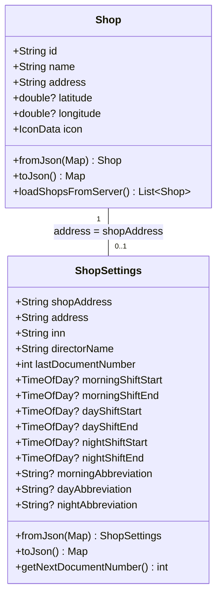
```mermaid
classDiagram
    class Shop {
        +String id
        +String name
        +String address
        +double? latitude
        +double? longitude
        +IconData icon
        +fromJson(Map) Shop
        +toJson() Map
        +loadShopsFromServer() List~Shop~
    }

    class ShopSettings {
        +String shopAddress
        +String address
        +String inn
        +String directorName
        +int lastDocumentNumber
        +TimeOfDay? morningShiftStart
        +TimeOfDay? morningShiftEnd
        +TimeOfDay? dayShiftStart
        +TimeOfDay? dayShiftEnd
        +TimeOfDay? nightShiftStart
        +TimeOfDay? nightShiftEnd
        +String? morningAbbreviation
        +String? dayAbbreviation
        +String? nightAbbreviation
        +fromJson(Map) ShopSettings
        +toJson() Map
        +getNextDocumentNumber() int
    }

    Shop "1" -- "0..1" ShopSettings : address = shopAddress
```

---

### 1.3 Связи с другими модулями

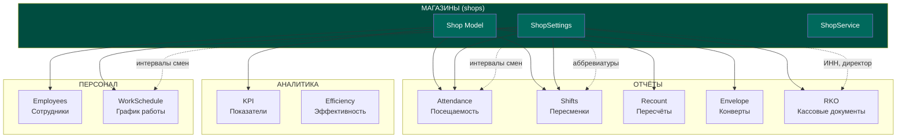
```mermaid
flowchart TB
    subgraph SHOPS["МАГАЗИНЫ (shops)"]
        SM[Shop Model]
        SS[ShopSettings]
        SVC[ShopService]
    end

    subgraph REPORTS["ОТЧЁТЫ"]
        ATT[Attendance<br/>Посещаемость]
        SH[Shifts<br/>Пересменки]
        RC[Recount<br/>Пересчёты]
        ENV[Envelope<br/>Конверты]
        RKO[RKO<br/>Кассовые документы]
    end

    subgraph ANALYTICS["АНАЛИТИКА"]
        KPI[KPI<br/>Показатели]
        EFF[Efficiency<br/>Эффективность]
    end

    subgraph STAFF["ПЕРСОНАЛ"]
        EMP[Employees<br/>Сотрудники]
        WS[WorkSchedule<br/>График работы]
    end

    SM --> ATT
    SM --> SH
    SM --> RC
    SM --> ENV
    SM --> KPI
    SM --> EMP

    SS --> ATT
    SS --> SH
    SS --> RKO
    SS --> WS

    SS -.->|ИНН, директор| RKO
    SS -.->|интервалы смен| ATT
    SS -.->|интервалы смен| WS
    SS -.->|аббревиатуры| SH

    style SHOPS fill:#004D40,color:#fff
    style SM fill:#00695C,color:#fff
    style SS fill:#00695C,color:#fff
    style SVC fill:#00695C,color:#fff
```

---

### 1.4 Детальные связи

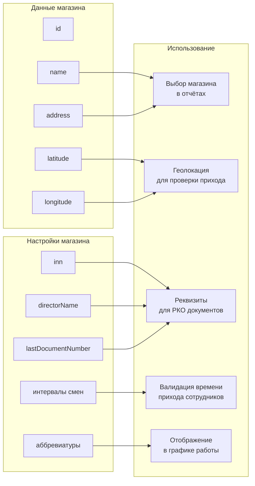
```mermaid
flowchart LR
    subgraph Shop_Data["Данные магазина"]
        ID[id]
        NAME[name]
        ADDR[address]
        LAT[latitude]
        LON[longitude]
    end

    subgraph Settings_Data["Настройки магазина"]
        INN[inn]
        DIR[directorName]
        DOC[lastDocumentNumber]
        SHIFTS[интервалы смен]
        ABBR[аббревиатуры]
    end

    subgraph Usage["Использование"]
        U1[Выбор магазина<br/>в отчётах]
        U2[Геолокация<br/>для проверки прихода]
        U3[Реквизиты<br/>для РКО документов]
        U4[Валидация времени<br/>прихода сотрудников]
        U5[Отображение<br/>в графике работы]
    end

    NAME --> U1
    ADDR --> U1
    LAT --> U2
    LON --> U2
    INN --> U3
    DIR --> U3
    DOC --> U3
    SHIFTS --> U4
    ABBR --> U5
```

---

### 1.5 API Endpoints

| Метод | Endpoint | Описание |
|-------|----------|----------|
| GET | `/api/shops` | Получить все магазины |
| GET | `/api/shops/:id` | Получить магазин по ID |
| POST | `/api/shops` | Создать магазин (name, address, latitude?, longitude?) |
| PUT | `/api/shops/:id` | Обновить магазин |
| DELETE | `/api/shops/:id` | Удалить магазин |
| GET | `/api/shop-settings/:shopAddress` | Получить настройки |
| POST | `/api/shop-settings` | Сохранить настройки |

---

### 1.6 Поток данных: Создание магазина

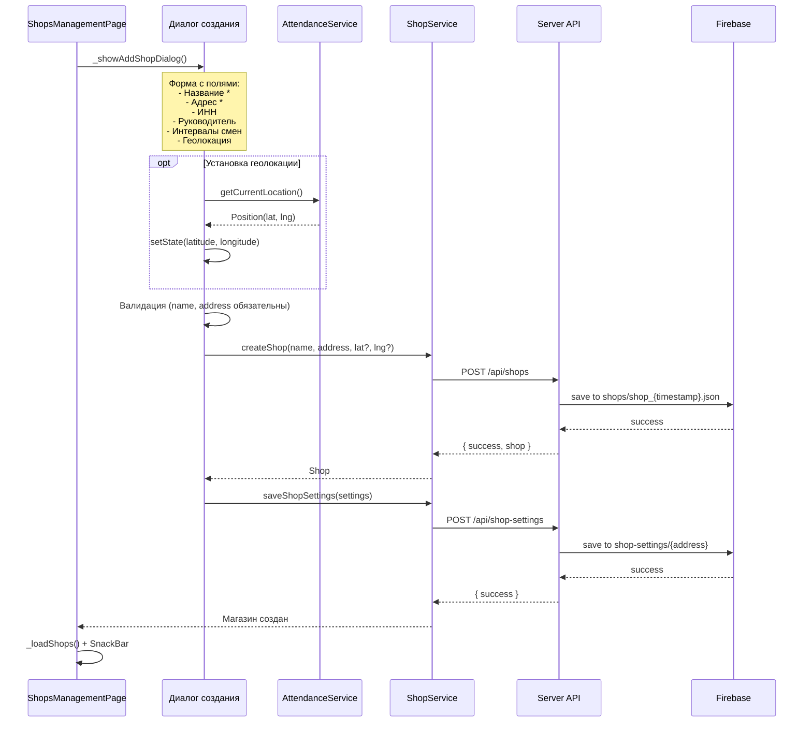
```mermaid
sequenceDiagram
    participant UI as ShopsManagementPage
    participant DLG as Диалог создания
    participant GPS as AttendanceService
    participant SVC as ShopService
    participant API as Server API
    participant DB as Firebase

    UI->>DLG: _showAddShopDialog()
    Note over DLG: Форма с полями:<br/>- Название *<br/>- Адрес *<br/>- ИНН<br/>- Руководитель<br/>- Интервалы смен<br/>- Геолокация

    opt Установка геолокации
        DLG->>GPS: getCurrentLocation()
        GPS-->>DLG: Position(lat, lng)
        DLG->>DLG: setState(latitude, longitude)
    end

    DLG->>DLG: Валидация (name, address обязательны)
    DLG->>SVC: createShop(name, address, lat?, lng?)
    SVC->>API: POST /api/shops
    API->>DB: save to shops/shop_{timestamp}.json
    DB-->>API: success
    API-->>SVC: { success, shop }
    SVC-->>DLG: Shop

    DLG->>SVC: saveShopSettings(settings)
    SVC->>API: POST /api/shop-settings
    API->>DB: save to shop-settings/{address}
    DB-->>API: success
    API-->>SVC: { success }

    SVC-->>UI: Магазин создан
    UI->>UI: _loadShops() + SnackBar
```

---

### 1.7 Поток данных: Загрузка магазинов

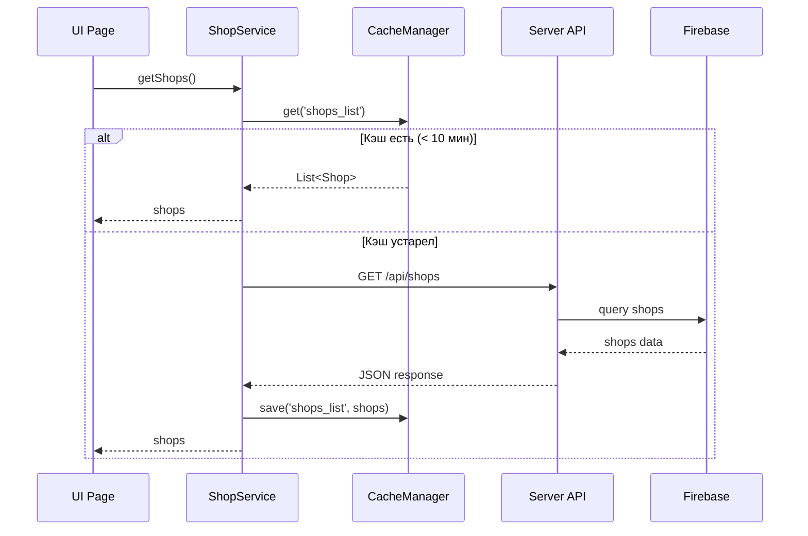
```mermaid
sequenceDiagram
    participant UI as UI Page
    participant SVC as ShopService
    participant CACHE as CacheManager
    participant API as Server API
    participant DB as Firebase

    UI->>SVC: getShops()
    SVC->>CACHE: get('shops_list')

    alt Кэш есть (< 10 мин)
        CACHE-->>SVC: List<Shop>
        SVC-->>UI: shops
    else Кэш устарел
        SVC->>API: GET /api/shops
        API->>DB: query shops
        DB-->>API: shops data
        API-->>SVC: JSON response
        SVC->>CACHE: save('shops_list', shops)
        SVC-->>UI: shops
    end
```

---

### 1.8 Поток данных: Сохранение настроек магазина

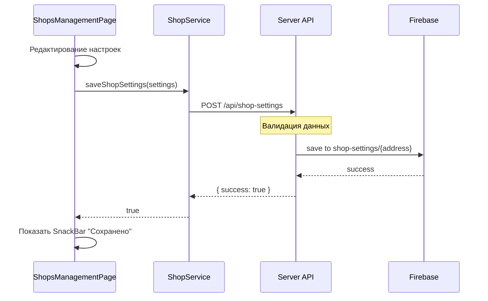
```mermaid
sequenceDiagram
    participant UI as ShopsManagementPage
    participant SVC as ShopService
    participant API as Server API
    participant DB as Firebase

    UI->>UI: Редактирование настроек
    UI->>SVC: saveShopSettings(settings)
    SVC->>API: POST /api/shop-settings

    Note over API: Валидация данных

    API->>DB: save to shop-settings/{address}
    DB-->>API: success
    API-->>SVC: { success: true }
    SVC-->>UI: true
    UI->>UI: Показать SnackBar "Сохранено"
```

---

### 1.9 Использование ShopSettings в Attendance

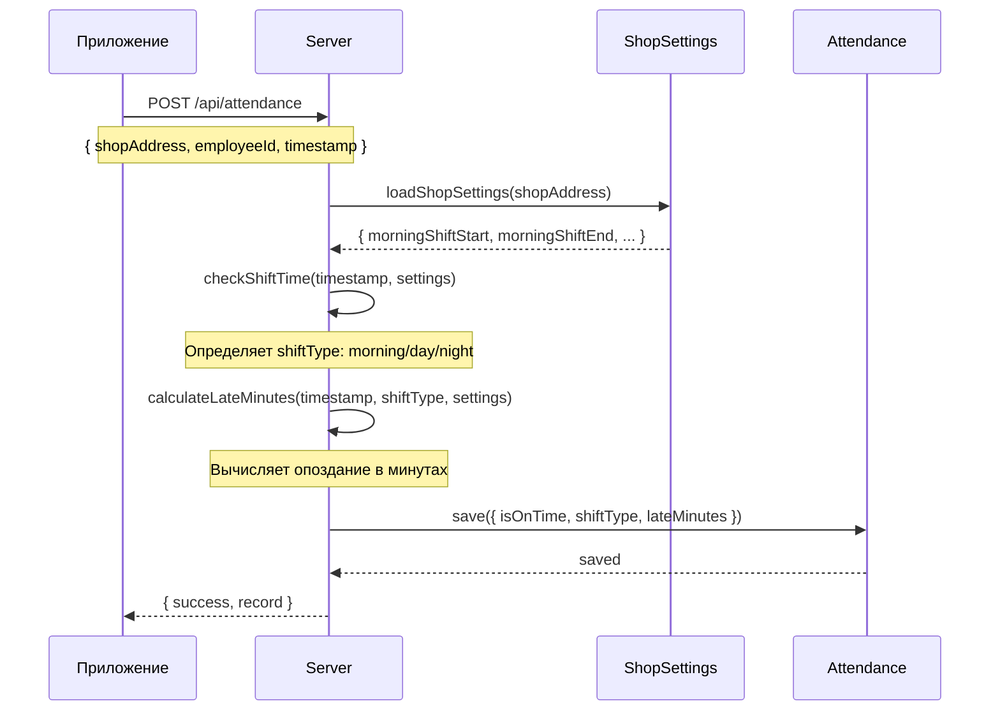
```mermaid
sequenceDiagram
    participant APP as Приложение
    participant API as Server
    participant SS as ShopSettings
    participant ATT as Attendance

    APP->>API: POST /api/attendance
    Note over APP,API: { shopAddress, employeeId, timestamp }

    API->>SS: loadShopSettings(shopAddress)
    SS-->>API: { morningShiftStart, morningShiftEnd, ... }

    API->>API: checkShiftTime(timestamp, settings)
    Note over API: Определяет shiftType: morning/day/night

    API->>API: calculateLateMinutes(timestamp, shiftType, settings)
    Note over API: Вычисляет опоздание в минутах

    API->>ATT: save({ isOnTime, shiftType, lateMinutes })
    ATT-->>API: saved
    API-->>APP: { success, record }
```

---

### 1.10 Таблица зависимостей

| Модуль | Использует Shop | Использует ShopSettings | Что берёт |
|--------|-----------------|------------------------|-----------|
| **Attendance** | ✅ | ✅ | address, интервалы смен |
| **Shifts** | ✅ | ✅ | address, аббревиатуры |
| **RKO** | ✅ | ✅ | address, ИНН, директор, номер документа |
| **KPI** | ✅ | ❌ | address для фильтрации |
| **WorkSchedule** | ✅ | ✅ | address, интервалы смен |
| **Recount** | ✅ | ❌ | address для выбора |
| **Envelope** | ✅ | ❌ | address для выбора |
| **Employees** | ✅ | ❌ | address для привязки |

---

### 1.11 Кэширование

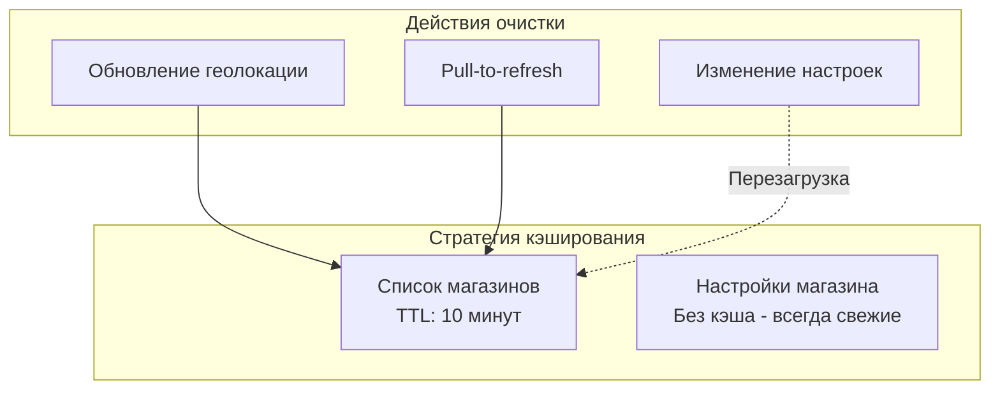
```mermaid
flowchart TB
    subgraph Cache["Стратегия кэширования"]
        C1[Список магазинов<br/>TTL: 10 минут]
        C2[Настройки магазина<br/>Без кэша - всегда свежие]
    end

    subgraph Actions["Действия очистки"]
        A1[Обновление геолокации]
        A2[Pull-to-refresh]
        A3[Изменение настроек]
    end

    A1 --> C1
    A2 --> C1
    A3 -.->|Перезагрузка| C1
```

---

## 2. Управление данными - СОТРУДНИКИ

### 2.1 Обзор модуля

**Назначение:** Центральный модуль для управления сотрудниками сети кофеен. Обеспечивает регистрацию, верификацию, определение ролей и настройку предпочтений сотрудников.

**Файлы модуля:**
```
lib/features/employees/
├── models/
│   ├── user_role_model.dart              # Модель роли пользователя
│   └── employee_registration_model.dart  # Модель регистрации (паспорт)
├── pages/
│   ├── employees_page.dart               # Главная страница + модель Employee
│   ├── employee_panel_page.dart          # Панель сотрудника
│   ├── employee_preferences_dialog.dart  # Диалог предпочтений
│   ├── employee_registration_page.dart   # Форма регистрации
│   ├── employee_registration_view_page.dart     # Просмотр регистрации
│   ├── employee_registration_select_employee_page.dart  # Выбор сотрудника
│   ├── employee_schedule_page.dart       # Расписание сотрудника
│   └── unverified_employees_page.dart    # Не верифицированные
└── services/
    ├── employee_service.dart             # CRUD операции
    ├── employee_registration_service.dart # Регистрация и верификация
    └── user_role_service.dart            # Определение ролей
```

---

### 2.2 Модели данных

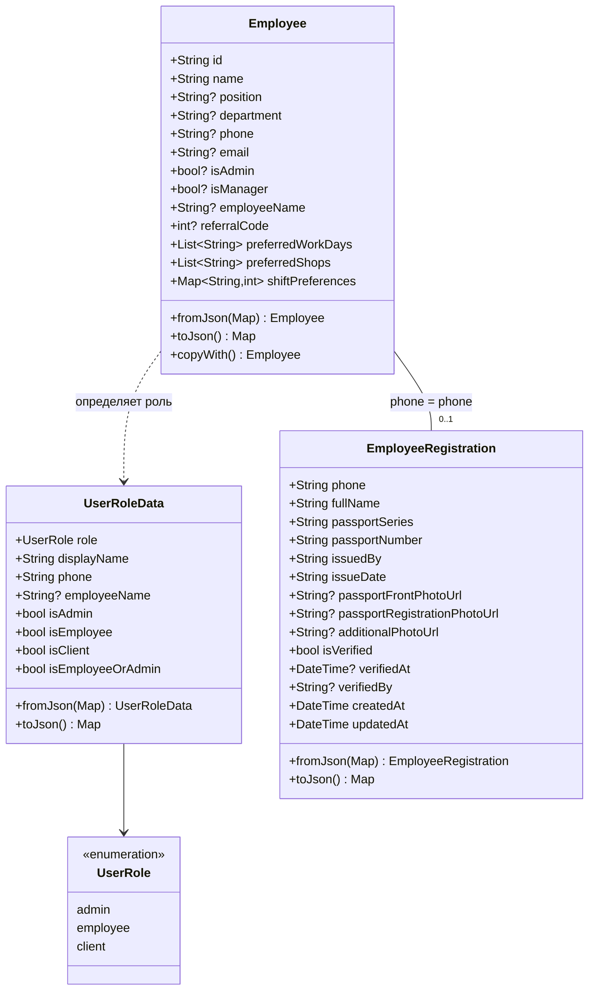
```mermaid
classDiagram
    class Employee {
        +String id
        +String name
        +String? position
        +String? department
        +String? phone
        +String? email
        +bool? isAdmin
        +bool? isManager
        +String? employeeName
        +int? referralCode
        +List~String~ preferredWorkDays
        +List~String~ preferredShops
        +Map~String,int~ shiftPreferences
        +fromJson(Map) Employee
        +toJson() Map
        +copyWith() Employee
    }

    class UserRoleData {
        +UserRole role
        +String displayName
        +String phone
        +String? employeeName
        +bool isAdmin
        +bool isEmployee
        +bool isClient
        +bool isEmployeeOrAdmin
        +fromJson(Map) UserRoleData
        +toJson() Map
    }

    class EmployeeRegistration {
        +String phone
        +String fullName
        +String passportSeries
        +String passportNumber
        +String issuedBy
        +String issueDate
        +String? passportFrontPhotoUrl
        +String? passportRegistrationPhotoUrl
        +String? additionalPhotoUrl
        +bool isVerified
        +DateTime? verifiedAt
        +String? verifiedBy
        +DateTime createdAt
        +DateTime updatedAt
        +fromJson(Map) EmployeeRegistration
        +toJson() Map
    }

    class UserRole {
        <<enumeration>>
        admin
        employee
        client
    }

    Employee "1" -- "0..1" EmployeeRegistration : phone = phone
    UserRoleData --> UserRole
    Employee ..> UserRoleData : определяет роль
```

---

### 2.3 Связи с другими модулями

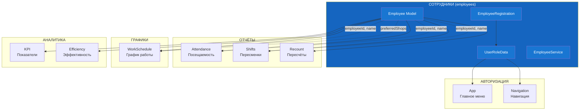
```mermaid
flowchart TB
    subgraph EMPLOYEES["СОТРУДНИКИ (employees)"]
        EMP[Employee Model]
        REG[EmployeeRegistration]
        ROLE[UserRoleData]
        SVC[EmployeeService]
    end

    subgraph REPORTS["ОТЧЁТЫ"]
        ATT[Attendance<br/>Посещаемость]
        SH[Shifts<br/>Пересменки]
        RC[Recount<br/>Пересчёты]
    end

    subgraph SCHEDULE["ГРАФИКИ"]
        WS[WorkSchedule<br/>График работы]
    end

    subgraph ANALYTICS["АНАЛИТИКА"]
        KPI[KPI<br/>Показатели]
        EFF[Efficiency<br/>Эффективность]
    end

    subgraph AUTH["АВТОРИЗАЦИЯ"]
        APP[App<br/>Главное меню]
        NAV[Navigation<br/>Навигация]
    end

    EMP --> ATT
    EMP --> SH
    EMP --> RC
    EMP --> WS
    EMP --> KPI
    EMP --> EFF

    ROLE --> APP
    ROLE --> NAV
    REG --> ROLE

    EMP -.->|employeeId, name| ATT
    EMP -.->|employeeId, name| SH
    EMP -.->|employeeId, name| WS
    EMP -.->|preferredShops| WS

    style EMPLOYEES fill:#1565C0,color:#fff
    style EMP fill:#1976D2,color:#fff
    style REG fill:#1976D2,color:#fff
    style ROLE fill:#1976D2,color:#fff
    style SVC fill:#1976D2,color:#fff
```

---

### 2.4 Детальные связи

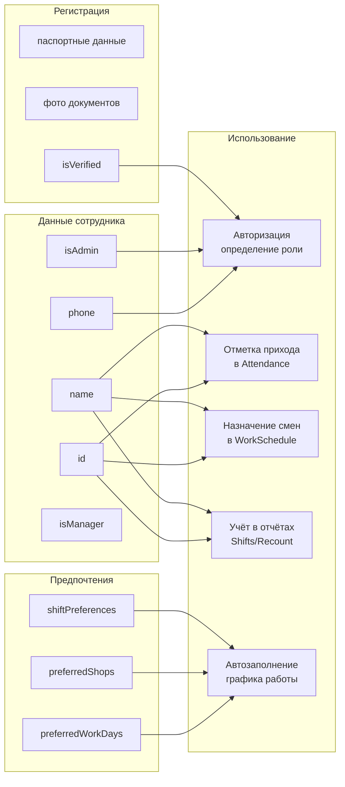
```mermaid
flowchart LR
    subgraph Employee_Data["Данные сотрудника"]
        ID[id]
        NAME[name]
        PHONE[phone]
        ADMIN[isAdmin]
        MANAGER[isManager]
    end

    subgraph Preferences["Предпочтения"]
        DAYS[preferredWorkDays]
        SHOPS[preferredShops]
        SHIFTS[shiftPreferences]
    end

    subgraph Registration["Регистрация"]
        PASSPORT[паспортные данные]
        PHOTOS[фото документов]
        VERIFIED[isVerified]
    end

    subgraph Usage["Использование"]
        U1[Авторизация<br/>определение роли]
        U2[Отметка прихода<br/>в Attendance]
        U3[Назначение смен<br/>в WorkSchedule]
        U4[Учёт в отчётах<br/>Shifts/Recount]
        U5[Автозаполнение<br/>графика работы]
    end

    PHONE --> U1
    ADMIN --> U1
    VERIFIED --> U1
    ID --> U2
    NAME --> U2
    ID --> U3
    NAME --> U3
    DAYS --> U5
    SHOPS --> U5
    SHIFTS --> U5
    ID --> U4
    NAME --> U4
```

---

### 2.5 API Endpoints

| Метод | Endpoint | Описание |
|-------|----------|----------|
| GET | `/api/employees` | Получить всех сотрудников |
| GET | `/api/employees/:id` | Получить сотрудника по ID |
| POST | `/api/employees` | Создать сотрудника |
| PUT | `/api/employees/:id` | Обновить сотрудника |
| DELETE | `/api/employees/:id` | Удалить сотрудника |
| GET | `/api/employee-registration/:phone` | Получить регистрацию по телефону |
| POST | `/api/employee-registration` | Сохранить регистрацию |
| POST | `/api/employee-registration/:phone/verify` | Верифицировать сотрудника |
| GET | `/api/employee-registrations` | Получить все регистрации (для админа) |
| POST | `/upload-employee-photo` | Загрузить фото документа |

---

### 2.6 Поток данных: Регистрация сотрудника

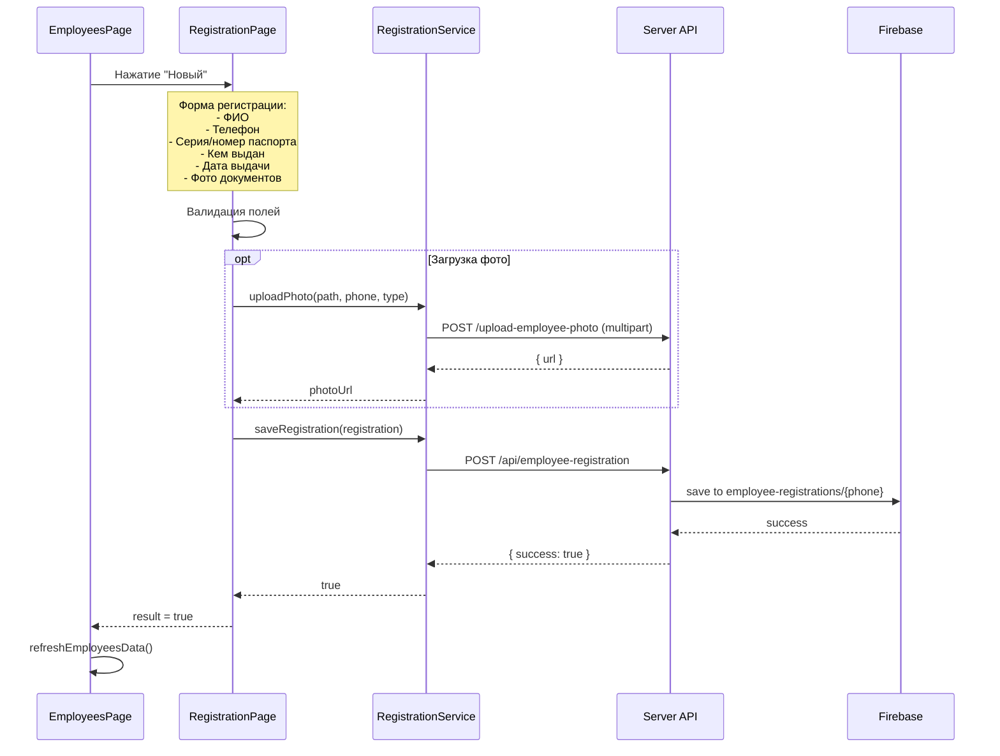
```mermaid
sequenceDiagram
    participant UI as EmployeesPage
    participant REG as RegistrationPage
    participant SVC as RegistrationService
    participant API as Server API
    participant DB as Firebase

    UI->>REG: Нажатие "Новый"
    Note over REG: Форма регистрации:<br/>- ФИО<br/>- Телефон<br/>- Серия/номер паспорта<br/>- Кем выдан<br/>- Дата выдачи<br/>- Фото документов

    REG->>REG: Валидация полей

    opt Загрузка фото
        REG->>SVC: uploadPhoto(path, phone, type)
        SVC->>API: POST /upload-employee-photo (multipart)
        API-->>SVC: { url }
        SVC-->>REG: photoUrl
    end

    REG->>SVC: saveRegistration(registration)
    SVC->>API: POST /api/employee-registration
    API->>DB: save to employee-registrations/{phone}
    DB-->>API: success
    API-->>SVC: { success: true }
    SVC-->>REG: true

    REG-->>UI: result = true
    UI->>UI: refreshEmployeesData()
```

---

### 2.7 Поток данных: Верификация сотрудника

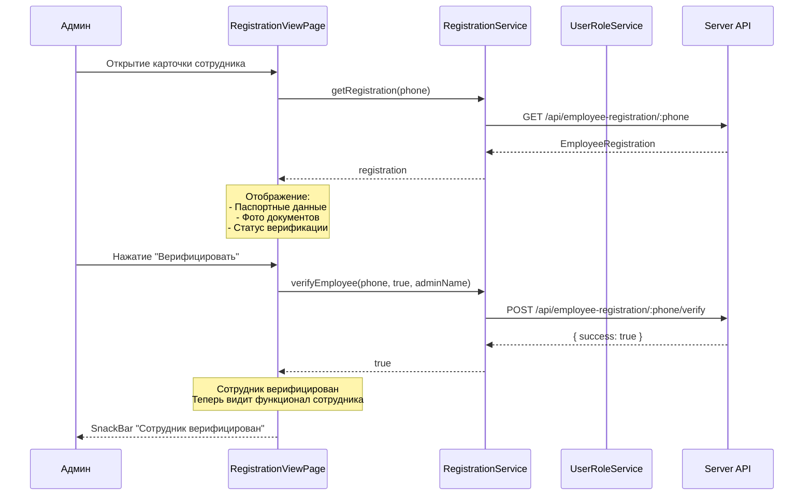
```mermaid
sequenceDiagram
    participant ADMIN as Админ
    participant UI as RegistrationViewPage
    participant SVC as RegistrationService
    participant ROLE as UserRoleService
    participant API as Server API

    ADMIN->>UI: Открытие карточки сотрудника
    UI->>SVC: getRegistration(phone)
    SVC->>API: GET /api/employee-registration/:phone
    API-->>SVC: EmployeeRegistration
    SVC-->>UI: registration

    Note over UI: Отображение:<br/>- Паспортные данные<br/>- Фото документов<br/>- Статус верификации

    ADMIN->>UI: Нажатие "Верифицировать"
    UI->>SVC: verifyEmployee(phone, true, adminName)
    SVC->>API: POST /api/employee-registration/:phone/verify
    API-->>SVC: { success: true }
    SVC-->>UI: true

    Note over UI: Сотрудник верифицирован<br/>Теперь видит функционал сотрудника

    UI-->>ADMIN: SnackBar "Сотрудник верифицирован"
```

---

### 2.8 Поток данных: Определение роли пользователя

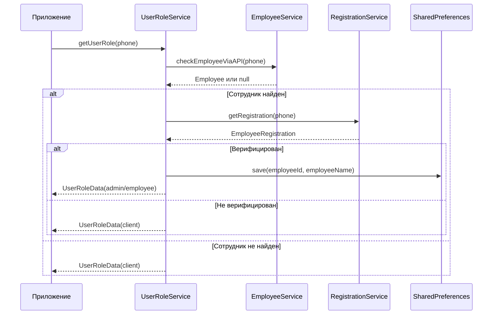
```mermaid
sequenceDiagram
    participant APP as Приложение
    participant ROLE as UserRoleService
    participant EMP as EmployeeService
    participant REG as RegistrationService
    participant CACHE as SharedPreferences

    APP->>ROLE: getUserRole(phone)

    ROLE->>EMP: checkEmployeeViaAPI(phone)
    EMP-->>ROLE: Employee или null

    alt Сотрудник найден
        ROLE->>REG: getRegistration(phone)
        REG-->>ROLE: EmployeeRegistration

        alt Верифицирован
            ROLE->>CACHE: save(employeeId, employeeName)
            ROLE-->>APP: UserRoleData(admin/employee)
        else Не верифицирован
            ROLE-->>APP: UserRoleData(client)
        end
    else Сотрудник не найден
        ROLE-->>APP: UserRoleData(client)
    end
```

---

### 2.9 Таблица зависимостей

| Модуль | Использует Employee | Использует Registration | Что берёт |
|--------|---------------------|------------------------|-----------|
| **Attendance** | ✅ | ❌ | employeeId, name для отметки |
| **Shifts** | ✅ | ❌ | employeeId, name для пересменок |
| **Recount** | ✅ | ❌ | employeeId, name для пересчётов |
| **WorkSchedule** | ✅ | ❌ | employeeId, name, preferences |
| **KPI** | ✅ | ❌ | employeeId для статистики |
| **Efficiency** | ✅ | ❌ | employeeId для баллов |
| **App/Navigation** | ❌ | ✅ | isVerified для определения роли |

---

### 2.10 Предпочтения сотрудника

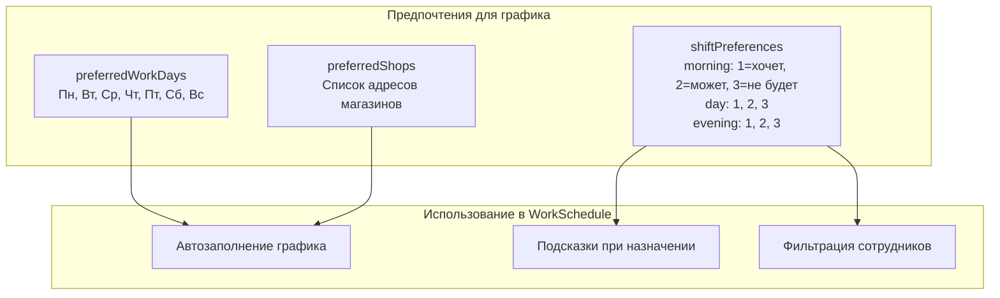
```mermaid
flowchart TB
    subgraph Preferences["Предпочтения для графика"]
        DAYS[preferredWorkDays<br/>Пн, Вт, Ср, Чт, Пт, Сб, Вс]
        SHOPS[preferredShops<br/>Список адресов магазинов]
        SHIFTS[shiftPreferences<br/>morning: 1=хочет, 2=может, 3=не будет<br/>day: 1, 2, 3<br/>evening: 1, 2, 3]
    end

    subgraph Usage["Использование в WorkSchedule"]
        AUTO[Автозаполнение графика]
        SUGGEST[Подсказки при назначении]
        FILTER[Фильтрация сотрудников]
    end

    DAYS --> AUTO
    SHOPS --> AUTO
    SHIFTS --> SUGGEST
    SHIFTS --> FILTER
```

---

### 2.11 Роли пользователей

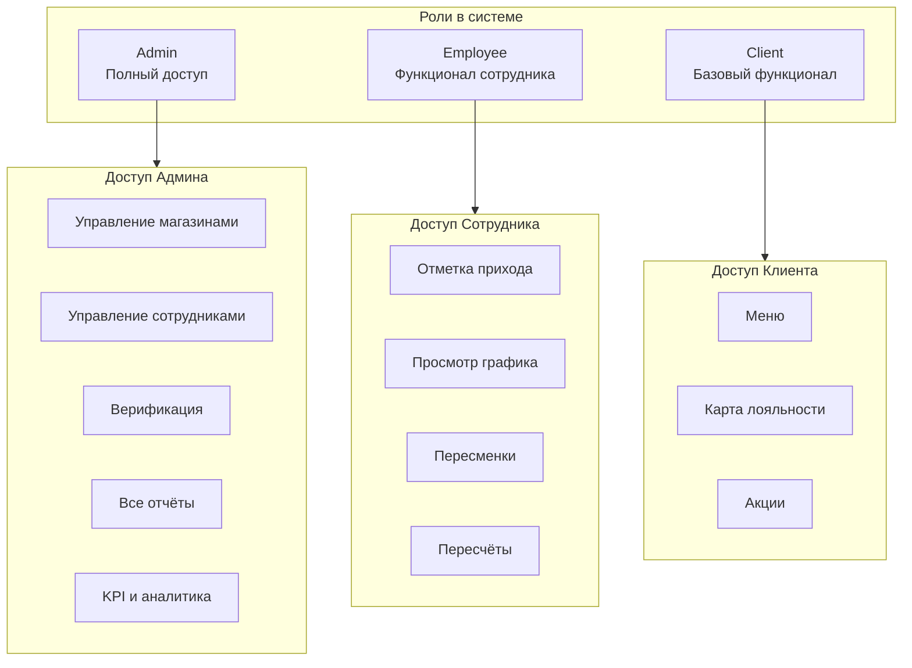
```mermaid
flowchart TB
    subgraph Roles["Роли в системе"]
        ADMIN[Admin<br/>Полный доступ]
        EMP[Employee<br/>Функционал сотрудника]
        CLIENT[Client<br/>Базовый функционал]
    end

    subgraph AdminAccess["Доступ Админа"]
        A1[Управление магазинами]
        A2[Управление сотрудниками]
        A3[Верификация]
        A4[Все отчёты]
        A5[KPI и аналитика]
    end

    subgraph EmployeeAccess["Доступ Сотрудника"]
        E1[Отметка прихода]
        E2[Просмотр графика]
        E3[Пересменки]
        E4[Пересчёты]
    end

    subgraph ClientAccess["Доступ Клиента"]
        C1[Меню]
        C2[Карта лояльности]
        C3[Акции]
    end

    ADMIN --> AdminAccess
    EMP --> EmployeeAccess
    CLIENT --> ClientAccess
```

---

### 2.12 Кэширование

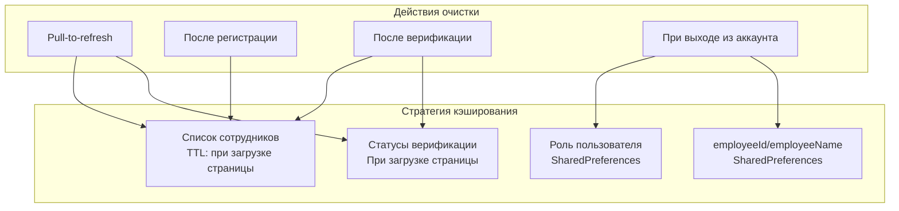
```mermaid
flowchart TB
    subgraph Cache["Стратегия кэширования"]
        C1[Список сотрудников<br/>TTL: при загрузке страницы]
        C2[Роль пользователя<br/>SharedPreferences]
        C3[employeeId/employeeName<br/>SharedPreferences]
        C4[Статусы верификации<br/>При загрузке страницы]
    end

    subgraph Actions["Действия очистки"]
        A1[Pull-to-refresh]
        A2[После регистрации]
        A3[После верификации]
        A4[При выходе из аккаунта]
    end

    A1 --> C1
    A1 --> C4
    A2 --> C1
    A3 --> C1
    A3 --> C4
    A4 --> C2
    A4 --> C3
```

---

## 3. Управление данными - ГРАФИК РАБОТЫ

### 3.1 Обзор модуля

**Назначение:** Модуль для составления и управления графиком работы сотрудников. Включает автозаполнение, валидацию конфликтов, передачу смен между сотрудниками и экспорт в PDF.

**Файлы модуля:**
```
lib/features/work_schedule/
├── models/
│   ├── work_schedule_model.dart       # Модели: WorkSchedule, WorkScheduleEntry, ShiftType, ScheduleTemplate
│   └── shift_transfer_model.dart      # Модель запроса на передачу смены
├── pages/
│   ├── work_schedule_page.dart        # Главная страница (3 вкладки)
│   ├── employee_bulk_schedule_dialog.dart  # Массовое редактирование
│   ├── my_schedule_page.dart          # "Мой график" для сотрудника
│   └── shift_transfer_requests_page.dart   # Запросы на передачу смен
├── services/
│   ├── work_schedule_service.dart     # CRUD операции с графиком
│   ├── auto_fill_schedule_service.dart # Алгоритм автозаполнения
│   ├── schedule_pdf_service.dart      # Генерация PDF
│   └── shift_transfer_service.dart    # Передача смен
└── work_schedule_validator.dart       # Валидация графика
```

---

### 3.2 Модели данных

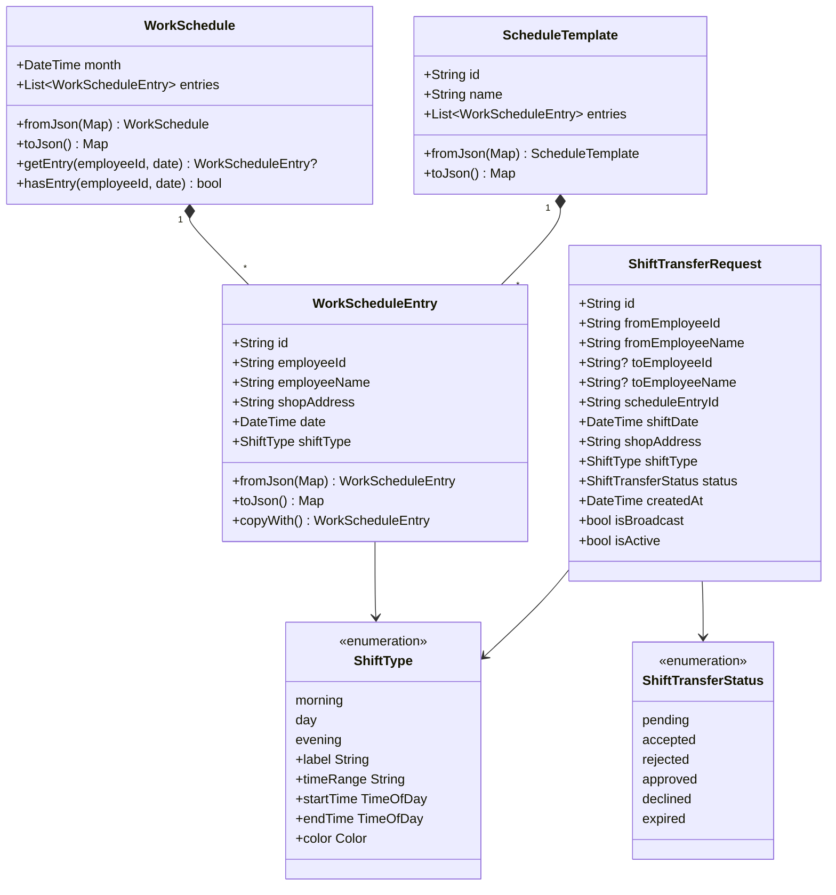
```mermaid
classDiagram
    class WorkSchedule {
        +DateTime month
        +List~WorkScheduleEntry~ entries
        +fromJson(Map) WorkSchedule
        +toJson() Map
        +getEntry(employeeId, date) WorkScheduleEntry?
        +hasEntry(employeeId, date) bool
    }

    class WorkScheduleEntry {
        +String id
        +String employeeId
        +String employeeName
        +String shopAddress
        +DateTime date
        +ShiftType shiftType
        +fromJson(Map) WorkScheduleEntry
        +toJson() Map
        +copyWith() WorkScheduleEntry
    }

    class ShiftType {
        <<enumeration>>
        morning
        day
        evening
        +label String
        +timeRange String
        +startTime TimeOfDay
        +endTime TimeOfDay
        +color Color
    }

    class ScheduleTemplate {
        +String id
        +String name
        +List~WorkScheduleEntry~ entries
        +fromJson(Map) ScheduleTemplate
        +toJson() Map
    }

    class ShiftTransferRequest {
        +String id
        +String fromEmployeeId
        +String fromEmployeeName
        +String? toEmployeeId
        +String? toEmployeeName
        +String scheduleEntryId
        +DateTime shiftDate
        +String shopAddress
        +ShiftType shiftType
        +ShiftTransferStatus status
        +DateTime createdAt
        +bool isBroadcast
        +bool isActive
    }

    class ShiftTransferStatus {
        <<enumeration>>
        pending
        accepted
        rejected
        approved
        declined
        expired
    }

    WorkSchedule "1" *-- "*" WorkScheduleEntry
    WorkScheduleEntry --> ShiftType
    ScheduleTemplate "1" *-- "*" WorkScheduleEntry
    ShiftTransferRequest --> ShiftType
    ShiftTransferRequest --> ShiftTransferStatus
```

---

### 3.3 Связи с другими модулями

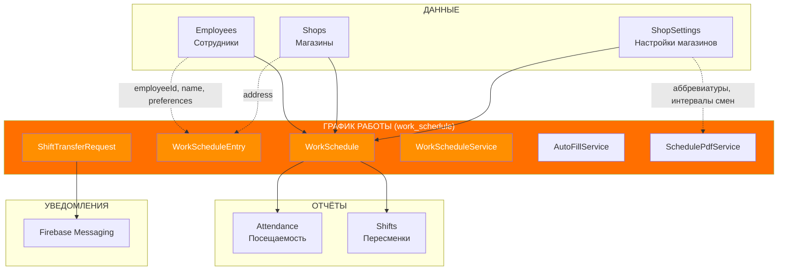
```mermaid
flowchart TB
    subgraph SCHEDULE["ГРАФИК РАБОТЫ (work_schedule)"]
        WS[WorkSchedule]
        WSE[WorkScheduleEntry]
        STR[ShiftTransferRequest]
        SVC[WorkScheduleService]
        AUTO[AutoFillService]
        PDF[SchedulePdfService]
    end

    subgraph DATA["ДАННЫЕ"]
        EMP[Employees<br/>Сотрудники]
        SHOP[Shops<br/>Магазины]
        SS[ShopSettings<br/>Настройки магазинов]
    end

    subgraph REPORTS["ОТЧЁТЫ"]
        ATT[Attendance<br/>Посещаемость]
        SH[Shifts<br/>Пересменки]
    end

    subgraph NOTIFICATIONS["УВЕДОМЛЕНИЯ"]
        FCM[Firebase Messaging]
    end

    EMP --> WS
    SHOP --> WS
    SS --> WS

    EMP -.->|employeeId, name, preferences| WSE
    SHOP -.->|address| WSE
    SS -.->|аббревиатуры, интервалы смен| PDF

    WS --> ATT
    WS --> SH

    STR --> FCM

    style SCHEDULE fill:#FF6F00,color:#fff
    style WS fill:#FF8F00,color:#fff
    style WSE fill:#FF8F00,color:#fff
    style STR fill:#FF8F00,color:#fff
    style SVC fill:#FF8F00,color:#fff
```

---

### 3.4 Типы смен (ShiftType)

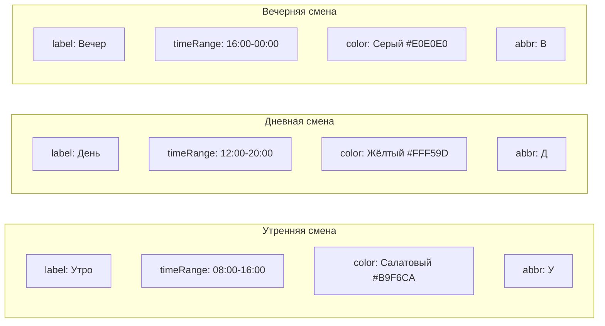
```mermaid
flowchart LR
    subgraph Morning["Утренняя смена"]
        M1[label: Утро]
        M2[timeRange: 08:00-16:00]
        M3[color: Салатовый #B9F6CA]
        M4[abbr: У]
    end

    subgraph Day["Дневная смена"]
        D1[label: День]
        D2[timeRange: 12:00-20:00]
        D3[color: Жёлтый #FFF59D]
        D4[abbr: Д]
    end

    subgraph Evening["Вечерняя смена"]
        E1[label: Вечер]
        E2[timeRange: 16:00-00:00]
        E3[color: Серый #E0E0E0]
        E4[abbr: В]
    end
```

---

### 3.5 API Endpoints

| Метод | Endpoint | Описание |
|-------|----------|----------|
| GET | `/api/work-schedule?month=YYYY-MM` | Получить график на месяц |
| GET | `/api/work-schedule/employee/:id?month=YYYY-MM` | График сотрудника |
| POST | `/api/work-schedule` | Создать/обновить смену |
| DELETE | `/api/work-schedule/:id?month=YYYY-MM` | Удалить смену |
| DELETE | `/api/work-schedule/clear?month=YYYY-MM` | Очистить месяц |
| POST | `/api/work-schedule/bulk` | Массовое создание смен |
| GET | `/api/work-schedule/template` | Получить шаблоны |
| POST | `/api/work-schedule/template` | Сохранить шаблон |
| POST | `/api/shift-transfers` | Создать запрос на передачу |
| GET | `/api/shift-transfers/employee/:id` | Запросы для сотрудника |
| GET | `/api/shift-transfers/admin` | Запросы для админа |
| PUT | `/api/shift-transfers/:id/accept` | Принять запрос |
| PUT | `/api/shift-transfers/:id/reject` | Отклонить запрос |
| PUT | `/api/shift-transfers/:id/approve` | Одобрить (админ) |
| PUT | `/api/shift-transfers/:id/decline` | Отказать (админ) |

---

### 3.6 Поток данных: Создание смены

```mermaid
sequenceDiagram
    participant UI as WorkSchedulePage
    participant DLG as Диалог редактирования
    participant SVC as WorkScheduleService
    participant API as Server API
    participant DB as Firebase

    UI->>DLG: Клик на ячейку (сотрудник × дата)
    Note over DLG: Выбор:<br/>- Магазин<br/>- Тип смены (У/Д/В)

    DLG->>SVC: saveShift(entry)
    SVC->>API: POST /api/work-schedule
    Note over API: { employeeId, employeeName,<br/>shopAddress, date, shiftType, month }

    API->>DB: save to work-schedule/{month}/{entryId}
    DB-->>API: success
    API-->>SVC: { success: true }
    SVC-->>DLG: true

    DLG-->>UI: Закрытие диалога
    UI->>UI: _loadSchedule() обновить
```

---

### 3.7 Поток данных: Автозаполнение

```mermaid
sequenceDiagram
    participant UI as WorkSchedulePage
    participant AUTO as AutoFillScheduleService
    participant SVC as WorkScheduleService
    participant VALID as Validator

    UI->>UI: Выбор периода (startDate, endDate)
    UI->>AUTO: autoFill(...)
    Note over AUTO: Параметры:<br/>- employees<br/>- shops<br/>- shopSettings<br/>- existingSchedule<br/>- replaceExisting

    loop Для каждого дня
        loop Для каждого магазина
            AUTO->>AUTO: Определить нужные смены (У, В)
            AUTO->>AUTO: _selectBestEmployee()
            Note over AUTO: Приоритеты:<br/>1. preferredShops<br/>2. preferredWorkDays<br/>3. shiftPreferences<br/>4. Балансировка нагрузки<br/>5. Отсутствие конфликтов
        end
    end

    AUTO->>VALID: _validateSchedule()
    VALID-->>AUTO: warnings[]

    AUTO-->>UI: newEntries[]

    UI->>SVC: bulkCreateShifts(entries)
    SVC-->>UI: success

    UI->>UI: Показать результат
```

---

### 3.8 Алгоритм автозаполнения

```mermaid
flowchart TB
    subgraph Selection["Выбор сотрудника (_selectBestEmployee)"]
        S1[Проверить preferredShops<br/>+10 баллов]
        S2[Проверить preferredWorkDays<br/>+5 баллов]
        S3[Проверить shiftPreferences<br/>1=хочет: +3<br/>2=может: +1<br/>3=не будет: -100]
        S4[Нет конфликтов 24ч<br/>+2 балла]
        S5[Балансировка нагрузки<br/>+100 если 0 смен<br/>+30-assigned иначе]
    end

    subgraph Priority["4 уровня приоритета"]
        P0[Level 0: все предпочтения]
        P1[Level 1: игнор дни]
        P2[Level 2: игнор дни + магазины]
        P3[Level 3: игнор всё]
    end

    subgraph Conflicts["Проверка конфликтов"]
        C1[Утро после вечера вчера ❌]
        C2[Вечер после утра сегодня ❌]
        C3[День после вечера вчера ❌]
        C4[Уже есть смена сегодня ❌]
    end

    S1 --> S2 --> S3 --> S4 --> S5
    P0 --> P1 --> P2 --> P3
    Selection --> Conflicts
```

---

### 3.9 Поток данных: Передача смены

```mermaid
sequenceDiagram
    participant EMP1 as Сотрудник 1
    participant UI as MySchedulePage
    participant SVC as ShiftTransferService
    participant FCM as Уведомления
    participant EMP2 as Сотрудник 2
    participant ADMIN as Админ

    EMP1->>UI: "Передать смену"
    UI->>SVC: createRequest(request)
    Note over SVC: toEmployeeId=null<br/>(broadcast всем)

    SVC->>FCM: Отправить уведомление
    FCM-->>EMP2: "Запрос на смену"

    EMP2->>SVC: acceptRequest(requestId)
    Note over SVC: status: accepted<br/>acceptedByEmployeeId

    SVC->>FCM: Уведомить админа
    FCM-->>ADMIN: "Ожидает одобрения"

    ADMIN->>SVC: approveRequest(requestId)
    Note over SVC: status: approved<br/>График обновлён

    SVC->>FCM: Уведомить всех
    FCM-->>EMP1: "Смена передана"
    FCM-->>EMP2: "Смена принята"
```

---

### 3.10 Статусы передачи смены

```mermaid
stateDiagram-v2
    [*] --> pending: createRequest()

    pending --> accepted: Сотрудник принял
    pending --> rejected: Сотрудник отклонил
    pending --> expired: 30 дней

    accepted --> approved: Админ одобрил
    accepted --> declined: Админ отклонил

    rejected --> [*]
    expired --> [*]
    approved --> [*]
    declined --> [*]
```

---

### 3.11 Валидация графика

```mermaid
flowchart TB
    subgraph Critical["Критичные ошибки"]
        E1[missingMorning<br/>Нет утренней смены]
        E2[missingEvening<br/>Нет вечерней смены]
        E3[duplicateMorning<br/>Дубликат утра]
        E4[duplicateEvening<br/>Дубликат вечера]
    end

    subgraph Warnings["Предупреждения"]
        W1[morningAfterEvening<br/>Утро после вечера]
        W2[eveningAfterMorning<br/>Вечер после утра]
        W3[dayAfterEvening<br/>День после вечера]
    end

    subgraph Result["ScheduleValidationResult"]
        R1[criticalErrors: List]
        R2[warnings: List]
        R3[hasCritical: bool]
        R4[totalCount: int]
    end

    Critical --> Result
    Warnings --> Result
```

---

### 3.12 Таблица зависимостей

| Модуль | Использует | Что берёт |
|--------|-----------|-----------|
| **Employee** | ✅ | id, name, preferences для автозаполнения |
| **Shop** | ✅ | address для привязки смен |
| **ShopSettings** | ✅ | аббревиатуры (У/Д/В), интервалы смен |
| **Attendance** | ← | График для сверки прихода |
| **Shifts** | ← | График для пересменок |
| **Firebase** | ✅ | Уведомления о передаче смен |

---

### 3.13 Генерация PDF

```mermaid
flowchart TB
    subgraph Input["Входные данные"]
        I1[WorkSchedule schedule]
        I2[List employeeNames]
        I3[DateTime month]
        I4[int startDay, endDay]
        I5[Map abbreviations]
    end

    subgraph Process["SchedulePdfService"]
        P1[Загрузка шрифтов NotoSans]
        P2[Создание горизонтального A4]
        P3[Заголовок с периодом]
        P4[Таблица: сотрудники × дни]
        P5[Цветные ячейки смен]
        P6[Легенда: У Д В]
    end

    subgraph Output["PDF файл"]
        O1[app-debug.pdf]
    end

    Input --> Process --> Output
```

---

### 3.14 Структура страницы (3 вкладки)

```mermaid
flowchart TB
    subgraph Tabs["WorkSchedulePage"]
        T1[Вкладка 1: График<br/>Основная таблица]
        T2[Вкладка 2: Сотрудники<br/>Список для назначения]
        T3[Вкладка 3: Магазины<br/>Фильтрация по магазинам]
    end

    subgraph Features["Функционал"]
        F1[Выбор периода startDay-endDay]
        F2[Переключение месяцев]
        F3[Автозаполнение]
        F4[Очистка месяца]
        F5[Экспорт в PDF]
        F6[Массовое редактирование]
    end

    Tabs --> Features
```

---

### 3.15 Кэширование

```mermaid
flowchart TB
    subgraph Cache["Стратегия кэширования"]
        C1[График на месяц<br/>Загружается при открытии]
        C2[Список сотрудников<br/>Загружается при открытии]
        C3[Настройки магазинов<br/>Кэш в shopSettingsCache]
        C4[Шаблоны<br/>Загружаются при необходимости]
    end

    subgraph Actions["Действия обновления"]
        A1[Изменение смены]
        A2[Автозаполнение]
        A3[Очистка месяца]
        A4[Смена месяца]
    end

    A1 --> C1
    A2 --> C1
    A3 --> C1
    A4 --> C1
```

---

## 4. Система отчётности - ПЕРЕСМЕНКИ

### 4.1 Обзор модуля

**Назначение:** Модуль для управления пересменками — процессом передачи смены между сотрудниками с заполнением отчёта по вопросам и фотофиксацией состояния магазина.

**Основные компоненты:**
1. **Вопросы пересменки** — управление списком вопросов для заполнения
2. **Отчёты пересменки** — отчёты сотрудников с ответами и фото
3. **Настройки баллов** — система начисления/штрафов за пересменки
4. **Панель работника** — интерфейс для прохождения пересменки

**Файлы модуля:**
```
lib/features/shifts/
├── models/
│   ├── shift_report_model.dart           # Модель отчёта + ShiftAnswer
│   ├── shift_question_model.dart         # Модель вопроса
│   └── pending_shift_report_model.dart   # Модель ожидающей пересменки
├── pages/
│   ├── shift_reports_list_page.dart      # Список отчётов (6 вкладок)
│   ├── shift_report_view_page.dart       # Просмотр отчёта
│   ├── shift_questions_page.dart         # Прохождение пересменки (сотрудник)
│   ├── shift_questions_management_page.dart  # Управление вопросами (админ)
│   ├── shift_shop_selection_page.dart    # Выбор магазина
│   ├── shift_summary_report_page.dart    # Сводный отчёт
│   ├── shift_photo_gallery_page.dart     # Галерея фото
│   └── shift_edit_dialog.dart            # Редактирование отчёта
└── services/
    ├── shift_report_service.dart         # CRUD отчётов
    ├── shift_question_service.dart       # CRUD вопросов
    ├── pending_shift_service.dart        # Ожидающие пересменки
    └── shift_sync_service.dart           # Синхронизация
```

**Связанные модули (efficiency):**
```
lib/features/efficiency/
├── models/
│   └── points_settings_model.dart        # ShiftPointsSettings
├── pages/settings_tabs/
│   ├── shift_points_settings_page.dart   # Настройки баллов пересменки
│   └── shift_points_settings_page_v2.dart
└── services/
    └── points_settings_service.dart      # API настроек баллов
```

---

### 4.2 Модели данных

```mermaid
classDiagram
    class ShiftReport {
        +String id
        +String employeeName
        +String? employeeId
        +String shopAddress
        +String? shopName
        +DateTime createdAt
        +List~ShiftAnswer~ answers
        +bool isSynced
        +DateTime? confirmedAt
        +int? rating
        +String? confirmedByAdmin
        +String? status
        +String? shiftType
        +DateTime? submittedAt
        +DateTime? reviewDeadline
        +DateTime? failedAt
        +DateTime? rejectedAt
        +fromJson(Map) ShiftReport
        +toJson() Map
        +statusEnum ShiftReportStatus
    }

    class ShiftAnswer {
        +String question
        +String? textAnswer
        +double? numberAnswer
        +String? photoPath
        +String? photoDriveId
        +String? referencePhotoUrl
        +fromJson(Map) ShiftAnswer
        +toJson() Map
    }

    class ShiftQuestion {
        +String id
        +String question
        +String? answerFormatB
        +String? answerFormatC
        +List~String~? shops
        +Map~String,String~? referencePhotos
        +isNumberOnly bool
        +isPhotoOnly bool
        +isYesNo bool
        +isTextOnly bool
        +fromJson(Map) ShiftQuestion
        +toJson() Map
    }

    class PendingShiftReport {
        +String id
        +String shopAddress
        +String shiftType
        +String shiftLabel
        +String date
        +String deadline
        +String status
        +String? completedBy
        +DateTime createdAt
        +DateTime? completedAt
        +isOverdue bool
        +fromJson(Map) PendingShiftReport
        +toJson() Map
    }

    class ShiftReportStatus {
        <<enumeration>>
        pending
        review
        confirmed
        failed
        rejected
        expired
    }

    class ShiftPointsSettings {
        +String id
        +String category
        +double minPoints
        +int zeroThreshold
        +double maxPoints
        +String morningStartTime
        +String morningEndTime
        +String eveningStartTime
        +String eveningEndTime
        +double missedPenalty
        +int adminReviewTimeout
        +calculatePoints(rating) double
    }

    ShiftReport "1" *-- "*" ShiftAnswer
    ShiftReport --> ShiftReportStatus
    ShiftReport ..> ShiftPointsSettings : uses for scoring
    ShiftQuestion --> ShiftReport : questions for
    PendingShiftReport --> ShiftReport : becomes
```

---

### 4.3 Статусы отчёта пересменки

```mermaid
stateDiagram-v2
    [*] --> pending: Scheduler создаёт

    pending --> review: Сотрудник отправил
    pending --> failed: Дедлайн истёк

    review --> confirmed: Админ оценил
    review --> rejected: Админ не успел (таймаут)

    failed --> [*]: Штраф начислен
    rejected --> [*]: Штраф начислен
    confirmed --> [*]: Баллы начислены

    note right of pending: Ожидает прохождения
    note right of review: На проверке у админа
    note right of confirmed: Оценка 1-10 выставлена
    note right of failed: Сотрудник не успел
    note right of rejected: Админ не проверил вовремя
```

---

### 4.4 Связи с другими модулями

```mermaid
flowchart TB
    subgraph SHIFTS["ПЕРЕСМЕНКИ (shifts)"]
        SR[ShiftReport]
        SQ[ShiftQuestion]
        PSR[PendingShiftReport]
        SRS[ShiftReportService]
        SQS[ShiftQuestionService]
    end

    subgraph DATA["ДАННЫЕ"]
        SHOP[Shops<br/>Магазины]
        EMP[Employees<br/>Сотрудники]
    end

    subgraph POINTS["БАЛЛЫ (efficiency)"]
        SPS[ShiftPointsSettings]
        PSS[PointsSettingsService]
        ECS[EfficiencyCalculationService]
    end

    subgraph SCHEDULE["ГРАФИК"]
        WS[WorkSchedule<br/>График работы]
    end

    subgraph SERVER["СЕРВЕР"]
        SCHED[Scheduler<br/>shift_automation_scheduler.js]
        FCM[Firebase Messaging]
    end

    SHOP --> SR
    EMP --> SR
    SPS --> SR
    WS --> PSR

    SR --> ECS
    SPS --> ECS

    SCHED --> PSR
    SCHED --> FCM
    SR --> FCM

    EMP -.->|employeeName, employeeId| SR
    SHOP -.->|shopAddress, shopName| SR
    SPS -.->|timeWindows, rating calculation| SR
    WS -.->|кто работает сегодня| SCHED

    style SHIFTS fill:#E65100,color:#fff
    style SR fill:#F57C00,color:#fff
    style SQ fill:#F57C00,color:#fff
    style PSR fill:#F57C00,color:#fff
```

---

### 4.5 Типы ответов на вопросы

```mermaid
flowchart LR
    subgraph Question["ShiftQuestion"]
        Q[question]
        B[answerFormatB]
        C[answerFormatC]
    end

    subgraph Types["Типы ответов"]
        T1[Да/Нет<br/>B=null, C=null]
        T2[Число<br/>C='число']
        T3[Фото<br/>B='free' или 'photo']
        T4[Текст<br/>остальные случаи]
    end

    subgraph Answer["ShiftAnswer"]
        A1[textAnswer: 'Да'/'Нет']
        A2[numberAnswer: double]
        A3[photoPath + photoDriveId]
        A4[textAnswer: String]
    end

    Q --> T1 --> A1
    B --> T3 --> A3
    C --> T2 --> A2
    Question --> T4 --> A4
```

---

### 4.6 API Endpoints

#### Отчёты пересменки

| Метод | Endpoint | Описание |
|-------|----------|----------|
| GET | `/api/shift-reports` | Получить отчёты (фильтры: employeeName, shopAddress, date, status) |
| GET | `/api/shift-reports/expired` | Получить просроченные отчёты |
| POST | `/api/shift-reports` | Создать/отправить отчёт |
| PUT | `/api/shift-reports/:id` | Обновить отчёт (оценка админом) |

#### Вопросы пересменки

| Метод | Endpoint | Описание |
|-------|----------|----------|
| GET | `/api/shift-questions` | Получить вопросы (фильтр: shopAddress) |
| GET | `/api/shift-questions/:id` | Получить вопрос по ID |
| POST | `/api/shift-questions` | Создать вопрос |
| PUT | `/api/shift-questions/:id` | Обновить вопрос |
| DELETE | `/api/shift-questions/:id` | Удалить вопрос |
| POST | `/api/shift-questions/:id/reference-photo` | Загрузить эталонное фото |

#### Ожидающие пересменки

| Метод | Endpoint | Описание |
|-------|----------|----------|
| GET | `/api/pending-shift-reports` | Получить ожидающие пересменки за сегодня |
| POST | `/api/pending-shift-reports/generate` | Сгенерировать пересменки (ручной вызов) |

#### Настройки баллов

| Метод | Endpoint | Описание |
|-------|----------|----------|
| GET | `/api/points-settings/shift` | Получить настройки баллов пересменки |
| POST | `/api/points-settings/shift` | Сохранить настройки баллов |

---

### 4.7 Поток данных: Автоматическое создание пересменок

```mermaid
sequenceDiagram
    participant SCHED as Scheduler
    participant WS as WorkSchedule
    participant SHOP as Shops
    participant DB as Firebase
    participant FCM as Push

    Note over SCHED: morningStartTime (07:00)

    SCHED->>WS: Получить график на сегодня
    WS-->>SCHED: Список сотрудников по магазинам

    SCHED->>SHOP: Получить все магазины
    SHOP-->>SCHED: List<Shop>

    loop Для каждого магазина
        SCHED->>DB: Создать PendingShiftReport
        Note over DB: status: 'pending'<br/>shiftType: 'morning'<br/>deadline: morningEndTime
    end

    Note over SCHED: eveningStartTime (14:00)

    loop Для каждого магазина
        SCHED->>DB: Создать PendingShiftReport
        Note over DB: status: 'pending'<br/>shiftType: 'evening'<br/>deadline: eveningEndTime
    end
```

---

### 4.8 Поток данных: Прохождение пересменки (сотрудник)

```mermaid
sequenceDiagram
    participant EMP as Сотрудник
    participant APP as Flutter App
    participant SQS as ShiftQuestionService
    participant SRS as ShiftReportService
    participant UPLOAD as PhotoUploadService
    participant API as Server

    EMP->>APP: Открыть "Пересменка"
    APP->>APP: ShiftShopSelectionPage
    EMP->>APP: Выбрать магазин

    APP->>SQS: getQuestions(shopAddress)
    SQS->>API: GET /api/shift-questions?shopAddress=...
    API-->>SQS: List<ShiftQuestion>
    SQS-->>APP: questions

    APP->>APP: ShiftQuestionsPage

    loop Для каждого вопроса
        Note over APP: Показать вопрос<br/>+ эталонное фото (если есть)

        alt Тип: Да/Нет
            EMP->>APP: Выбор "Да" или "Нет"
        else Тип: Число
            EMP->>APP: Ввод числа
        else Тип: Фото
            EMP->>APP: Сделать фото
            APP->>UPLOAD: uploadPhoto(file)
            UPLOAD-->>APP: photoUrl
        else Тип: Текст
            EMP->>APP: Ввод текста
        end

        APP->>APP: Сохранить ShiftAnswer
        EMP->>APP: "Далее"
    end

    EMP->>APP: "Отправить"
    APP->>SRS: submitReport(report)
    SRS->>API: POST /api/shift-reports

    alt Время в пределах интервала
        API-->>SRS: { success: true, report }
        SRS-->>APP: ShiftSubmitResult(success)
        APP->>APP: Показать "Отправлено"
    else Время истекло
        API-->>SRS: { success: false, error: 'TIME_EXPIRED' }
        SRS-->>APP: ShiftSubmitResult(isTimeExpired)
        APP->>APP: Показать "Вы не успели"
    end
```

---

### 4.9 Поток данных: Оценка отчёта (админ)

```mermaid
sequenceDiagram
    participant ADMIN as Админ
    participant UI as ShiftReportsListPage
    participant VIEW as ShiftReportViewPage
    participant SRS as ShiftReportService
    participant API as Server
    participant ECS as EfficiencyService
    participant DB as efficiency-penalties
    participant FCM as Push
    participant EMP as Сотрудник

    ADMIN->>UI: Открыть "Отчёты пересменок"
    UI->>SRS: getReports(status: 'review')
    SRS->>API: GET /api/shift-reports?status=review
    API-->>SRS: List<ShiftReport>
    SRS-->>UI: reports

    ADMIN->>UI: Выбрать отчёт
    UI->>VIEW: Открыть ShiftReportViewPage

    Note over VIEW: Показать:<br/>- Ответы на вопросы<br/>- Фото сотрудника<br/>- Эталонные фото

    ADMIN->>VIEW: Выставить оценку (1-10)
    ADMIN->>VIEW: "Подтвердить"

    VIEW->>SRS: updateReport(report.copyWith(rating, confirmedByAdmin))
    SRS->>API: PUT /api/shift-reports/:id
    Note over API: status: 'confirmed'<br/>confirmedAt: now<br/>rating: 1-10

    API->>ECS: calculateShiftPoints(rating)
    Note over ECS: Линейная интерполяция<br/>minPoints → 0 → maxPoints

    API->>DB: Сохранить баллы в efficiency-penalties/{YYYY-MM}.json
    Note over DB: { phone, date, points,<br/>reason: 'Пересменка: оценка X' }

    API->>FCM: sendPushToPhone(employeePhone)
    FCM-->>EMP: "Пересменка - Ваша Оценка: X"

    API-->>SRS: { success: true }
    SRS-->>VIEW: true

    VIEW-->>ADMIN: SnackBar "Оценка сохранена"
```

**Важно:** При оценке отчёта пересменки происходит:
1. Обновление статуса отчёта на `confirmed`
2. Расчёт баллов эффективности через `calculateShiftPoints(rating)`
3. Сохранение баллов в файл `/var/www/efficiency-penalties/{YYYY-MM}.json`
4. Отправка push-уведомления сотруднику с информацией об оценке

---

### 4.10 Расчёт баллов за пересменку

```mermaid
flowchart TB
    subgraph Settings["ShiftPointsSettings"]
        MIN[minPoints: -3<br/>оценка 1]
        ZERO[zeroThreshold: 7<br/>оценка = 0 баллов]
        MAX[maxPoints: +2<br/>оценка 10]
        PENALTY[missedPenalty: -3<br/>не прошёл]
    end

    subgraph Calculation["calculatePoints(rating)"]
        R1[rating ≤ 1] --> P1[minPoints]
        R2[1 < rating ≤ zeroThreshold] --> P2[Интерполяция<br/>minPoints → 0]
        R3[zeroThreshold < rating < 10] --> P3[Интерполяция<br/>0 → maxPoints]
        R4[rating ≥ 10] --> P4[maxPoints]
    end

    subgraph Examples["Примеры"]
        E1[Оценка 1 → -3 балла]
        E2[Оценка 4 → -1.5 балла]
        E3[Оценка 7 → 0 баллов]
        E4[Оценка 8.5 → +1 балл]
        E5[Оценка 10 → +2 балла]
        E6[Не прошёл → -3 балла]
    end

    Settings --> Calculation --> Examples
```

**Хранение баллов:**

Баллы эффективности сохраняются в файл `/var/www/efficiency-penalties/{YYYY-MM}.json` с форматом:
```json
{
  "penalties": [
    {
      "date": "2025-01-24",
      "phone": "79001234567",
      "reason": "Пересменка: оценка 8",
      "points": 0.67,
      "category": "shift"
    }
  ]
}
```

**Функция расчёта:** `calculateShiftPoints(rating)` в `loyalty-proxy/api/points_settings_api.js`

---

### 4.11 Временные окна пересменок

```mermaid
timeline
    title Временные интервалы пересменок

    section Утро
        07:00 : morningStartTime
              : Создаются pending для всех магазинов
        07:00-13:00 : Сотрудники проходят пересменку
        13:00 : morningEndTime
              : pending → failed (штраф)
              : review → rejected (если не проверен)

    section Вечер
        14:00 : eveningStartTime
              : Создаются pending для всех магазинов
        14:00-23:00 : Сотрудники проходят пересменку
        23:00 : eveningEndTime
              : pending → failed (штраф)
              : review → rejected (если не проверен)
```

---

### 4.12 Структура страницы (6 вкладок)

```mermaid
flowchart TB
    subgraph Tabs["ShiftReportsListPage - 6 вкладок"]
        T1[1. Ожидают<br/>pending]
        T2[2. Не прошли<br/>failed + badge]
        T3[3. На проверке<br/>review]
        T4[4. Проверено<br/>confirmed]
        T5[5. Сводка<br/>30 дней]
        T6[6. Просроченные<br/>expired]
    end

    subgraph Features["Функционал"]
        F1[Фильтры: магазин, сотрудник, дата]
        F2[Pull-to-refresh]
        F3[Иерархическая группировка по датам]
        F4[Badges для новых отчётов]
        F5[Сводный отчёт по сменам]
    end

    Tabs --> Features
```

---

### 4.13 Управление вопросами (админ)

```mermaid
flowchart TB
    subgraph Page["ShiftQuestionsManagementPage"]
        LIST[Список вопросов]
        ADD[+ Добавить вопрос]
        EDIT[Редактировать]
        DEL[Удалить]
    end

    subgraph Question["Форма вопроса"]
        Q1[Текст вопроса *]
        Q2[Формат B: free/photo/...]
        Q3[Формат C: число/...]
        Q4[Магазины: выбор или все]
        Q5[Эталонные фото по магазинам]
    end

    subgraph RefPhoto["Эталонное фото"]
        RP1[Выбрать магазин]
        RP2[Загрузить фото]
        RP3[URL сохраняется в referencePhotos]
    end

    ADD --> Question
    EDIT --> Question
    Question --> RefPhoto
```

---

### 4.14 Эталонные фото

```mermaid
flowchart LR
    subgraph Storage["Хранение"]
        S1["/var/www/shift-reference-photos/"]
        S2["filename: shift_ref_{questionId}_{timestamp}.jpg"]
    end

    subgraph Question["ShiftQuestion.referencePhotos"]
        Q1["{ 'ТЦ Весна': 'https://...', 'ТЦ Аура': 'https://...' }"]
    end

    subgraph Display["Отображение"]
        D1[При прохождении пересменки<br/>показывается эталонное фото<br/>для текущего магазина]
        D2[При оценке админом<br/>сравнение с фото сотрудника]
    end

    Storage --> Question --> Display
```

---

### 4.15 Таблица зависимостей

| Модуль | Использует | Что берёт |
|--------|-----------|-----------|
| **Shops** | ✅ | shopAddress для привязки отчёта |
| **Employees** | ✅ | employeeName, employeeId |
| **WorkSchedule** | ✅ | Кто работает в эту смену (для Scheduler) |
| **Efficiency** | ← | Баллы за пересменку идут в рейтинг |
| **ShiftPointsSettings** | ✅ | Временные окна, коэффициенты баллов |
| **Firebase (FCM)** | ✅ | Push-уведомления о статусах |

---

### 4.16 Кэширование

```mermaid
flowchart TB
    subgraph Cache["Стратегия кэширования"]
        C1[Вопросы пересменки<br/>При открытии страницы]
        C2[Отчёты<br/>При открытии + Pull-to-refresh]
        C3[Настройки баллов<br/>При загрузке страницы]
        C4[Локальные черновики<br/>SharedPreferences]
    end

    subgraph Actions["Действия обновления"]
        A1[Pull-to-refresh]
        A2[После отправки отчёта]
        A3[После оценки админом]
        A4[Смена вкладки]
    end

    A1 --> C1
    A1 --> C2
    A2 --> C2
    A3 --> C2
    A4 --> C2
```

---

### 4.17 Серверная автоматизация

**Файл:** `loyalty-proxy/api/shift_automation_scheduler.js`

```mermaid
flowchart TB
    subgraph Scheduler["Scheduler (cron)"]
        S1[Проверка каждую минуту]
        S2[morningStartTime → создать pending]
        S3[eveningStartTime → создать pending]
        S4[Проверка дедлайнов]
    end

    subgraph Actions["Действия по дедлайну"]
        A1[pending + deadline истёк → failed]
        A2[review + adminTimeout истёк → rejected]
        A3[Начислить штраф из графика]
        A4[Push админу: X магазинов не прошли]
    end

    Scheduler --> Actions
```

---

## 5. Система отчётности - ПЕРЕСЧЁТЫ

### 5.1 Обзор модуля

**Назначение:** Модуль для управления пересчётами товаров — процессом контроля остатков товаров в магазинах. Включает автоматическое создание задач по расписанию, проверку расхождений, ИИ-верификацию фото и сводные отчёты.

**Основные компоненты:**
1. **Вопросы пересчёта** — генерация на основе данных DBF (остатки из 1С)
2. **Отчёты пересчёта** — ответы сотрудников с фото товаров
3. **Планировщик (Scheduler)** — автоматическое создание pending задач
4. **ИИ-верификация** — автоматический подсчёт товаров на фото
5. **Pivot-таблица** — сводная таблица расхождений (товары × магазины)

**Файлы модуля:**
```
lib/features/recount/
├── models/
│   ├── recount_report_model.dart        # Модель отчёта + статусы
│   ├── recount_answer_model.dart        # Модель ответа (moreBy/lessBy)
│   ├── recount_question_model.dart      # Модель вопроса (из DBF)
│   ├── pending_recount_report_model.dart # Модель ожидающего пересчёта
│   └── recount_pivot_model.dart         # Модель pivot-таблицы
├── pages/
│   ├── recount_reports_list_page.dart   # Список отчётов (6 вкладок + иерархия)
│   ├── recount_report_view_page.dart    # Просмотр отчёта
│   ├── recount_questions_page.dart      # Прохождение пересчёта (сотрудник)
│   ├── recount_shop_selection_page.dart # Выбор магазина + pending индикатор
│   └── recount_summary_report_page.dart # Детальная pivot-таблица (товары×магазины)
└── services/
    ├── recount_service.dart             # CRUD отчётов + pivot
    ├── recount_question_service.dart    # Генерация вопросов из DBF
    └── pending_recount_service.dart     # API pending пересчётов
```

**Связанные модули:**
```
lib/features/efficiency/
├── models/
│   └── points_settings_model.dart       # RecountPointsSettings
└── services/
    └── points_settings_service.dart     # API настроек баллов

lib/features/shops/
└── services/
    └── shop_products_service.dart       # API shop_products (DBF)

lib/features/ai_training/
└── services/
    └── cigarette_vision_service.dart    # ИИ распознавание
```

**Серверные компоненты:**
```
loyalty-proxy/
├── api/
│   ├── recount_automation_scheduler.js  # Планировщик (cron)
│   ├── recount_api.js                   # API пересчётов
│   └── pending_recount_api.js           # API pending
└── modules/
    └── dbf-sync/                        # Синхронизация DBF
```

---

### 5.2 Модели данных

```mermaid
classDiagram
    class RecountReport {
        +String id
        +String employeeName
        +String shopAddress
        +String? employeePhone
        +DateTime startedAt
        +DateTime completedAt
        +Duration duration
        +List~RecountAnswer~ answers
        +int? adminRating
        +String? adminName
        +DateTime? ratedAt
        +String? status
        +String? shiftType
        +DateTime? submittedAt
        +DateTime? reviewDeadline
        +DateTime? failedAt
        +DateTime? rejectedAt
        +fromJson(Map) RecountReport
        +toJson() Map
        +statusEnum RecountReportStatus
        +formattedDuration String
    }

    class RecountAnswer {
        +String question
        +int grade
        +String answer
        +int? quantity
        +int? programBalance
        +int? actualBalance
        +int? difference
        +int? moreBy
        +int? lessBy
        +String? photoPath
        +String? photoUrl
        +bool photoRequired
        +bool? aiVerified
        +int? aiQuantity
        +double? aiConfidence
        +bool? aiMismatch
        +String? aiAnnotatedImageUrl
        +isMatching bool
        +isNotMatching bool
        +matching(question, grade, stockFromDbf) RecountAnswer
        +notMatching(question, grade, stockFromDbf, moreBy, lessBy) RecountAnswer
    }

    class RecountQuestion {
        +String barcode
        +String productName
        +String? group
        +int grade
        +int stock
        +bool photoRequired
        +bool isAiActive
        +fromJson(Map) RecountQuestion
        +toJson() Map
    }

    class PendingRecountReport {
        +String id
        +String shopAddress
        +String shiftType
        +String shiftLabel
        +String date
        +String deadline
        +String status
        +String? completedBy
        +DateTime createdAt
        +DateTime? completedAt
        +isOverdue bool
        +fromJson(Map) PendingRecountReport
        +toJson() Map
    }

    class RecountReportStatus {
        <<enumeration>>
        pending
        review
        confirmed
        failed
        rejected
        expired
    }

    class RecountPivotTable {
        +DateTime date
        +List~RecountPivotShop~ shops
        +List~RecountPivotRow~ rows
        +empty(date) RecountPivotTable
    }

    class RecountPivotRow {
        +String productName
        +String productBarcode
        +Map~String,int?~ shopDifferences
    }

    class RecountPivotShop {
        +String shopId
        +String shopName
        +String shopAddress
    }

    class RecountSummaryItem {
        +DateTime date
        +String shiftType
        +String shiftName
        +int passedCount
        +int totalCount
        +List~RecountReport~ reports
        +displayTitle String
    }

    class RecountPointsSettings {
        +String id
        +String category
        +double minPoints
        +int zeroThreshold
        +double maxPoints
        +String morningStartTime
        +String morningEndTime
        +String eveningStartTime
        +String eveningEndTime
        +double missedPenalty
        +int adminReviewTimeout
        +calculatePoints(rating) double
    }

    RecountReport "1" *-- "*" RecountAnswer
    RecountReport --> RecountReportStatus
    RecountReport ..> RecountPointsSettings : uses for scoring
    RecountQuestion --> RecountReport : generates questions for
    PendingRecountReport --> RecountReport : becomes
    RecountPivotTable "1" *-- "*" RecountPivotShop
    RecountPivotTable "1" *-- "*" RecountPivotRow
    RecountSummaryItem "1" *-- "*" RecountReport : contains
    RecountAnswer ..> RecountQuestion : answers to
```

---

### 5.3 Статусы отчёта пересчёта

```mermaid
stateDiagram-v2
    [*] --> pending: Scheduler создаёт

    pending --> review: Сотрудник отправил
    pending --> failed: Дедлайн истёк

    review --> confirmed: Админ оценил
    review --> rejected: Админ не успел (таймаут)

    failed --> [*]: Штраф начислен
    rejected --> [*]: Штраф начислен
    confirmed --> [*]: Баллы начислены

    note right of pending: Ожидает прохождения
    note right of review: На проверке у админа
    note right of confirmed: Оценка 1-10 выставлена
    note right of failed: Сотрудник не успел
    note right of rejected: Админ не проверил вовремя
```

---

### 5.4 Связи с другими модулями

```mermaid
flowchart TB
    subgraph RECOUNT["ПЕРЕСЧЁТЫ (recount)"]
        RR[RecountReport]
        RA[RecountAnswer]
        RQ[RecountQuestion]
        PRR[PendingRecountReport]
        RPT[RecountPivotTable]
        RSI[RecountSummaryItem]
        RS[RecountService]
    end

    subgraph DATA["ДАННЫЕ"]
        SHOP[Shops<br/>Магазины]
        EMP[Employees<br/>Сотрудники]
        DBF[ShopProducts<br/>DBF остатки]
        MC[MasterCatalog<br/>Мастер-каталог]
    end

    subgraph AI["ИИ РАСПОЗНАВАНИЕ"]
        CVS[CigaretteVisionService]
        AIACT[isAiActive flag]
    end

    subgraph POINTS["БАЛЛЫ (efficiency)"]
        RPS[RecountPointsSettings]
        PSS[PointsSettingsService]
        ECS[EfficiencyCalculationService]
    end

    subgraph SERVER["СЕРВЕР"]
        SCHED[Scheduler<br/>recount_automation_scheduler.js]
        FCM[Firebase Messaging]
        DBFA[DBF Agent<br/>Python sync]
    end

    SHOP --> RR
    EMP --> RR
    DBF --> RQ
    MC --> RQ
    RPS --> RR

    AIACT --> RQ
    CVS --> RA
    RQ --> RA

    RR --> ECS
    RPS --> ECS

    SCHED --> PRR
    SCHED --> FCM
    DBFA --> DBF

    EMP -.->|employeeName, phone| RR
    SHOP -.->|shopAddress| RR
    DBF -.->|barcode, stock| RQ
    MC -.->|productName, group, isAiActive| RQ
    RPS -.->|timeWindows, rating calculation| RR

    style RECOUNT fill:#7B1FA2,color:#fff
    style RR fill:#8E24AA,color:#fff
    style RA fill:#8E24AA,color:#fff
    style RQ fill:#8E24AA,color:#fff
    style PRR fill:#8E24AA,color:#fff
    style RPT fill:#8E24AA,color:#fff
```

---

### 5.5 Источники данных вопросов пересчёта

```mermaid
flowchart TB
    subgraph DBF["DBF Agent (Python)"]
        D1[Чтение DBF из 1С]
        D2[Парсинг товаров]
        D3[POST /api/shop-products]
    end

    subgraph ShopProducts["shop_products (сервер)"]
        SP1[barcode/kod]
        SP2[stock - остаток]
        SP3[price]
        SP4[shopId]
    end

    subgraph MasterCatalog["master-catalog (сервер)"]
        MC1[name - название]
        MC2[group - группа]
        MC3[isAiActive - флаг ИИ]
    end

    subgraph RecountQuestion["RecountQuestion"]
        RQ1[barcode ← SP1]
        RQ2[productName ← MC1]
        RQ3[group ← MC2]
        RQ4[stock ← SP2]
        RQ5[isAiActive ← MC3]
        RQ6[grade = 1, 2, 3]
        RQ7[photoRequired]
    end

    DBF --> ShopProducts
    ShopProducts --> RecountQuestion
    MasterCatalog --> RecountQuestion
```

**Грейды товаров:**
- **Грейд 1** — критичные товары (дорогие/ходовые)
- **Грейд 2** — средние товары
- **Грейд 3** — некритичные товары

---

### 5.6 API Endpoints

#### Отчёты пересчёта

| Метод | Endpoint | Описание |
|-------|----------|----------|
| GET | `/api/recount-reports` | Получить отчёты (фильтры: date, shopAddress, status) |
| GET | `/api/recount-reports/expired` | Получить просроченные отчёты |
| POST | `/api/recount-reports` | Создать/отправить отчёт |
| PUT | `/api/recount-reports/:id` | Обновить отчёт (оценка админом) |

#### Ожидающие пересчёты

| Метод | Endpoint | Описание |
|-------|----------|----------|
| GET | `/api/pending-recount-reports` | Получить ожидающие пересчёты за сегодня |
| POST | `/api/pending-recount-reports/generate` | Сгенерировать пересчёты (ручной вызов) |

#### Данные товаров (DBF)

| Метод | Endpoint | Описание |
|-------|----------|----------|
| GET | `/api/shop-products/:shopId` | Получить товары магазина |
| POST | `/api/shop-products` | Загрузить товары из DBF |
| GET | `/api/shop-products/synced-shops` | Магазины с синхронизированными товарами |

#### Мастер-каталог

| Метод | Endpoint | Описание |
|-------|----------|----------|
| GET | `/api/master-catalog` | Получить все товары каталога |
| GET | `/api/master-catalog/:barcode` | Получить товар по штрих-коду |
| PATCH | `/api/master-catalog/:id/ai-status` | Переключить isAiActive |

#### Настройки баллов

| Метод | Endpoint | Описание |
|-------|----------|----------|
| GET | `/api/points-settings/recount` | Получить настройки баллов пересчёта |
| POST | `/api/points-settings/recount` | Сохранить настройки баллов |

---

### 5.7 Поток данных: Синхронизация товаров из DBF

```mermaid
sequenceDiagram
    participant AGENT as DBF Agent (Python)
    participant DBF as 1С DBF файлы
    participant API as Server API
    participant DB as shop_products.json
    participant MC as master-catalog.json

    Note over AGENT: Запуск по расписанию<br/>или вручную

    AGENT->>DBF: Чтение файлов DBF
    DBF-->>AGENT: Товары с остатками

    loop Для каждого магазина
        AGENT->>API: POST /api/shop-products
        Note over API: { shopId, products: [{ kod, stock, price }] }
        API->>DB: Сохранить/обновить
        DB-->>API: success
    end

    AGENT->>API: POST /api/master-catalog/bulk
    Note over API: Уникальные товары<br/>{ barcode, name, group }
    API->>MC: Добавить новые товары
    Note over MC: isAiActive = false<br/>(по умолчанию)
    MC-->>API: success

    API-->>AGENT: Синхронизация завершена
```

---

### 5.8 Поток данных: Автоматическое создание пересчётов

```mermaid
sequenceDiagram
    participant SCHED as Scheduler
    participant SHOP as Shops
    participant SYNC as SyncedShops
    participant SETTINGS as RecountSettings
    participant DB as Firebase
    participant FCM as Push

    Note over SCHED: Каждые 5 минут

    SCHED->>SETTINGS: getRecountSettings()
    SETTINGS-->>SCHED: { morningStartTime, eveningStartTime, ... }

    SCHED->>SCHED: isWithinTimeWindow(morningStart, morningEnd)?

    alt Внутри утреннего окна
        SCHED->>SYNC: Получить магазины с DBF
        SYNC-->>SCHED: List<ShopId>

        SCHED->>SHOP: Получить все магазины
        SHOP-->>SCHED: List<Shop>

        loop Для каждого магазина с DBF
            alt Нет pending для этого магазина
                SCHED->>DB: Создать PendingRecountReport
                Note over DB: status: 'pending'<br/>shiftType: 'morning'<br/>deadline: morningEndTime
            end
        end
    end

    Note over SCHED: Проверка дедлайнов

    loop Для каждого pending
        alt deadline истёк
            SCHED->>DB: status: 'failed', failedAt: now
            SCHED->>FCM: Push админу: "Магазин X не прошёл пересчёт"
        end
    end

    loop Для каждого review
        alt adminTimeout истёк
            SCHED->>DB: status: 'rejected', rejectedAt: now
        end
    end
```

---

### 5.9 Поток данных: Прохождение пересчёта (сотрудник)

```mermaid
sequenceDiagram
    participant EMP as Сотрудник
    participant APP as Flutter App
    participant SHOP_SEL as ShopSelectionPage
    participant PENDING as PendingRecountService
    participant RQS as RecountQuestionService
    participant AI as CigaretteVisionService
    participant RS as RecountService
    participant API as Server

    EMP->>APP: Открыть "Пересчёт"
    APP->>SHOP_SEL: RecountShopSelectionPage

    SHOP_SEL->>PENDING: getPendingReports()
    PENDING->>API: GET /api/pending-recount-reports
    API-->>PENDING: List<PendingRecountReport>
    PENDING-->>SHOP_SEL: pending

    Note over SHOP_SEL: Показать индикатор<br/>"Ожидает пересчёт"<br/>на магазинах с pending

    EMP->>SHOP_SEL: Выбрать магазин

    alt Нет pending для магазина
        SHOP_SEL->>SHOP_SEL: _showNoActiveRecountsDialog()
        Note over SHOP_SEL: "Нет активных пересчётов"<br/>"Следующий в 14:00"
    else Есть pending
        SHOP_SEL->>RQS: generateQuestions(shopId)
        RQS->>API: GET /api/shop-products/:shopId
        API-->>RQS: products с stock
        RQS->>API: GET /api/master-catalog
        API-->>RQS: catalog с names, isAiActive
        RQS-->>SHOP_SEL: List<RecountQuestion>

        APP->>APP: RecountQuestionsPage

        loop Для каждого вопроса
            Note over APP: Показать:<br/>- Название товара<br/>- "По программе: X шт"<br/>- Кнопки "Сходится" / "Не сходится"

            alt Сходится
                EMP->>APP: Нажать "Сходится"
                APP->>APP: RecountAnswer.matching(stock)
            else Не сходится
                EMP->>APP: Нажать "Не сходится"
                EMP->>APP: Ввести "Больше на: X" или "Меньше на: Y"
                APP->>APP: RecountAnswer.notMatching(stock, moreBy, lessBy)
            end

            opt Требуется фото
                EMP->>APP: Сделать фото
            end

            opt isAiActive == true && есть фото
                APP->>AI: detectAndCount(photo, productId)
                AI-->>APP: { count, confidence, annotatedUrl }
                APP->>APP: answer.copyWith(aiVerified, aiQuantity, aiMismatch)

                alt aiMismatch
                    APP->>APP: _showAIMismatchDialog()
                    Note over APP: "Расхождение с ИИ!<br/>Ваш подсчёт: X<br/>ИИ насчитал: Y"
                end
            end

            EMP->>APP: "Далее"
        end

        EMP->>APP: "Отправить"
        APP->>RS: submitReport(report)
        RS->>API: POST /api/recount-reports
        Note over API: status: 'review'<br/>submittedAt: now

        API-->>RS: { success: true, report }
        RS-->>APP: RecountSubmitResult(success)
        APP->>APP: Показать "Отправлено"
    end
```

---

### 5.10 UI ответа на вопрос пересчёта

```mermaid
flowchart TB
    subgraph Question["Экран вопроса"]
        Q1[Название товара]
        Q2["По программе: X шт"]
        Q3[Кнопки ответа]
    end

    subgraph Matching["Сходится (зелёная)"]
        M1[quantity = stock]
        M2[actualBalance = stock]
        M3[difference = 0]
    end

    subgraph NotMatching["Не сходится (красная)"]
        NM1[Поле: Больше на ____]
        NM2[Поле: Меньше на ____]
        NM3[Заполняется ОДНО из полей]
    end

    subgraph Calculation["Расчёт"]
        C1["Если moreBy > 0:<br/>actualBalance = stock + moreBy<br/>difference = -moreBy"]
        C2["Если lessBy > 0:<br/>actualBalance = stock - lessBy<br/>difference = +lessBy"]
    end

    Q3 --> Matching
    Q3 --> NotMatching
    NotMatching --> Calculation
```

---

### 5.11 Поток данных: Оценка отчёта (админ)

```mermaid
sequenceDiagram
    participant ADMIN as Админ
    participant UI as RecountReportsListPage
    participant VIEW as RecountReportViewPage
    participant RS as RecountService
    participant API as Server
    participant ECS as EfficiencyService
    participant DB as efficiency-penalties
    participant FCM as Push
    participant EMP as Сотрудник

    ADMIN->>UI: Открыть "Отчёты пересчётов"
    UI->>RS: getReports(status: 'review')
    RS->>API: GET /api/recount-reports?status=review
    API-->>RS: List<RecountReport>
    RS-->>UI: reports

    ADMIN->>UI: Выбрать отчёт
    UI->>VIEW: Открыть RecountReportViewPage

    Note over VIEW: Показать:<br/>- Ответы с расхождениями<br/>- Фото товаров<br/>- ИИ результаты (если есть)

    ADMIN->>VIEW: Выставить оценку (1-10)
    ADMIN->>VIEW: "Подтвердить"

    VIEW->>RS: updateReport(report.copyWith(adminRating, adminName))
    RS->>API: PUT /api/recount-reports/:id
    Note over API: status: 'confirmed'<br/>ratedAt: now<br/>adminRating: 1-10

    API->>ECS: calculateRecountPoints(rating)
    Note over ECS: Линейная интерполяция<br/>minPoints → 0 → maxPoints

    API->>DB: Сохранить баллы в efficiency-penalties/{YYYY-MM}.json
    Note over DB: { phone, date, points,<br/>reason: 'Пересчёт: оценка X' }

    API->>FCM: sendPushToPhone(employeePhone)
    FCM-->>EMP: "Пересчёт - Ваша Оценка: X"

    API-->>RS: { success: true }
    RS-->>VIEW: true

    VIEW-->>ADMIN: SnackBar "Оценка сохранена"
```

---

### 5.12 ИИ-верификация при пересчёте

```mermaid
flowchart TB
    subgraph MasterCatalog["Мастер-каталог"]
        MC1[isAiActive: true/false]
        MC2[Переключатель в AI Training]
    end

    subgraph RecountQuestion["Вопрос пересчёта"]
        RQ1[isAiActive из каталога]
        RQ2[photoRequired]
    end

    subgraph AICheck["Проверка при сохранении ответа"]
        AI1{isAiActive && есть фото?}
        AI2[CigaretteVisionService.detectAndCount]
        AI3["aiQuantity, aiConfidence"]
        AI4{|humanCount - aiCount| > 2?}
        AI5[aiMismatch = true]
        AI6[Показать предупреждение]
    end

    subgraph Report["В отчёте"]
        R1["✓ Проверено ИИ"]
        R2["ИИ насчитал: X шт"]
        R3["⚠️ Расхождение!" оранжевый бордер]
    end

    MasterCatalog --> RecountQuestion
    RecountQuestion --> AI1
    AI1 -->|Да| AI2
    AI2 --> AI3
    AI3 --> AI4
    AI4 -->|Да| AI5
    AI5 --> AI6
    AI5 --> R3
    AI1 -->|Нет| Report
```

**Пример сценария ИИ-проверки:**

1. Админ включает isAiActive для "CAMEL BLUE" в AI Training
2. Сотрудник проходит пересчёт, попадается "CAMEL BLUE"
3. Отвечает "Сходится" (stock = 10) и делает фото
4. Приложение вызывает `CigaretteVisionService.detectAndCount(photo)`
5. ИИ насчитал 8 пачек
6. aiMismatch = true (|10 - 8| > 2)
7. Показывается предупреждение: "Расхождение с ИИ!"
8. В отчёте админ видит: "✓ Проверено ИИ: 8 шт" с оранжевой пометкой

---

### 5.13 Pivot-таблица расхождений

**UI-структура вкладки "Отчёт":**

```mermaid
flowchart TB
    subgraph Tab["Вкладка Отчёт (RecountReportsListPage)"]
        T1[Иерархический список<br/>RecountSummaryItem]
        T2[Группировка: Сегодня, Вчера, Неделя, Месяц]
        T3[Badge: непросмотренные<br/>сегодняшние с проблемами]
    end

    subgraph Card["Карточка смены"]
        C1[Утренняя / Вечерняя]
        C2[Прошли: X/Y]
        C3[Цвет: зелёный/красный/обычный]
    end

    subgraph Detail["RecountSummaryReportPage"]
        D1[AppBar: Смена + Дата]
        D2[Легенда цветов]
        D3[Pivot-таблица]
    end

    Tab --> Card
    Card -->|"onTap"| Detail
```

**Pivot-таблица (RecountSummaryReportPage):**

```mermaid
flowchart TB
    subgraph Input["Входные данные"]
        I1[Дата + Смена]
        I2[List~RecountReport~ reports]
        I3[List~Shop~ allShops]
    end

    subgraph Process["_loadData()"]
        P1[Собрать уникальные товары]
        P2[Построить Map productName → shopAddress → difference]
        P3[Синхронизировать ScrollController]
    end

    subgraph Output["Pivot-таблица"]
        direction LR
        O1["| Товар        | М1 | М2 | М3 |"]
        O2["|--------------|----|----|----"]
        O3["| CAMEL BLUE   | -3 |  0 | +2 |"]
        O4["| MARLBORO RED | +1 | -5 |  — |"]
    end

    subgraph Layout["Компактный layout"]
        L1["Ширина столбца: 36px"]
        L2["Высота строки: 32px"]
        L3["Названия магазинов: вертикально"]
        L4["Шрифт цифр: 9px"]
    end

    subgraph Legend["Легенда"]
        LG1["0 = сходится (зелёный)"]
        LG2["+X = больше на X (синий)"]
        LG3["-X = меньше на X (красный)"]
        LG4["— = нет данных (серый)"]
    end

    Input --> Process --> Output
    Output --> Layout
    Output --> Legend
```

---

### 5.14 Временные окна пересчётов

```mermaid
timeline
    title Временные интервалы пересчётов

    section Утро
        07:00 : morningStartTime
              : Создаются pending для всех магазинов с DBF
        07:00-19:58 : Сотрудники проходят пересчёт
        19:58 : morningEndTime
              : pending → failed (штраф)
              : review → rejected (если не проверен)

    section Вечер
        20:00 : eveningStartTime
              : Создаются pending для всех магазинов
        20:00-06:58 : Сотрудники проходят пересчёт (ночной интервал)
        06:58 : eveningEndTime (следующий день)
              : pending → failed (штраф)
              : review → rejected (если не проверен)
```

**Важно:** Поддержка ночных интервалов

Когда `endTime < startTime` (например 20:00-06:58), интервал считается "ночным":
```dart
// Flutter: recount_reports_list_page.dart
bool _isWithinTimeWindow(int currentMinutes, int startMinutes, int endMinutes) {
  if (endMinutes < startMinutes) {
    // Ночной интервал
    return currentMinutes >= startMinutes || currentMinutes < endMinutes;
  }
  // Дневной интервал
  return currentMinutes >= startMinutes && currentMinutes < endMinutes;
}
```

```javascript
// Server: recount_automation_scheduler.js
function isWithinTimeWindow(startTimeStr, endTimeStr) {
  if (endMinutes < startMinutes) {
    return currentMinutes >= startMinutes || currentMinutes < endMinutes;
  }
  return currentMinutes >= startMinutes && currentMinutes < endMinutes;
}
```

---

### 5.15 Структура страницы (6 вкладок)

```mermaid
flowchart TB
    subgraph Tabs["RecountReportsListPage - 6 вкладок"]
        T1[1. Ожидают<br/>pending]
        T2[2. Не прошли<br/>failed + badge]
        T3[3. Проверка<br/>review]
        T4[4. Проверено<br/>confirmed + иерархия]
        T5[5. Отклонённые<br/>rejected + иерархия]
        T6[6. Отчёт<br/>Иерархия + badge]
    end

    subgraph Features["Функционал"]
        F1[Фильтры: магазин, сотрудник, дата]
        F2[Pull-to-refresh]
        F3[Иерархическая группировка по датам<br/>Сегодня, Вчера, Неделя, Месяц]
        F4[Badges для непросмотренных<br/>Не прошли + Отчёт]
        F5[Клик → детальная страница<br/>RecountSummaryReportPage]
    end

    subgraph SummaryPage["RecountSummaryReportPage"]
        SP1[Pivot-таблица<br/>Товары × Магазины]
        SP2[Вертикальные названия магазинов]
        SP3[Компактные ячейки 36×32px]
        SP4[Синхронизированный скролл]
        SP5[Легенда: 0/+N/-N/—]
    end

    Tabs --> Features
    T6 --> SummaryPage
```

---

### 5.16 Расчёт баллов за пересчёт

```mermaid
flowchart TB
    subgraph Settings["RecountPointsSettings"]
        MIN[minPoints: -3<br/>оценка 1]
        ZERO[zeroThreshold: 7<br/>оценка = 0 баллов]
        MAX[maxPoints: +2<br/>оценка 10]
        PENALTY[missedPenalty: -3<br/>не прошёл]
    end

    subgraph Calculation["calculatePoints(rating)"]
        R1[rating ≤ 1] --> P1[minPoints]
        R2[1 < rating ≤ zeroThreshold] --> P2[Интерполяция<br/>minPoints → 0]
        R3[zeroThreshold < rating < 10] --> P3[Интерполяция<br/>0 → maxPoints]
        R4[rating ≥ 10] --> P4[maxPoints]
    end

    subgraph Examples["Примеры"]
        E1[Оценка 1 → -3 балла]
        E2[Оценка 4 → -1.5 балла]
        E3[Оценка 7 → 0 баллов]
        E4[Оценка 8.5 → +1 балл]
        E5[Оценка 10 → +2 балла]
        E6[Не прошёл → -3 балла]
    end

    Settings --> Calculation --> Examples
```

---

### 5.17 Таблица зависимостей

| Модуль | Использует | Что берёт |
|--------|-----------|-----------|
| **Shops** | ✅ | shopAddress для привязки отчёта |
| **Employees** | ✅ | employeeName, employeePhone |
| **ShopProducts (DBF)** | ✅ | barcode, stock для генерации вопросов |
| **MasterCatalog** | ✅ | productName, group, isAiActive |
| **CigaretteVisionService** | ✅ | ИИ-подсчёт товаров на фото |
| **Efficiency** | ← | Баллы за пересчёт идут в рейтинг |
| **RecountPointsSettings** | ✅ | Временные окна, коэффициенты баллов |
| **Firebase (FCM)** | ✅ | Push-уведомления о статусах |

---

### 5.18 Кэширование

```mermaid
flowchart TB
    subgraph Cache["Стратегия кэширования"]
        C1[Товары магазина<br/>При открытии страницы]
        C2[Отчёты<br/>При открытии + Pull-to-refresh]
        C3[Pending пересчёты<br/>При открытии ShopSelection]
        C4[Настройки баллов<br/>При загрузке страницы]
        C5[Мастер-каталог<br/>При генерации вопросов]
    end

    subgraph Actions["Действия обновления"]
        A1[Pull-to-refresh]
        A2[После отправки отчёта]
        A3[После оценки админом]
        A4[Смена вкладки]
        A5[Обновление DBF Agent]
    end

    A1 --> C2
    A1 --> C3
    A2 --> C2
    A2 --> C3
    A3 --> C2
    A4 --> C2
    A5 --> C1
```

---

### 5.19 Серверная автоматизация

**Файл:** `loyalty-proxy/api/recount_automation_scheduler.js`

```mermaid
flowchart TB
    subgraph Scheduler["Scheduler (cron каждые 5 минут)"]
        S1[Получить настройки интервалов]
        S2[isWithinTimeWindow для утра?]
        S3[isWithinTimeWindow для вечера?]
        S4[Проверка дедлайнов]
    end

    subgraph Morning["Утренний интервал"]
        M1[Получить магазины с DBF]
        M2[Создать pending для каждого]
        M3[deadline = morningEndTime]
    end

    subgraph Evening["Вечерний интервал"]
        E1[Получить магазины с DBF]
        E2[Создать pending для каждого]
        E3[deadline = eveningEndTime<br/>(если ночной - завтра)]
    end

    subgraph Deadlines["Проверка дедлайнов"]
        D1[pending + deadline истёк → failed]
        D2[review + adminTimeout истёк → rejected]
        D3[Начислить штраф missedPenalty]
        D4[Push админу: X магазинов failed]
    end

    Scheduler --> S2
    S2 -->|Да| Morning
    Scheduler --> S3
    S3 -->|Да| Evening
    Scheduler --> S4
    S4 --> Deadlines
```

---

## 6. ИИ-интеллект - РАСПОЗНАВАНИЕ ТОВАРОВ

### 6.1 Обзор модуля

**Назначение:** Модуль машинного обучения для распознавания и подсчёта товаров на фотографиях. Используется для автоматической верификации ответов при пересчёте, обучения моделей на новых товарах и анализа Z-отчётов.

**Основные компоненты:**
1. **Детекция и подсчёт** — обнаружение товаров на фото и подсчёт количества
2. **Обучение модели** — загрузка обучающих изображений с разметкой
3. **Мастер-каталог** — управление товарами и флагом isAiActive
4. **Z-отчёты** — распознавание текста из кассовых отчётов (OCR)

**Файлы модуля:**
```
lib/features/ai_training/
├── models/
│   ├── cigarette_training_model.dart    # CigaretteProduct, TrainingImage
│   └── z_report_model.dart              # Модель Z-отчёта (OCR)
├── pages/
│   ├── ai_training_page.dart            # Главная страница (табы)
│   ├── cigarette_training_page.dart     # Обучение + каталог товаров
│   ├── z_report_training_page.dart      # Обучение Z-отчётов
│   └── z_report_view_page.dart          # Просмотр результатов OCR
└── services/
    ├── cigarette_vision_service.dart    # API машинного зрения
    └── z_report_service.dart            # API Z-отчётов
```

**Серверные компоненты:**
```
loyalty-proxy/
├── api/
│   └── master_catalog_api.js            # API мастер-каталога + isAiActive
└── modules/
    └── z-report-vision.js               # OCR Z-отчётов
```

**Внешние сервисы:**
- Roboflow API — детекция объектов и обучение моделей
- OpenAI Vision / Claude Vision — OCR Z-отчётов

---

### 6.2 Модели данных

```mermaid
classDiagram
    class CigaretteProduct {
        +String id
        +String barcode
        +String name
        +String? group
        +bool isAiActive
        +List~TrainingImage~? trainingImages
        +int? trainingCount
        +fromJson(Map) CigaretteProduct
        +toJson() Map
    }

    class TrainingImage {
        +String id
        +String imageUrl
        +String productId
        +int? objectCount
        +List~BoundingBox~? annotations
        +DateTime uploadedAt
        +fromJson(Map) TrainingImage
        +toJson() Map
    }

    class BoundingBox {
        +double x
        +double y
        +double width
        +double height
        +String label
    }

    class DetectionResult {
        +bool success
        +int count
        +double confidence
        +String? annotatedImageUrl
        +String? error
    }

    class ZReportData {
        +String id
        +String shopAddress
        +DateTime date
        +String? imageUrl
        +Map~String,dynamic~ extractedData
        +bool isProcessed
        +fromJson(Map) ZReportData
        +toJson() Map
    }

    CigaretteProduct "1" *-- "*" TrainingImage
    TrainingImage "1" *-- "*" BoundingBox
    CigaretteProduct ..> DetectionResult : detectAndCount()
```

---

### 6.3 Связи с другими модулями

```mermaid
flowchart TB
    subgraph AI_TRAINING["ИИ-ИНТЕЛЛЕКТ (ai_training)"]
        CVS[CigaretteVisionService]
        CP[CigaretteProduct]
        TI[TrainingImage]
        ZR[ZReportService]
    end

    subgraph RECOUNT["ПЕРЕСЧЁТЫ"]
        RQ[RecountQuestion]
        RA[RecountAnswer]
        RQP[RecountQuestionsPage]
    end

    subgraph CATALOG["МАСТЕР-КАТАЛОГ"]
        MC[MasterCatalog]
        IAA[isAiActive flag]
    end

    subgraph EXTERNAL["ВНЕШНИЕ СЕРВИСЫ"]
        RF[Roboflow API]
        OAI[OpenAI Vision]
    end

    subgraph SERVER["СЕРВЕР"]
        MCA[master_catalog_api.js]
        ZRV[z-report-vision.js]
    end

    MC --> CP
    IAA --> RQ
    CVS --> RF
    ZR --> OAI
    ZR --> ZRV

    RQP --> CVS
    CVS --> RA

    CVS -.->|detectAndCount(photo)| RF
    ZR -.->|extractText(photo)| OAI

    style AI_TRAINING fill:#00695C,color:#fff
    style CVS fill:#00897B,color:#fff
    style CP fill:#00897B,color:#fff
```

---

### 6.4 Флаг isAiActive в мастер-каталоге

```mermaid
flowchart TB
    subgraph MasterCatalog["Мастер-каталог"]
        MC1["{ barcode, name, group, isAiActive }"]
        MC2[isAiActive = false по умолчанию]
    end

    subgraph AITrainingPage["AI Training - вкладка Товары"]
        AT1[Список товаров каталога]
        AT2[Toggle на каждой карточке]
        AT3[PATCH /master-catalog/:id/ai-status]
    end

    subgraph RecountFlow["Поток пересчёта"]
        RF1[Генерация RecountQuestion]
        RF2[isAiActive передаётся в вопрос]
        RF3[При сохранении ответа проверить флаг]
        RF4{isAiActive && есть фото?}
        RF5[Вызвать ИИ]
        RF6[Сохранить aiQuantity, aiMismatch]
    end

    MasterCatalog --> AITrainingPage
    AITrainingPage --> MasterCatalog
    MasterCatalog --> RecountFlow
    RF4 -->|Да| RF5
    RF5 --> RF6
```

---

### 6.5 API Endpoints

#### Мастер-каталог

| Метод | Endpoint | Описание |
|-------|----------|----------|
| GET | `/api/master-catalog` | Получить все товары каталога |
| GET | `/api/master-catalog/:barcode` | Получить товар по штрих-коду |
| POST | `/api/master-catalog` | Добавить товар |
| POST | `/api/master-catalog/bulk` | Массовое добавление товаров |
| PATCH | `/api/master-catalog/:id/ai-status` | Переключить isAiActive |

#### Обучение модели (Roboflow)

| Метод | Endpoint | Описание |
|-------|----------|----------|
| POST | `roboflow.detect()` | Детекция объектов на фото |
| POST | `roboflow.upload()` | Загрузить обучающее изображение |
| GET | `roboflow.getModel()` | Получить информацию о модели |

#### Z-отчёты

| Метод | Endpoint | Описание |
|-------|----------|----------|
| GET | `/api/z-reports` | Получить Z-отчёты |
| POST | `/api/z-reports/extract` | Извлечь данные из фото отчёта |
| PUT | `/api/z-reports/:id` | Обновить данные отчёта |

---

### 6.6 Поток данных: Детекция и подсчёт товаров

```mermaid
sequenceDiagram
    participant APP as Flutter App
    participant CVS as CigaretteVisionService
    participant RF as Roboflow API
    participant CLOUD as Cloud Storage

    APP->>CVS: detectAndCount(imageBytes, productId)

    CVS->>CLOUD: Загрузить изображение
    CLOUD-->>CVS: imageUrl

    CVS->>RF: detect(imageUrl, model, confidence)
    Note over RF: Inference API<br/>YOLOv8 модель

    RF-->>CVS: { predictions: [{ x, y, width, height, class, confidence }] }

    CVS->>CVS: Подсчитать объекты по классу
    CVS->>CVS: Сформировать annotatedImageUrl

    CVS-->>APP: DetectionResult(success, count, confidence, annotatedUrl)

    Note over APP: Сравнить count с ответом сотрудника
```

---

### 6.7 Поток данных: Обучение модели

```mermaid
sequenceDiagram
    participant ADMIN as Админ
    participant UI as CigaretteTrainingPage
    participant CVS as CigaretteVisionService
    participant RF as Roboflow API
    participant DB as Firebase

    ADMIN->>UI: Выбрать товар
    ADMIN->>UI: Загрузить фото с товарами
    ADMIN->>UI: Разметить bounding boxes

    UI->>CVS: uploadTrainingImage(photo, annotations)
    CVS->>RF: upload(imageUrl, annotations)
    Note over RF: Добавить в dataset

    RF-->>CVS: { success: true, imageId }

    CVS->>DB: Сохранить TrainingImage
    DB-->>CVS: success

    CVS-->>UI: TrainingImage

    Note over UI: Показать счётчик<br/>"Обучающих изображений: X"

    opt Запуск обучения
        ADMIN->>UI: "Обучить модель"
        UI->>CVS: trainModel()
        CVS->>RF: train(version)
        RF-->>CVS: { training_status: 'started' }
        CVS-->>UI: "Обучение запущено"
    end
```

---

### 6.8 Поток данных: OCR Z-отчётов

```mermaid
sequenceDiagram
    participant ADMIN as Админ
    participant UI as ZReportTrainingPage
    participant ZRS as ZReportService
    participant API as Server
    participant OAI as OpenAI Vision

    ADMIN->>UI: Загрузить фото Z-отчёта
    UI->>ZRS: extractFromImage(photo)
    ZRS->>API: POST /api/z-reports/extract

    API->>OAI: vision.create(image, prompt)
    Note over OAI: Извлечь:<br/>- Дату<br/>- Номер смены<br/>- Выручку<br/>- Возвраты<br/>- и т.д.

    OAI-->>API: { extractedData }

    API-->>ZRS: ZReportData
    ZRS-->>UI: extractedData

    Note over UI: Показать извлечённые данные<br/>для проверки админом

    opt Ручная корректировка
        ADMIN->>UI: Исправить поля
        UI->>ZRS: updateReport(correctedData)
        ZRS->>API: PUT /api/z-reports/:id
    end
```

---

### 6.9 Архитектура распознавания

```mermaid
flowchart TB
    subgraph Input["Входные данные"]
        I1[Фото товара<br/>от сотрудника]
        I2[Обучающие фото<br/>от админа]
        I3[Фото Z-отчёта]
    end

    subgraph Processing["Обработка"]
        P1[Загрузка в облако]
        P2[Roboflow Inference]
        P3[OpenAI Vision OCR]
    end

    subgraph Models["Модели"]
        M1[YOLOv8 - детекция пачек]
        M2[GPT-4 Vision - текст]
    end

    subgraph Output["Результат"]
        O1[count, confidence]
        O2[annotatedImageUrl]
        O3[extractedData JSON]
    end

    I1 --> P1 --> P2 --> M1 --> O1
    P2 --> O2
    I2 --> P1 --> M1
    I3 --> P1 --> P3 --> M2 --> O3
```

---

### 6.10 UI страницы AI Training

```mermaid
flowchart TB
    subgraph Tabs["AITrainingPage - вкладки"]
        T1[1. Товары<br/>Каталог + isAiActive]
        T2[2. Обучение<br/>Загрузка фото + разметка]
        T3[3. Z-отчёты<br/>OCR кассовых отчётов]
    end

    subgraph ProductsTab["Вкладка Товары"]
        PT1[Список CigaretteProduct]
        PT2[Toggle isAiActive]
        PT3[Счётчик обучающих фото]
        PT4[Фильтр по группам]
    end

    subgraph TrainingTab["Вкладка Обучение"]
        TT1[Выбор товара]
        TT2[Загрузка фото]
        TT3[Разметка bounding boxes]
        TT4[Кнопка "Обучить модель"]
        TT5[Статус обучения]
    end

    subgraph ZReportsTab["Вкладка Z-отчёты"]
        ZT1[Загрузка фото отчёта]
        ZT2[Результат OCR]
        ZT3[Ручная корректировка]
        ZT4[История отчётов]
    end

    Tabs --> ProductsTab
    Tabs --> TrainingTab
    Tabs --> ZReportsTab
```

---

### 6.11 Интеграция с пересчётом

```mermaid
sequenceDiagram
    participant RQP as RecountQuestionsPage
    participant RA as RecountAnswer
    participant CVS as CigaretteVisionService
    participant RF as Roboflow

    Note over RQP: Сотрудник отвечает на вопрос

    RQP->>RQP: _saveAnswer(questionIndex)

    alt question.isAiActive && photoPath != null
        RQP->>CVS: detectAndCount(photoBytes, barcode)
        CVS->>RF: detect(imageUrl)
        RF-->>CVS: predictions

        CVS-->>RQP: DetectionResult(count, confidence)

        RQP->>RA: answer.copyWith(aiVerified, aiQuantity, aiConfidence)

        alt |humanCount - aiCount| > threshold
            RQP->>RQP: answer.copyWith(aiMismatch: true)
            RQP->>RQP: _showAIMismatchDialog(humanCount, aiCount)
        end
    end

    RQP->>RQP: Сохранить answer в список
```

---

### 6.12 Структура RecountAnswer с ИИ-полями

```mermaid
classDiagram
    class RecountAnswer {
        +String question
        +int grade
        +String answer
        +int? quantity
        +int? programBalance
        +int? actualBalance
        +int? difference
        +int? moreBy
        +int? lessBy
        +String? photoPath
        +String? photoUrl
        +bool photoRequired

        -- ИИ поля --
        +bool? aiVerified
        +int? aiQuantity
        +double? aiConfidence
        +bool? aiMismatch
        +String? aiAnnotatedImageUrl
    }
```

| Поле | Описание |
|------|----------|
| `aiVerified` | Было ли выполнено ИИ-распознавание |
| `aiQuantity` | Количество товаров по данным ИИ |
| `aiConfidence` | Уверенность ИИ (0.0 - 1.0) |
| `aiMismatch` | Есть расхождение между сотрудником и ИИ |
| `aiAnnotatedImageUrl` | URL фото с разметкой обнаруженных объектов |

---

### 6.13 Отображение результатов ИИ в отчёте

```mermaid
flowchart TB
    subgraph Report["RecountReportViewPage"]
        R1[Ответы сотрудника]
        R2[Фото товаров]
    end

    subgraph AIBlock["Блок ИИ-проверки"]
        A1{aiVerified?}
        A2["✓ Проверено ИИ"]
        A3["ИИ насчитал: X шт"]
        A4{aiMismatch?}
        A5["⚠️ Расхождение!" оранжевый]
        A6["Уверенность: XX%"]
        A7[Аннотированное фото]
    end

    R1 --> A1
    A1 -->|Да| A2
    A2 --> A3
    A3 --> A4
    A4 -->|Да| A5
    A4 -->|Нет| A6
    A6 --> A7
```

---

### 6.14 Таблица зависимостей

| Модуль | Использует | Что берёт |
|--------|-----------|-----------|
| **MasterCatalog** | ✅ | barcode, name, isAiActive |
| **Recount** | ← | ИИ-проверка при пересчёте |
| **RecountAnswer** | ← | aiVerified, aiQuantity, aiMismatch |
| **Roboflow API** | ✅ | Детекция и обучение моделей |
| **OpenAI Vision** | ✅ | OCR Z-отчётов |
| **Cloud Storage** | ✅ | Хранение изображений |

---

### 6.15 Конфигурация Roboflow

```mermaid
flowchart TB
    subgraph Config["Конфигурация"]
        C1[API_KEY: xxx]
        C2[PROJECT_ID: arabica-cigarettes]
        C3[MODEL_VERSION: 3]
        C4[CONFIDENCE_THRESHOLD: 0.4]
    end

    subgraph Endpoints["Roboflow Endpoints"]
        E1[detect.roboflow.com]
        E2[api.roboflow.com]
    end

    subgraph Usage["Использование"]
        U1["detectAndCount() → E1"]
        U2["uploadTrainingImage() → E2"]
        U3["trainModel() → E2"]
    end

    Config --> Endpoints
    Endpoints --> Usage
```

---

### 6.16 Статусы и состояния

```mermaid
stateDiagram-v2
    [*] --> noModel: Модель не обучена

    noModel --> training: uploadTrainingImage() × N
    training --> trained: trainModel()
    trained --> [*]: Готово к использованию

    note right of noModel: isAiActive = false
    note right of training: Сбор обучающих данных
    note right of trained: isAiActive может быть true
```

---

### 6.17 Кэширование

```mermaid
flowchart TB
    subgraph Cache["Стратегия кэширования"]
        C1[Мастер-каталог<br/>При открытии AI Training]
        C2[Результаты детекции<br/>Не кэшируются]
        C3[Обучающие изображения<br/>Lazy loading]
    end

    subgraph Actions["Действия обновления"]
        A1[Переключение isAiActive]
        A2[Загрузка нового фото]
        A3[Обучение модели]
    end

    A1 --> C1
    A2 --> C3
    A3 --> C2
```

---

## Следующие разделы (TODO)

- [x] 2. Управление данными - СОТРУДНИКИ
- [x] 3. Управление данными - ГРАФИК РАБОТЫ
- [x] 4. Система отчётности - ПЕРЕСМЕНКИ
- [x] 5. Система отчётности - ПЕРЕСЧЁТЫ
- [x] 6. ИИ-интеллект - РАСПОЗНАВАНИЕ ТОВАРОВ
- [ ] 7. Система отчётности - РКО
- [ ] 8. Аналитика - KPI
- [ ] 9. Аналитика - ЭФФЕКТИВНОСТЬ
