# Arabica 2026 - Архитектура приложения

> **ПРАВИЛО:** Этот файл заполняется и редактируется ТОЛЬКО по явной просьбе пользователя. Не добавлять и не изменять разделы самостоятельно.

---

## 1. Управление данными - МАГАЗИНЫ

### 1.1 Обзор модуля

**Назначение:** Центральный модуль для управления магазинами сети кофеен. Предоставляет данные о магазинах всем остальным модулям приложения.

**Файлы модуля:**
```
lib/features/shops/
├── models/
│   ├── shop_model.dart           # Модель магазина
│   └── shop_settings_model.dart  # Настройки магазина (РКО, смены)
├── pages/
│   ├── shops_management_page.dart  # Управление магазинами
│   └── shops_on_map_page.dart      # Магазины на карте
└── services/
    └── shop_service.dart           # API сервис
```

---

### 1.2 Модели данных

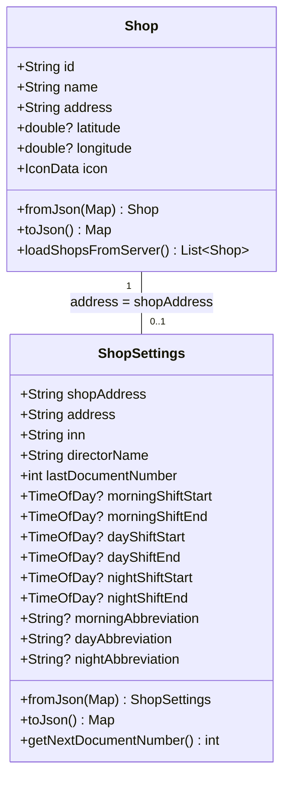
```mermaid
classDiagram
    class Shop {
        +String id
        +String name
        +String address
        +double? latitude
        +double? longitude
        +IconData icon
        +fromJson(Map) Shop
        +toJson() Map
        +loadShopsFromServer() List~Shop~
    }

    class ShopSettings {
        +String shopAddress
        +String address
        +String inn
        +String directorName
        +int lastDocumentNumber
        +TimeOfDay? morningShiftStart
        +TimeOfDay? morningShiftEnd
        +TimeOfDay? dayShiftStart
        +TimeOfDay? dayShiftEnd
        +TimeOfDay? nightShiftStart
        +TimeOfDay? nightShiftEnd
        +String? morningAbbreviation
        +String? dayAbbreviation
        +String? nightAbbreviation
        +fromJson(Map) ShopSettings
        +toJson() Map
        +getNextDocumentNumber() int
    }

    Shop "1" -- "0..1" ShopSettings : address = shopAddress
```

---

### 1.3 Связи с другими модулями

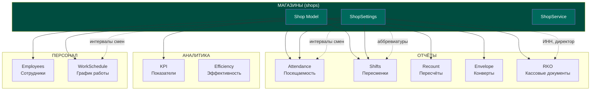
```mermaid
flowchart TB
    subgraph SHOPS["МАГАЗИНЫ (shops)"]
        SM[Shop Model]
        SS[ShopSettings]
        SVC[ShopService]
    end

    subgraph REPORTS["ОТЧЁТЫ"]
        ATT[Attendance<br/>Посещаемость]
        SH[Shifts<br/>Пересменки]
        RC[Recount<br/>Пересчёты]
        ENV[Envelope<br/>Конверты]
        RKO[RKO<br/>Кассовые документы]
    end

    subgraph ANALYTICS["АНАЛИТИКА"]
        KPI[KPI<br/>Показатели]
        EFF[Efficiency<br/>Эффективность]
    end

    subgraph STAFF["ПЕРСОНАЛ"]
        EMP[Employees<br/>Сотрудники]
        WS[WorkSchedule<br/>График работы]
    end

    SM --> ATT
    SM --> SH
    SM --> RC
    SM --> ENV
    SM --> KPI
    SM --> EMP

    SS --> ATT
    SS --> SH
    SS --> RKO
    SS --> WS

    SS -.->|ИНН, директор| RKO
    SS -.->|интервалы смен| ATT
    SS -.->|интервалы смен| WS
    SS -.->|аббревиатуры| SH

    style SHOPS fill:#004D40,color:#fff
    style SM fill:#00695C,color:#fff
    style SS fill:#00695C,color:#fff
    style SVC fill:#00695C,color:#fff
```

---

### 1.4 Детальные связи

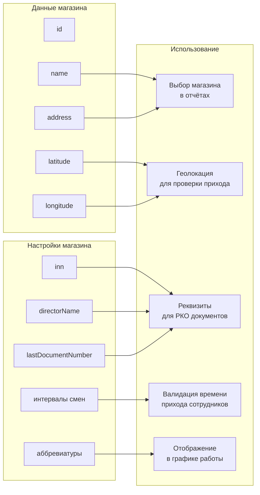
```mermaid
flowchart LR
    subgraph Shop_Data["Данные магазина"]
        ID[id]
        NAME[name]
        ADDR[address]
        LAT[latitude]
        LON[longitude]
    end

    subgraph Settings_Data["Настройки магазина"]
        INN[inn]
        DIR[directorName]
        DOC[lastDocumentNumber]
        SHIFTS[интервалы смен]
        ABBR[аббревиатуры]
    end

    subgraph Usage["Использование"]
        U1[Выбор магазина<br/>в отчётах]
        U2[Геолокация<br/>для проверки прихода]
        U3[Реквизиты<br/>для РКО документов]
        U4[Валидация времени<br/>прихода сотрудников]
        U5[Отображение<br/>в графике работы]
    end

    NAME --> U1
    ADDR --> U1
    LAT --> U2
    LON --> U2
    INN --> U3
    DIR --> U3
    DOC --> U3
    SHIFTS --> U4
    ABBR --> U5
```

---

### 1.5 API Endpoints

| Метод | Endpoint | Описание |
|-------|----------|----------|
| GET | `/api/shops` | Получить все магазины |
| GET | `/api/shops/:id` | Получить магазин по ID |
| POST | `/api/shops` | Создать магазин (name, address, latitude?, longitude?) |
| PUT | `/api/shops/:id` | Обновить магазин |
| DELETE | `/api/shops/:id` | Удалить магазин |
| GET | `/api/shop-settings/:shopAddress` | Получить настройки |
| POST | `/api/shop-settings` | Сохранить настройки |

---

### 1.6 Поток данных: Создание магазина

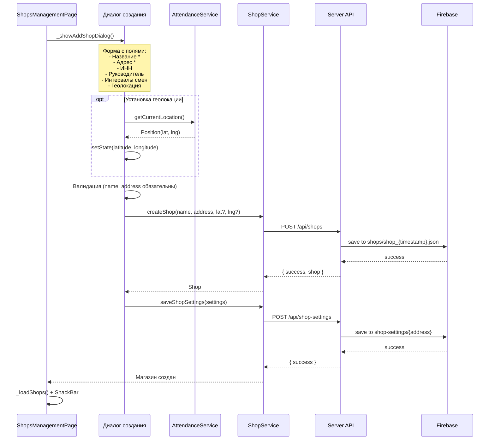
```mermaid
sequenceDiagram
    participant UI as ShopsManagementPage
    participant DLG as Диалог создания
    participant GPS as AttendanceService
    participant SVC as ShopService
    participant API as Server API
    participant DB as Firebase

    UI->>DLG: _showAddShopDialog()
    Note over DLG: Форма с полями:<br/>- Название *<br/>- Адрес *<br/>- ИНН<br/>- Руководитель<br/>- Интервалы смен<br/>- Геолокация

    opt Установка геолокации
        DLG->>GPS: getCurrentLocation()
        GPS-->>DLG: Position(lat, lng)
        DLG->>DLG: setState(latitude, longitude)
    end

    DLG->>DLG: Валидация (name, address обязательны)
    DLG->>SVC: createShop(name, address, lat?, lng?)
    SVC->>API: POST /api/shops
    API->>DB: save to shops/shop_{timestamp}.json
    DB-->>API: success
    API-->>SVC: { success, shop }
    SVC-->>DLG: Shop

    DLG->>SVC: saveShopSettings(settings)
    SVC->>API: POST /api/shop-settings
    API->>DB: save to shop-settings/{address}
    DB-->>API: success
    API-->>SVC: { success }

    SVC-->>UI: Магазин создан
    UI->>UI: _loadShops() + SnackBar
```

---

### 1.7 Поток данных: Загрузка магазинов

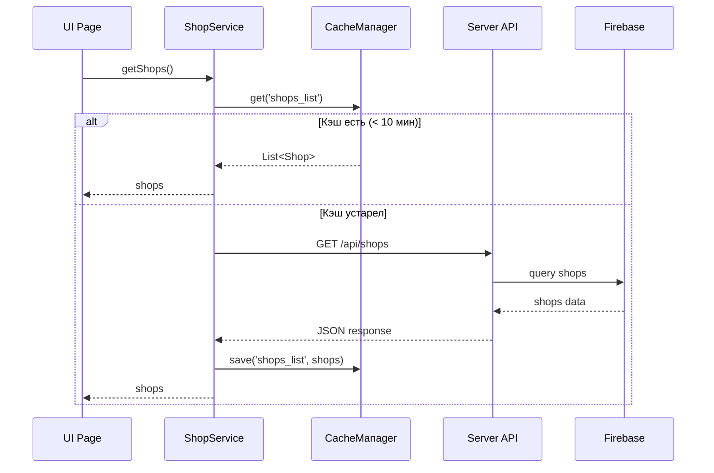
```mermaid
sequenceDiagram
    participant UI as UI Page
    participant SVC as ShopService
    participant CACHE as CacheManager
    participant API as Server API
    participant DB as Firebase

    UI->>SVC: getShops()
    SVC->>CACHE: get('shops_list')

    alt Кэш есть (< 10 мин)
        CACHE-->>SVC: List<Shop>
        SVC-->>UI: shops
    else Кэш устарел
        SVC->>API: GET /api/shops
        API->>DB: query shops
        DB-->>API: shops data
        API-->>SVC: JSON response
        SVC->>CACHE: save('shops_list', shops)
        SVC-->>UI: shops
    end
```

---

### 1.8 Поток данных: Сохранение настроек магазина

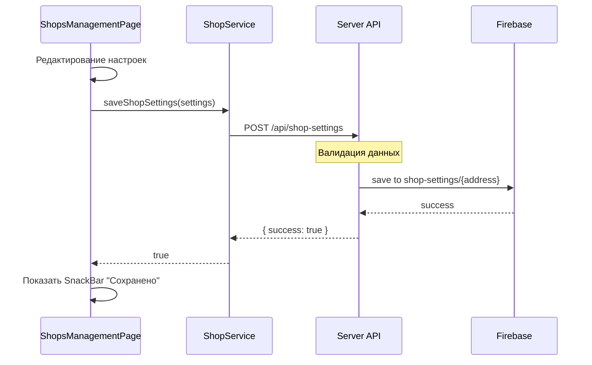
```mermaid
sequenceDiagram
    participant UI as ShopsManagementPage
    participant SVC as ShopService
    participant API as Server API
    participant DB as Firebase

    UI->>UI: Редактирование настроек
    UI->>SVC: saveShopSettings(settings)
    SVC->>API: POST /api/shop-settings

    Note over API: Валидация данных

    API->>DB: save to shop-settings/{address}
    DB-->>API: success
    API-->>SVC: { success: true }
    SVC-->>UI: true
    UI->>UI: Показать SnackBar "Сохранено"
```

---

### 1.9 Использование ShopSettings в Attendance

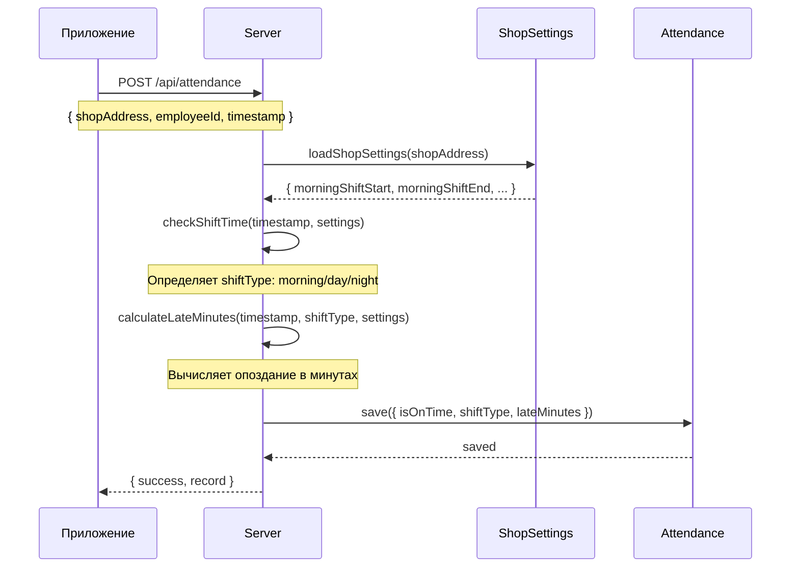
```mermaid
sequenceDiagram
    participant APP as Приложение
    participant API as Server
    participant SS as ShopSettings
    participant ATT as Attendance

    APP->>API: POST /api/attendance
    Note over APP,API: { shopAddress, employeeId, timestamp }

    API->>SS: loadShopSettings(shopAddress)
    SS-->>API: { morningShiftStart, morningShiftEnd, ... }

    API->>API: checkShiftTime(timestamp, settings)
    Note over API: Определяет shiftType: morning/day/night

    API->>API: calculateLateMinutes(timestamp, shiftType, settings)
    Note over API: Вычисляет опоздание в минутах

    API->>ATT: save({ isOnTime, shiftType, lateMinutes })
    ATT-->>API: saved
    API-->>APP: { success, record }
```

---

### 1.10 Таблица зависимостей

| Модуль | Использует Shop | Использует ShopSettings | Что берёт |
|--------|-----------------|------------------------|-----------|
| **Attendance** | ✅ | ✅ | address, интервалы смен |
| **Shifts** | ✅ | ✅ | address, аббревиатуры |
| **RKO** | ✅ | ✅ | address, ИНН, директор, номер документа |
| **KPI** | ✅ | ❌ | address для фильтрации |
| **WorkSchedule** | ✅ | ✅ | address, интервалы смен |
| **Recount** | ✅ | ❌ | address для выбора |
| **Envelope** | ✅ | ❌ | address для выбора |
| **Employees** | ✅ | ❌ | address для привязки |

---

### 1.11 Кэширование

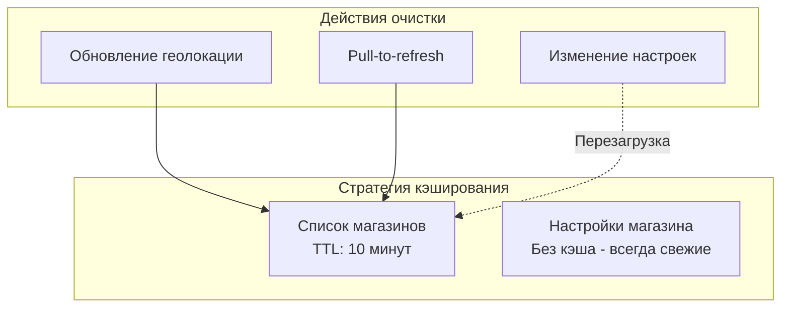
```mermaid
flowchart TB
    subgraph Cache["Стратегия кэширования"]
        C1[Список магазинов<br/>TTL: 10 минут]
        C2[Настройки магазина<br/>Без кэша - всегда свежие]
    end

    subgraph Actions["Действия очистки"]
        A1[Обновление геолокации]
        A2[Pull-to-refresh]
        A3[Изменение настроек]
    end

    A1 --> C1
    A2 --> C1
    A3 -.->|Перезагрузка| C1
```

---

## 2. Управление данными - СОТРУДНИКИ

### 2.1 Обзор модуля

**Назначение:** Центральный модуль для управления сотрудниками сети кофеен. Обеспечивает регистрацию, верификацию, определение ролей и настройку предпочтений сотрудников.

**Файлы модуля:**
```
lib/features/employees/
├── models/
│   ├── user_role_model.dart              # Модель роли пользователя
│   └── employee_registration_model.dart  # Модель регистрации (паспорт)
├── pages/
│   ├── employees_page.dart               # Главная страница + модель Employee
│   ├── employee_panel_page.dart          # Панель сотрудника
│   ├── employee_preferences_dialog.dart  # Диалог предпочтений
│   ├── employee_registration_page.dart   # Форма регистрации
│   ├── employee_registration_view_page.dart     # Просмотр регистрации
│   ├── employee_registration_select_employee_page.dart  # Выбор сотрудника
│   ├── employee_schedule_page.dart       # Расписание сотрудника
│   └── unverified_employees_page.dart    # Не верифицированные
└── services/
    ├── employee_service.dart             # CRUD операции
    ├── employee_registration_service.dart # Регистрация и верификация
    └── user_role_service.dart            # Определение ролей
```

---

### 2.2 Модели данных

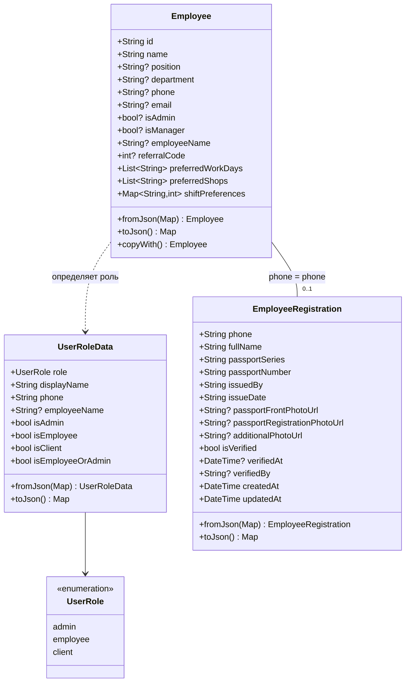
```mermaid
classDiagram
    class Employee {
        +String id
        +String name
        +String? position
        +String? department
        +String? phone
        +String? email
        +bool? isAdmin
        +bool? isManager
        +String? employeeName
        +int? referralCode
        +List~String~ preferredWorkDays
        +List~String~ preferredShops
        +Map~String,int~ shiftPreferences
        +fromJson(Map) Employee
        +toJson() Map
        +copyWith() Employee
    }

    class UserRoleData {
        +UserRole role
        +String displayName
        +String phone
        +String? employeeName
        +bool isAdmin
        +bool isEmployee
        +bool isClient
        +bool isEmployeeOrAdmin
        +fromJson(Map) UserRoleData
        +toJson() Map
    }

    class EmployeeRegistration {
        +String phone
        +String fullName
        +String passportSeries
        +String passportNumber
        +String issuedBy
        +String issueDate
        +String? passportFrontPhotoUrl
        +String? passportRegistrationPhotoUrl
        +String? additionalPhotoUrl
        +bool isVerified
        +DateTime? verifiedAt
        +String? verifiedBy
        +DateTime createdAt
        +DateTime updatedAt
        +fromJson(Map) EmployeeRegistration
        +toJson() Map
    }

    class UserRole {
        <<enumeration>>
        admin
        employee
        client
    }

    Employee "1" -- "0..1" EmployeeRegistration : phone = phone
    UserRoleData --> UserRole
    Employee ..> UserRoleData : определяет роль
```

---

### 2.3 Связи с другими модулями

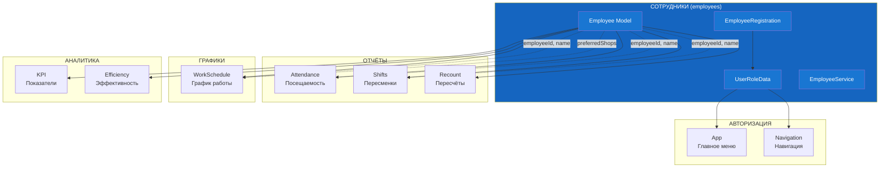
```mermaid
flowchart TB
    subgraph EMPLOYEES["СОТРУДНИКИ (employees)"]
        EMP[Employee Model]
        REG[EmployeeRegistration]
        ROLE[UserRoleData]
        SVC[EmployeeService]
    end

    subgraph REPORTS["ОТЧЁТЫ"]
        ATT[Attendance<br/>Посещаемость]
        SH[Shifts<br/>Пересменки]
        RC[Recount<br/>Пересчёты]
    end

    subgraph SCHEDULE["ГРАФИКИ"]
        WS[WorkSchedule<br/>График работы]
    end

    subgraph ANALYTICS["АНАЛИТИКА"]
        KPI[KPI<br/>Показатели]
        EFF[Efficiency<br/>Эффективность]
    end

    subgraph AUTH["АВТОРИЗАЦИЯ"]
        APP[App<br/>Главное меню]
        NAV[Navigation<br/>Навигация]
    end

    EMP --> ATT
    EMP --> SH
    EMP --> RC
    EMP --> WS
    EMP --> KPI
    EMP --> EFF

    ROLE --> APP
    ROLE --> NAV
    REG --> ROLE

    EMP -.->|employeeId, name| ATT
    EMP -.->|employeeId, name| SH
    EMP -.->|employeeId, name| WS
    EMP -.->|preferredShops| WS

    style EMPLOYEES fill:#1565C0,color:#fff
    style EMP fill:#1976D2,color:#fff
    style REG fill:#1976D2,color:#fff
    style ROLE fill:#1976D2,color:#fff
    style SVC fill:#1976D2,color:#fff
```

---

### 2.4 Детальные связи

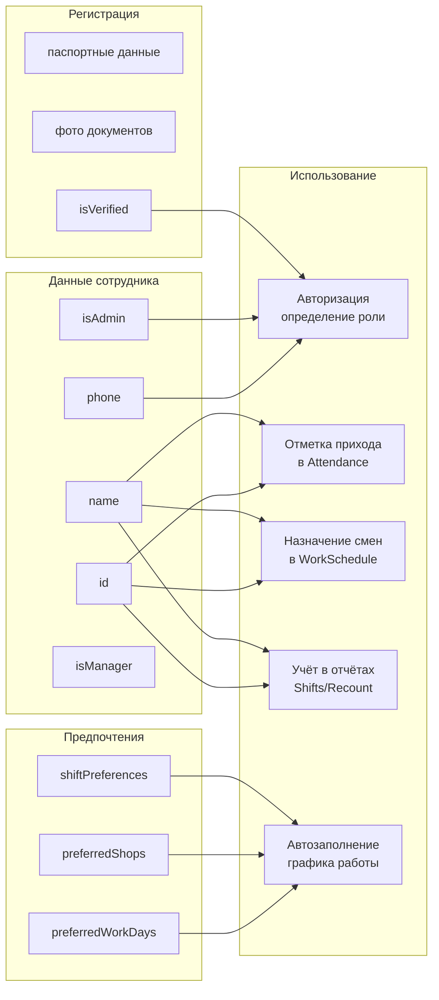
```mermaid
flowchart LR
    subgraph Employee_Data["Данные сотрудника"]
        ID[id]
        NAME[name]
        PHONE[phone]
        ADMIN[isAdmin]
        MANAGER[isManager]
    end

    subgraph Preferences["Предпочтения"]
        DAYS[preferredWorkDays]
        SHOPS[preferredShops]
        SHIFTS[shiftPreferences]
    end

    subgraph Registration["Регистрация"]
        PASSPORT[паспортные данные]
        PHOTOS[фото документов]
        VERIFIED[isVerified]
    end

    subgraph Usage["Использование"]
        U1[Авторизация<br/>определение роли]
        U2[Отметка прихода<br/>в Attendance]
        U3[Назначение смен<br/>в WorkSchedule]
        U4[Учёт в отчётах<br/>Shifts/Recount]
        U5[Автозаполнение<br/>графика работы]
    end

    PHONE --> U1
    ADMIN --> U1
    VERIFIED --> U1
    ID --> U2
    NAME --> U2
    ID --> U3
    NAME --> U3
    DAYS --> U5
    SHOPS --> U5
    SHIFTS --> U5
    ID --> U4
    NAME --> U4
```

---

### 2.5 API Endpoints

| Метод | Endpoint | Описание |
|-------|----------|----------|
| GET | `/api/employees` | Получить всех сотрудников |
| GET | `/api/employees/:id` | Получить сотрудника по ID |
| POST | `/api/employees` | Создать сотрудника |
| PUT | `/api/employees/:id` | Обновить сотрудника |
| DELETE | `/api/employees/:id` | Удалить сотрудника |
| GET | `/api/employee-registration/:phone` | Получить регистрацию по телефону |
| POST | `/api/employee-registration` | Сохранить регистрацию |
| POST | `/api/employee-registration/:phone/verify` | Верифицировать сотрудника |
| GET | `/api/employee-registrations` | Получить все регистрации (для админа) |
| POST | `/upload-employee-photo` | Загрузить фото документа |

---

### 2.6 Поток данных: Регистрация сотрудника

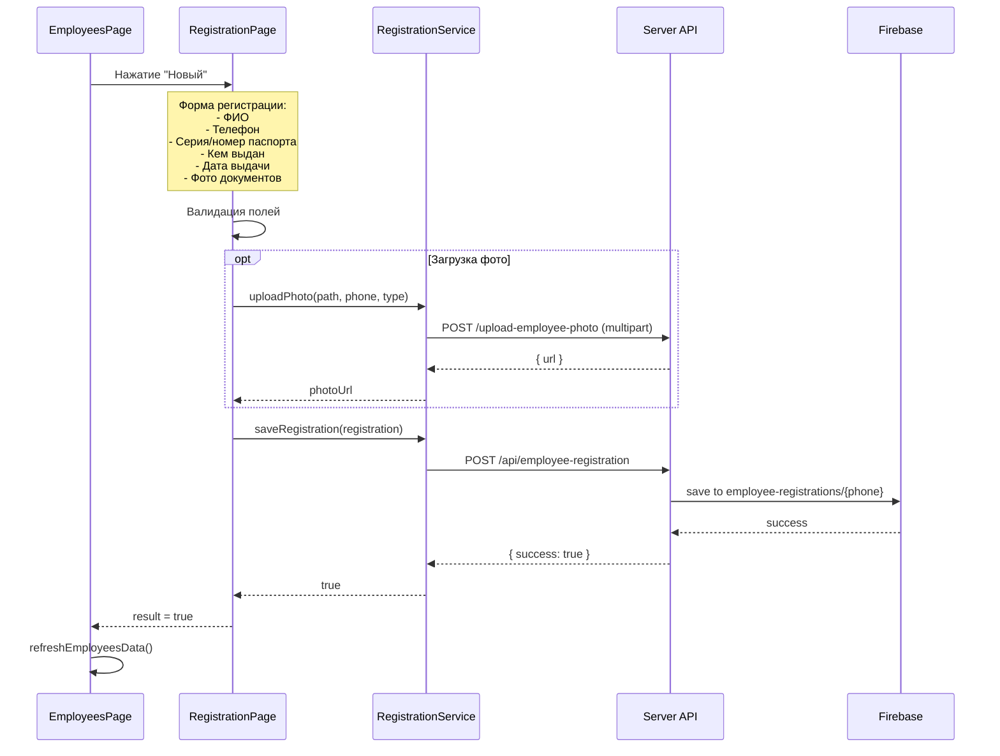
```mermaid
sequenceDiagram
    participant UI as EmployeesPage
    participant REG as RegistrationPage
    participant SVC as RegistrationService
    participant API as Server API
    participant DB as Firebase

    UI->>REG: Нажатие "Новый"
    Note over REG: Форма регистрации:<br/>- ФИО<br/>- Телефон<br/>- Серия/номер паспорта<br/>- Кем выдан<br/>- Дата выдачи<br/>- Фото документов

    REG->>REG: Валидация полей

    opt Загрузка фото
        REG->>SVC: uploadPhoto(path, phone, type)
        SVC->>API: POST /upload-employee-photo (multipart)
        API-->>SVC: { url }
        SVC-->>REG: photoUrl
    end

    REG->>SVC: saveRegistration(registration)
    SVC->>API: POST /api/employee-registration
    API->>DB: save to employee-registrations/{phone}
    DB-->>API: success
    API-->>SVC: { success: true }
    SVC-->>REG: true

    REG-->>UI: result = true
    UI->>UI: refreshEmployeesData()
```

---

### 2.7 Поток данных: Верификация сотрудника

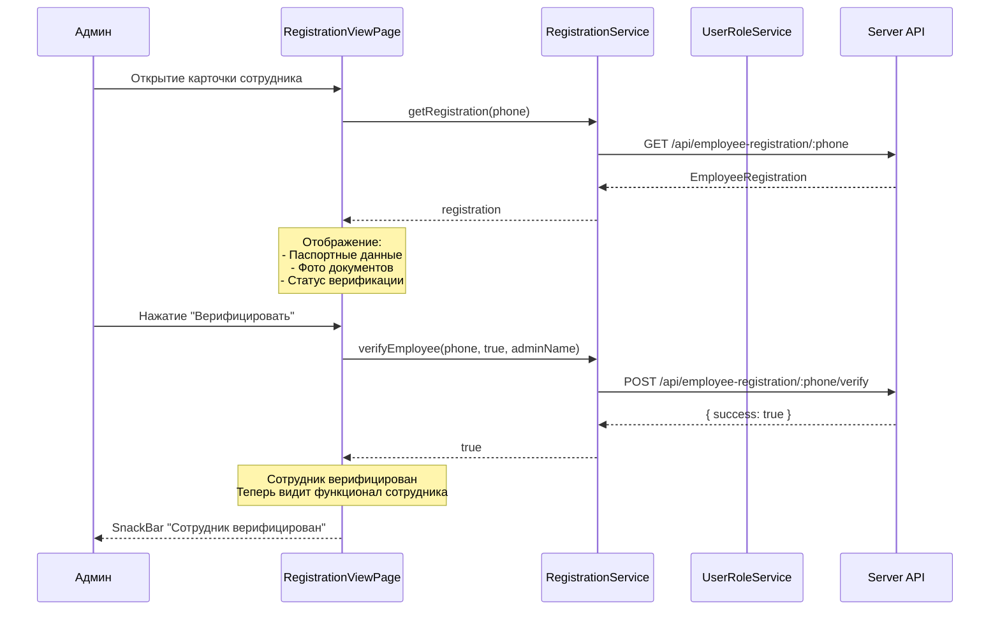
```mermaid
sequenceDiagram
    participant ADMIN as Админ
    participant UI as RegistrationViewPage
    participant SVC as RegistrationService
    participant ROLE as UserRoleService
    participant API as Server API

    ADMIN->>UI: Открытие карточки сотрудника
    UI->>SVC: getRegistration(phone)
    SVC->>API: GET /api/employee-registration/:phone
    API-->>SVC: EmployeeRegistration
    SVC-->>UI: registration

    Note over UI: Отображение:<br/>- Паспортные данные<br/>- Фото документов<br/>- Статус верификации

    ADMIN->>UI: Нажатие "Верифицировать"
    UI->>SVC: verifyEmployee(phone, true, adminName)
    SVC->>API: POST /api/employee-registration/:phone/verify
    API-->>SVC: { success: true }
    SVC-->>UI: true

    Note over UI: Сотрудник верифицирован<br/>Теперь видит функционал сотрудника

    UI-->>ADMIN: SnackBar "Сотрудник верифицирован"
```

---

### 2.8 Поток данных: Определение роли пользователя

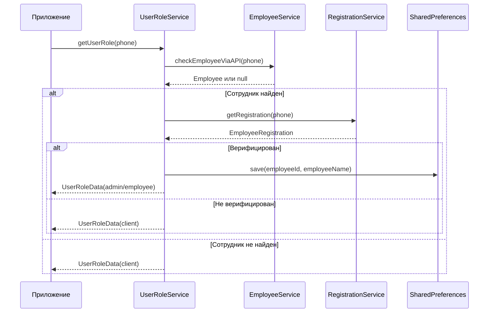
```mermaid
sequenceDiagram
    participant APP as Приложение
    participant ROLE as UserRoleService
    participant EMP as EmployeeService
    participant REG as RegistrationService
    participant CACHE as SharedPreferences

    APP->>ROLE: getUserRole(phone)

    ROLE->>EMP: checkEmployeeViaAPI(phone)
    EMP-->>ROLE: Employee или null

    alt Сотрудник найден
        ROLE->>REG: getRegistration(phone)
        REG-->>ROLE: EmployeeRegistration

        alt Верифицирован
            ROLE->>CACHE: save(employeeId, employeeName)
            ROLE-->>APP: UserRoleData(admin/employee)
        else Не верифицирован
            ROLE-->>APP: UserRoleData(client)
        end
    else Сотрудник не найден
        ROLE-->>APP: UserRoleData(client)
    end
```

---

### 2.9 Таблица зависимостей

| Модуль | Использует Employee | Использует Registration | Что берёт |
|--------|---------------------|------------------------|-----------|
| **Attendance** | ✅ | ❌ | employeeId, name для отметки |
| **Shifts** | ✅ | ❌ | employeeId, name для пересменок |
| **Recount** | ✅ | ❌ | employeeId, name для пересчётов |
| **WorkSchedule** | ✅ | ❌ | employeeId, name, preferences |
| **KPI** | ✅ | ❌ | employeeId для статистики |
| **Efficiency** | ✅ | ❌ | employeeId для баллов |
| **App/Navigation** | ❌ | ✅ | isVerified для определения роли |

---

### 2.10 Предпочтения сотрудника

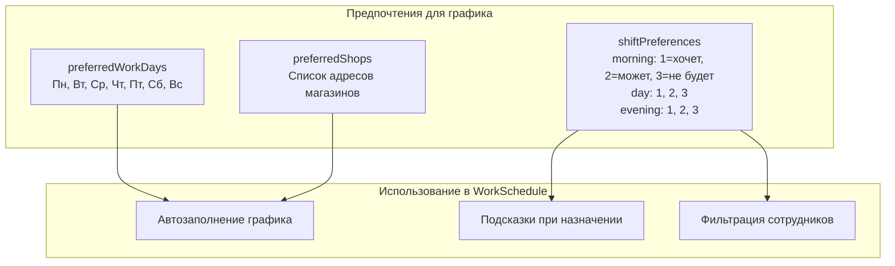
```mermaid
flowchart TB
    subgraph Preferences["Предпочтения для графика"]
        DAYS[preferredWorkDays<br/>Пн, Вт, Ср, Чт, Пт, Сб, Вс]
        SHOPS[preferredShops<br/>Список адресов магазинов]
        SHIFTS[shiftPreferences<br/>morning: 1=хочет, 2=может, 3=не будет<br/>day: 1, 2, 3<br/>evening: 1, 2, 3]
    end

    subgraph Usage["Использование в WorkSchedule"]
        AUTO[Автозаполнение графика]
        SUGGEST[Подсказки при назначении]
        FILTER[Фильтрация сотрудников]
    end

    DAYS --> AUTO
    SHOPS --> AUTO
    SHIFTS --> SUGGEST
    SHIFTS --> FILTER
```

---

### 2.11 Роли пользователей

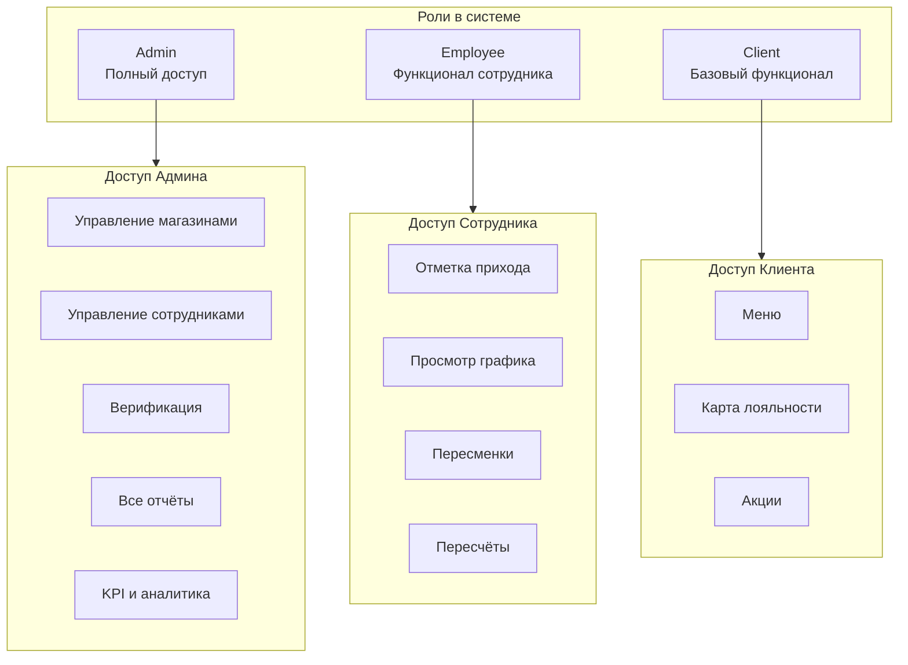
```mermaid
flowchart TB
    subgraph Roles["Роли в системе"]
        ADMIN[Admin<br/>Полный доступ]
        EMP[Employee<br/>Функционал сотрудника]
        CLIENT[Client<br/>Базовый функционал]
    end

    subgraph AdminAccess["Доступ Админа"]
        A1[Управление магазинами]
        A2[Управление сотрудниками]
        A3[Верификация]
        A4[Все отчёты]
        A5[KPI и аналитика]
    end

    subgraph EmployeeAccess["Доступ Сотрудника"]
        E1[Отметка прихода]
        E2[Просмотр графика]
        E3[Пересменки]
        E4[Пересчёты]
    end

    subgraph ClientAccess["Доступ Клиента"]
        C1[Меню]
        C2[Карта лояльности]
        C3[Акции]
    end

    ADMIN --> AdminAccess
    EMP --> EmployeeAccess
    CLIENT --> ClientAccess
```

---

### 2.12 Кэширование

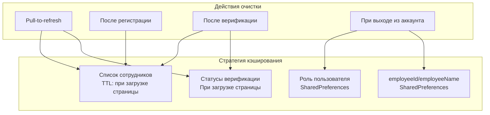
```mermaid
flowchart TB
    subgraph Cache["Стратегия кэширования"]
        C1[Список сотрудников<br/>TTL: при загрузке страницы]
        C2[Роль пользователя<br/>SharedPreferences]
        C3[employeeId/employeeName<br/>SharedPreferences]
        C4[Статусы верификации<br/>При загрузке страницы]
    end

    subgraph Actions["Действия очистки"]
        A1[Pull-to-refresh]
        A2[После регистрации]
        A3[После верификации]
        A4[При выходе из аккаунта]
    end

    A1 --> C1
    A1 --> C4
    A2 --> C1
    A3 --> C1
    A3 --> C4
    A4 --> C2
    A4 --> C3
```

---

## 3. Управление данными - ГРАФИК РАБОТЫ

### 3.1 Обзор модуля

**Назначение:** Модуль для составления и управления графиком работы сотрудников. Включает автозаполнение, валидацию конфликтов, передачу смен между сотрудниками и экспорт в PDF.

**Файлы модуля:**
```
lib/features/work_schedule/
├── models/
│   ├── work_schedule_model.dart       # Модели: WorkSchedule, WorkScheduleEntry, ShiftType, ScheduleTemplate
│   └── shift_transfer_model.dart      # Модель запроса на передачу смены
├── pages/
│   ├── work_schedule_page.dart        # Главная страница (3 вкладки)
│   ├── employee_bulk_schedule_dialog.dart  # Массовое редактирование
│   ├── my_schedule_page.dart          # "Мой график" для сотрудника
│   └── shift_transfer_requests_page.dart   # Запросы на передачу смен
├── services/
│   ├── work_schedule_service.dart     # CRUD операции с графиком
│   ├── auto_fill_schedule_service.dart # Алгоритм автозаполнения
│   ├── schedule_pdf_service.dart      # Генерация PDF
│   └── shift_transfer_service.dart    # Передача смен
└── work_schedule_validator.dart       # Валидация графика
```

---

### 3.2 Модели данных

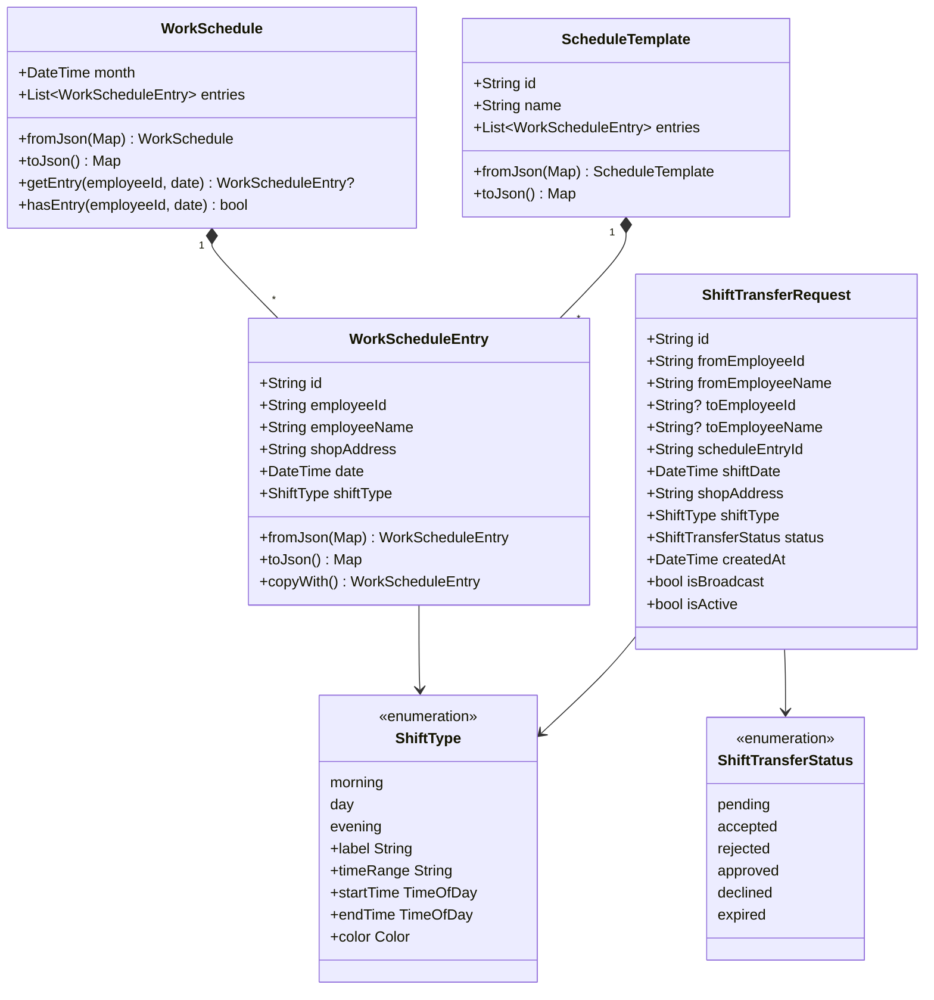
```mermaid
classDiagram
    class WorkSchedule {
        +DateTime month
        +List~WorkScheduleEntry~ entries
        +fromJson(Map) WorkSchedule
        +toJson() Map
        +getEntry(employeeId, date) WorkScheduleEntry?
        +hasEntry(employeeId, date) bool
    }

    class WorkScheduleEntry {
        +String id
        +String employeeId
        +String employeeName
        +String shopAddress
        +DateTime date
        +ShiftType shiftType
        +fromJson(Map) WorkScheduleEntry
        +toJson() Map
        +copyWith() WorkScheduleEntry
    }

    class ShiftType {
        <<enumeration>>
        morning
        day
        evening
        +label String
        +timeRange String
        +startTime TimeOfDay
        +endTime TimeOfDay
        +color Color
    }

    class ScheduleTemplate {
        +String id
        +String name
        +List~WorkScheduleEntry~ entries
        +fromJson(Map) ScheduleTemplate
        +toJson() Map
    }

    class ShiftTransferRequest {
        +String id
        +String fromEmployeeId
        +String fromEmployeeName
        +String? toEmployeeId
        +String? toEmployeeName
        +String scheduleEntryId
        +DateTime shiftDate
        +String shopAddress
        +ShiftType shiftType
        +ShiftTransferStatus status
        +DateTime createdAt
        +bool isBroadcast
        +bool isActive
    }

    class ShiftTransferStatus {
        <<enumeration>>
        pending
        accepted
        rejected
        approved
        declined
        expired
    }

    WorkSchedule "1" *-- "*" WorkScheduleEntry
    WorkScheduleEntry --> ShiftType
    ScheduleTemplate "1" *-- "*" WorkScheduleEntry
    ShiftTransferRequest --> ShiftType
    ShiftTransferRequest --> ShiftTransferStatus
```

---

### 3.3 Связи с другими модулями

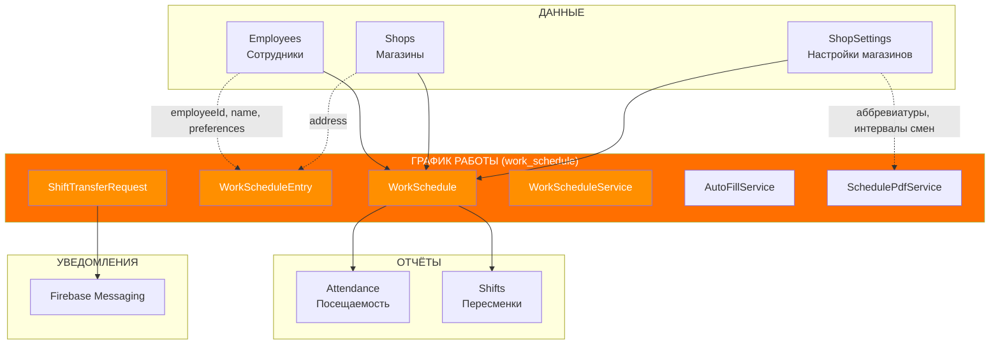
```mermaid
flowchart TB
    subgraph SCHEDULE["ГРАФИК РАБОТЫ (work_schedule)"]
        WS[WorkSchedule]
        WSE[WorkScheduleEntry]
        STR[ShiftTransferRequest]
        SVC[WorkScheduleService]
        AUTO[AutoFillService]
        PDF[SchedulePdfService]
    end

    subgraph DATA["ДАННЫЕ"]
        EMP[Employees<br/>Сотрудники]
        SHOP[Shops<br/>Магазины]
        SS[ShopSettings<br/>Настройки магазинов]
    end

    subgraph REPORTS["ОТЧЁТЫ"]
        ATT[Attendance<br/>Посещаемость]
        SH[Shifts<br/>Пересменки]
    end

    subgraph NOTIFICATIONS["УВЕДОМЛЕНИЯ"]
        FCM[Firebase Messaging]
    end

    EMP --> WS
    SHOP --> WS
    SS --> WS

    EMP -.->|employeeId, name, preferences| WSE
    SHOP -.->|address| WSE
    SS -.->|аббревиатуры, интервалы смен| PDF

    WS --> ATT
    WS --> SH

    STR --> FCM

    style SCHEDULE fill:#FF6F00,color:#fff
    style WS fill:#FF8F00,color:#fff
    style WSE fill:#FF8F00,color:#fff
    style STR fill:#FF8F00,color:#fff
    style SVC fill:#FF8F00,color:#fff
```

---

### 3.4 Типы смен (ShiftType)

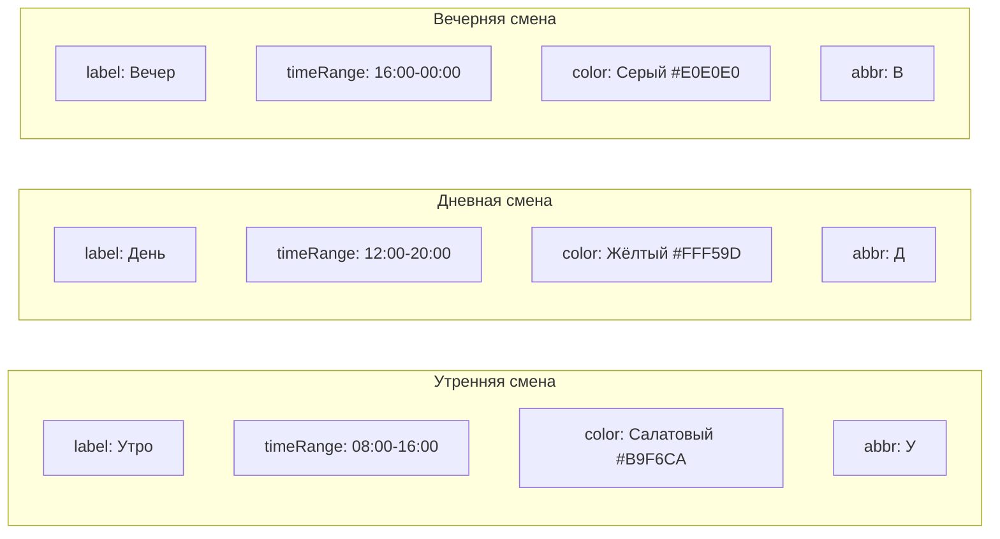
```mermaid
flowchart LR
    subgraph Morning["Утренняя смена"]
        M1[label: Утро]
        M2[timeRange: 08:00-16:00]
        M3[color: Салатовый #B9F6CA]
        M4[abbr: У]
    end

    subgraph Day["Дневная смена"]
        D1[label: День]
        D2[timeRange: 12:00-20:00]
        D3[color: Жёлтый #FFF59D]
        D4[abbr: Д]
    end

    subgraph Evening["Вечерняя смена"]
        E1[label: Вечер]
        E2[timeRange: 16:00-00:00]
        E3[color: Серый #E0E0E0]
        E4[abbr: В]
    end
```

---

### 3.5 API Endpoints

| Метод | Endpoint | Описание |
|-------|----------|----------|
| GET | `/api/work-schedule?month=YYYY-MM` | Получить график на месяц |
| GET | `/api/work-schedule/employee/:id?month=YYYY-MM` | График сотрудника |
| POST | `/api/work-schedule` | Создать/обновить смену |
| DELETE | `/api/work-schedule/:id?month=YYYY-MM` | Удалить смену |
| DELETE | `/api/work-schedule/clear?month=YYYY-MM` | Очистить месяц |
| POST | `/api/work-schedule/bulk` | Массовое создание смен |
| GET | `/api/work-schedule/template` | Получить шаблоны |
| POST | `/api/work-schedule/template` | Сохранить шаблон |
| POST | `/api/shift-transfers` | Создать запрос на передачу |
| GET | `/api/shift-transfers/employee/:id` | Запросы для сотрудника |
| GET | `/api/shift-transfers/admin` | Запросы для админа |
| PUT | `/api/shift-transfers/:id/accept` | Принять запрос |
| PUT | `/api/shift-transfers/:id/reject` | Отклонить запрос |
| PUT | `/api/shift-transfers/:id/approve` | Одобрить (админ) |
| PUT | `/api/shift-transfers/:id/decline` | Отказать (админ) |

---

### 3.6 Поток данных: Создание смены

```mermaid
sequenceDiagram
    participant UI as WorkSchedulePage
    participant DLG as Диалог редактирования
    participant SVC as WorkScheduleService
    participant API as Server API
    participant DB as Firebase

    UI->>DLG: Клик на ячейку (сотрудник × дата)
    Note over DLG: Выбор:<br/>- Магазин<br/>- Тип смены (У/Д/В)

    DLG->>SVC: saveShift(entry)
    SVC->>API: POST /api/work-schedule
    Note over API: { employeeId, employeeName,<br/>shopAddress, date, shiftType, month }

    API->>DB: save to work-schedule/{month}/{entryId}
    DB-->>API: success
    API-->>SVC: { success: true }
    SVC-->>DLG: true

    DLG-->>UI: Закрытие диалога
    UI->>UI: _loadSchedule() обновить
```

---

### 3.7 Поток данных: Автозаполнение

```mermaid
sequenceDiagram
    participant UI as WorkSchedulePage
    participant AUTO as AutoFillScheduleService
    participant SVC as WorkScheduleService
    participant VALID as Validator

    UI->>UI: Выбор периода (startDate, endDate)
    UI->>AUTO: autoFill(...)
    Note over AUTO: Параметры:<br/>- employees<br/>- shops<br/>- shopSettings<br/>- existingSchedule<br/>- replaceExisting

    loop Для каждого дня
        loop Для каждого магазина
            AUTO->>AUTO: Определить нужные смены (У, В)
            AUTO->>AUTO: _selectBestEmployee()
            Note over AUTO: Приоритеты:<br/>1. preferredShops<br/>2. preferredWorkDays<br/>3. shiftPreferences<br/>4. Балансировка нагрузки<br/>5. Отсутствие конфликтов
        end
    end

    AUTO->>VALID: _validateSchedule()
    VALID-->>AUTO: warnings[]

    AUTO-->>UI: newEntries[]

    UI->>SVC: bulkCreateShifts(entries)
    SVC-->>UI: success

    UI->>UI: Показать результат
```

---

### 3.8 Алгоритм автозаполнения

```mermaid
flowchart TB
    subgraph Selection["Выбор сотрудника (_selectBestEmployee)"]
        S1[Проверить preferredShops<br/>+10 баллов]
        S2[Проверить preferredWorkDays<br/>+5 баллов]
        S3[Проверить shiftPreferences<br/>1=хочет: +3<br/>2=может: +1<br/>3=не будет: -100]
        S4[Нет конфликтов 24ч<br/>+2 балла]
        S5[Балансировка нагрузки<br/>+100 если 0 смен<br/>+30-assigned иначе]
    end

    subgraph Priority["4 уровня приоритета"]
        P0[Level 0: все предпочтения]
        P1[Level 1: игнор дни]
        P2[Level 2: игнор дни + магазины]
        P3[Level 3: игнор всё]
    end

    subgraph Conflicts["Проверка конфликтов"]
        C1[Утро после вечера вчера ❌]
        C2[Вечер после утра сегодня ❌]
        C3[День после вечера вчера ❌]
        C4[Уже есть смена сегодня ❌]
    end

    S1 --> S2 --> S3 --> S4 --> S5
    P0 --> P1 --> P2 --> P3
    Selection --> Conflicts
```

---

### 3.9 Поток данных: Передача смены

```mermaid
sequenceDiagram
    participant EMP1 as Сотрудник 1
    participant UI as MySchedulePage
    participant SVC as ShiftTransferService
    participant FCM as Уведомления
    participant EMP2 as Сотрудник 2
    participant ADMIN as Админ

    EMP1->>UI: "Передать смену"
    UI->>SVC: createRequest(request)
    Note over SVC: toEmployeeId=null<br/>(broadcast всем)

    SVC->>FCM: Отправить уведомление
    FCM-->>EMP2: "Запрос на смену"

    EMP2->>SVC: acceptRequest(requestId)
    Note over SVC: status: accepted<br/>acceptedByEmployeeId

    SVC->>FCM: Уведомить админа
    FCM-->>ADMIN: "Ожидает одобрения"

    ADMIN->>SVC: approveRequest(requestId)
    Note over SVC: status: approved<br/>График обновлён

    SVC->>FCM: Уведомить всех
    FCM-->>EMP1: "Смена передана"
    FCM-->>EMP2: "Смена принята"
```

---

### 3.10 Статусы передачи смены

```mermaid
stateDiagram-v2
    [*] --> pending: createRequest()

    pending --> accepted: Сотрудник принял
    pending --> rejected: Сотрудник отклонил
    pending --> expired: 30 дней

    accepted --> approved: Админ одобрил
    accepted --> declined: Админ отклонил

    rejected --> [*]
    expired --> [*]
    approved --> [*]
    declined --> [*]
```

---

### 3.11 Валидация графика

```mermaid
flowchart TB
    subgraph Critical["Критичные ошибки"]
        E1[missingMorning<br/>Нет утренней смены]
        E2[missingEvening<br/>Нет вечерней смены]
        E3[duplicateMorning<br/>Дубликат утра]
        E4[duplicateEvening<br/>Дубликат вечера]
    end

    subgraph Warnings["Предупреждения"]
        W1[morningAfterEvening<br/>Утро после вечера]
        W2[eveningAfterMorning<br/>Вечер после утра]
        W3[dayAfterEvening<br/>День после вечера]
    end

    subgraph Result["ScheduleValidationResult"]
        R1[criticalErrors: List]
        R2[warnings: List]
        R3[hasCritical: bool]
        R4[totalCount: int]
    end

    Critical --> Result
    Warnings --> Result
```

---

### 3.12 Таблица зависимостей

| Модуль | Использует | Что берёт |
|--------|-----------|-----------|
| **Employee** | ✅ | id, name, preferences для автозаполнения |
| **Shop** | ✅ | address для привязки смен |
| **ShopSettings** | ✅ | аббревиатуры (У/Д/В), интервалы смен |
| **Attendance** | ← | График для сверки прихода |
| **Shifts** | ← | График для пересменок |
| **Firebase** | ✅ | Уведомления о передаче смен |

---

### 3.13 Генерация PDF

```mermaid
flowchart TB
    subgraph Input["Входные данные"]
        I1[WorkSchedule schedule]
        I2[List employeeNames]
        I3[DateTime month]
        I4[int startDay, endDay]
        I5[Map abbreviations]
    end

    subgraph Process["SchedulePdfService"]
        P1[Загрузка шрифтов NotoSans]
        P2[Создание горизонтального A4]
        P3[Заголовок с периодом]
        P4[Таблица: сотрудники × дни]
        P5[Цветные ячейки смен]
        P6[Легенда: У Д В]
    end

    subgraph Output["PDF файл"]
        O1[app-debug.pdf]
    end

    Input --> Process --> Output
```

---

### 3.14 Структура страницы (3 вкладки)

```mermaid
flowchart TB
    subgraph Tabs["WorkSchedulePage"]
        T1[Вкладка 1: График<br/>Основная таблица]
        T2[Вкладка 2: Сотрудники<br/>Список для назначения]
        T3[Вкладка 3: Магазины<br/>Фильтрация по магазинам]
    end

    subgraph Features["Функционал"]
        F1[Выбор периода startDay-endDay]
        F2[Переключение месяцев]
        F3[Автозаполнение]
        F4[Очистка месяца]
        F5[Экспорт в PDF]
        F6[Массовое редактирование]
    end

    Tabs --> Features
```

---

### 3.15 Кэширование

```mermaid
flowchart TB
    subgraph Cache["Стратегия кэширования"]
        C1[График на месяц<br/>Загружается при открытии]
        C2[Список сотрудников<br/>Загружается при открытии]
        C3[Настройки магазинов<br/>Кэш в shopSettingsCache]
        C4[Шаблоны<br/>Загружаются при необходимости]
    end

    subgraph Actions["Действия обновления"]
        A1[Изменение смены]
        A2[Автозаполнение]
        A3[Очистка месяца]
        A4[Смена месяца]
    end

    A1 --> C1
    A2 --> C1
    A3 --> C1
    A4 --> C1
```

---

## 4. Система отчётности - ПЕРЕСМЕНКИ

### 4.1 Обзор модуля

**Назначение:** Модуль для управления пересменками — процессом передачи смены между сотрудниками с заполнением отчёта по вопросам и фотофиксацией состояния магазина.

**Основные компоненты:**
1. **Вопросы пересменки** — управление списком вопросов для заполнения
2. **Отчёты пересменки** — отчёты сотрудников с ответами и фото
3. **Настройки баллов** — система начисления/штрафов за пересменки
4. **Панель работника** — интерфейс для прохождения пересменки

**Файлы модуля:**
```
lib/features/shifts/
├── models/
│   ├── shift_report_model.dart           # Модель отчёта + ShiftAnswer
│   ├── shift_question_model.dart         # Модель вопроса
│   └── pending_shift_report_model.dart   # Модель ожидающей пересменки
├── pages/
│   ├── shift_reports_list_page.dart      # Список отчётов (6 вкладок)
│   ├── shift_report_view_page.dart       # Просмотр отчёта
│   ├── shift_questions_page.dart         # Прохождение пересменки (сотрудник)
│   ├── shift_questions_management_page.dart  # Управление вопросами (админ)
│   ├── shift_shop_selection_page.dart    # Выбор магазина
│   ├── shift_summary_report_page.dart    # Сводный отчёт
│   ├── shift_photo_gallery_page.dart     # Галерея фото
│   └── shift_edit_dialog.dart            # Редактирование отчёта
└── services/
    ├── shift_report_service.dart         # CRUD отчётов
    ├── shift_question_service.dart       # CRUD вопросов
    ├── pending_shift_service.dart        # Ожидающие пересменки
    └── shift_sync_service.dart           # Синхронизация
```

**Связанные модули (efficiency):**
```
lib/features/efficiency/
├── models/
│   ├── points_settings_model.dart              # Re-export (обратная совместимость)
│   └── settings/
│       ├── points_settings_base.dart           # Базовый класс + миксины
│       └── shift_points_settings.dart          # ShiftPointsSettings
├── pages/settings_tabs/
│   ├── shift_points_settings_page.dart         # Настройки баллов пересменки
│   └── shift_points_settings_page_v2.dart
└── services/
    └── points_settings_service.dart            # API настроек баллов
```

---

### 4.2 Модели данных

```mermaid
classDiagram
    class ShiftReport {
        +String id
        +String employeeName
        +String? employeeId
        +String shopAddress
        +String? shopName
        +DateTime createdAt
        +List~ShiftAnswer~ answers
        +bool isSynced
        +DateTime? confirmedAt
        +int? rating
        +String? confirmedByAdmin
        +String? status
        +String? shiftType
        +DateTime? submittedAt
        +DateTime? reviewDeadline
        +DateTime? failedAt
        +DateTime? rejectedAt
        +fromJson(Map) ShiftReport
        +toJson() Map
        +statusEnum ShiftReportStatus
    }

    class ShiftAnswer {
        +String question
        +String? textAnswer
        +double? numberAnswer
        +String? photoPath
        +String? photoDriveId
        +String? referencePhotoUrl
        +fromJson(Map) ShiftAnswer
        +toJson() Map
    }

    class ShiftQuestion {
        +String id
        +String question
        +String? answerFormatB
        +String? answerFormatC
        +List~String~? shops
        +Map~String,String~? referencePhotos
        +isNumberOnly bool
        +isPhotoOnly bool
        +isYesNo bool
        +isTextOnly bool
        +fromJson(Map) ShiftQuestion
        +toJson() Map
    }

    class PendingShiftReport {
        +String id
        +String shopAddress
        +String shiftType
        +String shiftLabel
        +String date
        +String deadline
        +String status
        +String? completedBy
        +DateTime createdAt
        +DateTime? completedAt
        +isOverdue bool
        +fromJson(Map) PendingShiftReport
        +toJson() Map
    }

    class ShiftReportStatus {
        <<enumeration>>
        pending
        review
        confirmed
        failed
        rejected
        expired
    }

    class ShiftPointsSettings {
        +String id
        +String category
        +double minPoints
        +int zeroThreshold
        +double maxPoints
        +String morningStartTime
        +String morningEndTime
        +String eveningStartTime
        +String eveningEndTime
        +double missedPenalty
        +int adminReviewTimeout
        +calculatePoints(rating) double
    }

    ShiftReport "1" *-- "*" ShiftAnswer
    ShiftReport --> ShiftReportStatus
    ShiftReport ..> ShiftPointsSettings : uses for scoring
    ShiftQuestion --> ShiftReport : questions for
    PendingShiftReport --> ShiftReport : becomes
```

---

### 4.3 Статусы отчёта пересменки

```mermaid
stateDiagram-v2
    [*] --> pending: Scheduler создаёт

    pending --> review: Сотрудник отправил
    pending --> failed: Дедлайн истёк

    review --> confirmed: Админ оценил
    review --> rejected: Админ не успел (таймаут)

    failed --> [*]: Штраф начислен
    rejected --> [*]: Штраф начислен
    confirmed --> [*]: Баллы начислены

    note right of pending: Ожидает прохождения
    note right of review: На проверке у админа
    note right of confirmed: Оценка 1-10 выставлена
    note right of failed: Сотрудник не успел
    note right of rejected: Админ не проверил вовремя
```

---

### 4.4 Связи с другими модулями

```mermaid
flowchart TB
    subgraph SHIFTS["ПЕРЕСМЕНКИ (shifts)"]
        SR[ShiftReport]
        SQ[ShiftQuestion]
        PSR[PendingShiftReport]
        SRS[ShiftReportService]
        SQS[ShiftQuestionService]
    end

    subgraph DATA["ДАННЫЕ"]
        SHOP[Shops<br/>Магазины]
        EMP[Employees<br/>Сотрудники]
    end

    subgraph POINTS["БАЛЛЫ (efficiency)"]
        SPS[ShiftPointsSettings]
        PSS[PointsSettingsService]
        ECS[EfficiencyCalculationService]
    end

    subgraph SCHEDULE["ГРАФИК"]
        WS[WorkSchedule<br/>График работы]
    end

    subgraph SERVER["СЕРВЕР"]
        SCHED[Scheduler<br/>shift_automation_scheduler.js]
        FCM[Firebase Messaging]
    end

    SHOP --> SR
    EMP --> SR
    SPS --> SR
    WS --> PSR

    SR --> ECS
    SPS --> ECS

    SCHED --> PSR
    SCHED --> FCM
    SR --> FCM

    EMP -.->|employeeName, employeeId| SR
    SHOP -.->|shopAddress, shopName| SR
    SPS -.->|timeWindows, rating calculation| SR
    WS -.->|кто работает сегодня| SCHED

    style SHIFTS fill:#E65100,color:#fff
    style SR fill:#F57C00,color:#fff
    style SQ fill:#F57C00,color:#fff
    style PSR fill:#F57C00,color:#fff
```

---

### 4.5 Типы ответов на вопросы

```mermaid
flowchart LR
    subgraph Question["ShiftQuestion"]
        Q[question]
        B[answerFormatB]
        C[answerFormatC]
    end

    subgraph Types["Типы ответов"]
        T1[Да/Нет<br/>B=null, C=null]
        T2[Число<br/>C='число']
        T3[Фото<br/>B='free' или 'photo']
        T4[Текст<br/>остальные случаи]
    end

    subgraph Answer["ShiftAnswer"]
        A1[textAnswer: 'Да'/'Нет']
        A2[numberAnswer: double]
        A3[photoPath + photoDriveId]
        A4[textAnswer: String]
    end

    Q --> T1 --> A1
    B --> T3 --> A3
    C --> T2 --> A2
    Question --> T4 --> A4
```

---

### 4.6 API Endpoints

#### Отчёты пересменки

| Метод | Endpoint | Описание |
|-------|----------|----------|
| GET | `/api/shift-reports` | Получить отчёты (фильтры: employeeName, shopAddress, date, status) |
| GET | `/api/shift-reports/expired` | Получить просроченные отчёты |
| POST | `/api/shift-reports` | Создать/отправить отчёт |
| PUT | `/api/shift-reports/:id` | Обновить отчёт (оценка админом) |

#### Вопросы пересменки

| Метод | Endpoint | Описание |
|-------|----------|----------|
| GET | `/api/shift-questions` | Получить вопросы (фильтр: shopAddress) |
| GET | `/api/shift-questions/:id` | Получить вопрос по ID |
| POST | `/api/shift-questions` | Создать вопрос |
| PUT | `/api/shift-questions/:id` | Обновить вопрос |
| DELETE | `/api/shift-questions/:id` | Удалить вопрос |
| POST | `/api/shift-questions/:id/reference-photo` | Загрузить эталонное фото |

#### Ожидающие пересменки

| Метод | Endpoint | Описание |
|-------|----------|----------|
| GET | `/api/pending-shift-reports` | Получить ожидающие пересменки за сегодня |
| POST | `/api/pending-shift-reports/generate` | Сгенерировать пересменки (ручной вызов) |

#### Настройки баллов

| Метод | Endpoint | Описание |
|-------|----------|----------|
| GET | `/api/points-settings/shift` | Получить настройки баллов пересменки |
| POST | `/api/points-settings/shift` | Сохранить настройки баллов |

---

### 4.7 Поток данных: Автоматическое создание пересменок

```mermaid
sequenceDiagram
    participant SCHED as Scheduler
    participant WS as WorkSchedule
    participant SHOP as Shops
    participant DB as Firebase
    participant FCM as Push

    Note over SCHED: morningStartTime (07:00)

    SCHED->>WS: Получить график на сегодня
    WS-->>SCHED: Список сотрудников по магазинам

    SCHED->>SHOP: Получить все магазины
    SHOP-->>SCHED: List<Shop>

    loop Для каждого магазина
        SCHED->>DB: Создать PendingShiftReport
        Note over DB: status: 'pending'<br/>shiftType: 'morning'<br/>deadline: morningEndTime
    end

    Note over SCHED: eveningStartTime (14:00)

    loop Для каждого магазина
        SCHED->>DB: Создать PendingShiftReport
        Note over DB: status: 'pending'<br/>shiftType: 'evening'<br/>deadline: eveningEndTime
    end
```

---

### 4.8 Поток данных: Прохождение пересменки (сотрудник)

```mermaid
sequenceDiagram
    participant EMP as Сотрудник
    participant APP as Flutter App
    participant SQS as ShiftQuestionService
    participant SRS as ShiftReportService
    participant UPLOAD as PhotoUploadService
    participant API as Server

    EMP->>APP: Открыть "Пересменка"
    APP->>APP: ShiftShopSelectionPage
    EMP->>APP: Выбрать магазин

    APP->>SQS: getQuestions(shopAddress)
    SQS->>API: GET /api/shift-questions?shopAddress=...
    API-->>SQS: List<ShiftQuestion>
    SQS-->>APP: questions

    APP->>APP: ShiftQuestionsPage

    loop Для каждого вопроса
        Note over APP: Показать вопрос<br/>+ эталонное фото (если есть)

        alt Тип: Да/Нет
            EMP->>APP: Выбор "Да" или "Нет"
        else Тип: Число
            EMP->>APP: Ввод числа
        else Тип: Фото
            EMP->>APP: Сделать фото
            APP->>UPLOAD: uploadPhoto(file)
            UPLOAD-->>APP: photoUrl
        else Тип: Текст
            EMP->>APP: Ввод текста
        end

        APP->>APP: Сохранить ShiftAnswer
        EMP->>APP: "Далее"
    end

    EMP->>APP: "Отправить"
    APP->>SRS: submitReport(report)
    SRS->>API: POST /api/shift-reports

    alt Время в пределах интервала
        API-->>SRS: { success: true, report }
        SRS-->>APP: ShiftSubmitResult(success)
        APP->>APP: Показать "Отправлено"
    else Время истекло
        API-->>SRS: { success: false, error: 'TIME_EXPIRED' }
        SRS-->>APP: ShiftSubmitResult(isTimeExpired)
        APP->>APP: Показать "Вы не успели"
    end
```

---

### 4.9 Поток данных: Оценка отчёта (админ)

```mermaid
sequenceDiagram
    participant ADMIN as Админ
    participant UI as ShiftReportsListPage
    participant VIEW as ShiftReportViewPage
    participant SRS as ShiftReportService
    participant API as Server
    participant ECS as EfficiencyService
    participant DB as efficiency-penalties
    participant FCM as Push
    participant EMP as Сотрудник

    ADMIN->>UI: Открыть "Отчёты пересменок"
    UI->>SRS: getReports(status: 'review')
    SRS->>API: GET /api/shift-reports?status=review
    API-->>SRS: List<ShiftReport>
    SRS-->>UI: reports

    ADMIN->>UI: Выбрать отчёт
    UI->>VIEW: Открыть ShiftReportViewPage

    Note over VIEW: Показать:<br/>- Ответы на вопросы<br/>- Фото сотрудника<br/>- Эталонные фото

    ADMIN->>VIEW: Выставить оценку (1-10)
    ADMIN->>VIEW: "Подтвердить"

    VIEW->>SRS: updateReport(report.copyWith(rating, confirmedByAdmin))
    SRS->>API: PUT /api/shift-reports/:id
    Note over API: status: 'confirmed'<br/>confirmedAt: now<br/>rating: 1-10

    API->>ECS: calculateShiftPoints(rating)
    Note over ECS: Линейная интерполяция<br/>minPoints → 0 → maxPoints

    API->>DB: Сохранить баллы в efficiency-penalties/{YYYY-MM}.json
    Note over DB: { phone, date, points,<br/>reason: 'Пересменка: оценка X' }

    API->>FCM: sendPushToPhone(employeePhone)
    FCM-->>EMP: "Пересменка - Ваша Оценка: X"

    API-->>SRS: { success: true }
    SRS-->>VIEW: true

    VIEW-->>ADMIN: SnackBar "Оценка сохранена"
```

**Важно:** При оценке отчёта пересменки происходит:
1. Обновление статуса отчёта на `confirmed`
2. Расчёт баллов эффективности через `calculateShiftPoints(rating)`
3. Сохранение баллов в файл `/var/www/efficiency-penalties/{YYYY-MM}.json`
4. Отправка push-уведомления сотруднику с информацией об оценке

---

### 4.10 Расчёт баллов за пересменку

```mermaid
flowchart TB
    subgraph Settings["ShiftPointsSettings"]
        MIN[minPoints: -3<br/>оценка 1]
        ZERO[zeroThreshold: 7<br/>оценка = 0 баллов]
        MAX[maxPoints: +2<br/>оценка 10]
        PENALTY[missedPenalty: -3<br/>не прошёл]
    end

    subgraph Calculation["calculatePoints(rating)"]
        R1[rating ≤ 1] --> P1[minPoints]
        R2[1 < rating ≤ zeroThreshold] --> P2[Интерполяция<br/>minPoints → 0]
        R3[zeroThreshold < rating < 10] --> P3[Интерполяция<br/>0 → maxPoints]
        R4[rating ≥ 10] --> P4[maxPoints]
    end

    subgraph Examples["Примеры"]
        E1[Оценка 1 → -3 балла]
        E2[Оценка 4 → -1.5 балла]
        E3[Оценка 7 → 0 баллов]
        E4[Оценка 8.5 → +1 балл]
        E5[Оценка 10 → +2 балла]
        E6[Не прошёл → -3 балла]
    end

    Settings --> Calculation --> Examples
```

**Хранение баллов:**

Баллы эффективности сохраняются в файл `/var/www/efficiency-penalties/{YYYY-MM}.json` с форматом:
```json
{
  "penalties": [
    {
      "date": "2025-01-24",
      "phone": "79001234567",
      "reason": "Пересменка: оценка 8",
      "points": 0.67,
      "category": "shift"
    }
  ]
}
```

**Функция расчёта:** `calculateShiftPoints(rating)` в `loyalty-proxy/api/points_settings_api.js`

---

### 4.11 Временные окна пересменок

```mermaid
timeline
    title Временные интервалы пересменок

    section Утро
        07:00 : morningStartTime
              : Создаются pending для всех магазинов
        07:00-13:00 : Сотрудники проходят пересменку
        13:00 : morningEndTime
              : pending → failed (штраф)
              : review → rejected (если не проверен)

    section Вечер
        14:00 : eveningStartTime
              : Создаются pending для всех магазинов
        14:00-23:00 : Сотрудники проходят пересменку
        23:00 : eveningEndTime
              : pending → failed (штраф)
              : review → rejected (если не проверен)
```

---

### 4.12 Структура страницы (6 вкладок)

```mermaid
flowchart TB
    subgraph Tabs["ShiftReportsListPage - 6 вкладок"]
        T1[1. Ожидают<br/>pending]
        T2[2. Не прошли<br/>failed + badge]
        T3[3. На проверке<br/>review]
        T4[4. Проверено<br/>confirmed]
        T5[5. Сводка<br/>30 дней]
        T6[6. Просроченные<br/>expired]
    end

    subgraph Features["Функционал"]
        F1[Фильтры: магазин, сотрудник, дата]
        F2[Pull-to-refresh]
        F3[Иерархическая группировка по датам]
        F4[Badges для новых отчётов]
        F5[Сводный отчёт по сменам]
    end

    Tabs --> Features
```

---

### 4.13 Управление вопросами (админ)

```mermaid
flowchart TB
    subgraph Page["ShiftQuestionsManagementPage"]
        LIST[Список вопросов]
        ADD[+ Добавить вопрос]
        EDIT[Редактировать]
        DEL[Удалить]
    end

    subgraph Question["Форма вопроса"]
        Q1[Текст вопроса *]
        Q2[Формат B: free/photo/...]
        Q3[Формат C: число/...]
        Q4[Магазины: выбор или все]
        Q5[Эталонные фото по магазинам]
    end

    subgraph RefPhoto["Эталонное фото"]
        RP1[Выбрать магазин]
        RP2[Загрузить фото]
        RP3[URL сохраняется в referencePhotos]
    end

    ADD --> Question
    EDIT --> Question
    Question --> RefPhoto
```

---

### 4.14 Эталонные фото

```mermaid
flowchart LR
    subgraph Storage["Хранение"]
        S1["/var/www/shift-reference-photos/"]
        S2["filename: shift_ref_{questionId}_{timestamp}.jpg"]
    end

    subgraph Question["ShiftQuestion.referencePhotos"]
        Q1["{ 'ТЦ Весна': 'https://...', 'ТЦ Аура': 'https://...' }"]
    end

    subgraph Display["Отображение"]
        D1[При прохождении пересменки<br/>показывается эталонное фото<br/>для текущего магазина]
        D2[При оценке админом<br/>сравнение с фото сотрудника]
    end

    Storage --> Question --> Display
```

---

### 4.15 Таблица зависимостей

| Модуль | Использует | Что берёт |
|--------|-----------|-----------|
| **Shops** | ✅ | shopAddress для привязки отчёта |
| **Employees** | ✅ | employeeName, employeeId |
| **WorkSchedule** | ✅ | Кто работает в эту смену (для Scheduler) |
| **Efficiency** | ← | Баллы за пересменку идут в рейтинг |
| **ShiftPointsSettings** | ✅ | Временные окна, коэффициенты баллов |
| **Firebase (FCM)** | ✅ | Push-уведомления о статусах |

---

### 4.16 Кэширование

```mermaid
flowchart TB
    subgraph Cache["Стратегия кэширования"]
        C1[Вопросы пересменки<br/>При открытии страницы]
        C2[Отчёты<br/>При открытии + Pull-to-refresh]
        C3[Настройки баллов<br/>При загрузке страницы]
        C4[Локальные черновики<br/>SharedPreferences]
    end

    subgraph Actions["Действия обновления"]
        A1[Pull-to-refresh]
        A2[После отправки отчёта]
        A3[После оценки админом]
        A4[Смена вкладки]
    end

    A1 --> C1
    A1 --> C2
    A2 --> C2
    A3 --> C2
    A4 --> C2
```

---

### 4.17 Серверная автоматизация

**Файл:** `loyalty-proxy/api/shift_automation_scheduler.js`

```mermaid
flowchart TB
    subgraph Scheduler["Scheduler (cron)"]
        S1[Проверка каждую минуту]
        S2[morningStartTime → создать pending]
        S3[eveningStartTime → создать pending]
        S4[Проверка дедлайнов]
    end

    subgraph Actions["Действия по дедлайну"]
        A1[pending + deadline истёк → failed]
        A2[review + adminTimeout истёк → rejected]
        A3[Начислить штраф из графика]
        A4[Push админу: X магазинов не прошли]
    end

    Scheduler --> Actions
```

---

## 5. Система отчётности - ПЕРЕСЧЁТЫ

### 5.1 Обзор модуля

**Назначение:** Модуль для управления пересчётами товаров — процессом контроля остатков товаров в магазинах. Включает автоматическое создание задач по расписанию, проверку расхождений, ИИ-верификацию фото и сводные отчёты.

**Основные компоненты:**
1. **Вопросы пересчёта** — генерация на основе данных DBF (остатки из 1С)
2. **Отчёты пересчёта** — ответы сотрудников с фото товаров
3. **Планировщик (Scheduler)** — автоматическое создание pending задач
4. **ИИ-верификация** — автоматический подсчёт товаров на фото
5. **Pivot-таблица** — сводная таблица расхождений (товары × магазины)

**Файлы модуля:**
```
lib/features/recount/
├── models/
│   ├── recount_report_model.dart        # Модель отчёта + статусы
│   ├── recount_answer_model.dart        # Модель ответа (moreBy/lessBy)
│   ├── recount_question_model.dart      # Модель вопроса (из DBF)
│   ├── pending_recount_report_model.dart # Модель ожидающего пересчёта
│   └── recount_pivot_model.dart         # Модель pivot-таблицы
├── pages/
│   ├── recount_reports_list_page.dart   # Список отчётов (6 вкладок + иерархия)
│   ├── recount_report_view_page.dart    # Просмотр отчёта
│   ├── recount_questions_page.dart      # Прохождение пересчёта (сотрудник)
│   ├── recount_shop_selection_page.dart # Выбор магазина + pending индикатор
│   └── recount_summary_report_page.dart # Детальная pivot-таблица (товары×магазины)
└── services/
    ├── recount_service.dart             # CRUD отчётов + pivot
    ├── recount_question_service.dart    # Генерация вопросов из DBF
    └── pending_recount_service.dart     # API pending пересчётов
```

**Связанные модули:**
```
lib/features/efficiency/
├── models/
│   ├── points_settings_model.dart              # Re-export (обратная совместимость)
│   └── settings/
│       ├── points_settings_base.dart           # Базовый класс + миксины
│       └── recount_points_settings.dart        # RecountPointsSettings
└── services/
    └── points_settings_service.dart            # API настроек баллов

lib/features/shops/
└── services/
    └── shop_products_service.dart       # API shop_products (DBF)

lib/features/ai_training/
└── services/
    └── cigarette_vision_service.dart    # ИИ распознавание
```

**Серверные компоненты:**
```
loyalty-proxy/
├── api/
│   ├── recount_automation_scheduler.js  # Планировщик (cron)
│   ├── recount_api.js                   # API пересчётов
│   └── pending_recount_api.js           # API pending
└── modules/
    └── dbf-sync/                        # Синхронизация DBF
```

---

### 5.2 Модели данных

```mermaid
classDiagram
    class RecountReport {
        +String id
        +String employeeName
        +String shopAddress
        +String? employeePhone
        +DateTime startedAt
        +DateTime completedAt
        +Duration duration
        +List~RecountAnswer~ answers
        +int? adminRating
        +String? adminName
        +DateTime? ratedAt
        +String? status
        +String? shiftType
        +DateTime? submittedAt
        +DateTime? reviewDeadline
        +DateTime? failedAt
        +DateTime? rejectedAt
        +fromJson(Map) RecountReport
        +toJson() Map
        +statusEnum RecountReportStatus
        +formattedDuration String
    }

    class RecountAnswer {
        +String question
        +int grade
        +String answer
        +int? quantity
        +int? programBalance
        +int? actualBalance
        +int? difference
        +int? moreBy
        +int? lessBy
        +String? photoPath
        +String? photoUrl
        +bool photoRequired
        +bool? aiVerified
        +int? aiQuantity
        +double? aiConfidence
        +bool? aiMismatch
        +String? aiAnnotatedImageUrl
        +isMatching bool
        +isNotMatching bool
        +matching(question, grade, stockFromDbf) RecountAnswer
        +notMatching(question, grade, stockFromDbf, moreBy, lessBy) RecountAnswer
    }

    class RecountQuestion {
        +String barcode
        +String productName
        +String? group
        +int grade
        +int stock
        +bool photoRequired
        +bool isAiActive
        +fromJson(Map) RecountQuestion
        +toJson() Map
    }

    class PendingRecountReport {
        +String id
        +String shopAddress
        +String shiftType
        +String shiftLabel
        +String date
        +String deadline
        +String status
        +String? completedBy
        +DateTime createdAt
        +DateTime? completedAt
        +isOverdue bool
        +fromJson(Map) PendingRecountReport
        +toJson() Map
    }

    class RecountReportStatus {
        <<enumeration>>
        pending
        review
        confirmed
        failed
        rejected
        expired
    }

    class RecountPivotTable {
        +DateTime date
        +List~RecountPivotShop~ shops
        +List~RecountPivotRow~ rows
        +empty(date) RecountPivotTable
    }

    class RecountPivotRow {
        +String productName
        +String productBarcode
        +Map~String,int?~ shopDifferences
    }

    class RecountPivotShop {
        +String shopId
        +String shopName
        +String shopAddress
    }

    class RecountSummaryItem {
        +DateTime date
        +String shiftType
        +String shiftName
        +int passedCount
        +int totalCount
        +List~RecountReport~ reports
        +displayTitle String
    }

    class RecountPointsSettings {
        +String id
        +String category
        +double minPoints
        +int zeroThreshold
        +double maxPoints
        +String morningStartTime
        +String morningEndTime
        +String eveningStartTime
        +String eveningEndTime
        +double missedPenalty
        +int adminReviewTimeout
        +calculatePoints(rating) double
    }

    RecountReport "1" *-- "*" RecountAnswer
    RecountReport --> RecountReportStatus
    RecountReport ..> RecountPointsSettings : uses for scoring
    RecountQuestion --> RecountReport : generates questions for
    PendingRecountReport --> RecountReport : becomes
    RecountPivotTable "1" *-- "*" RecountPivotShop
    RecountPivotTable "1" *-- "*" RecountPivotRow
    RecountSummaryItem "1" *-- "*" RecountReport : contains
    RecountAnswer ..> RecountQuestion : answers to
```

---

### 5.3 Статусы отчёта пересчёта

```mermaid
stateDiagram-v2
    [*] --> pending: Scheduler создаёт

    pending --> review: Сотрудник отправил
    pending --> failed: Дедлайн истёк

    review --> confirmed: Админ оценил
    review --> rejected: Админ не успел (таймаут)

    failed --> [*]: Штраф начислен
    rejected --> [*]: Штраф начислен
    confirmed --> [*]: Баллы начислены

    note right of pending: Ожидает прохождения
    note right of review: На проверке у админа
    note right of confirmed: Оценка 1-10 выставлена
    note right of failed: Сотрудник не успел
    note right of rejected: Админ не проверил вовремя
```

---

### 5.4 Связи с другими модулями

```mermaid
flowchart TB
    subgraph RECOUNT["ПЕРЕСЧЁТЫ (recount)"]
        RR[RecountReport]
        RA[RecountAnswer]
        RQ[RecountQuestion]
        PRR[PendingRecountReport]
        RPT[RecountPivotTable]
        RSI[RecountSummaryItem]
        RS[RecountService]
    end

    subgraph DATA["ДАННЫЕ"]
        SHOP[Shops<br/>Магазины]
        EMP[Employees<br/>Сотрудники]
        DBF[ShopProducts<br/>DBF остатки]
        MC[MasterCatalog<br/>Мастер-каталог]
    end

    subgraph AI["ИИ РАСПОЗНАВАНИЕ"]
        CVS[CigaretteVisionService]
        AIACT[isAiActive flag]
    end

    subgraph POINTS["БАЛЛЫ (efficiency)"]
        RPS[RecountPointsSettings]
        PSS[PointsSettingsService]
        ECS[EfficiencyCalculationService]
    end

    subgraph SERVER["СЕРВЕР"]
        SCHED[Scheduler<br/>recount_automation_scheduler.js]
        FCM[Firebase Messaging]
        DBFA[DBF Agent<br/>Python sync]
    end

    SHOP --> RR
    EMP --> RR
    DBF --> RQ
    MC --> RQ
    RPS --> RR

    AIACT --> RQ
    CVS --> RA
    RQ --> RA

    RR --> ECS
    RPS --> ECS

    SCHED --> PRR
    SCHED --> FCM
    DBFA --> DBF

    EMP -.->|employeeName, phone| RR
    SHOP -.->|shopAddress| RR
    DBF -.->|barcode, stock| RQ
    MC -.->|productName, group, isAiActive| RQ
    RPS -.->|timeWindows, rating calculation| RR

    style RECOUNT fill:#7B1FA2,color:#fff
    style RR fill:#8E24AA,color:#fff
    style RA fill:#8E24AA,color:#fff
    style RQ fill:#8E24AA,color:#fff
    style PRR fill:#8E24AA,color:#fff
    style RPT fill:#8E24AA,color:#fff
```

---

### 5.5 Источники данных вопросов пересчёта

```mermaid
flowchart TB
    subgraph DBF["DBF Agent (Python)"]
        D1[Чтение DBF из 1С]
        D2[Парсинг товаров]
        D3[POST /api/shop-products]
    end

    subgraph ShopProducts["shop_products (сервер)"]
        SP1[barcode/kod]
        SP2[stock - остаток]
        SP3[price]
        SP4[shopId]
    end

    subgraph MasterCatalog["master-catalog (сервер)"]
        MC1[name - название]
        MC2[group - группа]
        MC3[isAiActive - флаг ИИ]
    end

    subgraph RecountQuestion["RecountQuestion"]
        RQ1[barcode ← SP1]
        RQ2[productName ← MC1]
        RQ3[group ← MC2]
        RQ4[stock ← SP2]
        RQ5[isAiActive ← MC3]
        RQ6[grade = 1, 2, 3]
        RQ7[photoRequired]
    end

    DBF --> ShopProducts
    ShopProducts --> RecountQuestion
    MasterCatalog --> RecountQuestion
```

**Грейды товаров:**
- **Грейд 1** — критичные товары (дорогие/ходовые)
- **Грейд 2** — средние товары
- **Грейд 3** — некритичные товары

---

### 5.6 API Endpoints

#### Отчёты пересчёта

| Метод | Endpoint | Описание |
|-------|----------|----------|
| GET | `/api/recount-reports` | Получить отчёты (фильтры: date, shopAddress, status) |
| GET | `/api/recount-reports/expired` | Получить просроченные отчёты |
| POST | `/api/recount-reports` | Создать/отправить отчёт |
| PUT | `/api/recount-reports/:id` | Обновить отчёт (оценка админом) |

#### Ожидающие пересчёты

| Метод | Endpoint | Описание |
|-------|----------|----------|
| GET | `/api/pending-recount-reports` | Получить ожидающие пересчёты за сегодня |
| POST | `/api/pending-recount-reports/generate` | Сгенерировать пересчёты (ручной вызов) |

#### Данные товаров (DBF)

| Метод | Endpoint | Описание |
|-------|----------|----------|
| GET | `/api/shop-products/:shopId` | Получить товары магазина |
| POST | `/api/shop-products` | Загрузить товары из DBF |
| GET | `/api/shop-products/synced-shops` | Магазины с синхронизированными товарами |

#### Мастер-каталог

| Метод | Endpoint | Описание |
|-------|----------|----------|
| GET | `/api/master-catalog` | Получить все товары каталога |
| GET | `/api/master-catalog/:barcode` | Получить товар по штрих-коду |
| PATCH | `/api/master-catalog/:id/ai-status` | Переключить isAiActive |

#### Настройки баллов

| Метод | Endpoint | Описание |
|-------|----------|----------|
| GET | `/api/points-settings/recount` | Получить настройки баллов пересчёта |
| POST | `/api/points-settings/recount` | Сохранить настройки баллов |

---

### 5.7 Поток данных: Синхронизация товаров из DBF

```mermaid
sequenceDiagram
    participant AGENT as DBF Agent (Python)
    participant DBF as 1С DBF файлы
    participant API as Server API
    participant DB as shop_products.json
    participant MC as master-catalog.json

    Note over AGENT: Запуск по расписанию<br/>или вручную

    AGENT->>DBF: Чтение файлов DBF
    DBF-->>AGENT: Товары с остатками

    loop Для каждого магазина
        AGENT->>API: POST /api/shop-products
        Note over API: { shopId, products: [{ kod, stock, price }] }
        API->>DB: Сохранить/обновить
        DB-->>API: success
    end

    AGENT->>API: POST /api/master-catalog/bulk
    Note over API: Уникальные товары<br/>{ barcode, name, group }
    API->>MC: Добавить новые товары
    Note over MC: isAiActive = false<br/>(по умолчанию)
    MC-->>API: success

    API-->>AGENT: Синхронизация завершена
```

---

### 5.8 Поток данных: Автоматическое создание пересчётов

```mermaid
sequenceDiagram
    participant SCHED as Scheduler
    participant SHOP as Shops
    participant SYNC as SyncedShops
    participant SETTINGS as RecountSettings
    participant DB as Firebase
    participant FCM as Push

    Note over SCHED: Каждые 5 минут

    SCHED->>SETTINGS: getRecountSettings()
    SETTINGS-->>SCHED: { morningStartTime, eveningStartTime, ... }

    SCHED->>SCHED: isWithinTimeWindow(morningStart, morningEnd)?

    alt Внутри утреннего окна
        SCHED->>SYNC: Получить магазины с DBF
        SYNC-->>SCHED: List<ShopId>

        SCHED->>SHOP: Получить все магазины
        SHOP-->>SCHED: List<Shop>

        loop Для каждого магазина с DBF
            alt Нет pending для этого магазина
                SCHED->>DB: Создать PendingRecountReport
                Note over DB: status: 'pending'<br/>shiftType: 'morning'<br/>deadline: morningEndTime
            end
        end
    end

    Note over SCHED: Проверка дедлайнов

    loop Для каждого pending
        alt deadline истёк
            SCHED->>DB: status: 'failed', failedAt: now
            SCHED->>FCM: Push админу: "Магазин X не прошёл пересчёт"
        end
    end

    loop Для каждого review
        alt adminTimeout истёк
            SCHED->>DB: status: 'rejected', rejectedAt: now
        end
    end
```

---

### 5.9 Поток данных: Прохождение пересчёта (сотрудник)

```mermaid
sequenceDiagram
    participant EMP as Сотрудник
    participant APP as Flutter App
    participant SHOP_SEL as ShopSelectionPage
    participant PENDING as PendingRecountService
    participant RQS as RecountQuestionService
    participant AI as CigaretteVisionService
    participant RS as RecountService
    participant API as Server

    EMP->>APP: Открыть "Пересчёт"
    APP->>SHOP_SEL: RecountShopSelectionPage

    SHOP_SEL->>PENDING: getPendingReports()
    PENDING->>API: GET /api/pending-recount-reports
    API-->>PENDING: List<PendingRecountReport>
    PENDING-->>SHOP_SEL: pending

    Note over SHOP_SEL: Показать индикатор<br/>"Ожидает пересчёт"<br/>на магазинах с pending

    EMP->>SHOP_SEL: Выбрать магазин

    alt Нет pending для магазина
        SHOP_SEL->>SHOP_SEL: _showNoActiveRecountsDialog()
        Note over SHOP_SEL: "Нет активных пересчётов"<br/>"Следующий в 14:00"
    else Есть pending
        SHOP_SEL->>RQS: generateQuestions(shopId)
        RQS->>API: GET /api/shop-products/:shopId
        API-->>RQS: products с stock
        RQS->>API: GET /api/master-catalog
        API-->>RQS: catalog с names, isAiActive
        RQS-->>SHOP_SEL: List<RecountQuestion>

        APP->>APP: RecountQuestionsPage

        loop Для каждого вопроса
            Note over APP: Показать:<br/>- Название товара<br/>- "По программе: X шт"<br/>- Кнопки "Сходится" / "Не сходится"

            alt Сходится
                EMP->>APP: Нажать "Сходится"
                APP->>APP: RecountAnswer.matching(stock)
            else Не сходится
                EMP->>APP: Нажать "Не сходится"
                EMP->>APP: Ввести "Больше на: X" или "Меньше на: Y"
                APP->>APP: RecountAnswer.notMatching(stock, moreBy, lessBy)
            end

            opt Требуется фото
                EMP->>APP: Сделать фото
            end

            opt isAiActive == true && есть фото
                APP->>AI: detectAndCount(photo, productId)
                AI-->>APP: { count, confidence, annotatedUrl }
                APP->>APP: answer.copyWith(aiVerified, aiQuantity, aiMismatch)

                alt aiMismatch
                    APP->>APP: _showAIMismatchDialog()
                    Note over APP: "Расхождение с ИИ!<br/>Ваш подсчёт: X<br/>ИИ насчитал: Y"
                end
            end

            EMP->>APP: "Далее"
        end

        EMP->>APP: "Отправить"
        APP->>RS: submitReport(report)
        RS->>API: POST /api/recount-reports
        Note over API: status: 'review'<br/>submittedAt: now

        API-->>RS: { success: true, report }
        RS-->>APP: RecountSubmitResult(success)
        APP->>APP: Показать "Отправлено"
    end
```

---

### 5.10 UI ответа на вопрос пересчёта

```mermaid
flowchart TB
    subgraph Question["Экран вопроса"]
        Q1[Название товара]
        Q2["По программе: X шт"]
        Q3[Кнопки ответа]
    end

    subgraph Matching["Сходится (зелёная)"]
        M1[quantity = stock]
        M2[actualBalance = stock]
        M3[difference = 0]
    end

    subgraph NotMatching["Не сходится (красная)"]
        NM1[Поле: Больше на ____]
        NM2[Поле: Меньше на ____]
        NM3[Заполняется ОДНО из полей]
    end

    subgraph Calculation["Расчёт"]
        C1["Если moreBy > 0:<br/>actualBalance = stock + moreBy<br/>difference = -moreBy"]
        C2["Если lessBy > 0:<br/>actualBalance = stock - lessBy<br/>difference = +lessBy"]
    end

    Q3 --> Matching
    Q3 --> NotMatching
    NotMatching --> Calculation
```

---

### 5.11 Поток данных: Оценка отчёта (админ)

```mermaid
sequenceDiagram
    participant ADMIN as Админ
    participant UI as RecountReportsListPage
    participant VIEW as RecountReportViewPage
    participant RS as RecountService
    participant API as Server
    participant ECS as EfficiencyService
    participant DB as efficiency-penalties
    participant FCM as Push
    participant EMP as Сотрудник

    ADMIN->>UI: Открыть "Отчёты пересчётов"
    UI->>RS: getReports(status: 'review')
    RS->>API: GET /api/recount-reports?status=review
    API-->>RS: List<RecountReport>
    RS-->>UI: reports

    ADMIN->>UI: Выбрать отчёт
    UI->>VIEW: Открыть RecountReportViewPage

    Note over VIEW: Показать:<br/>- Ответы с расхождениями<br/>- Фото товаров<br/>- ИИ результаты (если есть)

    ADMIN->>VIEW: Выставить оценку (1-10)
    ADMIN->>VIEW: "Подтвердить"

    VIEW->>RS: updateReport(report.copyWith(adminRating, adminName))
    RS->>API: PUT /api/recount-reports/:id
    Note over API: status: 'confirmed'<br/>ratedAt: now<br/>adminRating: 1-10

    API->>ECS: calculateRecountPoints(rating)
    Note over ECS: Линейная интерполяция<br/>minPoints → 0 → maxPoints

    API->>DB: Сохранить баллы в efficiency-penalties/{YYYY-MM}.json
    Note over DB: { phone, date, points,<br/>reason: 'Пересчёт: оценка X' }

    API->>FCM: sendPushToPhone(employeePhone)
    FCM-->>EMP: "Пересчёт - Ваша Оценка: X"

    API-->>RS: { success: true }
    RS-->>VIEW: true

    VIEW-->>ADMIN: SnackBar "Оценка сохранена"
```

---

### 5.12 ИИ-верификация при пересчёте

```mermaid
flowchart TB
    subgraph MasterCatalog["Мастер-каталог"]
        MC1[isAiActive: true/false]
        MC2[Переключатель в AI Training]
    end

    subgraph RecountQuestion["Вопрос пересчёта"]
        RQ1[isAiActive из каталога]
        RQ2[photoRequired]
    end

    subgraph AICheck["Проверка при сохранении ответа"]
        AI1{isAiActive && есть фото?}
        AI2[CigaretteVisionService.detectAndCount]
        AI3["aiQuantity, aiConfidence"]
        AI4{|humanCount - aiCount| > 2?}
        AI5[aiMismatch = true]
        AI6[Показать предупреждение]
    end

    subgraph Report["В отчёте"]
        R1["✓ Проверено ИИ"]
        R2["ИИ насчитал: X шт"]
        R3["⚠️ Расхождение!" оранжевый бордер]
    end

    MasterCatalog --> RecountQuestion
    RecountQuestion --> AI1
    AI1 -->|Да| AI2
    AI2 --> AI3
    AI3 --> AI4
    AI4 -->|Да| AI5
    AI5 --> AI6
    AI5 --> R3
    AI1 -->|Нет| Report
```

**Пример сценария ИИ-проверки:**

1. Админ включает isAiActive для "CAMEL BLUE" в AI Training
2. Сотрудник проходит пересчёт, попадается "CAMEL BLUE"
3. Отвечает "Сходится" (stock = 10) и делает фото
4. Приложение вызывает `CigaretteVisionService.detectAndCount(photo)`
5. ИИ насчитал 8 пачек
6. aiMismatch = true (|10 - 8| > 2)
7. Показывается предупреждение: "Расхождение с ИИ!"
8. В отчёте админ видит: "✓ Проверено ИИ: 8 шт" с оранжевой пометкой

---

### 5.13 Pivot-таблица расхождений

**UI-структура вкладки "Отчёт":**

```mermaid
flowchart TB
    subgraph Tab["Вкладка Отчёт (RecountReportsListPage)"]
        T1[Иерархический список<br/>RecountSummaryItem]
        T2[Группировка: Сегодня, Вчера, Неделя, Месяц]
        T3[Badge: непросмотренные<br/>сегодняшние с проблемами]
    end

    subgraph Card["Карточка смены"]
        C1[Утренняя / Вечерняя]
        C2[Прошли: X/Y]
        C3[Цвет: зелёный/красный/обычный]
    end

    subgraph Detail["RecountSummaryReportPage"]
        D1[AppBar: Смена + Дата]
        D2[Легенда цветов]
        D3[Pivot-таблица]
    end

    Tab --> Card
    Card -->|"onTap"| Detail
```

**Pivot-таблица (RecountSummaryReportPage):**

```mermaid
flowchart TB
    subgraph Input["Входные данные"]
        I1[Дата + Смена]
        I2[List~RecountReport~ reports]
        I3[List~Shop~ allShops]
    end

    subgraph Process["_loadData()"]
        P1[Собрать уникальные товары]
        P2[Построить Map productName → shopAddress → difference]
        P3[Синхронизировать ScrollController]
    end

    subgraph Output["Pivot-таблица"]
        direction LR
        O1["| Товар        | М1 | М2 | М3 |"]
        O2["|--------------|----|----|----"]
        O3["| CAMEL BLUE   | -3 |  0 | +2 |"]
        O4["| MARLBORO RED | +1 | -5 |  — |"]
    end

    subgraph Layout["Компактный layout"]
        L1["Ширина столбца: 36px"]
        L2["Высота строки: 32px"]
        L3["Названия магазинов: вертикально"]
        L4["Шрифт цифр: 9px"]
    end

    subgraph Legend["Легенда"]
        LG1["0 = сходится (зелёный)"]
        LG2["+X = больше на X (синий)"]
        LG3["-X = меньше на X (красный)"]
        LG4["— = нет данных (серый)"]
    end

    Input --> Process --> Output
    Output --> Layout
    Output --> Legend
```

---

### 5.14 Временные окна пересчётов

```mermaid
timeline
    title Временные интервалы пересчётов

    section Утро
        07:00 : morningStartTime
              : Создаются pending для всех магазинов с DBF
        07:00-19:58 : Сотрудники проходят пересчёт
        19:58 : morningEndTime
              : pending → failed (штраф)
              : review → rejected (если не проверен)

    section Вечер
        20:00 : eveningStartTime
              : Создаются pending для всех магазинов
        20:00-06:58 : Сотрудники проходят пересчёт (ночной интервал)
        06:58 : eveningEndTime (следующий день)
              : pending → failed (штраф)
              : review → rejected (если не проверен)
```

**Важно:** Поддержка ночных интервалов

Когда `endTime < startTime` (например 20:00-06:58), интервал считается "ночным":
```dart
// Flutter: recount_reports_list_page.dart
bool _isWithinTimeWindow(int currentMinutes, int startMinutes, int endMinutes) {
  if (endMinutes < startMinutes) {
    // Ночной интервал
    return currentMinutes >= startMinutes || currentMinutes < endMinutes;
  }
  // Дневной интервал
  return currentMinutes >= startMinutes && currentMinutes < endMinutes;
}
```

```javascript
// Server: recount_automation_scheduler.js
function isWithinTimeWindow(startTimeStr, endTimeStr) {
  if (endMinutes < startMinutes) {
    return currentMinutes >= startMinutes || currentMinutes < endMinutes;
  }
  return currentMinutes >= startMinutes && currentMinutes < endMinutes;
}
```

---

### 5.15 Структура страницы (6 вкладок)

```mermaid
flowchart TB
    subgraph Tabs["RecountReportsListPage - 6 вкладок"]
        T1[1. Ожидают<br/>pending]
        T2[2. Не прошли<br/>failed + badge]
        T3[3. Проверка<br/>review]
        T4[4. Проверено<br/>confirmed + иерархия]
        T5[5. Отклонённые<br/>rejected + иерархия]
        T6[6. Отчёт<br/>Иерархия + badge]
    end

    subgraph Features["Функционал"]
        F1[Фильтры: магазин, сотрудник, дата]
        F2[Pull-to-refresh]
        F3[Иерархическая группировка по датам<br/>Сегодня, Вчера, Неделя, Месяц]
        F4[Badges для непросмотренных<br/>Не прошли + Отчёт]
        F5[Клик → детальная страница<br/>RecountSummaryReportPage]
    end

    subgraph SummaryPage["RecountSummaryReportPage"]
        SP1[Pivot-таблица<br/>Товары × Магазины]
        SP2[Вертикальные названия магазинов]
        SP3[Компактные ячейки 36×32px]
        SP4[Синхронизированный скролл]
        SP5[Легенда: 0/+N/-N/—]
    end

    Tabs --> Features
    T6 --> SummaryPage
```

---

### 5.16 Расчёт баллов за пересчёт

```mermaid
flowchart TB
    subgraph Settings["RecountPointsSettings"]
        MIN[minPoints: -3<br/>оценка 1]
        ZERO[zeroThreshold: 7<br/>оценка = 0 баллов]
        MAX[maxPoints: +2<br/>оценка 10]
        PENALTY[missedPenalty: -3<br/>не прошёл]
    end

    subgraph Calculation["calculatePoints(rating)"]
        R1[rating ≤ 1] --> P1[minPoints]
        R2[1 < rating ≤ zeroThreshold] --> P2[Интерполяция<br/>minPoints → 0]
        R3[zeroThreshold < rating < 10] --> P3[Интерполяция<br/>0 → maxPoints]
        R4[rating ≥ 10] --> P4[maxPoints]
    end

    subgraph Examples["Примеры"]
        E1[Оценка 1 → -3 балла]
        E2[Оценка 4 → -1.5 балла]
        E3[Оценка 7 → 0 баллов]
        E4[Оценка 8.5 → +1 балл]
        E5[Оценка 10 → +2 балла]
        E6[Не прошёл → -3 балла]
    end

    Settings --> Calculation --> Examples
```

---

### 5.17 Таблица зависимостей

| Модуль | Использует | Что берёт |
|--------|-----------|-----------|
| **Shops** | ✅ | shopAddress для привязки отчёта |
| **Employees** | ✅ | employeeName, employeePhone |
| **ShopProducts (DBF)** | ✅ | barcode, stock для генерации вопросов |
| **MasterCatalog** | ✅ | productName, group, isAiActive |
| **CigaretteVisionService** | ✅ | ИИ-подсчёт товаров на фото |
| **Efficiency** | ← | Баллы за пересчёт идут в рейтинг |
| **RecountPointsSettings** | ✅ | Временные окна, коэффициенты баллов |
| **Firebase (FCM)** | ✅ | Push-уведомления о статусах |

---

### 5.18 Кэширование

```mermaid
flowchart TB
    subgraph Cache["Стратегия кэширования"]
        C1[Товары магазина<br/>При открытии страницы]
        C2[Отчёты<br/>При открытии + Pull-to-refresh]
        C3[Pending пересчёты<br/>При открытии ShopSelection]
        C4[Настройки баллов<br/>При загрузке страницы]
        C5[Мастер-каталог<br/>При генерации вопросов]
    end

    subgraph Actions["Действия обновления"]
        A1[Pull-to-refresh]
        A2[После отправки отчёта]
        A3[После оценки админом]
        A4[Смена вкладки]
        A5[Обновление DBF Agent]
    end

    A1 --> C2
    A1 --> C3
    A2 --> C2
    A2 --> C3
    A3 --> C2
    A4 --> C2
    A5 --> C1
```

---

### 5.19 Серверная автоматизация

**Файл:** `loyalty-proxy/api/recount_automation_scheduler.js`

```mermaid
flowchart TB
    subgraph Scheduler["Scheduler (cron каждые 5 минут)"]
        S1[Получить настройки интервалов]
        S2[isWithinTimeWindow для утра?]
        S3[isWithinTimeWindow для вечера?]
        S4[Проверка дедлайнов]
    end

    subgraph Morning["Утренний интервал"]
        M1[Получить магазины с DBF]
        M2[Создать pending для каждого]
        M3[deadline = morningEndTime]
    end

    subgraph Evening["Вечерний интервал"]
        E1[Получить магазины с DBF]
        E2[Создать pending для каждого]
        E3[deadline = eveningEndTime<br/>(если ночной - завтра)]
    end

    subgraph Deadlines["Проверка дедлайнов"]
        D1[pending + deadline истёк → failed]
        D2[review + adminTimeout истёк → rejected]
        D3[Начислить штраф missedPenalty]
        D4[Push админу: X магазинов failed]
    end

    Scheduler --> S2
    S2 -->|Да| Morning
    Scheduler --> S3
    S3 -->|Да| Evening
    Scheduler --> S4
    S4 --> Deadlines
```

---

## 6. ИИ-интеллект - РАСПОЗНАВАНИЕ ТОВАРОВ

### 6.1 Обзор модуля

**Назначение:** Модуль машинного обучения для распознавания и подсчёта товаров на фотографиях. Используется для автоматической верификации ответов при пересчёте, обучения моделей на новых товарах и анализа Z-отчётов.

**Основные компоненты:**
1. **Детекция и подсчёт** — обнаружение товаров на фото и подсчёт количества
2. **Обучение модели** — загрузка обучающих изображений с разметкой
3. **Мастер-каталог** — управление товарами и флагом isAiActive
4. **Z-отчёты** — распознавание текста из кассовых отчётов (OCR)

**Файлы модуля:**
```
lib/features/ai_training/
├── models/
│   ├── cigarette_training_model.dart    # CigaretteProduct, TrainingImage
│   └── z_report_model.dart              # Модель Z-отчёта (OCR)
├── pages/
│   ├── ai_training_page.dart            # Главная страница (табы)
│   ├── cigarette_training_page.dart     # Обучение + каталог товаров
│   ├── z_report_training_page.dart      # Обучение Z-отчётов
│   └── z_report_view_page.dart          # Просмотр результатов OCR
└── services/
    ├── cigarette_vision_service.dart    # API машинного зрения
    └── z_report_service.dart            # API Z-отчётов
```

**Серверные компоненты:**
```
loyalty-proxy/
├── api/
│   └── master_catalog_api.js            # API мастер-каталога + isAiActive
└── modules/
    └── z-report-vision.js               # OCR Z-отчётов
```

**Внешние сервисы:**
- Roboflow API — детекция объектов и обучение моделей
- OpenAI Vision / Claude Vision — OCR Z-отчётов

---

### 6.2 Модели данных

```mermaid
classDiagram
    class CigaretteProduct {
        +String id
        +String barcode
        +String name
        +String? group
        +bool isAiActive
        +List~TrainingImage~? trainingImages
        +int? trainingCount
        +fromJson(Map) CigaretteProduct
        +toJson() Map
    }

    class TrainingImage {
        +String id
        +String imageUrl
        +String productId
        +int? objectCount
        +List~BoundingBox~? annotations
        +DateTime uploadedAt
        +fromJson(Map) TrainingImage
        +toJson() Map
    }

    class BoundingBox {
        +double x
        +double y
        +double width
        +double height
        +String label
    }

    class DetectionResult {
        +bool success
        +int count
        +double confidence
        +String? annotatedImageUrl
        +String? error
    }

    class ZReportData {
        +String id
        +String shopAddress
        +DateTime date
        +String? imageUrl
        +Map~String,dynamic~ extractedData
        +bool isProcessed
        +fromJson(Map) ZReportData
        +toJson() Map
    }

    CigaretteProduct "1" *-- "*" TrainingImage
    TrainingImage "1" *-- "*" BoundingBox
    CigaretteProduct ..> DetectionResult : detectAndCount()
```

---

### 6.3 Связи с другими модулями

```mermaid
flowchart TB
    subgraph AI_TRAINING["ИИ-ИНТЕЛЛЕКТ (ai_training)"]
        CVS[CigaretteVisionService]
        CP[CigaretteProduct]
        TI[TrainingImage]
        ZR[ZReportService]
    end

    subgraph RECOUNT["ПЕРЕСЧЁТЫ"]
        RQ[RecountQuestion]
        RA[RecountAnswer]
        RQP[RecountQuestionsPage]
    end

    subgraph CATALOG["МАСТЕР-КАТАЛОГ"]
        MC[MasterCatalog]
        IAA[isAiActive flag]
    end

    subgraph EXTERNAL["ВНЕШНИЕ СЕРВИСЫ"]
        RF[Roboflow API]
        OAI[OpenAI Vision]
    end

    subgraph SERVER["СЕРВЕР"]
        MCA[master_catalog_api.js]
        ZRV[z-report-vision.js]
    end

    MC --> CP
    IAA --> RQ
    CVS --> RF
    ZR --> OAI
    ZR --> ZRV

    RQP --> CVS
    CVS --> RA

    CVS -.->|detectAndCount(photo)| RF
    ZR -.->|extractText(photo)| OAI

    style AI_TRAINING fill:#00695C,color:#fff
    style CVS fill:#00897B,color:#fff
    style CP fill:#00897B,color:#fff
```

---

### 6.4 Флаг isAiActive в мастер-каталоге

```mermaid
flowchart TB
    subgraph MasterCatalog["Мастер-каталог"]
        MC1["{ barcode, name, group, isAiActive }"]
        MC2[isAiActive = false по умолчанию]
    end

    subgraph AITrainingPage["AI Training - вкладка Товары"]
        AT1[Список товаров каталога]
        AT2[Toggle на каждой карточке]
        AT3[PATCH /master-catalog/:id/ai-status]
    end

    subgraph RecountFlow["Поток пересчёта"]
        RF1[Генерация RecountQuestion]
        RF2[isAiActive передаётся в вопрос]
        RF3[При сохранении ответа проверить флаг]
        RF4{isAiActive && есть фото?}
        RF5[Вызвать ИИ]
        RF6[Сохранить aiQuantity, aiMismatch]
    end

    MasterCatalog --> AITrainingPage
    AITrainingPage --> MasterCatalog
    MasterCatalog --> RecountFlow
    RF4 -->|Да| RF5
    RF5 --> RF6
```

---

### 6.5 API Endpoints

#### Мастер-каталог

| Метод | Endpoint | Описание |
|-------|----------|----------|
| GET | `/api/master-catalog` | Получить все товары каталога |
| GET | `/api/master-catalog/:barcode` | Получить товар по штрих-коду |
| POST | `/api/master-catalog` | Добавить товар |
| POST | `/api/master-catalog/bulk` | Массовое добавление товаров |
| PATCH | `/api/master-catalog/:id/ai-status` | Переключить isAiActive |

#### Обучение модели (Roboflow)

| Метод | Endpoint | Описание |
|-------|----------|----------|
| POST | `roboflow.detect()` | Детекция объектов на фото |
| POST | `roboflow.upload()` | Загрузить обучающее изображение |
| GET | `roboflow.getModel()` | Получить информацию о модели |

#### Z-отчёты

| Метод | Endpoint | Описание |
|-------|----------|----------|
| GET | `/api/z-reports` | Получить Z-отчёты |
| POST | `/api/z-reports/extract` | Извлечь данные из фото отчёта |
| PUT | `/api/z-reports/:id` | Обновить данные отчёта |

---

### 6.6 Поток данных: Детекция и подсчёт товаров

```mermaid
sequenceDiagram
    participant APP as Flutter App
    participant CVS as CigaretteVisionService
    participant RF as Roboflow API
    participant CLOUD as Cloud Storage

    APP->>CVS: detectAndCount(imageBytes, productId)

    CVS->>CLOUD: Загрузить изображение
    CLOUD-->>CVS: imageUrl

    CVS->>RF: detect(imageUrl, model, confidence)
    Note over RF: Inference API<br/>YOLOv8 модель

    RF-->>CVS: { predictions: [{ x, y, width, height, class, confidence }] }

    CVS->>CVS: Подсчитать объекты по классу
    CVS->>CVS: Сформировать annotatedImageUrl

    CVS-->>APP: DetectionResult(success, count, confidence, annotatedUrl)

    Note over APP: Сравнить count с ответом сотрудника
```

---

### 6.7 Поток данных: Обучение модели

```mermaid
sequenceDiagram
    participant ADMIN as Админ
    participant UI as CigaretteTrainingPage
    participant CVS as CigaretteVisionService
    participant RF as Roboflow API
    participant DB as Firebase

    ADMIN->>UI: Выбрать товар
    ADMIN->>UI: Загрузить фото с товарами
    ADMIN->>UI: Разметить bounding boxes

    UI->>CVS: uploadTrainingImage(photo, annotations)
    CVS->>RF: upload(imageUrl, annotations)
    Note over RF: Добавить в dataset

    RF-->>CVS: { success: true, imageId }

    CVS->>DB: Сохранить TrainingImage
    DB-->>CVS: success

    CVS-->>UI: TrainingImage

    Note over UI: Показать счётчик<br/>"Обучающих изображений: X"

    opt Запуск обучения
        ADMIN->>UI: "Обучить модель"
        UI->>CVS: trainModel()
        CVS->>RF: train(version)
        RF-->>CVS: { training_status: 'started' }
        CVS-->>UI: "Обучение запущено"
    end
```

---

### 6.8 Поток данных: OCR Z-отчётов

```mermaid
sequenceDiagram
    participant ADMIN as Админ
    participant UI as ZReportTrainingPage
    participant ZRS as ZReportService
    participant API as Server
    participant OAI as OpenAI Vision

    ADMIN->>UI: Загрузить фото Z-отчёта
    UI->>ZRS: extractFromImage(photo)
    ZRS->>API: POST /api/z-reports/extract

    API->>OAI: vision.create(image, prompt)
    Note over OAI: Извлечь:<br/>- Дату<br/>- Номер смены<br/>- Выручку<br/>- Возвраты<br/>- и т.д.

    OAI-->>API: { extractedData }

    API-->>ZRS: ZReportData
    ZRS-->>UI: extractedData

    Note over UI: Показать извлечённые данные<br/>для проверки админом

    opt Ручная корректировка
        ADMIN->>UI: Исправить поля
        UI->>ZRS: updateReport(correctedData)
        ZRS->>API: PUT /api/z-reports/:id
    end
```

---

### 6.9 Архитектура распознавания

```mermaid
flowchart TB
    subgraph Input["Входные данные"]
        I1[Фото товара<br/>от сотрудника]
        I2[Обучающие фото<br/>от админа]
        I3[Фото Z-отчёта]
    end

    subgraph Processing["Обработка"]
        P1[Загрузка в облако]
        P2[Roboflow Inference]
        P3[OpenAI Vision OCR]
    end

    subgraph Models["Модели"]
        M1[YOLOv8 - детекция пачек]
        M2[GPT-4 Vision - текст]
    end

    subgraph Output["Результат"]
        O1[count, confidence]
        O2[annotatedImageUrl]
        O3[extractedData JSON]
    end

    I1 --> P1 --> P2 --> M1 --> O1
    P2 --> O2
    I2 --> P1 --> M1
    I3 --> P1 --> P3 --> M2 --> O3
```

---

### 6.10 UI страницы AI Training

```mermaid
flowchart TB
    subgraph Tabs["AITrainingPage - вкладки"]
        T1[1. Товары<br/>Каталог + isAiActive]
        T2[2. Обучение<br/>Загрузка фото + разметка]
        T3[3. Z-отчёты<br/>OCR кассовых отчётов]
    end

    subgraph ProductsTab["Вкладка Товары"]
        PT1[Список CigaretteProduct]
        PT2[Toggle isAiActive]
        PT3[Счётчик обучающих фото]
        PT4[Фильтр по группам]
    end

    subgraph TrainingTab["Вкладка Обучение"]
        TT1[Выбор товара]
        TT2[Загрузка фото]
        TT3[Разметка bounding boxes]
        TT4[Кнопка "Обучить модель"]
        TT5[Статус обучения]
    end

    subgraph ZReportsTab["Вкладка Z-отчёты"]
        ZT1[Загрузка фото отчёта]
        ZT2[Результат OCR]
        ZT3[Ручная корректировка]
        ZT4[История отчётов]
    end

    Tabs --> ProductsTab
    Tabs --> TrainingTab
    Tabs --> ZReportsTab
```

---

### 6.11 Интеграция с пересчётом

```mermaid
sequenceDiagram
    participant RQP as RecountQuestionsPage
    participant RA as RecountAnswer
    participant CVS as CigaretteVisionService
    participant RF as Roboflow

    Note over RQP: Сотрудник отвечает на вопрос

    RQP->>RQP: _saveAnswer(questionIndex)

    alt question.isAiActive && photoPath != null
        RQP->>CVS: detectAndCount(photoBytes, barcode)
        CVS->>RF: detect(imageUrl)
        RF-->>CVS: predictions

        CVS-->>RQP: DetectionResult(count, confidence)

        RQP->>RA: answer.copyWith(aiVerified, aiQuantity, aiConfidence)

        alt |humanCount - aiCount| > threshold
            RQP->>RQP: answer.copyWith(aiMismatch: true)
            RQP->>RQP: _showAIMismatchDialog(humanCount, aiCount)
        end
    end

    RQP->>RQP: Сохранить answer в список
```

---

### 6.12 Структура RecountAnswer с ИИ-полями

```mermaid
classDiagram
    class RecountAnswer {
        +String question
        +int grade
        +String answer
        +int? quantity
        +int? programBalance
        +int? actualBalance
        +int? difference
        +int? moreBy
        +int? lessBy
        +String? photoPath
        +String? photoUrl
        +bool photoRequired

        -- ИИ поля --
        +bool? aiVerified
        +int? aiQuantity
        +double? aiConfidence
        +bool? aiMismatch
        +String? aiAnnotatedImageUrl
    }
```

| Поле | Описание |
|------|----------|
| `aiVerified` | Было ли выполнено ИИ-распознавание |
| `aiQuantity` | Количество товаров по данным ИИ |
| `aiConfidence` | Уверенность ИИ (0.0 - 1.0) |
| `aiMismatch` | Есть расхождение между сотрудником и ИИ |
| `aiAnnotatedImageUrl` | URL фото с разметкой обнаруженных объектов |

---

### 6.13 Отображение результатов ИИ в отчёте

```mermaid
flowchart TB
    subgraph Report["RecountReportViewPage"]
        R1[Ответы сотрудника]
        R2[Фото товаров]
    end

    subgraph AIBlock["Блок ИИ-проверки"]
        A1{aiVerified?}
        A2["✓ Проверено ИИ"]
        A3["ИИ насчитал: X шт"]
        A4{aiMismatch?}
        A5["⚠️ Расхождение!" оранжевый]
        A6["Уверенность: XX%"]
        A7[Аннотированное фото]
    end

    R1 --> A1
    A1 -->|Да| A2
    A2 --> A3
    A3 --> A4
    A4 -->|Да| A5
    A4 -->|Нет| A6
    A6 --> A7
```

---

### 6.14 Таблица зависимостей

| Модуль | Использует | Что берёт |
|--------|-----------|-----------|
| **MasterCatalog** | ✅ | barcode, name, isAiActive |
| **Recount** | ← | ИИ-проверка при пересчёте |
| **RecountAnswer** | ← | aiVerified, aiQuantity, aiMismatch |
| **Roboflow API** | ✅ | Детекция и обучение моделей |
| **OpenAI Vision** | ✅ | OCR Z-отчётов |
| **Cloud Storage** | ✅ | Хранение изображений |

---

### 6.15 Конфигурация Roboflow

```mermaid
flowchart TB
    subgraph Config["Конфигурация"]
        C1[API_KEY: xxx]
        C2[PROJECT_ID: arabica-cigarettes]
        C3[MODEL_VERSION: 3]
        C4[CONFIDENCE_THRESHOLD: 0.4]
    end

    subgraph Endpoints["Roboflow Endpoints"]
        E1[detect.roboflow.com]
        E2[api.roboflow.com]
    end

    subgraph Usage["Использование"]
        U1["detectAndCount() → E1"]
        U2["uploadTrainingImage() → E2"]
        U3["trainModel() → E2"]
    end

    Config --> Endpoints
    Endpoints --> Usage
```

---

### 6.16 Статусы и состояния

```mermaid
stateDiagram-v2
    [*] --> noModel: Модель не обучена

    noModel --> training: uploadTrainingImage() × N
    training --> trained: trainModel()
    trained --> [*]: Готово к использованию

    note right of noModel: isAiActive = false
    note right of training: Сбор обучающих данных
    note right of trained: isAiActive может быть true
```

---

### 6.17 Кэширование

```mermaid
flowchart TB
    subgraph Cache["Стратегия кэширования"]
        C1[Мастер-каталог<br/>При открытии AI Training]
        C2[Результаты детекции<br/>Не кэшируются]
        C3[Обучающие изображения<br/>Lazy loading]
    end

    subgraph Actions["Действия обновления"]
        A1[Переключение isAiActive]
        A2[Загрузка нового фото]
        A3[Обучение модели]
    end

    A1 --> C1
    A2 --> C3
    A3 --> C2
```

---

## 7. Система отчётности - РКО

### 7.1 Обзор модуля

**Назначение:** Модуль управления расходными кассовыми ордерами (РКО). Обеспечивает создание, загрузку и контроль сдачи РКО сотрудниками после смены. Включает автоматизацию создания pending-отчётов, контроль дедлайнов и начисление штрафов.

**Файлы модуля:**
```
lib/features/rko/
├── models/
│   └── rko_report_model.dart         # Модель метаданных РКО
├── pages/
│   ├── rko_reports_page.dart         # Главная страница (4 вкладки)
│   ├── rko_type_selection_page.dart  # Выбор типа РКО
│   ├── rko_amount_input_page.dart    # Ввод суммы и генерация
│   ├── rko_employee_reports_page.dart # Отчёты сотрудника
│   ├── rko_shop_reports_page.dart    # Отчёты магазина
│   └── rko_pdf_viewer_page.dart      # Просмотр PDF
└── services/
    ├── rko_service.dart              # Бизнес-логика (настройки, пересменки)
    ├── rko_reports_service.dart      # API для работы с отчётами
    └── rko_pdf_service.dart          # Генерация DOCX/PDF

Серверная часть:
loyalty-proxy/
├── api/
│   └── rko_automation_scheduler.js   # Scheduler для автоматизации
└── index.js                          # API endpoints для РКО
```

---

### 7.2 Модели данных

```mermaid
classDiagram
    class RKOMetadata {
        +String fileName
        +String employeeName
        +String shopAddress
        +DateTime date
        +double amount
        +String rkoType
        +DateTime createdAt
        +String monthKey
        +String yearMonth
        +fromJson(Map) RKOMetadata
        +toJson() Map
    }

    class RKOMetadataList {
        +List~RKOMetadata~ items
        +getLatestForEmployee(name, count) List
        +getForEmployeeByMonth(name, month) List
        +getForShopByMonth(address, month) List
        +getMonthsForEmployee(name) List
        +getMonthsForShop(address) List
        +getUniqueEmployees() List
        +getUniqueShops() List
    }

    class PendingRKO {
        +String id
        +String shopAddress
        +String shopName
        +String shiftType
        +String status
        +String rkoType
        +DateTime createdAt
        +DateTime deadline
        +String? employeeName
        +String? employeePhone
        +double? amount
        +DateTime? submittedAt
        +DateTime? failedAt
    }

    class RkoPointsSettings {
        +double hasRkoPoints
        +double noRkoPoints
        +String morningStartTime
        +String morningEndTime
        +String eveningStartTime
        +String eveningEndTime
        +double missedPenalty
    }

    RKOMetadataList "1" o-- "*" RKOMetadata
    PendingRKO ..> RkoPointsSettings : использует настройки
```

---

### 7.3 Связи с другими модулями

```mermaid
flowchart TB
    subgraph RKO["РКО (rko)"]
        META[RKOMetadata]
        PEND[PendingRKO]
        PDF[PDF Service]
        SCHED[RKO Scheduler]
    end

    subgraph SHOPS["МАГАЗИНЫ"]
        SM[Shop Model]
        SS[ShopSettings]
    end

    subgraph EMPLOYEES["СОТРУДНИКИ"]
        EMP[Employee]
        REG[EmployeeRegistration]
    end

    subgraph SHIFTS["ПЕРЕСМЕНКИ"]
        SR[ShiftReport]
    end

    subgraph SCHEDULE["ГРАФИК РАБОТЫ"]
        WS[WorkSchedule]
    end

    subgraph EFFICIENCY["ЭФФЕКТИВНОСТЬ"]
        PTS[PointsSettings]
        PEN[Penalties]
    end

    SM --> META
    SS --> PDF
    EMP --> META
    REG --> PDF
    SR --> RKO
    WS --> SCHED
    PTS --> SCHED
    SCHED --> PEN

    SS -.->|ИНН, директор, номер документа| PDF
    SR -.->|последняя пересменка → адрес| RKO
    WS -.->|кто работает → штраф| SCHED
    PTS -.->|временные окна, штрафы| SCHED

    style RKO fill:#6A1B9A,color:#fff
    style META fill:#7B1FA2,color:#fff
    style PEND fill:#7B1FA2,color:#fff
    style PDF fill:#7B1FA2,color:#fff
    style SCHED fill:#7B1FA2,color:#fff
```

---

### 7.4 Детальные связи

```mermaid
flowchart LR
    subgraph RKO_Input["Входные данные РКО"]
        LAST_SHIFT[Последняя пересменка]
        EMP_DATA[Данные сотрудника]
        SHOP_SET[Настройки магазина]
    end

    subgraph RKO_Generate["Генерация документа"]
        TYPE[Тип РКО]
        AMOUNT[Сумма]
        DOCX[DOCX документ]
    end

    subgraph RKO_Control["Контроль сдачи"]
        PENDING[Pending отчёты]
        DEADLINE[Дедлайн]
        FAILED[Failed отчёты]
        PENALTY[Штрафы]
    end

    LAST_SHIFT -->|shopAddress| TYPE
    LAST_SHIFT -->|shiftCash| AMOUNT
    EMP_DATA -->|ФИО, паспорт| DOCX
    SHOP_SET -->|ИНН, директор| DOCX
    SHOP_SET -->|lastDocNumber| DOCX

    TYPE --> AMOUNT
    AMOUNT --> DOCX

    PENDING -->|deadline passed| FAILED
    FAILED --> PENALTY
```

---

### 7.5 API Endpoints

| Метод | Endpoint | Описание |
|-------|----------|----------|
| POST | `/api/rko/upload` | Загрузить РКО (multipart: docx + metadata) |
| GET | `/api/rko/list/employee/:name` | Получить РКО сотрудника |
| GET | `/api/rko/list/shop/:address` | Получить РКО магазина |
| GET | `/api/rko/file/:fileName` | Скачать файл РКО |
| GET | `/api/rko/pending` | Получить pending РКО |
| GET | `/api/rko/failed` | Получить failed РКО |

**Настройки баллов:**
| Метод | Endpoint | Описание |
|-------|----------|----------|
| GET | `/api/points-settings/rko` | Получить настройки РКО |
| POST | `/api/points-settings/rko` | Сохранить настройки РКО |

---

### 7.6 Поток данных: Создание РКО

```mermaid
sequenceDiagram
    participant EMP as Сотрудник
    participant TYPE as RkoTypeSelectionPage
    participant INPUT as RkoAmountInputPage
    participant SVC as RkoService
    participant PDF as RkoPdfService
    participant API as Server API
    participant DB as /var/www/rko-reports

    EMP->>TYPE: Открывает РКО
    TYPE->>TYPE: Выбор типа:<br/>"ЗП после смены" / "ЗП за месяц"

    TYPE->>INPUT: Переход к вводу
    INPUT->>SVC: getLastShift(employeeName)
    SVC-->>INPUT: ShiftReport (shopAddress, shiftCash)

    Input->>SVC: getShopSettings(shopAddress)
    SVC-->>INPUT: ShopSettings (ИНН, директор, docNumber)

    INPUT->>INPUT: Ввод суммы (autofill = shiftCash)
    INPUT->>PDF: generateRKO(params)

    Note over PDF: Генерация DOCX:<br/>- Реквизиты магазина<br/>- Паспорт сотрудника<br/>- Сумма прописью<br/>- Номер документа

    PDF-->>INPUT: File (docx)

    INPUT->>API: POST /api/rko/upload (docx + metadata)
    API->>DB: save to rko-reports/
    API->>DB: update rko_metadata.json
    DB-->>API: success
    API-->>INPUT: { success: true }

    INPUT->>SVC: updateDocumentNumber(shopAddress, docNumber + 1)
    INPUT->>EMP: Успех + предпросмотр
```

---

### 7.7 Поток данных: Жизненный цикл Pending РКО

```mermaid
sequenceDiagram
    participant SCHED as RKO Scheduler
    participant SETTINGS as rko_points_settings.json
    participant SHOPS as shops.json
    participant PEND as /var/www/rko-pending
    participant META as rko_metadata.json
    participant WS as work-schedules/
    participant EFF as efficiency-penalties/
    participant PUSH as Push Notifications

    Note over SCHED: Проверка каждые 5 минут

    SCHED->>SETTINGS: getRkoSettings()
    SETTINGS-->>SCHED: { morningStartTime, morningEndTime, ... }

    alt Начало временного окна
        SCHED->>SHOPS: getAllShops()
        SHOPS-->>SCHED: [shops...]

        loop Для каждого магазина
            SCHED->>META: checkIfRkoSubmitted(shopAddress)
            META-->>SCHED: false (не сдан)
            SCHED->>PEND: createPendingReport(shop, shiftType, deadline)
        end

        Note over PEND: Создаётся pending_rko_*.json<br/>status: "pending"
    end

    alt Дедлайн прошёл
        SCHED->>PEND: loadTodayPendingReports()
        PEND-->>SCHED: [pending reports...]

        loop Для каждого pending
            SCHED->>META: checkIfRkoSubmitted(shopAddress)
            alt РКО сдан
                SCHED->>PEND: Удалить pending файл
            else РКО НЕ сдан
                SCHED->>PEND: status = "failed"

                SCHED->>WS: Найти сотрудника по графику
                WS-->>SCHED: { employeeId, employeeName }

                SCHED->>EFF: createPenalty(employee, missedPenalty)
            end
        end

        SCHED->>PUSH: sendAdminFailedNotification(count)
    end

    alt 23:59 - Очистка
        SCHED->>PEND: cleanupFailedReports()
        Note over PEND: Удаление ВСЕХ файлов<br/>Сброс state
    end
```

---

### 7.8 Структура страницы RKOReportsPage

```mermaid
flowchart TB
    subgraph RKOReportsPage["RKOReportsPage (4 вкладки)"]
        TAB1["👥 Сотрудники"]
        TAB2["🏪 Магазины"]
        TAB3["⏳ Ожидают"]
        TAB4["❌ Не прошли"]
    end

    subgraph Tab1_Content["Вкладка Сотрудники"]
        EMP_LIST[Список сотрудников]
        EMP_SEARCH[Поиск]
        EMP_CLICK[Клик → RkoEmployeeReportsPage]
    end

    subgraph Tab2_Content["Вкладка Магазины"]
        SHOP_LIST[Список магазинов]
        SHOP_SEARCH[Поиск]
        SHOP_CLICK[Клик → RkoShopReportsPage]
    end

    subgraph Tab3_Content["Вкладка Ожидают"]
        PEND_LIST[Pending РКО]
        PEND_CARD[Карточка:<br/>Магазин, Смена, Дедлайн]
        PEND_TIMER[Обратный отсчёт]
    end

    subgraph Tab4_Content["Вкладка Не прошли"]
        FAIL_LIST[Failed РКО]
        FAIL_CARD[Карточка:<br/>Магазин, Штраф]
    end

    TAB1 --> Tab1_Content
    TAB2 --> Tab2_Content
    TAB3 --> Tab3_Content
    TAB4 --> Tab4_Content
```

---

### 7.9 Статусы и состояния PendingRKO

```mermaid
stateDiagram-v2
    [*] --> pending: Начало временного окна

    pending --> submitted: РКО загружен<br/>(удаляется из pending)
    pending --> failed: Дедлайн прошёл

    submitted --> [*]: Файл сохранён

    failed --> penalty: Штраф назначен
    penalty --> cleanup: 23:59

    cleanup --> [*]: Файлы удалены

    note right of pending: status: "pending"<br/>Ожидает сдачи
    note right of failed: status: "failed"<br/>failedAt: timestamp
    note right of penalty: В efficiency-penalties/<br/>category: rko_missed_penalty
```

---

### 7.10 Временные окна

```mermaid
gantt
    title Временные окна РКО (пример настроек)
    dateFormat HH:mm
    axisFormat %H:%M

    section Утренняя смена
    Окно сдачи (07:00-14:00)    :active, morning, 07:00, 14:00
    Генерация pending           :milestone, m1, 07:00, 0m
    Дедлайн + штрафы           :milestone, m2, 14:00, 0m

    section Вечерняя смена
    Окно сдачи (14:00-23:00)    :active, evening, 14:00, 23:00
    Генерация pending           :milestone, m3, 14:00, 0m
    Дедлайн + штрафы           :milestone, m4, 23:00, 0m

    section Очистка
    Cleanup (23:59)             :milestone, cleanup, 23:59, 0m
```

**Настройки в `/var/www/points-settings/rko_points_settings.json`:**
```json
{
  "hasRkoPoints": 1,
  "noRkoPoints": -3,
  "morningStartTime": "07:00",
  "morningEndTime": "14:00",
  "eveningStartTime": "14:00",
  "eveningEndTime": "23:00",
  "missedPenalty": -3
}
```

---

### 7.11 Начисление баллов

```mermaid
flowchart TB
    subgraph Points["Баллы за РКО"]
        HAS["+1 балл<br/>РКО сдан вовремя"]
        NO["-3 балла<br/>РКО не сдан"]
    end

    subgraph Penalty_Flow["Процесс начисления штрафа"]
        P1[Дедлайн прошёл]
        P2[Найти в графике<br/>кто работал]
        P3[Создать penalty<br/>в efficiency-penalties]
        P4[Push уведомление<br/>админу]
    end

    NO --> P1
    P1 --> P2
    P2 --> P3
    P3 --> P4

    style HAS fill:#4CAF50,color:#fff
    style NO fill:#F44336,color:#fff
```

**Структура штрафа (в efficiency-penalties/YYYY-MM.json):**
```json
{
  "id": "penalty_rko_1706187600000_abc123",
  "type": "employee",
  "entityId": "emp_123",
  "entityName": "Иванов Иван",
  "shopAddress": "ул. Ленина, 5",
  "category": "rko_missed_penalty",
  "categoryName": "Пропущенный РКО",
  "date": "2026-01-25",
  "points": -3,
  "reason": "Не сдан утренний РКО",
  "sourceId": "pending_rko_morning_...",
  "sourceType": "rko_report",
  "createdAt": "2026-01-25T14:00:00.000Z"
}
```

---

### 7.12 Таблица зависимостей

| Модуль | Использует RKO | RKO Использует | Что берёт |
|--------|----------------|----------------|-----------|
| **Shops** | ❌ | ✅ | address, name для выбора |
| **ShopSettings** | ❌ | ✅ | ИНН, директор, номер документа |
| **Employees** | ❌ | ✅ | name для фильтрации |
| **EmployeeRegistration** | ❌ | ✅ | ФИО, паспорт для DOCX |
| **Shifts** | ❌ | ✅ | Последняя пересменка → адрес, сумма |
| **WorkSchedule** | ❌ | ✅ | Кто работал → штраф |
| **PointsSettings** | ❌ | ✅ | Временные окна, баллы |
| **Efficiency** | ✅ | ❌ | Штрафы rko_missed_penalty |

---

### 7.13 Кэширование

```mermaid
flowchart TB
    subgraph Cache["Стратегия кэширования"]
        C1[ShopSettings<br/>TTL: AppConstants.cacheDuration]
        C2[Pending/Failed РКО<br/>Без кэша - всегда свежие]
        C3[Список магазинов/сотрудников<br/>TTL: 10 минут]
    end

    subgraph Actions["Действия очистки"]
        A1[Pull-to-refresh]
        A2[После загрузки РКО]
        A3[Смена вкладки]
    end

    A1 --> C2
    A2 --> C2
    A3 --> C2
```

---

### 7.14 Серверная автоматизация (RKO Scheduler)

```mermaid
flowchart TB
    subgraph Scheduler["RKO Automation Scheduler"]
        INIT[Инициализация<br/>CHECK_INTERVAL = 5 мин]
        CHECK[runSchedulerCheck()]
    end

    subgraph Actions["Действия"]
        A1[generatePendingReports<br/>Создание pending в начале окна]
        A2[checkPendingDeadlines<br/>Проверка дедлайнов]
        A3[cleanupFailedReports<br/>Очистка в 23:59]
    end

    subgraph State["Состояние (/var/www/rko-automation-state/)"]
        S1[lastMorningGeneration]
        S2[lastEveningGeneration]
        S3[lastCleanup]
        S4[lastCheck]
    end

    INIT --> CHECK
    CHECK --> A1
    CHECK --> A2
    CHECK --> A3

    A1 --> S1
    A1 --> S2
    A2 --> S4
    A3 --> S3
```

**Алгоритм работы:**
1. **Каждые 5 минут** проверяется текущее время (московское UTC+3)
2. **В начале временного окна:**
   - Загружается список всех магазинов
   - Для каждого магазина без сданного РКО создаётся pending отчёт
   - Записывается дедлайн (конец окна)
3. **При прохождении дедлайна:**
   - Pending с истёкшим дедлайном → status: "failed"
   - По графику работы определяется сотрудник
   - Создаётся штраф в efficiency-penalties
   - Push уведомление админу
4. **В 23:59:**
   - Удаляются ВСЕ файлы из /var/www/rko-pending/
   - Сбрасывается state для нового дня

---

### 7.15 Типы РКО

```mermaid
flowchart LR
    subgraph RKO_Types["Типы РКО"]
        T1["ЗП после смены"]
        T2["ЗП за месяц"]
    end

    subgraph Automation["Автоматизация"]
        AUTO_YES["✅ Scheduler<br/>Pending/Failed<br/>Штрафы"]
        AUTO_NO["❌ Без контроля<br/>Ручная сдача"]
    end

    T1 --> AUTO_YES
    T2 --> AUTO_NO

    style T1 fill:#4CAF50,color:#fff
    style T2 fill:#9E9E9E,color:#fff
```

**"ЗП после смены":**
- Сдаётся каждую смену
- Сумма = выручка из пересменки (shiftCash)
- Контролируется scheduler-ом
- Штрафы за несдачу

**"ЗП за месяц":**
- Сдаётся раз в месяц
- Сумма вводится вручную
- Без автоматического контроля

---

### 7.16 Хранение файлов на сервере

```
/var/www/
├── rko-reports/
│   ├── rko_metadata.json          # Метаданные всех РКО
│   └── RKO_*.docx                 # Файлы документов
├── rko-pending/
│   └── pending_rko_*.json         # Pending/Failed отчёты
├── rko-automation-state/
│   └── state.json                 # Состояние scheduler-а
└── points-settings/
    └── rko_points_settings.json   # Настройки временных окон
```

---

## 8. Система отчётности - СДАТЬ СМЕНУ (Shift Handover)

### 8.1 Обзор модуля

**Назначение:** Модуль для сдачи смены — процесс в конце рабочей смены, включающий ответы на контрольные вопросы и формирование конверта с выручкой. Работает параллельно с модулем пересменок (shifts), но имеет отдельную логику и вопросы.

**Ключевые отличия от пересменок:**
- **Пересменки (shifts)** — передача смены **между сотрудниками**, фокус на состоянии магазина
- **Сдать смену (shift_handover)** — **завершение смены**, фокус на отчётности и формировании конверта с выручкой

**Основные компоненты:**
1. **Выбор роли** — сотрудник или заведующая (разные вопросы)
2. **Вопросы сдачи смены** — контрольные вопросы по роли
3. **Формирование конверта** — учёт выручки, расходов, итога
4. **Отчёты** — история сдачи смен с оценками
5. **Настройки баллов** — система начисления/штрафов

**Файлы модуля:**
```
lib/features/shift_handover/
├── models/
│   ├── shift_handover_report_model.dart    # Модель отчёта + ShiftHandoverAnswer
│   ├── shift_handover_question_model.dart  # Модель вопроса
│   ├── pending_shift_handover_model.dart   # Краткая модель pending
│   └── pending_shift_handover_report_model.dart  # Полная модель pending
├── pages/
│   ├── shift_handover_role_selection_page.dart     # Выбор типа: Конверт / Сотрудник / Заведующая
│   ├── shift_handover_shop_selection_page.dart     # Выбор магазина
│   ├── shift_handover_questions_page.dart          # Прохождение вопросов
│   ├── shift_handover_questions_management_page.dart  # Управление вопросами (админ)
│   ├── shift_handover_reports_list_page.dart       # Список отчётов (вкладки)
│   └── shift_handover_report_view_page.dart        # Просмотр отчёта
└── services/
    ├── shift_handover_report_service.dart    # CRUD отчётов
    ├── shift_handover_question_service.dart  # CRUD вопросов
    └── pending_shift_handover_service.dart   # Pending/Failed отчёты

lib/features/envelope/
├── models/
│   ├── envelope_report_model.dart      # Модель конверта
│   └── envelope_question_model.dart    # Вопросы конверта (необязательные)
├── pages/
│   ├── envelope_form_page.dart         # Форма ввода конверта
│   ├── envelope_reports_list_page.dart # Список конвертов
│   ├── envelope_report_view_page.dart  # Просмотр конверта
│   └── envelope_questions_management_page.dart  # Управление вопросами
├── services/
│   ├── envelope_report_service.dart    # CRUD конвертов
│   └── envelope_question_service.dart  # CRUD вопросов
└── widgets/
    └── add_expense_dialog.dart         # Диалог добавления расхода
```

**Связанные модули (efficiency):**
```
lib/features/efficiency/
├── models/
│   ├── points_settings_model.dart                    # Re-export (обратная совместимость)
│   └── settings/
│       ├── points_settings_base.dart                 # Базовый класс + миксины
│       └── shift_handover_points_settings.dart       # ShiftHandoverPointsSettings
├── pages/settings_tabs/
│   └── shift_handover_points_settings_page.dart      # Настройки баллов
└── services/
    └── points_settings_service.dart                  # API настроек
```

**Серверные модули:**
```
loyalty-proxy/api/
├── shift_handover_automation_scheduler.js   # Scheduler: pending/failed/штрафы
├── shift_handover_api.js                    # CRUD отчётов и вопросов
├── envelope_api.js                          # CRUD конвертов
└── points_settings_api.js                   # Настройки баллов
```

---

### 8.2 Модели данных

```mermaid
classDiagram
    class ShiftHandoverReport {
        +String id
        +String employeeName
        +String shopAddress
        +DateTime createdAt
        +List~ShiftHandoverAnswer~ answers
        +bool isSynced
        +DateTime? confirmedAt
        +int? rating
        +String? confirmedByAdmin
        +String? status
        +DateTime? expiredAt
        +fromJson(Map) ShiftHandoverReport
        +toJson() Map
        +isConfirmed bool
        +isExpired bool
        +verificationStatus String
    }

    class ShiftHandoverAnswer {
        +String question
        +String? textAnswer
        +double? numberAnswer
        +String? photoPath
        +String? photoUrl
        +String? photoDriveId
        +String? referencePhotoUrl
        +fromJson(Map) ShiftHandoverAnswer
        +toJson() Map
    }

    class ShiftHandoverQuestion {
        +String id
        +String question
        +String? answerFormatB
        +String? answerFormatC
        +List~String~? shops
        +Map~String,String~? referencePhotos
        +String? targetRole
        +isNumberOnly bool
        +isPhotoOnly bool
        +isYesNo bool
        +isTextOnly bool
        +fromJson(Map) ShiftHandoverQuestion
        +toJson() Map
    }

    class PendingShiftHandoverReport {
        +String id
        +String shopAddress
        +String shiftType
        +String shiftLabel
        +String date
        +String deadline
        +String status
        +String? completedBy
        +DateTime createdAt
        +DateTime? completedAt
        +isOverdue bool
        +fromJson(Map) PendingShiftHandoverReport
        +toJson() Map
    }

    class EnvelopeReport {
        +String id
        +String date
        +String employeeName
        +String shopAddress
        +String shiftType
        +double shiftCash
        +double cashierExpenses
        +double otherExpenses
        +String? expenseComment
        +double netTotal
        +DateTime createdAt
        +List~EnvelopeAnswer~? answers
        +String? status
        +fromJson(Map) EnvelopeReport
        +toJson() Map
    }

    class ShiftHandoverPointsSettings {
        +String id
        +String category
        +double minPoints
        +int zeroThreshold
        +double maxPoints
        +String morningStartTime
        +String morningEndTime
        +String eveningStartTime
        +String eveningEndTime
        +double missedPenalty
        +int adminReviewTimeout
        +calculatePoints(rating) double
    }

    ShiftHandoverReport "1" *-- "*" ShiftHandoverAnswer
    ShiftHandoverQuestion --> ShiftHandoverReport : questions for
    PendingShiftHandoverReport --> ShiftHandoverReport : becomes
    ShiftHandoverReport ..> ShiftHandoverPointsSettings : uses for scoring
    EnvelopeReport ..> ShiftHandoverReport : linked via shiftType/date
```

---

### 8.3 Архитектура модуля: три ветки сдачи смены

```mermaid
flowchart TB
    subgraph Entry["Точка входа"]
        ROLE[ShiftHandoverRoleSelectionPage]
    end

    subgraph Branch1["Ветка 1: Конверт"]
        ENV[EnvelopeFormPage]
        ENV_RPT[EnvelopeReport]
    end

    subgraph Branch2["Ветка 2: Сотрудник"]
        EMP_Q[ShiftHandoverQuestionsPage<br/>targetRole: employee]
        EMP_RPT[ShiftHandoverReport]
    end

    subgraph Branch3["Ветка 3: Заведующая"]
        MGR_Q[ShiftHandoverQuestionsPage<br/>targetRole: manager]
        MGR_RPT[ShiftHandoverReport]
    end

    subgraph Validation["Проверка доступности"]
        PENDING[PendingShiftHandoverService]
        CHECK{Есть pending<br/>отчёт?}
    end

    ROLE --> ENV
    ROLE --> CHECK
    CHECK -->|Да| EMP_Q
    CHECK -->|Да| MGR_Q
    CHECK -->|Нет| BLOCK[Показать диалог<br/>'Время истекло']

    ENV --> ENV_RPT
    EMP_Q --> EMP_RPT
    MGR_Q --> MGR_RPT

    style ROLE fill:#004D40,color:#fff
    style ENV fill:#4CAF50,color:#fff
    style EMP_Q fill:#2196F3,color:#fff
    style MGR_Q fill:#9C27B0,color:#fff
    style BLOCK fill:#f44336,color:#fff
```

**Логика блокировки:**
- Конверт доступен **всегда** (нет блокировки)
- Вопросы для сотрудника/заведующей — только если есть **pending отчёт** для магазина и текущей смены
- Если pending отчёт перешёл в **failed** (истекло время) — показывается диалог "Время истекло"

---

### 8.4 Статусы отчёта сдачи смены

```mermaid
stateDiagram-v2
    [*] --> pending: Scheduler создаёт

    pending --> review: Сотрудник отправил
    pending --> failed: Дедлайн истёк

    review --> confirmed: Админ оценил
    review --> rejected: Админ не успел (таймаут)

    failed --> [*]: Штраф начислен
    rejected --> [*]: Штраф начислен
    confirmed --> [*]: Баллы начислены

    note right of pending: Ожидает прохождения<br/>Сотрудник может сдать
    note right of review: На проверке у админа
    note right of confirmed: Оценка 1-10 выставлена
    note right of failed: Сотрудник не успел
    note right of rejected: Админ не проверил вовремя
```

---

### 8.5 Связи с другими модулями

```mermaid
flowchart TB
    subgraph SHIFT_HANDOVER["СДАТЬ СМЕНУ (shift_handover)"]
        SHR[ShiftHandoverReport]
        SHQ[ShiftHandoverQuestion]
        PSHR[PendingShiftHandoverReport]
        SHRS[ShiftHandoverReportService]
    end

    subgraph ENVELOPE["КОНВЕРТ (envelope)"]
        ENV[EnvelopeReport]
        ENVS[EnvelopeReportService]
    end

    subgraph DATA["ДАННЫЕ"]
        SHOP[Shops<br/>Магазины]
        EMP[Employees<br/>Сотрудники]
    end

    subgraph POINTS["БАЛЛЫ (efficiency)"]
        SHPS[ShiftHandoverPointsSettings]
        PSS[PointsSettingsService]
        ECS[EfficiencyCalculationService]
    end

    subgraph SCHEDULE["ГРАФИК"]
        WS[WorkSchedule<br/>График работы]
    end

    subgraph SERVER["СЕРВЕР"]
        SCHED[Scheduler<br/>shift_handover_automation_scheduler.js]
        FCM[Firebase Messaging]
        PENALTY[efficiency-penalties/]
    end

    subgraph RKO["РКО"]
        RKO_DOC[RKO Documents<br/>ЗП после смены]
    end

    SHOP --> SHR
    SHOP --> ENV
    EMP --> SHR
    EMP --> ENV
    SHPS --> SHR
    WS --> PSHR

    SHR --> ECS
    SHPS --> ECS
    ENV --> RKO_DOC

    SCHED --> PSHR
    SCHED --> FCM
    SCHED --> PENALTY
    SHR --> FCM

    ENV -.->|shiftCash → сумма| RKO_DOC
    EMP -.->|employeeName| SHR
    SHOP -.->|shopAddress| SHR
    SHPS -.->|timeWindows, rating| SHR
    WS -.->|кто работает сегодня| SCHED

    style SHIFT_HANDOVER fill:#E91E63,color:#fff
    style ENVELOPE fill:#4CAF50,color:#fff
    style RKO fill:#FF9800,color:#fff
    style POINTS fill:#9C27B0,color:#fff
```

---

### 8.6 Детальные связи: Сдать смену ↔ Другие модули

```mermaid
flowchart LR
    subgraph Shift_Handover["Сдать смену"]
        SH_RPT[ShiftHandoverReport]
        SH_Q[ShiftHandoverQuestion]
        SH_PENDING[PendingShiftHandoverReport]
    end

    subgraph Envelope["Конверт"]
        ENV_RPT[EnvelopeReport]
        ENV_CASH[shiftCash]
        ENV_EXP[expenses]
    end

    subgraph Shifts["Пересменки"]
        SHIFT_RPT[ShiftReport]
        SHIFT_Q[ShiftQuestion]
    end

    subgraph Efficiency["Эффективность"]
        EFF_PTS[efficiency-penalties]
        EFF_CALC[calculatePoints]
    end

    subgraph WorkSchedule["График работы"]
        WS_ENTRY[WorkScheduleEntry]
        WS_EMP[employeeName]
        WS_SHOP[shopAddress]
    end

    subgraph RKO["РКО"]
        RKO_DOC[RKO Document]
        RKO_SUM[сумма]
    end

    %% Связи
    ENV_CASH --> RKO_SUM
    SH_RPT --> EFF_PTS
    SH_PENDING --> WS_ENTRY
    WS_EMP --> SH_PENDING
    WS_SHOP --> SH_PENDING

    %% Примечания
    SH_RPT -.->|параллельно с| SHIFT_RPT
    SH_Q -.->|отдельные вопросы от| SHIFT_Q
```

---

### 8.7 API Endpoints

#### Отчёты сдачи смены

| Метод | Endpoint | Описание |
|-------|----------|----------|
| GET | `/api/shift-handover-reports` | Получить отчёты (фильтры: employeeName, shopAddress, date, status) |
| POST | `/api/shift-handover-reports` | Создать/отправить отчёт |
| PUT | `/api/shift-handover-reports/:id` | Обновить отчёт (оценка админом) |

#### Вопросы сдачи смены

| Метод | Endpoint | Описание |
|-------|----------|----------|
| GET | `/api/shift-handover-questions` | Получить вопросы (фильтры: shopAddress, targetRole) |
| GET | `/api/shift-handover-questions/:id` | Получить вопрос по ID |
| POST | `/api/shift-handover-questions` | Создать вопрос |
| PUT | `/api/shift-handover-questions/:id` | Обновить вопрос |
| DELETE | `/api/shift-handover-questions/:id` | Удалить вопрос |
| POST | `/api/shift-handover-questions/:id/reference-photo` | Загрузить эталонное фото |

#### Pending/Failed отчёты (автоматизация)

| Метод | Endpoint | Описание |
|-------|----------|----------|
| GET | `/api/shift-handover/pending` | Получить ожидающие отчёты за сегодня |
| GET | `/api/shift-handover/failed` | Получить просроченные отчёты за сегодня |

#### Конверты

| Метод | Endpoint | Описание |
|-------|----------|----------|
| GET | `/api/envelope-reports` | Получить конверты (фильтры: date, shopAddress) |
| POST | `/api/envelope-reports` | Создать конверт |
| GET | `/api/envelope-reports/:id` | Получить конверт по ID |

#### Настройки баллов

| Метод | Endpoint | Описание |
|-------|----------|----------|
| GET | `/api/points-settings/shift-handover` | Получить настройки баллов сдачи смены |
| POST | `/api/points-settings/shift-handover` | Сохранить настройки баллов |

---

### 8.8 Поток данных: Автоматическое создание pending отчётов

```mermaid
sequenceDiagram
    participant SCHED as Scheduler
    participant SETTINGS as ShiftHandoverPointsSettings
    participant SHOP as Shops
    participant DB as shift-handover-pending/
    participant FCM as Push

    Note over SCHED: morningStartTime (07:00)

    SCHED->>SETTINGS: getShiftHandoverSettings()
    SETTINGS-->>SCHED: { morningStartTime, morningEndTime, ... }

    SCHED->>SHOP: getAllShops()
    SHOP-->>SCHED: List<Shop>

    loop Для каждого магазина
        SCHED->>DB: Создать pending_{shopId}_{date}_morning.json
        Note over DB: status: 'pending'<br/>shiftType: 'morning'<br/>deadline: morningEndTime
    end

    Note over SCHED: eveningStartTime (14:00)

    loop Для каждого магазина
        SCHED->>DB: Создать pending_{shopId}_{date}_evening.json
        Note over DB: status: 'pending'<br/>shiftType: 'evening'<br/>deadline: eveningEndTime
    end
```

---

### 8.9 Поток данных: Блокировка сдачи смены

```mermaid
sequenceDiagram
    participant EMP as Сотрудник
    participant APP as ShiftHandoverRoleSelectionPage
    participant SVC as PendingShiftHandoverService
    participant API as Server

    EMP->>APP: Открыть "Сдать смену"

    APP->>SVC: getPendingReports()
    SVC->>API: GET /api/shift-handover/pending
    API-->>SVC: { items: [...] }
    SVC-->>APP: List<PendingShiftHandoverReport>

    APP->>APP: _hasPendingReport(shopAddress, currentShift)

    alt Есть pending отчёт
        Note over APP: Показать карточки:<br/>✅ Конверт<br/>✅ Сотрудник<br/>✅ Заведующая
        EMP->>APP: Выбрать "Сотрудник"
        APP->>APP: ShiftHandoverQuestionsPage
    else Нет pending отчёта
        Note over APP: Показать карточки:<br/>✅ Конверт<br/>🔒 Сотрудник (disabled)<br/>🔒 Заведующая (disabled)
        EMP->>APP: Нажать на заблокированную карточку
        APP->>APP: _showNoPendingDialog()
        Note over APP: Диалог: "Сдача смены недоступна"<br/>"Время истекло"
    end
```

---

### 8.10 Поток данных: Переход в failed + штраф

```mermaid
sequenceDiagram
    participant SCHED as Scheduler
    participant PENDING as shift-handover-pending/
    participant WS as WorkSchedule
    participant PENALTY as efficiency-penalties/
    participant FCM as Push
    participant EMP as Сотрудник

    Note over SCHED: Каждые 5 минут

    SCHED->>PENDING: loadTodayPendingReports()
    PENDING-->>SCHED: List<PendingShiftHandoverReport>

    loop Для каждого pending отчёта
        SCHED->>SCHED: isDeadlinePassed(report.deadline)

        alt Дедлайн истёк
            SCHED->>PENDING: Обновить status: 'failed'
            SCHED->>WS: findEmployeeForShift(shopAddress, date, shiftType)
            WS-->>SCHED: { employeeName, phone }

            SCHED->>PENALTY: createPenalty(employeeName, missedPenalty)
            Note over PENALTY: { points: -3, reason: 'Не сдана утренняя смена' }

            SCHED->>FCM: sendPushToPhone(phone)
            FCM-->>EMP: "Штраф за пропуск сдачи смены: -3 балла"
        end
    end
```

---

### 8.11 Расчёт баллов за сдачу смены

```mermaid
flowchart TB
    subgraph Settings["ShiftHandoverPointsSettings"]
        MIN[minPoints: -3<br/>оценка 1]
        ZERO[zeroThreshold: 7<br/>оценка = 0 баллов]
        MAX[maxPoints: +1<br/>оценка 10]
        PENALTY[missedPenalty: -3<br/>не сдал]
        TIMEOUT[adminReviewTimeout: 4<br/>часов на проверку]
    end

    subgraph Calculation["calculatePoints(rating)"]
        R1[rating ≤ 1] --> P1[minPoints: -3]
        R2[1 < rating ≤ zeroThreshold] --> P2[Интерполяция<br/>-3 → 0]
        R3[zeroThreshold < rating < 10] --> P3[Интерполяция<br/>0 → +1]
        R4[rating ≥ 10] --> P4[maxPoints: +1]
    end

    subgraph Examples["Примеры"]
        E1[Оценка 1 → -3 балла]
        E2[Оценка 4 → -1.5 балла]
        E3[Оценка 7 → 0 баллов]
        E4[Оценка 8.5 → +0.5 балла]
        E5[Оценка 10 → +1 балл]
        E6[Не сдал → -3 балла]
    end

    Settings --> Calculation --> Examples
```

---

### 8.12 Настройки временных окон

```mermaid
gantt
    title Временные окна сдачи смены
    dateFormat HH:mm
    axisFormat %H:%M

    section Утренняя смена
    morningStartTime - morningEndTime :active, morning, 07:00, 14:00

    section Вечерняя смена
    eveningStartTime - eveningEndTime :active, evening, 14:00, 23:00

    section Таймаут проверки
    adminReviewTimeout (4 часа) :crit, timeout, after morning, 4h
```

**Настраиваемые параметры:**

| Параметр | По умолчанию | Описание |
|----------|--------------|----------|
| `morningStartTime` | 07:00 | Начало утренней смены (создание pending) |
| `morningEndTime` | 14:00 | Дедлайн утренней сдачи |
| `eveningStartTime` | 14:00 | Начало вечерней смены (создание pending) |
| `eveningEndTime` | 23:00 | Дедлайн вечерней сдачи |
| `missedPenalty` | -3 | Штраф за пропуск |
| `adminReviewTimeout` | 4 часа | Время на проверку админом |

---

### 8.13 Связь с конвертом (Envelope)

```mermaid
flowchart LR
    subgraph ShiftHandover["Сдать смену"]
        ROLE[Выбор типа]
    end

    subgraph Envelope["Конверт"]
        FORM[EnvelopeFormPage]
        CASH[shiftCash<br/>Выручка смены]
        EXP[expenses<br/>Расходы]
        NET[netTotal<br/>К сдаче]
    end

    subgraph RKO["РКО"]
        DOC[RKO Document<br/>ЗП после смены]
        SUM[сумма = netTotal]
    end

    ROLE -->|"Формирование конверта"| FORM
    FORM --> CASH
    FORM --> EXP
    CASH --> NET
    EXP --> NET
    NET --> SUM
    SUM --> DOC

    style ROLE fill:#E91E63,color:#fff
    style FORM fill:#4CAF50,color:#fff
    style DOC fill:#FF9800,color:#fff
```

**Связь EnvelopeReport → РКО:**
- При создании РКО "ЗП после смены" сумма автоматически подтягивается из последнего конверта для магазина
- Поле `shiftCash` конверта соответствует сумме РКО

---

### 8.14 Хранение файлов на сервере

```
/var/www/
├── shift-handover-reports/
│   └── handover_*.json              # Отчёты сдачи смены
├── shift-handover-pending/
│   └── pending_*.json               # Pending/Failed отчёты
├── shift-handover-questions/
│   └── question_*.json              # Вопросы сдачи смены
├── shift-handover-automation-state/
│   └── state.json                   # Состояние scheduler-а
├── envelope-reports/
│   └── envelope_*.json              # Конверты
├── envelope-questions/
│   └── question_*.json              # Вопросы конвертов
├── work-schedules/
│   └── {YYYY-MM}.json               # График работы (для штрафов)
├── efficiency-penalties/
│   └── {YYYY-MM}.json               # Начисленные баллы/штрафы
└── points-settings/
    └── shift_handover_points_settings.json  # Настройки баллов
```

---

### 8.15 Вкладки отчётов сдачи смены

```mermaid
flowchart LR
    subgraph Tabs["ShiftHandoverReportsListPage"]
        T1["📥 Не пройдены<br/>(pending)"]
        T2["⏳ Ожидают<br/>(review)"]
        T3["✅ Подтверждены<br/>(confirmed)"]
        T4["❌ Не в срок<br/>(failed)"]
    end

    subgraph Sources["Источники данных"]
        S1["/api/shift-handover/pending"]
        S2["/api/shift-handover-reports?status=review"]
        S3["/api/shift-handover-reports?status=confirmed"]
        S4["/api/shift-handover/failed"]
    end

    T1 --> S1
    T2 --> S2
    T3 --> S3
    T4 --> S4

    style T1 fill:#FFC107,color:#000
    style T2 fill:#2196F3,color:#fff
    style T3 fill:#4CAF50,color:#fff
    style T4 fill:#f44336,color:#fff
```

---

### 8.16 Сравнение: Пересменки vs Сдать смену

| Аспект | Пересменки (shifts) | Сдать смену (shift_handover) |
|--------|---------------------|------------------------------|
| **Цель** | Передача смены **между сотрудниками** | **Завершение** смены с отчётностью |
| **Когда** | В начале смены | В конце смены |
| **Фокус** | Состояние магазина | Выручка + контрольные вопросы |
| **Конверт** | Нет | Да (EnvelopeReport) |
| **Роли** | Все сотрудники | Сотрудник / Заведующая |
| **Связь с РКО** | Нет | Да (сумма конверта → РКО) |
| **Scheduler** | shift_automation_scheduler.js | shift_handover_automation_scheduler.js |
| **Вопросы** | ShiftQuestion | ShiftHandoverQuestion |

---

## 9. Система отчётности - ПОСЕЩАЕМОСТЬ (Я на работе)

### 9.1 Обзор модуля

**Назначение:** Модуль отслеживания и контроля посещаемости сотрудников. Позволяет фиксировать приход на работу по GPS-координатам с привязкой к конкретному магазину. Включает фоновое GPS-отслеживание для автоматических напоминаний.

**Основные компоненты:**
1. **Я на работе** — отметка прихода сотрудником (GPS + магазин)
2. **Отчёт по приходам** — 4 вкладки: сотрудники, магазины, ожидание, не отмечены
3. **Баллы посещаемости** — настройки баллов и временных окон
4. **Фоновое GPS** — WorkManager для push-уведомлений "Не забудьте отметиться"
5. **Автоматизация** — серверный scheduler для pending/failed/штрафов

**Файлы модуля:**
```
lib/features/attendance/
├── models/
│   ├── attendance_model.dart           # AttendanceRecord - запись прихода
│   ├── pending_attendance_model.dart   # PendingAttendanceReport - ожидающий отчёт
│   └── shop_attendance_summary.dart    # Сводки по магазинам/месяцам
├── pages/
│   ├── attendance_shop_selection_page.dart  # Выбор магазина для отметки
│   ├── attendance_reports_page.dart         # Список отчётов (4 вкладки)
│   ├── attendance_month_page.dart           # Календарь за месяц
│   ├── attendance_employee_detail_page.dart # Детали по сотруднику
│   └── attendance_day_details_dialog.dart   # Детали дня (диалог)
└── services/
    ├── attendance_service.dart              # Отметка прихода (GPS)
    └── attendance_report_service.dart       # CRUD отчётов
```

**Фоновое GPS (core):**
```
lib/core/services/
└── background_gps_service.dart  # WorkManager + GPS для напоминаний
```

**Настройки баллов (efficiency):**
```
lib/features/efficiency/
├── models/
│   ├── points_settings_model.dart                    # Re-export (обратная совместимость)
│   └── settings/
│       ├── points_settings_base.dart                 # Базовый класс + миксины
│       └── attendance_points_settings.dart           # AttendancePointsSettings
├── pages/settings_tabs/
│   └── attendance_points_settings_page.dart          # UI настроек
└── services/
    └── points_settings_service.dart                  # API настроек
```

**Серверные модули:**
```
loyalty-proxy/
├── index.js                                          # Endpoints: /api/attendance/*
└── api/
    └── attendance_automation_scheduler.js            # Scheduler: pending/failed/штрафы/push
```

---

### 9.2 Модели данных

```mermaid
classDiagram
    class AttendanceRecord {
        +String id
        +String employeeName
        +String shopAddress
        +DateTime timestamp
        +double latitude
        +double longitude
        +double? distance
        +bool? isOnTime
        +String? shiftType
        +int? lateMinutes
        +toJson() Map
        +fromJson(Map) AttendanceRecord
        +generateId(name, timestamp) String
    }

    class PendingAttendanceReport {
        +String id
        +String shopAddress
        +String shopName
        +String shiftType
        +String status
        +DateTime createdAt
        +DateTime deadline
        +String? employeeName
        +String? employeePhone
        +DateTime? markedAt
        +DateTime? failedAt
        +bool? isOnTime
        +int? lateMinutes
        +bool isOverdue
        +Duration timeUntilDeadline
        +String shiftTypeDisplay
    }

    class AttendancePointsSettings {
        +double onTimePoints
        +double latePoints
        +double missedPenalty
        +String morningStartTime
        +String morningEndTime
        +String eveningStartTime
        +String eveningEndTime
    }

    class ShopAttendanceSummary {
        +String shopAddress
        +int todayAttendanceCount
        +MonthAttendanceSummary currentMonth
        +MonthAttendanceSummary previousMonth
        +int totalRecords
        +int onTimeRecords
        +bool isTodayComplete
        +double onTimeRate
    }

    class MonthAttendanceSummary {
        +int year
        +int month
        +int actualCount
        +int plannedCount
        +List~DayAttendanceSummary~ days
        +String displayName
        +double completionRate
        +String status
    }

    class DayAttendanceSummary {
        +DateTime date
        +int attendanceCount
        +bool hasMorning
        +bool hasNight
        +bool hasDay
        +List~AttendanceRecord~ records
        +bool isComplete
        +String statusIcon
    }

    class EmployeeAttendanceSummary {
        +String employeeName
        +String? employeeId
        +int totalMarks
        +int onTimeMarks
        +int lateMarks
        +List~AttendanceRecord~ recentRecords
        +double onTimeRate
    }

    ShopAttendanceSummary "1" *-- "2" MonthAttendanceSummary
    MonthAttendanceSummary "1" *-- "*" DayAttendanceSummary
    DayAttendanceSummary "1" *-- "*" AttendanceRecord
    EmployeeAttendanceSummary "1" *-- "*" AttendanceRecord
```

---

### 9.3 Статусы pending отчёта

```mermaid
stateDiagram-v2
    [*] --> pending: Начало временного окна

    pending --> completed: Сотрудник отметился
    pending --> failed: Дедлайн прошёл

    completed --> [*]: Файл удаляется
    failed --> [*]: Очистка в 23:59

    note right of pending
        Создаётся автоматически
        при начале утреннего/вечернего окна
    end note

    note right of failed
        Начисляется штраф сотруднику
        из графика работы
    end note
```

| Статус | Описание | Цвет | Действие |
|--------|----------|------|----------|
| `pending` | Ожидает отметки | 🟠 Оранжевый | Сотрудник может отметиться |
| `failed` | Не отмечен (дедлайн прошёл) | 🔴 Красный | Штраф сотруднику |
| (удалён) | Отметился вовремя | 🟢 Зелёный | Файл удаляется |

---

### 9.4 Связи с другими модулями

```mermaid
flowchart TB
    subgraph ATTENDANCE["ПОСЕЩАЕМОСТЬ"]
        AR[AttendanceRecord<br/>Запись прихода]
        PAR[PendingAttendanceReport<br/>Ожидающий отчёт]
        APS[AttendancePointsSettings<br/>Настройки баллов]
        GPS[BackgroundGpsService<br/>Фоновое GPS]
    end

    subgraph SHOPS["МАГАЗИНЫ"]
        SM[Shop Model<br/>Координаты GPS]
    end

    subgraph EMPLOYEES["СОТРУДНИКИ"]
        EM[Employee<br/>Телефон для push]
    end

    subgraph SCHEDULE["ГРАФИК РАБОТЫ"]
        WS[WorkScheduleEntry<br/>Смены сотрудников]
    end

    subgraph EFFICIENCY["ЭФФЕКТИВНОСТЬ"]
        PEN[Penalties<br/>Штрафы]
    end

    subgraph SERVER["СЕРВЕР"]
        SCH[AttendanceScheduler<br/>Автоматизация]
        PUSH[Push Notifications<br/>FCM]
    end

    SM -->|GPS координаты| AR
    SM -->|Расстояние < 750м| GPS
    EM -->|employeeName| AR
    EM -->|phone| PUSH
    WS -->|Кто работает сегодня| PAR
    WS -->|employeeId| PEN
    APS -->|временные окна| SCH
    APS -->|баллы за приход| AR
    APS -->|штраф за пропуск| PEN
    PAR -->|deadline прошёл| PEN
    SCH -->|pending → failed| PAR
    SCH -->|push админам| PUSH
    SCH -->|push сотруднику| PUSH
    GPS -->|GPS рядом с магазином| PUSH

    style ATTENDANCE fill:#11998e,color:#fff
    style AR fill:#38ef7d,color:#000
    style PAR fill:#38ef7d,color:#000
    style APS fill:#38ef7d,color:#000
    style GPS fill:#38ef7d,color:#000
```

---

### 9.5 Детальные связи

```mermaid
flowchart LR
    subgraph Attendance_Data["Данные отметки"]
        EMP_NAME[employeeName]
        SHOP_ADDR[shopAddress]
        TIMESTAMP[timestamp]
        LAT_LNG[latitude/longitude]
        DISTANCE[distance]
        ON_TIME[isOnTime]
        SHIFT[shiftType]
        LATE_MIN[lateMinutes]
    end

    subgraph Settings_Data["Настройки баллов"]
        ON_TIME_PTS[onTimePoints<br/>+0.5]
        LATE_PTS[latePoints<br/>-1.0]
        MISSED_PEN[missedPenalty<br/>-2.0]
        MORNING_WIN[morningStartTime/EndTime]
        EVENING_WIN[eveningStartTime/EndTime]
    end

    subgraph Usage["Использование"]
        U1[Начисление баллов<br/>при отметке]
        U2[Проверка опоздания<br/>по интервалам смены]
        U3[Автоматическое создание<br/>pending отчётов]
        U4[Переход в failed<br/>+ штраф]
        U5[Push-уведомление<br/>"Не забудьте отметиться"]
        U6[Push-уведомление<br/>"Штраф за пропуск"]
    end

    EMP_NAME --> U1
    SHOP_ADDR --> U2
    LAT_LNG --> U5
    ON_TIME_PTS --> U1
    LATE_PTS --> U1
    MISSED_PEN --> U4
    MORNING_WIN --> U3
    EVENING_WIN --> U3
    DISTANCE --> U5
```

---

### 9.6 Алгоритм проверки GPS (фоновый сервис)

```mermaid
flowchart TB
    START[WorkManager<br/>каждые 15 минут] --> CHECK_TIME{Время 6:00-22:00?}
    CHECK_TIME -->|Нет| SKIP1[Пропустить]
    CHECK_TIME -->|Да| CHECK_ROLE{Пользователь<br/>сотрудник?}
    CHECK_ROLE -->|Нет клиент| SKIP2[Пропустить]
    CHECK_ROLE -->|Да| GET_GPS[Получить GPS]
    GET_GPS --> SEND_SERVER[POST /api/attendance/gps-check]

    SEND_SERVER --> CHECK_SHOP{Магазин<br/>рядом < 750м?}
    CHECK_SHOP -->|Нет| RESP1[not_near_shop]
    CHECK_SHOP -->|Да| CHECK_SHIFT{Есть смена<br/>сегодня?}
    CHECK_SHIFT -->|Нет| RESP2[no_shift_here]
    CHECK_SHIFT -->|Да| CHECK_PENDING{Есть pending<br/>отчёт?}
    CHECK_PENDING -->|Нет| RESP3[no_pending_report]
    CHECK_PENDING -->|Да| CHECK_CACHE{Уже отправляли<br/>push сегодня?}
    CHECK_CACHE -->|Да| RESP4[already_notified]
    CHECK_CACHE -->|Нет| SEND_PUSH[📲 Push: "Не забудьте отметиться!"]
    SEND_PUSH --> RESP5[notified: true]

    style SEND_PUSH fill:#4CAF50,color:#fff
    style START fill:#2196F3,color:#fff
```

---

### 9.7 API Endpoints

| Метод | Endpoint | Описание |
|-------|----------|----------|
| `POST` | `/api/attendance` | Отметить приход на работу |
| `GET` | `/api/attendance/:date` | Получить все отметки за дату |
| `GET` | `/api/attendance/employees/summary` | Сводка по сотрудникам |
| `GET` | `/api/attendance/shops/summary` | Сводка по магазинам |
| `GET` | `/api/attendance/pending` | Список pending отчётов |
| `GET` | `/api/attendance/failed` | Список failed отчётов |
| `POST` | `/api/attendance/gps-check` | Фоновая проверка GPS (push) |
| `GET` | `/api/points-settings/attendance` | Настройки баллов |
| `POST` | `/api/points-settings/attendance` | Сохранить настройки баллов |

---

### 9.8 Поток данных: Отметка "Я на работе"

```mermaid
sequenceDiagram
    participant E as Сотрудник
    participant App as Flutter App
    participant GPS as Geolocator
    participant API as Server API
    participant DB as /var/www/attendance/

    E->>App: Нажимает "Я на работе"
    App->>App: Выбор магазина
    App->>GPS: getCurrentPosition()
    GPS-->>App: {lat, lng}

    App->>API: POST /api/attendance
    Note right of App: {employeeName, shopAddress,<br/>lat, lng, timestamp}

    API->>API: Рассчитать расстояние<br/>до магазина (Haversine)
    API->>API: Проверить временное окно<br/>(settings)
    API->>API: Определить isOnTime,<br/>shiftType, lateMinutes

    alt Есть pending отчёт
        API->>DB: Удалить pending файл
    end

    API->>DB: Сохранить attendance_*.json
    API->>API: Начислить баллы<br/>(onTimePoints или latePoints)
    API-->>App: {success, points, message}

    App->>E: Показать результат
```

---

### 9.9 Поток данных: Автоматизация (Scheduler)

```mermaid
sequenceDiagram
    participant SCH as AttendanceScheduler
    participant SET as PointsSettings
    participant SHOPS as /var/www/shops/
    participant PEND as /var/www/attendance-pending/
    participant WS as /var/www/work-schedules/
    participant EMP as /var/www/employees/
    participant PEN as /var/www/efficiency-penalties/
    participant PUSH as FCM Push

    Note over SCH: Проверка каждые 5 минут

    SCH->>SET: Загрузить настройки
    SET-->>SCH: {morningStart, morningEnd,<br/>eveningStart, eveningEnd}

    alt Начало временного окна (утро или вечер)
        SCH->>SHOPS: Загрузить все магазины
        loop Для каждого магазина
            SCH->>PEND: Создать pending отчёт
            Note right of SCH: {shopAddress, shiftType,<br/>deadline, status: pending}
        end
    end

    alt Проверка дедлайнов
        SCH->>PEND: Загрузить pending отчёты
        loop Для каждого pending
            alt Дедлайн прошёл
                SCH->>PEND: status = failed
                SCH->>WS: Найти сотрудника<br/>в графике на сегодня
                SCH->>EMP: Найти телефон сотрудника
                SCH->>PEN: Создать штраф<br/>(missedPenalty)
                SCH->>PUSH: 📲 Push сотруднику:<br/>"Штраф за пропуск"
            end
        end
        alt Есть failed отчёты
            SCH->>PUSH: 📲 Push админам:<br/>"N магазинов не отметились"
        end
    end

    alt 23:59 - Очистка
        SCH->>PEND: Удалить все файлы
    end
```

---

### 9.10 Временные окна посещаемости

```mermaid
gantt
    title Временные окна посещаемости (пример)
    dateFormat HH:mm
    axisFormat %H:%M

    section Утро
    Создание pending    :milestone, 07:00, 0m
    Окно отметки        :active, 07:00, 09:00
    Дедлайн (failed)    :crit, milestone, 09:00, 0m

    section Вечер
    Создание pending    :milestone, 19:00, 0m
    Окно отметки        :active, 19:00, 21:00
    Дедлайн (failed)    :crit, milestone, 21:00, 0m

    section Ночь
    Очистка отчётов     :milestone, 23:59, 0m
```

**Настраиваемые параметры:**
- `morningStartTime` — начало утреннего окна (создание pending)
- `morningEndTime` — дедлайн утреннего окна (переход в failed)
- `eveningStartTime` — начало вечернего окна (создание pending)
- `eveningEndTime` — дедлайн вечернего окна (переход в failed)

---

### 9.11 Расчёт баллов за посещаемость

```mermaid
flowchart TB
    START[Сотрудник отмечается] --> CHECK_TIME{Время внутри<br/>окна смены?}

    CHECK_TIME -->|Да| ON_TIME[✅ Вовремя]
    CHECK_TIME -->|Нет, после начала| LATE[⚠️ Опоздал]
    CHECK_TIME -->|Вне окна| NO_SHIFT[ℹ️ Вне смены]

    ON_TIME --> CALC_ON[+ onTimePoints<br/>например +0.5]
    LATE --> CALC_LATE[+ latePoints<br/>например -1.0]
    NO_SHIFT --> CALC_NONE[Баллы не начисляются]

    subgraph MISSED["Не отметился (failed)"]
        DEADLINE[Дедлайн прошёл] --> FIND_EMP[Найти сотрудника<br/>в графике]
        FIND_EMP --> PENALTY[+ missedPenalty<br/>например -2.0]
        PENALTY --> PUSH_EMP[📲 Push сотруднику]
    end

    style ON_TIME fill:#4CAF50,color:#fff
    style LATE fill:#FFC107,color:#000
    style NO_SHIFT fill:#9E9E9E,color:#fff
    style DEADLINE fill:#f44336,color:#fff
```

**Настраиваемые баллы:**

| Событие | Поле | Значение по умолчанию |
|---------|------|----------------------|
| Пришёл вовремя | `onTimePoints` | +0.5 |
| Опоздал | `latePoints` | -1.0 |
| Не отметился | `missedPenalty` | -2.0 |

---

### 9.12 Структура страницы (4 вкладки)

```mermaid
flowchart LR
    subgraph Tabs["AttendanceReportsPage"]
        T1["👥 Сотрудники"]
        T2["🏪 Магазины"]
        T3["⏳ Ожидание<br/>(pending)"]
        T4["❌ Не отмечены<br/>(failed)"]
    end

    subgraph Sources["Источники данных"]
        S1["/api/attendance/employees/summary"]
        S2["/api/attendance/shops/summary"]
        S3["/api/attendance/pending"]
        S4["/api/attendance/failed"]
    end

    T1 --> S1
    T2 --> S2
    T3 --> S3
    T4 --> S4

    style T1 fill:#2196F3,color:#fff
    style T2 fill:#4CAF50,color:#fff
    style T3 fill:#FFC107,color:#000
    style T4 fill:#f44336,color:#fff
```

---

### 9.13 Push-уведомления

| Событие | Получатель | Заголовок | Текст |
|---------|------------|-----------|-------|
| GPS рядом с магазином | Сотрудник | "Не забудьте отметиться!" | "Я Вас вижу на магазине {shop}" |
| Пропуск смены (failed) | Сотрудник | "Штраф за посещаемость" | "Вам начислен штраф {points} баллов за пропуск смены ({shop})" |
| После всех failed | Админы | "Не отмечены на работе" | "{N} магазинов не отметились на {утренней/вечерней} смене" |

---

### 9.14 Таблица зависимостей

| Модуль | Зависит от | Что использует |
|--------|------------|----------------|
| Attendance | Shops | GPS координаты магазинов для расчёта расстояния |
| Attendance | Employees | Имя сотрудника, телефон для push |
| Attendance | WorkSchedule | Определение кто работает на магазине сегодня |
| Attendance | PointsSettings | Настройки баллов и временных окон |
| Attendance | Efficiency | Запись штрафов в penalties |
| BackgroundGPS | Shops | GPS координаты для сравнения |
| BackgroundGPS | SharedPreferences | user_phone, user_role |

---

### 9.15 Кэширование

```mermaid
flowchart LR
    subgraph Cache["Кэширование"]
        C1[CacheManager<br/>shops_list<br/>10 минут]
        C2[SharedPreferences<br/>user_phone<br/>user_role]
        C3[Server Cache<br/>GPS notification<br/>1 раз в день]
    end

    subgraph Usage["Использование"]
        U1[Список магазинов<br/>при отметке]
        U2[Данные пользователя<br/>для фонового GPS]
        U3[Предотвращение спама<br/>push-уведомлений]
    end

    C1 --> U1
    C2 --> U2
    C3 --> U3
```

---

### 9.16 Серверная автоматизация (AttendanceScheduler)

```
loyalty-proxy/api/attendance_automation_scheduler.js

Функции:
├── getMoscowTime()                    # Текущее время в UTC+3
├── getMoscowDateString()              # Дата в формате YYYY-MM-DD
├── getAttendanceSettings()            # Загрузка настроек баллов
├── generatePendingReports(shiftType)  # Создание pending для всех магазинов
├── checkPendingDeadlines()            # Проверка дедлайнов → failed + штраф
├── assignPenaltyFromSchedule(report)  # Поиск сотрудника в графике
├── createPenalty({...})               # Создание штрафа + push сотруднику
├── sendEmployeePenaltyNotification()  # Push сотруднику о штрафе
├── sendAdminFailedNotification()      # Push админам о failed
├── cleanupFailedReports()             # Очистка в 23:59
├── canMarkAttendance()                # Проверка возможности отметки
└── runScheduledChecks()               # Основной цикл (каждые 5 мин)
```

**Интервал проверки:** 5 минут

**Хранение файлов:**
```
/var/www/
├── attendance/                        # Записи отметок
│   └── {YYYY-MM-DD}.json             # [AttendanceRecord, ...]
├── attendance-pending/                # Pending и failed отчёты
│   └── {shopAddress}_{shiftType}_{date}.json
├── attendance-automation-state/       # Состояние scheduler
│   └── state.json                    # lastGeneration, lastCheck
├── points-settings/
│   └── attendance_points_settings.json
└── efficiency-penalties/
    └── {YYYY-MM}.json                # Штрафы за пропуск
```

---

### 9.17 Фоновое GPS отслеживание (Flutter)

```
lib/core/services/background_gps_service.dart

Технология: WorkManager
Интервал: 15 минут (минимум Android)

Алгоритм:
1. Проверить время (6:00-22:00)
2. Проверить роль (только сотрудники)
3. Получить GPS координаты
4. Отправить на сервер: POST /api/attendance/gps-check
5. Сервер проверяет:
   - Ближайший магазин (< 750м)
   - Расписание сотрудника на сегодня
   - Наличие pending отчёта
   - Кэш уведомлений (не спамить)
6. Если всё ОК → push "Не забудьте отметиться!"

Разрешения Android:
- ACCESS_FINE_LOCATION
- ACCESS_COARSE_LOCATION
- ACCESS_BACKGROUND_LOCATION
```

---

### 9.18 Связь Attendance ↔ Другие модули

```mermaid
flowchart TB
    subgraph INPUT["ВХОДНЫЕ ДАННЫЕ"]
        SHOP[Shop<br/>GPS координаты]
        EMP[Employee<br/>Имя, телефон]
        WS[WorkSchedule<br/>Кто работает]
        SETTINGS[PointsSettings<br/>Баллы, окна]
    end

    subgraph ATTENDANCE["ATTENDANCE"]
        MARK[Отметка прихода]
        PENDING[Pending отчёты]
        FAILED[Failed отчёты]
        GPS_BG[Фоновый GPS]
    end

    subgraph OUTPUT["ВЫХОДНЫЕ ДАННЫЕ"]
        RECORD[AttendanceRecord]
        PENALTY[Efficiency Penalty]
        PUSH1[Push: Напоминание]
        PUSH2[Push: Штраф]
        PUSH3[Push: Админам]
    end

    SHOP -->|координаты| MARK
    SHOP -->|координаты| GPS_BG
    EMP -->|имя| MARK
    EMP -->|телефон| PUSH1
    EMP -->|телефон| PUSH2
    WS -->|смены| PENDING
    WS -->|employeeId| PENALTY
    SETTINGS -->|баллы| MARK
    SETTINGS -->|окна| PENDING

    MARK --> RECORD
    PENDING -->|deadline| FAILED
    FAILED --> PENALTY
    FAILED --> PUSH2
    FAILED --> PUSH3
    GPS_BG --> PUSH1

    style ATTENDANCE fill:#11998e,color:#fff
    style MARK fill:#38ef7d,color:#000
    style PENDING fill:#FFC107,color:#000
    style FAILED fill:#f44336,color:#fff
```

---

## 10. Система передачи смен - ПЕРЕДАТЬ СМЕНУ (Shift Transfer)

### 10.1 Обзор модуля

**Назначение:** Система для передачи смен между сотрудниками с поддержкой множественных принятий, выбором администратора и автоматическим обновлением графика.

**Ключевые особенности:**
- Broadcast-запросы (всем сотрудникам) или адресные (конкретному)
- Множественное принятие - несколько сотрудников могут откликнуться
- Админ выбирает одного из принявших
- Автоматическое обновление графика работы
- Push-уведомления на всех этапах
- Счётчики непрочитанных запросов

**Файлы модуля:**
```
lib/features/work_schedule/
├── models/
│   └── shift_transfer_model.dart       # Модели: ShiftTransferRequest, AcceptedByEmployee, ShiftTransferStatus
├── pages/
│   ├── my_schedule_page.dart           # Интерфейс сотрудника (вкладка "Входящие")
│   └── shift_transfer_requests_page.dart   # Интерфейс админа
└── services/
    └── shift_transfer_service.dart     # API сервис

loyalty-proxy/api/
├── shift_transfers_api.js              # REST API endpoints
└── shift_transfers_notifications.js    # Push-уведомления
```

---

### 10.2 Модели данных

```mermaid
classDiagram
    class ShiftTransferRequest {
        +String id
        +String fromEmployeeId
        +String fromEmployeeName
        +String? toEmployeeId
        +String? toEmployeeName
        +String scheduleEntryId
        +DateTime shiftDate
        +String shopAddress
        +String shopName
        +ShiftType shiftType
        +String? comment
        +ShiftTransferStatus status
        +String? acceptedByEmployeeId
        +String? acceptedByEmployeeName
        +List~AcceptedByEmployee~ acceptedBy
        +String? approvedEmployeeId
        +String? approvedEmployeeName
        +DateTime createdAt
        +DateTime? acceptedAt
        +DateTime? resolvedAt
        +bool isReadByRecipient
        +bool isReadByAdmin
        +bool isBroadcast
        +bool isActive
        +bool hasAcceptances
        +int acceptedCount
        +bool isPendingApproval
        +bool isCompleted
    }

    class AcceptedByEmployee {
        +String employeeId
        +String employeeName
        +DateTime acceptedAt
        +fromJson(Map) AcceptedByEmployee
        +toJson() Map
    }

    class ShiftTransferStatus {
        <<enumeration>>
        pending
        hasAcceptances
        accepted
        rejected
        approved
        declined
        expired
    }

    ShiftTransferRequest "1" *-- "*" AcceptedByEmployee : acceptedBy
    ShiftTransferRequest --> ShiftTransferStatus
    ShiftTransferRequest --> ShiftType
```

---

### 10.3 Связи с другими модулями

```mermaid
flowchart TB
    subgraph TRANSFER["ПЕРЕДАЧА СМЕН (shift_transfer)"]
        STR[ShiftTransferRequest]
        ABE[AcceptedByEmployee]
        STS[ShiftTransferStatus]
        SVC[ShiftTransferService]
        API[shift_transfers_api.js]
        NOTIF[shift_transfers_notifications.js]
    end

    subgraph DATA["ДАННЫЕ"]
        EMP[Employees<br/>Сотрудники]
        WS[WorkSchedule<br/>График работы]
        SHOP[Shops<br/>Магазины]
    end

    subgraph UI["ИНТЕРФЕЙС"]
        MSP[MySchedulePage<br/>Мой график]
        STRP[ShiftTransferRequestsPage<br/>Заявки для админа]
        EPP[EmployeePanelPage<br/>Панель сотрудника]
    end

    subgraph NOTIFICATIONS["УВЕДОМЛЕНИЯ"]
        FCM[Firebase Cloud Messaging]
        FCMT[FCM Tokens<br/>fcm-tokens.json]
    end

    subgraph STORAGE["ХРАНИЛИЩЕ"]
        JSON[shift-transfers.json]
        WSJSON[work-schedules/YYYY-MM.json]
    end

    EMP -->|employeeId, name, phone| STR
    EMP -->|phone| NOTIF
    WS -->|scheduleEntryId| STR
    SHOP -->|address, name| STR

    SVC --> API
    API --> JSON
    API --> WSJSON
    API --> NOTIF
    NOTIF --> FCMT
    NOTIF --> FCM

    MSP --> SVC
    STRP --> SVC
    EPP -->|badge count| SVC

    STR --> ABE
    STR --> STS

    style TRANSFER fill:#FF6F00,color:#fff
    style STR fill:#FF8F00,color:#fff
    style ABE fill:#FF8F00,color:#fff
    style SVC fill:#FF8F00,color:#fff
    style API fill:#FF8F00,color:#fff
    style NOTIF fill:#FF8F00,color:#fff
```

---

### 10.4 Машина состояний (с множественными принятиями)

```mermaid
stateDiagram-v2
    [*] --> pending: createRequest()

    pending --> hasAcceptances: Сотрудник 1 принял
    pending --> rejected: Адресный запрос отклонён
    pending --> expired: 30 дней истекли

    hasAcceptances --> hasAcceptances: Сотрудник N принял
    hasAcceptances --> approved: Админ выбрал сотрудника
    hasAcceptances --> declined: Админ отклонил всю заявку
    hasAcceptances --> expired: 30 дней истекли

    rejected --> [*]
    expired --> [*]
    approved --> [*]: График обновлён
    declined --> [*]

    note right of hasAcceptances
        acceptedBy: [
            {employeeId, employeeName, acceptedAt},
            {employeeId, employeeName, acceptedAt},
            ...
        ]
    end note

    note right of approved
        approvedEmployeeId = выбранный
        Остальные получают "Declined"
        График автоматически обновлён
    end note
```

---

### 10.5 API Endpoints

| Метод | Endpoint | Описание | Параметры |
|-------|----------|----------|-----------|
| POST | `/api/shift-transfers` | Создать запрос | `{fromEmployeeId, fromEmployeeName, toEmployeeId?, shiftDate, shopAddress, shopName, shiftType, scheduleEntryId, comment?}` |
| GET | `/api/shift-transfers/employee/:id` | Входящие запросы (pending + has_acceptances, не принятые этим сотрудником) | - |
| GET | `/api/shift-transfers/employee/:id/outgoing` | Исходящие запросы | - |
| GET | `/api/shift-transfers/employee/:id/unread-count` | Счётчик непрочитанных | - |
| GET | `/api/shift-transfers/admin` | Запросы для админа (has_acceptances + accepted) | - |
| GET | `/api/shift-transfers/admin/unread-count` | Счётчик для админа | - |
| PUT | `/api/shift-transfers/:id/accept` | Сотрудник принимает | `{employeeId, employeeName}` → добавляется в `acceptedBy[]` |
| PUT | `/api/shift-transfers/:id/reject` | Сотрудник отклоняет | `{employeeId?, employeeName?}` |
| PUT | `/api/shift-transfers/:id/approve` | Админ одобряет | `{selectedEmployeeId?}` → обязателен если `acceptedBy.length > 1` |
| PUT | `/api/shift-transfers/:id/decline` | Админ отклоняет | - |
| PUT | `/api/shift-transfers/:id/read` | Отметить прочитанным | `{isAdmin: bool}` |

---

### 10.6 Поток: Множественное принятие

```mermaid
sequenceDiagram
    participant EMP1 as Сотрудник 1<br/>(передаёт)
    participant API as Server API
    participant EMP2 as Сотрудник 2
    participant EMP3 as Сотрудник 3
    participant EMP4 as Сотрудник 4
    participant ADMIN as Админ
    participant WS as WorkSchedule

    EMP1->>API: POST /shift-transfers<br/>{toEmployeeId: null} broadcast
    Note over API: status: pending<br/>acceptedBy: []
    API-->>EMP2: Push "Запрос на смену"
    API-->>EMP3: Push "Запрос на смену"
    API-->>EMP4: Push "Запрос на смену"

    par Параллельные принятия
        EMP2->>API: PUT /accept {employeeId: 2}
        Note over API: acceptedBy: [{emp2}]<br/>status: has_acceptances
        API-->>EMP1: Push "Сотрудник 2 принял"
        API-->>ADMIN: Push "Требует одобрения"
    and
        EMP3->>API: PUT /accept {employeeId: 3}
        Note over API: acceptedBy: [{emp2}, {emp3}]
        API-->>EMP1: Push "Сотрудник 3 принял"
        API-->>ADMIN: Push "Требует одобрения"
    and
        EMP4->>API: PUT /reject {employeeId: 4}
        Note over API: rejectedBy: [{emp4}]<br/>Запрос остаётся активным
        API-->>EMP1: Push "Сотрудник 4 отклонил"
    end

    Note over ADMIN: Видит 2 принявших:<br/>- Сотрудник 2<br/>- Сотрудник 3

    ADMIN->>API: PUT /approve<br/>{selectedEmployeeId: emp3}
    Note over API: status: approved<br/>approvedEmployeeId: emp3
    API->>WS: updateWorkSchedule()<br/>emp1 → emp3
    API-->>EMP1: Push "Смена передана"
    API-->>EMP3: Push "Вам назначена смена"
    API-->>EMP2: Push "Выбран другой сотрудник"
```

---

### 10.7 Обновление графика (updateWorkSchedule)

```mermaid
flowchart TB
    subgraph INPUT["Входные данные"]
        TR[transfer: ShiftTransferRequest]
        NEW_EMP[newEmployeeId, newEmployeeName]
    end

    subgraph PROCESS["Обработка"]
        FIND[Найти запись в графике<br/>по scheduleEntryId или<br/>(date + shop + shift + fromEmployeeId)]
        UPDATE[Обновить запись:<br/>employeeId → newEmployeeId<br/>employeeName → newEmployeeName<br/>+ transferredFrom: {...}]
        SAVE[Сохранить в<br/>work-schedules/YYYY-MM.json]
    end

    subgraph OUTPUT["Результат"]
        OLD[Было: Сотрудник 1]
        NEW[Стало: Сотрудник 3<br/>+ transferredFrom]
    end

    INPUT --> FIND
    FIND --> UPDATE
    UPDATE --> SAVE
    SAVE --> OUTPUT
```

**Структура transferredFrom:**
```json
{
  "employeeId": "original_employee_id",
  "employeeName": "Иванов Иван",
  "transferId": "transfer_xxx",
  "transferredAt": "2026-01-25T18:00:00.000Z"
}
```

---

### 10.8 Система уведомлений

```mermaid
flowchart TB
    subgraph EVENTS["События"]
        E1[createRequest]
        E2[accept]
        E3[reject]
        E4[approve]
        E5[decline]
    end

    subgraph NOTIFICATIONS["Уведомления"]
        N1[notifyTransferCreated]
        N2[notifyTransferAccepted]
        N3[notifyTransferRejected]
        N4[notifyTransferApproved]
        N5[notifyTransferDeclined]
        N6[notifyOthersDeclined]
    end

    subgraph RECIPIENTS["Получатели"]
        R1[Все сотрудники<br/>или адресат]
        R2[Отправитель +<br/>Все админы]
        R3[Только отправитель]
        R4[Отправитель +<br/>Одобренный сотрудник]
        R5[Отправитель +<br/>Все принявшие]
        R6[Не выбранные<br/>сотрудники]
    end

    E1 --> N1 --> R1
    E2 --> N2 --> R2
    E3 --> N3 --> R3
    E4 --> N4 --> R4
    E4 --> N6 --> R6
    E5 --> N5 --> R5

    style N6 fill:#f44336,color:#fff
```

**Функции уведомлений:**

| Функция | Триггер | Получатели | Сообщение |
|---------|---------|------------|-----------|
| `notifyTransferCreated` | POST /shift-transfers | toEmployeeId или все | "Запрос на передачу смены" |
| `notifyTransferAccepted` | PUT /accept | fromEmployee + все админы | "Ваш запрос принят" / "Требует одобрения" |
| `notifyTransferRejected` | PUT /reject | fromEmployee | "{name} отклонил запрос" |
| `notifyTransferApproved` | PUT /approve | fromEmployee + approved | "Замена смены одобрена" |
| `notifyTransferDeclined` | PUT /decline | fromEmployee + все принявшие | "Замена смены отклонена" |
| `notifyOthersDeclined` | PUT /approve | acceptedBy - approved | "Выбран другой сотрудник" |

---

### 10.9 Интерфейс сотрудника (MySchedulePage)

```mermaid
flowchart TB
    subgraph TAB1["Вкладка 'Расписание'"]
        CAL[Календарь с моими сменами]
        BTN[Кнопка 'Передать смену']
    end

    subgraph TAB2["Вкладка 'Входящие'"]
        LIST[Список запросов<br/>status: pending | has_acceptances]
        BADGE[Бейдж с количеством]
        CARD[Карточка запроса]
        INFO[Инфо: уже приняли X чел.]
        BTNS[Кнопки: Принять | Отклонить]
    end

    subgraph TAB3["Вкладка 'Заявки'"]
        OUT[Исходящие запросы]
        STATUS[Статус моих заявок]
    end

    BTN --> |Создать запрос| TAB3
    LIST --> CARD
    CARD --> INFO
    CARD --> BTNS

    BADGE -.->|_unreadCount| LIST

    style BADGE fill:#f44336,color:#fff
    style INFO fill:#FF9800,color:#fff
```

**Условие показа кнопок:**
```dart
if (request.isActive)  // pending || hasAcceptances
    Row(
        children: [
            OutlinedButton("Отклонить"),
            ElevatedButton("Принять"),
        ],
    )
```

---

### 10.10 Интерфейс админа (ShiftTransferRequestsPage)

```mermaid
flowchart TB
    subgraph LIST["Список заявок"]
        REQ[Запрос на передачу]
        FROM[От: Сотрудник 1]
        ACCEPT[Принявшие: N чел.]
    end

    subgraph SINGLE["Один принявший"]
        CONFIRM[Диалог подтверждения]
        APPROVE1[Одобрить]
        DECLINE1[Отклонить]
    end

    subgraph MULTIPLE["Несколько принявших"]
        SELECT[Диалог выбора сотрудника]
        EMP1[○ Сотрудник 2]
        EMP2[○ Сотрудник 3]
        EMP3[○ Сотрудник 4]
        APPROVE2[Подтвердить выбор]
    end

    REQ --> |acceptedBy.length == 1| SINGLE
    REQ --> |acceptedBy.length > 1| MULTIPLE

    SINGLE --> CONFIRM
    CONFIRM --> APPROVE1
    CONFIRM --> DECLINE1

    MULTIPLE --> SELECT
    SELECT --> EMP1
    SELECT --> EMP2
    SELECT --> EMP3
    EMP1 --> APPROVE2
    EMP2 --> APPROVE2
    EMP3 --> APPROVE2

    style MULTIPLE fill:#FF9800,color:#fff
```

---

### 10.11 Бейдж на панели сотрудника

```mermaid
flowchart LR
    subgraph EPP["EmployeePanelPage"]
        INIT[initState]
        LOAD[_loadShiftTransferUnreadCount]
        STATE[_shiftTransferUnreadCount]
    end

    subgraph BUTTON["Кнопка 'Мой график'"]
        ICON[schedule_icon.png]
        BADGE[Красный бейдж<br/>с числом]
    end

    subgraph SERVICE["ShiftTransferService"]
        API[getUnreadCount]
    end

    INIT --> LOAD
    LOAD --> API
    API --> STATE
    STATE --> BADGE

    style BADGE fill:#f44336,color:#fff
```

---

### 10.12 Таблица зависимостей

| Модуль | Направление | Что использует |
|--------|-------------|----------------|
| **Employee** | → | employeeId, employeeName, phone для уведомлений |
| **WorkSchedule** | → ← | scheduleEntryId для привязки; обновление при approve |
| **Shop** | → | address, name для отображения |
| **Firebase FCM** | → | Токены для push-уведомлений |
| **MySchedulePage** | ← | Интерфейс сотрудника (вкладка "Входящие") |
| **ShiftTransferRequestsPage** | ← | Интерфейс админа |
| **EmployeePanelPage** | ← | Бейдж на кнопке "Мой график" |

---

### 10.13 Серверные файлы данных

| Файл | Путь | Описание |
|------|------|----------|
| shift-transfers.json | `/var/www/shift-transfers.json` | Все запросы на передачу |
| work-schedules | `/var/www/work-schedules/YYYY-MM.json` | Графики по месяцам |
| employees.json | `/var/www/employees.json` | Данные сотрудников |
| fcm-tokens.json | `/var/www/fcm-tokens.json` | FCM токены по телефонам |
| users.json | `/var/www/users.json` | Роли пользователей (для админов) |

---

### 10.14 Структура данных запроса (JSON)

```json
{
  "id": "transfer_1769363947223_w8nqn6xtb",
  "fromEmployeeId": "employee_123",
  "fromEmployeeName": "Иванов Иван",
  "toEmployeeId": null,
  "toEmployeeName": null,
  "scheduleEntryId": "entry_456",
  "shiftDate": "2026-01-26",
  "shopAddress": "ул. Примерная, 1",
  "shopName": "Кофейня на Примерной",
  "shiftType": "morning",
  "comment": "Не могу выйти",
  "status": "has_acceptances",
  "acceptedBy": [
    {
      "employeeId": "employee_234",
      "employeeName": "Петров Пётр",
      "acceptedAt": "2026-01-25T17:59:55.305Z"
    },
    {
      "employeeId": "employee_345",
      "employeeName": "Сидоров Сидор",
      "acceptedAt": "2026-01-25T18:05:12.100Z"
    }
  ],
  "acceptedByEmployeeId": "employee_234",
  "acceptedByEmployeeName": "Петров Пётр",
  "approvedEmployeeId": null,
  "approvedEmployeeName": null,
  "createdAt": "2026-01-25T17:50:00.000Z",
  "acceptedAt": "2026-01-25T17:59:55.305Z",
  "resolvedAt": null,
  "isReadByRecipient": true,
  "isReadByAdmin": false
}
```

---

## 11. Аналитика - KPI (Ключевые показатели эффективности)

### 11.1 Обзор модуля

**Назначение:** Модуль аналитики для отслеживания ключевых показателей эффективности сотрудников и магазинов. Агрегирует данные из всех модулей отчётности (посещаемость, пересменки, пересчёты, РКО, конверты, сдачи смен) и интегрируется с графиком работы для анализа дисциплины.

**Файлы модуля:**
```
lib/features/kpi/
├── models/
│   ├── kpi_models.dart              # Основные модели (KPIDayData, KPIShopDayData, etc.)
│   ├── kpi_employee_month_stats.dart # Месячная статистика сотрудника
│   └── kpi_shop_month_stats.dart     # Месячная статистика магазина
├── pages/
│   ├── kpi_type_selection_page.dart  # Выбор типа KPI (Сотрудники/Магазины)
│   ├── kpi_employees_list_page.dart  # Список сотрудников с индикаторами
│   ├── kpi_employee_detail_page.dart # Детали сотрудника за месяц
│   ├── kpi_employee_day_detail_page.dart # Детали дня сотрудника
│   ├── kpi_shops_list_page.dart      # Список магазинов с индикаторами
│   ├── kpi_shop_calendar_page.dart   # Календарь магазина (утро/вечер)
│   └── kpi_shop_day_detail_dialog.dart # Диалог деталей дня магазина
└── services/
    ├── kpi_service.dart              # Главный сервис-координатор
    ├── kpi_cache_service.dart        # Кэширование данных
    ├── kpi_filters.dart              # Фильтрация по датам/магазинам
    ├── kpi_aggregation_service.dart  # Агрегация данных
    ├── kpi_normalizers.dart          # Нормализация дат и данных
    └── kpi_schedule_integration_service.dart # Интеграция с графиком работы
```

---

### 11.2 Модели данных

```mermaid
classDiagram
    class KPIDayData {
        +DateTime date
        +String employeeName
        +String shopAddress
        +DateTime? attendanceTime
        +bool hasMorningAttendance
        +bool hasEveningAttendance
        +bool hasShift
        +bool hasRecount
        +bool hasRKO
        +bool hasEnvelope
        +bool hasShiftHandover
        +bool isScheduled
        +String? scheduledShiftType
        +DateTime? scheduledStartTime
        +bool isLate
        +int? lateMinutes
        +workedToday() bool
        +missedShift() bool
    }

    class KPIShopDayData {
        +DateTime date
        +String shopAddress
        +List~KPIDayData~ employeesData
        +morningEmployees() List
        +eveningEmployees() List
        +morningCompletionStatus() double
        +eveningCompletionStatus() double
    }

    class KPIEmployeeMonthStats {
        +String employeeName
        +int year
        +int month
        +int daysWorked
        +int attendanceCount
        +int shiftsCount
        +int recountsCount
        +int rkosCount
        +int envelopesCount
        +int shiftHandoversCount
        +int scheduledDays
        +int missedDays
        +int lateArrivals
        +int totalLateMinutes
        +baseDays() int
        +attendanceFraction() String
        +attendancePercentage() double
    }

    class KPIShopMonthStats {
        +String shopAddress
        +int year
        +int month
        +int daysWorked
        +int attendanceCount
        +int shiftsCount
        +int recountsCount
        +int rkosCount
        +int envelopesCount
        +int shiftHandoversCount
        +int scheduledDays
        +int missedDays
        +int lateArrivals
        +int totalEmployeesScheduled
        +baseDays() int
        +hasScheduleData() bool
    }

    class KPIEmployeeShopDayData {
        +DateTime date
        +String shopAddress
        +String employeeName
        +DateTime? attendanceTime
        +bool hasShift
        +bool hasRecount
        +bool hasRKO
        +bool hasEnvelope
        +bool hasShiftHandover
        +String? rkoFileName
        +bool isScheduled
        +bool isLate
        +int? lateMinutes
        +allConditionsMet() bool
    }

    KPIShopDayData "1" *-- "*" KPIDayData : employeesData
    KPIEmployeeMonthStats --|> KPIDayData : агрегация
    KPIShopMonthStats --|> KPIShopDayData : агрегация
```

---

### 11.3 Архитектура сервисов

```mermaid
flowchart TB
    subgraph KPI_SERVICE["KPIService (координатор)"]
        GSD[getShopDayData]
        GED[getEmployeeData]
        GEMS[getEmployeeMonthlyStats]
        GSMS[getShopMonthlyStats]
        GAEP[getAllEmployees]
    end

    subgraph CACHE["KPICacheService"]
        SC[shopDayCache]
        EC[employeeCache]
        AL[allEmployeesCache]
    end

    subgraph FILTERS["KPIFilters"]
        FAD[filterAttendanceByDateAndShop]
        FAM[filterAttendanceByMonths]
        FSM[filterShiftsByMonths]
        FRM[filterRecountsByMonths]
        FRK[filterRKOsByMonths]
    end

    subgraph AGGREGATION["KPIAggregationService"]
        ASD[aggregateShopDayData]
        AED[aggregateEmployeeDaysData]
        AESD[aggregateEmployeeShopDaysData]
        CES[calculateEmployeeStats]
    end

    subgraph SCHEDULE["KPIScheduleIntegrationService"]
        GSF[getScheduleForMonth]
        CES2[checkEmployeeSchedule]
        GESS[getEmployeeMonthScheduleStats]
        GSSS[getShopMonthScheduleStats]
        CL[calculateLateness]
    end

    subgraph NORMALIZERS["KPINormalizers"]
        ND[normalizeDate]
        NDFQ[normalizeDateForQuery]
    end

    GSD --> CACHE
    GSD --> FILTERS
    GSD --> AGGREGATION
    GEMS --> SCHEDULE
    GSMS --> SCHEDULE

    style KPI_SERVICE fill:#004D40,color:#fff
    style CACHE fill:#00695C,color:#fff
    style FILTERS fill:#00796B,color:#fff
    style AGGREGATION fill:#00897B,color:#fff
    style SCHEDULE fill:#009688,color:#fff
```

---

### 11.4 Связи с другими модулями

```mermaid
flowchart TB
    subgraph KPI["KPI (Аналитика)"]
        KPIS[KPIService]
        KPIC[KPICacheService]
        KPISCH[KPIScheduleIntegration]
    end

    subgraph DATA_SOURCES["ИСТОЧНИКИ ДАННЫХ"]
        ATT[Attendance<br/>Посещаемость]
        SH[Shifts<br/>Пересменки]
        RC[Recount<br/>Пересчёты]
        RKO[RKO<br/>Кассовые документы]
        ENV[Envelope<br/>Конверты]
        SHO[ShiftHandover<br/>Сдачи смен]
    end

    subgraph SCHEDULE["ГРАФИК"]
        WS[WorkSchedule<br/>График работы]
    end

    subgraph MASTER_DATA["МАСТЕР-ДАННЫЕ"]
        SHOP[Shop<br/>Магазины]
        EMP[Employee<br/>Сотрудники]
    end

    ATT --> KPIS
    SH --> KPIS
    RC --> KPIS
    RKO --> KPIS
    ENV --> KPIS
    SHO --> KPIS

    WS --> KPISCH
    KPISCH --> KPIS

    SHOP --> KPIS
    EMP --> KPIS

    style KPI fill:#004D40,color:#fff
    style KPIS fill:#00695C,color:#fff
```

---

### 11.5 Потоки данных

#### 11.5.1 Загрузка месячной статистики магазина

```mermaid
sequenceDiagram
    participant Page as KPIShopsListPage
    participant Service as KPIService
    participant Att as AttendanceService
    participant Shift as ShiftReportService
    participant Rec as RecountService
    participant RKO as RKOReportsService
    participant Env as EnvelopeReportService
    participant SH as ShiftHandoverService
    participant Sch as KPIScheduleIntegration

    Page->>Service: getShopMonthlyStats(shopAddress)

    par Параллельная загрузка
        Service->>Att: getAttendanceRecords(shopAddress)
        Service->>Shift: getReports(shopAddress)
        Service->>Rec: getReports(shopAddress)
        Service->>RKO: getShopRKOs(shopAddress)
        Service->>Env: getReports()
        Service->>SH: getReports(shopAddress)
        Service->>Sch: getShopMonthScheduleStats(×3 месяца)
    end

    Att-->>Service: List<AttendanceRecord>
    Shift-->>Service: List<ShiftReport>
    Rec-->>Service: List<RecountReport>
    RKO-->>Service: Map<String, dynamic>
    Env-->>Service: List<EnvelopeReport>
    SH-->>Service: List<ShiftHandoverReport>
    Sch-->>Service: ShopMonthScheduleStats ×3

    Service->>Service: _buildShopMonthStatsFromData (×3 месяца)
    Service-->>Page: List<KPIShopMonthStats>
```

#### 11.5.2 Загрузка статистики сотрудника

```mermaid
sequenceDiagram
    participant Page as KPIEmployeesListPage
    participant Service as KPIService
    participant Cache as KPICacheService
    participant Data as DataServices
    participant Sch as KPIScheduleIntegration

    Page->>Service: getEmployeeMonthlyStats(employeeName)
    Service->>Service: getEmployeeShopDaysData()

    Service->>Cache: check cache
    alt Есть в кэше
        Cache-->>Service: cached data
    else Нет в кэше
        par Параллельная загрузка
            Service->>Data: AttendanceService
            Service->>Data: ShiftReportService
            Service->>Data: RecountService
            Service->>Data: RKOReportsService
            Service->>Data: EnvelopeReportService
            Service->>Data: ShiftHandoverService
        end

        Service->>Service: aggregateEmployeeShopDaysData
        Service->>Service: _enrichWithScheduleData
        Service->>Sch: checkEmployeeSchedule (×N дней)
        Service->>Cache: save to cache
    end

    Service->>Sch: getEmployeeMonthScheduleStats (×3 месяца)
    Service->>Service: _buildMonthStatsWithSchedule
    Service-->>Page: List<KPIEmployeeMonthStats>
```

---

### 11.6 UI компоненты

#### 11.6.1 Страница выбора типа KPI

```
┌─────────────────────────────────────┐
│           KPI Аналитика             │
├─────────────────────────────────────┤
│                                     │
│   ┌─────────────┐ ┌─────────────┐   │
│   │  👤         │ │  🏪         │   │
│   │ Сотрудники  │ │  Магазины   │   │
│   │             │ │             │   │
│   └─────────────┘ └─────────────┘   │
│                                     │
└─────────────────────────────────────┘
```

#### 11.6.2 Список магазинов с индикаторами

```
┌─────────────────────────────────────┐
│ [🔍 Поиск магазина...]              │
├─────────────────────────────────────┤
│ 🏪 Лермонтов, Комсомольская 1       │
│    ⏰ 5/62  🤝 4/62  📊 3/62       │
│    📄 2/62  ✉️ 1/62  💰 0/62    ▼  │
├─────────────────────────────────────┤
│ 🏪 Иноземцево, ул Гагарина 1        │
│    ⏰ 8/62  🤝 7/62  📊 6/62       │
│    📄 5/62  ✉️ 4/62  💰 3/62    ▼  │
├─────────────────────────────────────┤
│   └─ Прошлый месяц (Декабрь 2025)  │
│      ⏰ 20/31 🤝 18/31 📊 15/31    │
│   └─ Позапрошлый (Ноябрь 2025)     │
│      ⏰ 25/30 🤝 22/30 📊 20/30    │
└─────────────────────────────────────┘

Индикаторы:
⏰ - Посещаемость (attendance)
🤝 - Пересменки (shifts)
📊 - Пересчёты (recounts)
📄 - РКО (rkos)
✉️ - Конверты (envelopes)
💰 - Сдачи смен (shiftHandovers)
```

#### 11.6.3 Календарь магазина (разделение утро/вечер)

```
┌─────────────────────────────────────┐
│ [Магазины ▼] [Календарь]            │
├─────────────────────────────────────┤
│      Январь 2026                    │
│  Пн  Вт  Ср  Чт  Пт  Сб  Вс        │
├─────────────────────────────────────┤
│ ┌──┐┌──┐┌──┐┌──┐┌──┐┌──┐┌──┐       │
│ │🟢││🟢││🟡││🟢││🔴││  ││  │       │
│ │1 ││2 ││3 ││4 ││5 ││6 ││7 │       │
│ │🟡││🟢││🔴││🟢││⬜││  ││  │       │
│ └──┘└──┘└──┘└──┘└──┘└──┘└──┘       │
├─────────────────────────────────────┤
│ Легенда:                            │
│ 🟢 Всё выполнено                    │
│ 🟡 Частично выполнено               │
│ 🔴 Не выполнено                     │
│ ⬜ Нет данных                       │
│                                     │
│ Верх ячейки = Утренняя смена        │
│ Низ ячейки = Вечерняя смена         │
└─────────────────────────────────────┘
```

---

### 11.7 Цветовая индикация

| Процент выполнения | Цвет | Описание |
|-------------------|------|----------|
| >= 100% | 🟢 Зелёный | Норма выполнена или перевыполнена |
| 50-99% | 🟠 Оранжевый | Частичное выполнение |
| < 50% | 🔴 Красный | Критически низкий показатель |
| Нет данных | ⬜ Серый | Данные отсутствуют |

---

### 11.8 Интеграция с графиком работы

```mermaid
flowchart LR
    subgraph SCHEDULE_DATA["Данные графика"]
        SD[scheduledDays<br/>Запланировано смен]
        MD[missedDays<br/>Пропущенные дни]
        LA[lateArrivals<br/>Опоздания]
        TL[totalLateMinutes<br/>Минут опоздания]
    end

    subgraph CALCULATIONS["Расчёты"]
        BD[baseDays = scheduledDays > 0<br/>? scheduledDays : daysWorked]
        LP[latePercentage =<br/>lateArrivals / baseDays]
        MP[missedPercentage =<br/>missedDays / scheduledDays]
        AL[avgLateMinutes =<br/>totalLateMinutes / lateArrivals]
    end

    subgraph UI["Отображение"]
        SB[Schedule Badge<br/>Бейдж с опозданиями/пропусками]
        FI[Fraction Indicators<br/>Дроби X/Y]
    end

    SD --> BD
    MD --> MP
    LA --> LP
    TL --> AL

    BD --> FI
    LP --> SB
    MP --> SB
```

---

### 11.9 Кэширование

| Тип кэша | Ключ | TTL | Описание |
|----------|------|-----|----------|
| shopDayCache | `{shopAddress}_{date}` | 5 мин | Данные магазина за день |
| employeeCache | `{employeeName}` | 5 мин | Данные сотрудника |
| employeeShopDaysCache | `{employeeName}` | 5 мин | Данные по магазинам/дням |
| allEmployeesCache | `all_employees` | 5 мин | Список всех сотрудников |
| scheduleCache | `{year}-{month}` | 5 мин | График работы за месяц |

---

### 11.10 Оптимизации производительности

1. **Batch loading** - Все данные загружаются одним пакетом `Future.wait()` вместо N+1 запросов
2. **Ленивая загрузка** - Статистика магазинов загружается только для видимых элементов списка
3. **Последовательная предзагрузка** - Первые 3 магазина загружаются последовательно, чтобы не вызвать HTTP 429
4. **Кэширование графиков** - Графики работы кэшируются отдельно и переиспользуются
5. **Параллельная обработка** - После предзагрузки графиков, проверки опозданий выполняются параллельно

---

### 11.11 Формулы расчёта

```
# Базовые дни для расчёта процентов
baseDays = scheduledDays > 0 ? scheduledDays : daysWorked

# Процент посещаемости
attendancePercentage = attendanceCount / baseDays

# Процент выполнения пересменок
shiftsPercentage = shiftsCount / baseDays

# Процент опозданий
lateArrivalsPercentage = lateArrivals / baseDays

# Процент пропусков
missedDaysPercentage = missedDays / scheduledDays

# Средняя продолжительность опоздания
averageLateMinutes = totalLateMinutes / lateArrivals

# Статус смены в календаре
if (все 6 показателей выполнены) → 1.0 (зелёный)
else if (хотя бы 1 показатель выполнен) → 0.5 (жёлтый)
else → 0.0 (красный)
if (нет данных) → -1 (серый)
```

---

### 11.12 Таблица зависимостей

| Модуль | Направление | Что использует |
|--------|-------------|----------------|
| **Attendance** | → | Данные посещаемости, время прихода |
| **Shifts** | → | Отчёты пересменок |
| **Recount** | → | Отчёты пересчётов |
| **RKO** | → | Кассовые документы |
| **Envelope** | → | Отчёты по конвертам |
| **ShiftHandover** | → | Сдачи смен |
| **WorkSchedule** | → | Запланированные смены, типы смен |
| **Shop** | → | Список магазинов, адреса |
| **Employee** | → | Список сотрудников |

---

### 11.13 Показатели KPI

| Показатель | Иконка | Описание |
|------------|--------|----------|
| Посещаемость | ⏰ | Отметки "Я на работе" |
| Пересменки | 🤝 | Заполненные отчёты пересменок |
| Пересчёты | 📊 | Выполненные пересчёты товаров |
| РКО | 📄 | Кассовые документы |
| Конверты | ✉️ | Отчёты по денежным конвертам |
| Сдачи смен | 💰 | Отчёты сдачи смены |
| Опоздания | ⏱️ | Приход позже времени по графику |
| Пропуски | 📅 | Неявки в запланированные дни |

---

### 11.14 Типы смен

| Тип | Время | Описание |
|-----|-------|----------|
| morning | до 15:00 | Утренняя смена |
| evening | после 15:00 | Вечерняя смена |

Разделение на смены используется для:
- Календаря магазина (верх/низ ячейки)
- Диалога деталей дня (группировка сотрудников)
- Расчёта статуса выполнения по сменам

---

## 12. Клиентский модуль - ОТЗЫВЫ

### 12.1 Обзор модуля

**Назначение:** Система сбора и управления отзывами клиентов с диалоговым интерфейсом и интеграцией в систему эффективности магазинов.

**Файлы модуля:**
```
lib/features/reviews/
├── models/
│   └── review_model.dart              # Модели Review и ReviewMessage
├── pages/
│   ├── review_type_selection_page.dart    # Выбор типа отзыва (+/-)
│   ├── review_shop_selection_page.dart    # Выбор магазина
│   ├── review_text_input_page.dart        # Ввод текста отзыва
│   ├── review_detail_page.dart            # Диалог отзыва (клиент-админ)
│   ├── reviews_list_page.dart             # Список отзывов (админ)
│   ├── reviews_shop_detail_page.dart      # Отзывы по магазину (админ)
│   └── client_reviews_list_page.dart      # Список отзывов клиента
└── services/
    └── review_service.dart                # API сервис

lib/features/efficiency/pages/settings_tabs/
└── reviews_points_settings_page.dart      # Настройка баллов за отзывы

lib/app/
├── pages/
│   └── my_dialogs_page.dart               # "Мои диалоги" - интеграция отзывов
└── services/
    └── my_dialogs_counter_service.dart    # Счётчик непрочитанных диалогов

loyalty-proxy/
└── index.js                               # API endpoints: /api/reviews/*
```

---

### 12.2 Модели данных

```mermaid
classDiagram
    class Review {
        +String id
        +DateTime createdAt
        +String clientPhone
        +String clientName
        +String shopAddress
        +String reviewType
        +String reviewText
        +List~ReviewMessage~ messages
        +bool hasUnreadFromClient
        +bool hasUnreadFromAdmin
        +fromJson(Map) Review
        +toJson() Map
        +getUnreadCountForClient() int
        +getLastMessage() ReviewMessage?
        +hasUnreadForClient() bool
    }

    class ReviewMessage {
        +String id
        +String sender
        +String senderName
        +String text
        +DateTime createdAt
        +bool isRead
        +fromJson(Map) ReviewMessage
        +toJson() Map
    }

    class ReviewsPointsSettings {
        +double positivePoints
        +double negativePoints
        +calculatePoints(bool isPositive) double
    }

    Review "1" *-- "0..*" ReviewMessage : messages
    Review --> ReviewsPointsSettings : "баллы"
```

---

### 12.3 Типы отзывов

| Тип | Значение | Emoji | Баллы (по умолчанию) |
|-----|----------|-------|---------------------|
| positive | `'positive'` | 👍 | +3.0 |
| negative | `'negative'` | 👎 | -5.0 |

---

### 12.4 Архитектура сервиса

```mermaid
flowchart TB
    subgraph CLIENT["📱 КЛИЕНТ"]
        RT[ReviewTypeSelectionPage<br/>Выбор типа]
        RS[ReviewShopSelectionPage<br/>Выбор магазина]
        RI[ReviewTextInputPage<br/>Ввод текста]
        RD[ReviewDetailPage<br/>Диалог]
        CRL[ClientReviewsListPage<br/>Мои отзывы]
    end

    subgraph ADMIN["👨‍💼 АДМИН"]
        RL[ReviewsListPage<br/>Все отзывы]
        RSD[ReviewsShopDetailPage<br/>По магазину]
        RPS[ReviewsPointsSettingsPage<br/>Настройки баллов]
    end

    subgraph SERVICE["⚙️ СЕРВИСЫ"]
        RVS[ReviewService]
        PTS[PointsSettingsService]
        ECS[EfficiencyCalculationService]
        EDS[EfficiencyDataService]
        MDCS[MyDialogsCounterService]
    end

    subgraph SERVER["🖥️ СЕРВЕР"]
        API["/api/reviews/*"]
        PUSH[Push Notifications]
        FS[File Storage]
    end

    RT --> RS --> RI --> RVS
    RVS --> API --> FS
    API --> PUSH

    RL --> RVS
    RSD --> RVS
    RPS --> PTS

    CRL --> RVS
    RD --> RVS

    EDS --> RVS
    EDS --> ECS
    ECS --> PTS

    MDCS --> RVS
```

---

### 12.5 Flow создания отзыва

```mermaid
sequenceDiagram
    participant C as Клиент
    participant RT as ReviewTypePage
    participant RS as ShopSelectPage
    participant RI as TextInputPage
    participant RVS as ReviewService
    participant API as Server API
    participant PUSH as Push Service
    participant A as Админ

    C->>RT: Нажимает "Отзывы"
    RT->>C: Показать выбор: 👍/👎
    C->>RT: Выбирает тип
    RT->>RS: Переход к выбору магазина
    RS->>C: Показать список магазинов
    C->>RS: Выбирает магазин
    RS->>RI: Переход к вводу текста
    RI->>C: Показать форму ввода
    C->>RI: Вводит текст и отправляет
    RI->>RVS: createReview()
    RVS->>API: POST /api/reviews
    API->>API: Сохранить в файл
    API->>PUSH: sendPushNotification()
    PUSH-->>A: "Новый 👍 отзыв"
    API-->>RVS: { review }
    RVS-->>RI: Success
    RI->>C: "Отзыв отправлен!"
```

---

### 12.6 Flow диалога

```mermaid
sequenceDiagram
    participant C as Клиент
    participant RD as ReviewDetailPage
    participant RVS as ReviewService
    participant API as Server
    participant A as Админ

    Note over C,A: Клиент отправляет сообщение
    C->>RD: Пишет сообщение
    RD->>RVS: addMessage(sender: 'client')
    RVS->>API: POST /api/reviews/:id/messages
    API->>API: hasUnreadFromClient = true
    API-->>A: Push: "Новое сообщение в отзыве"

    Note over C,A: Админ отвечает
    A->>API: POST /api/reviews/:id/messages (sender: 'admin')
    API->>API: hasUnreadFromAdmin = true
    API-->>C: Push: "Ответ на ваш отзыв"

    Note over C,A: Клиент открывает диалог
    C->>RD: Открывает отзыв
    RD->>RVS: markDialogRead(readerType: 'client')
    RVS->>API: POST /api/reviews/:id/mark-read
    API->>API: hasUnreadFromAdmin = false
```

---

### 12.7 Интеграция с "Мои диалоги"

```mermaid
flowchart LR
    subgraph MY_DIALOGS["📋 Мои диалоги"]
        NET[Сообщения от сети]
        MGT[Связь с руководством]
        REV[Отзывы]
        PQ[Поиск товара]
        PPD[Персональные диалоги]
    end

    subgraph COUNTER["🔢 Счётчик"]
        MDCS[MyDialogsCounterService]
        NCS[Network unread]
        MCS[Management unread]
        RCS[Reviews unread]
        PQCS[ProductQuestion unread]
        PPCS[PersonalDialogs unread]
    end

    subgraph MENU["📱 Главное меню"]
        BTN[Кнопка 'Мои диалоги']
        BADGE[Badge счётчик]
    end

    NET --> NCS
    MGT --> MCS
    REV --> RCS
    PQ --> PQCS
    PPD --> PPCS

    NCS --> MDCS
    MCS --> MDCS
    RCS --> MDCS
    PQCS --> MDCS
    PPCS --> MDCS

    MDCS --> BADGE
    BTN --- BADGE
```

**Формула расчёта общего счётчика:**
```
totalUnread =
    networkData.unreadCount +
    managementData.unreadCount +
    Σ review.getUnreadCountForClient() +
    productQuestionData.unreadCount +
    Σ (personalDialog.hasUnreadFromEmployee ? 1 : 0)
```

---

### 12.8 Интеграция с Эффективностью

```mermaid
flowchart TB
    subgraph REVIEWS["📝 ОТЗЫВЫ"]
        R[Review]
        RT[reviewType: positive/negative]
    end

    subgraph SETTINGS["⚙️ НАСТРОЙКИ"]
        RPS[ReviewsPointsSettings]
        PP[positivePoints: +3.0]
        NP[negativePoints: -5.0]
    end

    subgraph EFFICIENCY["📊 ЭФФЕКТИВНОСТЬ"]
        EDS[EfficiencyDataService]
        LRR[_loadReviewRecords]
        ECS[EfficiencyCalculationService]
        CRR[createReviewRecord]
        CRP[calculateReviewsPoints]
    end

    subgraph OUTPUT["📈 РЕЗУЛЬТАТ"]
        ER[EfficiencyRecord]
        SHOP[По магазину]
        SUM[Общая сумма баллов]
    end

    R --> RT
    RT --> EDS
    EDS --> LRR
    LRR --> ECS
    ECS --> CRR
    CRR --> CRP
    CRP --> RPS
    RPS --> PP
    RPS --> NP
    CRR --> ER
    ER --> SHOP
    SHOP --> SUM
```

**Код интеграции:**
```dart
// efficiency_data_service.dart
static Future<List<EfficiencyRecord>> _loadReviewRecords(
  DateTime start, DateTime end
) async {
  final reviews = await ReviewService.getAllReviews();
  final records = <EfficiencyRecord>[];

  for (final review in reviews) {
    if (review.createdAt.isBefore(start) || review.createdAt.isAfter(end)) {
      continue;
    }
    final isPositive = review.reviewType == 'positive';
    final record = await EfficiencyCalculationService.createReviewRecord(
      id: review.id,
      shopAddress: review.shopAddress,
      date: review.createdAt,
      isPositive: isPositive,
    );
    records.add(record);
  }
  return records;
}
```

---

### 12.9 API Endpoints

| Метод | Endpoint | Описание |
|-------|----------|----------|
| GET | `/api/reviews` | Все отзывы |
| GET | `/api/reviews?phone=X` | Отзывы клиента |
| POST | `/api/reviews` | Создать отзыв |
| GET | `/api/reviews/:id` | Отзыв по ID |
| POST | `/api/reviews/:id/messages` | Добавить сообщение |
| POST | `/api/reviews/:id/messages/:msgId/read` | Отметить сообщение прочитанным |
| POST | `/api/reviews/:id/mark-read` | Отметить диалог прочитанным |

---

### 12.10 Push-уведомления

| Событие | Получатель | Заголовок | Тело |
|---------|------------|-----------|------|
| Новый отзыв | Админы | "Новый 👍/👎 отзыв" | "{clientName} - {shopAddress}" |
| Сообщение от клиента | Админы | "Новое сообщение в отзыве" | "{clientName}: {text}" |
| Ответ от админа | Клиент | "Ответ на ваш отзыв" | "{senderName}: {text}" |

---

### 12.11 Хранение данных

**Серверное хранилище:**
```
loyalty-proxy/data/reviews/
├── review_1769372434542.json
├── review_1769372445123.json
└── ...
```

**Структура файла:**
```json
{
  "id": "review_1769372434542",
  "createdAt": "2026-01-25T10:30:42.000Z",
  "clientPhone": "79054443224",
  "clientName": "Андрей В",
  "shopAddress": "Лермонтов,Комсомольская 1",
  "reviewType": "positive",
  "reviewText": "Отличный кофе!",
  "messages": [
    {
      "id": "message_1769372544384",
      "sender": "admin",
      "senderName": "Менеджер",
      "text": "Спасибо за отзыв!",
      "createdAt": "2026-01-25T10:32:24.000Z",
      "isRead": true
    }
  ],
  "hasUnreadFromClient": false,
  "hasUnreadFromAdmin": false
}
```

---

### 12.12 Связи с другими модулями

```mermaid
flowchart TB
    subgraph REVIEWS["📝 ОТЗЫВЫ"]
        RM[Review Model]
        RS[ReviewService]
    end

    subgraph SHOPS["🏪 МАГАЗИНЫ"]
        SM[Shop Model]
        SL[Список магазинов]
    end

    subgraph EFFICIENCY["📊 ЭФФЕКТИВНОСТЬ"]
        EDS[EfficiencyDataService]
        ECS[EfficiencyCalculationService]
        PTS[PointsSettingsService]
    end

    subgraph DIALOGS["💬 МОИ ДИАЛОГИ"]
        MDP[MyDialogsPage]
        MDCS[MyDialogsCounterService]
        CRL[ClientReviewsListPage]
    end

    subgraph MENU["📱 ГЛАВНОЕ МЕНЮ"]
        MMR[Кнопка Отзывы]
        MMD[Кнопка Мои диалоги]
    end

    subgraph NOTIFICATIONS["🔔 УВЕДОМЛЕНИЯ"]
        FCM[Firebase Cloud Messaging]
        PUSH[Push Service]
    end

    SM --> RS
    RS --> EDS
    EDS --> ECS
    ECS --> PTS

    RS --> MDP
    RS --> MDCS
    MDP --> CRL

    MMR --> RS
    MMD --> MDP
    MDCS --> MMD

    RS --> PUSH
    PUSH --> FCM
```

---

### 12.13 Таблица зависимостей

| Модуль | Направление | Что использует |
|--------|-------------|----------------|
| **Shop** | → | Список магазинов для выбора |
| **Efficiency** | ← | Отзывы как источник баллов |
| **PointsSettings** | → | Настройки баллов за отзывы |
| **MyDialogs** | ← | Отзывы клиента в списке диалогов |
| **MyDialogsCounter** | ← | Подсчёт непрочитанных отзывов |
| **MainMenu** | ← | Кнопка "Отзывы", счётчик "Мои диалоги" |
| **Firebase/Push** | → | Push-уведомления о новых отзывах |

---

### 12.14 UI компоненты

| Страница | Роль | Описание |
|----------|------|----------|
| ReviewTypeSelectionPage | Клиент | Два варианта: 👍 Положительный / 👎 Отрицательный |
| ReviewShopSelectionPage | Клиент | Список магазинов для выбора |
| ReviewTextInputPage | Клиент | Форма ввода текста отзыва |
| ReviewDetailPage | Оба | Диалоговый интерфейс клиент-админ |
| ClientReviewsListPage | Клиент | Список своих отзывов (из "Мои диалоги") |
| ReviewsListPage | Админ | Все отзывы, группировка по магазинам |
| ReviewsShopDetailPage | Админ | Отзывы конкретного магазина |
| ReviewsPointsSettingsPage | Админ | Слайдеры настройки баллов |

---

### 12.15 Флаги непрочитанности

| Флаг | Кто устанавливает | Кто сбрасывает | Назначение |
|------|-------------------|----------------|------------|
| hasUnreadFromClient | Сообщение от клиента | Админ открывает диалог | Счётчик для админа |
| hasUnreadFromAdmin | Сообщение от админа | Клиент открывает диалог | Счётчик для клиента |

---

---

## 13. Клиентский модуль - МОИ ДИАЛОГИ

### 13.1 Обзор модуля

**Назначение:** Централизованная страница для клиента, объединяющая все типы диалогов с сетью кофеен: сетевые сообщения, связь с руководством, отзывы, поиск товара (общий и персональные диалоги), **а также групповые чаты сотрудников**, в которые клиент был добавлен.

**Роли:**
- **Клиент:** Просматривает все диалоги (6 типов), участвует в групповых чатах, видит счётчик непрочитанных
- **Админ/Сотрудник:** НЕ используют эту страницу (есть отдельные админские интерфейсы, см. секцию 27)

**Файлы модуля:**
```
lib/app/
├── pages/
│   └── my_dialogs_page.dart               # Главная страница "Мои диалоги"
└── services/
    └── my_dialogs_counter_service.dart    # Сервис подсчёта непрочитанных

lib/features/clients/
├── models/
│   ├── network_message_model.dart         # Сетевые сообщения
│   └── management_message_model.dart      # Связь с руководством
├── pages/
│   ├── network_dialog_page.dart           # Диалог сетевых сообщений
│   └── management_dialog_page.dart        # Диалог с руководством (клиент)
└── services/
    ├── network_message_service.dart       # API для сетевых сообщений
    └── management_message_service.dart    # API для связи с руководством

lib/features/reviews/
└── pages/
    └── client_reviews_list_page.dart      # Список отзывов клиента

lib/features/product_questions/
└── pages/
    ├── product_question_client_dialog_page.dart    # Общий диалог поиска товара
    └── product_question_personal_dialog_page.dart  # Персональный диалог с магазином

lib/features/employee_chat/                # НОВОЕ: Интеграция с чатами сотрудников
├── models/
│   ├── employee_chat_model.dart           # Модель чата (group, private, shop, general)
│   └── employee_chat_message_model.dart   # Модель сообщения
├── pages/
│   └── employee_chat_page.dart            # Страница чата (используется клиентом для групп)
└── services/
    ├── employee_chat_service.dart         # Основной сервис чатов
    └── client_group_chat_service.dart     # Сервис групповых чатов для клиента

loyalty-proxy/api/
├── clients_api.js                         # Endpoints для диалогов клиента
├── product_questions_api.js               # Endpoints для поиска товара
└── employee_chat_api.js                   # Endpoints для чатов сотрудников (включая группы)
```

---

### 13.2 Типы диалогов

| Тип | Endpoint | Модель | Страница | Описание |
|-----|----------|--------|----------|----------|
| **Сетевые сообщения** | `/api/client-dialogs/:phone/network` | `NetworkMessage` | `NetworkDialogPage` | Объявления и рассылки от администрации |
| **Связь с руководством** | `/api/client-dialogs/:phone/management` | `ManagementMessage` | `ManagementDialogPage` | Личный чат клиент↔руководство |
| **Отзывы** | `/api/reviews` | `Review` | `ClientReviewsListPage` | Отзывы клиента по магазинам |
| **Поиск товара (общий)** | `/api/product-questions/client/:phone` | `ProductQuestion` | `ProductQuestionClientDialogPage` | Общий чат для всех вопросов |
| **Поиск товара (персональный)** | `/api/product-question-dialogs/client/:phone` | `PersonalProductDialog` | `ProductQuestionPersonalDialogPage` | Диалоги с конкретными магазинами |
| **Групповые чаты** | `/api/employee-chats?phone=:phone` | `EmployeeChat` | `EmployeeChatPage` | Групповые чаты, в которые клиент добавлен админом |

**Особенности групповых чатов для клиентов:**
- Клиент видит ТОЛЬКО группы, где он в `participants`
- `isAdmin: false` жёстко задан — клиент не может удалять сообщения/редактировать группу
- Фильтрация происходит на сервере через `ClientGroupChatService`

---

### 13.3 Модели данных

```mermaid
classDiagram
    class NetworkMessage {
        +String id
        +String text
        +String? imageUrl
        +String timestamp
        +String senderType
        +String senderName
        +bool isReadByClient
        +bool isReadByAdmin
        +bool isBroadcast
        +fromJson(Map) NetworkMessage
        +toJson() Map
    }

    class NetworkDialogData {
        +List~NetworkMessage~ messages
        +int unreadCount
        +bool hasUnread
        +bool hasMessages
        +fromJson(Map) NetworkDialogData
    }

    class ManagementMessage {
        +String id
        +String text
        +String? imageUrl
        +String timestamp
        +String senderType
        +String senderName
        +bool isReadByClient
        +bool isReadByManager
        +fromJson(Map) ManagementMessage
        +toJson() Map
    }

    class ManagementDialogData {
        +List~ManagementMessage~ messages
        +int unreadCount
        +bool hasUnread
        +bool hasMessages
        +fromJson(Map) ManagementDialogData
    }

    class MyDialogsCounterService {
        +getTotalUnreadCount() int
    }

    class ClientGroupChatService {
        +getClientGroupChats(phone) List~EmployeeChat~
        +getUnreadCount(phone) int
    }

    class EmployeeChat {
        +String id
        +EmployeeChatType type
        +String name
        +String? imageUrl
        +String? creatorPhone
        +List~String~ participants
        +int unreadCount
        +EmployeeChatMessage? lastMessage
    }

    class EmployeeChatMessage {
        +String id
        +String chatId
        +String senderPhone
        +String senderName
        +String text
        +String? imageUrl
        +DateTime timestamp
        +List~String~ readBy
    }

    NetworkDialogData "1" *-- "0..*" NetworkMessage
    ManagementDialogData "1" *-- "0..*" ManagementMessage
    EmployeeChat "1" *-- "0..*" EmployeeChatMessage
    MyDialogsCounterService ..> NetworkDialogData : использует
    MyDialogsCounterService ..> ManagementDialogData : использует
    MyDialogsCounterService ..> ClientGroupChatService : использует
    ClientGroupChatService ..> EmployeeChat : возвращает
```

---

### 13.4 Архитектура страницы "Мои диалоги"

```mermaid
flowchart TB
    subgraph CLIENT["📱 КЛИЕНТ"]
        MDP[MyDialogsPage<br/>Главная страница]
    end

    subgraph DIALOGS["💬 ТИПЫ ДИАЛОГОВ (6)"]
        ND[NetworkDialogPage<br/>Сетевые]
        MD[ManagementDialogPage<br/>Руководство]
        CR[ClientReviewsListPage<br/>Отзывы]
        PQ[ProductQuestionClientDialogPage<br/>Поиск товара]
        PP[ProductQuestionPersonalDialogPage<br/>Персональные]
        GC[EmployeeChatPage<br/>Групповые чаты]
    end

    subgraph SERVICES["⚙️ СЕРВИСЫ"]
        MDCS[MyDialogsCounterService]
        NMS[NetworkMessageService]
        MMS[ManagementMessageService]
        RS[ReviewService]
        PQS[ProductQuestionService]
        CGCS[ClientGroupChatService]
    end

    subgraph SERVER["🖥️ СЕРВЕР"]
        API["/api/client-dialogs/*<br/>/api/reviews/*<br/>/api/product-questions/*<br/>/api/employee-chats/*"]
        FS[File Storage]
        PUSH[Push Notifications]
        WS[WebSocket]
    end

    MDP --> MDCS
    MDCS --> NMS
    MDCS --> MMS
    MDCS --> RS
    MDCS --> PQS
    MDCS --> CGCS

    MDP --> ND
    MDP --> MD
    MDP --> CR
    MDP --> PQ
    MDP --> PP
    MDP --> GC

    ND --> NMS
    MD --> MMS
    CR --> RS
    PQ --> PQS
    PP --> PQS
    GC --> CGCS

    NMS --> API
    MMS --> API
    RS --> API
    PQS --> API
    CGCS --> API

    API --> FS
    API --> PUSH
    API --> WS

    style GC fill:#9C27B0,color:#fff
    style CGCS fill:#7B1FA2,color:#fff
```

---

### 13.5 Flow загрузки "Мои диалоги"

```mermaid
sequenceDiagram
    participant C as Клиент
    participant MDP as MyDialogsPage
    participant MDCS as CounterService
    participant NMS as NetworkService
    participant MMS as ManagementService
    participant RS as ReviewService
    participant PQS as ProductQuestionService
    participant CGCS as ClientGroupChatService
    participant API as Server API

    C->>MDP: Открывает "Мои диалоги"
    MDP->>MDCS: getTotalUnreadCount()

    par Параллельная загрузка счётчиков
        MDCS->>NMS: getNetworkMessages(phone)
        NMS->>API: GET /api/client-dialogs/:phone/network
        API-->>NMS: {messages, unreadCount}
        NMS-->>MDCS: NetworkDialogData

        MDCS->>MMS: getManagementMessages(phone)
        MMS->>API: GET /api/client-dialogs/:phone/management
        API-->>MMS: {messages, unreadCount}
        MMS-->>MDCS: ManagementDialogData

        MDCS->>RS: getClientReviews(phone)
        RS->>API: GET /api/reviews?clientPhone=:phone
        API-->>RS: [Review]
        RS-->>MDCS: List<Review>

        MDCS->>PQS: getClientDialog(phone)
        PQS->>API: GET /api/product-questions/client/:phone
        API-->>PQS: {messages, unreadCount}
        PQS-->>MDCS: ProductQuestionClientDialogData

        MDCS->>PQS: getClientPersonalDialogs(phone)
        PQS->>API: GET /api/product-question-dialogs/client/:phone
        API-->>PQS: [PersonalDialog]
        PQS-->>MDCS: List<PersonalProductDialog>

        MDCS->>CGCS: getUnreadCount(phone)
        CGCS->>API: GET /api/employee-chats?phone=:phone&isAdmin=false
        Note over API: Фильтрация: только группы<br/>где клиент в participants
        API-->>CGCS: {chats: [EmployeeChat]}
        CGCS-->>MDCS: groupsUnreadCount
    end

    MDCS-->>MDP: totalUnread (сумма всех 6 типов)
    MDP->>C: Отображает диалоги с счётчиками
    Note over MDP: Сортировка: непрочитанные вверх,<br/>затем по времени последнего сообщения
```

---

### 13.6 API Endpoints

#### 13.6.1 Сетевые сообщения

| Endpoint | Метод | Роль | Описание |
|----------|-------|------|----------|
| `/api/client-dialogs/:phone/network` | GET | Клиент | Получить сетевые сообщения клиента |
| `/api/client-dialogs/:phone/network/reply` | POST | Клиент | Ответить на сетевое сообщение |
| `/api/client-dialogs/:phone/network/read-by-client` | POST | Клиент | Отметить как прочитанное |
| `/api/client-dialogs/network/broadcast` | POST | Админ | Отправить broadcast всем клиентам |

#### 13.6.2 Связь с руководством

| Endpoint | Метод | Роль | Описание |
|----------|-------|------|----------|
| `/api/client-dialogs/:phone/management` | GET | Клиент | Получить диалог с руководством |
| `/api/client-dialogs/:phone/management/reply` | POST | Клиент | Отправить сообщение руководству |
| `/api/client-dialogs/:phone/management/send` | POST | Админ | Ответить клиенту |
| `/api/client-dialogs/:phone/management/read-by-client` | POST | Клиент | Отметить как прочитанное |
| `/api/client-dialogs/:phone/management/read-by-manager` | POST | Админ | Отметить как прочитанное |
| `/api/client-dialogs/management/list` | GET | Админ | Список всех диалогов с клиентами |

---

### 13.7 Хранилище данных на сервере

```
/var/www/client-messages/
├── network/                           # Сетевые сообщения
│   └── {phone}/
│       └── network.json               # Диалог клиента с сетью
│
├── management/                        # Связь с руководством
│   └── {phone}.json                   # Диалог клиента с руководством
│
/var/www/reviews/                      # Отзывы
└── {review_id}.json                   # Отдельный файл на отзыв
│
/var/www/product-questions/            # Поиск товара
├── {question_id}.json                 # Общий вопрос
│
/var/www/product-question-dialogs/     # Персональные диалоги
└── {dialog_id}.json                   # Персональный диалог клиент↔магазин
```

---

### 13.8 Push-уведомления

| Тип сообщения | Trigger | Получатель | Payload.type |
|---------------|---------|------------|--------------|
| Сетевое (broadcast) | Админ отправляет | Все клиенты | `'network_broadcast'` |
| Сетевое (ответ админа) | Админ отвечает клиенту | Клиент | `'network_message'` |
| Сетевое (от клиента) | Клиент пишет | Админы | `'network_message'` |
| Руководство (от админа) | Админ пишет клиенту | Клиент | `'management_message'` |
| Руководство (от клиента) | Клиент пишет | Админы | `'management_message'` |

**Логика отправки:**
- **Broadcast:** `sendPushToAllClients()`
- **Конкретному клиенту:** `sendPushToPhone(phone, title, body, data)`
- **Всем админам:** `sendPushNotification(title, body, data)` (роль "manager")

---

### 13.9 Связи с другими модулями

```mermaid
flowchart TB
    subgraph DIALOGS["💬 МОИ ДИАЛОГИ"]
        MDP[MyDialogsPage]
        MDCS[MyDialogsCounterService]
    end

    subgraph MESSAGES["📨 ТИПЫ СООБЩЕНИЙ"]
        NM[Network Messages]
        MM[Management Messages]
    end

    subgraph INTEGRATION["🔗 ИНТЕГРАЦИЯ"]
        REV[Reviews Module]
        PQ[Product Questions]
        PP[Personal Dialogs]
    end

    subgraph MENU["📱 МЕНЮ"]
        BADGE[Красный бейдж<br/>счётчика]
        BTN[Кнопка<br/>"Мои диалоги"]
    end

    subgraph PUSH["🔔 PUSH"]
        FCM[Firebase FCM]
    end

    MDP --> NM
    MDP --> MM
    MDP --> REV
    MDP --> PQ
    MDP --> PP

    MDCS --> NM
    MDCS --> MM
    MDCS --> REV
    MDCS --> PQ
    MDCS --> PP

    MDCS --> BADGE
    BTN --> MDP

    FCM --> MDP
```

---

### 13.10 UI компоненты

| Компонент | Описание | Навигация |
|-----------|----------|-----------|
| **Карточка "Сетевые"** | Последнее сообщение, счётчик | → `NetworkDialogPage` |
| **Карточка "Руководство"** | Последнее сообщение, счётчик | → `ManagementDialogPage` |
| **Карточка "Отзывы"** | Последний отзыв, счётчик | → `ClientReviewsListPage` |
| **Карточка "Поиск товара"** | Последний вопрос, счётчик | → `ProductQuestionClientDialogPage` |
| **Список персональных** | Диалоги с магазинами, счётчик | → `ProductQuestionPersonalDialogPage` |
| **Кнопка "Связаться с Руководством"** | Быстрый доступ | → `ManagementDialogPage` |

---

### 13.11 Флаги непрочитанности

| Диалог | Флаг клиента | Флаг админа/сотрудника | Где сбрасывается |
|--------|--------------|------------------------|------------------|
| **Сетевые** | `isReadByClient` | `isReadByAdmin` | При открытии `NetworkDialogPage` |
| **Руководство** | `isReadByClient` | `isReadByManager` | При открытии `ManagementDialogPage` / `AdminManagementDialogPage` |
| **Отзывы** | `hasUnreadFromAdmin` | `hasUnreadFromClient` | При открытии `ReviewDetailPage` |
| **Поиск товара** | `unreadCount` | - | При открытии диалога |
| **Персональные** | `hasUnreadFromEmployee` | `hasUnreadFromClient` | При открытии персонального диалога |
| **Групповые чаты** | `unreadCount` (по `readBy`) | `unreadCount` (по `readBy`) | При открытии `EmployeeChatPage` → `POST /api/employee-chats/:chatId/read` |

---

### 13.12 Таблица зависимостей

| Модуль | Направление | Что использует |
|--------|-------------|----------------|
| **NetworkMessages** | → | Диалог сетевых сообщений |
| **ManagementMessages** | → | Диалог с руководством |
| **Reviews** | → | Список отзывов клиента |
| **ProductQuestions** | → | Общий диалог + персональные |
| **EmployeeChat** | → | Групповые чаты (через `ClientGroupChatService`) |
| **MyDialogsCounter** | ← | Подсчёт всех непрочитанных (6 типов) |
| **MainMenu** | ← | Бейдж на кнопке "Мои диалоги" |
| **Firebase/Push** | → | Уведомления о новых сообщениях |
| **WebSocket** | → | Real-time обновления в групповых чатах |

---

### 13.13 Сортировка диалогов

**Алгоритм сортировки:**
Все диалоги объединяются в единый список `_DialogItem` и сортируются:

1. **Сначала по наличию непрочитанных** — диалоги с `unreadCount > 0` вверху
2. **Затем по времени последнего сообщения** — новые вверху

```dart
items.sort((a, b) {
  // Сначала по наличию непрочитанных (с непрочитанными вверх)
  if (a.hasUnread && !b.hasUnread) return -1;
  if (!a.hasUnread && b.hasUnread) return 1;

  // Затем по времени последнего сообщения (новые вверх)
  final aTime = a.lastMessageTime ?? DateTime(1970);
  final bTime = b.lastMessageTime ?? DateTime(1970);
  return bTime.compareTo(aTime);
});
```

**Типы диалогов для сортировки:**
```dart
enum _DialogType {
  network,       // Сетевые сообщения
  management,    // Связь с руководством
  reviews,       // Отзывы
  productSearch, // Поиск товара (общий)
  personalDialog,// Персональные диалоги
  groupChat,     // Групповые чаты
}
```

---

### 13.14 ClientGroupChatService

**Назначение:** Сервис-обёртка для получения групповых чатов клиента из модуля Employee Chat.

```dart
class ClientGroupChatService {
  /// Получить только групповые чаты для клиента
  /// Фильтрует все чаты и возвращает только type == group
  static Future<List<EmployeeChat>> getClientGroupChats(String phone) async {
    final allChats = await EmployeeChatService.getChats(phone, isAdmin: false);
    return allChats.where((chat) => chat.type == EmployeeChatType.group).toList();
  }

  /// Получить количество непрочитанных сообщений в группах
  static Future<int> getUnreadCount(String phone) async {
    final groups = await getClientGroupChats(phone);
    return groups.fold(0, (sum, chat) => sum + chat.unreadCount);
  }
}
```

**Важно:**
- Сервер фильтрует группы по `participants` — клиент видит ТОЛЬКО те группы, где он добавлен
- `isAdmin: false` всегда передаётся для клиентов
- Клиент НЕ может удалять сообщения, редактировать группу или добавлять участников

---

## 14. Клиентский модуль - ПОИСК ТОВАРА

### 14.1 Обзор модуля

**Назначение:** Система для клиентов по поиску товаров в сети кофеен с возможностью задать вопрос конкретному магазину, всей сети или продолжить диалог с сотрудниками. Включает автоматическое начисление баллов за ответы и штрафы за неответы.

**Роли:**
- **Клиент:** Задаёт вопросы, получает ответы, ведёт диалоги
- **Сотрудник:** Отвечает на вопросы, ведёт персональные диалоги
- **Админ:** Управляет настройками баллов, просматривает статистику

**Файлы модуля:**
```
lib/features/product_questions/
├── models/
│   ├── product_question_model.dart              # ProductQuestion, PersonalProductDialog
│   └── product_question_message_model.dart      # ProductQuestionMessage
├── pages/
│   ├── product_search_shop_selection_page.dart  # Выбор магазина (клиент)
│   ├── product_question_input_page.dart         # Ввод вопроса (клиент)
│   ├── product_question_client_dialog_page.dart # Общий диалог (клиент)
│   ├── product_question_personal_dialog_page.dart # Персональный диалог (клиент)
│   ├── product_question_shops_list_page.dart    # Список магазинов (сотрудник)
│   ├── product_question_dialog_page.dart        # Диалог вопроса (сотрудник)
│   ├── product_question_employee_dialog_page.dart # Диалог сотрудника
│   ├── product_questions_management_page.dart   # Управление (админ)
│   └── product_questions_report_page.dart       # Отчёт (админ)
└── services/
    └── product_question_service.dart            # API сервис

lib/features/efficiency/pages/settings_tabs/
└── product_search_points_settings_page.dart     # Настройки баллов

loyalty-proxy/
├── api/
│   ├── product_questions_api.js                 # API endpoints
│   └── product_questions_notifications.js       # Push-уведомления
└── product_questions_penalty_scheduler.js       # Cron: штрафы за неответы
```

---

### 14.2 Модели данных

```mermaid
classDiagram
    class ProductQuestion {
        +String id
        +String clientPhone
        +String clientName
        +String shopAddress
        +String questionText
        +String? questionImageUrl
        +String timestamp
        +bool isAnswered
        +String? answeredBy
        +String? answeredByName
        +bool isNetworkWide
        +List~ProductQuestionMessage~ messages
        +fromJson(Map) ProductQuestion
        +toJson() Map
        +getLastMessage() Message?
    }

    class ProductQuestionMessage {
        +String id
        +String senderType
        +String? senderPhone
        +String? senderName
        +String? shopAddress
        +String text
        +String? imageUrl
        +String timestamp
        +fromJson(Map) ProductQuestionMessage
        +toJson() Map
    }

    class PersonalProductDialog {
        +String id
        +String clientPhone
        +String clientName
        +String shopAddress
        +String? originalQuestionId
        +String createdAt
        +bool hasUnreadFromClient
        +bool hasUnreadFromEmployee
        +List~ProductQuestionMessage~ messages
        +fromJson(Map) PersonalProductDialog
        +toJson() Map
        +getLastMessage() Message?
    }

    class ProductQuestionShopGroup {
        +String shopAddress
        +List~ProductQuestion~ questions
        +List~PersonalProductDialog~ dialogs
        +int unreadCount
        +getLastMessage() Message?
    }

    class ProductSearchPointsSettings {
        +double answeredPoints
        +double notAnsweredPoints
        +int answerTimeoutMinutes
        +fromJson(Map) ProductSearchPointsSettings
        +toJson() Map
    }

    ProductQuestion "1" *-- "0..*" ProductQuestionMessage : messages
    PersonalProductDialog "1" *-- "0..*" ProductQuestionMessage : messages
    ProductQuestionShopGroup "1" *-- "0..*" ProductQuestion : questions
    ProductQuestionShopGroup "1" *-- "0..*" PersonalProductDialog : dialogs
    ProductQuestion --> ProductSearchPointsSettings : баллы
```

---

### 14.3 Типы вопросов

| Тип | Значение поля | Описание | Получатели |
|-----|---------------|----------|------------|
| **Конкретному магазину** | `isNetworkWide: false` | Вопрос к определённой кофейне | Все сотрудники (broadcast) |
| **Всей сети** | `isNetworkWide: true` | Вопрос ко всем магазинам сразу | Все сотрудники (broadcast) |
| **Персональный диалог** | `PersonalProductDialog` | Продолжение общения с магазином | Клиент ↔ конкретный магазин |

---

### 14.4 Архитектура сервиса

```mermaid
flowchart TB
    subgraph CLIENT["📱 КЛИЕНТ"]
        SS[ShopSelectionPage<br/>Выбор магазина]
        QI[QuestionInputPage<br/>Ввод вопроса]
        CD[ClientDialogPage<br/>Общий диалог]
        PD[PersonalDialogPage<br/>Персональный диалог]
    end

    subgraph EMPLOYEE["👨‍💼 СОТРУДНИК"]
        SL[ShopsListPage<br/>Список магазинов]
        QD[QuestionDialogPage<br/>Диалог вопроса]
        ED[EmployeeDialogPage<br/>Диалог сотрудника]
    end

    subgraph ADMIN["👨‍💼 АДМИН"]
        PM[ManagementPage<br/>Управление]
        RP[ReportPage<br/>Отчёт]
        PS[PointsSettingsPage<br/>Настройки баллов]
    end

    subgraph SERVICES["⚙️ СЕРВИСЫ"]
        PQS[ProductQuestionService]
        PTS[PointsSettingsService]
        EFF[EfficiencyDataService]
    end

    subgraph SERVER["🖥️ СЕРВЕР"]
        API["/api/product-questions/*"]
        PUSH[Push Notifications]
        SCHED[Penalty Scheduler<br/>Cron каждые 5 мин]
        FS[File Storage]
    end

    SS --> QI --> PQS
    CD --> PQS
    PD --> PQS

    SL --> QD --> PQS
    ED --> PQS

    PM --> PQS
    RP --> PQS
    PS --> PTS

    PQS --> API
    PTS --> API

    API --> FS
    API --> PUSH
    SCHED --> API
    SCHED --> EFF
```

---

### 14.5 Flow создания вопроса

```mermaid
sequenceDiagram
    participant C as Клиент
    participant SS as ShopSelectPage
    participant QI as QuestionInputPage
    participant PQS as ProductQuestionService
    participant API as Server API
    participant PUSH as Push Service
    participant E as Сотрудники (все)

    C->>SS: Нажимает "Поиск товара"
    SS->>C: Показать список магазинов + "Вся сеть"
    C->>SS: Выбирает магазин или "Вся сеть"
    SS->>QI: Переход к вводу вопроса
    QI->>C: Показать форму ввода текста/фото
    C->>QI: Вводит вопрос и отправляет
    QI->>PQS: createQuestion(...)
    PQS->>API: POST /api/product-questions
    API->>API: Сохранить в файл /var/www/product-questions/{id}.json
    API->>PUSH: notifyEmployeesAboutNewQuestion()
    PUSH-->>E: "❓ Вопрос: {shopAddress} - {text}"
    API-->>PQS: { question }
    PQS-->>QI: Success
    QI->>C: "Вопрос отправлен! Ожидайте ответа"
```

---

### 14.6 Flow ответа на вопрос

```mermaid
sequenceDiagram
    participant E as Сотрудник
    participant QD as QuestionDialogPage
    participant PQS as ProductQuestionService
    participant API as Server API
    participant BONUS as assignAnswerBonus()
    participant EFF as Efficiency Module
    participant PUSH as Push Service
    participant C as Клиент

    E->>QD: Открывает вопрос из списка
    QD->>E: Показать диалог с вопросом
    E->>QD: Вводит ответ и отправляет
    QD->>PQS: sendMessage(questionId, text, ...)
    PQS->>API: POST /api/product-questions/:id/messages
    API->>API: Сохранить сообщение

    alt Ответил вовремя (до истечения таймаута)
        API->>BONUS: assignAnswerBonus(...)
        BONUS->>EFF: Добавить +0.2 балла (настраиваемо)
        EFF->>EFF: Записать в penalties/{YYYY-MM}.json
    end

    API->>PUSH: notifyClientAboutAnswer()
    PUSH-->>C: "✅ Ответ на ваш вопрос"
    API-->>PQS: { message }
    PQS-->>QD: Success
    QD->>E: Сообщение отправлено
```

---

### 14.7 Flow штрафов за неответы (Scheduler)

```mermaid
sequenceDiagram
    participant CRON as Cron (каждые 5 мин)
    participant SCHED as PenaltyScheduler
    participant API as Server Files
    participant EFF as Efficiency Module
    participant PUSH as Push Service
    participant E as Сотрудники

    CRON->>SCHED: Проверка просроченных вопросов
    SCHED->>API: Загрузить все вопросы
    API-->>SCHED: [ProductQuestion]

    loop Для каждого вопроса
        alt Не отвечен && прошло > answerTimeoutMinutes
            SCHED->>EFF: Начислить штраф -3 балла (настраиваемо)
            EFF->>EFF: Записать penalty в файл
            SCHED->>API: Пометить вопрос как penalized
            SCHED->>PUSH: Уведомить всех сотрудников
            PUSH-->>E: "⚠️ Штраф за неотвеченный вопрос"
        end
    end
```

---

### 14.8 Flow персонального диалога

```mermaid
sequenceDiagram
    participant C as Клиент
    participant SL as ShopsListPage (сотрудник)
    participant PD as PersonalDialogPage
    participant PQS as ProductQuestionService
    participant API as Server API
    participant PUSH as Push Service
    participant E as Сотрудники

    C->>PD: Открывает персональный диалог
    Note over C,PD: Создаётся при первом ответе сотрудника<br/>или клиент переходит из общего вопроса

    C->>PD: Пишет сообщение
    PD->>PQS: sendPersonalMessage(dialogId, text, ...)
    PQS->>API: POST /api/product-question-dialogs/:id/messages
    API->>API: Сохранить в /var/www/product-question-dialogs/{id}.json
    API->>PUSH: notifyPersonalDialogClientMessage()
    PUSH-->>E: Broadcast всем сотрудникам: "Сообщение в поиске товара"
    API-->>PQS: { message }

    E->>SL: Видит уведомление, открывает список
    SL->>PD: Выбирает магазин (приоритет персональным диалогам)
    E->>PD: Отвечает клиенту
    PD->>PQS: sendPersonalMessage(dialogId, text, ...)
    PQS->>API: POST /api/product-question-dialogs/:id/messages
    API->>API: Сохранить сообщение
    API->>PUSH: notifyPersonalDialogEmployeeMessage()
    PUSH-->>C: "✅ Ответ от магазина: {shopAddress}"
    API-->>PQS: { message }
```

---

### 14.9 API Endpoints

#### 14.9.1 Вопросы

| Endpoint | Метод | Роль | Описание |
|----------|-------|------|----------|
| `/api/product-questions` | GET | Сотрудник | Получить все вопросы |
| `/api/product-questions` | POST | Клиент | Создать вопрос |
| `/api/product-questions/client/:phone` | GET | Клиент | Получить вопросы клиента (общий диалог) |
| `/api/product-questions/:id` | GET | Оба | Получить конкретный вопрос |
| `/api/product-questions/:id/messages` | POST | Сотрудник | Ответить на вопрос |
| `/api/product-questions/:id/mark-answered` | POST | Сотрудник | Пометить как отвеченный |

#### 14.9.2 Персональные диалоги

| Endpoint | Метод | Роль | Описание |
|----------|-------|------|----------|
| `/api/product-question-dialogs/all` | GET | Сотрудник | Все персональные диалоги |
| `/api/product-question-dialogs/client/:phone` | GET | Клиент | Персональные диалоги клиента |
| `/api/product-question-dialogs/:id` | GET | Оба | Получить диалог |
| `/api/product-question-dialogs/:id/messages` | POST | Оба | Отправить сообщение |
| `/api/product-question-dialogs/:id/read-by-client` | POST | Клиент | Отметить как прочитанное |
| `/api/product-question-dialogs/:id/read-by-employee` | POST | Сотрудник | Отметить как прочитанное |

#### 14.9.3 Группировка для сотрудников

| Endpoint | Метод | Роль | Описание |
|----------|-------|------|----------|
| `/api/product-questions/grouped-by-shop` | GET | Сотрудник | Вопросы + диалоги, сгруппированные по магазинам |

---

### 14.10 Хранилище данных на сервере

```
/var/www/product-questions/
└── {question_id}.json                 # Общий вопрос клиента
    {
      "id": "pq_123",
      "clientPhone": "79001234567",
      "clientName": "Иван",
      "shopAddress": "ул. Ленина, 1" | "networkWide",
      "questionText": "Есть ли капучино?",
      "questionImageUrl": "https://...",
      "timestamp": "2026-01-26T12:00:00Z",
      "isAnswered": false,
      "isNetworkWide": false,
      "messages": [
        {
          "id": "msg_1",
          "senderType": "client",
          "text": "Есть ли капучино?",
          "timestamp": "..."
        },
        {
          "id": "msg_2",
          "senderType": "employee",
          "senderPhone": "79054443224",
          "senderName": "Мария",
          "shopAddress": "ул. Ленина, 1",
          "text": "Да, есть!",
          "timestamp": "..."
        }
      ],
      "penalized": false
    }

/var/www/product-question-dialogs/
└── {dialog_id}.json                   # Персональный диалог
    {
      "id": "dialog_123",
      "clientPhone": "79001234567",
      "clientName": "Иван",
      "shopAddress": "ул. Ленина, 1",
      "originalQuestionId": "pq_123",
      "createdAt": "2026-01-26T12:00:00Z",
      "hasUnreadFromClient": false,
      "hasUnreadFromEmployee": false,
      "lastMessageTime": "2026-01-26T12:05:00Z",
      "messages": [...]
    }

/var/www/efficiency-penalties/
└── {YYYY-MM}.json                     # Баллы за месяц
    [
      {
        "id": "bonus_pq_123",
        "type": "employee",
        "entityId": "79054443224",
        "entityName": "Мария",
        "shopAddress": "ул. Ленина, 1",
        "category": "product_question_bonus",
        "categoryName": "Ответ на вопрос о товаре",
        "points": 0.2,
        "reason": "Ответил на вопрос за 15 минут",
        "sourceId": "pq_answer_pq_123",
        "date": "2026-01-26",
        "createdAt": "..."
      },
      {
        "id": "penalty_pq_456",
        "type": "shop",
        "entityId": "shop_1",
        "shopAddress": "ул. Ленина, 1",
        "category": "product_question_penalty",
        "categoryName": "Неотвеченный вопрос о товаре",
        "points": -3,
        "reason": "Вопрос не отвечен за 30 минут",
        "sourceId": "pq_timeout_pq_456",
        "date": "2026-01-26",
        "createdAt": "..."
      }
    ]

/var/www/points-settings/
└── product_search_points_settings.json
    {
      "id": "product_search_points",
      "category": "product_search",
      "answeredPoints": 0.2,
      "notAnsweredPoints": -3,
      "answerTimeoutMinutes": 30,
      "updatedAt": "..."
    }
```

---

### 14.11 Push-уведомления

| Событие | Получатель | Payload.type | Логика отправки |
|---------|------------|--------------|-----------------|
| **Новый вопрос** | Все сотрудники | `'product_question'` | `notifyEmployeesAboutNewQuestion()` - broadcast |
| **Ответ сотрудника** | Клиент | `'product_question_answer'` | `notifyClientAboutAnswer()` - конкретному клиенту |
| **Сообщение клиента (персональный)** | Все сотрудники | `'personal_dialog_client_message'` | `notifyPersonalDialogClientMessage()` - broadcast |
| **Сообщение сотрудника (персональный)** | Клиент | `'personal_dialog_employee_message'` | `notifyPersonalDialogEmployeeMessage()` - конкретному клиенту |
| **Штраф за неответ** | Все сотрудники | `'product_question_penalty'` | Scheduler → broadcast |

**Функции отправки** (loyalty-proxy/api/product_questions_notifications.js):
- `notifyEmployeesAboutNewQuestion(question)` - broadcast всем сотрудникам
- `notifyClientAboutAnswer(question, message)` - уведомление клиенту
- `notifyPersonalDialogClientMessage(dialog, message)` - broadcast всем сотрудникам
- `notifyPersonalDialogEmployeeMessage(dialog, message)` - уведомление клиенту

---

### 14.12 Scheduler: штрафы за неответы

**Файл:** `loyalty-proxy/product_questions_penalty_scheduler.js`

**Запуск:** Cron каждые 5 минут

**Логика:**
1. Загрузить все вопросы из `/var/www/product-questions/`
2. Для каждого вопроса:
   - Если `!isAnswered` и `!penalized`
   - Вычислить возраст вопроса: `(now - timestamp) / (1000 * 60)` минут
   - Загрузить таймаут из настроек: `answerTimeoutMinutes` (по умолчанию 30)
   - Если `ageMinutes >= answerTimeoutMinutes`:
     - Начислить штраф через `assignPenalty()`
     - Пометить вопрос: `penalized: true`
     - Отправить push-уведомление всем сотрудникам

**Функция начисления штрафа:**
```javascript
async function assignPenalty(question, settings) {
  const monthKey = today.substring(0, 7); // YYYY-MM
  const penaltiesFile = `/var/www/efficiency-penalties/${monthKey}.json`;

  const penalty = {
    id: `penalty_pq_${Date.now()}_${randomId}`,
    type: 'shop',
    entityId: shopId,
    shopAddress: question.shopAddress,
    category: 'product_question_penalty',
    categoryName: 'Неотвеченный вопрос о товаре',
    points: settings.notAnsweredPoints, // -3 (настраиваемо)
    reason: `Вопрос не отвечен за ${settings.answerTimeoutMinutes} минут`,
    sourceId: `pq_timeout_${question.id}`,
    sourceType: 'question_timeout',
    date: today,
    createdAt: now.toISOString()
  };

  penalties.push(penalty);
  fs.writeFileSync(penaltiesFile, JSON.stringify(penalties, null, 2));
}
```

---

### 14.13 Система баллов (интеграция с Эффективностью)

| Событие | Категория | Баллы (по умолчанию) | Кому начисляется |
|---------|-----------|----------------------|------------------|
| **Ответил вовремя** | `product_question_bonus` | +0.2 | Сотрудник |
| **Не ответил вовремя** | `product_question_penalty` | -3.0 | Магазин |

**Настройки баллов:**
- Страница: `lib/features/efficiency/pages/settings_tabs/product_search_points_settings_page.dart`
- API: `POST /api/points-settings/product-search`
- Файл: `/var/www/points-settings/product_search_points_settings.json`

**Поля настроек:**
- `answeredPoints` - баллы за своевременный ответ (например, +0.2)
- `notAnsweredPoints` - штраф за неответ (например, -3)
- `answerTimeoutMinutes` - таймаут в минутах (например, 30)

**Начисление бонуса** (при ответе сотрудника):
```javascript
// loyalty-proxy/api/product_questions_api.js
// После сохранения ответа:
const questionAge = (new Date() - new Date(question.timestamp)) / (1000 * 60);

if (questionAge <= settings.answerTimeoutMinutes) {
  await assignAnswerBonus({
    questionId: questionId,
    senderPhone: senderPhone,
    senderName: senderName,
    points: settings.answeredPoints,
    questionAge: questionAge
  });
}
```

**Дедупликация:**
- Используется поле `sourceId` для предотвращения дублирования
- Бонус: `sourceId = "pq_answer_{questionId}"`
- Штраф: `sourceId = "pq_timeout_{questionId}"`

---

### 14.14 Связи с другими модулями

```mermaid
flowchart TB
    subgraph PQ["🔍 ПОИСК ТОВАРА"]
        PQM[ProductQuestion Model]
        PPD[PersonalDialog Model]
        PQS[ProductQuestionService]
        PQN[NotificationService]
        SCH[PenaltyScheduler]
    end

    subgraph SHOPS["🏪 МАГАЗИНЫ"]
        SM[Shop Model]
        SL[Список магазинов]
    end

    subgraph EFFICIENCY["📊 ЭФФЕКТИВНОСТЬ"]
        EDS[EfficiencyDataService]
        ECS[EfficiencyCalculationService]
        PTS[PointsSettingsService]
        PEN[Penalties Storage]
    end

    subgraph DIALOGS["💬 МОИ ДИАЛОГИ"]
        MDP[MyDialogsPage]
        MDCS[MyDialogsCounterService]
    end

    subgraph MENU["📱 ГЛАВНОЕ МЕНЮ"]
        MMC[Кнопка Поиск товара<br/>Клиент]
        MME[Кнопка Поиск товара<br/>Сотрудник]
    end

    subgraph NOTIFICATIONS["🔔 УВЕДОМЛЕНИЯ"]
        FCM[Firebase Cloud Messaging]
        PUSH[Push Service]
    end

    SM --> PQS
    PQS --> PQM
    PQS --> PPD

    SCH --> EDS
    SCH --> PTS
    PQS --> EDS
    EDS --> PEN

    PQS --> MDP
    PQS --> MDCS

    MMC --> PQS
    MME --> PQS

    PQN --> PUSH
    PUSH --> FCM
    SCH --> PUSH
```

---

### 14.15 Таблица зависимостей

| Модуль | Направление | Что использует |
|--------|-------------|----------------|
| **Shop** | → | Список магазинов для выбора |
| **Efficiency** | ← | Баллы за ответы и штрафы |
| **PointsSettings** | → | Настройки баллов и таймаутов |
| **MyDialogs** | ← | Вопросы клиента в списке диалогов |
| **MyDialogsCounter** | ← | Подсчёт непрочитанных вопросов |
| **MainMenu** | ← | Кнопки "Поиск товара" (клиент/сотрудник) |
| **Firebase/Push** | → | Push-уведомления о новых вопросах/ответах |
| **Scheduler** | → | Автоматические штрафы за просроченные вопросы |

---

### 14.16 UI компоненты

#### 14.16.1 Клиент

| Страница | Описание | Навигация |
|----------|----------|-----------|
| **ShopSelectionPage** | Выбор магазина или "Вся сеть" | → `QuestionInputPage` |
| **QuestionInputPage** | Ввод текста вопроса + фото | → Submit |
| **ClientDialogPage** | Общий диалог: все вопросы клиента | Показывает сообщения из всех вопросов |
| **PersonalDialogPage** | Персональный диалог с магазином | Диалог клиент ↔ конкретный магазин |

#### 14.16.2 Сотрудник

| Страница | Описание | Особенности |
|----------|----------|-------------|
| **ShopsListPage** | Список магазинов с вопросами | Приоритет: персональные диалоги → общие вопросы |
| **QuestionDialogPage** | Просмотр и ответ на общий вопрос | Создаёт персональный диалог при ответе |
| **PersonalDialogPage** | Продолжение диалога с клиентом | Двусторонняя переписка |

#### 14.16.3 Админ

| Страница | Описание |
|----------|----------|
| **ManagementPage** | Управление вопросами (список всех) |
| **ReportPage** | Статистика: количество вопросов, ответов |
| **PointsSettingsPage** | Настройка баллов и таймаута |

---

### 14.17 Флаги непрочитанности

| Диалог | Флаг клиента | Флаг сотрудника | Где сбрасывается |
|--------|--------------|-----------------|------------------|
| **Общий вопрос** | `unreadCount` | - | При открытии `ClientDialogPage` |
| **Персональный** | `hasUnreadFromEmployee` | `hasUnreadFromClient` | При открытии `PersonalDialogPage` (клиент/сотрудник) |

---

### 14.18 Критические особенности

1. **Broadcast уведомлений сотрудникам:**
   - При создании вопроса → всем сотрудникам (независимо от магазина)
   - При сообщении клиента в персональном диалоге → всем сотрудникам (любой может ответить)

2. **Приоритет персональных диалогов:**
   - На странице `ShopsListPage` сотрудник видит список магазинов
   - При клике на магазин сначала проверяются персональные диалоги
   - Если есть персональный диалог → открывается он
   - Если нет → открывается общий вопрос

3. **Автоматическое начисление баллов:**
   - Бонус начисляется сразу при ответе (если в рамках таймаута)
   - Дедупликация по `sourceId` предотвращает повторное начисление
   - Штрафы начисляются scheduler'ом каждые 5 минут

4. **Настраиваемый таймаут:**
   - Админ может настроить таймаут ответа (5-60 минут)
   - Scheduler динамически загружает настройки из файла
   - Endpoint `/management/reply` используется для отправки как от сотрудника (при начислении баллов), так и для ответов руководства

---

---

## 15. Система обучения - ТЕСТИРОВАНИЕ

### 15.1 Обзор модуля

**Назначение:** Модуль тестирования знаний сотрудников с автоматическим начислением баллов на основе результатов. Баллы рассчитываются по алгоритму линейной интерполяции и интегрируются с модулем Эффективность. Результаты отображаются с анимацией сразу после завершения теста.

**Основные компоненты:**
1. **Прохождение теста** — сотрудник отвечает на 20 вопросов с таймером (7 минут)
2. **Управление вопросами** — админ создаёт/редактирует вопросы теста
3. **Отчёты по результатам** — админ просматривает результаты всех тестов
4. **Настройки баллов** — настройка линейной интерполяции (min, max, zero threshold)
5. **Автоматическое начисление** — баллы начисляются синхронно при сохранении результата

**Файлы модуля:**
```
lib/features/tests/
├── models/
│   ├── test_model.dart               # TestQuestion - вопрос теста
│   └── test_result_model.dart        # TestResult - результат теста с баллами
├── pages/
│   ├── test_page.dart                # Прохождение теста (анимация, таймер)
│   ├── test_questions_management_page.dart  # Управление вопросами (админ)
│   └── test_results_page.dart        # Просмотр результатов (админ)
└── services/
    ├── test_question_service.dart    # API вопросов
    └── test_result_service.dart      # API результатов
```

**Настройки баллов (efficiency):**
```
lib/features/efficiency/
├── models/
│   ├── points_settings_model.dart              # Re-export (обратная совместимость)
│   └── settings/
│       ├── points_settings_base.dart           # Базовый класс + миксины
│       └── test_points_settings.dart           # TestPointsSettings
├── pages/settings_tabs/
│   └── test_points_settings_page.dart          # UI настроек (слайдеры)
└── services/
    └── points_settings_service.dart            # API настроек
```

**Серверные модули:**
```
loyalty-proxy/
└── index.js                                     # Endpoints: /api/test-*, assignTestPoints()
```

---

### 15.2 Модели данных

```mermaid
classDiagram
    class TestQuestion {
        +String id
        +String question
        +List~String~ options
        +String correctAnswer
        +DateTime? createdAt
        +toJson() Map
        +fromJson(Map) TestQuestion
        +loadQuestions() List~TestQuestion~
        +getRandomQuestions(all, count) List~TestQuestion~
    }

    class TestResult {
        +String id
        +String employeeName
        +String employeePhone
        +int score
        +int totalQuestions
        +int timeSpent
        +DateTime completedAt
        +DateTime? createdAt
        +double? points
        +String? shopAddress
        +toJson() Map
        +fromJson(Map) TestResult
        +percentage double
        +formattedTime String
    }

    class TestPointsSettings {
        +String id
        +String category
        +double minPoints
        +double maxPoints
        +int zeroThreshold
        +DateTime? createdAt
        +DateTime? updatedAt
        +toJson() Map
        +fromJson(Map) TestPointsSettings
        +defaults() TestPointsSettings
    }

    TestResult "1" -- "0..1" TestPointsSettings : uses for calculation
```

---

### 15.3 Связи с другими модулями

```mermaid
flowchart TB
    subgraph TESTS["ТЕСТИРОВАНИЕ"]
        TQ[TestQuestion<br/>Вопросы]
        TR[TestResult<br/>Результаты]
        TPS[TestPointsSettings<br/>Настройки баллов]
        TP[TestPage<br/>UI с анимацией]
    end

    subgraph EFFICIENCY["ЭФФЕКТИВНОСТЬ"]
        PEN[Penalties File<br/>YYYY-MM.json]
        ED[EfficiencyData<br/>Сводка баллов]
    end

    subgraph EMPLOYEES["СОТРУДНИКИ"]
        EMP[Employee<br/>Данные сотрудника]
    end

    subgraph SHOPS["МАГАЗИНЫ"]
        SHOP[Shop<br/>Адрес магазина]
    end

    TR --> |assignTestPoints| PEN
    TR --> EMP
    TR --> SHOP
    TPS --> TR
    PEN --> ED
    TP --> |saveResult| TR

    style TESTS fill:#2196F3,color:#fff
    style EFFICIENCY fill:#4CAF50,color:#fff
    style EMPLOYEES fill:#FF9800,color:#fff
    style SHOPS fill:#9C27B0,color:#fff
```

---

### 15.4 Жизненный цикл теста

```mermaid
stateDiagram-v2
    [*] --> Start: Открыть тест

    Start --> Questions: Старт теста (таймер 7 мин)

    Questions --> Questions: Ответ на вопрос
    Questions --> Finished: Все вопросы пройдены
    Questions --> Finished: Время вышло

    Finished --> Calculating: Подсчёт результата
    Calculating --> Saving: POST /api/test-results

    Saving --> PointsCalculation: assignTestPoints()
    PointsCalculation --> PointsAssigned: Баллы начислены

    PointsAssigned --> ShowResults: Показать результат с анимацией
    ShowResults --> [*]

    note right of PointsCalculation
        Линейная интерполяция:
        - score <= 0 → minPoints
        - score <= zeroThreshold → interpolate(min, 0)
        - score > zeroThreshold → interpolate(0, max)
        - score >= totalQuestions → maxPoints
    end note

    note right of ShowResults
        - Анимация elasticOut (600ms)
        - Цветовая кодировка (+green, -red)
        - Склонение "балл/балла/баллов"
    end note
```

---

### 15.5 Поток данных: Прохождение теста

```mermaid
sequenceDiagram
    participant E as Сотрудник
    participant App as TestPage
    participant API as /api/test-results
    participant CALC as assignTestPoints()
    participant SET as PointsSettings
    participant PEN as Penalties File
    participant UI as Results Dialog

    E->>App: Нажать "Начать тест"
    App->>App: Загрузить 20 вопросов
    App->>App: Запустить таймер (7 мин)

    loop Для каждого вопроса
        App->>E: Показать вопрос + 4 варианта
        E->>App: Выбрать ответ
        App->>App: Сохранить ответ
    end

    alt Все вопросы пройдены или время вышло
        App->>App: Подсчитать score
        App->>API: POST {employeeName, employeePhone,<br/>score, totalQuestions, timeSpent, shopAddress}

        API->>SET: Загрузить настройки
        SET-->>API: {minPoints, maxPoints, zeroThreshold}

        API->>CALC: Вызвать assignTestPoints(result)
        CALC->>CALC: Рассчитать баллы<br/>(линейная интерполяция)
        CALC->>CALC: Проверить дедупликацию<br/>(sourceId)
        CALC->>PEN: Создать запись<br/>{category: test_penalty, points}

        API-->>App: {success, result: {points, ...}}

        App->>UI: Показать результат
        UI->>UI: Анимация elasticOut
        UI->>E: Отобразить баллы с цветом
    end
```

---

### 15.6 Алгоритм начисления баллов (линейная интерполяция)

```mermaid
flowchart TB
    START[Результат теста:<br/>score / totalQuestions] --> LOAD[Загрузить настройки:<br/>minPoints, maxPoints,<br/>zeroThreshold]

    LOAD --> CHECK1{score <= 0?}
    CHECK1 -->|Да| MIN[points = minPoints<br/>например: -3.0]

    CHECK1 -->|Нет| CHECK2{score >= totalQuestions?}
    CHECK2 -->|Да| MAX[points = maxPoints<br/>например: +3.5]

    CHECK2 -->|Нет| CHECK3{score <= zeroThreshold?}
    CHECK3 -->|Да| INTERP1[Интерполяция от min до 0:<br/>points = minPoints + <br/> 0 - minPoints × score / zeroThreshold]

    CHECK3 -->|Нет| INTERP2[Интерполяция от 0 до max:<br/>range = totalQuestions - zeroThreshold<br/>points = maxPoints × <br/> score - zeroThreshold / range]

    MIN --> ROUND[Округлить до 2 знаков]
    MAX --> ROUND
    INTERP1 --> ROUND
    INTERP2 --> ROUND

    ROUND --> DEDUP{Существует запись<br/>с sourceId?}
    DEDUP -->|Да| SKIP[Пропустить начисление<br/>дедупликация]
    DEDUP -->|Нет| SAVE[Создать запись в penalties:<br/>category: test_penalty<br/>sourceId: test_resultId]

    SAVE --> RETURN[Вернуть TestResult<br/>с полем points]
    SKIP --> RETURN

    style MIN fill:#f44336,color:#fff
    style MAX fill:#4CAF50,color:#fff
    style INTERP1 fill:#FFC107,color:#000
    style INTERP2 fill:#2196F3,color:#fff
    style ROUND fill:#9C27B0,color:#fff
```

**Примеры расчёта** (minPoints=-3, maxPoints=+3.5, zeroThreshold=15, totalQuestions=20):

| score | Процент | Формула | Баллы |
|-------|---------|---------|-------|
| 0 | 0% | minPoints | **-3.0** |
| 7 | 35% | -3 + (0 - (-3)) × (7 / 15) | **-1.6** |
| 10 | 50% | -3 + (0 - (-3)) × (10 / 15) | **-1.0** |
| 15 | 75% | 0 (порог) | **0.0** |
| 18 | 90% | 3.5 × ((18 - 15) / 5) | **+2.1** |
| 20 | 100% | maxPoints | **+3.5** |

---

### 15.7 UI особенности и анимация

```mermaid
flowchart LR
    subgraph TestPage["TestPage - Прохождение теста"]
        Q[Вопрос #N / 20]
        T[Таймер: 07:00]
        O[4 варианта ответа]
        P[Прогресс-бар]
    end

    subgraph ResultsDialog["Results Dialog - Результаты"]
        R[Результат: X/20<br/>Y%]
        M[Сообщение<br/>Отлично!/Хорошо!/Можно лучше]
        B[Баллы с анимацией]
        BTN[Кнопка "Закрыть"]
    end

    subgraph Animation["Анимация баллов"]
        AC[AnimationController<br/>600ms]
        CURVE[Curves.elasticOut<br/>эффект "отскока"]
        SCALE[ScaleTransition<br/>0.0 → 1.0]
    end

    subgraph PointsBadge["Бейдж баллов"]
        COLOR{Цвет}
        COLOR -->|points >= 0| GREEN[Зелёный<br/>Icons.add_circle]
        COLOR -->|points < 0| RED[Красный<br/>Icons.remove_circle]

        TEXT[Текст: +X.X балла]
        DECL[Склонение:<br/>балл/балла/баллов]
    end

    TestPage --> ResultsDialog
    ResultsDialog --> B
    B --> Animation
    Animation --> PointsBadge
    PointsBadge --> TEXT
    TEXT --> DECL

    style TestPage fill:#2196F3,color:#fff
    style ResultsDialog fill:#4CAF50,color:#fff
    style Animation fill:#9C27B0,color:#fff
    style GREEN fill:#4CAF50,color:#fff
    style RED fill:#f44336,color:#fff
```

**Детали анимации:**
```dart
// AnimationController
_pointsAnimController = AnimationController(
  vsync: this,
  duration: const Duration(milliseconds: 600),
);

// Кривая elasticOut для эффекта "отскока"
_pointsScaleAnimation = Tween<double>(begin: 0.0, end: 1.0).animate(
  CurvedAnimation(parent: _pointsAnimController, curve: Curves.elasticOut),
);

// ScaleTransition
ScaleTransition(
  scale: _pointsScaleAnimation,
  child: Container(
    // Бейдж с баллами
    decoration: BoxDecoration(
      color: (points >= 0 ? Colors.green : Colors.red).withOpacity(0.1),
      border: Border.all(color: points >= 0 ? Colors.green : Colors.red),
    ),
    child: Row(
      children: [
        Icon(points >= 0 ? Icons.add_circle : Icons.remove_circle),
        Text('${points >= 0 ? "+" : ""}${points.toStringAsFixed(1)} ${_getBallsWordForm(points)}'),
      ],
    ),
  ),
)
```

**Склонение слова "балл":**
```dart
String _getBallsWordForm(double points) {
  final absPoints = points.abs().round();
  if (absPoints % 10 == 1 && absPoints % 100 != 11) {
    return 'балл';    // 1 балл, 21 балл
  } else if ([2, 3, 4].contains(absPoints % 10) && ![12, 13, 14].contains(absPoints % 100)) {
    return 'балла';   // 2 балла, 3 балла, 4 балла
  } else {
    return 'баллов';  // 5 баллов, 11 баллов, 20 баллов
  }
}
```

---

### 15.8 API Endpoints

#### Вопросы

| Метод | Endpoint | Описание | Параметры |
|-------|----------|----------|-----------|
| GET | `/api/test-questions` | Получить все вопросы | - |
| POST | `/api/test-questions` | Создать вопрос | `{question, options[], correctAnswer}` |
| PUT | `/api/test-questions/:id` | Обновить вопрос | `{question, options[], correctAnswer}` |
| DELETE | `/api/test-questions/:id` | Удалить вопрос | - |

#### Результаты

| Метод | Endpoint | Описание | Параметры | Ответ |
|-------|----------|----------|-----------|-------|
| GET | `/api/test-results` | Получить все результаты | `?employeePhone=X` (опц) | `{success, results[]}` |
| POST | `/api/test-results` | Сохранить результат + начислить баллы | `{id, employeeName, employeePhone, score, totalQuestions, timeSpent, shopAddress?}` | `{success, result: {id, points, ...}}` |

#### Настройки баллов

| Метод | Endpoint | Описание | Параметры |
|-------|----------|----------|-----------|
| GET | `/api/points-settings/test` | Получить настройки | - |
| POST | `/api/points-settings/test` | Сохранить настройки | `{minPoints, maxPoints, zeroThreshold}` |

---

### 15.9 Хранение данных

```mermaid
graph TB
    subgraph Server["/var/www/"]
        Q[test-questions/<br/>question_*.json]
        R[test-results/<br/>test_result_*.json]
        P[efficiency-penalties/<br/>YYYY-MM.json]
        S[points-settings/<br/>test_points_settings.json]
    end

    subgraph QuestionFile["question_*.json"]
        QF["{ id, question, options[],<br/>correctAnswer, createdAt }"]
    end

    subgraph ResultFile["test_result_*.json"]
        RF["{ id, employeeName, employeePhone,<br/>score, totalQuestions, timeSpent,<br/>completedAt, shopAddress }"]
    end

    subgraph PenaltyFile["YYYY-MM.json"]
        PF["[<br/>  { id, type: 'employee',<br/>    entityId, entityName,<br/>    category: 'test_penalty',<br/>    points, reason,<br/>    sourceId: 'test_resultId',<br/>    date, createdAt }<br/>]"]
    end

    subgraph SettingsFile["test_points_settings.json"]
        SF["{ id, category: 'test',<br/>  minPoints: -3.0,<br/>  maxPoints: +3.5,<br/>  zeroThreshold: 15,<br/>  updatedAt }"]
    end

    Q --> QuestionFile
    R --> ResultFile
    P --> PenaltyFile
    S --> SettingsFile
```

**Структура записи в penalties file:**
```json
{
  "id": "test_pts_1769416399587_czjmflh75",
  "type": "employee",
  "entityId": "79054443224",
  "entityName": "Андрей В",
  "shopAddress": "",
  "employeeName": "Андрей В",
  "category": "test_penalty",
  "categoryName": "Прохождение теста",
  "date": "2026-01-26",
  "points": -1.6,
  "reason": "Тест: 7/20 правильных (35%)",
  "sourceId": "test_test_result_79054443224_1769416399000",
  "sourceType": "test_result",
  "createdAt": "2026-01-26T11:33:19.000Z"
}
```

---

### 15.10 Структура страниц

#### 15.10.1 Сотрудник

| Страница | Описание | Особенности |
|----------|----------|-------------|
| **TestPage** | Прохождение теста | - 20 вопросов<br/>- Таймер 7 минут<br/>- Прогресс-бар<br/>- Анимация переходов между вопросами<br/>- Результаты с анимацией баллов |

#### 15.10.2 Админ

| Страница | Описание | Особенности |
|----------|----------|-------------|
| **TestQuestionsManagementPage** | Управление вопросами | - CRUD вопросов<br/>- 4 варианта ответа<br/>- Указание правильного ответа |
| **TestResultsPage** | Просмотр результатов | - Все результаты тестов<br/>- Фильтр по сотруднику<br/>- Отображение баллов |
| **TestPointsSettingsPage** | Настройки баллов | - 3 слайдера (minPoints, maxPoints, zeroThreshold)<br/>- Визуализация графика интерполяции |

---

### 15.11 Таблица зависимостей

| Модуль | Зависит от | Что использует |
|--------|------------|----------------|
| Tests | Employees | Имя сотрудника, телефон |
| Tests | Shops | Адрес магазина (опционально) |
| Tests | Efficiency | Запись баллов в penalties file |
| Tests | PointsSettings | Настройки линейной интерполяции |
| TestPage | SharedPreferences | user_name, user_phone, user_shop_address |

---

### 15.12 Критические особенности

1. **Синхронное начисление баллов:**
   - Баллы начисляются сразу при сохранении результата теста
   - Не требуется scheduler (в отличие от product_questions или attendance)
   - TestResult возвращается с полем `points` клиенту

2. **Линейная интерполяция:**
   - Две области: от minPoints до 0, и от 0 до maxPoints
   - Точка перехода определяется `zeroThreshold`
   - Гибкая настройка через админ-панель
   - Формула обеспечивает плавный переход от отрицательных к положительным баллам

3. **Анимация в UI:**
   - Curves.elasticOut для эффекта "отскока"
   - Задержка 300ms перед стартом анимации
   - Цветовая кодировка (зелёный для положительных, красный для отрицательных)
   - Правильное склонение русских слов (балл/балла/баллов)

4. **Дедупликация:**
   - `sourceId` формируется как: `"test_{resultId}"`
   - Перед созданием записи проверяется наличие записи с таким же `sourceId`
   - Если запись существует → баллы НЕ начисляются повторно
   - Предотвращает двойное начисление при повторном сохранении

5. **Интеграция с Эффективностью:**
   - Автоматическое отображение в разделе "Моя эффективность"
   - Категория "Прохождение теста" в списке штрафов/бонусов
   - Запись создаётся в том же формате, что и другие penalty/bonus

6. **Настраиваемость:**
   - Админ может изменить minPoints, maxPoints, zeroThreshold
   - Изменения применяются сразу для новых тестов
   - Старые результаты НЕ пересчитываются (immutable)
   - Можно создать "мягкую" (min=-1, max=+1) или "жёсткую" (min=-5, max=+5) систему оценки

7. **Таймер и прогресс:**
   - Жёсткий лимит 7 минут (420 секунд)
   - Автоматическое завершение при истечении времени
   - Прогресс-бар показывает процент выполнения
   - Время прохождения сохраняется в результате (timeSpent)

---

### 15.13 Формула линейной интерполяции (подробно)

```
Дано:
  - score: количество правильных ответов (0..20)
  - totalQuestions: всего вопросов (20)
  - minPoints: баллы за 0% (например, -3)
  - maxPoints: баллы за 100% (например, +3.5)
  - zeroThreshold: количество правильных для 0 баллов (например, 15)

Условия:
  1. Если score <= 0:
     points = minPoints

  2. Если score >= totalQuestions:
     points = maxPoints

  3. Если 0 < score <= zeroThreshold:
     Интерполяция от minPoints до 0:
     points = minPoints + (0 - minPoints) × (score / zeroThreshold)

     Пример: score=7, zeroThreshold=15, minPoints=-3
     points = -3 + (0 - (-3)) × (7 / 15)
            = -3 + 3 × 0.4667
            = -3 + 1.4
            = -1.6

  4. Если zeroThreshold < score < totalQuestions:
     Интерполяция от 0 до maxPoints:
     range = totalQuestions - zeroThreshold
     points = (maxPoints - 0) × ((score - zeroThreshold) / range)

     Пример: score=18, zeroThreshold=15, maxPoints=3.5, totalQuestions=20
     range = 20 - 15 = 5
     points = 3.5 × ((18 - 15) / 5)
            = 3.5 × (3 / 5)
            = 3.5 × 0.6
            = 2.1

Результат:
  points округляется до 2 знаков после запятой: Math.round(points × 100) / 100
```

---

### 15.14 График интерполяции (визуализация)

```
Баллы
  ^
  |                                     * (20, +3.5) maxPoints
+3.5|                                  /
  |                                 /
  |                              /
+2.0|                           /
  |                          *  (18, +2.1)
  |                       /
+1.0|                    /
  |                   /
  |                /
  0|-------------* (15, 0) zeroThreshold
  |           /
-1.0|        * (10, -1.0)
  |       /
  |     /
-1.6|   * (7, -1.6)
  |  /
-3.0|* (0, -3.0) minPoints
  +----+----+----+----+----+----+----+----+----+----+--> Правильных ответов
  0    5   10   15   20   25   30   35   40   45   50

Две зоны:
  - Зона штрафов: [0, zeroThreshold] → [minPoints, 0]
  - Зона бонусов: [zeroThreshold, totalQuestions] → [0, maxPoints]
```

---

### 15.15 Пример использования

#### Пример 1: Отличный результат

```
Сотрудник: Мария
Результат: 19/20 (95%)
Время: 5 минут 30 секунд

Расчёт:
  score = 19
  zeroThreshold = 15
  maxPoints = 3.5
  totalQuestions = 20

  Условие: 15 < 19 < 20 → интерполяция от 0 до maxPoints
  range = 20 - 15 = 5
  points = 3.5 × ((19 - 15) / 5) = 3.5 × 0.8 = 2.8

Результат: +2.8 балла (зелёный бейдж, иконка add_circle)
```

#### Пример 2: Средний результат

```
Сотрудник: Алексей
Результат: 15/20 (75%)
Время: 6 минут 45 секунд

Расчёт:
  score = 15
  zeroThreshold = 15

  Условие: score == zeroThreshold → 0 баллов

Результат: 0.0 баллов (серый текст, нейтральное сообщение)
```

#### Пример 3: Низкий результат

```
Сотрудник: Андрей
Результат: 7/20 (35%)
Время: 4 минуты 10 секунд

Расчёт:
  score = 7
  zeroThreshold = 15
  minPoints = -3

  Условие: 0 < 7 <= 15 → интерполяция от minPoints до 0
  points = -3 + (0 - (-3)) × (7 / 15) = -3 + 1.4 = -1.6

Результат: -1.6 балла (красный бейдж, иконка remove_circle)
```

---

### 15.16 Интеграция с модулем Эффективность

```mermaid
flowchart TB
    subgraph TEST["Модуль Тестирование"]
        TR[TestResult<br/>score, points]
        ATP[assignTestPoints()]
    end

    subgraph PENALTIES["Efficiency Penalties"]
        PF[/var/www/efficiency-penalties/<br/>YYYY-MM.json]
        ENTRY[Запись:<br/>category: test_penalty<br/>points: -1.6<br/>sourceId: test_resultId]
    end

    subgraph EFFICIENCY["Модуль Эффективность"]
        ED[EfficiencyData]
        EP[EfficiencyPage<br/>"Моя эффективность"]
        CAT[Категория:<br/>"Прохождение теста"]
    end

    TR --> ATP
    ATP --> ENTRY
    ENTRY --> PF
    PF --> ED
    ED --> EP
    EP --> CAT

    style TEST fill:#2196F3,color:#fff
    style PENALTIES fill:#FFC107,color:#000
    style EFFICIENCY fill:#4CAF50,color:#fff
```

**Категория баллов:**
- `category`: `"test_penalty"`
- `categoryName`: `"Прохождение теста"`

**Формат reason:**
- `"Тест: {score}/{totalQuestions} правильных ({percentage}%)"`
- Пример: `"Тест: 7/20 правильных (35%)"`

---

## 16. Финансы - КОНВЕРТЫ (Envelope)

### 16.1 Обзор модуля

**Назначение:** Комплексный модуль для учёта сдачи наличных денег из кассы в конце смены с автоматической системой временных окон, контролем дедлайнов и начислением штрафов. Сотрудники заполняют отчёт о выручке (ООО и ИП), указывают сумму наличных, расходы поставщикам, и фотографируют Z-отчёты и конверты. Система автоматически создаёт напоминания, проверяет дедлайны, начисляет штрафы за несданные конверты и отправляет push-уведомления.

**Ключевые возможности:**
- 📝 Создание отчётов о сдаче наличных (ООО + ИП)
- ⏰ Автоматические временные окна (утро: 07:00-09:00, вечер: 19:00-21:00)
- 🔔 Push-уведомления админам и сотрудникам
- ⚠️ Автоматические штрафы за несданные конверты
- 📊 Интеграция с эффективностью и колесом удачи
- 🗂️ 5 категорий отчётов (В Очереди, Не Сданы, Ожидают, Подтверждены, Отклонены)

**Файлы модуля:**
```
lib/features/envelope/
├── models/
│   ├── envelope_report_model.dart          # Модель отчёта конверта
│   ├── pending_envelope_report_model.dart  # Модель pending отчёта (автоматизация)
│   └── envelope_question_model.dart        # Вопросы для сдачи смены
├── pages/
│   ├── envelope_form_page.dart             # Форма создания отчёта
│   ├── envelope_reports_list_page.dart     # Список отчётов (5 вкладок)
│   ├── envelope_report_view_page.dart      # Просмотр отчёта
│   └── envelope_questions_management_page.dart # Управление вопросами
├── services/
│   ├── envelope_report_service.dart        # API сервис отчётов
│   └── envelope_question_service.dart      # API сервис вопросов
└── widgets/
    └── add_expense_dialog.dart             # Диалог добавления расхода

loyalty-proxy/
└── api/
    ├── envelope_api.js                     # CRUD API для отчётов
    └── envelope_automation_scheduler.js    # Автоматизация временных окон
```

---

### 16.2 Модели данных

```mermaid
classDiagram
    class EnvelopeReport {
        +String id
        +String employeeName
        +String shopAddress
        +String shiftType
        +DateTime createdAt
        +String? oooZReportPhotoUrl
        +double oooRevenue
        +double oooCash
        +List~ExpenseItem~ oooExpenses
        +String? oooEnvelopePhotoUrl
        +int oooOfdNotSent
        +String? ipZReportPhotoUrl
        +double ipRevenue
        +double ipCash
        +List~ExpenseItem~ expenses
        +String? ipEnvelopePhotoUrl
        +int ipOfdNotSent
        +String status
        +DateTime? confirmedAt
        +String? confirmedByAdmin
        +int? rating
        +bool isExpired
        +totalExpenses() double
        +oooTotalExpenses() double
        +oooEnvelopeAmount() double
        +ipEnvelopeAmount() double
        +totalEnvelopeAmount() double
    }

    class PendingEnvelopeReport {
        +String id
        +String shopAddress
        +String shiftType
        +String status
        +String date
        +String deadline
        +DateTime createdAt
        +DateTime? failedAt
        +shiftTypeText String
        +statusText String
    }

    class ExpenseItem {
        +String supplierId
        +String supplierName
        +double amount
        +String? comment
    }

    EnvelopeReport "1" *-- "*" ExpenseItem : expenses
    EnvelopeReport "1" *-- "*" ExpenseItem : oooExpenses
    PendingEnvelopeReport ..> EnvelopeReport : awaits_submission
```

---

### 16.3 Система автоматизации

#### 16.3.1 Временные окна

| Смена | Окно создания | Дедлайн сдачи | Описание |
|-------|--------------|---------------|----------|
| **Утренняя** | 07:00 | 09:00 | Автоматически создаётся pending отчёт для каждого магазина |
| **Вечерняя** | 19:00 | 21:00 | Автоматически создаётся pending отчёт для каждого магазина |

**Настройки:** `/var/www/points-settings/envelope_points_settings.json`
```json
{
  "morningStartTime": "07:00",
  "morningEndTime": "09:00",
  "morningDeadline": "09:00",
  "eveningStartTime": "19:00",
  "eveningEndTime": "21:00",
  "eveningDeadline": "21:00",
  "submittedPoints": 0,
  "notSubmittedPoints": -5,
  "missedPenalty": -5,
  "adminReviewTimeout": 0
}
```

#### 16.3.2 Жизненный цикл отчёта

```mermaid
stateDiagram-v2
    [*] --> Pending_Queue : 07:00/19:00<br/>Автосоздание

    Pending_Queue: В Очереди (pending)
    Pending_Awaiting: Ожидают подтверждения (pending)
    Confirmed: Подтверждены (confirmed)
    Failed: Не Сданы (failed)
    Rejected: Отклонены (rejected)

    Pending_Queue --> Pending_Awaiting : Сотрудник сдал конверт
    Pending_Queue --> Failed : Дедлайн прошёл<br/>❌ Штраф -5 баллов<br/>🔔 Push админу

    Pending_Awaiting --> Confirmed : Админ подтвердил<br/>✅ +0 баллов
    Pending_Awaiting --> Rejected : Админ отклонил вручную

    Failed --> [*] : 23:59 очистка
    Confirmed --> [*]
    Rejected --> [*]
```

#### 16.3.3 Автоматические действия

**Scheduler (`envelope_automation_scheduler.js`):**
- Проверка каждые 5 минут
- Работает в московском времени (UTC+3)

| Время | Действие | Описание |
|-------|----------|----------|
| **07:00** | Создание pending (утро) | Для всех магазинов создаются pending отчёты с дедлайном 09:00 |
| **19:00** | Создание pending (вечер) | Для всех магазинов создаются pending отчёты с дедлайном 21:00 |
| **09:00** | Проверка дедлайна (утро) | Непереданные отчёты → failed + штраф + push |
| **21:00** | Проверка дедлайна (вечер) | Непереданные отчёты → failed + штраф + push |
| **23:59** | Очистка | Удаление всех pending/failed файлов |

#### 16.3.4 Штрафы за пропуск

**Механизм:**
1. Pending отчёт не сдан до дедлайна → статус меняется на `failed`
2. Из графика работы (`work_schedule`) ищется ответственный сотрудник по:
   - `shopAddress` (адрес магазина)
   - `date` (дата)
   - `shiftType` (тип смены)
3. Создаётся штраф в `/var/www/efficiency-penalties/YYYY-MM.json`:

```json
{
  "id": "penalty_env_1737847234567_abc123",
  "type": "employee",
  "entityId": "employee_123",
  "entityName": "Иванов Иван",
  "shopAddress": "ул. Пушкина, д. 10",
  "employeeName": "Иванов Иван",
  "employeePhone": "79001234567",
  "category": "envelope_missed_penalty",
  "categoryName": "Конверт - несдан",
  "date": "2026-01-27",
  "shiftType": "morning",
  "points": -5,
  "reason": "Не сдан конверт (утренняя смена)",
  "sourceId": "pending_env_morning_...",
  "sourceType": "envelope",
  "createdAt": "2026-01-27T09:00:00.000Z"
}
```

4. Отправляется push-уведомление сотруднику

#### 16.3.5 Push-уведомления

| Получатель | Событие | Заголовок | Текст |
|------------|---------|-----------|-------|
| **Админ** | Пропущен дедлайн | "Конверты не сданы" | "Конверты не сданы - {count}" |
| **Сотрудник** | Получен штраф | "Штраф за несданный конверт" | "Вам начислен штраф -5 баллов за несданный конверт (утренняя/вечерняя смена)" |
| **Админ** | Новый отчёт сдан | "Новый отчёт по конверту" | "Новый отчёт по конверту: {employeeName} ({shopAddress})" |

---

### 16.4 Формула расчёта суммы в конверте

```
┌─────────────────────────────────────────────────────────────┐
│  Сумма в конверте = Наличные - Расходы поставщикам          │
├─────────────────────────────────────────────────────────────┤
│  ООО:                                                       │
│    oooEnvelopeAmount = oooCash - oooTotalExpenses           │
│                                                             │
│  ИП:                                                        │
│    ipEnvelopeAmount = ipCash - totalExpenses                │
│                                                             │
│  ИТОГО:                                                     │
│    totalEnvelopeAmount = oooEnvelopeAmount + ipEnvelopeAmount│
└─────────────────────────────────────────────────────────────┘
```

---

### 16.5 Типы смен

| Тип | Значение | Описание |
|-----|----------|----------|
| `morning` | Утренняя | Утренняя смена (07:00-09:00) |
| `evening` | Вечерняя | Вечерняя смена (19:00-21:00) |

---

### 16.6 Статусы отчёта

#### EnvelopeReport (основной отчёт)
| Статус | Описание | Вкладка |
|--------|----------|---------|
| `pending` | Ожидает проверки администратором | "Ожидают" |
| `confirmed` | Подтверждён администратором с оценкой | "Подтверждены" |
| `expired` | Просрочен (>24 часа без подтверждения) | "Отклонены" |

#### PendingEnvelopeReport (автоматизация)
| Статус | Описание | Вкладка |
|--------|----------|---------|
| `pending` | В очереди, ожидает сдачи до дедлайна | "В Очереди" |
| `failed` | Дедлайн прошёл, конверт не сдан, штраф начислен | "Не Сданы" |

---

### 16.7 Интерфейс - 5 вкладок

**EnvelopeReportsListPage** с TabController (5 вкладок в 2 ряда):

```
┌─────────────────────────────────────────────────┐
│  [В Очереди]  [Не Сданы]  [Ожидают]            │
│  [Подтверждены]  [Отклонены]                    │
└─────────────────────────────────────────────────┘
```

| Вкладка | Источник данных | Условие фильтрации | Описание |
|---------|----------------|-------------------|----------|
| **В Очереди** | `PendingEnvelopeReport` | `status == 'pending'` | Автоматически созданные отчёты, ожидающие сдачи |
| **Не Сданы** | `PendingEnvelopeReport` | `status == 'failed'` | Пропущенные дедлайны, начислены штрафы |
| **Ожидают** | `EnvelopeReport` | `status == 'pending'` | Сданные отчёты, ожидающие проверки админа |
| **Подтверждены** | `EnvelopeReport` | `status == 'confirmed'` | Подтверждённые админом с оценкой |
| **Отклонены** | `EnvelopeReport` | `isExpired == true` | Просроченные отчёты (>24ч без подтверждения) |

---

### 16.8 Поток создания отчёта

```mermaid
sequenceDiagram
    participant EMP as Сотрудник
    participant FORM as EnvelopeFormPage
    participant DLG as AddExpenseDialog
    participant SVC as EnvelopeReportService
    participant API as Server API
    participant PEND as envelope-pending/
    participant DB as envelope-reports/

    Note over PEND: 07:00 - Автосоздание pending
    API->>PEND: Создать pending_env_morning_*.json

    EMP->>FORM: Открыть форму
    FORM->>FORM: Выбрать тип смены (утро/вечер)

    Note over FORM: Шаг 1: ООО данные
    FORM->>FORM: Фото Z-отчёта ООО
    FORM->>FORM: Ввод выручки ООО
    FORM->>FORM: Ввод наличных ООО
    opt Расходы ООО
        FORM->>DLG: Добавить расход
        DLG-->>FORM: ExpenseItem
    end
    FORM->>FORM: Фото конверта ООО

    Note over FORM: Шаг 2: ИП данные
    FORM->>FORM: Фото Z-отчёта ИП
    FORM->>FORM: Ввод выручки ИП
    FORM->>FORM: Ввод наличных ИП
    opt Расходы ИП
        FORM->>DLG: Добавить расход
        DLG-->>FORM: ExpenseItem
    end
    FORM->>FORM: Фото конверта ИП

    Note over FORM: Шаг 3: Итого
    FORM->>FORM: Показать итоговые суммы
    FORM->>SVC: createReport(report)
    SVC->>API: POST /api/envelope-reports
    API->>DB: Сохранить envelope_*.json
    API->>PEND: Удалить pending файл
    API-->>SVC: EnvelopeReport
    SVC-->>FORM: Успех

    Note over API: Отправить push админу
    API->>API: sendAdminNewReportNotification()
```

---

### 16.9 API Endpoints

#### Основные отчёты
| Метод | Endpoint | Описание |
|-------|----------|----------|
| GET | `/api/envelope-reports` | Получить все отчёты (фильтры: shopAddress, status, fromDate, toDate) |
| GET | `/api/envelope-reports/:id` | Получить отчёт по ID |
| POST | `/api/envelope-reports` | Создать новый отчёт |
| PUT | `/api/envelope-reports/:id` | Обновить отчёт |
| DELETE | `/api/envelope-reports/:id` | Удалить отчёт |
| GET | `/api/envelope-reports/expired` | Получить просроченные отчёты |
| PUT | `/api/envelope-reports/:id/confirm` | Подтвердить отчёт с оценкой (rating: 1-10) |

#### Автоматизация (pending)
| Метод | Endpoint | Описание |
|-------|----------|----------|
| GET | `/api/envelope-pending` | Получить pending отчёты (в очереди) |
| GET | `/api/envelope-failed` | Получить failed отчёты (не сданные) |

---

### 16.10 Связи с другими модулями

```mermaid
flowchart TB
    subgraph ENVELOPE["КОНВЕРТЫ (envelope)"]
        ER[EnvelopeReport]
        PER[PendingEnvelopeReport]
        ERS[EnvelopeReportService]
        SCHED[envelope_automation_scheduler]
    end

    subgraph EFFICIENCY["ЭФФЕКТИВНОСТЬ"]
        EFF_CALC[efficiency_calc.js]
        EFF_PEN[efficiency-penalties/]
        ATT_PEN[calculateAttendancePenalties]
        ENV_POINTS[calculateEnvelopePoints]
    end

    subgraph RATING["КОЛЕСО УДАЧИ"]
        WHEEL[rating_wheel_api.js]
        CALC_FULL[calculateFullEfficiency]
    end

    subgraph MAIN_CASH["ГЛАВНАЯ КАССА"]
        MCS[MainCashService]
        RAS[RevenueAnalyticsService]
    end

    subgraph WORK_SCHEDULE["ГРАФИК РАБОТЫ"]
        WS[work_schedule]
    end

    subgraph SHOPS["МАГАЗИНЫ"]
        SHOP[shops]
    end

    SCHED -->|Создаёт pending| PER
    SCHED -->|Проверяет дедлайны| PER
    SCHED -->|Читает график| WS
    SCHED -->|Создаёт штрафы| EFF_PEN

    ER -->|Баллы за сданные| ENV_POINTS
    PER -->|Штрафы за пропуски| ATT_PEN

    ENV_POINTS --> EFF_CALC
    ATT_PEN --> EFF_CALC
    EFF_CALC --> CALC_FULL
    CALC_FULL --> WHEEL

    ER --> MCS
    ER --> RAS

    SHOP -->|shopAddress| PER
    SHOP -->|shopAddress| ER

    style ENVELOPE fill:#FF9800,color:#fff
    style EFFICIENCY fill:#2196F3,color:#fff
    style RATING fill:#9C27B0,color:#fff
    style MAIN_CASH fill:#4CAF50,color:#fff
```

---

### 16.11 Интеграция с эффективностью

#### 16.11.1 Баллы за сданные конверты

**Функция:** `calculateEnvelopePoints()` в `efficiency_calc.js`

```javascript
// Чтение из /var/www/envelope-reports/
if (envelope.status === 'confirmed') {
  points += settings.submittedPoints; // 0 баллов
} else {
  points += settings.notSubmittedPoints; // -5 баллов
}
```

**Категория:** `envelope` в breakdown эффективности

#### 16.11.2 Штрафы за несданные конверты

**Функция:** `calculateAttendancePenalties()` в `efficiency_calc.js`

```javascript
// Чтение из /var/www/efficiency-penalties/YYYY-MM.json
// Включает ВСЕ штрафы (attendance, envelope, test, etc.)
penalties.filter(p => p.category === 'envelope_missed_penalty')
```

**Категория:** `attendancePenalties` в breakdown эффективности

#### 16.11.3 Структура расчёта

```
Total Efficiency =
  + shift (пересменки)
  + recount (пересчёты)
  + handover (сдать смену)
  + attendance (посещаемость)
  + attendancePenalties (ШТРАФЫ: envelope_missed_penalty, attendance, etc.)
  + test (тестирование)
  + reviews (отзывы)
  + productSearch (поиск товара)
  + rko (РКО)
  + tasks (задачи)
  + orders (заказы)
  + envelope (СДАННЫЕ КОНВЕРТЫ)
```

---

### 16.12 Интеграция с колесом удачи

**Модуль:** `rating_wheel_api.js`

```javascript
// GET /api/rating-wheel/calculate-rating/:employeeId
const result = calculateFullEfficiency(employeeId, employeeName, '', month);

// result.breakdown содержит:
result.breakdown = {
  envelope: 0,              // Баллы за сданные конверты
  attendancePenalties: -5   // Штрафы за пропуски (включая envelope_missed_penalty)
}

// Итоговый рейтинг учитывает ВСЕ категории
const rating = result.total; // Используется для колеса удачи
```

**Влияние на рейтинг:**
- ✅ Сдал конверт вовремя: 0 баллов (нейтрально)
- ❌ Не сдал конверт: -5 баллов (снижает рейтинг в колесе)

---

### 16.13 Серверные файлы данных

| Файл/Папка | Путь | Описание |
|------------|------|----------|
| **Основные отчёты** | `/var/www/envelope-reports/` | Сданные отчёты конвертов (envelope_*.json) |
| **Pending отчёты** | `/var/www/envelope-pending/` | Автоматически созданные отчёты (pending_env_*.json) |
| **Состояние автоматизации** | `/var/www/envelope-automation-state/state.json` | Состояние scheduler (lastMorningGeneration, lastEveningGeneration, lastCleanup) |
| **Настройки** | `/var/www/points-settings/envelope_points_settings.json` | Настройки временных окон и баллов |
| **Штрафы** | `/var/www/efficiency-penalties/YYYY-MM.json` | Штрафы за пропуски (категория: envelope_missed_penalty) |
| **График работы** | `/var/www/work-schedules/YYYY-MM.json` | График для определения ответственных сотрудников |

---

### 16.14 Структура данных

#### EnvelopeReport (основной отчёт)
```json
{
  "id": "envelope_1737847234567_abc123",
  "employeeName": "Иванов Иван",
  "shopAddress": "ул. Пушкина, д. 10",
  "shiftType": "morning",
  "createdAt": "2026-01-27T14:00:00.000Z",
  "oooZReportPhotoUrl": "https://...",
  "oooRevenue": 25000,
  "oooCash": 18000,
  "oooExpenses": [
    {
      "supplierId": "supplier_1",
      "supplierName": "ООО Поставщик",
      "amount": 3000,
      "comment": "Молоко"
    }
  ],
  "oooEnvelopePhotoUrl": "https://...",
  "oooOfdNotSent": 0,
  "ipZReportPhotoUrl": "https://...",
  "ipRevenue": 15000,
  "ipCash": 12000,
  "expenses": [
    {
      "supplierId": "supplier_2",
      "supplierName": "ИП Сидоров",
      "amount": 2000,
      "comment": "Расходные материалы"
    }
  ],
  "ipEnvelopePhotoUrl": "https://...",
  "ipOfdNotSent": 0,
  "status": "pending",
  "confirmedAt": null,
  "confirmedByAdmin": null,
  "rating": null
}
```

#### PendingEnvelopeReport (автоматизация)
```json
{
  "id": "pending_env_morning_shop1_1737956400000",
  "shopAddress": "ул. Пушкина, д. 10",
  "shiftType": "morning",
  "status": "pending",
  "date": "2026-01-27",
  "deadline": "09:00",
  "createdAt": "2026-01-27T07:00:00.000Z",
  "failedAt": null
}
```

#### EfficiencyPenalty (штраф)
```json
{
  "id": "penalty_env_1737960000000_abc",
  "type": "employee",
  "entityId": "employee_123",
  "entityName": "Иванов Иван",
  "shopAddress": "ул. Пушкина, д. 10",
  "employeeName": "Иванов Иван",
  "employeePhone": "79001234567",
  "category": "envelope_missed_penalty",
  "categoryName": "Конверт - несдан",
  "date": "2026-01-27",
  "shiftType": "morning",
  "points": -5,
  "reason": "Не сдан конверт (утренняя смена)",
  "sourceId": "pending_env_morning_shop1_1737956400000",
  "sourceType": "envelope",
  "createdAt": "2026-01-27T09:00:00.000Z"
}
```

---

### 16.15 Верификация работы системы

#### Проверка 1: Автоматическое создание pending отчётов
```bash
# В 07:00 московского времени
ls -la /var/www/envelope-pending/
# Должны появиться файлы pending_env_morning_*.json для каждого магазина
```

#### Проверка 2: Проверка дедлайнов и штрафов
```bash
# В 09:01 московского времени
cat /var/www/envelope-pending/pending_env_morning_*.json
# Статус должен быть "failed"

cat /var/www/efficiency-penalties/2026-01.json | grep envelope_missed_penalty
# Должны появиться штрафы
```

#### Проверка 3: Flutter UI
1. Открыть "Отчеты (Конверты)"
2. **В Очереди** - показывает pending отчёты (оранжевый цвет, иконка часов)
3. **Не Сданы** - показывает failed отчёты (красный цвет, иконка отмены)
4. **Ожидают** - показывает сданные отчёты ожидающие проверки
5. **Подтверждены** - показывает confirmed отчёты
6. **Отклонены** - показывает просроченные отчёты

#### Проверка 4: Эффективность
1. Открыть "Моя эффективность"
2. В списке категорий должны быть:
   - "Конверт - несдан" с баллами -5 (если пропущен дедлайн)
   - Общий рейтинг должен учитывать этот штраф

#### Проверка 5: Колесо удачи
1. Расчёт рейтинга должен включать штрафы за конверты
2. API: `GET /api/rating-wheel/calculate-rating/:employeeId`
3. В breakdown должны быть поля `envelope` и `attendancePenalties`

---

### 16.16 Настройки модуля

**Файл:** `/var/www/points-settings/envelope_points_settings.json`

| Параметр | Тип | Значение по умолчанию | Описание |
|----------|-----|----------------------|----------|
| `morningStartTime` | string | "07:00" | Время создания утреннего pending отчёта |
| `morningEndTime` | string | "09:00" | Конец утреннего окна |
| `morningDeadline` | string | "09:00" | Дедлайн сдачи утреннего конверта |
| `eveningStartTime` | string | "19:00" | Время создания вечернего pending отчёта |
| `eveningEndTime` | string | "21:00" | Конец вечернего окна |
| `eveningDeadline` | string | "21:00" | Дедлайн сдачи вечернего конверта |
| `submittedPoints` | number | 0 | Баллы за подтверждённый конверт |
| `notSubmittedPoints` | number | -5 | Баллы за неподтверждённый конверт |
| `missedPenalty` | number | -5 | Штраф за пропущенный дедлайн |
| `adminReviewTimeout` | number | 0 | Таймаут проверки админом (0 = без таймаута) |

---

### 16.17 Критические функции

#### envelope_automation_scheduler.js

```javascript
// Основные функции модуля автоматизации
getMoscowTime()                     // Получить московское время (UTC+3)
getEnvelopeSettings()               // Загрузить настройки из JSON
generatePendingReports(shiftType)   // Создать pending отчёты для всех магазинов
checkPendingDeadlines()             // Проверить дедлайны и создать штрафы
assignPenaltyFromSchedule(report)   // Найти сотрудника и создать штраф
sendAdminFailedNotification(count)  // Push админу о несданных конвертах
sendEmployeePenaltyNotification()   // Push сотруднику о штрафе
cleanupFailedReports()              // Очистка в 23:59
startScheduler()                    // Главный цикл (каждые 5 минут)
```

#### efficiency_calc.js

```javascript
calculateEnvelopePoints(employeeName, month)      // Баллы за сданные конверты
calculateAttendancePenalties(employeeId, month)   // Все штрафы (включая envelope)
calculateFullEfficiency(employeeId, ...)          // Полный расчёт эффективности
```

#### rating_wheel_api.js

```javascript
GET /api/rating-wheel/calculate-rating/:employeeId
// Использует calculateFullEfficiency() для рейтинга колеса
```

---

### 16.18 Особенности реализации

1. **Дедупликация штрафов:** Проверка `sourceId` перед добавлением штрафа
2. **Очистка pending:** Все файлы удаляются в 23:59 для нового цикла
3. **Московское время:** Все проверки используют UTC+3
4. **Автоматическое удаление:** При сдаче конверта pending файл удаляется
5. **Без таймаута админа:** Отчёты ждут подтверждения бесконечно
6. **Push с категорией:** Уведомления содержат тип и данные для навигации
7. **Связь с графиком:** Штрафы назначаются только если есть запись в work_schedule

---

### 16.19 Расширенная диаграмма потоков

```mermaid
sequenceDiagram
    participant CRON as Scheduler (5 min)
    participant SCHED as envelope_automation_scheduler
    participant PEND as envelope-pending/
    participant WS as work_schedule
    participant PEN as efficiency-penalties/
    participant PUSH as Push Notifications
    participant UI as Flutter App

    Note over CRON,SCHED: 07:00 - Утреннее окно
    CRON->>SCHED: Проверка времени
    SCHED->>SCHED: getMoscowTime() == 07:00
    SCHED->>SCHED: generatePendingReports('morning')
    loop Для каждого магазина
        SCHED->>PEND: Создать pending_env_morning_*.json
    end

    Note over UI: 07:30 - Сотрудник сдаёт конверт
    UI->>UI: EnvelopeFormPage
    UI->>API: POST /api/envelope-reports
    API->>REPORTS: Сохранить envelope_*.json
    API->>PEND: Удалить pending файл
    API->>PUSH: sendAdminNewReportNotification()

    Note over CRON,SCHED: 09:00 - Проверка дедлайна
    CRON->>SCHED: Проверка времени
    SCHED->>SCHED: checkPendingDeadlines()
    SCHED->>PEND: Загрузить pending отчёты

    alt Дедлайн прошёл
        SCHED->>PEND: Обновить status='failed', failedAt
        SCHED->>WS: Найти сотрудника по shopAddress+date+shiftType
        SCHED->>PEN: Создать штраф envelope_missed_penalty
        SCHED->>PUSH: sendEmployeePenaltyNotification()
        SCHED->>PUSH: sendAdminFailedNotification(count)
    end

    Note over CRON,SCHED: 23:59 - Очистка
    SCHED->>PEND: Удалить все pending файлы
    SCHED->>SCHED: Сбросить state.json
```

---


## 17. Финансы - ГЛАВНАЯ КАССА (Main Cash)

### 17.1 Обзор модуля

**Назначение:** Центральный модуль для учёта и контроля денежных средств по всем магазинам. Агрегирует данные из отчётов конвертов и выемок для отображения текущих балансов, истории операций и аналитики выручки. Позволяет управлять выемками, внесениями и переносами между кассами ООО и ИП.

**Файлы модуля:**
```
lib/features/main_cash/
├── models/
│   ├── shop_cash_balance_model.dart   # Баланс кассы магазина
│   ├── shop_revenue_model.dart        # Модели выручки и аналитики
│   ├── withdrawal_model.dart          # Модель выемки/внесения/переноса
│   └── withdrawal_expense_model.dart  # Модель расхода в выемке
├── pages/
│   ├── main_cash_page.dart            # Главная страница (3 вкладки)
│   ├── shop_balance_details_page.dart # Детали баланса магазина
│   ├── revenue_analytics_page.dart    # Аналитика выручки
│   ├── withdrawal_form_page.dart      # Форма выемки/внесения/переноса
│   ├── withdrawal_shop_selection_page.dart    # Выбор магазина
│   └── withdrawal_employee_selection_page.dart # Выбор сотрудника
├── services/
│   ├── main_cash_service.dart         # Сервис расчёта балансов
│   ├── withdrawal_service.dart        # API сервис операций
│   ├── revenue_analytics_service.dart # Сервис аналитики выручки
│   └── turnover_service.dart          # Сервис оборотов
└── widgets/
    ├── withdrawal_dialog.dart         # Диалог операции
    ├── withdrawal_confirmation_dialog.dart # Диалог подтверждения
    └── turnover_calendar.dart         # Календарь оборотов
```

---

### 17.2 Модели данных

```mermaid
classDiagram
    class ShopCashBalance {
        +String shopAddress
        +double oooBalance
        +double ipBalance
        +double oooTotalIncome
        +double ipTotalIncome
        +double oooTotalWithdrawals
        +double ipTotalWithdrawals
        +totalBalance() double
    }

    class Withdrawal {
        +String id
        +String shopAddress
        +String employeeName
        +String employeeId
        +String type
        +double totalAmount
        +List~WithdrawalExpense~ expenses
        +String? adminName
        +DateTime createdAt
        +bool confirmed
        +String? status
        +DateTime? cancelledAt
        +String? cancelledBy
        +String? cancelReason
        +String category
        +String? transferDirection
        +isDeposit() bool
        +isTransfer() bool
        +isWithdrawal() bool
        +isActive() bool
        +isCancelled() bool
    }

    class WithdrawalExpense {
        +String? supplierId
        +String? supplierName
        +double amount
        +String comment
        +isOtherExpense() bool
    }

    class DailyRevenue {
        +DateTime date
        +double oooRevenue
        +double ipRevenue
        +totalRevenue() double
    }

    class ShopRevenue {
        +String shopAddress
        +DateTime startDate
        +DateTime endDate
        +double totalRevenue
        +double oooRevenue
        +double ipRevenue
        +int shiftsCount
        +double avgPerShift
        +double? prevPeriodRevenue
        +double? changePercent
        +TrendDirection trend
    }

    class WeeklyRevenue {
        +DateTime weekStart
        +List~double~ dailyRevenues
        +total() double
    }

    class MonthlyRevenueTable {
        +int year
        +int month
        +List~WeeklyRevenue~ weeks
        +double totalRevenue
        +double averageRevenue
        +int daysWithRevenue
    }

    Withdrawal "1" *-- "*" WithdrawalExpense : expenses
    ShopRevenue --> TrendDirection
    MonthlyRevenueTable "1" *-- "*" WeeklyRevenue : weeks
```

---

### 17.3 Категории операций (Withdrawal)

| Категория | category | Описание | Влияние на баланс |
|-----------|----------|----------|-------------------|
| **Выемка** | `withdrawal` | Изъятие денег из кассы | Уменьшает баланс |
| **Внесение** | `deposit` | Внесение денег в кассу | Увеличивает баланс |
| **Перенос** | `transfer` | Перенос между ООО и ИП | Один уменьшается, другой увеличивается |

---

### 17.4 Направления переноса

| Направление | transferDirection | Описание |
|-------------|-------------------|----------|
| ООО → ИП | `ooo_to_ip` | Перенос из кассы ООО в кассу ИП |
| ИП → ООО | `ip_to_ooo` | Перенос из кассы ИП в кассу ООО |

---

### 17.5 Формула расчёта баланса магазина

```
┌──────────────────────────────────────────────────────────────────────┐
│  Баланс = Доходы (из конвертов) + Внесения - Выемки ± Переносы      │
├──────────────────────────────────────────────────────────────────────┤
│                                                                      │
│  ООО Баланс:                                                         │
│    oooBalance = oooIncome + oooDeposits - oooWithdrawals             │
│                                                                      │
│  ИП Баланс:                                                          │
│    ipBalance = ipIncome + ipDeposits - ipWithdrawals                 │
│                                                                      │
│  Где:                                                                │
│    - oooIncome = Σ oooCash из всех EnvelopeReport                    │
│    - ipIncome = Σ ipCash из всех EnvelopeReport                      │
│    - Deposits = операции с category='deposit'                        │
│    - Withdrawals = операции с category='withdrawal'                  │
│    - Transfers: ooo_to_ip вычитает из ООО, добавляет в ИП            │
│               ip_to_ooo вычитает из ИП, добавляет в ООО              │
│                                                                      │
│  ВАЖНО: Учитываются только операции с isActive=true (не отменённые) │
└──────────────────────────────────────────────────────────────────────┘
```

---

### 17.6 Статусы операций

| Статус | status | Описание |
|--------|--------|----------|
| Активная | `active` (или null) | Операция учитывается в балансе |
| Отменена | `cancelled` | Операция не учитывается в балансе |

---

### 17.7 Структура главной страницы (3 вкладки)

```mermaid
flowchart TB
    subgraph TAB1["Вкладка: Балансы"]
        B1[Список магазинов]
        B2[ООО баланс]
        B3[ИП баланс]
        B4[Итого]
        B1 --> B2
        B1 --> B3
        B2 --> B4
        B3 --> B4
    end

    subgraph TAB2["Вкладка: Операции"]
        W1[Фильтр: Все / Подтверждённые]
        W2[Фильтр по магазину]
        W3[Список операций]
        W4[Карточка операции]
        W1 --> W3
        W2 --> W3
        W3 --> W4
    end

    subgraph TAB3["Вкладка: Аналитика"]
        A1[RevenueAnalyticsPage]
        A2[Все магазины / Один магазин]
        A3[Выбор периода]
        A4[Графики и таблицы]
        A1 --> A2
        A2 --> A3
        A3 --> A4
    end

    subgraph ACTIONS["Действия"]
        ACT1[FAB: Новая операция]
        ACT2[Выбор типа: Выемка/Внесение/Перенос]
        ACT3[Выбор магазина]
        ACT4[Выбор сотрудника]
        ACT5[Форма операции]
    end

    ACT1 --> ACT2
    ACT2 --> ACT3
    ACT3 --> ACT4
    ACT4 --> ACT5

    style TAB1 fill:#4CAF50,color:#fff
    style TAB2 fill:#2196F3,color:#fff
    style TAB3 fill:#9C27B0,color:#fff
```

---

### 17.8 Поток создания операции

```mermaid
sequenceDiagram
    participant ADMIN as Администратор
    participant PAGE as MainCashPage
    participant SEL1 as WithdrawalShopSelectionPage
    participant SEL2 as WithdrawalEmployeeSelectionPage
    participant FORM as WithdrawalFormPage
    participant SVC as WithdrawalService
    participant API as Server API

    ADMIN->>PAGE: Нажать FAB (+)
    PAGE->>PAGE: Показать меню выбора типа
    Note over PAGE: Выемка / Внесение / Перенос

    ADMIN->>SEL1: Выбрать тип операции
    SEL1->>SEL1: Показать список магазинов
    ADMIN->>SEL1: Выбрать магазин

    SEL1->>SEL2: Перейти к выбору сотрудника
    SEL2->>SEL2: Показать список сотрудников
    ADMIN->>SEL2: Выбрать сотрудника

    SEL2->>FORM: Перейти к форме
    FORM->>FORM: Показать форму операции

    alt Выемка
        FORM->>FORM: Выбрать тип кассы (ООО/ИП)
        FORM->>FORM: Добавить расходы
    else Внесение
        FORM->>FORM: Выбрать тип кассы (ООО/ИП)
        FORM->>FORM: Ввести сумму
    else Перенос
        FORM->>FORM: Выбрать направление (ООО→ИП / ИП→ООО)
        FORM->>FORM: Ввести сумму
    end

    ADMIN->>FORM: Подтвердить
    FORM->>SVC: createWithdrawal(withdrawal)
    SVC->>API: POST /api/withdrawals
    API-->>SVC: Withdrawal
    SVC-->>FORM: Успех
    FORM-->>PAGE: Вернуться и обновить данные
```

---

### 17.9 API Endpoints

| Метод | Endpoint | Описание |
|-------|----------|----------|
| GET | `/api/withdrawals` | Получить все операции (фильтры: shopAddress, type, fromDate, toDate) |
| POST | `/api/withdrawals` | Создать новую операцию |
| DELETE | `/api/withdrawals/:id` | Удалить операцию |
| PATCH | `/api/withdrawals/:id/confirm` | Подтвердить операцию |
| PATCH | `/api/withdrawals/:id/cancel` | Отменить операцию (undo) |

---

### 17.10 Аналитика выручки

```mermaid
flowchart TB
    subgraph SOURCE["Источник данных"]
        ENV[EnvelopeReport]
        OOO[oooRevenue + ipRevenue]
    end

    subgraph ANALYTICS["RevenueAnalyticsService"]
        AGG[Агрегация по магазинам]
        PERIOD[Сравнение периодов]
        TREND[Расчёт трендов]
        DAILY[Группировка по дням]
        WEEKLY[Группировка по неделям]
    end

    subgraph OUTPUT["Результат"]
        SR[ShopRevenue]
        DR[DailyRevenue]
        WR[WeeklyRevenue]
        MRT[MonthlyRevenueTable]
    end

    ENV --> OOO
    OOO --> AGG
    AGG --> PERIOD
    PERIOD --> TREND
    TREND --> SR
    AGG --> DAILY
    DAILY --> DR
    DAILY --> WEEKLY
    WEEKLY --> WR
    WEEKLY --> MRT

    style SOURCE fill:#FF9800,color:#fff
    style ANALYTICS fill:#2196F3,color:#fff
    style OUTPUT fill:#4CAF50,color:#fff
```

---

### 17.11 Тренды выручки

| Тренд | Условие | Иконка | Цвет |
|-------|---------|--------|------|
| `up` (Рост) | changePercent > 10% | 📈 | Зелёный (#4CAF50) |
| `stable` (Стабильно) | -10% ≤ changePercent ≤ 10% | 📊 | Оранжевый (#FFA726) |
| `down` (Падение) | changePercent < -10% | 📉 | Красный (#EF5350) |

---

### 17.12 Связи с другими модулями

```mermaid
flowchart TB
    subgraph MAIN_CASH["ГЛАВНАЯ КАССА"]
        MCS[MainCashService]
        WS[WithdrawalService]
        RAS[RevenueAnalyticsService]
        TS[TurnoverService]
    end

    subgraph ENVELOPE["КОНВЕРТЫ"]
        ER[EnvelopeReport]
        ERS[EnvelopeReportService]
    end

    subgraph SHOPS["МАГАЗИНЫ"]
        SHOP[Shop]
        SS[ShopService]
    end

    subgraph EMPLOYEES["СОТРУДНИКИ"]
        EMP[Employee]
        ES[EmployeeService]
    end

    ERS --> MCS
    ERS --> RAS
    ERS --> TS
    SS --> MCS
    ES --> WS

    style MAIN_CASH fill:#4CAF50,color:#fff
    style ENVELOPE fill:#FF9800,color:#fff
    style SHOPS fill:#2196F3,color:#fff
    style EMPLOYEES fill:#9C27B0,color:#fff
```

---

### 17.13 Серверные файлы данных

| Файл | Путь | Описание |
|------|------|----------|
| withdrawals.json | `/var/www/withdrawals.json` | Все операции (выемки, внесения, переносы) |

---

### 17.14 Структура данных операции (JSON)

```json
{
  "id": "withdrawal_1737847234567_xyz789",
  "shopAddress": "Пятигорск, ул. Коллективная 1",
  "employeeName": "Иванов Иван",
  "employeeId": "employee_123",
  "type": "ooo",
  "totalAmount": 5000,
  "expenses": [
    {
      "supplierId": "supplier_1",
      "supplierName": "ООО Поставщик",
      "amount": 3000,
      "comment": "Молоко"
    },
    {
      "supplierId": null,
      "supplierName": null,
      "amount": 2000,
      "comment": "Хозяйственные расходы"
    }
  ],
  "adminName": "Петров Пётр",
  "createdAt": "2026-01-25T15:30:00.000Z",
  "confirmed": false,
  "status": "active",
  "category": "withdrawal",
  "transferDirection": null
}
```

**Пример переноса:**
```json
{
  "id": "transfer_1737850000000_abc",
  "shopAddress": "Пятигорск, ул. Коллективная 1",
  "employeeName": "Сидоров Сидор",
  "employeeId": "employee_456",
  "type": "ooo",
  "totalAmount": 10000,
  "expenses": [
    {
      "supplierId": null,
      "supplierName": "Перенос ООО→ИП",
      "amount": 10000,
      "comment": "Перенос средств"
    }
  ],
  "createdAt": "2026-01-25T16:00:00.000Z",
  "confirmed": true,
  "status": "active",
  "category": "transfer",
  "transferDirection": "ooo_to_ip"
}
```

---

### 17.15 Календарь оборотов (TurnoverCalendar)

```mermaid
flowchart LR
    subgraph CALENDAR["Виджет TurnoverCalendar"]
        MONTH[Выбор месяца]
        DAYS[Дни месяца]
        DAY[День с выручкой]
        EMPTY[Пустой день]
    end

    subgraph DATA["Данные"]
        TS[TurnoverService]
        DT[List~DayTurnover~]
    end

    subgraph COMPARE["Сравнение"]
        WEEK[С неделей назад]
        MONTH_AGO[С месяцем назад]
        PERCENT[% изменения]
    end

    MONTH --> TS
    TS --> DT
    DT --> DAYS
    DAYS --> DAY
    DAYS --> EMPTY
    DAY --> COMPARE

    style CALENDAR fill:#4CAF50,color:#fff
```

---

### 17.16 Таблица зависимостей

| Модуль | Направление | Что использует |
|--------|-------------|----------------|
| **Envelope** | → | EnvelopeReport для расчёта доходов и аналитики |
| **Shops** | → | shopAddress для группировки и фильтрации |
| **Employees** | → | employeeName, employeeId для привязки операций |
| **KPI** | ← | Данные о выручке для аналитики |

---

## 18. Архитектура - НАСТРОЙКИ БАЛЛОВ ЭФФЕКТИВНОСТИ

Модуль настроек баллов эффективности был рефакторен для улучшения поддерживаемости.

### 18.1 Структура файлов

```
lib/features/efficiency/models/
├── points_settings_model.dart              # Re-export (обратная совместимость)
├── efficiency_data_model.dart              # EfficiencyRecord, EfficiencySummary
└── settings/
    ├── points_settings.dart                # Barrel export всех настроек
    ├── points_settings_base.dart           # Базовый класс + миксины
    │
    │   # Настройки с рейтингом 1-10 (линейная интерполяция)
    ├── shift_points_settings.dart          # ShiftPointsSettings
    ├── recount_points_settings.dart        # RecountPointsSettings
    ├── shift_handover_points_settings.dart # ShiftHandoverPointsSettings
    │
    │   # Настройки с временными окнами
    ├── attendance_points_settings.dart     # AttendancePointsSettings
    ├── rko_points_settings.dart            # RkoPointsSettings
    │
    │   # Простые настройки (положительный/отрицательный)
    ├── test_points_settings.dart           # TestPointsSettings
    ├── reviews_points_settings.dart        # ReviewsPointsSettings
    ├── product_search_points_settings.dart # ProductSearchPointsSettings
    ├── orders_points_settings.dart         # OrdersPointsSettings
    ├── envelope_points_settings.dart       # EnvelopePointsSettings
    │
    │   # Настройки задач
    └── task_points_settings.dart           # Regular + RecurringTaskPointsSettings
```

### 18.2 Базовые классы и миксины

```dart
/// Базовый класс для всех настроек баллов
abstract class PointsSettingsBase {
  String get id;
  String get category;
  DateTime? get createdAt;
  DateTime? get updatedAt;
  Map<String, dynamic> toJson();
}

/// Миксин для временных окон (утренняя/вечерняя смена)
mixin TimeWindowSettings {
  String get morningStartTime;
  String get morningEndTime;
  String get eveningStartTime;
  String get eveningEndTime;
  double get missedPenalty;
}

/// Миксин для рейтинга 1-10 с интерполяцией
mixin RatingBasedSettings {
  int get minRating;        // 1
  int get maxRating;        // 10
  double get minPoints;     // Штраф за rating=1
  int get zeroThreshold;    // Rating для 0 баллов
  double get maxPoints;     // Бонус за rating=10
  int get adminReviewTimeout;

  double calculatePointsFromRating(int rating);  // Линейная интерполяция
}
```

### 18.3 Использование в классах

| Класс | Extends | Миксины |
|-------|---------|---------|
| `ShiftPointsSettings` | `PointsSettingsBase` | `TimeWindowSettings`, `RatingBasedSettings` |
| `RecountPointsSettings` | `PointsSettingsBase` | `TimeWindowSettings`, `RatingBasedSettings` |
| `ShiftHandoverPointsSettings` | `PointsSettingsBase` | `TimeWindowSettings`, `RatingBasedSettings` |
| `AttendancePointsSettings` | `PointsSettingsBase` | `TimeWindowSettings` |
| `RkoPointsSettings` | `PointsSettingsBase` | `TimeWindowSettings` |
| `TestPointsSettings` | `PointsSettingsBase` | — |
| `ReviewsPointsSettings` | `PointsSettingsBase` | — |
| `ProductSearchPointsSettings` | `PointsSettingsBase` | — |
| `OrdersPointsSettings` | `PointsSettingsBase` | — |
| `EnvelopePointsSettings` | `PointsSettingsBase` | — |
| `RegularTaskPointsSettings` | `PointsSettingsBase` | — |
| `RecurringTaskPointsSettings` | `PointsSettingsBase` | — |

### 18.4 Обратная совместимость

Старые импорты продолжают работать:
```dart
// Старый способ (работает)
import '../models/points_settings_model.dart';

// Новый способ (рекомендуется)
import '../models/settings/points_settings.dart';
```

---

## 19. Аналитика - ЭФФЕКТИВНОСТЬ (Моя эффективность + Эффективность сотрудников)

### 19.1 Обзор модуля

**Назначение:** Комплексная система расчёта и отображения эффективности сотрудников. Агрегирует данные из 10 источников (отчёты, штрафы, задачи, отзывы и др.), рассчитывает баллы на основе настроек, отображает результаты по магазинам и сотрудникам.

**Два режима работы:**
1. **Моя эффективность** (`my_efficiency_page.dart`) — персональная страница сотрудника
2. **Эффективность сотрудников** (`employees_efficiency_page.dart`) — административный отчёт для руководителей

---

### 19.2 Структура файлов

```
lib/features/efficiency/
├── models/
│   ├── efficiency_data_model.dart              # Основные модели данных
│   ├── points_settings_model.dart              # Re-export (обратная совместимость)
│   └── settings/                               # Настройки баллов (см. раздел 18)
│       ├── points_settings.dart
│       ├── points_settings_base.dart
│       ├── shift_points_settings.dart
│       └── ... (11 файлов настроек)
│
├── services/
│   ├── efficiency_data_service.dart            # Оркестратор загрузки + кэширование
│   ├── efficiency_calculation_service.dart     # Расчёт баллов по настройкам
│   ├── points_settings_service.dart            # Загрузка/сохранение настроек
│   └── data_loaders/
│       ├── data_loaders.dart                   # Barrel export
│       ├── efficiency_batch_parsers.dart       # Парсеры для batch API
│       └── efficiency_record_loaders.dart      # Загрузчики из сервисов
│
├── pages/
│   ├── my_efficiency_page.dart                 # Моя эффективность (сотрудник)
│   ├── employees_efficiency_page.dart          # Главная (выбор отчёта)
│   ├── efficiency_by_shop_page.dart            # Список по магазинам
│   ├── efficiency_by_employee_page.dart        # Список по сотрудникам
│   ├── shop_efficiency_detail_page.dart        # Детали магазина
│   ├── employee_efficiency_detail_page.dart    # Детали сотрудника
│   ├── efficiency_analytics_page.dart          # Аналитика за 3 месяца
│   ├── points_settings_page.dart               # Настройки баллов
│   └── settings_tabs/                          # Вкладки настроек (12 файлов)
│       ├── shift_points_settings_page.dart
│       └── ...
│
├── widgets/
│   ├── efficiency_common_widgets.dart          # Общие виджеты
│   ├── settings_widgets.dart                   # Виджеты настроек
│   ├── settings_slider_widget.dart
│   ├── settings_save_button_widget.dart
│   ├── time_window_picker_widget.dart
│   └── rating_preview_widget.dart
│
└── utils/
    └── efficiency_utils.dart                   # Утилиты (форматирование, экспорт)
```

---

### 19.3 Модели данных

```mermaid
classDiagram
    class EfficiencyCategory {
        <<enum>>
        shift
        recount
        shiftHandover
        attendance
        test
        reviews
        productSearch
        rko
        orders
        shiftPenalty
        tasks
        +displayName String
        +code String
    }

    class EfficiencyRecord {
        +String id
        +EfficiencyCategory category
        +String shopAddress
        +String employeeName
        +DateTime date
        +double points
        +dynamic rawValue
        +String sourceId
        +categoryName String
        +formattedPoints String
        +formattedRawValue String
    }

    class EfficiencySummary {
        +String entityId
        +String entityName
        +double earnedPoints
        +double lostPoints
        +double totalPoints
        +int recordsCount
        +List~EfficiencyRecord~ records
        +List~CategoryData~ categorySummaries
        +fromRecords() EfficiencySummary
        +formattedTotal String
    }

    class CategoryData {
        +String name
        +EfficiencyCategory baseCategory
        +double points
    }

    class EfficiencyData {
        +DateTime periodStart
        +DateTime periodEnd
        +List~EfficiencySummary~ byShop
        +List~EfficiencySummary~ byEmployee
        +List~EfficiencyRecord~ allRecords
        +periodName String
        +totalPoints double
    }

    class EfficiencyPenalty {
        +String id
        +String type
        +String entityId
        +String shopAddress
        +String? employeeName
        +String categoryName
        +double points
        +String? reason
        +toRecord() EfficiencyRecord
    }

    EfficiencyRecord --> EfficiencyCategory
    EfficiencySummary --> EfficiencyRecord
    EfficiencySummary --> CategoryData
    CategoryData --> EfficiencyCategory
    EfficiencyData --> EfficiencySummary
    EfficiencyPenalty --> EfficiencyRecord : converts to
```

---

### 19.4 Источники данных (10 категорий)

| Категория | Источник | Описание | Баллы |
|-----------|----------|----------|-------|
| `shift` | ShiftReportService | Пересменка | ±баллы по рейтингу 1-10 |
| `recount` | RecountService | Пересчёт | ±баллы по рейтингу 1-10 |
| `shiftHandover` | ShiftHandoverReportService | Сдать смену | ±баллы по рейтингу 1-10 |
| `attendance` | AttendanceService | Посещаемость | +/- по isOnTime |
| `test` | TestResultService | Тестирование | ±баллы по score |
| `reviews` | ReviewService | Отзывы клиентов | +/- по типу отзыва |
| `productSearch` | ProductQuestionService | Поиск товара | +баллы за ответ |
| `orders` | OrderService | Заказы | +принят / -отклонён |
| `rko` | RKOReportsService | РКО документы | +баллы за наличие |
| `shiftPenalty` | API `/efficiency/penalties` | Штрафы | - отрицательные баллы |
| `tasks` | TaskService | Задачи | +выполнено / -отклонено |

---

### 19.5 Сервис загрузки данных (EfficiencyDataService)

#### Основные методы

```dart
class EfficiencyDataService {
  /// Загрузить данные за месяц (с кэшированием)
  /// Основной публичный метод
  static Future<EfficiencyData> loadMonthData(
    int year,
    int month, {
    bool forceRefresh = false,
    bool useBatchAPI = true,  // Оптимизированный режим
  });

  /// Загрузить данные за предыдущий месяц
  static Future<EfficiencyData> loadPreviousMonthData({...});

  /// Очистить кэш
  static void clearCache();
  static void clearCacheForMonth(int year, int month);
}
```

#### Оптимизация загрузки (параллельная загрузка)

```dart
// ОПТИМИЗИРОВАННЫЙ МЕТОД: loadEfficiencyDataBatch()
// Загружает ВСЁ параллельно в 3 этапа:

// Этап 1: Параллельная загрузка всех данных
final parallelResults = await Future.wait([
  EfficiencyCalculationService.loadAllSettings(),  // [0] настройки
  BaseHttpService.getRaw(endpoint: batchEndpoint), // [1] batch API (4 типа)
  loadPenaltyRecords(start, end),                  // [2] штрафы
  loadTaskRecords(start, end),                     // [3] задачи
  loadReviewRecords(start, end),                   // [4] отзывы
  loadProductSearchRecords(start, end),            // [5] поиск товара
  loadOrderRecords(start, end),                    // [6] заказы
  loadRkoRecords(start, end),                      // [7] РКО
  ShopService.getShops(),                          // [8] магазины (1 раз!)
]);

// Этап 2: Параллельный парсинг batch данных
final batchParseResults = await Future.wait([
  parseShiftReportsFromBatch(result['shifts'], ...),
  parseRecountReportsFromBatch(result['recounts'], ...),
  parseHandoverReportsFromBatch(result['handovers'], ...),
  parseAttendanceFromBatch(result['attendance'], ...),
]);

// Этап 3: Параллельная агрегация
final aggregationResults = await Future.wait([
  _aggregateByShopWithAddresses(allRecords, validAddresses),
  _aggregateByEmployeeWithAddresses(allRecords, validAddresses),
]);
```

#### Кэширование

```dart
// TTL зависит от месяца:
// - Текущий/предыдущий месяц: 2 минуты
// - Старые месяцы: 30 минут

static Duration _getCacheDuration(int year, int month) {
  final now = DateTime.now();
  if (isCurrentOrPreviousMonth) return Duration(minutes: 2);
  return Duration(minutes: 30);
}

// Ключ кэша: efficiency_data_YYYY_MM
```

---

### 19.6 Фильтрация и агрегация

#### Фильтрация по реальным магазинам

```dart
// Загружаем список магазинов ОДИН раз
final shops = await ShopService.getShops();
final validAddresses = shops.map((s) => s.address).toSet();

// Фильтруем записи только по реальным магазинам
for (final record in records) {
  if (!validAddresses.contains(record.shopAddress)) continue;
  // ...
}
```

#### Агрегация записей

```dart
// По магазинам: группировка по shopAddress
Map<String, List<EfficiencyRecord>> byShop = {};
for (final record in records) {
  if (record.shopAddress.isEmpty) continue;
  if (!validAddresses.contains(record.shopAddress)) continue;
  byShop.putIfAbsent(record.shopAddress, () => []).add(record);
}

// По сотрудникам: группировка по employeeName
// + фильтрация по реальным магазинам
Map<String, List<EfficiencyRecord>> byEmployee = {};
for (final record in records) {
  if (record.employeeName.isEmpty) continue;
  if (!validAddresses.contains(record.shopAddress)) continue;
  byEmployee.putIfAbsent(record.employeeName, () => []).add(record);
}
```

---

### 19.7 Страницы и навигация

```mermaid
flowchart TB
    subgraph MY["Моя эффективность"]
        MY_PAGE[my_efficiency_page.dart]
        MY_PAGE --> |TabBar| TAB1[Текущий месяц]
        MY_PAGE --> |TabBar| TAB2[Прошлый месяц]
        MY_PAGE --> |Card| RATING[MyRatingPage]
        MY_PAGE --> |Card| BONUS[BonusPenaltyHistoryPage]
    end

    subgraph ADMIN["Эффективность сотрудников"]
        MAIN[employees_efficiency_page.dart]
        MAIN --> |Card| BY_SHOP[efficiency_by_shop_page.dart]
        MAIN --> |Card| BY_EMP[efficiency_by_employee_page.dart]
        MAIN --> |Card| ANALYTICS[efficiency_analytics_page.dart]

        BY_SHOP --> SHOP_DETAIL[shop_efficiency_detail_page.dart]
        BY_EMP --> EMP_DETAIL[employee_efficiency_detail_page.dart]
    end

    style MY fill:#E0F2F1
    style ADMIN fill:#E3F2FD
```

---

### 19.8 Страница "Моя эффективность"

**Файл:** `my_efficiency_page.dart`

**Функционал:**
- TabBar: "Текущий месяц" / "Прошлый месяц"
- Сравнение с предыдущим месяцем (↑/↓)
- Карточка рейтинга среди сотрудников
- Карточка тестирования (средний балл)
- Премии/штрафы (BonusPenaltyService)
- Баллы за приглашения (ReferralService)
- Группировка по категориям
- Группировка по магазинам
- Последние записи (20 шт)

```dart
class _MyEfficiencyPageState extends State<MyEfficiencyPage>
    with SingleTickerProviderStateMixin {

  late TabController _tabController;
  EfficiencySummary? _summary;
  EfficiencySummary? _previousMonthSummary; // Для сравнения

  // Параллельная загрузка текущего и предыдущего месяца
  Future<void> _loadData() async {
    final results = await Future.wait([
      EfficiencyDataService.loadMonthData(_selectedYear, _selectedMonth),
      EfficiencyDataService.loadMonthData(prevYear, prevMonth),
    ]);
    // ...
  }

  // Сравнение с прошлым месяцем
  Widget _buildComparisonRow(double change) {
    return Container(
      child: Row(
        children: [
          Icon(change >= 0 ? Icons.trending_up : Icons.trending_down),
          Text('$changeText к прошлому месяцу'),
        ],
      ),
    );
  }
}
```

---

### 19.9 Страница "Аналитика за 3 месяца"

**Файл:** `efficiency_analytics_page.dart`

**Функционал:**
- LineChart (fl_chart) для визуализации трендов
- Переключатель режима: "По магазинам" / "По сотрудникам"
- Таблица сравнения по месяцам
- Список сущностей с трендами (улучшившиеся вверху)
- Сбор данных из всех 3 месяцев

```dart
// Загрузка данных за 3 месяца параллельно
Future<void> _loadData() async {
  final months = <Map<String, int>>[];
  for (int i = 2; i >= 0; i--) {
    // Вычисляем year/month для каждого месяца
    months.add({'year': year, 'month': month});
  }

  // Параллельная загрузка
  final data = await Future.wait(
    months.map((m) => EfficiencyDataService.loadMonthData(m['year']!, m['month']!)),
  );

  _monthsData = data; // [старый, средний, новый]
}

// Сбор сущностей из ВСЕХ месяцев (не только текущего)
final allEntitiesMap = <String, EfficiencySummary>{};
for (final data in _monthsData) {
  for (final entity in _getEntities(data)) {
    allEntitiesMap[entity.entityId] = entity;
  }
}
```

---

### 19.10 API Endpoints

| Метод | Endpoint | Описание |
|-------|----------|----------|
| GET | `/efficiency/reports/batch?month=YYYY-MM` | Batch API (shifts, recounts, handovers, attendance) |
| GET | `/efficiency/penalties?month=YYYY-MM` | Штрафы за месяц |
| GET | `/efficiency/settings/:category` | Настройки баллов по категории |
| POST | `/efficiency/settings/:category` | Сохранить настройки |

---

### 19.11 Поток данных: Загрузка эффективности

```mermaid
sequenceDiagram
    participant UI as Page
    participant SVC as EfficiencyDataService
    participant CACHE as CacheManager
    participant BATCH as Batch API
    participant LOADERS as RecordLoaders
    participant CALC as CalculationService

    UI->>SVC: loadMonthData(year, month)
    SVC->>CACHE: getOrFetch(key)

    alt Данные в кэше
        CACHE-->>SVC: cached EfficiencyData
    else Нет в кэше
        SVC->>SVC: loadEfficiencyDataBatch()

        par Параллельная загрузка
            SVC->>CALC: loadAllSettings()
            SVC->>BATCH: GET /efficiency/reports/batch
            SVC->>LOADERS: loadPenaltyRecords()
            SVC->>LOADERS: loadTaskRecords()
            SVC->>LOADERS: loadReviewRecords()
            SVC->>LOADERS: loadProductSearchRecords()
            SVC->>LOADERS: loadOrderRecords()
            SVC->>LOADERS: loadRkoRecords()
            SVC->>ShopService: getShops()
        end

        Note over SVC: Парсинг batch данных
        Note over SVC: Агрегация по магазинам/сотрудникам

        SVC->>CACHE: save(key, data, TTL)
    end

    SVC-->>UI: EfficiencyData
```

---

### 19.12 Таблица зависимостей

| Модуль | Направление | Что использует |
|--------|-------------|----------------|
| **Shifts** | ← | Отчёты пересменки для расчёта баллов |
| **Recount** | ← | Отчёты пересчёта для расчёта баллов |
| **ShiftHandover** | ← | Отчёты сдачи смены для расчёта баллов |
| **Attendance** | ← | Записи посещаемости для расчёта баллов |
| **Tests** | ← | Результаты тестирования |
| **Reviews** | ← | Отзывы клиентов |
| **ProductQuestions** | ← | Вопросы о товарах |
| **Orders** | ← | Заказы клиентов |
| **RKO** | ← | Кассовые документы |
| **Tasks** | ← | Выполнение задач |
| **Shops** | ← | Список магазинов для фильтрации |
| **Employees** | ← | Имя текущего сотрудника |
| **Bonuses** | ← | Премии и штрафы (денежные) |
| **Referrals** | ← | Баллы за приглашения |
| **Rating** | → | Открытие страницы рейтинга |

---

### 19.13 Особенности реализации

#### Группировка по categoryName (не по enum)

```dart
// Штрафы имеют разные названия категорий (не только "Штраф за пересменку")
// Поэтому группируем по categoryName, а не по EfficiencyCategory

final Map<String, double> pointsByCategoryName = {};
for (final record in records) {
  final categoryName = record.categoryName; // "Нет пересменки утро" и т.д.
  pointsByCategoryName[categoryName] =
      (pointsByCategoryName[categoryName] ?? 0) + record.points;
}
```

#### Штрафы: агрегация в магазин и сотрудника

```dart
// Штраф типа 'employee' содержит:
// - employeeName - для группировки по сотрудникам
// - shopAddress - для агрегации в статистику магазина

EfficiencyRecord toRecord() {
  return EfficiencyRecord(
    shopAddress: shopAddress,  // Всегда заполняем для агрегации в магазин
    employeeName: type == 'employee' ? (employeeName ?? entityName) : '',
    // ...
  );
}
```

---

## 20. Управление задачами - ЗАДАЧИ

### 20.1 Обзор модуля

**Назначение:** Система управления задачами позволяет админу создавать поручения для сотрудников с отслеживанием выполнения и начислением баллов. Поддерживает разовые и циклические (повторяющиеся) задачи.

**Файлы модуля:**
```
lib/features/tasks/
├── models/
│   ├── task_model.dart              # Модели разовых задач
│   └── recurring_task_model.dart    # Модели циклических задач
├── pages/
│   ├── create_task_page.dart        # Создание разовой задачи (админ)
│   ├── create_recurring_task_page.dart # Создание циклической задачи (админ)
│   ├── my_tasks_page.dart           # Мои задачи (сотрудник)
│   ├── task_management_page.dart    # Управление задачами (админ)
│   ├── task_reports_page.dart       # Отчёты по задачам (админ)
│   ├── task_detail_page.dart        # Детали задачи
│   ├── task_response_page.dart      # Ответ на разовую задачу
│   ├── recurring_task_response_page.dart # Ответ на циклическую задачу
│   ├── task_analytics_page.dart     # Аналитика по задачам
│   ├── task_recipient_selection_page.dart # Выбор получателей
│   └── recurring_recipient_selection_page.dart # Выбор получателей (цикл.)
├── services/
│   ├── task_service.dart            # Сервис разовых задач
│   └── recurring_task_service.dart  # Сервис циклических задач
└── widgets/
    └── task_common_widgets.dart     # Общие виджеты

loyalty-proxy/
├── tasks_api.js                     # API разовых задач
└── recurring_tasks_api.js           # API циклических задач
```

---

### 20.2 Модели данных

```mermaid
classDiagram
    class TaskResponseType {
        <<enumeration>>
        photo
        photoAndText
        text
    }

    class TaskStatus {
        <<enumeration>>
        pending
        submitted
        approved
        rejected
        expired
        declined
    }

    class Task {
        +String id
        +String title
        +String description
        +TaskResponseType responseType
        +DateTime deadline
        +String createdBy
        +DateTime createdAt
        +List~String~ attachments
        +fromJson(Map) Task
        +toJson() Map
        +bool isOverdue
    }

    class TaskAssignment {
        +String id
        +String taskId
        +String assigneeId
        +String assigneeName
        +String assigneeRole
        +TaskStatus status
        +DateTime deadline
        +DateTime createdAt
        +String? responseText
        +List~String~ responsePhotos
        +DateTime? respondedAt
        +String? reviewedBy
        +DateTime? reviewedAt
        +String? reviewComment
        +Task? task
        +fromJson(Map) TaskAssignment
        +toJson() Map
    }

    class TaskRecipient {
        +String id
        +String name
        +String role
        +toJson() Map
    }

    class TaskPointsSettings {
        +double approvedPoints
        +double rejectedPoints
        +double expiredPoints
        +double declinedPoints
        +getPointsForStatus(TaskStatus) double
    }

    Task "1" -- "*" TaskAssignment : taskId
    TaskAssignment --> TaskStatus
    Task --> TaskResponseType
```

---

### 20.3 Модели циклических задач

```mermaid
classDiagram
    class RecurringTask {
        +String id
        +String title
        +String description
        +TaskResponseType responseType
        +List~int~ daysOfWeek
        +String startTime
        +String endTime
        +List~String~ reminderTimes
        +List~TaskRecipient~ assignees
        +bool isPaused
        +String createdBy
        +DateTime createdAt
        +String? supplierId
        +String? shopId
        +String? supplierName
        +String daysOfWeekDisplay
        +String periodDisplay
    }

    class RecurringTaskInstance {
        +String id
        +String recurringTaskId
        +String assigneeId
        +String assigneeName
        +String assigneePhone
        +String date
        +DateTime deadline
        +List~String~ reminderTimes
        +String status
        +String? responseText
        +List~String~ responsePhotos
        +DateTime? completedAt
        +DateTime? expiredAt
        +bool isRecurring
        +String title
        +String description
        +TaskResponseType responseType
        +bool isExpired
        +bool isCompleted
        +bool isPending
    }

    class TaskRecipient {
        +String id
        +String name
        +String phone
    }

    RecurringTask "1" -- "*" RecurringTaskInstance : recurringTaskId
    RecurringTask "1" -- "*" TaskRecipient : assignees
```

---

### 20.4 Жизненный цикл разовой задачи

```mermaid
stateDiagram-v2
    [*] --> pending: Админ создал задачу
    pending --> submitted: Сотрудник ответил
    pending --> declined: Сотрудник отказался
    pending --> expired: Дедлайн прошёл

    submitted --> approved: Админ подтвердил
    submitted --> rejected: Админ отклонил

    approved --> [*]: +1 балл
    rejected --> [*]: -3 балла
    expired --> [*]: -3 балла
    declined --> [*]: -3 балла

    note right of pending
        Сотрудник видит задачу
        в "Мои задачи"
    end note

    note right of submitted
        Админ видит в
        "На проверке"
    end note
```

---

### 20.5 Жизненный цикл циклической задачи

```mermaid
stateDiagram-v2
    [*] --> Template: Админ создаёт шаблон

    state Template {
        [*] --> Active
        Active --> Paused: togglePause()
        Paused --> Active: togglePause()
    }

    Template --> Instance: Планировщик генерирует\nв заданные дни недели

    state Instance {
        [*] --> pending
        pending --> completed: Сотрудник ответил
        pending --> expired: Дедлайн прошёл
    }

    Instance --> [*]

    note right of Template
        daysOfWeek: [1,2,3,4,5]
        startTime: "08:00"
        endTime: "18:00"
        reminderTimes: ["09:00", "12:00", "17:00"]
    end note
```

---

### 20.6 Страница "Установить задачи" (Админ)

```mermaid
flowchart TB
    subgraph TaskManagement["Установить задачи"]
        direction TB

        TABS[Вкладки]
        ONE[Разовые задачи]
        RECURRING[Циклические задачи]

        TABS --> ONE
        TABS --> RECURRING

        subgraph OneTime["Разовые задачи"]
            LIST1[Список активных задач]
            BTN_CREATE[+ Новая задача]
            BTN_CREATE --> CREATE_TASK[CreateTaskPage]
        end

        subgraph Recurring["Циклические задачи"]
            LIST2[Список шаблонов]
            BTN_CREATE2[+ Новый шаблон]
            BTN_CREATE2 --> CREATE_REC[CreateRecurringTaskPage]
            TOGGLE[Пауза/Возобновить]
            EDIT[Редактировать]
            DELETE[Удалить]
        end
    end

    style TaskManagement fill:#004D40,color:#fff
```

---

### 20.7 Страница "Создание задачи"

**Секции страницы CreateTaskPage:**

```
┌─────────────────────────────────────────────┐
│  ← Новая задача                [Создать]    │
├─────────────────────────────────────────────┤
│                                             │
│  📋 Основная информация                     │
│  ┌─────────────────────────────────────┐    │
│  │ Название задачи                     │    │
│  │ [________________________]          │    │
│  │                                     │    │
│  │ Описание                            │    │
│  │ [________________________]          │    │
│  │ [________________________]          │    │
│  └─────────────────────────────────────┘    │
│                                             │
│  📷 Тип ответа                              │
│  ┌─────────────────────────────────────┐    │
│  │ [📷 Фото] [📝 Текст] [📷📝 Оба]     │    │
│  └─────────────────────────────────────┘    │
│                                             │
│  ⏰ Дедлайн                                 │
│  ┌─────────────────────────────────────┐    │
│  │ Сегодня, 18:00                  [>] │    │
│  └─────────────────────────────────────┘    │
│                                             │
│  📎 Вложения (опционально)                  │
│  ┌─────────────────────────────────────┐    │
│  │ [+ Добавить фото]                   │    │
│  └─────────────────────────────────────┘    │
│                                             │
│  👥 Получатели                              │
│  ┌─────────────────────────────────────┐    │
│  │ [+ Выбрать сотрудников]             │    │
│  │ ┌─────┐ ┌─────┐ ┌─────┐            │    │
│  │ │Иван │ │Мария│ │Петр │            │    │
│  │ └─────┘ └─────┘ └─────┘            │    │
│  └─────────────────────────────────────┘    │
│                                             │
└─────────────────────────────────────────────┘
```

---

### 20.8 Страница "Создание циклической задачи"

**Секции страницы CreateRecurringTaskPage:**

```
┌─────────────────────────────────────────────┐
│  ← Новая циклическая задача     [Создать]   │
├─────────────────────────────────────────────┤
│                                             │
│  📋 Основная информация                     │
│  ┌─────────────────────────────────────┐    │
│  │ Название задачи                     │    │
│  │ [________________________]          │    │
│  │                                     │    │
│  │ Описание                            │    │
│  │ [________________________]          │    │
│  └─────────────────────────────────────┘    │
│                                             │
│  📅 Дни недели                              │
│  ┌─────────────────────────────────────┐    │
│  │ [Пн] [Вт] [Ср] [Чт] [Пт] [Сб] [Вс] │    │
│  │  ●    ●    ●    ●    ●    ○    ○   │    │
│  └─────────────────────────────────────┘    │
│                                             │
│  ⏰ Период выполнения                       │
│  ┌─────────────────────────────────────┐    │
│  │ Начало: 08:00      Конец: 18:00     │    │
│  └─────────────────────────────────────┘    │
│                                             │
│  🔔 Напоминания                             │
│  ┌─────────────────────────────────────┐    │
│  │ 09:00  12:00  17:00  [+ Добавить]   │    │
│  └─────────────────────────────────────┘    │
│                                             │
│  📷 Тип ответа                              │
│  ┌─────────────────────────────────────┐    │
│  │ [📷 Фото] [📝 Текст] [📷📝 Оба]     │    │
│  └─────────────────────────────────────┘    │
│                                             │
│  👥 Исполнители                             │
│  ┌─────────────────────────────────────┐    │
│  │ [+ Выбрать сотрудников]             │    │
│  └─────────────────────────────────────┘    │
│                                             │
└─────────────────────────────────────────────┘
```

---

### 20.9 Страница "Мои задачи" (Сотрудник)

```mermaid
flowchart TB
    subgraph MyTasks["Мои задачи"]
        direction TB

        TABS[Вкладки по типам]

        subgraph Active["Активные"]
            ONE_TIME[Разовые задачи]
            RECURRING[Циклические задачи]
        end

        subgraph History["История"]
            COMPLETED[Выполненные]
            REJECTED[Отклонённые]
            EXPIRED[Просроченные]
        end

        TABS --> Active
        TABS --> History
    end

    subgraph TaskCard["Карточка задачи"]
        TITLE[Название]
        DESC[Описание]
        DEADLINE[Дедлайн]
        STATUS[Статус]
        BTN_RESPOND[Ответить]
        BTN_DECLINE[Отказаться]
    end

    Active --> TaskCard
    TaskCard --> Response[TaskResponsePage]
    TaskCard --> RecResponse[RecurringTaskResponsePage]

    style MyTasks fill:#004D40,color:#fff
```

---

### 20.10 Страница "Отчёты по задачам" (Админ)

```mermaid
flowchart TB
    subgraph Reports["Отчёты по задачам"]
        direction TB

        FILTER[Фильтры: месяц, сотрудник]

        subgraph Stats["Статистика"]
            TOTAL[Всего задач]
            COMPLETED[Выполнено]
            PENDING[В ожидании]
            EXPIRED[Просрочено]
        end

        subgraph List["Список задач"]
            CARD1[Задача 1 - Выполнено ✓]
            CARD2[Задача 2 - На проверке ⏳]
            CARD3[Задача 3 - Просрочено ✗]
        end

        FILTER --> Stats
        FILTER --> List
    end

    List --> Detail[TaskDetailPage]
    Detail --> Review[Проверка ответа]

    style Reports fill:#004D40,color:#fff
```

---

### 20.11 Push-уведомления

**Разовые задачи (tasks_api.js):**

| Событие | Получатель | Заголовок | Текст |
|---------|------------|-----------|-------|
| Создание задачи | Сотрудник | "У Вас Новая Задача" | "{title}" |
| Напоминание (за 1 час) | Сотрудник | "Напоминание о задаче" | "{title} - дедлайн через час" |
| Ответ на задачу | Админ | "Ответ на задачу" | "{assigneeName} ответил на: {title}" |
| Одобрение | Сотрудник | "Задача одобрена" | "{title}" |
| Отклонение | Сотрудник | "Задача отклонена" | "{title}" |

**Циклические задачи (recurring_tasks_api.js):**

| Событие | Получатель | Заголовок | Текст |
|---------|------------|-----------|-------|
| Генерация экземпляра | Сотрудник | "Новая циклическая задача" | "{title}" |
| Напоминание по расписанию | Сотрудник | "⏰ Напоминание о задаче" | "{title} - нужно выполнить до {time}" |
| Просрочка | Сотрудник | "Задача просрочена" | "{title}" |
| Просрочка (админу) | Админ | "Сотрудник не выполнил задачу" | "{assigneeName}: {title}" |

---

### 20.12 Планировщик циклических задач

```mermaid
sequenceDiagram
    participant SCHED as Scheduler
    participant TMPL as Templates
    participant INST as Instances
    participant PUSH as Push Service

    Note over SCHED: Каждые 5 минут

    SCHED->>SCHED: Проверка даты

    alt Новый день
        SCHED->>TMPL: loadTemplates()
        loop Каждый шаблон
            SCHED->>SCHED: Проверка daysOfWeek
            alt День совпадает и не на паузе
                SCHED->>INST: generateInstancesForTemplate()
                INST->>PUSH: sendPushToPhone("Новая задача")
            end
        end
    end

    SCHED->>INST: checkExpiredTasks()
    SCHED->>PUSH: sendPushToPhone("Просрочено")

    SCHED->>SCHED: sendScheduledReminders()
    Note over SCHED: Проверка reminderTimes ±3 мин
    SCHED->>PUSH: sendPushToPhone("Напоминание")
```

---

### 20.13 Система баллов

```mermaid
flowchart LR
    subgraph Баллы["Начисление баллов"]
        direction TB

        APPROVED[✓ Выполнено<br/>+1 балл]
        REJECTED[✗ Отклонено<br/>-3 балла]
        EXPIRED[⏰ Просрочено<br/>-3 балла]
        DECLINED[🚫 Отказ<br/>-3 балла]
    end

    subgraph Settings["Настройки баллов"]
        S1[approvedPoints: 1.0]
        S2[rejectedPoints: -3.0]
        S3[expiredPoints: -3.0]
        S4[declinedPoints: -3.0]
    end

    Settings --> Баллы
    Баллы --> EFF[Модуль эффективности]

    style APPROVED fill:#4CAF50,color:#fff
    style REJECTED fill:#f44336,color:#fff
    style EXPIRED fill:#ff9800,color:#fff
    style DECLINED fill:#9e9e9e,color:#fff
```

---

### 20.14 API Endpoints

**Разовые задачи:**

| Метод | Endpoint | Описание |
|-------|----------|----------|
| GET | `/api/tasks` | Список всех задач |
| GET | `/api/tasks/:id` | Получить задачу с назначениями |
| POST | `/api/tasks` | Создать задачу (+ push сотрудникам) |
| GET | `/api/task-assignments` | Список назначений (фильтр: assigneeId, month) |
| PUT | `/api/task-assignments/:id/respond` | Ответить на задачу (+ push админу) |
| PUT | `/api/task-assignments/:id/review` | Проверить ответ (+ push сотруднику) |
| PUT | `/api/task-assignments/:id/decline` | Отказаться от задачи |

**Циклические задачи:**

| Метод | Endpoint | Описание |
|-------|----------|----------|
| GET | `/api/recurring-tasks` | Список шаблонов |
| GET | `/api/recurring-tasks/:id` | Получить шаблон |
| POST | `/api/recurring-tasks` | Создать шаблон (+ генерация на сегодня) |
| PUT | `/api/recurring-tasks/:id` | Обновить шаблон |
| DELETE | `/api/recurring-tasks/:id` | Удалить шаблон |
| PUT | `/api/recurring-tasks/:id/toggle-pause` | Пауза/возобновить |
| GET | `/api/recurring-tasks/instances/list` | Экземпляры (фильтр: phone, month) |
| PUT | `/api/recurring-tasks/instances/:id/complete` | Выполнить экземпляр |
| POST | `/api/recurring-tasks/generate` | Ручная генерация (тест) |
| POST | `/api/recurring-tasks/check-expired` | Проверка просрочки (тест) |
| POST | `/api/recurring-tasks/send-reminders` | Отправка напоминаний (тест) |

---

### 20.15 Поток данных: Создание и выполнение задачи

```mermaid
sequenceDiagram
    participant ADMIN as Админ
    participant APP as Flutter App
    participant API as tasks_api.js
    participant DB as JSON Files
    participant PUSH as FCM
    participant EMP as Сотрудник

    Note over ADMIN,EMP: Создание задачи

    ADMIN->>APP: Заполняет форму задачи
    APP->>API: POST /api/tasks
    API->>DB: Сохранить task + assignments
    API->>PUSH: sendPushToPhone(recipients)
    PUSH-->>EMP: "У Вас Новая Задача"
    API-->>APP: { success: true, task }
    APP-->>ADMIN: Задача создана

    Note over ADMIN,EMP: Выполнение задачи

    EMP->>APP: Открывает "Мои задачи"
    APP->>API: GET /api/task-assignments?assigneeId=X
    API->>DB: Загрузить назначения
    API-->>APP: { assignments: [...] }
    APP-->>EMP: Список задач

    EMP->>APP: Нажимает "Ответить"
    APP->>APP: TaskResponsePage
    EMP->>APP: Прикрепляет фото/текст
    APP->>API: PUT /api/task-assignments/:id/respond
    API->>DB: Обновить статус → submitted
    API->>PUSH: sendPushToPhone(admin)
    PUSH-->>ADMIN: "Ответ на задачу"
    API-->>APP: { success: true }

    Note over ADMIN,EMP: Проверка задачи

    ADMIN->>APP: Открывает детали задачи
    APP->>API: GET /api/tasks/:id
    API-->>APP: { task, assignments }
    ADMIN->>APP: Нажимает "Одобрить"
    APP->>API: PUT /api/task-assignments/:id/review
    API->>DB: Обновить статус → approved
    API->>PUSH: sendPushToPhone(employee)
    PUSH-->>EMP: "Задача одобрена"
    API-->>APP: { success: true }

    Note over API: Баллы: +1 (approved)
```

---

### 20.16 Таблица зависимостей

| Модуль | Направление | Что использует |
|--------|-------------|----------------|
| **Employees** | ← | Список сотрудников для выбора получателей |
| **Efficiency** | → | Баллы за выполнение/просрочку задач |
| **Push Notifications** | → | FCM для уведомлений |
| **Media Upload** | ← | Загрузка фото вложений и ответов |
| **Suppliers** | ← | Автогенерируемые задачи от поставщиков |

---

### 20.17 Кэширование

```dart
// task_service.dart

// Константы кэширования
static const String _cacheKeyPrefix = 'tasks';
static const Duration _shortCacheDuration = Duration(minutes: 2);  // Текущий месяц
static const Duration _longCacheDuration = Duration(minutes: 15);  // Старые месяцы

// Ключи кэша
static String _createMyAssignmentsCacheKey(String assigneeId, int year, int month) {
  return '${_cacheKeyPrefix}_my_${assigneeId}_${year}_${month.toString().padLeft(2, '0')}';
}

static String _createAllAssignmentsCacheKey(int year, int month) {
  return '${_cacheKeyPrefix}_all_${year}_${month.toString().padLeft(2, '0')}';
}

// Загрузка с кэшированием
static Future<List<TaskAssignment>> getMyAssignmentsCached({
  required String assigneeId,
  required int year,
  required int month,
  bool forceRefresh = false,
}) async {
  final cacheKey = _createMyAssignmentsCacheKey(assigneeId, year, month);

  if (forceRefresh) {
    CacheManager.remove(cacheKey);
  }

  return await CacheManager.getOrFetch<List<TaskAssignment>>(
    cacheKey,
    () async {
      // Загрузка с сервера
    },
    duration: _getCacheDuration(year, month),
  );
}
```

---

### 20.18 Особенности реализации

#### Инициализация локали для дат

```dart
// create_task_page.dart
import 'package:intl/date_symbol_data_local.dart';

@override
void initState() {
  super.initState();
  initializeDateFormatting('ru'); // Обязательно для DateFormat с русской локалью
}
```

#### Формат дедлайна без timezone

```dart
// Сервер ожидает локальное время без Z
final deadlineStr = '${deadline.year.toString().padLeft(4, '0')}-'
    '${deadline.month.toString().padLeft(2, '0')}-'
    '${deadline.day.toString().padLeft(2, '0')}T'
    '${deadline.hour.toString().padLeft(2, '0')}:'
    '${deadline.minute.toString().padLeft(2, '0')}:00';
```

#### Парсинг даты без timezone

```dart
// Убираем суффикс Z если есть - парсим как локальное время
DateTime? parseTaskDateTime(String? dateStr) {
  if (dateStr == null || dateStr.isEmpty) return null;

  String cleanStr = dateStr;
  if (cleanStr.endsWith('Z')) {
    cleanStr = cleanStr.substring(0, cleanStr.length - 1);
  }

  return DateTime.tryParse(cleanStr);
}
```

#### Напоминания по московскому времени

```javascript
// recurring_tasks_api.js

function getCurrentTime() {
  const now = new Date();
  // Московское время (UTC+3)
  const moscowOffset = 3 * 60;
  const utcOffset = now.getTimezoneOffset();
  const moscowTime = new Date(now.getTime() + (moscowOffset + utcOffset) * 60 * 1000);

  const hours = moscowTime.getHours().toString().padStart(2, '0');
  const minutes = moscowTime.getMinutes().toString().padStart(2, '0');
  return `${hours}:${minutes}`;
}

// Окно проверки ±3 минуты (для 5-минутного интервала планировщика)
function isTimeInWindow(currentTime, reminderTime) {
  const [curH, curM] = currentTime.split(':').map(Number);
  const [remH, remM] = reminderTime.split(':').map(Number);

  const curMinutes = curH * 60 + curM;
  const remMinutes = remH * 60 + remM;

  return Math.abs(curMinutes - remMinutes) <= 3;
}
```

---

## 21. HR-модуль - УСТРОИТЬСЯ НА РАБОТУ

### 21.1 Обзор модуля

**Назначение:** Модуль приема заявок на трудоустройство от кандидатов с последующей обработкой админами. Позволяет соискателям подать анкету, а админам управлять заявками, отслеживать статусы и добавлять комментарии.

**Файлы модуля:**
```
lib/features/job_application/
├── models/
│   └── job_application_model.dart           # Модель заявки + статусы
├── pages/
│   ├── job_application_welcome_page.dart    # Приветственная страница
│   ├── job_application_form_page.dart       # Форма подачи заявки
│   ├── job_applications_list_page.dart      # Список заявок (админ)
│   └── job_application_detail_page.dart     # Детали заявки (админ)
└── services/
    └── job_application_service.dart         # API сервис

loyalty-proxy/
└── job_applications_api.js                  # API + push-уведомления
```

---

### 21.2 Модели данных

```mermaid
classDiagram
    class ApplicationStatus {
        <<enumeration>>
        newStatus
        viewed
        contacted
        interview
        accepted
        rejected
    }

    class JobApplication {
        +String id
        +String fullName
        +String phone
        +String preferredShift
        +List~String~ shopAddresses
        +DateTime createdAt
        +bool isViewed
        +DateTime? viewedAt
        +String? viewedBy
        +ApplicationStatus status
        +String? adminNotes
        +String shiftDisplayName
        +fromJson(Map) JobApplication
        +toJson() Map
        +copyWith() JobApplication
    }

    JobApplication --> ApplicationStatus
```

---

### 21.3 Жизненный цикл заявки

```mermaid
stateDiagram-v2
    [*] --> new: Соискатель подал заявку

    new --> viewed: Админ открыл заявку
    viewed --> contacted: Админ позвонил
    contacted --> interview: Назначено собеседование
    interview --> accepted: Принят на работу
    interview --> rejected: Отказ

    viewed --> rejected: Отказ без звонка
    contacted --> rejected: Отказ после звонка

    accepted --> [*]
    rejected --> [*]

    note right of new
        🔔 Push всем админам
        "Новая заявка"
    end note

    note right of viewed
        Автоматически при
        первом просмотре
    end note
```

---

### 21.4 Поток данных

```mermaid
sequenceDiagram
    participant Client as Соискатель
    participant App as Flutter App
    participant API as job_applications_api.js
    participant FS as /var/www/job-applications
    participant FCM as Firebase Push
    participant Admin as Админ

    Note over Client,Admin: Подача заявки

    Client->>App: Открывает "Устроиться на работу"
    App->>App: JobApplicationWelcomePage
    Client->>App: Нажимает "Анкета"
    App->>App: JobApplicationFormPage

    Note over App: Загружает черновик (если есть)

    Client->>App: Заполняет форму

    Note over App: Автосохранение каждые 30 сек

    Client->>App: Отправить анкету
    App->>API: POST /api/job-applications

    Note over API: normalizePhone()
    Note over API: checkDuplicateApplication()

    alt Дубликат найден
        API-->>App: 429 Too Many Requests
        App-->>Client: ❌ "Повторная подача через X часов"
    else Заявка принята
        API->>FS: Сохранить job_XXX.json
        API->>FCM: sendPushToAdmins()
        FCM-->>Admin: 🔔 "Новая заявка"
        API-->>App: { success: true }

        Note over App: Очистить черновик

        App-->>Client: ✅ "Анкета отправлена"
    end

    Note over Client,Admin: Обработка заявки

    Admin->>App: Открывает "Отчёты"
    App->>API: GET /api/job-applications/unviewed-count
    API-->>App: { count: 5 }
    App-->>Admin: Badge "5"

    Admin->>App: Открывает список
    App->>API: GET /api/job-applications
    API->>FS: Читать все .json
    API-->>App: { applications: [...] }

    Admin->>App: Открывает детали
    App->>API: PATCH /api/job-applications/:id/view
    API->>FS: isViewed=true, status='viewed'

    Admin->>App: Меняет статус
    App->>API: PATCH /api/job-applications/:id/status

    Admin->>App: Добавляет комментарий
    App->>API: PATCH /api/job-applications/:id/notes

    Admin->>App: Позвонить
    App-->>Admin: tel: link
```

---

### 21.5 Страница анкеты соискателя

**Секции формы:**

```
┌────────────────────────────────────────────┐
│  ← Анкета соискателя          [Отправить]  │
├────────────────────────────────────────────┤
│                                            │
│  👤 Личные данные                          │
│  ┌────────────────────────────────────┐    │
│  │ ФИО *                              │    │
│  │ [_________________________]        │    │
│  │                                    │    │
│  │ Номер телефона *                   │    │
│  │ [_________________________]        │    │
│  └────────────────────────────────────┘    │
│                                            │
│  ⏰ Желаемое время работы                  │
│  ┌────────────────────────────────────┐    │
│  │ [🌞 Дневная]  [🌙 Ночная]          │    │
│  │  08:00-20:00   20:00-08:00         │    │
│  └────────────────────────────────────┘    │
│                                            │
│  🏪 Где хотите работать                    │
│  ┌────────────────────────────────────┐    │
│  │ ✓ Выбрано магазинов: 3             │    │
│  │                                    │    │
│  │ ☑ Кофе Брейк (Северная 15)        │    │
│  │ ☐ Арабика (Лен инский 62)         │    │
│  │ ☑ Кофейня (Советская 10)          │    │
│  └────────────────────────────────────┘    │
│                                            │
│  [Отправить анкету]                        │
│                                            │
└────────────────────────────────────────────┘
```

**Особенности:**
- ✅ Автосохранение черновика (каждые 30 сек)
- ✅ Восстановление при повторном открытии
- ✅ Валидация полей (ФИО, телефон)
- ✅ Множественный выбор магазинов
- ✅ Анимированные переходы
- ✅ Loading states

---

### 21.6 Страница списка заявок (Админ)

```mermaid
flowchart TB
    subgraph ListPage["Список заявок"]
        HEADER[Заголовок: Заявки на работу]
        REFRESH[Pull-to-refresh]

        subgraph Card["Карточка заявки"]
            NAME[ФИО соискателя]
            BADGE[Бейдж статуса]
            PHONE[📞 Телефон]
            SHIFT[🌞/🌙 Смена]
            SHOPS[🏪 Кол-во магазинов]
            DATE[📅 Дата подачи]
        end
    end

    Card --> Detail[JobApplicationDetailPage]

    style BADGE fill:#FF5252,color:#fff
```

**Цвета статусов:**
- 🔴 **Новая** (#FF5252) - Красный
- 🔵 **Просмотрена** (#2196F3) - Синий
- 🟠 **Связались** (#FF9800) - Оранжевый
- 🟣 **Собеседование** (#9C27B0) - Фиолетовый
- 🟢 **Принят** (#4CAF50) - Зеленый
- ⚫ **Отказ** (#757575) - Серый

---

### 21.7 Страница детали заявки

```
┌────────────────────────────────────────────┐
│  ← Заявка на работу                        │
├────────────────────────────────────────────┤
│                                            │
│  [А] Алексей Петров                        │
│      27.01.2026 15:30                      │
│                                            │
│  📞 Телефон                                │
│  +79001234567              [☎ Позвонить]   │
│                                            │
│  ⏰ Желаемое время работы                  │
│  🌞 День                                   │
│                                            │
│  🏪 Где хочет работать (3 магазина)        │
│  📍 Кофе Брейк (Северная 15)              │
│  📍 Кофейня (Советская 10)                │
│  📍 Арабика центр (Ленина 45)             │
│                                            │
│  📊 Статус: [Dropdown]                     │
│  💬 Комментарий админа:                    │
│  [________________________]                │
│  [________________________]                │
│                                            │
│  ✅ Просмотрено                            │
│  Иван Иванов • 27.01.2026 15:35           │
│                                            │
├────────────────────────────────────────────┤
│  [☎ Позвонить кандидату]                   │
└────────────────────────────────────────────┘
```

---

### 21.8 Защита от спама

#### Нормализация телефонов

```javascript
// loyalty-proxy/job_applications_api.js

function normalizePhone(phone) {
  if (!phone) return '';

  // Убираем все символы кроме цифр
  let normalized = phone.replace(/[^\d]/g, '');

  // 8XXXXXXXXXX → 7XXXXXXXXXX
  if (normalized.startsWith('8') && normalized.length === 11) {
    normalized = '7' + normalized.substring(1);
  }

  // 9XXXXXXXXX → 79XXXXXXXXX
  if (!normalized.startsWith('7') && normalized.length === 10) {
    normalized = '7' + normalized;
  }

  return normalized;
}
```

#### Проверка дубликатов (24 часа)

```javascript
function checkDuplicateApplication(phone) {
  const files = fs.readdirSync(JOB_APPLICATIONS_DIR);
  const oneDayAgo = Date.now() - (24 * 60 * 60 * 1000);
  const normalizedPhone = normalizePhone(phone);

  for (const file of files) {
    const appData = JSON.parse(fs.readFileSync(path.join(JOB_APPLICATIONS_DIR, file)));
    const appNormalizedPhone = normalizePhone(appData.phone);
    const appCreatedTime = new Date(appData.createdAt).getTime();

    if (appNormalizedPhone === normalizedPhone && appCreatedTime > oneDayAgo) {
      return appData; // Дубликат найден
    }
  }

  return null;
}
```

**Ответ при дубликате:**
```json
{
  "success": false,
  "error": "Вы уже подавали заявку 5 часов назад. Повторная подача возможна через 19 часов.",
  "duplicateId": "job_1234567890",
  "canReapplyAt": "2026-01-28T10:30:00.000Z"
}
```

---

### 21.9 Автосохранение черновика

**Flutter (job_application_form_page.dart):**

```dart
// Автосохранение каждые 30 секунд
void _startAutosave() {
  _autosaveTimer = Timer.periodic(const Duration(seconds: 30), (timer) {
    _saveDraft();
  });
}

// Сохранение в SharedPreferences
Future<void> _saveDraft() async {
  final prefs = await SharedPreferences.getInstance();
  final draft = {
    'fullName': _fullNameController.text.trim(),
    'phone': _phoneController.text.trim(),
    'selectedShift': _selectedShift,
    'selectedShopAddresses': _selectedShopAddresses,
    'savedAt': DateTime.now().toIso8601String(),
  };
  await prefs.setString(_draftKey, json.encode(draft));
}

// Загрузка при открытии
Future<void> _loadDraft() async {
  final prefs = await SharedPreferences.getInstance();
  final draftJson = prefs.getString(_draftKey);

  if (draftJson != null) {
    final draft = json.decode(draftJson);
    setState(() {
      _fullNameController.text = draft['fullName'] ?? '';
      _phoneController.text = draft['phone'] ?? '';
      _selectedShift = draft['selectedShift'] ?? 'day';
      _selectedShopAddresses = List<String>.from(draft['selectedShopAddresses'] ?? []);
    });

    // Уведомление о восстановлении
    ScaffoldMessenger.of(context).showSnackBar(
      SnackBar(content: Text('Черновик восстановлен')),
    );
  }
}

// Очистка после отправки
await _clearDraft();
```

---

### 21.10 Push-уведомления

**При новой заявке:**
```javascript
// Отправка всем админам
sendPushToAdmins(
  'Новая заявка на работу',
  `${fullName} хочет работать (${shiftText})`
);
```

**Логика sendPushToAdmins:**
1. Читает список сотрудников из `/var/www/employees`
2. Фильтрует по флагу `isAdmin`
3. Находит FCM токены в `/var/www/fcm-tokens/{phone}.json`
4. Отправляет push через Firebase Admin SDK

---

### 21.11 API Endpoints

| Метод | Endpoint | Описание |
|-------|----------|----------|
| GET | `/api/job-applications` | Получить все заявки (сортировка по дате) |
| POST | `/api/job-applications` | Создать заявку (+ проверка дубликатов) |
| GET | `/api/job-applications/unviewed-count` | Количество непросмотренных |
| PATCH | `/api/job-applications/:id/view` | Отметить как просмотренную |
| PATCH | `/api/job-applications/:id/status` | Обновить статус |
| PATCH | `/api/job-applications/:id/notes` | Обновить комментарии админа |

---

### 21.12 Структура файла заявки

```json
{
  "id": "job_1737988800000",
  "fullName": "Иванов Иван Иванович",
  "phone": "79001234567",
  "preferredShift": "day",
  "shopAddresses": [
    "Кофе Брейк, Северная 15",
    "Арабика центр, Ленина 45"
  ],
  "createdAt": "2026-01-27T12:00:00.000Z",
  "isViewed": true,
  "viewedAt": "2026-01-27T12:05:00.000Z",
  "viewedBy": "Администратор Петров",
  "status": "contacted",
  "adminNotes": "Позвонил, договорились на собеседование 28.01 в 15:00",
  "statusUpdatedAt": "2026-01-27T12:10:00.000Z",
  "notesUpdatedAt": "2026-01-27T12:10:00.000Z"
}
```

---

### 21.13 Таблица зависимостей

| Модуль | Направление | Что использует |
|--------|-------------|----------------|
| **Shops** | ← | Список магазинов для выбора соискателем |
| **Employees** | ← | Список админов для отправки push-уведомлений |
| **Firebase** | → | FCM для push-уведомлений |
| **Reports Page** | → | Badge с количеством непросмотренных заявок |

---

### 21.14 Особенности реализации

#### Автосохранение при изменении полей

```dart
// Слушатели для текстовых полей
_fullNameController.addListener(_onFormChanged);
_phoneController.addListener(_onFormChanged);

// Прямое сохранение при изменении смены/магазинов
onTap: () {
  setState(() => _selectedShift = value);
  _saveDraft(); // ← Сразу сохраняем
}
```

#### Валидация формы

```dart
validator: (value) {
  if (value == null || value.trim().isEmpty) {
    return 'Введите ФИО';
  }
  if (value.trim().split(' ').length < 2) {
    return 'Введите полное ФИО';
  }
  return null;
}
```

#### Умное отображение смены

```dart
String get shiftDisplayName {
  switch (preferredShift) {
    case 'day':
      return 'День';
    case 'night':
      return 'Ночь';
    default:
      return preferredShift;
  }
}
```

---

### 21.15 Точки роста

**Реализовано в текущей версии:**
- ✅ Проверка дубликатов (24 часа)
- ✅ Нормализация телефонов
- ✅ Автосохранение черновика
- ✅ Статусы заявок
- ✅ Комментарии админа
- ✅ Push-уведомления админам

**Планируется:**
- ⏳ Фильтрация по статусу/смене/магазину
- ⏳ Поиск по ФИО/телефону
- ⏳ Страница аналитики (статистика по заявкам)
- ⏳ Email/SMS уведомления соискателю
- ⏳ История взаимодействий (звонки, встречи)
- ⏳ Рейтинг кандидата (1-5 звезд)
- ⏳ Интеграция с календарем (планирование собеседований)
- ⏳ Автоархивирование старых заявок (>30 дней)

---

## Следующие разделы (TODO)

- [x] 1. Управление данными - МАГАЗИНЫ
- [x] 2. Управление данными - СОТРУДНИКИ
- [x] 3. Управление данными - ГРАФИК РАБОТЫ
- [x] 4. Система отчётности - ПЕРЕСМЕНКИ
- [x] 5. Система отчётности - ПЕРЕСЧЁТЫ
- [x] 6. ИИ-интеллект - РАСПОЗНАВАНИЕ ТОВАРОВ
- [x] 7. Система отчётности - РКО
- [x] 8. Система отчётности - СДАТЬ СМЕНУ
- [x] 9. Система отчётности - ПОСЕЩАЕМОСТЬ
- [x] 10. Система передачи смен - ПЕРЕДАТЬ СМЕНУ
- [x] 11. Аналитика - KPI
- [x] 12. Клиентский модуль - ОТЗЫВЫ
- [x] 13. Клиентский модуль - МОИ ДИАЛОГИ
- [x] 14. Клиентский модуль - ПОИСК ТОВАРА
- [x] 15. Система обучения - ТЕСТИРОВАНИЕ
- [x] 16. Финансы - КОНВЕРТЫ
- [x] 17. Финансы - ГЛАВНАЯ КАССА
- [x] 18. Настройки баллов - ЭФФЕКТИВНОСТЬ
- [x] 19. Аналитика - ЭФФЕКТИВНОСТЬ
- [x] 20. Управление задачами - ЗАДАЧИ
- [x] 21. HR-модуль - УСТРОИТЬСЯ НА РАБОТУ
- [x] 22. Реферальная система - ПРИГЛАШЕНИЯ
- [x] 23. Рейтинг и Колесо Удачи - FORTUNE WHEEL
- [x] 24. Система заказов - КОРЗИНА, МЕНЮ, РЕЦЕПТЫ
- [x] 25. Геолокация - МАГАЗИНЫ НА КАРТЕ С ГЕОФЕНСИНГОМ
- [x] 26. Клиентский модуль - КАРТА ЛОЯЛЬНОСТИ И БОНУСЫ
- [x] 27. Коммуникации - ЧАТ СОТРУДНИКОВ (Employee Chat)
- [x] 28. Клиентский модуль - МОИ ДИАЛОГИ (Расширенная интеграция)

---

## 22. Реферальная система - ПРИГЛАШЕНИЯ

### 22.1 Обзор модуля

**Назначение:** Реферальная система для отслеживания приглашений клиентов сотрудниками с продвинутой системой начисления баллов.

**Файлы модуля:**
```
lib/features/referrals/
├── models/
│   └── referral_stats_model.dart      # Модели статистики и настроек
├── pages/
│   └── referrals_points_settings_page.dart  # Настройки баллов
└── services/
    └── referral_service.dart          # API сервис

loyalty-proxy/
└── referrals_api.js                   # Серверный API (36 KB)
```

**Ключевые возможности:**
- ✅ Кэширование статистики (ускорение в 100×)
- ✅ Переиспользование кодов уволенных
- ✅ Лимит 10000 кодов (было 1000)
- ✅ Антифрод: 20 приглашений/день
- ✅ Статусы: registered/first_purchase/active
- ✅ **Система баллов с милестоунами (2026-01-27)**
- ✅ Интеграция с модулем эффективности
- ✅ Live-предпросмотр расчета баллов

---

### 22.2 Модели данных

#### ReferralsPointsSettings

```dart
class ReferralsPointsSettings {
  final int basePoints;          // Базовые баллы за каждого клиента
  final int milestoneThreshold;  // Каждый N-й клиент (0 = отключено)
  final int milestonePoints;     // Бонус за каждого N-го клиента

  // Рассчитать баллы с учетом милестоунов
  int calculatePoints(int referralsCount) {
    if (milestoneThreshold == 0) {
      return referralsCount * basePoints; // Старое поведение
    }

    int totalPoints = 0;
    for (int i = 1; i <= referralsCount; i++) {
      if (i % milestoneThreshold == 0) {
        totalPoints += milestonePoints; // Милестоун
      } else {
        totalPoints += basePoints; // Обычный клиент
      }
    }
    return totalPoints;
  }
}
```

**Примеры расчета:**
```
10 клиентов, base=1, threshold=5, milestone=3:
  Клиенты 1,2,3,4:  4×1 = 4
  Клиент 5:         1×3 = 3
  Клиенты 6,7,8,9:  4×1 = 4
  Клиент 10:        1×3 = 3
  ИТОГО: 14 баллов

10 клиентов, base=1, threshold=0 (отключено), milestone=3:
  Все 10 клиентов:  10×1 = 10 баллов (старое поведение)
```

#### EmployeeReferralPoints

```dart
class EmployeeReferralPoints {
  final int currentMonthPoints;      // Баллы за текущий месяц
  final int previousMonthPoints;     // Баллы за прошлый месяц
  final int currentMonthReferrals;   // Количество клиентов (текущий месяц)
  final int previousMonthReferrals;  // Количество клиентов (прошлый месяц)
  final int pointsPerReferral;       // Для обратной совместимости
}
```

---

### 22.3 Система баллов с милестоунами

#### Концепция

**Проблема:** Линейные баллы (1 клиент = 1 балл) не мотивируют на активное привлечение.

**Решение:** Каждый N-й клиент получает бонусные баллы **ВМЕСТО** базовых.

**Преимущества:**
- Мотивация на продолжение (каждый 5-й клиент дает больше баллов)
- Гибкая настройка под разные периоды (акции, праздники)
- Обратная совместимость (threshold=0 отключает милестоуны)

#### Схема расчета

```mermaid
flowchart LR
    A[Клиент #1] -->|+1 балл| B[Итого: 1]
    B --> C[Клиент #2] -->|+1 балл| D[Итого: 2]
    D --> E[Клиент #3] -->|+1 балл| F[Итого: 3]
    F --> G[Клиент #4] -->|+1 балл| H[Итого: 4]
    H --> I[Клиент #5] -->|+3 балла<br/>МИЛЕСТОУН| J[Итого: 7]

    style I fill:#ff9800,stroke:#e65100,color:#fff
    style J fill:#4caf50,stroke:#2e7d32,color:#fff
```

#### Логика на сервере

```javascript
function calculateReferralPointsWithMilestone(
  referralsCount,
  basePoints,
  milestoneThreshold,
  milestonePoints
) {
  // Если threshold = 0, милестоуны отключены
  if (milestoneThreshold === 0) {
    return referralsCount * basePoints;
  }

  let totalPoints = 0;
  for (let i = 1; i <= referralsCount; i++) {
    // Каждый N-й клиент получает milestone вместо base
    if (i % milestoneThreshold === 0) {
      totalPoints += milestonePoints;
    } else {
      totalPoints += basePoints;
    }
  }
  return totalPoints;
}
```

---

### 22.4 API Endpoints

| Метод | Endpoint | Описание |
|-------|----------|----------|
| GET | `/api/referrals/stats` | Статистика всех сотрудников (кэш) |
| GET | `/api/referrals/stats/:id` | Статистика конкретного сотрудника |
| GET | `/api/referrals/employee-points/:employeeId` | **Баллы с милестоунами** |
| GET | `/api/points-settings/referrals` | Получить настройки баллов |
| POST | `/api/points-settings/referrals` | Сохранить настройки баллов |
| PATCH | `/api/clients/:phone/referral-status` | Обновить статус реферала |

#### GET /api/referrals/employee-points/:employeeId

**Ответ:**
```json
{
  "success": true,
  "currentMonthPoints": 14,
  "previousMonthPoints": 10,
  "currentMonthReferrals": 10,
  "previousMonthReferrals": 10,
  "pointsPerReferral": 1,
  "basePoints": 1,
  "milestoneThreshold": 5,
  "milestonePoints": 3
}
```

**Логика:**
1. Читает настройки из `/var/www/points-settings/referrals.json`
2. Проверяет обратную совместимость (старый формат → новый)
3. Загружает сотрудника и его referralCode
4. Считает количество клиентов за текущий и прошлый месяц
5. Применяет `calculateReferralPointsWithMilestone()` для каждого месяца
6. Возвращает результат с полными настройками

#### POST /api/points-settings/referrals

**Запрос:**
```json
{
  "basePoints": 1,
  "milestoneThreshold": 5,
  "milestonePoints": 3
}
```

**Ответ:**
```json
{
  "success": true,
  "settings": {
    "basePoints": 1,
    "milestoneThreshold": 5,
    "milestonePoints": 3,
    "updatedAt": "2026-01-27T15:49:22.950Z"
  }
}
```

**Логика:**
1. Валидация входных данных
2. Сохранение в `/var/www/points-settings/referrals.json`
3. Логирование: `✅ Настройки сохранены: base=1, threshold=5, milestone=3`

---

### 22.5 Хранение данных

#### Файл настроек

**Путь:** `/var/www/points-settings/referrals.json`

**Новый формат (с милестоунами):**
```json
{
  "basePoints": 1,
  "milestoneThreshold": 5,
  "milestonePoints": 3,
  "updatedAt": "2026-01-27T15:49:22.950Z"
}
```

**Старый формат (обратная совместимость):**
```json
{
  "pointsPerReferral": 1,
  "updatedAt": "2026-01-26T12:00:00.000Z"
}
```

**Миграция:** Сервер автоматически конвертирует старый формат при GET запросе:
```javascript
if (settings.pointsPerReferral !== undefined && settings.basePoints === undefined) {
  return {
    basePoints: settings.pointsPerReferral,
    milestoneThreshold: 0, // Милестоуны отключены
    milestonePoints: settings.pointsPerReferral
  };
}
```

#### Кэш статистики

**Путь:** `/var/www/cache/referral-stats/stats.json`
**Актуальность:** 5 минут
**Инвалидация:** При создании клиента с `referredBy`
**Эффект:** Ускорение с 2000ms до 20ms

---

### 22.6 UI компоненты

#### Страница настроек баллов

**Файл:** `lib/features/referrals/pages/referrals_points_settings_page.dart` (487 строк)

**Компоненты:**
1. **3 слайдера** (из общих виджетов `SettingsSliderWidget`):
   - Базовые баллы (0-10, шаг 0.1)
   - Каждый N-й клиент (0-20, целые числа)
   - Бонусные баллы (0-20, шаг 0.1)

2. **Live-предпросмотр** (`_buildPreview`):
   - Таблица с примерами: 5, 10, 15, 20 клиентов
   - Автоматический расчет баллов при изменении настроек
   - Визуализация с градиентами и иконками

3. **Карточка с объяснением** (`_buildExplanationCard`):
   - Как работают базовые баллы
   - Как работают милестоуны
   - Пример расчета с реальными цифрами

4. **Кнопка сохранения** (из общего виджета `SettingsSaveButton`):
   - Индикатор загрузки во время сохранения
   - Snackbar с подтверждением
   - Обработка ошибок

**Особенности:**
- Gradient theme: Teal/Green для рефералов
- Адаптивная подпись для threshold (показывает "Выкл" когда = 0)
- Валидация: все значения округляются перед сохранением
- Автообновление предпросмотра через `setState`

#### Интеграция с модулем эффективности

**Отображение баллов за приглашения в 4 местах:**

1. **Моя эффективность** (`my_efficiency_page.dart`):
   - Карточка "Приглашенные клиенты"
   - Показывает баллы текущего месяца и прошлого
   - Индикатор роста/падения

2. **Детали сотрудника** (`employee_efficiency_detail_page.dart`):
   - StatefulWidget для загрузки данных рефералов
   - Резолвинг name→ID через `EmployeeService.getEmployees()`
   - Карточка с разбивкой: текущий месяц, прошлый месяц, изменение

3. **Список сотрудников** (`efficiency_by_employee_page.dart`):
   - Асинхронная загрузка рефералов для всех сотрудников
   - Map: name→ID для быстрого поиска
   - Индикатор загрузки для каждого сотрудника

4. **Детали магазина** (`shop_efficiency_detail_page.dart`):
   - Рефералы НЕ отображаются (привязаны к сотрудникам, а не магазинам)
   - StatelessWidget (нет загрузки данных)

---

### 22.7 Кэширование (ФАЗА 1.1)

**Файл:** `/var/www/cache/referral-stats/stats.json`
**Актуальность:** 5 минут
**Инвалидация:** При создании клиента с referredBy
**Эффект:** Ускорение с 2000ms до 20ms

---

### 22.8 Антифрод (ФАЗА 1.3)

**Лимит:** 20 приглашений/день от одного кода
**Логирование:** `/var/www/logs/referral-antifraud.log`
**HTTP код:** 429 при превышении лимита

---

### 22.9 Статусы рефералов (ФАЗА 2.1)

1. **registered** - Клиент зарегистрирован
2. **first_purchase** - Совершил первый заказ
3. **active** - Активный клиент (регулярные заказы)

**История:** Массив `referralStatusHistory` в файле клиента

---

### 22.10 Таблица зависимостей

| Модуль | Направление | Что использует |
|--------|-------------|----------------|
| **Employees** | ← | referralCode сотрудника, резолвинг name→ID |
| **Clients** | ← | Поле `referredBy` при регистрации |
| **Efficiency** | → | Отображение баллов за приглашения в 4 местах |
| **Settings Widgets** | ← | Общие компоненты для UI настроек |
| **BaseHttpService** | ← | API запросы GET/POST |

---

### 22.11 Особенности реализации

#### Обратная совместимость

Сервер поддерживает два формата настроек:

**Старый формат:**
```json
{"pointsPerReferral": 1}
```

**Новый формат:**
```json
{
  "basePoints": 1,
  "milestoneThreshold": 5,
  "milestonePoints": 3
}
```

При GET запросе старый формат автоматически конвертируется в новый (с `milestoneThreshold=0`).

#### Резолвинг name→ID

Модуль эффективности хранит `EfficiencySummary.entityId` как **имя** сотрудника, а не ID.
Для получения баллов нужен **ID**.

**Решение:**
1. Загрузить всех сотрудников: `EmployeeService.getEmployees()`
2. Создать Map: `name.toLowerCase() → employee.id`
3. Найти ID по имени из `summary.entityId`
4. Вызвать `ReferralService.getEmployeePoints(employeeId)`

```dart
final employees = await EmployeeService.getEmployees();
final nameToIdMap = <String, String>{};
for (final emp in employees) {
  nameToIdMap[emp.name.toLowerCase()] = emp.id;
}

final employeeId = nameToIdMap[summary.entityId.toLowerCase()];
if (employeeId != null) {
  final points = await ReferralService.getEmployeePoints(employeeId);
}
```

#### Live-предпросмотр

При изменении слайдеров предпросмотр обновляется мгновенно:

```dart
SettingsSliderWidget(
  value: _basePoints,
  onChanged: (value) => setState(() => _basePoints = value),
  // ...
)

// В _buildPreview():
final settings = ReferralsPointsSettings(
  basePoints: _basePoints.round(),
  milestoneThreshold: _milestoneThreshold.round(),
  milestonePoints: _milestonePoints.round(),
);
final points = settings.calculatePoints(10); // Пример для 10 клиентов
```

---

### 22.12 Точки роста

**Реализовано в текущей версии:**
- ✅ Система баллов с милестоунами
- ✅ Live-предпросмотр расчета
- ✅ Страница настроек с 3 слайдерами
- ✅ Интеграция с модулем эффективности (4 места)
- ✅ Обратная совместимость со старым форматом
- ✅ Кэширование статистики
- ✅ Антифрод (20 приглашений/день)
- ✅ Статусы рефералов

**Планируется:**
- ⏳ График динамики приглашений (за 3 месяца)
- ⏳ Топ-10 сотрудников по приглашениям
- ⏳ Push-уведомления при достижении милестоунов
- ⏳ Экспорт статистики в CSV
- ⏳ Аналитика конверсии (registered → first_purchase → active)
- ⏳ Групповые настройки (разные баллы для разных магазинов)
- ⏳ История изменений настроек (аудит)

---

## 23. РЕЙТИНГ И КОЛЕСО УДАЧИ (Fortune Wheel)

### 23.1 Обзор модуля

**Назначение:** Комплексная система мотивации и геймификации для топ-сотрудников. Рассчитывает месячный рейтинг всех сотрудников на основе полной эффективности (все 10 категорий) и реферальных баллов, автоматически награждает топ-N (1-10, настраиваемо) прокрутками Колеса Удачи с настраиваемыми призами.

**Файлы модуля:**
```
lib/features/
├── fortune_wheel/
│   ├── models/
│   │   └── fortune_wheel_model.dart           # Модели: секторы, прокрутки, история
│   ├── pages/
│   │   ├── fortune_wheel_page.dart            # Главная страница колеса (сотрудник)
│   │   ├── wheel_settings_page.dart           # Настройка секторов (админ)
│   │   └── wheel_reports_page.dart            # Отчёты по прокруткам (админ)
│   ├── services/
│   │   └── fortune_wheel_service.dart         # API сервис для колеса
│   └── widgets/
│       ├── fortune_wheel_painter.dart         # Анимированное колесо
│       └── wheel_spin_animation.dart          # Анимация прокрутки
├── rating/
│   ├── models/
│   │   └── employee_rating_model.dart         # Модели рейтинга
│   ├── pages/
│   │   ├── my_rating_page.dart                # Мой рейтинг (история за 3 месяца)
│   │   └── all_ratings_page.dart              # Рейтинг всех сотрудников (админ)
│   ├── services/
│   │   └── rating_service.dart                # API сервис для рейтинга
│   └── widgets/
│       ├── rating_badge_widget.dart           # Бейдж позиции (🥇🥈🥉)
│       └── rating_card_widget.dart            # Карточка рейтинга

loyalty-proxy/
├── rating_wheel_api.js                        # Серверный API (рейтинг + колесо)
└── efficiency_calc.js                         # Полный расчёт эффективности

/var/www/
├── employee-ratings/                          # Кэш рейтингов
│   └── YYYY-MM.json                          # Рейтинг за месяц
├── fortune-wheel/
│   ├── settings.json                          # Настройки: секторы (15) + topEmployeesCount (1-10)
│   ├── spins/                                 # Выданные прокрутки
│   │   └── YYYY-MM.json                      # Прокрутки топ-N сотрудников за месяц
│   └── history/                               # История прокруток
│       └── YYYY-MM.json                      # Прокрутки за месяц
```

**Ключевые особенности:**
- 📊 **Нормализованный рейтинг**: (баллы / смены) + рефералы с милестоунами
- 🎡 **15 настраиваемых секторов**: Тексты призов и вероятности (админ)
- 🏆 **Динамические автонаграды топ-N (1-10)**: 1 место = 2 прокрутки, остальные (2-N) = 1 прокрутка
- ⚙️ **Гибкие настройки**: Количество призовых мест настраивается админом (1-10)
- ⏰ **Срок истечения**: Прокрутки действуют до конца следующего месяца
- 📈 **Полная интеграция**: Все 10 категорий эффективности + рефералы
- 🎨 **Анимация**: Плавное вращение колеса с физикой замедления
- 📱 **История**: Отчёты для админа с отметкой выданных призов

---

### 23.2 Модели данных

```mermaid
classDiagram
    class FortuneWheelSector {
        +int index
        +String text
        +double probability
        +Color color
        +fromJson(Map) FortuneWheelSector
        +toJson() Map
        +copyWith() FortuneWheelSector
    }

    class FortuneWheelSettings {
        +int topEmployeesCount
        +List~FortuneWheelSector~ sectors
        +String updatedAt
        +bool isValid
        +fromJson(Map) FortuneWheelSettings
        +toJson() Map
        +copyWith() FortuneWheelSettings
    }

    class EmployeeWheelSpins {
        +int availableSpins
        +String month
        +int position
        +DateTime expiresAt
        +bool hasSpins
        +bool isExpired
        +String positionIcon
        +fromJson(Map) EmployeeWheelSpins
    }

    class WheelSpinResult {
        +FortuneWheelSector sector
        +int remainingSpins
        +String recordId
        +fromJson(Map) WheelSpinResult
    }

    class WheelSpinRecord {
        +String id
        +String employeeId
        +String employeeName
        +String rewardMonth
        +int position
        +int sectorIndex
        +String prize
        +DateTime spunAt
        +bool isProcessed
        +String processedBy
        +DateTime processedAt
        +String positionIcon
        +String formattedDate
        +fromJson(Map) WheelSpinRecord
        +toJson() Map
    }

    class MonthlyRating {
        +String employeeId
        +String employeeName
        +String month
        +int position
        +int totalEmployees
        +double totalPoints
        +int shiftsCount
        +double referralPoints
        +double normalizedRating
        +Map~String,double~ efficiencyBreakdown
        +bool isTop3
        +String positionIcon
        +String monthName
        +Color borderColor
        +fromJson(Map) MonthlyRating
    }

    FortuneWheelSettings "1" *-- "15" FortuneWheelSector : contains
    WheelSpinResult "1" *-- "1" FortuneWheelSector : selected
    MonthlyRating "1" -- "0..1" EmployeeWheelSpins : triggers if top3
```

**Дефолтные секторы (15 штук):**
1. `Выходной день` (6.67%)
2. `+500 к премии` (6.67%)
3. `Бесплатный обед` (6.67%)
4. `+300 к премии` (6.67%)
5. `Сертификат на кофе` (6.67%)
6. `+200 к премии` (6.67%)
7. `Раньше уйти` (6.67%)
8. `+100 к премии` (6.67%)
9. `Десерт в подарок` (6.67%)
10. `Скидка 20% на меню` (6.67%)
11. `+150 к премии` (6.67%)
12. `Кофе бесплатно неделю` (6.67%)
13. `+250 к премии` (6.67%)
14. `Подарок от шефа` (6.67%)
15. `Позже прийти` (6.67%)

---

### 23.3 Жизненный цикл системы

#### 23.3.1 Основной флоу (месячный цикл)

```mermaid
stateDiagram-v2
    [*] --> CalculateRating: Конец месяца

    CalculateRating: Расчёт рейтинга<br/>за месяц
    note right of CalculateRating
        • Эффективность (10 категорий)
        • Количество смен
        • Рефералы с милестоунами
        • Нормализация (баллы/смены)
    end note

    CalculateRating --> SortEmployees: Сортировка по<br/>normalizedRating

    SortEmployees --> AssignPositions: Присвоение позиций<br/>(1, 2, 3, ...)

    AssignPositions --> CheckTopN: Топ-N?

    CheckTopN --> AssignSpins: ДА
    note right of AssignSpins
        Выдать прокрутки топ-N
        (N = 1-10, настраивается)
        1 место → 2 прокрутки
        2-N места → 1 прокрутка
        Срок: до конца след. месяца
    end note

    CheckTopN --> CacheRating: НЕТ

    AssignSpins --> CacheRating: Кэширование<br/>/var/www/employee-ratings/

    CacheRating --> [*]: Готово

    state WaitForSpin {
        [*] --> CheckExpiry: Сотрудник заходит<br/>в приложение
        CheckExpiry --> ShowWheel: Прокрутки есть<br/>и не истекли
        CheckExpiry --> ShowExpired: Прокрутки истекли
        ShowWheel --> SpinAnimation: Прокрутить колесо
        SpinAnimation --> SaveHistory: Выбор сектора<br/>по вероятности
        SaveHistory --> UpdateSpins: Сохранить в историю<br/>уменьшить availableSpins
        UpdateSpins --> [*]
    }

    CacheRating --> WaitForSpin: Следующий месяц
```

---

#### 23.3.2 Расчёт рейтинга (детальный алгоритм)

**Файл:** `loyalty-proxy/rating_wheel_api.js:162` → `calculateRatings(month)`

**Формула нормализованного рейтинга:**

```javascript
normalizedRating = (totalPoints / shiftsCount) + referralPoints
```

**Категории эффективности (10 штук):**

| Категория | Источник данных | Настройки | Пример расчёта |
|-----------|----------------|-----------|----------------|
| **shifts** | `/var/www/shift_handover_reports/` | `shift_handover_points_settings.json` | 10 отчётов × 0.0 = 0.0 |
| **recount** | `/var/www/recount_reports/` | `recount_points_settings.json` | 5 пересчётов × 1.1 = 5.5 |
| **envelope** | `/var/www/envelope-reports/` | `envelope_points_settings.json` | 20 конвертов × 0.0 = 0.0 |
| **attendance** | `/var/www/attendance/` | `attendance_points_settings.json` | 20 отметок × 0.4 = 8.0 |
| **reviews** | `/var/www/reviews/` | `reviews_points_settings.json` | 10 × 1.5 - 2 × 0.5 = 14.0 |
| **rko** | `/var/www/rko/` | `rko_points_settings.json` | 7 РКО × 1.0 = 7.0 |
| **orders** | `/var/www/orders/` | `orders_points_settings.json` | 50 заказов × 0.4 = 20.0 |
| **productSearch** | `/var/www/product_questions/` | `product_search_points_settings.json` | 20 ответов × 0.5 = 10.0 |
| **tests** | `/var/www/tests/` | auto_points из теста | 5 тестов × 1.0 = 5.0 |
| **tasks** | `/var/www/tasks/` + recurring | points из задачи | 10 задач × 0.5 = 5.0 |

**Штрафы (attendancePenalties):**

- `shift_missed_penalty` - не сдана пересменка (−5 баллов)
- `envelope_missed_penalty` - не сдан конверт (−5 баллов)
- `rko_missed_penalty` - не сдан РКО (−3 балла)

**Рефералы с милестоунами:**

```javascript
function calculateReferralPointsWithMilestone(count, base, threshold, milestone) {
  if (count <= threshold) {
    return count * base;
  } else {
    return (threshold * base) + ((count - threshold) * milestone);
  }
}

// Пример: base=1, threshold=5, milestone=3
// 3 клиента: 3 × 1 = 3 балла
// 7 клиентов: 5 × 1 + 2 × 3 = 11 баллов
```

**Пример полного расчёта:**

```
Иван Иванов (20 смен):
  Эффективность:
    shifts: 0.0
    recount: 5.5
    envelope: 0.0
    attendance: 8.0
    reviews: 15.0
    rko: 7.0
    orders: 20.0
    productSearch: 10.0
    tests: 5.0
    tasks: 5.0
    penalties: -5.0 (не сдан конверт)
    ────────────────
    totalPoints: 70.5

  Рефералы:
    7 клиентов с милестоунами = 11.0

  Нормализация:
    normalizedRating = (70.5 / 20) + 11.0 = 14.525

Мария Петрова (15 смен):
  totalPoints: 75.0
  referralPoints: 8.0
  normalizedRating = (75.0 / 15) + 8.0 = 13.0

Рейтинг:
  1. Иван (14.525) ← 2 прокрутки
  2. Мария (13.0) ← 1 прокрутка
```

---

#### 23.3.3 Выдача прокруток (assignWheelSpins)

**Файл:** `loyalty-proxy/rating_wheel_api.js:826`

**Алгоритм:**

```javascript
async function assignWheelSpins(month, topN) {
  // 1. Вычислить срок истечения
  const [year, monthNum] = month.split('-').map(Number);
  const expiryDate = new Date(year, monthNum + 1, 0, 23, 59, 59);
  const expiresAt = expiryDate.toISOString();

  // 2. Создать прокрутки для топ-N (N = длина массива, до 10)
  const spins = {};
  for (let i = 0; i < topN.length; i++) {
    const emp = topN[i];
    const spinCount = i === 0 ? 2 : 1; // 1 место = 2, остальные = 1

    spins[emp.employeeId] = {
      employeeName: emp.employeeName,
      position: i + 1,
      available: spinCount,
      used: 0,
      assignedAt: new Date().toISOString(),
      expiresAt
    };
  }

  // 3. Сохранить в файл
  const filePath = `/var/www/fortune-wheel/spins/${month}.json`;
  const data = { month, assignedAt, expiresAt, spins };
  fs.writeFileSync(filePath, JSON.stringify(data, null, 2), 'utf8');
  console.log(`✅ Прокрутки выданы топ-${topN.length} за ${month} (истекают: ${expiresAt})`);
}
```

**Важно:** Функция принимает массив любого размера (1-10 сотрудников), определяется настройкой `topEmployeesCount` в [settings.json](c:\Users\Admin\arabica2026\loyalty-proxy\rating_wheel_api.js#L763).

**Примеры срока истечения:**

- Рейтинг за **январь 2026** (2026-01) → прокрутки истекают **28 февраля 2026 23:59:59**
- Рейтинг за **февраль 2026** (2026-02) → прокрутки истекают **31 марта 2026 23:59:59**
- Рейтинг за **февраль 2024** (2024-02) → прокрутки истекают **31 марта 2024 23:59:59** (високосный год)

---

#### 23.3.4 Прокрутка колеса (Spin Algorithm)

**Файл:** `loyalty-proxy/rating_wheel_api.js:575` → `POST /api/fortune-wheel/spin`

**Алгоритм выбора сектора по вероятности:**

```javascript
// 1. Загрузить настройки секторов
const settings = JSON.parse(fs.readFileSync('/var/www/fortune-wheel/settings.json', 'utf8'));
const sectors = settings.sectors; // 15 секторов

// 2. Выбрать случайный сектор по вероятности
const totalProb = sectors.reduce((sum, s) => sum + s.probability, 0);
let random = Math.random() * totalProb; // 0.0 - 1.0
let selectedSector = sectors[0];

for (const sector of sectors) {
  random -= sector.probability;
  if (random <= 0) {
    selectedSector = sector;
    break;
  }
}

// 3. Уменьшить количество прокруток
spinData.spins[employeeId].available--;
spinData.spins[employeeId].used++;

// 4. Сохранить в историю
const spinRecord = {
  id: `spin_${Date.now()}`,
  employeeId,
  employeeName,
  rewardMonth: spinMonth,
  position: spinData.spins[employeeId].position,
  sectorIndex: selectedSector.index,
  prize: selectedSector.text,
  spunAt: new Date().toISOString(),
  isProcessed: false,
  processedBy: null,
  processedAt: null
};

historyData.records.push(spinRecord);
```

**Пример вероятностного выбора:**

Допустим вероятности:
- Сектор 0: 0.10 (10%)
- Сектор 1: 0.30 (30%)
- Сектор 2: 0.40 (40%)
- Сектор 3: 0.20 (20%)

Генерируется `random = 0.55`:

1. `random = 0.55 - 0.10 = 0.45` (сектор 0 не выбран)
2. `random = 0.45 - 0.30 = 0.15` (сектор 1 не выбран)
3. `random = 0.15 - 0.40 = -0.25` (**сектор 2 выбран!**)

---

### 23.4 Серверный API

**Файл:** `loyalty-proxy/rating_wheel_api.js`

#### 23.4.1 RATING API

| Endpoint | Метод | Описание | Параметры |
|----------|-------|----------|-----------|
| `/api/ratings` | GET | Получить рейтинг всех сотрудников за месяц | `?month=YYYY-MM` (optional)<br/>`?forceRefresh=true` (optional) |
| `/api/ratings/:employeeId` | GET | Получить рейтинг сотрудника за N месяцев | `?months=3` (optional) |
| `/api/ratings/calculate` | POST | Пересчитать и сохранить рейтинг + выдать прокрутки | `?month=YYYY-MM` (optional) |
| `/api/ratings/cache` | DELETE | Очистить кэш рейтингов | `?month=YYYY-MM` (optional) |

**Примеры запросов:**

```bash
# Получить текущий рейтинг (с кэшом)
GET /api/ratings

# Пересчитать рейтинг принудительно
GET /api/ratings?forceRefresh=true

# Рейтинг за конкретный месяц
GET /api/ratings?month=2026-01

# История рейтинга сотрудника за 3 месяца
GET /api/ratings/79777777777?months=3

# Пересчитать рейтинг за январь и выдать прокрутки топ-3
POST /api/ratings/calculate?month=2026-01

# Очистить весь кэш
DELETE /api/ratings/cache

# Очистить кэш за январь
DELETE /api/ratings/cache?month=2026-01
```

**Ответ GET /api/ratings:**

```json
{
  "success": true,
  "ratings": [
    {
      "employeeId": "79777777777",
      "employeeName": "Иванов Иван",
      "totalPoints": 85.5,
      "shiftsCount": 20,
      "referralPoints": 12.0,
      "normalizedRating": 16.275,
      "position": 1,
      "totalEmployees": 15,
      "efficiencyBreakdown": {
        "shifts": 0.0,
        "recount": 5.5,
        "envelope": 0.0,
        "attendance": 8.0,
        "reviews": 15.0,
        "rko": 7.0,
        "orders": 20.0,
        "productSearch": 10.0,
        "tests": 5.0,
        "tasks": 5.0,
        "attendancePenalties": 0.0
      }
    }
  ],
  "month": "2026-01",
  "monthName": "Январь 2026",
  "cached": false,
  "calculated": true
}
```

---

#### 23.4.2 FORTUNE WHEEL API

| Endpoint | Метод | Описание | Параметры |
|----------|-------|----------|-----------|
| `/api/fortune-wheel/settings` | GET | Получить настройки секторов (15) + topEmployeesCount | - |
| `/api/fortune-wheel/settings` | POST | Обновить настройки секторов + количество топ-N | `body: { sectors: [15 секторов], topEmployeesCount: 1-10 }` |
| `/api/fortune-wheel/settings` | PUT | Обновить настройки секторов + количество топ-N | `body: { sectors: [15 секторов], topEmployeesCount: 1-10 }` |
| `/api/fortune-wheel/spins/:employeeId` | GET | Получить доступные прокрутки | - |
| `/api/fortune-wheel/spin` | POST | Прокрутить колесо | `body: { employeeId, employeeName }` |
| `/api/fortune-wheel/history` | GET | История прокруток за месяц | `?month=YYYY-MM` (optional) |
| `/api/fortune-wheel/history/:id/process` | PATCH | Отметить приз обработанным | `body: { adminName, month }` |

**Примеры запросов:**

```bash
# Получить настройки секторов
GET /api/fortune-wheel/settings

# Обновить настройки секторов и количество топ-сотрудников (админ)
POST /api/fortune-wheel/settings
{
  "topEmployeesCount": 7,
  "sectors": [
    {
      "index": 0,
      "text": "Выходной день",
      "probability": 0.0666,
      "color": "#FF6384"
    }
    // ... 14 остальных секторов
  ]
}

# Проверить доступные прокрутки
GET /api/fortune-wheel/spins/79777777777

# Прокрутить колесо
POST /api/fortune-wheel/spin
{
  "employeeId": "79777777777",
  "employeeName": "Иванов Иван"
}

# История прокруток за январь
GET /api/fortune-wheel/history?month=2026-01

# Отметить приз как выданный
PATCH /api/fortune-wheel/history/spin_1738123456789/process
{
  "adminName": "Администратор",
  "month": "2026-01"
}
```

**Ответ POST /api/fortune-wheel/spin:**

```json
{
  "success": true,
  "sector": {
    "index": 1,
    "text": "+500 к премии",
    "probability": 0.0666,
    "color": "#36A2EB"
  },
  "remainingSpins": 1,
  "spinRecord": {
    "id": "spin_1738123456789",
    "employeeId": "79777777777",
    "employeeName": "Иванов Иван",
    "rewardMonth": "2026-01",
    "position": 1,
    "sectorIndex": 1,
    "prize": "+500 к премии",
    "spunAt": "2026-02-15T10:30:00.000Z",
    "isProcessed": false
  }
}
```

---

### 23.5 Flutter компоненты

#### 23.5.1 FortuneWheelPage

**Файл:** `lib/features/fortune_wheel/pages/fortune_wheel_page.dart`

**Назначение:** Главная страница колеса для сотрудника.

**Основные элементы:**

1. **Проверка доступных прокруток:**
   ```dart
   Future<void> _loadSpins() async {
     final spins = await FortuneWheelService.getAvailableSpins(widget.employeeId);

     setState(() {
       _availableSpins = spins.availableSpins;
       _rewardMonth = spins.month;
       _position = spins.position;
       _expiresAt = spins.expiresAt;
       _isExpired = spins.isExpired;
     });
   }
   ```

2. **Анимация прокрутки:**
   ```dart
   Future<void> _spinWheel() async {
     setState(() => _isSpinning = true);

     final result = await FortuneWheelService.spin(
       employeeId: widget.employeeId,
       employeeName: widget.employeeName,
     );

     if (result != null) {
       // Анимация вращения до выпавшего сектора
       await _controller.animateTo(
         result.sector.index / _sectors.length,
         duration: Duration(seconds: 5),
         curve: Curves.easeOut,
       );

       // Показать диалог с результатом
       await _showPrizeDialog(result.sector.text);

       setState(() {
         _availableSpins = result.remainingSpins;
         _isSpinning = false;
       });
     }
   }
   ```

3. **Отрисовка колеса:**
   ```dart
   CustomPaint(
     size: Size(300, 300),
     painter: FortuneWheelPainter(
       sectors: _sectors,
       rotationValue: _controller.value,
     ),
   )
   ```

**UI элементы:**

- 🎡 Анимированное колесо (CustomPaint)
- 🏆 Бейдж позиции ("🥇 1 место за Январь 2026")
- 🎟️ Счётчик прокруток ("Доступно: 2")
- ⏰ Срок истечения ("До: 28 февраля 2026")
- 🎯 Кнопка прокрутки
- ⚠️ Уведомление об истечении

---

#### 23.5.2 WheelSettingsPage

**Файл:** `lib/features/fortune_wheel/pages/wheel_settings_page.dart`

**Назначение:** Настройка секторов для админа.

**Основные функции:**

1. **Проверка суммы вероятностей:**
   ```dart
   double _calculateTotalProbability() {
     double total = 0;
     for (final c in _probControllers) {
       total += double.tryParse(c.text) ?? 0;
     }
     return total;
   }
   ```

2. **Сохранение настроек:**
   ```dart
   Future<void> _saveSettings() async {
     final updatedSectors = <FortuneWheelSector>[];

     for (int i = 0; i < _sectors.length; i++) {
       final prob = double.tryParse(_probControllers[i].text) ?? 6.67;
       updatedSectors.add(_sectors[i].copyWith(
         text: _textControllers[i].text,
         probability: prob / 100, // % → доли
       ));
     }

     final success = await FortuneWheelService.updateSettings(updatedSectors);
     if (success) Navigator.pop(context);
   }
   ```

**UI элементы:**

- ℹ️ Инфо-панель (сумма = 100%)
- 📋 Список 15 секторов
- 🎨 Цветной индикатор
- ✏️ Поле текста приза
- 🎲 Поле вероятности (с кнопками +/−)
- 💾 Кнопка сохранения

---

#### 23.5.3 WheelReportsPage

**Файл:** `lib/features/fortune_wheel/pages/wheel_reports_page.dart`

**Назначение:** Отчёты по прокруткам для админа.

**Основные функции:**

1. **Отметка приза как обработанного:**
   ```dart
   Future<void> _markAsProcessed(WheelSpinRecord record) async {
     final confirmed = await showDialog<bool>( /* диалог подтверждения */ );

     if (confirmed == true) {
       final success = await FortuneWheelService.markProcessed(
         recordId: record.id,
         adminName: 'Администратор',
         month: _selectedMonth,
       );

       if (success) _loadRecords(); // Обновить
     }
   }
   ```

2. **Выбор месяца:**
   ```dart
   void _showMonthPicker() async {
     // Последние 6 месяцев
     final months = <String>[];
     for (int i = 0; i < 6; i++) {
       final date = DateTime(now.year, now.month - i, 1);
       months.add('${date.year}-${date.month.toString().padLeft(2, '0')}');
     }

     final selected = await showDialog<String>( /* диалог выбора */ );
     if (selected != null) {
       setState(() => _selectedMonth = selected);
       _loadRecords();
     }
   }
   ```

**UI элементы:**

- 📊 Статистика (всего, обработано, ожидает)
- 📅 Выбор месяца
- 📋 Список прокруток
- 🏆 Позиция (🥇🥈🥉)
- 🎁 Приз
- ✅ Статус (обработано / ожидает)
- 👤 Кто обработал
- 🔘 Кнопка обработки

---

#### 23.5.4 MyRatingPage

**Файл:** `lib/features/rating/pages/my_rating_page.dart`

**Назначение:** Страница "Мой рейтинг" для сотрудника (история за 3 месяца).

**Основные функции:**

```dart
Future<void> _loadHistory() async {
  final history = await RatingService.getEmployeeRatingHistory(
    widget.employeeId,
    months: 3,
  );
  setState(() => _history = history);
}
```

**UI элементы:**

- 📋 Список месяцев (последние 3)
- 🏆 Бейдж позиции (1/15, 🥇)
- 📊 Статистика (баллы, смены, рефералы)
- 📈 Нормализованный рейтинг
- 🎡 Награда (если топ-3)
- 🎨 Градиент (золото/серебро/бронза)
- 🔄 Pull to refresh

---

#### 23.5.5 FortuneWheelPainter

**Файл:** `lib/features/fortune_wheel/widgets/fortune_wheel_painter.dart`

**Назначение:** CustomPainter для отрисовки анимированного колеса.

**Алгоритм отрисовки:**

```dart
@override
void paint(Canvas canvas, Size size) {
  final center = Offset(size.width / 2, size.height / 2);
  final radius = size.width / 2;

  // Вращение
  canvas.save();
  canvas.translate(center.dx, center.dy);
  canvas.rotate(rotationValue * 2 * pi);
  canvas.translate(-center.dx, -center.dy);

  // Рисуем секторы
  double startAngle = 0;
  for (int i = 0; i < sectors.length; i++) {
    final sector = sectors[i];
    final sweepAngle = 2 * pi / sectors.length;

    // Сектор
    canvas.drawArc(
      Rect.fromCircle(center: center, radius: radius),
      startAngle,
      sweepAngle,
      true,
      Paint()..color = sector.color,
    );

    // Текст приза (в центре сектора)
    _drawText(canvas, sector.text, center, radius, startAngle + sweepAngle / 2);

    startAngle += sweepAngle;
  }

  canvas.restore();

  // Центральный круг + указатель
  _drawCenter(canvas, center, radius);
  _drawPointer(canvas, center);
}
```

---

### 23.6 Интеграции

#### 23.6.1 Интеграция с Efficiency

**Файл:** `loyalty-proxy/efficiency_calc.js` → `calculateFullEfficiency()`

Fortune Wheel использует **полный расчёт эффективности** для определения рейтинга:

```javascript
function getFullEfficiency(employeeId, employeeName, month) {
  const result = calculateFullEfficiency(employeeId, employeeName, '', month);

  // result.total - сумма баллов по всем категориям
  // result.breakdown - детализация по 10 категориям

  return result;
}
```

**Категории эффективности:**

1. **shifts** - пересменки
2. **recount** - пересчёты
3. **envelope** - конверты
4. **attendance** - посещаемость
5. **reviews** - отзывы
6. **rko** - РКО
7. **orders** - заказы
8. **productSearch** - поиск товара
9. **tests** - тесты
10. **tasks** - задачи

**Штрафы:**

- **attendancePenalties** - все штрафы (shift_missed, envelope_missed, rko_missed)

---

#### 23.6.2 Интеграция с Referrals

**Файл:** `loyalty-proxy/rating_wheel_api.js` → `getReferralPoints()`

Fortune Wheel использует **реферальные баллы с милестоунами**:

```javascript
function getReferralPoints(employeeId, month) {
  // 1. Подсчитать приглашённых клиентов за месяц
  let count = 0;
  const files = fs.readdirSync('/var/www/referral-clients');
  for (const file of files) {
    const client = JSON.parse(fs.readFileSync(...));
    if (client.referredByEmployeeId === employeeId &&
        client.referredAt && client.referredAt.startsWith(month)) {
      count++;
    }
  }

  // 2. Рассчитать с милестоунами
  const settings = JSON.parse(fs.readFileSync('/var/www/points-settings/referrals.json', 'utf8'));
  return calculateReferralPointsWithMilestone(
    count,
    settings.basePoints,
    settings.milestoneThreshold,
    settings.milestonePoints
  );
}
```

**Формула:**

```javascript
if (count <= threshold) {
  return count * basePoints;
} else {
  return (threshold * basePoints) + ((count - threshold) * milestonePoints);
}
```

**Примеры:**

- base=1, threshold=5, milestone=3
- 3 клиента: 3 × 1 = **3 балла**
- 7 клиентов: 5 × 1 + 2 × 3 = **11 баллов**

---

#### 23.6.3 Интеграция с Work Schedule

**Файл:** `loyalty-proxy/rating_wheel_api.js` → `getShiftsCount()`

Для нормализации рейтинга подсчитываются смены по attendance:

```javascript
function getShiftsCount(employeeId, month) {
  let count = 0;
  const files = fs.readdirSync('/var/www/attendance');

  for (const file of files) {
    const record = JSON.parse(fs.readFileSync(...));
    if ((record.employeeId === employeeId || record.phone === employeeId) &&
        record.timestamp && record.timestamp.startsWith(month)) {
      count++;
    }
  }

  return count;
}
```

**Зачем нужна нормализация?**

Без нормализации сотрудники с большим количеством смен всегда будут выше:

```
БЕЗ НОРМАЛИЗАЦИИ:
  Иван: 20 смен × 5 баллов = 100 баллов (1 место)
  Мария: 10 смен × 8 баллов = 80 баллов (2 место)

С НОРМАЛИЗАЦИЕЙ:
  Иван: 100 / 20 = 5.0 баллов/смену (2 место)
  Мария: 80 / 10 = 8.0 баллов/смену (1 место)
```

Мария работает **эффективнее**, хотя и меньше смен!

---

### 23.7 Файловая структура данных

#### 23.7.1 Рейтинги (/var/www/employee-ratings/)

**Формат:** `/var/www/employee-ratings/YYYY-MM.json`

**Пример:**

```json
{
  "month": "2026-01",
  "calculatedAt": "2026-02-01T00:05:00.000Z",
  "ratings": [
    {
      "employeeId": "79777777777",
      "employeeName": "Иванов Иван",
      "totalPoints": 85.5,
      "shiftsCount": 20,
      "referralPoints": 12.0,
      "normalizedRating": 16.275,
      "position": 1,
      "totalEmployees": 15,
      "efficiencyBreakdown": {
        "shifts": 0.0,
        "recount": 5.5,
        "envelope": 0.0,
        "attendance": 8.0,
        "reviews": 15.0,
        "rko": 7.0,
        "orders": 20.0,
        "productSearch": 10.0,
        "tests": 5.0,
        "tasks": 5.0,
        "attendancePenalties": 0.0
      }
    }
  ]
}
```

**Кэширование:**

- Завершённые месяцы → кэшируются навсегда
- Текущий месяц → пересчитывается при запросе (если не forceRefresh=false)

---

#### 23.7.2 Настройки колеса (/var/www/fortune-wheel/settings.json)

**Пример:**

```json
{
  "sectors": [
    {
      "index": 0,
      "text": "Выходной день",
      "probability": 0.0666,
      "color": "#FF6384"
    }
    // ... ещё 14 секторов
  ],
  "updatedAt": "2026-01-15T12:30:00.000Z"
}
```

**Валидация:**

- Должно быть ровно **15 секторов**
- Сумма `probability` = **~1.0** (100%)
- Каждый `index` уникален (0-14)

---

#### 23.7.3 Прокрутки (/var/www/fortune-wheel/spins/)

**Формат:** `/var/www/fortune-wheel/spins/YYYY-MM.json`

**Пример:**

```json
{
  "month": "2026-01",
  "assignedAt": "2026-02-01T00:00:00.000Z",
  "expiresAt": "2026-02-28T23:59:59.000Z",
  "spins": {
    "79777777777": {
      "employeeName": "Иванов Иван",
      "position": 1,
      "available": 1,
      "used": 1,
      "assignedAt": "2026-02-01T00:00:00.000Z",
      "expiresAt": "2026-02-28T23:59:59.000Z"
    }
  }
}
```

**Срок истечения:**

```javascript
// Последний день следующего месяца 23:59:59
const [year, monthNum] = month.split('-').map(Number);
const expiryDate = new Date(year, monthNum + 1, 0, 23, 59, 59);
```

---

#### 23.7.4 История прокруток (/var/www/fortune-wheel/history/)

**Формат:** `/var/www/fortune-wheel/history/YYYY-MM.json`

**Пример:**

```json
{
  "records": [
    {
      "id": "spin_1738123456789",
      "employeeId": "79777777777",
      "employeeName": "Иванов Иван",
      "rewardMonth": "2026-01",
      "position": 1,
      "sectorIndex": 1,
      "prize": "+500 к премии",
      "spunAt": "2026-02-15T10:30:00.000Z",
      "isProcessed": false,
      "processedBy": null,
      "processedAt": null
    }
  ]
}
```

---

### 23.8 Критические функции

#### 23.8.1 calculateRatings

**Файл:** `loyalty-proxy/rating_wheel_api.js:162`

**Назначение:** Расчёт рейтинга всех активных сотрудников за месяц.

**Входные параметры:**
- `month` (String) - YYYY-MM

**Выходные данные:**
- Array of Rating objects

**Важные детали:**

```javascript
const normalizedRating = shiftsCount > 0
  ? (totalPoints / shiftsCount) + referralPoints
  : referralPoints;
```

---

#### 23.8.2 assignWheelSpins

**Файл:** `loyalty-proxy/rating_wheel_api.js:826`

**Назначение:** Выдача прокруток топ-N сотрудникам (N от 1 до 10, динамически настраивается).

**Входные параметры:**
- `month` (String) - YYYY-MM
- `topN` (Array) - топ-N из рейтинга (размер массива определяется `topEmployeesCount` из settings.json)

**Выходные данные:**
- Файл `/var/www/fortune-wheel/spins/YYYY-MM.json`

**Важные детали:**

```javascript
const spinCount = i === 0 ? 2 : 1; // 1 место = 2, остальные (2-N) = 1
const expiryDate = new Date(year, monthNum + 1, 0, 23, 59, 59);
```

**Динамическая настройка:**
- Количество призовых мест (topEmployeesCount) читается из `/var/www/fortune-wheel/settings.json`
- Дефолт = 3 (обратная совместимость)
- Диапазон: 1-10 сотрудников
- При изменении настроек прокрутки автоматически пересчитываются для текущего месяца

---

#### 23.8.3 getWheelSettings

**Файл:** `loyalty-proxy/rating_wheel_api.js:763`

**Назначение:** Получить настройки колеса с обратной совместимостью.

**Выходные данные:**
```javascript
{
  topEmployeesCount: 3,  // Количество топ-сотрудников (1-10)
  sectors: [...],        // 15 секторов
  updatedAt: "..."
}
```

**Логика:**
- Читает файл `/var/www/fortune-wheel/settings.json`
- Если `topEmployeesCount` отсутствует → возвращает **дефолт = 3** (обратная совместимость)
- Валидация: topEmployeesCount должен быть от 1 до 10

---

#### 23.8.4 recalculateCurrentMonthSpins

**Файл:** `loyalty-proxy/rating_wheel_api.js:794`

**Назначение:** Автоматический пересчёт прокруток при изменении настроек.

**Входные параметры:**
- `month` (String) - YYYY-MM
- `topCount` (Number) - новое количество топ-сотрудников (1-10)

**Логика:**
```javascript
async function recalculateCurrentMonthSpins(month, topCount) {
  // 1. Проверить существование рейтинга за месяц
  if (!fs.existsSync(ratingsPath)) {
    console.log(`⚠️ Рейтинг за ${month} не найден`);
    return;
  }

  // 2. Прочитать рейтинг
  const ratings = JSON.parse(fs.readFileSync(ratingsPath)).ratings;

  // 3. Выбрать топ-N сотрудников
  const topN = Math.min(topCount, ratings.length);

  // 4. Пересчитать и сохранить прокрутки
  await assignWheelSpins(month, ratings.slice(0, topN));

  console.log(`✅ Прокрутки пересчитаны: топ-${topN}`);
}
```

**Важно:** Вызывается автоматически при POST/PUT `/api/fortune-wheel/settings` для мгновенного применения изменений.

---

#### 23.8.5 POST /api/fortune-wheel/spin

**Файл:** `loyalty-proxy/rating_wheel_api.js:575`

**Назначение:** Прокрутить колесо и выдать приз.

**Входные параметры:**
```json
{
  "employeeId": "79777777777",
  "employeeName": "Иванов Иван"
}
```

**Важные проверки:**

```javascript
// Проверка срока истечения
if (expiresAt && new Date(expiresAt) < new Date()) {
  console.log('⏰ Прокрутки истекли');
  continue;
}

// Проверка доступных прокруток
if (data.spins[employeeId].available <= 0) {
  return res.status(400).json({ error: 'Нет прокруток' });
}
```

---

### 23.9 Точки роста

**Реализовано:**
- ✅ Полный расчёт рейтинга (10 категорий + рефералы)
- ✅ Нормализация по сменам
- ✅ Автовыдача прокруток топ-N (1-10, динамически настраивается)
- ✅ Динамическое изменение количества призовых мест (UI + автопересчёт)
- ✅ Срок истечения
- ✅ Анимированное колесо (15 секторов)
- ✅ Настройка секторов + topEmployeesCount (админ)
- ✅ История прокруток
- ✅ Страница "Мой рейтинг"
- ✅ Кэширование рейтингов

**Планируется:**
- ⏳ Push-уведомления при выдаче прокруток
- ⏳ Автоматический расчёт рейтинга (cron)
- ⏳ Dashboard для админа
- ⏳ Экспорт рейтингов в CSV
- ⏳ Анимация конфетти при выигрыше
- ⏳ Звуковые эффекты
- ⏳ История всех рейтингов
- ⏳ Сравнение с другими сотрудниками
- ⏳ График динамики
- ⏳ Разные колёса для разных позиций
- ⏳ Бонусные прокрутки за достижения
- ⏳ Статистика по призам

---

### 23.10 Критические предупреждения

**⚠️ ВАЖНО: Система полностью интегрирована со всеми модулями!**

**🔒 Защищённые файлы (НЕ ТРОГАТЬ!):**

```
loyalty-proxy/
├── rating_wheel_api.js              # ✅ Основной API
├── efficiency_calc.js               # ✅ Расчёт эффективности
└── referrals_api.js                 # ✅ Расчёт рефералов

lib/features/
├── fortune_wheel/                   # ✅ Все файлы
└── rating/                          # ✅ Все файлы
```

**💾 Критические данные:**

```
/var/www/
├── employee-ratings/                # ✅ Кэш рейтингов
└── fortune-wheel/                   # ✅ Настройки, прокрутки, история
```

**🚫 Что НЕ делать:**

- ❌ Не изменять формулу нормализации
- ❌ Не удалять кэш рейтингов
- ❌ Не менять количество секторов (всегда 15)
- ❌ Не игнорировать проверку истечения
- ❌ Не изменять алгоритм выбора сектора

**✅ Безопасные изменения:**

- ✅ Изменение текстов призов
- ✅ Изменение вероятностей (сумма = 100%)
- ✅ Очистка кэша через API
- ✅ Пересчёт рейтинга через API
- ✅ Отметка призов как обработанных

---

## 24. Система заказов, меню и рецептов

### 24.1 Обзор модуля

**Назначение:** Комплексная система для управления заказами клиентов, меню напитков и рецептами. Включает корзину, оформление заказов, отчёты для админов и интеграцию с рецептами.

**Компоненты системы:**
- 🛒 **Корзина** — локальное хранение товаров перед заказом
- 📋 **Мои заказы** — история заказов клиента
- 📊 **Отчёты (Заказы клиентов)** — админ-панель для обработки заказов
- 🍽️ **Меню** — каталог товаров для выбора
- 📖 **Рецепты** — база рецептов напитков (связана с меню)

**Файлы модуля:**
```
lib/features/orders/
├── pages/
│   ├── cart_page.dart              # Страница корзины
│   ├── orders_page.dart            # Мои заказы (клиент)
│   └── orders_report_page.dart     # Отчёты заказов (админ)
├── services/
│   ├── order_service.dart          # API сервис заказов
│   └── order_timeout_settings_service.dart  # Настройки таймаута

lib/features/menu/
├── pages/
│   └── menu_page.dart              # Страница меню + модель MenuItem
└── services/
    └── menu_service.dart           # API сервис меню

lib/features/recipes/
├── models/
│   └── recipe_model.dart           # Модель рецепта
├── pages/
│   ├── recipes_list_page.dart      # Список рецептов
│   ├── recipe_view_page.dart       # Просмотр рецепта
│   ├── recipe_form_page.dart       # Форма создания/редактирования
│   └── recipe_list_edit_page.dart  # Редактирование (админ)
└── services/
    └── recipe_service.dart         # API сервис рецептов

lib/shared/providers/
├── cart_provider.dart              # Состояние корзины
└── order_provider.dart             # Состояние заказов + модель Order

loyalty-proxy/
└── modules/
    └── orders.js                   # API заказов на сервере
```

---

### 24.2 Модели данных

```mermaid
classDiagram
    class MenuItem {
        +String id
        +String name
        +String price
        +String category
        +String shop
        +String photoId
        +String? photoUrl
        +String? imageUrl
        +bool hasNetworkPhoto
        +fromJson(Map) MenuItem
        +toJson() Map
    }

    class CartItem {
        +MenuItem menuItem
        +int quantity
        +double totalPrice
    }

    class Order {
        +String id
        +List~CartItem~ items
        +List~Map~ itemsData
        +double totalPrice
        +DateTime createdAt
        +String? comment
        +String status
        +String? acceptedBy
        +String? rejectedBy
        +String? rejectionReason
        +int? orderNumber
        +String? clientPhone
        +String? clientName
        +String? shopAddress
        +fromJson(Map) Order
        +toJson() Map
    }

    class Recipe {
        +String id
        +String name
        +String category
        +String? photoUrl
        +String? photoId
        +String ingredients
        +String steps
        +String? recipe
        +String? price
        +DateTime? createdAt
        +DateTime? updatedAt
        +String? photoUrlOrId
        +String recipeText
        +fromJson(Map) Recipe
        +toJson() Map
    }

    MenuItem "1" --* "0..*" CartItem : содержится в
    CartItem "1..*" --* "1" Order : формирует
    Recipe "1" --> "0..1" MenuItem : связан с меню
```

---

### 24.3 Статусы заказов

```mermaid
stateDiagram-v2
    [*] --> pending: Создание заказа
    pending --> completed: Принят сотрудником
    pending --> rejected: Отклонён сотрудником
    pending --> unconfirmed: 24+ часов без ответа

    completed --> [*]: Выполнен
    rejected --> [*]: Отказано
    unconfirmed --> completed: Позднее принят
    unconfirmed --> rejected: Позднее отклонён

    note right of pending
        status: 'pending'
        acceptedBy: null
        rejectedBy: null
    end note

    note right of completed
        status: 'completed'
        acceptedBy: "Имя сотрудника"
    end note

    note right of rejected
        status: 'rejected'
        rejectedBy: "Имя сотрудника"
        rejectionReason: "Причина"
    end note

    note right of unconfirmed
        Вычисляется клиентом:
        pending + 24h + no response
    end note
```

---

### 24.4 Архитектура компонентов

```mermaid
flowchart TB
    subgraph CLIENT["📱 Клиент"]
        MENU[MenuPage<br/>Выбор товаров]
        CART[CartPage<br/>Корзина]
        ORDERS[OrdersPage<br/>Мои заказы]
    end

    subgraph ADMIN["👨‍💼 Админ/Сотрудник"]
        REPORT[OrdersReportPage<br/>4 вкладки]
        RECIPES_EDIT[RecipeListEditPage<br/>Редактирование рецептов]
    end

    subgraph PROVIDERS["🔄 Providers"]
        CART_PROV[CartProvider<br/>Состояние корзины]
        ORDER_PROV[OrderProvider<br/>Состояние заказов]
    end

    subgraph SERVICES["⚙️ Services"]
        ORDER_SVC[OrderService]
        MENU_SVC[MenuService]
        RECIPE_SVC[RecipeService]
    end

    subgraph SERVER["🖥️ Сервер"]
        ORDERS_API[/api/orders]
        RECIPES_API[/api/recipes]
        MENU_API[/api/menu]
    end

    subgraph STORAGE["💾 Хранилище"]
        ORDERS_DIR[/var/www/orders/]
        RECIPES_DIR[/var/www/recipes/]
        PHOTOS_DIR[/var/www/recipe-photos/]
    end

    MENU --> CART_PROV
    CART --> CART_PROV
    CART --> ORDER_PROV
    ORDERS --> ORDER_PROV

    REPORT --> ORDER_SVC
    RECIPES_EDIT --> RECIPE_SVC

    ORDER_PROV --> ORDER_SVC
    ORDER_SVC --> ORDERS_API
    RECIPE_SVC --> RECIPES_API
    MENU_SVC --> MENU_API

    ORDERS_API --> ORDERS_DIR
    RECIPES_API --> RECIPES_DIR
    RECIPES_API --> PHOTOS_DIR
```

---

### 24.5 Поток данных: Создание заказа

```mermaid
sequenceDiagram
    participant U as Клиент
    participant M as MenuPage
    participant CP as CartProvider
    participant C as CartPage
    participant OP as OrderProvider
    participant OS as OrderService
    participant API as Server API
    participant DB as /var/www/orders/

    U->>M: Выбирает товар
    M->>CP: addItem(MenuItem)
    CP-->>M: notifyListeners()

    U->>C: Переход в корзину
    C->>CP: Отображение items
    U->>C: Добавляет комментарий
    U->>C: Нажимает "Заказать"

    C->>OP: createOrder(items, totalPrice, comment, shopAddress)
    OP->>OS: createOrder(clientPhone, clientName, ...)
    OS->>API: POST /api/orders

    Note over API: Генерация orderNumber
    Note over API: status = 'pending'

    API->>DB: Сохранение order_{id}.json
    DB-->>API: success
    API-->>OS: { success, order }
    OS-->>OP: Order
    OP-->>C: success

    C->>CP: clear()
    Note over CP: Очистка корзины

    C->>U: Переход в OrdersPage
```

---

### 24.6 Поток данных: Обработка заказа админом

```mermaid
sequenceDiagram
    participant A as Админ
    participant R as OrdersReportPage
    participant OS as OrderService
    participant API as Server API
    participant DB as /var/www/orders/
    participant FCM as Firebase Cloud Messaging
    participant CL as Клиент

    A->>R: Открывает вкладку "Ожидают"
    R->>OS: getAllOrders(status: 'pending')
    OS->>API: GET /api/orders?status=pending
    API->>DB: Чтение файлов заказов
    DB-->>API: orders[]
    API-->>OS: { orders }
    OS-->>R: List<Order>

    A->>R: Выбирает заказ #123
    R->>R: Показывает детали

    alt Принять заказ
        A->>R: Нажимает "Принять"
        R->>OS: updateOrderStatus(id, 'completed', acceptedBy)
        OS->>API: PATCH /api/orders/:id
        API->>DB: Обновление order_{id}.json
        API->>FCM: Отправка push клиенту
        FCM-->>CL: "Заказ #123 принят"
        API-->>OS: { success, order }
        OS-->>R: Order (updated)
    else Отклонить заказ
        A->>R: Нажимает "Отклонить"
        A->>R: Вводит причину
        R->>OS: updateOrderStatus(id, 'rejected', rejectedBy, reason)
        OS->>API: PATCH /api/orders/:id
        API->>DB: Обновление order_{id}.json
        API->>FCM: Отправка push клиенту
        FCM-->>CL: "Заказ #123 отклонён: причина"
        API-->>OS: { success, order }
        OS-->>R: Order (updated)
    end
```

---

### 24.7 Структура хранения данных

**Директория заказов:** `/var/www/orders/`

```
/var/www/orders/
├── order-counter.json              # Глобальный счётчик номеров
├── {orderId}.json                  # Файлы заказов
├── orders-viewed-rejected.json     # Timestamp просмотра отклонённых
└── orders-viewed-unconfirmed.json  # Timestamp просмотра неподтверждённых
```

**Структура файла заказа:**
```json
{
  "id": "uuid-string",
  "orderNumber": 49,
  "clientPhone": "79991234567",
  "clientName": "Иван Иванов",
  "shopAddress": "ул. Ленина, 1",
  "items": [
    {
      "name": "Эспрессо",
      "price": "120",
      "quantity": 2,
      "total": 240,
      "photoId": "coffee_01",
      "imageUrl": "https://arabica26.ru/recipe-photos/espresso.jpg"
    }
  ],
  "totalPrice": 240,
  "comment": "Без сахара",
  "status": "pending",
  "createdAt": "2026-01-28T16:52:00.000Z",
  "updatedAt": "2026-01-28T16:52:00.000Z",
  "acceptedBy": null,
  "rejectedBy": null,
  "rejectionReason": null
}
```

**Директория рецептов:** `/var/www/recipes/`

```
/var/www/recipes/
├── recipe_{timestamp}.json         # Файлы рецептов

/var/www/recipe-photos/
├── {recipeId}.jpg                  # Фото рецептов
```

**Структура файла рецепта:**
```json
{
  "id": "recipe_1769617698584",
  "name": "малиновый",
  "category": "Малина",
  "price": "100",
  "ingredients": "Малина, молоко, сироп",
  "steps": "1. Смешать ингредиенты\n2. Взбить",
  "photoUrl": "/recipe-photos/recipe_1769617698584.jpg",
  "createdAt": "2026-01-28T13:48:18.584Z",
  "updatedAt": "2026-01-28T13:48:18.584Z"
}
```

---

### 24.8 API Endpoints

#### Заказы

| Метод | Endpoint | Описание |
|-------|----------|----------|
| `POST` | `/api/orders` | Создать заказ |
| `GET` | `/api/orders` | Получить заказы (фильтры: clientPhone, status, shopAddress) |
| `GET` | `/api/orders/:id` | Получить заказ по ID |
| `PATCH` | `/api/orders/:id` | Обновить статус заказа |
| `GET` | `/api/orders/unviewed-count` | Счётчик непросмотренных |
| `POST` | `/api/orders/mark-viewed/:type` | Отметить как просмотренные |

**Создание заказа (POST /api/orders):**
```json
// Request
{
  "clientPhone": "79991234567",
  "clientName": "Иван",
  "shopAddress": "ул. Ленина, 1",
  "items": [
    { "name": "Эспрессо", "price": "120", "quantity": 2, "photoId": "..." }
  ],
  "totalPrice": 240,
  "comment": "Без сахара"
}

// Response
{
  "success": true,
  "order": {
    "id": "uuid",
    "orderNumber": 50,
    "status": "pending",
    "createdAt": "2026-01-28T19:52:00.000Z",
    ...
  }
}
```

**Обновление статуса (PATCH /api/orders/:id):**
```json
// Request (принять)
{
  "status": "completed",
  "acceptedBy": "Андрей В"
}

// Request (отклонить)
{
  "status": "rejected",
  "rejectedBy": "Андрей В",
  "rejectionReason": "Нет ингредиентов"
}
```

#### Рецепты

| Метод | Endpoint | Описание |
|-------|----------|----------|
| `GET` | `/api/recipes` | Получить все рецепты |
| `GET` | `/api/recipes/:id` | Получить рецепт по ID |
| `POST` | `/api/recipes` | Создать рецепт (админ) |
| `PUT` | `/api/recipes/:id` | Обновить рецепт (админ) |
| `DELETE` | `/api/recipes/:id` | Удалить рецепт (админ) |
| `POST` | `/api/recipes/upload-photo` | Загрузить фото (multipart) |

#### Меню

| Метод | Endpoint | Описание |
|-------|----------|----------|
| `GET` | `/api/menu` | Получить все товары меню |
| `GET` | `/api/menu/:id` | Получить товар по ID |
| `POST` | `/api/menu` | Создать товар (админ) |
| `PUT` | `/api/menu/:id` | Обновить товар (админ) |
| `DELETE` | `/api/menu/:id` | Удалить товар (админ) |

---

### 24.9 Обработка изображений

```mermaid
flowchart TB
    subgraph SOURCES["Источники изображений"]
        NET[photoUrl<br/>Сетевое фото]
        ASSET[photoId<br/>Локальный asset]
        NONE[Нет фото]
    end

    subgraph PRIORITY["Приоритет загрузки"]
        P1["1. photoUrl → Image.network()"]
        P2["2. photoId → Image.asset()"]
        P3["3. Placeholder → Icon"]
    end

    subgraph DISPLAY["Отображение"]
        IMG[Изображение товара]
        PLACEHOLDER[Иконка кофе<br/>с градиентом]
    end

    NET --> P1
    ASSET --> P2
    NONE --> P3

    P1 -->|success| IMG
    P1 -->|error| P2
    P2 -->|success| IMG
    P2 -->|error| P3
    P3 --> PLACEHOLDER
```

**Код обработки изображений:**
```dart
Widget _buildItemImage(MenuItem item) {
  if (item.hasNetworkPhoto) {
    return Image.network(
      item.imageUrl!,
      errorBuilder: (_, __, ___) => _buildNoPhotoPlaceholder(),
    );
  } else if (item.photoId.isNotEmpty) {
    return Image.asset(
      'assets/images/${item.photoId}.jpg',
      errorBuilder: (_, __, ___) => _buildNoPhotoPlaceholder(),
    );
  } else {
    return _buildNoPhotoPlaceholder();
  }
}

Widget _buildNoPhotoPlaceholder() {
  return Container(
    decoration: BoxDecoration(
      gradient: LinearGradient(
        colors: [Color(0xFF004D40).withOpacity(0.15), Color(0xFF00695C).withOpacity(0.1)],
      ),
    ),
    child: Icon(Icons.local_cafe_rounded, color: Color(0xFF004D40)),
  );
}
```

---

### 24.10 Интерфейс отчётов (OrdersReportPage)

```mermaid
flowchart TB
    subgraph TABS["4 вкладки (2×2)"]
        T1["⏳ Ожидают<br/>status=pending"]
        T2["✅ Выполнено<br/>status=completed"]
        T3["❌ Отказано<br/>status=rejected"]
        T4["⚠️ Не подтв.<br/>unconfirmed"]
    end

    subgraph ACTIONS["Действия"]
        A1[Принять заказ]
        A2[Отклонить заказ]
        A3[Просмотр деталей]
    end

    T1 --> A1
    T1 --> A2
    T2 --> A3
    T3 --> A3
    T4 --> A1
    T4 --> A2
```

**Определение "неподтверждённого" заказа:**
```dart
bool _isUnconfirmedOrder(Order order) {
  if (order.status != 'pending') return false;
  if (order.acceptedBy != null && order.acceptedBy!.isNotEmpty) return false;
  if (order.rejectedBy != null && order.rejectedBy!.isNotEmpty) return false;

  final hoursSinceCreated = DateTime.now().difference(order.createdAt).inHours;
  return hoursSinceCreated >= 24;
}
```

---

### 24.11 Связи с другими модулями

```mermaid
flowchart TB
    subgraph ORDERS["ЗАКАЗЫ"]
        CART[Корзина]
        MY_ORDERS[Мои заказы]
        REPORT[Отчёты заказов]
    end

    subgraph MENU_RECIPES["МЕНЮ & РЕЦЕПТЫ"]
        MENU[Меню]
        RECIPES[Рецепты]
    end

    subgraph RELATED["СВЯЗАННЫЕ МОДУЛИ"]
        SHOPS[Магазины<br/>shopAddress]
        EMPLOYEES[Сотрудники<br/>acceptedBy/rejectedBy]
        NOTIFICATIONS[Уведомления<br/>FCM push]
        EFFICIENCY[Эффективность<br/>баллы за заказы]
    end

    RECIPES --> MENU
    MENU --> CART
    CART --> MY_ORDERS
    MY_ORDERS --> REPORT

    SHOPS --> CART
    SHOPS --> REPORT
    EMPLOYEES --> REPORT
    REPORT --> NOTIFICATIONS
    REPORT --> EFFICIENCY
```

**Таблица зависимостей:**

| Модуль | Использует | Что берёт |
|--------|------------|-----------|
| **Корзина** | MenuItem, Shop | Товары для заказа, адрес магазина |
| **Мои заказы** | Order | История заказов клиента |
| **Отчёты** | Order, Employee | Заказы для обработки, имена сотрудников |
| **Меню** | Recipe | Рецепты как товары меню |
| **Эффективность** | Order | Баллы за обработанные заказы |
| **Уведомления** | Order | Push при изменении статуса |

---

### 24.12 Обработка времени (UTC → Local)

**Проблема:** Сервер хранит время в UTC, клиент должен показывать локальное.

**Решение:**
```dart
// В Order.fromJson (order_provider.dart)
createdAt: DateTime.parse(json['createdAt'] as String).toLocal(),

// В _formatDateTime (orders_report_page.dart)
String _formatDateTime(String? isoDate) {
  if (isoDate == null || isoDate.isEmpty) return '';
  try {
    final date = DateTime.parse(isoDate).toLocal();  // ← .toLocal()
    final day = date.day.toString().padLeft(2, '0');
    final month = date.month.toString().padLeft(2, '0');
    final year = date.year;
    final hour = date.hour.toString().padLeft(2, '0');
    final minute = date.minute.toString().padLeft(2, '0');
    return '$day.$month.$year $hour:$minute';
  } catch (e) {
    return '';
  }
}
```

---

### 24.13 Уведомления о заказах

**Push-уведомления клиенту:**

| Событие | Заголовок | Тело |
|---------|-----------|------|
| Заказ принят | `Заказ #123 принят` | `Ваш заказ принят сотрудником Андрей В` |
| Заказ отклонён | `Заказ #123 не принят` | `Причина: Нет ингредиентов` |

**Push-уведомления админам:**

| Событие | Заголовок | Тело |
|---------|-----------|------|
| Новый заказ | `Новый заказ #123` | `Иван Иванов - ул. Ленина, 1` |

**FCM токены:** `/var/www/fcm-tokens/{clientPhone}.json`

---

### 24.14 Критические предупреждения

**⚠️ ВАЖНО: Система заказов интегрирована с уведомлениями и эффективностью!**

**🔒 Защищённые файлы (НЕ ТРОГАТЬ!):**

```
lib/features/orders/
├── pages/
│   ├── cart_page.dart              # ✅ Корзина
│   ├── orders_page.dart            # ✅ Мои заказы
│   └── orders_report_page.dart     # ✅ Отчёты
└── services/
    └── order_service.dart          # ✅ API сервис

lib/features/menu/
└── pages/
    └── menu_page.dart              # ✅ Меню + MenuItem

lib/features/recipes/                # ✅ Все файлы

lib/shared/providers/
├── cart_provider.dart              # ✅ Состояние корзины
└── order_provider.dart             # ✅ Состояние заказов

loyalty-proxy/modules/
└── orders.js                       # ✅ API заказов
```

**💾 Критические данные:**

```
/var/www/
├── orders/                         # ✅ Заказы
│   └── order-counter.json          # ✅ Глобальный счётчик
├── recipes/                        # ✅ Рецепты
└── recipe-photos/                  # ✅ Фото рецептов
```

**🚫 Что НЕ делать:**

- ❌ Не изменять формат orderNumber (глобальный счётчик)
- ❌ Не удалять order-counter.json
- ❌ Не менять структуру статусов (pending/completed/rejected)
- ❌ Не изменять логику определения unconfirmed (24 часа)
- ❌ Не убирать .toLocal() при парсинге createdAt

**✅ Безопасные изменения:**

- ✅ Изменение UI карточек заказов
- ✅ Добавление новых полей в рецепты
- ✅ Изменение placeholder изображений
- ✅ Добавление новых категорий в меню
- ✅ Изменение текстов уведомлений

---

## 25. Геолокация - МАГАЗИНЫ НА КАРТЕ С ГЕОФЕНСИНГОМ

### 25.1 Обзор модуля

**Назначение:** Интерактивная карта магазинов с системой геофенсинг push-уведомлений для клиентов. Когда клиент входит в радиус магазина, система автоматически отправляет push-уведомление с приглашением посетить кофейню.

**Основные компоненты:**
1. **Карта магазинов** — интерактивная карта Google Maps с маркерами всех магазинов
2. **Геолокация пользователя** — определение текущего местоположения с проверкой сервисов
3. **Геофенсинг** — фоновая проверка входа клиента в радиус магазина (WorkManager)
4. **Push-уведомления** — автоматическая отправка при входе в зону магазина
5. **Настройки геозоны** — радиус, тексты уведомлений, cooldown (только админ)

**Файлы модуля:**
```
lib/features/shops/
├── models/
│   └── shop_model.dart                    # Модель магазина с валидацией координат
└── pages/
    └── shops_on_map_page.dart             # Главная страница с TabBar

lib/core/services/
└── background_gps_service.dart            # Фоновый сервис проверки геозоны
```

**Серверные модули:**
```
loyalty-proxy/
└── api/
    └── geofence_api.js                    # API геофенсинга
```

**Серверные данные:**
```
/var/www/
├── geofence-settings.json                 # Настройки геозоны
├── geofence-notifications/                # История уведомлений
│   └── {phone}_{date}.json               # Уведомления по телефону и дате
└── shops/
    └── shop_*.json                        # Магазины с координатами
```

---

### 25.2 Модели данных

```mermaid
classDiagram
    class Shop {
        +String id
        +String name
        +String address
        +double? latitude
        +double? longitude
        +IconData icon
        +fromJson(Map) Shop
        +toJson() Map
        +hasValidCoordinates() bool
    }

    class GeofenceSettings {
        +bool enabled
        +int radiusMeters
        +String notificationTitle
        +String notificationBody
        +int cooldownHours
        +DateTime updatedAt
        +String updatedBy
    }

    class GeofenceNotification {
        +String phone
        +String shopId
        +String shopName
        +String shopAddress
        +DateTime sentAt
        +int distance
    }

    Shop "1" -- "*" GeofenceNotification : triggers
    GeofenceSettings "1" -- "*" GeofenceNotification : configures
```

---

### 25.3 Архитектура геофенсинга

```mermaid
flowchart TB
    subgraph CLIENT["📱 Flutter App"]
        BG[BackgroundGpsService<br/>WorkManager]
        MAP[ShopsOnMapPage<br/>Google Maps]
        SET[Настройки геозоны<br/>TabBar - только админ]
    end

    subgraph SERVER["🖥️ Node.js Server"]
        API[geofence_api.js]
        PUSH[sendPushToPhone]
        SHOPS[/var/www/shops/]
        SETTINGS[geofence-settings.json]
        HISTORY[geofence-notifications/]
    end

    subgraph LOGIC["⚙️ Логика проверки"]
        L1[1. Загрузить настройки]
        L2[2. Загрузить магазины]
        L3[3. Рассчитать расстояние<br/>Haversine]
        L4[4. Проверить cooldown]
        L5[5. Отправить push]
        L6[6. Записать в историю]
    end

    BG -->|каждые 15 мин| API
    MAP -->|загрузка| SHOPS
    SET -->|сохранение| SETTINGS

    API --> L1 --> L2 --> L3
    L3 -->|в радиусе| L4
    L4 -->|cooldown OK| L5
    L5 --> L6

    L5 --> PUSH
    L6 --> HISTORY

    style CLIENT fill:#1565C0,color:#fff
    style SERVER fill:#2E7D32,color:#fff
    style LOGIC fill:#F57C00,color:#fff
```

---

### 25.4 Формула расчёта расстояния (Haversine)

```javascript
function calculateGpsDistance(lat1, lon1, lat2, lon2) {
  const R = 6371000; // Радиус Земли в метрах
  const dLat = (lat2 - lat1) * Math.PI / 180;
  const dLon = (lon2 - lon1) * Math.PI / 180;
  const a =
    Math.sin(dLat / 2) * Math.sin(dLat / 2) +
    Math.cos(lat1 * Math.PI / 180) * Math.cos(lat2 * Math.PI / 180) *
    Math.sin(dLon / 2) * Math.sin(dLon / 2);
  const c = 2 * Math.atan2(Math.sqrt(a), Math.sqrt(1 - a));
  return R * c; // расстояние в метрах
}
```

**Точность:** ±1 метр на расстояниях до 10 км.

---

### 25.5 Жизненный цикл push-уведомления

```mermaid
sequenceDiagram
    participant WM as WorkManager<br/>(каждые 15 мин)
    participant GPS as Geolocator
    participant API as /api/geofence/client-check
    participant DB as Shops JSON
    participant PUSH as FCM Push
    participant HIST as Notifications History

    WM->>GPS: getCurrentPosition()
    GPS-->>WM: Position(lat, lon)

    WM->>API: POST {phone, lat, lon}

    API->>API: loadGeofenceSettings()
    Note over API: enabled: true<br/>radiusMeters: 500<br/>cooldownHours: 24

    API->>DB: loadShopsWithCoordinates()
    DB-->>API: 8 магазинов

    loop Для каждого магазина
        API->>API: calculateGpsDistance()
        alt distance <= radiusMeters
            API->>HIST: wasNotificationSentRecently()?
            alt cooldown OK
                API->>PUSH: sendPushToPhone()
                PUSH-->>API: success
                API->>HIST: saveNotificationRecord()
                API-->>WM: {triggered: true}
            else cooldown активен
                Note over API: Пропускаем магазин
            end
        end
    end

    API-->>WM: {triggered: false}
```

---

### 25.6 UI компоненты

#### Вкладки (TabBar)

| Вкладка | Доступ | Описание |
|---------|--------|----------|
| **Магазины** | Все | Интерактивная карта с маркерами |
| **Настройки** | Только админ | Настройки геофенсинга |

#### Карта магазинов

```dart
GoogleMap(
  initialCameraPosition: CameraPosition(
    target: LatLng(44.05, 43.05), // Центр региона
    zoom: 10,
  ),
  markers: _markers,           // Маркеры магазинов
  myLocationEnabled: true,     // Показать текущую позицию
  onMapCreated: (controller) => _mapController = controller,
)
```

#### Настройки геозоны (админ)

| Поле | Тип | По умолчанию | Описание |
|------|-----|--------------|----------|
| `enabled` | Switch | true | Включить/выключить геофенсинг |
| `radiusMeters` | TextField | 500 | Радиус срабатывания (метры) |
| `notificationTitle` | TextField | "Arabica рядом!" | Заголовок push |
| `notificationBody` | TextField | "Заходите за кофе!" | Текст push |
| `cooldownHours` | TextField | 24 | Пауза между push (часы) |

---

### 25.7 API Endpoints

| Метод | Endpoint | Описание |
|-------|----------|----------|
| GET | `/api/geofence-settings` | Получить настройки геозоны |
| POST | `/api/geofence-settings` | Обновить настройки (админ) |
| POST | `/api/geofence/client-check` | Проверить геозону клиента |
| GET | `/api/geofence/stats` | Статистика уведомлений (админ) |

#### Примеры запросов

**Проверка геозоны:**
```bash
curl -X POST http://server/api/geofence/client-check \
  -H 'Content-Type: application/json' \
  -d '{"clientPhone":"79991234567","latitude":44.09009,"longitude":42.9725}'
```

**Ответ (сработало):**
```json
{
  "success": true,
  "triggered": true,
  "shopId": "shop_1765708207571",
  "shopAddress": "Лермонтов,Комсомольская 1",
  "distance": 150
}
```

**Ответ (cooldown):**
```json
{
  "success": true,
  "triggered": false,
  "reason": "not_in_radius",
  "debug": {
    "closestShop": "Арабика Лермонтов",
    "closestDistance": 150,
    "radiusMeters": 500,
    "shopsChecked": 8
  }
}
```

---

### 25.8 Фоновый сервис (WorkManager)

```dart
// background_gps_service.dart

@pragma('vm:entry-point')
void callbackDispatcher() {
  Workmanager().executeTask((task, inputData) async {
    if (task == 'checkClientGeofence') {
      await checkClientGeofence();
    }
    return true;
  });
}

Future<void> checkClientGeofence() async {
  // 1. Проверить что пользователь - клиент (не сотрудник)
  final role = prefs.getString('userRole');
  if (role == 'admin' || role == 'employee') return;

  // 2. Получить текущую позицию
  final position = await Geolocator.getCurrentPosition();

  // 3. Отправить на сервер для проверки
  final response = await http.post(
    Uri.parse('$baseUrl/api/geofence/client-check'),
    body: jsonEncode({
      'clientPhone': phone,
      'latitude': position.latitude,
      'longitude': position.longitude,
    }),
  );

  // Push отправляется сервером через FCM
}
```

**Регистрация задачи:**
```dart
Workmanager().registerPeriodicTask(
  'clientGeofenceCheck',
  'checkClientGeofence',
  frequency: Duration(minutes: 15),
  constraints: Constraints(
    networkType: NetworkType.connected,
  ),
);
```

---

### 25.9 Исправленные баги

| Баг | Причина | Решение |
|-----|---------|---------|
| Приложение зависает при определении геолокации | Нет проверки сервиса геолокации | Добавлена проверка `isLocationServiceEnabled()` |
| Таймаут геолокации не работает | Не использовался timeout | Добавлен `timeLimit: Duration(seconds: 10)` |
| Ошибка при deniedForever | Не обрабатывался статус | Добавлена обработка с диалогом открытия настроек |
| Crash анимации при >10 магазинах | `easeOutBack` возвращает >1.0 | Добавлен `.clamp(0.0, 1.0)` после transform |
| Невалидные координаты | Нет валидации в модели | Добавлена проверка lat ∈ [-90, 90], lon ∈ [-180, 180] |

---

### 25.10 Интеграции

```mermaid
flowchart LR
    subgraph GEOFENCE["🗺️ Геофенсинг"]
        GEO[geofence_api.js]
    end

    subgraph SHOPS["🏪 Магазины"]
        SHOP_DATA[/var/www/shops/]
    end

    subgraph FCM["🔔 Уведомления"]
        PUSH[sendPushToPhone]
        TOKENS[fcm_tokens.json]
    end

    subgraph CLIENT["📱 Клиент"]
        APP[Flutter App]
        WM[WorkManager]
    end

    SHOP_DATA --> GEO
    GEO --> PUSH
    TOKENS --> PUSH
    WM --> GEO

    style GEOFENCE fill:#E65100,color:#fff
    style SHOPS fill:#1565C0,color:#fff
    style FCM fill:#7B1FA2,color:#fff
    style CLIENT fill:#2E7D32,color:#fff
```

---

### 25.11 Структура данных

#### geofence-settings.json
```json
{
  "enabled": true,
  "radiusMeters": 500,
  "notificationTitle": "Arabica рядом!",
  "notificationBody": "Вы рядом с нашей кофейней. Заходите за ароматным кофе!",
  "cooldownHours": 24,
  "updatedAt": "2026-01-30T18:36:54.262Z",
  "updatedBy": "admin"
}
```

#### geofence-notifications/{phone}_{date}.json
```json
[
  {
    "phone": "79054443224",
    "shopId": "shop_1765708207571",
    "shopName": "Арабика Лермонтов,Комсомольская 1",
    "shopAddress": "Лермонтов,Комсомольская 1 (На Площади)",
    "sentAt": "2026-01-30T18:45:30.123Z",
    "distance": 150
  }
]
```

---

### 25.12 Безопасность и ограничения

**Защита от спама:**
- Cooldown 24 часа между уведомлениями для одного магазина
- Проверка FCM токена перед отправкой
- Валидация координат на сервере

**Ограничения:**
- WorkManager проверяет каждые 15 минут (ограничение Android)
- GPS может быть неточным внутри зданий
- Требуется разрешение на фоновую геолокацию

**Приватность:**
- История уведомлений хранится 7 дней
- Автоматическая очистка старых файлов

---

### 25.13 Критические предупреждения

**⚠️ НЕ изменять:**
- Формулу Haversine (calculateGpsDistance)
- Логику cooldown (wasNotificationSentRecently)
- Структуру файлов geofence-notifications/
- Валидацию координат в shop_model.dart
- Анимацию с clamp в shops_on_map_page.dart

**✅ Безопасные изменения:**
- Тексты уведомлений (через UI настроек)
- Радиус срабатывания (через UI)
- Период cooldown (через UI)
- Включение/выключение геофенсинга

---

### 25.14 Тестирование

**Команды для тестирования:**

```bash
# Проверить настройки
curl http://server/api/geofence-settings

# Симулировать вход в зону (координаты магазина)
curl -X POST http://server/api/geofence/client-check \
  -H 'Content-Type: application/json' \
  -d '{"clientPhone":"79054443224","latitude":44.09009,"longitude":42.9725}'

# Статистика за сегодня
curl http://server/api/geofence/stats
```

**На эмуляторе:**
1. Extended Controls → Location
2. Установить координаты рядом с магазином
3. Подождать 15 минут или вызвать API вручную

---

## 26. Клиентский модуль - КАРТА ЛОЯЛЬНОСТИ И БОНУСЫ

### Общее описание

Система лояльности для клиентов кофейни Arabica. Работает по принципу "купи N напитков - получи M бесплатно". Включает:
- **Карта лояльности клиента** - отображение баллов, QR-код для сканирования
- **Сканер для сотрудников** - начисление баллов и выдача бесплатных напитков
- **Управление акцией** - настройка условий (только для админа)
- **Синхронизация** - связь с внешним Loyalty API и локальной базой клиентов

### Архитектура

```
┌─────────────────────────────────────────────────────────────────────┐
│                         ВНЕШНИЙ LOYALTY API                         │
│                    (arabica26.ru основной сервер)                   │
├─────────────────────────────────────────────────────────────────────┤
│  POST /?action=register    - регистрация клиента                    │
│  GET  /?action=getClient   - получить данные клиента (phone/qr)     │
│  POST /?action=addPoint    - начислить 1 балл                       │
│  POST /?action=redeem      - списать баллы, выдать напиток          │
└─────────────────────────────────────────────────────────────────────┘
                              ↕
┌─────────────────────────────────────────────────────────────────────┐
│                        НАШИ API ENDPOINTS                           │
│                   (loyalty-proxy/index.js)                          │
├─────────────────────────────────────────────────────────────────────┤
│  GET  /api/loyalty-promo               - настройки акции            │
│  POST /api/loyalty-promo               - сохранить настройки (admin)│
│  POST /api/clients/:phone/free-drink   - увеличить freeDrinksGiven  │
│  POST /api/clients/:phone/sync-free-drinks - синхронизация          │
└─────────────────────────────────────────────────────────────────────┘
                              ↕
┌─────────────────────────────────────────────────────────────────────┐
│                      FLUTTER ПРИЛОЖЕНИЕ                             │
├─────────────────────────────────────────────────────────────────────┤
│  LoyaltyPage              - карта лояльности клиента                │
│  LoyaltyScannerPage       - сканер QR для сотрудников               │
│  LoyaltyPromoManagementPage - настройка акции (админ)               │
│  LoyaltyService           - бизнес-логика                           │
│  LoyaltyStorage           - локальное кэширование                   │
└─────────────────────────────────────────────────────────────────────┘
```

### Структура файлов

**Flutter (lib/features/loyalty/):**

| Файл | Описание |
|------|----------|
| `pages/loyalty_page.dart` | Карта лояльности клиента (QR, баллы, бесплатные напитки) |
| `pages/loyalty_scanner_page.dart` | Сканер QR для сотрудников (начисление/списание) |
| `pages/loyalty_promo_management_page.dart` | Настройки акции (только админ) |
| `services/loyalty_service.dart` | API-запросы, бизнес-логика |
| `services/loyalty_storage.dart` | Локальное кэширование |

**Серверный код (loyalty-proxy/):**

| Файл | Описание |
|------|----------|
| `index.js` (строки ~7876-7980) | Endpoints для настроек акции и синхронизации |

**Серверные данные:**

| Путь | Описание |
|------|----------|
| `/var/www/loyalty-promo.json` | Настройки акции (pointsRequired, drinksToGive, promoText) |
| `/var/www/clients/*.json` | Данные клиентов (freeDrinksGiven) |

### Модели данных

**LoyaltyPromoSettings:**
```dart
class LoyaltyPromoSettings {
  final String promoText;       // Текст условий акции
  final int pointsRequired;     // Сколько баллов нужно (напр. 9)
  final int drinksToGive;       // Сколько напитков выдать (напр. 1)
}
```

**LoyaltyInfo:**
```dart
class LoyaltyInfo {
  final String name;            // Имя клиента
  final String phone;           // Телефон
  final String qr;              // QR-код (UUID)
  final int points;             // Текущие баллы
  final int freeDrinks;         // Всего выдано бесплатных напитков
  final String promoText;       // Текст условий акции
  final bool readyForRedeem;    // Достаточно ли баллов для списания
  final int pointsRequired;     // Настройка: сколько баллов нужно
  final int drinksToGive;       // Настройка: сколько напитков выдать
}
```

**loyalty-promo.json:**
```json
{
  "promoText": "При покупке 9 напитков 10-й бесплатно",
  "pointsRequired": 9,
  "drinksToGive": 1,
  "updatedAt": "2026-01-30T19:32:31.036Z",
  "updatedBy": "79054443224"
}
```

### API Endpoints

**Внешний Loyalty API (основной сервер):**

| Метод | Endpoint | Описание |
|-------|----------|----------|
| POST | `/?action=register` | Регистрация нового клиента |
| GET | `/?action=getClient&phone=X` | Получить клиента по телефону |
| GET | `/?action=getClient&qr=X` | Получить клиента по QR-коду |
| POST | `/?action=addPoint` | Начислить 1 балл |
| POST | `/?action=redeem` | Списать баллы, выдать напиток |

**Наши endpoints (loyalty-proxy):**

| Метод | Endpoint | Описание | Доступ |
|-------|----------|----------|--------|
| GET | `/api/loyalty-promo` | Получить настройки акции | Все |
| POST | `/api/loyalty-promo` | Сохранить настройки акции | Только админ |
| POST | `/api/clients/:phone/free-drink` | Увеличить freeDrinksGiven | Внутренний |
| POST | `/api/clients/:phone/sync-free-drinks` | Синхронизировать freeDrinksGiven | Внутренний |

### Жизненный цикл

**1. Клиент накапливает баллы:**
```
Сотрудник сканирует QR → addPoint() → points++ → UI показывает прогресс
```

**2. Клиент получает бесплатный напиток (при points >= pointsRequired):**
```
1. Сотрудник видит "Списать баллы" → нажимает
2. redeem() → points = 0, freeDrinks++
3. incrementFreeDrinksGiven() → freeDrinksGiven++ в локальной базе
4. Сотрудник выдаёт напиток
```

**3. Синхронизация при загрузке данных клиента:**
```
fetchByPhone() → загрузка из внешнего API → syncFreeDrinksGiven() →
обновление freeDrinksGiven в локальной базе клиентов
```

### Связи с другими модулями

| Модуль | Связь |
|--------|-------|
| **Клиенты** (`/api/clients`) | freeDrinksGiven хранится в файлах клиентов |
| **Сотрудники** (`/api/employees`) | Проверка роли админа для сохранения настроек |
| **SharedPreferences** | user_phone / userPhone для авторизации |
| **QR Scanner** | mobile_scanner для сканирования QR кодов |

### Проверка роли администратора

Сохранение настроек акции (`POST /api/loyalty-promo`) защищено:

```javascript
// Серверная проверка
const employee = findEmployeeByPhone(normalizedPhone);
if (!employee || !employee.isAdmin) {
  return res.status(403).json({
    success: false,
    error: "Доступ только для администраторов"
  });
}
```

**Flutter-код получает телефон:**
```dart
final employeePhone = prefs.getString('userPhone') ??
                      prefs.getString('user_phone') ?? '';
```

### Кэширование

**На сервере:**
- Настройки акции читаются из файла при каждом запросе

**На клиенте (LoyaltyService):**
```dart
static LoyaltyPromoSettings? _cachedSettings;
static DateTime? _cacheTime;
static const _cacheDuration = Duration(minutes: 5);

// Кэш очищается после сохранения настроек
static void clearSettingsCache() {
  _cachedSettings = null;
  _cacheTime = null;
}
```

### UI компоненты

**LoyaltyPage (для клиентов):**
- QR-код клиента
- Прогресс баллов (N/M)
- Визуализация баллов (звёздочки)
- Количество выданных бесплатных напитков
- Текст условий акции
- Кнопка настроек (только для админа)

**LoyaltyScannerPage (для сотрудников):**
- Камера для сканирования QR
- Ручной ввод QR-кода
- Информация о клиенте после сканирования
- Кнопка "Списать баллы" (когда достаточно баллов)
- Автоматическое начисление балла при сканировании

**LoyaltyPromoManagementPage (для админа):**
- Поле "Сколько купить" (pointsRequired)
- Поле "Сколько выдать" (drinksToGive)
- Текст условий акции
- Кнопка сохранения

### Обработка ошибок

**На клиенте:**
```dart
// Деление на ноль при pointsRequired = 0
value: pointsRequired > 0
    ? (info.points.clamp(0, pointsRequired)) / pointsRequired
    : 0.0

// Пустой Wrap при pointsRequired = 0
if (pointsRequired > 0)
  Wrap(children: List.generate(pointsRequired, ...))
```

**На сервере:**
```javascript
// Защита от пустого employeePhone
if (!employeePhone) {
  return res.status(403).json({ error: "Требуется авторизация" });
}

// Защита от несуществующего сотрудника
if (!employee) {
  return res.status(403).json({ error: "Сотрудник не найден" });
}
```

### Тестирование

**Команды для тестирования:**

```bash
# Получить настройки акции
curl https://arabica26.ru/api/loyalty-promo

# Получить данные клиента
curl "https://arabica26.ru/?action=getClient&phone=79054443224"

# Начислить балл
curl -X POST https://arabica26.ru/ \
  -H "Content-Type: application/json" \
  -d '{"action":"addPoint","qr":"UUID-клиента"}'

# Списать баллы
curl -X POST https://arabica26.ru/ \
  -H "Content-Type: application/json" \
  -d '{"action":"redeem","qr":"UUID-клиента"}'

# Сохранить настройки (только админ)
curl -X POST https://arabica26.ru/api/loyalty-promo \
  -H "Content-Type: application/json" \
  -d '{"promoText":"9+1","pointsRequired":9,"drinksToGive":1,"employeePhone":"79054443224"}'

# Синхронизация freeDrinksGiven
curl -X POST https://arabica26.ru/api/clients/79054443224/sync-free-drinks \
  -H "Content-Type: application/json" \
  -d '{"freeDrinksGiven":5}'
```

### ⚠️ КРИТИЧЕСКИЕ ПРЕДУПРЕЖДЕНИЯ

1. **НЕ изменять логику addPoint/redeem** — это внешний API
2. **НЕ изменять структуру LoyaltyInfo** — используется во многих местах
3. **НЕ убирать проверку роли** в POST /api/loyalty-promo
4. **НЕ изменять ключи SharedPreferences** (userPhone, user_phone)
5. **Защита от деления на ноль** — всегда проверять pointsRequired > 0

---

## 27. Коммуникации - ЧАТ СОТРУДНИКОВ (Employee Chat)

### 27.1 Обзор модуля

**Назначение:** Внутренняя система коммуникаций для сотрудников с поддержкой общих чатов, чатов магазинов, приватных сообщений и групповых чатов. Интегрирована с "Мои диалоги" для клиентов.

**Основные возможности:**
1. **Общий чат** — единый чат для всех сотрудников компании
2. **Чат магазина** — чат для сотрудников конкретного магазина
3. **Приватные сообщения** — личная переписка между двумя пользователями
4. **Групповые чаты** — создаваемые пользователем группы с участниками
5. **Отправка фото** — поддержка изображений в сообщениях
6. **Реальное время** — WebSocket для мгновенных уведомлений
7. **Push-уведомления** — FCM для новых сообщений

**Файлы модуля:**
```
lib/features/employee_chat/
├── models/
│   ├── employee_chat_model.dart           # EmployeeChat, EmployeeChatType
│   └── employee_chat_message_model.dart   # EmployeeChatMessage
├── pages/
│   ├── employee_chat_list_page.dart       # Список всех чатов
│   ├── employee_chat_page.dart            # Страница конкретного чата
│   └── create_group_chat_page.dart        # Создание групповых чатов
└── services/
    ├── employee_chat_service.dart         # HTTP API сервис
    ├── chat_websocket_service.dart        # WebSocket для реального времени
    └── client_group_chat_service.dart     # Сервис для клиентов (групповые чаты)

loyalty-proxy/
└── api/
    └── employee_chat_api.js               # Серверный API
```

**Точки входа:**
- **Панель работника** → Чат сотрудников (полный доступ)
- **Мои диалоги** → Групповые чаты (только для клиентов, добавленных в группы)

---

### 27.2 Модели данных

```mermaid
classDiagram
    class EmployeeChatType {
        <<enumeration>>
        general
        shop
        private
        group
        +fromString(String?) EmployeeChatType
        +value String
    }

    class EmployeeChat {
        +String id
        +EmployeeChatType type
        +String name
        +String? shopAddress
        +String? imageUrl
        +String? creatorPhone
        +String? creatorName
        +List~String~ participants
        +Map~String,String~? participantNames
        +int unreadCount
        +EmployeeChatMessage? lastMessage
        +fromJson(Map) EmployeeChat
        +toJson() Map
        +typeIcon String
        +displayName String
        +lastMessagePreview String
        +lastMessageTime String
        +isCreator(String phone) bool
        +participantsCount int
        +getParticipantName(String phone) String
    }

    class EmployeeChatMessage {
        +String id
        +String chatId
        +String senderPhone
        +String senderName
        +String text
        +String? imageUrl
        +DateTime timestamp
        +bool isRead
        +fromJson(Map) EmployeeChatMessage
        +toJson() Map
        +formattedTime String
        +formattedDate String
    }

    EmployeeChat --> EmployeeChatType : type
    EmployeeChat --> EmployeeChatMessage : lastMessage
```

---

### 27.3 Типы чатов

| Тип | ID формат | Описание | Доступ |
|-----|-----------|----------|--------|
| **general** | `general` | Общий чат всех сотрудников | Все сотрудники |
| **shop** | `shop_{shopAddress}` | Чат магазина | Сотрудники магазина |
| **private** | `private_{phone1}_{phone2}` | Личная переписка | Только 2 участника |
| **group** | `group_{uuid}` | Групповой чат | Участники из `participants[]` |

---

### 27.4 Архитектура системы

```mermaid
flowchart TB
    subgraph Flutter["Flutter App"]
        ECP[EmployeeChatPage]
        ECLP[EmployeeChatListPage]
        CGCP[CreateGroupChatPage]
        ECS[EmployeeChatService]
        CWS[ChatWebSocketService]
        CGCS[ClientGroupChatService]
    end

    subgraph Server["loyalty-proxy"]
        API[employee_chat_api.js]
        WS[WebSocket Server]
        FCM[Firebase FCM]
    end

    subgraph Storage["Файловое хранилище"]
        MSG[/var/www/employee-chats/]
        IMG[/var/www/chat-images/]
        GRP[/var/www/employee-chat-groups/]
    end

    ECLP --> ECS
    ECP --> ECS
    ECP --> CWS
    CGCP --> ECS
    CGCS --> ECS

    ECS --> API
    CWS --> WS

    API --> MSG
    API --> IMG
    API --> GRP
    API --> FCM

    WS --> CWS
```

---

### 27.5 HTTP API Endpoints

| Метод | Endpoint | Описание |
|-------|----------|----------|
| GET | `/api/employee-chats` | Список чатов пользователя |
| GET | `/api/employee-chats/:chatId/messages` | Сообщения чата |
| POST | `/api/employee-chats/messages` | Отправить сообщение |
| POST | `/api/employee-chats/messages/read` | Пометить как прочитанные |
| POST | `/api/employee-chat-groups` | Создать групповой чат |
| PUT | `/api/employee-chat-groups/:id` | Обновить группу |
| DELETE | `/api/employee-chat-groups/:id` | Удалить группу |
| POST | `/api/employee-chat-groups/:id/participants` | Добавить участников |
| DELETE | `/api/employee-chat-groups/:id/participants/:phone` | Удалить участника |
| DELETE | `/api/employee-chats/messages/:id` | Удалить сообщение (админ) |

---

### 27.6 WebSocket протокол

**Подключение:**
```
wss://arabica26.ru/ws/employee-chat?phone={userPhone}
```

**Формат сообщений:**

```javascript
// Новое сообщение (сервер → клиент)
{
  "type": "new_message",
  "chatId": "group_abc123",
  "message": {
    "id": "msg_xyz",
    "senderPhone": "79001234567",
    "senderName": "Иван",
    "text": "Привет!",
    "timestamp": "2026-01-31T10:30:00.000Z"
  }
}

// Сообщение прочитано
{
  "type": "message_read",
  "chatId": "group_abc123",
  "messageIds": ["msg_xyz"]
}

// Пользователь печатает
{
  "type": "typing",
  "chatId": "group_abc123",
  "phone": "79001234567"
}
```

---

### 27.7 Серверная фильтрация доступа

```javascript
// employee_chat_api.js - фильтрация чатов
async function getChatsForUser(phone, isAdmin) {
  const allChats = [];

  // General chat - только для сотрудников
  if (isAdmin || isEmployee(phone)) {
    allChats.push(generalChat);
  }

  // Shop chats - только для сотрудников магазина
  for (const shopChat of shopChats) {
    if (isAdmin || userWorksAtShop(phone, shopChat.shopAddress)) {
      allChats.push(shopChat);
    }
  }

  // Private chats - только участники
  for (const privateChat of privateChats) {
    if (privateChat.participants.includes(phone)) {
      allChats.push(privateChat);
    }
  }

  // Group chats - КРИТИЧЕСКАЯ ФИЛЬТРАЦИЯ
  for (const groupChat of groupChats) {
    const normalizedPhone = phone.replace(/[\s+]/g, '');
    const normalizedParticipants = groupChat.participants.map(p => p.replace(/[\s+]/g, ''));

    // Админ видит все, остальные - только если в participants
    if (isAdmin || normalizedParticipants.includes(normalizedPhone)) {
      allChats.push(groupChat);
    }
  }

  return allChats;
}
```

---

### 27.8 Интеграция с "Мои диалоги"

**Как клиенты получают доступ к групповым чатам:**

```mermaid
sequenceDiagram
    participant Admin as Админ
    participant Server as Сервер
    participant Client as Клиент
    participant MyDialogs as Мои диалоги

    Admin->>Server: Создать группу + добавить клиента в participants
    Server->>Server: Сохранить в /employee-chat-groups/

    Client->>MyDialogs: Открыть "Мои диалоги"
    MyDialogs->>Server: GET /api/employee-chats (isAdmin=false)
    Server->>Server: Фильтрация: клиент в participants?
    Server-->>MyDialogs: Только группы где клиент участник

    MyDialogs->>Client: Показать секцию "Групповые чаты"
    Client->>MyDialogs: Открыть группу
    MyDialogs->>Server: GET /api/employee-chats/:chatId/messages
    Server-->>Client: Сообщения группы
```

**ClientGroupChatService:**

```dart
/// Сервис для получения групповых чатов клиента
class ClientGroupChatService {
  /// Получить только групповые чаты для клиента
  static Future<List<EmployeeChat>> getClientGroupChats(String phone) async {
    final allChats = await EmployeeChatService.getChats(phone, isAdmin: false);
    // Фильтруем: только группы (не general, не shop, не private)
    return allChats.where((chat) => chat.type == EmployeeChatType.group).toList();
  }

  /// Получить количество непрочитанных сообщений в группах
  static Future<int> getUnreadCount(String phone) async {
    final groups = await getClientGroupChats(phone);
    return groups.fold(0, (sum, chat) => sum + chat.unreadCount);
  }
}
```

---

### 27.9 Структура хранения данных

```
/var/www/
├── employee-chats/
│   ├── general.json                    # Общий чат
│   ├── shop_Тверская_12.json          # Чат магазина
│   └── private_79001234567_79007654321.json  # Приватный
├── employee-chat-groups/
│   ├── group_abc123.json              # Групповой чат
│   └── group_def456.json
└── chat-images/
    ├── img_2026-01-31_abc.jpg         # Фото из сообщений
    └── group_abc123_avatar.jpg        # Аватар группы
```

**Формат файла группы:**
```json
{
  "id": "group_abc123",
  "type": "group",
  "name": "Маркетинг",
  "imageUrl": "/chat-images/group_abc123_avatar.jpg",
  "creatorPhone": "79001234567",
  "creatorName": "Иван Админов",
  "participants": ["79001234567", "79002345678", "79003456789"],
  "participantNames": {
    "79001234567": "Иван Админов",
    "79002345678": "Мария Кассирова",
    "79003456789": "Пётр Клиентов"
  },
  "createdAt": "2026-01-15T10:00:00.000Z"
}
```

**Формат сообщения:**
```json
{
  "id": "msg_xyz123",
  "chatId": "group_abc123",
  "senderPhone": "79001234567",
  "senderName": "Иван Админов",
  "text": "Всем привет!",
  "imageUrl": null,
  "timestamp": "2026-01-31T10:30:00.000Z",
  "isRead": false
}
```

---

### 27.10 Push-уведомления

**Отправка уведомления о новом сообщении:**

```javascript
// employee_chat_api.js
async function sendMessageNotification(chatId, message, recipients) {
  const chat = await getChat(chatId);

  for (const phone of recipients) {
    // Не отправляем отправителю
    if (phone === message.senderPhone) continue;

    const tokens = await getDeviceTokens(phone);
    if (!tokens.length) continue;

    const notification = {
      title: chat.type === 'private'
        ? message.senderName
        : `${chat.name}: ${message.senderName}`,
      body: message.imageUrl && !message.text
        ? '[Фото]'
        : message.text.substring(0, 100),
      data: {
        type: 'employee_chat',
        chatId: chatId,
        messageId: message.id
      }
    };

    await admin.messaging().sendToDevice(tokens, { notification, data: notification.data });
  }
}
```

---

### 27.11 Связи с другими модулями

```mermaid
flowchart TB
    subgraph EMPLOYEE_CHAT["EMPLOYEE CHAT"]
        EC[EmployeeChat]
        ECM[EmployeeChatMessage]
        ECS[EmployeeChatService]
        CGCS[ClientGroupChatService]
    end

    subgraph MY_DIALOGS["МОИ ДИАЛОГИ (Section 13)"]
        MDP[MyDialogsPage]
        MDCS[MyDialogsCounterService]
    end

    subgraph EMPLOYEES["СОТРУДНИКИ"]
        EMP[Employee]
        ES[EmployeesService]
    end

    subgraph SHOPS["МАГАЗИНЫ"]
        SHOP[Shop]
        SS[ShopsService]
    end

    subgraph NOTIFICATIONS["УВЕДОМЛЕНИЯ"]
        FCM[Firebase FCM]
        WS[WebSocket]
    end

    %% Связи My Dialogs → Employee Chat
    MDP --> CGCS
    MDCS --> CGCS
    CGCS --> ECS

    %% Связи Employee Chat → Employees/Shops
    ECS --> ES
    ECS --> SS

    %% Связи с уведомлениями
    ECS --> FCM
    ECS --> WS
```

---

### 27.12 Таблица зависимостей

| Модуль | Использует | Что берёт |
|--------|-----------|-----------|
| **Мои диалоги** | ← | Групповые чаты для клиентов через ClientGroupChatService |
| **Employees** | ✅ | employeeName, employeePhone для отображения |
| **Shops** | ✅ | shopAddress для чатов магазинов |
| **Firebase FCM** | ✅ | Push-уведомления о новых сообщениях |
| **WebSocket** | ✅ | Реальное время: new_message, typing, read |

---

### 27.13 Безопасность

**Правила доступа:**

| Роль | General | Shop | Private | Group |
|------|---------|------|---------|-------|
| Админ | ✅ Полный | ✅ Все магазины | ✅ Свои | ✅ Все |
| Сотрудник | ✅ Полный | ✅ Свой магазин | ✅ Свои | ✅ Где участник |
| Клиент | ❌ | ❌ | ❌ | ✅ Где участник |

**Критические проверки на сервере:**

```javascript
// 1. Проверка доступа к чату
if (chatType === 'group' && !isAdmin) {
  const normalizedPhone = phone.replace(/[\s+]/g, '');
  const normalizedParticipants = chat.participants.map(p => p.replace(/[\s+]/g, ''));
  if (!normalizedParticipants.includes(normalizedPhone)) {
    return res.status(403).json({ error: 'Нет доступа к чату' });
  }
}

// 2. Проверка права на удаление сообщения
if (!isAdmin && message.senderPhone !== userPhone) {
  return res.status(403).json({ error: 'Нельзя удалить чужое сообщение' });
}

// 3. Проверка права на редактирование группы
if (!isAdmin && group.creatorPhone !== userPhone) {
  return res.status(403).json({ error: 'Только создатель может редактировать группу' });
}
```

---

### 27.14 API для тестирования

```bash
# Получить список чатов
curl "https://arabica26.ru/api/employee-chats?phone=79001234567&isAdmin=false"

# Получить сообщения чата
curl "https://arabica26.ru/api/employee-chats/group_abc123/messages?phone=79001234567"

# Отправить сообщение
curl -X POST https://arabica26.ru/api/employee-chats/messages \
  -H "Content-Type: application/json" \
  -d '{
    "chatId": "group_abc123",
    "senderPhone": "79001234567",
    "senderName": "Иван",
    "text": "Привет!"
  }'

# Создать группу
curl -X POST https://arabica26.ru/api/employee-chat-groups \
  -H "Content-Type: application/json" \
  -d '{
    "name": "Тестовая группа",
    "creatorPhone": "79001234567",
    "creatorName": "Иван Админов",
    "participants": ["79001234567", "79002345678"]
  }'

# Добавить участника в группу
curl -X POST https://arabica26.ru/api/employee-chat-groups/group_abc123/participants \
  -H "Content-Type: application/json" \
  -d '{
    "phone": "79003456789",
    "name": "Новый участник"
  }'

# Удалить участника из группы
curl -X DELETE "https://arabica26.ru/api/employee-chat-groups/group_abc123/participants/79003456789"
```

---

### 27.15 ⚠️ КРИТИЧЕСКИЕ ПРЕДУПРЕЖДЕНИЯ

1. **НЕ изменять фильтрацию групп по participants** — это основа безопасности
2. **НЕ давать клиентам доступ к general/shop чатам** — только группы
3. **НЕ изменять нормализацию телефонов** — `replace(/[\s+]/g, '')`
4. **НЕ удалять проверку isAdmin** — это определяет уровень доступа
5. **Всегда проверять права** перед удалением сообщений/групп
6. **WebSocket требует переподключения** при потере связи

---

## 28. Клиентский модуль - МОИ ДИАЛОГИ (Расширенная секция)

> **Примечание:** Основная документация в секции 13. Здесь описана интеграция с Employee Chat.

### 28.1 Сортировка диалогов

**Алгоритм приоритетной сортировки:**

```dart
List<_DialogItem> _sortDialogItems(List<_DialogItem> items) {
  items.sort((a, b) {
    // Приоритет 1: Непрочитанные сообщения вверху
    if (a.hasUnread && !b.hasUnread) return -1;
    if (!a.hasUnread && b.hasUnread) return 1;

    // Приоритет 2: По времени последнего сообщения
    final aTime = a.lastMessageTime ?? DateTime(1970);
    final bTime = b.lastMessageTime ?? DateTime(1970);
    return bTime.compareTo(aTime); // Новые выше
  });
  return items;
}
```

### 28.2 6 типов диалогов

| Тип | Иконка | Цвет | Источник данных |
|-----|--------|------|-----------------|
| Network | `public_rounded` | Blue | ClientNetworkService |
| Management | `support_agent_rounded` | Orange | ClientManagementService |
| Reviews | `star_rounded` | Amber | ReviewsService |
| ProductSearch | `search_rounded` | Green | ProductQuestionsService |
| PersonalDialog | `chat_bubble_rounded` | Teal | ClientPersonalDialogsService |
| **GroupChat** | `groups_rounded` | Purple | **ClientGroupChatService** |

### 28.3 Интеграция счётчика непрочитанных

```dart
// MyDialogsCounterService._calculateTotalCount()
Future<int> _calculateTotalCount() async {
  int total = 0;

  // ... существующие диалоги ...

  // Групповые чаты
  try {
    final groupsUnread = await ClientGroupChatService.getUnreadCount(phone);
    total += groupsUnread;
  } catch (e) {
    Logger.error('Ошибка загрузки групповых чатов для счётчика', e);
  }

  return total;
}
```

---

  ## Следующие разделы (TODO)

- [x] 1. Управление данными - МАГАЗИНЫ
- [x] 2. Управление данными - СОТРУДНИКИ
- [x] 3. Управление данными - ГРАФИК РАБОТЫ
- [x] 4. Система отчётности - ПЕРЕСМЕНКИ
- [x] 5. Система отчётности - ПЕРЕСЧЁТЫ
- [x] 6. ИИ-интеллект - РАСПОЗНАВАНИЕ ТОВАРОВ
- [x] 7. Система отчётности - РКО
- [x] 8. Система отчётности - СДАТЬ СМЕНУ
- [x] 9. Система отчётности - ПОСЕЩАЕМОСТЬ
- [x] 10. Система передачи смен - ПЕРЕДАТЬ СМЕНУ
- [x] 11. Аналитика - KPI
- [x] 12. Клиентский модуль - ОТЗЫВЫ
- [x] 13. Клиентский модуль - МОИ ДИАЛОГИ
- [x] 14. Клиентский модуль - ПОИСК ТОВАРА
- [x] 15. Система обучения - ТЕСТИРОВАНИЕ
- [x] 16. Финансы - КОНВЕРТЫ
- [x] 17. Финансы - ГЛАВНАЯ КАССА
- [x] 18. Настройки баллов - ЭФФЕКТИВНОСТЬ
- [x] 19. Аналитика - ЭФФЕКТИВНОСТЬ
- [x] 20. Управление задачами - ЗАДАЧИ
- [x] 21. HR-модуль - УСТРОИТЬСЯ НА РАБОТУ
- [x] 22. Реферальная система - ПРИГЛАШЕНИЯ
- [x] 23. Рейтинг и Колесо Удачи - FORTUNE WHEEL
- [x] 24. Система заказов - КОРЗИНА, МЕНЮ, РЕЦЕПТЫ
- [x] 25. Геолокация - МАГАЗИНЫ НА КАРТЕ С ГЕОФЕНСИНГОМ
- [x] 26. Клиентский модуль - КАРТА ЛОЯЛЬНОСТИ И БОНУСЫ
- [x] 27. Коммуникации - ЧАТ СОТРУДНИКОВ (Employee Chat)
- [x] 28. Клиентский модуль - МОИ ДИАЛОГИ (Расширенная интеграция)