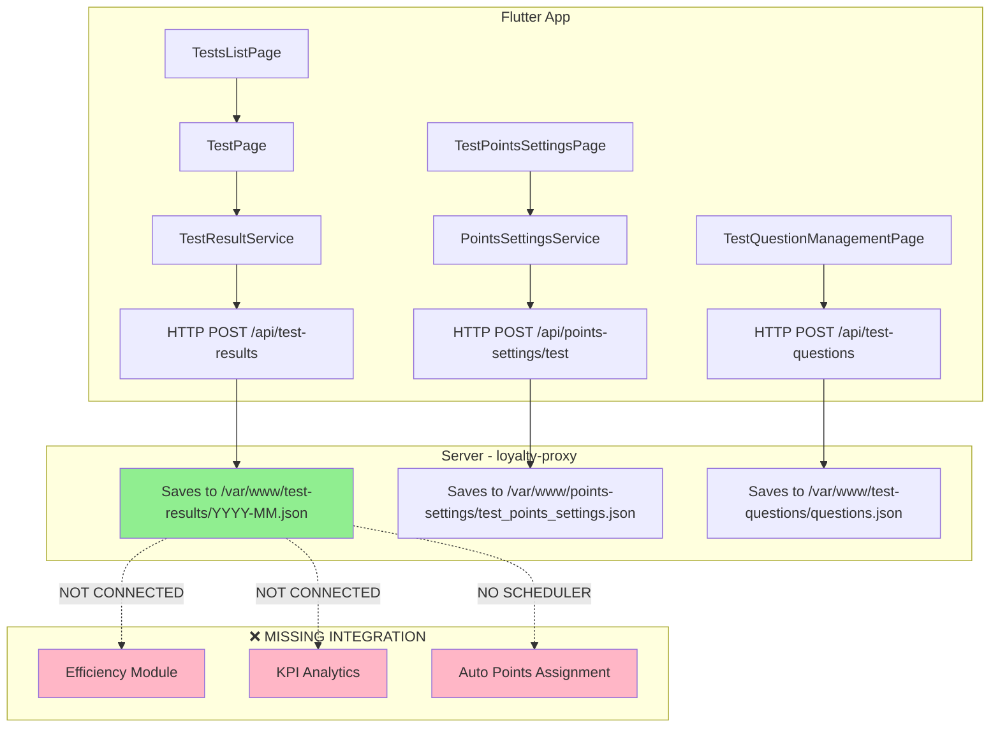

# Анализ модуля "Тестирование" (Testing Module)

**Дата:** 2026-01-26
**Статус:** ✅ Модуль работает для прохождения тестов, ❌ Баллы НЕ начисляются автоматически

---

## 📋 Содержание

1. [Архитектура модуля](#архитектура-модуля)
2. [Файловая структура](#файловая-структура)
3. [Модели данных](#модели-данных)
4. [Флоу прохождения теста](#флоу-прохождения-теста)
5. [Система баллов](#система-баллов)
6. [API эндпоинты](#api-эндпоинты)
7. [Проверка корректности](#проверка-корректности)
8. [❌ Критические проблемы](#критические-проблемы)
9. [📈 Точки роста](#точки-роста)
10. [💡 Рекомендации](#рекомендации)

---

## Архитектура модуля



---

## Файловая структура

### Flutter (`lib/features/tests/`)

| Файл | Назначение | Статус |
|------|------------|--------|
| `models/test_model.dart` | Модель теста и вопросов | ✅ Работает |
| `models/test_result_model.dart` | Модель результата теста | ✅ Работает |
| `pages/test_page.dart` | Страница прохождения теста | ✅ Работает |
| `pages/tests_list_page.dart` | Список доступных тестов | ✅ Работает |
| `pages/test_question_management_page.dart` | Управление вопросами (админ) | ✅ Работает |
| `pages/test_result_history_page.dart` | История результатов | ✅ Работает |
| `services/test_result_service.dart` | Сервис сохранения результатов | ⚠️ Нет интеграции с efficiency |
| `services/test_questions_service.dart` | Сервис загрузки вопросов | ✅ Работает |

### Efficiency Module Integration

| Файл | Назначение | Статус |
|------|------------|--------|
| `lib/features/efficiency/models/points_settings_model.dart` | TestPointsSettings модель | ✅ Работает |
| `lib/features/efficiency/pages/settings_tabs/test_points_settings_page.dart` | UI настройки баллов | ✅ Работает |
| `lib/features/efficiency/services/points_settings_service.dart` | Сервис сохранения настроек | ✅ Работает |

### Server (`loyalty-proxy/`)

| Endpoint | Файл/Строки | Статус |
|----------|-------------|--------|
| GET/POST /api/test-questions | index.js:6158-6217 | ✅ Работает |
| PUT /api/test-questions/:id | index.js:6219-6263 | ✅ Работает |
| DELETE /api/test-questions/:id | index.js:6265-6282 | ✅ Работает |
| POST /api/test-results | index.js:6284-6290 | ⚠️ Только сохранение, нет начисления баллов |

---

## Модели данных

### TestQuestion (test_model.dart:1-95)

```dart
class TestQuestion {
  final String id;
  final String questionText;
  final List<String> options;
  final int correctOptionIndex;
  final String? imageUrl;
  final String category;

  // Рандомизация вопросов
  static List<TestQuestion> getRandomQuestions(
    List<TestQuestion> allQuestions,
    int count
  ) {
    if (allQuestions.length <= count) {
      final result = List<TestQuestion>.from(allQuestions);
      result.shuffle(Random());
      return result;
    }
    final shuffled = List<TestQuestion>.from(allQuestions);
    shuffled.shuffle(Random());
    return List<TestQuestion>.from(shuffled.take(count));
  }
}
```

**Статус:** ✅ Работает корректно

---

### TestResult (test_result_model.dart:1-53)

```dart
class TestResult {
  final String id;
  final String employeeName;
  final String employeePhone;
  final int score;              // Количество правильных ответов
  final int totalQuestions;     // Всего вопросов
  final int timeSpent;          // Время в секундах
  final String timestamp;
  final String? shopAddress;

  // Процент правильных ответов
  double get percentage => totalQuestions > 0
    ? (score / totalQuestions) * 100
    : 0;

  // Форматированное время "MM:SS"
  String get formattedTime {
    final minutes = timeSpent ~/ 60;
    final seconds = timeSpent % 60;
    return '${minutes.toString().padLeft(2, '0')}:${seconds.toString().padLeft(2, '0')}';
  }
}
```

**Статус:** ✅ Работает корректно
**Проблема:** ❌ Не содержит поле `points` - баллы не рассчитываются при сохранении

---

### TestPointsSettings (points_settings_model.dart:830-897)

```dart
class TestPointsSettings {
  final String id;
  final String category;
  final double maxPoints;      // Максимум баллов (например, 5)
  final double minPoints;      // Минимум баллов (например, -2)
  final int zeroThreshold;     // Порог для 0 баллов (например, 12 из 20)
  final DateTime? createdAt;
  final DateTime? updatedAt;

  // Алгоритм расчета баллов (линейная интерполяция)
  double calculatePoints(int score, int totalQuestions) {
    if (totalQuestions == 0) return 0;

    if (score <= 0) return minPoints;
    if (score >= totalQuestions) return maxPoints;

    // Если результат ниже порога 0 баллов
    if (score <= zeroThreshold) {
      // Интерполяция от minPoints до 0
      return minPoints + (0 - minPoints) * (score / zeroThreshold);
    } else {
      // Интерполяция от 0 до maxPoints
      final range = totalQuestions - zeroThreshold;
      return 0 + (maxPoints - 0) * ((score - zeroThreshold) / range);
    }
  }

  factory TestPointsSettings.defaults() {
    return TestPointsSettings(
      maxPoints: 5,
      minPoints: -2,
      zeroThreshold: 12,  // 12 правильных из 20 = 0 баллов
    );
  }
}
```

**Статус:** ✅ Алгоритм корректный
**Проблема:** ❌ Используется только для UI preview, не применяется при сохранении результата

---

## Флоу прохождения теста

### 1. Загрузка теста (tests_list_page.dart → test_page.dart)

```dart
// Загружаются 20 рандомных вопросов
final selectedQuestions = TestQuestion.getRandomQuestions(
  allQuestions,
  20
);
```

### 2. Прохождение теста (test_page.dart:1-150)

```dart
class _TestPageState extends State<TestPage> {
  int _timeRemaining = 420; // 7 минут = 420 секунд
  int _currentQuestionIndex = 0;
  final List<int?> _selectedAnswers = [];

  Timer? _timer;
  bool _testStarted = false;
  bool _testFinished = false;

  void _startTest() {
    setState(() {
      _testStarted = true;
      _timer = Timer.periodic(Duration(seconds: 1), (timer) {
        if (_timeRemaining > 0) {
          setState(() => _timeRemaining--);
        } else {
          _finishTest(timeExpired: true);
        }
      });
    });
  }

  void _finishTest({bool timeExpired = false}) async {
    _timer?.cancel();

    // Подсчет правильных ответов
    int score = 0;
    for (int i = 0; i < widget.questions.length; i++) {
      if (_selectedAnswers[i] == widget.questions[i].correctOptionIndex) {
        score++;
      }
    }

    // Время прохождения
    final timeSpent = 420 - _timeRemaining;

    setState(() => _testFinished = true);

    // ❌ ПРОБЛЕМА: Сохраняет результат БЕЗ начисления баллов
    final success = await TestResultService.saveResult(
      employeeName: employeeName,
      employeePhone: employeePhone,
      score: score,
      totalQuestions: widget.questions.length,
      timeSpent: timeSpent,
    );

    // Показывает диалог с результатом
    // НО: Баллы НЕ начисляются в модуль эффективности!
  }
}
```

**Статус:** ✅ Тест проходится корректно
**Проблема:** ❌ После завершения теста баллы не начисляются автоматически

---

### 3. Сохранение результата (test_result_service.dart)

```dart
static Future<bool> saveResult({
  required String employeeName,
  required String employeePhone,
  required int score,
  required int totalQuestions,
  required int timeSpent,
}) async {
  try {
    // Получаем данные сотрудника
    final employeeService = EmployeeService();
    final employee = await employeeService.getEmployeeByPhone(employeePhone);

    final result = TestResult(
      id: 'test_${DateTime.now().millisecondsSinceEpoch}',
      employeeName: employeeName,
      employeePhone: employeePhone,
      score: score,
      totalQuestions: totalQuestions,
      timeSpent: timeSpent,
      timestamp: DateTime.now().toIso8601String(),
      shopAddress: employee?.shopAddress,
    );

    // ❌ ПРОБЛЕМА: Только сохраняет результат, НЕ начисляет баллы
    final response = await http.post(
      Uri.parse('https://arabica26.ru/api/test-results'),
      headers: {'Content-Type': 'application/json'},
      body: json.encode(result.toJson()),
    );

    if (response.statusCode == 200 || response.statusCode == 201) {
      // Создаем уведомление (если есть supervisor)
      if (employee?.supervisorPhone != null) {
        await NotificationService.sendTestResultNotification(
          supervisorPhone: employee!.supervisorPhone!,
          employeeName: employeeName,
          score: score,
          totalQuestions: totalQuestions,
        );
      }
      return true;
    }

    return false;
  } catch (e) {
    print('Error saving test result: $e');
    return false;
  }
}
```

**Статус:** ✅ Сохранение работает
**Проблема:** ❌ Отсутствует вызов `EfficiencyDataService` для начисления баллов

---

## Система баллов

### Настройки баллов (TestPointsSettings)

**Конфигурация по умолчанию:**
```dart
maxPoints: 5        // Максимум за 20/20 правильных
minPoints: -2       // Минимум за 0/20 правильных
zeroThreshold: 12   // 12/20 = 0 баллов (60% правильных)
```

### Алгоритм расчета (линейная интерполяция)

**Примеры расчета баллов:**

| Результат | Расчет | Баллы |
|-----------|--------|-------|
| 0/20 | minPoints | **-2.0** |
| 6/20 | -2 + (0 - (-2)) × (6/12) = -2 + 1 | **-1.0** |
| 12/20 | zeroThreshold | **0.0** |
| 16/20 | 0 + (5 - 0) × ((16-12)/(20-12)) = 5 × 0.5 | **+2.5** |
| 20/20 | maxPoints | **+5.0** |

**График зависимости:**

```
Баллы
  +5 │                               ●
     │                           ╱
  +2.5│                       ●
     │                   ╱
   0 │               ●───────────────
     │           ╱
  -1 │       ●
     │   ╱
  -2 │●
     └─────────────────────────────── Результат
       0   6   12  16        20
```

**Статус:** ✅ Алгоритм математически корректен
**Проблема:** ❌ Применяется только в UI для preview, не используется при сохранении

---

## API эндпоинты

### Server: loyalty-proxy/index.js

#### 1. GET /api/test-questions (lines 6158-6189)

```javascript
app.get('/api/test-questions', (req, res) => {
  const filePath = path.join('/var/www/test-questions', 'questions.json');

  if (!fs.existsSync(filePath)) {
    return res.json([]);
  }

  try {
    const data = fs.readFileSync(filePath, 'utf8');
    const questions = JSON.parse(data);
    res.json(questions);
  } catch (error) {
    console.error('Error reading test questions:', error);
    res.status(500).json({ error: 'Failed to load test questions' });
  }
});
```

**Статус:** ✅ Работает

---

#### 2. POST /api/test-questions (lines 6191-6217)

```javascript
app.post('/api/test-questions', (req, res) => {
  const { id, questionText, options, correctOptionIndex, imageUrl, category } = req.body;

  const dirPath = '/var/www/test-questions';
  const filePath = path.join(dirPath, 'questions.json');

  if (!fs.existsSync(dirPath)) {
    fs.mkdirSync(dirPath, { recursive: true });
  }

  let questions = [];
  if (fs.existsSync(filePath)) {
    const data = fs.readFileSync(filePath, 'utf8');
    questions = JSON.parse(data);
  }

  const newQuestion = { id, questionText, options, correctOptionIndex, imageUrl, category };
  questions.push(newQuestion);

  fs.writeFileSync(filePath, JSON.stringify(questions, null, 2), 'utf8');
  res.status(201).json({ success: true, question: newQuestion });
});
```

**Статус:** ✅ Работает

---

#### 3. POST /api/test-results (lines 6284-6290)

```javascript
app.post('/api/test-results', (req, res) => {
  const { id, employeeName, employeePhone, score, totalQuestions, timeSpent, timestamp, shopAddress } = req.body;

  const now = new Date(timestamp || Date.now());
  const monthKey = now.toISOString().substring(0, 7); // YYYY-MM

  const dirPath = '/var/www/test-results';
  const filePath = path.join(dirPath, `${monthKey}.json`);

  if (!fs.existsSync(dirPath)) {
    fs.mkdirSync(dirPath, { recursive: true });
  }

  let results = [];
  if (fs.existsSync(filePath)) {
    try {
      const data = fs.readFileSync(filePath, 'utf8');
      results = JSON.parse(data);
    } catch (e) {
      console.error('Error reading test results:', e);
    }
  }

  const result = {
    id,
    employeeName,
    employeePhone,
    score,
    totalQuestions,
    timeSpent,
    timestamp: now.toISOString(),
    shopAddress,
  };

  results.push(result);

  fs.writeFileSync(filePath, JSON.stringify(results, null, 2), 'utf8');

  // ❌ ПРОБЛЕМА: Результат сохранен, но баллы НЕ начислены!
  // НУЖНО ДОБАВИТЬ: Начисление баллов в efficiency-penalties

  res.status(201).json({ success: true, result });
});
```

**Статус:** ⚠️ Работает, но НЕ начисляет баллы
**Проблема:** ❌ Отсутствует интеграция с `/var/www/efficiency-penalties/`

---

#### 4. GET /api/points-settings/test

```javascript
// ❌ ENDPOINT НЕ НАЙДЕН В КОДЕ!
// Возможно, используется общий endpoint /api/points-settings
```

**Статус:** ❓ Требуется проверка

---

## Проверка корректности

### ✅ Что работает корректно

| Функционал | Статус | Описание |
|------------|--------|----------|
| Загрузка вопросов | ✅ | Вопросы загружаются с сервера |
| Рандомизация вопросов | ✅ | 20 случайных вопросов из базы |
| Таймер теста | ✅ | 7 минут (420 секунд) работает |
| Подсчет правильных ответов | ✅ | Подсчитывается корректно |
| Сохранение результата | ✅ | Сохраняется в `/var/www/test-results/` |
| Уведомление супервайзера | ✅ | Push-notification отправляется |
| UI настройки баллов | ✅ | Админ может настроить max/min/threshold |
| Алгоритм расчета баллов | ✅ | Линейная интерполяция работает |
| История результатов | ✅ | Отображается на TestResultHistoryPage |

---

### ❌ Что НЕ работает

| Функционал | Проблема | Критичность |
|------------|----------|-------------|
| **Автоматическое начисление баллов** | Баллы НЕ начисляются в модуль эффективности | 🔴 **КРИТИЧНО** |
| Интеграция с Efficiency | Нет связи TestResultService ↔ EfficiencyDataService | 🔴 **КРИТИЧНО** |
| Scheduler для обработки | Нет scheduler для пакетной обработки результатов | 🟡 Средне |
| KPI аналитика | Результаты тестов не попадают в KPI модуль | 🟡 Средне |
| API endpoint настроек | GET /api/points-settings/test не найден | 🟢 Низко |

---

## ❌ Критические проблемы

### Проблема #1: Баллы не начисляются автоматически

**Описание:**
После прохождения теста результат сохраняется в `/var/www/test-results/YYYY-MM.json`, но баллы **НЕ начисляются** в модуль эффективности `/var/www/efficiency-penalties/YYYY-MM.json`.

**Текущий флоу:**
```
Сотрудник проходит тест
  ↓
TestResultService.saveResult()
  ↓
POST /api/test-results
  ↓
Сохранение в /var/www/test-results/2026-01.json
  ↓
❌ КОНЕЦ (баллы не начислены)
```

**Ожидаемый флоу:**
```
Сотрудник проходит тест
  ↓
TestResultService.saveResult()
  ↓
POST /api/test-results
  ↓
Сохранение в /var/www/test-results/2026-01.json
  ↓
✅ Расчет баллов через TestPointsSettings
  ↓
✅ Запись в /var/www/efficiency-penalties/2026-01.json
  ↓
✅ Отображение в модуле "Моя эффективность"
```

---

### Проблема #2: TestPointsSettings не применяется

**Описание:**
Модель `TestPointsSettings` содержит корректный алгоритм расчета баллов, но используется **только для UI preview** на странице настроек. При фактическом сохранении результата теста этот алгоритм не применяется.

**Где используется:**
- ✅ `test_points_settings_page.dart` - для отображения preview графика
- ❌ `test_result_service.dart` - НЕ используется при сохранении результата
- ❌ `loyalty-proxy/index.js` - НЕ используется на сервере

---

### Проблема #3: Нет дедупликации

**Описание:**
Отсутствует механизм дедупликации для предотвращения повторного начисления баллов за один и тот же результат теста.

**Рекомендация:**
Добавить `sourceId` по аналогии с другими модулями:
```javascript
const sourceId = `test_${result.id}`;
const exists = penalties.some(p => p.sourceId === sourceId);
if (exists) {
  console.log(`Points already assigned for test ${result.id}`);
  return;
}
```

---

## 📈 Точки роста

### 1. 🔴 Автоматическое начисление баллов за тесты

**Приоритет:** КРИТИЧНЫЙ
**Сложность:** Средняя
**Влияние:** Высокое

**Что сделать:**
1. Добавить функцию `assignTestPoints()` в `loyalty-proxy/index.js`
2. Вызывать её после сохранения результата в POST `/api/test-results`
3. Загружать настройки из `/var/www/points-settings/test_points_settings.json`
4. Рассчитывать баллы через алгоритм линейной интерполяции
5. Записывать в `/var/www/efficiency-penalties/YYYY-MM.json` с категорией `test_bonus` / `test_penalty`
6. Использовать дедупликацию через `sourceId = "test_{testResultId}"`

**Пример кода (server):**
```javascript
// После сохранения результата в POST /api/test-results
async function assignTestPoints(result) {
  const settingsFile = path.join('/var/www/points-settings', 'test_points_settings.json');
  let settings = { maxPoints: 5, minPoints: -2, zeroThreshold: 12 };

  if (fs.existsSync(settingsFile)) {
    try {
      settings = JSON.parse(fs.readFileSync(settingsFile, 'utf8'));
    } catch (e) {
      console.error('Error loading test settings:', e);
    }
  }

  // Расчет баллов (линейная интерполяция)
  const { score, totalQuestions } = result;
  let points = 0;

  if (score <= 0) {
    points = settings.minPoints;
  } else if (score >= totalQuestions) {
    points = settings.maxPoints;
  } else if (score <= settings.zeroThreshold) {
    // Интерполяция от minPoints до 0
    points = settings.minPoints + (0 - settings.minPoints) * (score / settings.zeroThreshold);
  } else {
    // Интерполяция от 0 до maxPoints
    const range = totalQuestions - settings.zeroThreshold;
    points = (settings.maxPoints - 0) * ((score - settings.zeroThreshold) / range);
  }

  // Округление до 2 знаков
  points = Math.round(points * 100) / 100;

  // Дедупликация
  const sourceId = `test_${result.id}`;
  const monthKey = result.timestamp.substring(0, 7);
  const penaltiesFile = path.join('/var/www/efficiency-penalties', `${monthKey}.json`);

  let penalties = [];
  if (fs.existsSync(penaltiesFile)) {
    penalties = JSON.parse(fs.readFileSync(penaltiesFile, 'utf8'));
  }

  const exists = penalties.some(p => p.sourceId === sourceId);
  if (exists) {
    console.log(`Points already assigned for test ${result.id}`);
    return;
  }

  // Создание записи
  const entry = {
    id: `test_pts_${Date.now()}_${Math.random().toString(36).substr(2, 9)}`,
    type: 'employee',
    entityId: result.employeePhone,
    entityName: result.employeeName,
    shopAddress: result.shopAddress || '',
    employeeName: result.employeeName,
    category: points >= 0 ? 'test_bonus' : 'test_penalty',
    categoryName: 'Прохождение теста',
    date: result.timestamp.split('T')[0],
    points: points,
    reason: `Тест: ${score}/${totalQuestions} правильных (${Math.round((score/totalQuestions)*100)}%)`,
    sourceId: sourceId,
    sourceType: 'test_result',
    createdAt: new Date().toISOString()
  };

  penalties.push(entry);
  fs.writeFileSync(penaltiesFile, JSON.stringify(penalties, null, 2), 'utf8');

  console.log(`✅ Test points assigned: ${result.employeeName} (${points >= 0 ? '+' : ''}${points} points)`);
}

// В endpoint POST /api/test-results добавить:
results.push(result);
fs.writeFileSync(filePath, JSON.stringify(results, null, 2), 'utf8');

// НОВОЕ: Начисление баллов
await assignTestPoints(result);

res.status(201).json({ success: true, result });
```

---

### 2. 🟡 Scheduler для пакетной обработки результатов

**Приоритет:** Средний
**Сложность:** Низкая
**Влияние:** Среднее

**Что сделать:**
- Создать файл `test_results_penalty_scheduler.js` по аналогии с `product_questions_penalty_scheduler.js`
- Запускать каждый час (cron: `0 * * * *`)
- Проверять `/var/www/test-results/` на наличие необработанных результатов
- Начислять баллы для результатов, которые еще не обработаны (нет sourceId в penalties)

**Польза:**
- Отказоустойчивость: если начисление упало при сохранении, scheduler подхватит
- Возможность пересчета баллов при изменении настроек

---

### 3. 🟡 Интеграция с KPI модулем

**Приоритет:** Средний
**Сложность:** Средняя
**Влияние:** Среднее

**Что сделать:**
- Добавить метрику "Средний результат тестов" в KPI Dashboard
- Отображать тренд изменения результатов по месяцам
- Добавить сравнение результатов тестов между магазинами
- Выводить топ-3 сотрудников по результатам тестов

**Польза:**
- Аналитика эффективности обучения
- Мотивация сотрудников

---

### 4. 🟢 Улучшение UI результата теста

**Приоритет:** Низкий
**Сложность:** Низкая
**Влияние:** Низкое

**Что сделать:**
- Показывать начисленные/снятые баллы сразу после завершения теста
- Добавить анимацию "+2.5 баллов" или "-1.0 баллов"
- Отображать позицию в рейтинге магазина

**Польза:**
- Геймификация
- Мгновенная обратная связь

---

### 5. 🟢 История изменения настроек баллов

**Приоритет:** Низкий
**Сложность:** Низкая
**Влияние:** Низкое

**Что сделать:**
- Сохранять историю изменений `TestPointsSettings`
- Отображать "Кто и когда изменил настройки"
- Добавить возможность отката к предыдущим настройкам

**Польза:**
- Аудит изменений
- Прозрачность системы

---

## 💡 Рекомендации

### Немедленные действия (сделать СЕЙЧАС)

1. ✅ **Добавить автоматическое начисление баллов**
   - Модифицировать `POST /api/test-results` в `loyalty-proxy/index.js`
   - Добавить функцию `assignTestPoints()`
   - Использовать существующий алгоритм из `TestPointsSettings`
   - Начислять баллы в `/var/www/efficiency-penalties/`

2. ✅ **Добавить дедупликацию**
   - Использовать `sourceId = "test_{testResultId}"`
   - Проверять существование записи перед начислением

3. ✅ **Тестирование**
   - Пройти тест с разными результатами (0/20, 12/20, 20/20)
   - Проверить файл `/var/www/efficiency-penalties/2026-01.json`
   - Проверить отображение в модуле "Моя эффективность"

---

### Среднесрочные действия (1-2 недели)

1. **Создать scheduler** для обработки результатов
2. **Добавить метрики** в KPI модуль
3. **Улучшить UI** результата теста

---

### Долгосрочные действия (опционально)

1. Категоризация тестов (безопасность, продукты, обслуживание)
2. Адаптивная сложность (тесты подстраиваются под уровень сотрудника)
3. Сертификаты за успешное прохождение
4. Рейтинг по результатам тестов

---

## Итоговая оценка

| Параметр | Оценка | Комментарий |
|----------|--------|-------------|
| **Архитектура** | 8/10 | Модульная, четкая структура |
| **Код качество** | 9/10 | Чистый, понятный код |
| **Функциональность** | 7/10 | Работает, но баллы не начисляются |
| **Интеграция** | 3/10 | ❌ Нет связи с Efficiency модулем |
| **UX/UI** | 9/10 | Понятный, удобный интерфейс |
| **Отказоустойчивость** | 6/10 | Нет scheduler для повторной обработки |

**Общая оценка:** ⚠️ **6.5/10** - Модуль работает для прохождения тестов, но **критически отсутствует** автоматическое начисление баллов.

---

## Заключение

Модуль тестирования имеет отличную архитектуру и качественный код, но **не выполняет ключевую функцию** - автоматическое начисление баллов за результаты тестов.

**Критический недостаток:**
Баллы НЕ начисляются в модуль эффективности, хотя настройки `TestPointsSettings` и алгоритм расчета баллов уже реализованы и работают корректно.

**Рекомендация:**
Добавить интеграцию с модулем эффективности (Точка роста #1) как приоритетную задачу. После этого модуль можно считать полностью рабочим и добавить в защищенные системы.

---

**Дата создания отчета:** 2026-01-26
**Автор:** Claude Code Analysis
**Версия:** 1.0
